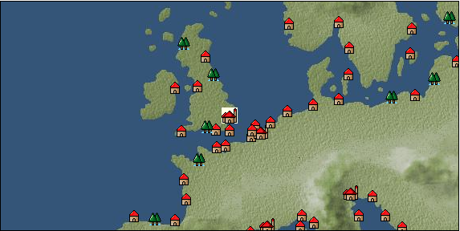

# Port: ロンドン

import Tabs from '@theme/Tabs';
import TabItem from '@theme/TabItem';

## General Information

| Attribute | Details |
| :--- | :--- |
| **Port Name** | london |
| **Port Type** | Headquarters |
| **Region** | northern europe |
| **Sea Area** | Southern Britain |
| **Required Language** | English |
| **Coordinates** | （16324，2418） |
| **Investment Reward** | [Collection of North Sea specialty dishes](Items/Recipe Book/item_731.md) （必要投資額：1,000,000ドゥカード） |

### Available Facilities

| guild | intermediary | exchange | tool shop | workshop craftsman | Painter | sculptor | peddler |
| --- | --- | --- | --- | --- | --- | --- | --- |
| ○ | ○ | ○ | ○ | ○ |   |   | ○ |
| Shipyard Master | Lumbermaker | Sail-maker | weapon craftsman | master | TavernFemale | archive | salesperson |
| --- | --- | --- | --- | --- | --- | --- | --- |
| ○ | ○ | ○ | ○ | ○ | ○ | ○ | ○ |
| Shipwright | 銀行 | street worker | 王宮 | Trading post | church | suburbs | translator |
| --- | --- | --- | --- | --- | --- | --- | --- |
| ○ | ○ |   | ○ | ○ | ○ |   | ○ |

### Description
The city is based on Londinium, a fort built by the ancient Romans. It flourished from around the 11th century and is now the center of England. In addition to trading in an abundance of wool, smelting technology is making remarkable progress thanks to the mineral resources of the surrounding towns. Tavern Girl: Angela (Help Girl: Mary) Beginner Navigator Training School Cultural Area: British Islands

<Tabs>
  <TabItem value="trade_goods_sales" label="Trade Goods Sales">

| item | group | purchase price | 同盟時 | remarks |
| --- | --- | --- | --- | --- |
| [whiskey](Items/Trade Goods/TradeGoods-Alcohol/item_1.md) | [交易品（酒類）](Categories/category_9.md) | 612 | 552 |  |
| [butter](Items/Trade Goods/TradeGoods-Seasonings/item_3.md) | [交易品（調味料）](Categories/category_4.md) | 310 | 272 |  |
| [Beer](Items/Trade Goods/TradeGoods-Alcohol/item_2.md) | [交易品（酒類）](Categories/category_9.md) | 275 | 248 |  |
| [大砲](Items/Trade Goods/TradeGoods-Firearms/item_4.md) | [Trading Items (Firearms)](Categories/category_17.md) | 3,610 | 3,250 |  |
| [brass](Items/Trade Goods/TradeGoods-Wares/item_624.md) | [交易品（工業品）](Categories/category_19.md) | (768) | 672 |  |
| 要投資（必要投資額：320,000） |
| [paper](Items/Trade Goods/TradeGoods-Wares/item_625.md) | [交易品（工業品）](Categories/category_19.md) | (301) | 264 |  |
| 要投資（必要投資額：240,000） |
| [wool](Items/Trade Goods/TradeGoods-Fibers/item_5.md) | [交易品（繊維）](Categories/category_1.md) | 370 | 324 |  |
| [western armor](Items/Trade Goods/TradeGoods-Weapons/item_6.md) | [Trading Items (Arms)](Categories/category_16.md) | 2,400 | 2,246 |  |
| [iron material](Items/Trade Goods/TradeGoods-Wares/item_268.md) | [交易品（工業品）](Categories/category_19.md) | (843) | 738 |  |
| 要投資（必要投資額：180,000） |
| [青銅](Items/Trade Goods/TradeGoods-Wares/item_7.md) | [交易品（工業品）](Categories/category_19.md) | 918 | 864 |  |
  </TabItem>
  <TabItem value="sale_specialty" label="Sale (Specialty)">

| item | group | sale price | 同盟時 | remarks |
| --- | --- | --- | --- | --- |

#### [交易品（繊維）](Categories/category_1.md)

| [Basho](Items/Trade Goods/TradeGoods-Fibers/item_3862.md) | 交易品（繊維） | (36,354) | 42,420 |  |
| [tiger skin](Items/Trade Goods/TradeGoods-Fibers/item_3790.md) | 交易品（繊維） | 33,649 | (37,858) |  |
| [Green ramie](Items/Trade Goods/TradeGoods-Fibers/item_3428.md) | 交易品（繊維） | (23,980) | 27,981 |  |
| [deerskin](Items/Trade Goods/TradeGoods-Fibers/item_3648.md) | 交易品（繊維） | (22,999) | 26,836 |  |

#### [Trading Goods (Dye)](Categories/category_2.md)

| [Indian Akane](Items/Trade Goods/TradeGoods-Dye/item_1037.md) | Trading Goods (Dye) | (1,138) | 1,327 |  |
| [Indian indigo](Items/Trade Goods/TradeGoods-Dye/item_157.md) | Trading Goods (Dye) | 1,274 | 1,400 |  |
| [ward](Items/Trade Goods/TradeGoods-Dye/item_57.md) | Trading Goods (Dye) | 1,306 | (1,469) |  |
| [cochineal](Items/Trade Goods/TradeGoods-Dye/item_1817.md) | Trading Goods (Dye) | (1,598) | 1,864 |  |
| [natal indigo](Items/Trade Goods/TradeGoods-Dye/item_4102.md) | Trading Goods (Dye) | (3,087) | 3,602 |  |
| [Safflower](Items/Trade Goods/TradeGoods-Dye/item_1059.md) | Trading Goods (Dye) | 813 | (914) |  |
| [mayan blue](Items/Trade Goods/TradeGoods-Dye/item_1096.md) | Trading Goods (Dye) | (1,485) | 1,732 |  |
| [log wood](Items/Trade Goods/TradeGoods-Dye/item_1813.md) | Trading Goods (Dye) | (1,748) | 2,039 |  |
| [gallnut](Items/Trade Goods/TradeGoods-Dye/item_3429.md) | Trading Goods (Dye) | 28,334 | 30,000 |  |
| [purple root](Items/Trade Goods/TradeGoods-Dye/item_3752.md) | Trading Goods (Dye) | (22,923) | 26,747 |  |

#### [Trading items (food items)](Categories/category_3.md)

| [buckwheat](Items/Trade Goods/TradeGoods-Foodstuffs/item_3430.md) | Trading items (food items) | 33,724 | (37,943) |  |
| [Karasumi](Items/Trade Goods/TradeGoods-Foodstuffs/item_3687.md) | Trading items (food items) | 32,831 | (36,938) |  |
| [kangaroo meat](Items/Trade Goods/TradeGoods-Foodstuffs/item_2285.md) | Trading items (food items) | 944 | (1,062) |  |
| [楊州栗](Items/Trade Goods/TradeGoods-Foodstuffs/item_3789.md) | Trading items (food items) | 10,169 | 11,112 |  |

#### [交易品（調味料）](Categories/category_4.md)

| [oyster sauce](Items/Trade Goods/TradeGoods-Seasonings/item_3505.md) | 交易品（調味料） | (2,806) | 3,274 |  |
| [Choshi](Items/Trade Goods/TradeGoods-Seasonings/item_3793.md) | 交易品（調味料） | (33,087) | 38,607 |  |
| [maple syrup](Items/Trade Goods/TradeGoods-Seasonings/item_4028.md) | 交易品（調味料） | 3,875 | (4,359) |  |
| [miso](Items/Trade Goods/TradeGoods-Seasonings/item_3420.md) | 交易品（調味料） | 4,188 | (4,711) |  |
| [Sha Cha Ji](Items/Trade Goods/TradeGoods-Seasonings/item_3689.md) | 交易品（調味料） | 32,381 | (36,432) |  |
| [Bean sauce](Items/Trade Goods/TradeGoods-Seasonings/item_3875.md) | 交易品（調味料） | (25,574) | 29,841 |  |
| [soy sauce](Items/Trade Goods/TradeGoods-Seasonings/item_3425.md) | 交易品（調味料） | (26,310) | 30,699 |  |
| [black vinegar](Items/Trade Goods/TradeGoods-Seasonings/item_3475.md) | 交易品（調味料） | 4,946 | (5,564) |  |

#### [交易品（雑貨）](Categories/category_5.md)

| [old ink stick](Items/Trade Goods/TradeGoods-Misc/item_3921.md) | 交易品（雑貨） | (9,427) | 11,000 |  |
| [Japanese books](Items/Trade Goods/TradeGoods-Misc/item_3439.md) | 交易品（雑貨） | (25,502) | 29,757 |  |
| [lantern](Items/Trade Goods/TradeGoods-Misc/item_3683.md) | 交易品（雑貨） | 36,700 | 42,500 |  |
| Alliance 100% confirmed |
| [Korean books](Items/Trade Goods/TradeGoods-Misc/item_3750.md) | 交易品（雑貨） | 46,347 | 37,255 |  |
| [rattan work](Items/Trade Goods/TradeGoods-Misc/item_3698.md) | 交易品（雑貨） | (22,889) | 26,708 |  |

#### [Trading products (medical products)](Categories/category_6.md)

| [Borei](Items/Trade Goods/TradeGoods-Medicine/item_3678.md) | Trading products (medical products) | (23,437) | 27,347 |  |
| [mercury agent](Items/Trade Goods/TradeGoods-Medicine/item_703.md) | Trading products (medical products) | 1,550 | (1,743) |  |
| [Nothing](Items/Trade Goods/TradeGoods-Medicine/item_1053.md) | Trading products (medical products) | 841 | (946) |  |
| [dragon blood](Items/Trade Goods/TradeGoods-Medicine/item_4209.md) | Trading products (medical products) | (7,295) | 8,512 |  |
| [calamus](Items/Trade Goods/TradeGoods-Medicine/item_3427.md) | Trading products (medical products) | 35,810 | 52,300 |  |
| When in alliance: confirmed at 100% |

#### [Trading Items (Iron Stone)](Categories/category_7.md)

| [white porcelain ore](Items/Trade Goods/TradeGoods-Minerals/item_3433.md) | Trading Items (Iron Stone) | (26,063) | 30,411 |  |
| [medical stone](Items/Trade Goods/TradeGoods-Minerals/item_3786.md) | Trading Items (Iron Stone) | (23,081) | 26,932 |  |

#### [Trading products (precious metals)](Categories/category_8.md)

| [platinum](Items/Trade Goods/TradeGoods-Metals/item_2178.md) | Trading products (precious metals) | (6,835) | 7,975 |  |
| [佐摩銀](Items/Trade Goods/TradeGoods-Metals/item_3432.md) | Trading products (precious metals) | 37,657 | (42,368) |  |
| [Korean silver](Items/Trade Goods/TradeGoods-Metals/item_3796.md) | Trading products (precious metals) | 34,532 | (38,852) |  |

#### [交易品（酒類）](Categories/category_9.md)

| [ice wine](Items/Trade Goods/TradeGoods-Alcohol/item_4659.md) | 交易品（酒類） | (5,519) | 6,439 |  |
| [sherry](Items/Trade Goods/TradeGoods-Alcohol/item_844.md) | 交易品（酒類） | 592 | (666) |  |
| [tequila](Items/Trade Goods/TradeGoods-Alcohol/item_108.md) | 交易品（酒類） | (4,854) | 5,663 |  |
| [Taiwan rice wine](Items/Trade Goods/TradeGoods-Alcohol/item_3672.md) | 交易品（酒類） | (33,137) | 38,666 |  |
| [Andong soju](Items/Trade Goods/TradeGoods-Alcohol/item_3757.md) | 交易品（酒類） | (23,220) | 27,094 |  |
| [Sake](Items/Trade Goods/TradeGoods-Alcohol/item_3424.md) | 交易品（酒類） | (25,539) | 29,800 |  |
| When in alliance: confirmed at 100% |

#### [Trading goods (hobby goods)](Categories/category_10.md)

| [Aigyoku](Items/Trade Goods/TradeGoods-Sunddries/item_3677.md) | Trading goods (hobby goods) | (22,779) | 26,579 |  |
| [almond](Items/Trade Goods/TradeGoods-Sunddries/item_367.md) | Trading goods (hobby goods) | 220 | (247) |  |
| [cacao](Items/Trade Goods/TradeGoods-Sunddries/item_140.md) | Trading goods (hobby goods) | (1,524) | 1,778 |  |
| [cashew nuts](Items/Trade Goods/TradeGoods-Sunddries/item_2120.md) | Trading goods (hobby goods) | 1,038 | 1,151 |  |
| [caviar](Items/Trade Goods/TradeGoods-Sunddries/item_2122.md) | Trading goods (hobby goods) | (1,679) | 1,958 |  |
| [cranberry](Items/Trade Goods/TradeGoods-Sunddries/item_4008.md) | Trading goods (hobby goods) | (1,146) | 1,337 |  |
| [walnut](Items/Trade Goods/TradeGoods-Sunddries/item_522.md) | Trading goods (hobby goods) | 594 | 876 |  |
| [tobacco](Items/Trade Goods/TradeGoods-Sunddries/item_109.md) | Trading goods (hobby goods) | (4,933) | 5,756 |  |
| [chicle](Items/Trade Goods/TradeGoods-Sunddries/item_4083.md) | Trading goods (hobby goods) | (2,351) | 2,743 |  |
| [eggplant](Items/Trade Goods/TradeGoods-Sunddries/item_3426.md) | Trading goods (hobby goods) | 26,422 | (29,727) |  |
| [banana](Items/Trade Goods/TradeGoods-Sunddries/item_1947.md) | Trading goods (hobby goods) | 486 | (546) |  |
| [pineapple](Items/Trade Goods/TradeGoods-Sunddries/item_867.md) | Trading goods (hobby goods) | (2,103) | 2,453 |  |
| [peanuts](Items/Trade Goods/TradeGoods-Sunddries/item_134.md) | Trading goods (hobby goods) | (411) | 479 |  |
| [blueberry](Items/Trade Goods/TradeGoods-Sunddries/item_4657.md) | Trading goods (hobby goods) | (1,140) | 1,330 |  |
| [prune](Items/Trade Goods/TradeGoods-Sunddries/item_523.md) | Trading goods (hobby goods) | 533 | (599) |  |
| [raspberry](Items/Trade Goods/TradeGoods-Sunddries/item_4658.md) | Trading goods (hobby goods) | (1,015) | 1,184 |  |
| [dried figs](Items/Trade Goods/TradeGoods-Sunddries/item_611.md) | Trading goods (hobby goods) | 490 | 508 |  |
| [Korean tea](Items/Trade Goods/TradeGoods-Sunddries/item_3751.md) | Trading goods (hobby goods) | 36,700 | 36,700 |  |
| [black tea](Items/Trade Goods/TradeGoods-Sunddries/item_675.md) | Trading goods (hobby goods) | 8,266 | 9,480 |  |

#### [Trading Goods (Spices)](Categories/category_11.md)

| [ylang ylang](Items/Trade Goods/TradeGoods-Perfume/item_1434.md) | Trading Goods (Spices) | (1,840) | 2,146 |  |
| [orange oil](Items/Trade Goods/TradeGoods-Perfume/item_778.md) | Trading Goods (Spices) | (1,223) | 1,426 |  |
| [oakmoss](Items/Trade Goods/TradeGoods-Perfume/item_819.md) | Trading Goods (Spices) | 1,271 | (1,430) |  |
| [gardenia](Items/Trade Goods/TradeGoods-Perfume/item_1091.md) | Trading Goods (Spices) | 32,924 | (37,043) |  |
| [jasmine](Items/Trade Goods/TradeGoods-Perfume/item_772.md) | Trading Goods (Spices) | 6,266 | (7,049) |  |
| [daffodil](Items/Trade Goods/TradeGoods-Perfume/item_612.md) | Trading Goods (Spices) | 1,250 | (1,406) |  |
| [geranium](Items/Trade Goods/TradeGoods-Perfume/item_145.md) | Trading Goods (Spices) | (1,106) | 1,290 |  |
| [Chindarle](Items/Trade Goods/TradeGoods-Perfume/item_3795.md) | Trading Goods (Spices) | 33,334 | (37,504) |  |
| [patchouli](Items/Trade Goods/TradeGoods-Perfume/item_1963.md) | Trading Goods (Spices) | (2,757) | 3,216 |  |
| [mastic](Items/Trade Goods/TradeGoods-Perfume/item_680.md) | Trading Goods (Spices) | (2,954) | 3,446 |  |
| [benzoin](Items/Trade Goods/TradeGoods-Perfume/item_1962.md) | Trading Goods (Spices) | 1,990 | 2,306 |  |
| [sandalwood](Items/Trade Goods/TradeGoods-Perfume/item_771.md) | Trading Goods (Spices) | 6,380 | 6,760 |  |
| [貝甲香](Items/Trade Goods/TradeGoods-Perfume/item_776.md) | Trading Goods (Spices) | (2,211) | 2,579 |  |
| [龍脳](Items/Trade Goods/TradeGoods-Perfume/item_1676.md) | Trading Goods (Spices) | (2,803) | 3,270 |  |

#### [Trading Goods (Spices)](Categories/category_12.md)

| [allspice](Items/Trade Goods/TradeGoods-Spices/item_1848.md) | Trading Goods (Spices) | 4,540 | (5,107) |  |
| [cardamom](Items/Trade Goods/TradeGoods-Spices/item_1431.md) | Trading Goods (Spices) | (4,596) | 5,362 |  |
| [cloves](Items/Trade Goods/TradeGoods-Spices/item_1092.md) | Trading Goods (Spices) | (7,798) | 9,099 |  |
| [Kouzuku](Items/Trade Goods/TradeGoods-Spices/item_3690.md) | Trading Goods (Spices) | 33,056 | (37,191) |  |
| [pepper](Items/Trade Goods/TradeGoods-Spices/item_58.md) | Trading Goods (Spices) | (12,513) | 14,600 |  |
| [saffron](Items/Trade Goods/TradeGoods-Spices/item_845.md) | Trading Goods (Spices) | (2,780) | 3,243 |  |
| [Sanshou](Items/Trade Goods/TradeGoods-Spices/item_3794.md) | Trading Goods (Spices) | 33,115 | (37,257) |  |
| [cinnamon](Items/Trade Goods/TradeGoods-Spices/item_1432.md) | Trading Goods (Spices) | 7,339 | (8,257) |  |
| [nutmeg](Items/Trade Goods/TradeGoods-Spices/item_1969.md) | Trading Goods (Spices) | (20,520) | 23,943 |  |
| [mace](Items/Trade Goods/TradeGoods-Spices/item_2100.md) | Trading Goods (Spices) | 13,280 | (14,941) |  |
| [chili pepper](Items/Trade Goods/TradeGoods-Spices/item_1831.md) | Trading Goods (Spices) | 6,410 | 7,398 |  |
| [Grapefruit](Items/Trade Goods/TradeGoods-Spices/item_3422.md) | Trading Goods (Spices) | 35,313 | 41,700 |  |
| [green chili pepper](Items/Trade Goods/TradeGoods-Spices/item_1990.md) | Trading Goods (Spices) | 6,454 | 7,419 |  |

#### [Trading goods (artificial goods)](Categories/category_13.md)

| [glasswork](Items/Trade Goods/TradeGoods-Luxuries/item_60.md) | Trading goods (artificial goods) | 1,594 | 1,829 |  |
| [Tumbaga](Items/Trade Goods/TradeGoods-Luxuries/item_3028.md) | Trading goods (artificial goods) | 19,796 | 21,633 |  |
| [Kuresute](Items/Trade Goods/TradeGoods-Luxuries/item_3897.md) | Trading goods (artificial goods) | 40,381 | 46,728 |  |
| [ethnic costume](Items/Trade Goods/TradeGoods-Luxuries/item_4050.md) | Trading goods (artificial goods) | (5,023) | 5,860 |  |
| [lacquerware](Items/Trade Goods/TradeGoods-Luxuries/item_3435.md) | Trading goods (artificial goods) | 29,184 | 42,100 |  |
| [Corner work](Items/Trade Goods/TradeGoods-Luxuries/item_3696.md) | Trading goods (artificial goods) | (23,042) | 26,886 |  |
| [Goryeo celadon](Items/Trade Goods/TradeGoods-Luxuries/item_3758.md) | Trading goods (artificial goods) | (22,918) | 26,742 |  |

#### [交易品（美術品）](Categories/category_14.md)

| [taiwan wood carving](Items/Trade Goods/TradeGoods-Art/item_3697.md) | 交易品（美術品） | (33,903) | 39,559 |  |
| [Japanese painting](Items/Trade Goods/TradeGoods-Art/item_3436.md) | 交易品（美術品） | 34,800 | (39,153) |  |
| [oil painting](Items/Trade Goods/TradeGoods-Art/item_1088.md) | 交易品（美術品） | (2,143) | 2,500 |  |
| [Mother-of-pearl lacquerware](Items/Trade Goods/TradeGoods-Art/item_3785.md) | 交易品（美術品） | (23,285) | 27,170 |  |

#### [Trading Items (Gemstones)](Categories/category_15.md)

| [jade](Items/Trade Goods/TradeGoods-Gems/item_2015.md) | Trading Items (Gemstones) | (5,163) | 6,024 |  |
| [Tortoiseshell](Items/Trade Goods/TradeGoods-Gems/item_1980.md) | Trading Items (Gemstones) | (3,799) | 4,432 |  |
| [aventurine](Items/Trade Goods/TradeGoods-Gems/item_678.md) | Trading Items (Gemstones) | 5,658 | (6,365) |  |
| [inca rose](Items/Trade Goods/TradeGoods-Gems/item_3014.md) | Trading Items (Gemstones) | 15,834 | 17,500 |  |
| [opal](Items/Trade Goods/TradeGoods-Gems/item_2006.md) | Trading Items (Gemstones) | 7,174 | 7,943 |  |
| [cat's eye](Items/Trade Goods/TradeGoods-Gems/item_1047.md) | Trading Items (Gemstones) | 10,675 | (12,010) |  |
| [sapphire](Items/Trade Goods/TradeGoods-Gems/item_676.md) | Trading Items (Gemstones) | 12,932 | (14,549) |  |
| [turquoise](Items/Trade Goods/TradeGoods-Gems/item_1006.md) | Trading Items (Gemstones) | (3,768) | 4,396 |  |
| [diamond](Items/Trade Goods/TradeGoods-Gems/item_449.md) | Trading Items (Gemstones) | (7,756) | 9,050 |  |
| When in alliance: confirmed at 100% |
| [topaz](Items/Trade Goods/TradeGoods-Gems/item_1097.md) | Trading Items (Gemstones) | (4,885) | 5,700 |  |
| [pink diamond](Items/Trade Goods/TradeGoods-Gems/item_2874.md) | Trading Items (Gemstones) | (13,627) | 15,900 |  |
| When in alliance: confirmed at 100% |
| [ruby](Items/Trade Goods/TradeGoods-Gems/item_773.md) | Trading Items (Gemstones) | 13,963 | (15,709) |  |
| [amethyst](Items/Trade Goods/TradeGoods-Gems/item_3434.md) | Trading Items (Gemstones) | 37,156 | (41,804) |  |
| [mutton fat white jade](Items/Trade Goods/TradeGoods-Gems/item_3903.md) | Trading Items (Gemstones) | (37,306) | 43,530 |  |
| [tiger eye stone](Items/Trade Goods/TradeGoods-Gems/item_3797.md) | Trading Items (Gemstones) | 33,040 | (37,173) |  |

#### [Trading Items (Arms)](Categories/category_16.md)

| [crossbow](Items/Trade Goods/TradeGoods-Weapons/item_537.md) | Trading Items (Arms) | 1,255 | (1,412) |  |
| [broadsword](Items/Trade Goods/TradeGoods-Weapons/item_3754.md) | Trading Items (Arms) | (22,914) | 26,737 |  |
| [Japanese sword](Items/Trade Goods/TradeGoods-Weapons/item_3437.md) | Trading Items (Arms) | (33,621) | 39,231 |  |
| [short bow](Items/Trade Goods/TradeGoods-Weapons/item_3764.md) | Trading Items (Arms) | (11,428) | 13,334 |  |
| [長弓](Items/Trade Goods/TradeGoods-Weapons/item_1049.md) | Trading Items (Arms) | 911 | (1,024) |  |

#### [Trading Items (Firearms)](Categories/category_17.md)

| [musket gun](Items/Trade Goods/TradeGoods-Firearms/item_584.md) | Trading Items (Firearms) | 3,442 | 3,625 |  |
| [monocular gun](Items/Trade Goods/TradeGoods-Firearms/item_3916.md) | Trading Items (Firearms) | (24,573) | 28,673 |  |
| [throwing bomb](Items/Trade Goods/TradeGoods-Firearms/item_3784.md) | Trading Items (Firearms) | (23,005) | 26,843 |  |
| [tanegashima gun](Items/Trade Goods/TradeGoods-Firearms/item_3423.md) | Trading Items (Firearms) | (24,039) | 28,050 |  |
| [銅手銃](Items/Trade Goods/TradeGoods-Firearms/item_3700.md) | Trading Items (Firearms) | (32,116) | 37,474 |  |

#### [Trading Goods (Livestock)](Categories/category_18.md)

| [boar](Items/Trade Goods/TradeGoods-Livestock/item_3476.md) | Trading Goods (Livestock) | (23,654) | 27,600 |  |
| [韓牛](Items/Trade Goods/TradeGoods-Livestock/item_3792.md) | Trading Goods (Livestock) | (23,139) | 27,000 |  |

#### [交易品（工業品）](Categories/category_19.md)

| [rubber](Items/Trade Goods/TradeGoods-Wares/item_2819.md) | 交易品（工業品） | 1,745 | 1,929 |  |
| [Japanese paper](Items/Trade Goods/TradeGoods-Wares/item_3438.md) | 交易品（工業品） | (32,824) | 38,300 |  |
| [marble](Items/Trade Goods/TradeGoods-Wares/item_52.md) | 交易品（工業品） | 1,871 | (2,105) |  |
| [rattan](Items/Trade Goods/TradeGoods-Wares/item_3701.md) | 交易品（工業品） | 31,539 | (35,484) |  |
| [rosewood](Items/Trade Goods/TradeGoods-Wares/item_5559.md) | 交易品（工業品） | (11,368) | 13,264 |  |
| [羊皮紙](Items/Trade Goods/TradeGoods-Wares/item_53.md) | 交易品（工業品） | 1,630 | (1,833) |  |
| [韓紙](Items/Trade Goods/TradeGoods-Wares/item_3755.md) | 交易品（工業品） | (23,158) | 27,022 |  |

#### [交易品（織物）](Categories/category_20.md)

| [Awaiyo](Items/Trade Goods/TradeGoods-Fabrics/item_3002.md) | 交易品（織物） | 9,610 | 10,781 |  |
| [indian chintz](Items/Trade Goods/TradeGoods-Fabrics/item_159.md) | 交易品（織物） | 4,019 | (4,521) |  |
| [damask](Items/Trade Goods/TradeGoods-Fabrics/item_614.md) | 交易品（織物） | 5,630 | 6,059 |  |
| [turkish rug](Items/Trade Goods/TradeGoods-Fabrics/item_686.md) | 交易品（織物） | (6,594) | 7,694 |  |
| [velvet](Items/Trade Goods/TradeGoods-Fabrics/item_902.md) | 交易品（織物） | 4,838 | (5,443) |  |
| [persian rug](Items/Trade Goods/TradeGoods-Fabrics/item_606.md) | 交易品（織物） | 12,972 | 11,735 |  |
| [明紬](Items/Trade Goods/TradeGoods-Fabrics/item_3753.md) | 交易品（織物） | (32,309) | 37,700 |  |
| [Bingata](Items/Trade Goods/TradeGoods-Fabrics/item_3479.md) | 交易品（織物） | 18,142 | (20,411) |  |
| [Nishijin textile](Items/Trade Goods/TradeGoods-Fabrics/item_3431.md) | 交易品（織物） | (34,424) | 40,167 |  |
| [麻織物](Items/Trade Goods/TradeGoods-Fabrics/item_3673.md) | 交易品（織物） | (31,474) | 36,725 |  |
  </TabItem>
  <TabItem value="sale_no_specialty" label="Sale (No Specialty)">

| item | group | sale price | 同盟時 | remarks |
| --- | --- | --- | --- | --- |

#### [交易品（繊維）](Categories/category_1.md)

| [flax](Items/Trade Goods/TradeGoods-Fibers/item_64.md) | 交易品（繊維） | 232 | (261) |  |
| ▲Special products from neighboring cultural areas |
| [fur](Items/Trade Goods/TradeGoods-Fibers/item_634.md) | 交易品（繊維） | 1,325 | (1,490) |  |
| [raw silk](Items/Trade Goods/TradeGoods-Fibers/item_677.md) | 交易品（繊維） | 2,227 | (2,505) |  |
| [leather](Items/Trade Goods/TradeGoods-Fibers/item_44.md) | 交易品（繊維） | 802 | (902) |  |
| [cotton](Items/Trade Goods/TradeGoods-Fibers/item_610.md) | 交易品（繊維） | (1,263) | 1,473 |  |
| [feather](Items/Trade Goods/TradeGoods-Fibers/item_585.md) | 交易品（繊維） | 626 | (704) |  |
| [numb](Items/Trade Goods/TradeGoods-Fibers/item_900.md) | 交易品（繊維） | 12 | (13) |  |

#### [Trading Goods (Dye)](Categories/category_2.md)

| [Grass](Items/Trade Goods/TradeGoods-Dye/item_906.md) | Trading Goods (Dye) | 4 | (4) |  |
| [貝紫](Items/Trade Goods/TradeGoods-Dye/item_110.md) | Trading Goods (Dye) | (4,663) | 5,440 |  |

#### [Trading items (food items)](Categories/category_3.md)

| [fava beans](Items/Trade Goods/TradeGoods-Foodstuffs/item_102.md) | Trading items (food items) | 133 | (149) |  |
| [duck meat](Items/Trade Goods/TradeGoods-Foodstuffs/item_32.md) | Trading items (food items) | 440 | (495) |  |
| [shrimp](Items/Trade Goods/TradeGoods-Foodstuffs/item_870.md) | Trading items (food items) | (42) | 48 |  |
| [halibut](Items/Trade Goods/TradeGoods-Foodstuffs/item_1040.md) | Trading items (food items) | 688 | (774) |  |
| [sausage](Items/Trade Goods/TradeGoods-Foodstuffs/item_27.md) | Trading items (food items) | 337 | (379) |  |
| [onion](Items/Trade Goods/TradeGoods-Foodstuffs/item_28.md) | Trading items (food items) | 134 | (150) |  |
| [sturgeon](Items/Trade Goods/TradeGoods-Foodstuffs/item_1667.md) | Trading items (food items) | 860 | (967) |  |
| [cheese](Items/Trade Goods/TradeGoods-Foodstuffs/item_20.md) | Trading items (food items) | 420 | (472) |  |
| [corn](Items/Trade Goods/TradeGoods-Foodstuffs/item_138.md) | Trading items (food items) | 253 | (284) |  |
| [ham](Items/Trade Goods/TradeGoods-Foodstuffs/item_290.md) | Trading items (food items) | 440 | (495) |  |
| [bacon](Items/Trade Goods/TradeGoods-Foodstuffs/item_566.md) | Trading items (food items) | 345 | (388) |  |
| [european crayfish](Items/Trade Goods/TradeGoods-Foodstuffs/item_6188.md) | Trading items (food items) | (4,080) | 4,760 |  |
| [rye](Items/Trade Goods/TradeGoods-Foodstuffs/item_61.md) | Trading items (food items) | (54) | 62 |  |
| [crocodile meat](Items/Trade Goods/TradeGoods-Foodstuffs/item_2284.md) | Trading items (food items) | 745 | (838) |  |
| [milk](Items/Trade Goods/TradeGoods-Foodstuffs/item_254.md) | Trading items (food items) | 148 | (166) |  |
| [egg](Items/Trade Goods/TradeGoods-Foodstuffs/item_40.md) | Trading items (food items) | 35 | 36 |  |
| [barley](Items/Trade Goods/TradeGoods-Foodstuffs/item_124.md) | Trading items (food items) | 100 | (112) |  |
| [wheat](Items/Trade Goods/TradeGoods-Foodstuffs/item_16.md) | Trading items (food items) | 76 | (85) |  |
| [beef](Items/Trade Goods/TradeGoods-Foodstuffs/item_26.md) | Trading items (food items) | 626 | 693 |  |
| [mutton](Items/Trade Goods/TradeGoods-Foodstuffs/item_33.md) | Trading items (food items) | 466 | 490 |  |
| [pork](Items/Trade Goods/TradeGoods-Foodstuffs/item_41.md) | Trading items (food items) | (432) | 504 |  |
| [魚肉](Items/Trade Goods/TradeGoods-Foodstuffs/item_10.md) | Trading items (food items) | 208 | 216 |  |
| [chicken meat](Items/Trade Goods/TradeGoods-Foodstuffs/item_29.md) | Trading items (food items) | 483 | (543) |  |

#### [交易品（調味料）](Categories/category_4.md)

| [almond oil](Items/Trade Goods/TradeGoods-Seasonings/item_578.md) | 交易品（調味料） | 763 | (858) |  |
| [coconut vinegar](Items/Trade Goods/TradeGoods-Seasonings/item_1988.md) | 交易品（調味料） | 538 | (605) |  |
| [white vinegar](Items/Trade Goods/TradeGoods-Seasonings/item_56.md) | 交易品（調味料） | 214 | (240) |  |
| [lard](Items/Trade Goods/TradeGoods-Seasonings/item_43.md) | 交易品（調味料） | 292 | (328) |  |
| [apple cider vinegar](Items/Trade Goods/TradeGoods-Seasonings/item_882.md) | 交易品（調味料） | 440 | (495) |  |
| [wine vinegar](Items/Trade Goods/TradeGoods-Seasonings/item_429.md) | 交易品（調味料） | 641 | (721) |  |
| [salt](Items/Trade Goods/TradeGoods-Seasonings/item_42.md) | 交易品（調味料） | 280 | (315) |  |
| [sugar](Items/Trade Goods/TradeGoods-Seasonings/item_94.md) | 交易品（調味料） | 933 | (1,049) |  |
| [Honey](Items/Trade Goods/TradeGoods-Seasonings/item_49.md) | 交易品（調味料） | 1,068 | (1,201) |  |

#### [交易品（雑貨）](Categories/category_5.md)

| [Western books](Items/Trade Goods/TradeGoods-Misc/item_293.md) | 交易品（雑貨） | 733 | (824) |  |

#### [Trading products (medical products)](Categories/category_6.md)

| [nettle](Items/Trade Goods/TradeGoods-Medicine/item_6189.md) | Trading products (medical products) | (533) | 621 |  |
| [chamomile](Items/Trade Goods/TradeGoods-Medicine/item_292.md) | Trading products (medical products) | 362 | (407) |  |
| [cinchona bark](Items/Trade Goods/TradeGoods-Medicine/item_2121.md) | Trading products (medical products) | 968 | (1,089) |  |
| [dandelion](Items/Trade Goods/TradeGoods-Medicine/item_1089.md) | Trading products (medical products) | 331 | (372) |  |
| [Wormwood](Items/Trade Goods/TradeGoods-Medicine/item_62.md) | Trading products (medical products) | (400) | 466 |  |
| [heath](Items/Trade Goods/TradeGoods-Medicine/item_63.md) | Trading products (medical products) | (209) | 243 |  |
| [belladonna](Items/Trade Goods/TradeGoods-Medicine/item_1056.md) | Trading products (medical products) | 566 | (636) |  |
| [Maca](Items/Trade Goods/TradeGoods-Medicine/item_3000.md) | Trading products (medical products) | 1,970 | 2,197 |  |
| [rose hips](Items/Trade Goods/TradeGoods-Medicine/item_904.md) | Trading products (medical products) | 487 | (547) |  |

#### [Trading Items (Iron Stone)](Categories/category_7.md)

| [tin ore](Items/Trade Goods/TradeGoods-Minerals/item_23.md) | Trading Items (Iron Stone) | 553 | 600 |  |
| [nickel ore](Items/Trade Goods/TradeGoods-Minerals/item_5163.md) | Trading Items (Iron Stone) | (1,217) | 1,420 |  |
| [white ore](Items/Trade Goods/TradeGoods-Minerals/item_891.md) | Trading Items (Iron Stone) | (175) | 204 |  |
| [Saltpeter](Items/Trade Goods/TradeGoods-Minerals/item_884.md) | Trading Items (Iron Stone) | 2,055 | (2,312) |  |
| [cinnabar](Items/Trade Goods/TradeGoods-Minerals/item_154.md) | Trading Items (Iron Stone) | 961 | (1,081) |  |
| [iron ore](Items/Trade Goods/TradeGoods-Minerals/item_146.md) | Trading Items (Iron Stone) | 890 | (1,001) |  |
| [lead ore](Items/Trade Goods/TradeGoods-Minerals/item_21.md) | Trading Items (Iron Stone) | 490 | 542 |  |
| [copper ore](Items/Trade Goods/TradeGoods-Minerals/item_65.md) | Trading Items (Iron Stone) | 886 | 903 |  |

#### [Trading products (precious metals)](Categories/category_8.md)

| [gold dust](Items/Trade Goods/TradeGoods-Metals/item_111.md) | Trading products (precious metals) | 4,539 | 4,582 |  |
| [gold](Items/Trade Goods/TradeGoods-Metals/item_659.md) | Trading products (precious metals) | (9,132) | 10,655 |  |
| [silver](Items/Trade Goods/TradeGoods-Metals/item_136.md) | Trading products (precious metals) | 3,080 | 4,140 |  |

#### [交易品（酒類）](Categories/category_9.md)

| [aquavit](Items/Trade Goods/TradeGoods-Alcohol/item_572.md) | 交易品（酒類） | 595 | (669) |  |
| [vodka](Items/Trade Goods/TradeGoods-Alcohol/item_579.md) | 交易品（酒類） | 724 | (814) |  |
| [gin](Items/Trade Goods/TradeGoods-Alcohol/item_291.md) | 交易品（酒類） | 630 | (708) |  |
| [fruit brandy](Items/Trade Goods/TradeGoods-Alcohol/item_1440.md) | 交易品（酒類） | 635 | (714) |  |
| [brandy](Items/Trade Goods/TradeGoods-Alcohol/item_9.md) | 交易品（酒類） | 845 | (950) |  |
| [rum](Items/Trade Goods/TradeGoods-Alcohol/item_139.md) | 交易品（酒類） | 711 | (799) |  |
| [liqueur](Items/Trade Goods/TradeGoods-Alcohol/item_18.md) | 交易品（酒類） | 646 | (726) |  |
| [wine](Items/Trade Goods/TradeGoods-Alcohol/item_11.md) | 交易品（酒類） | 540 | (607) |  |
| [Shochu](Items/Trade Goods/TradeGoods-Alcohol/item_3449.md) | 交易品（酒類） | (6,848) | 7,990 |  |

#### [Trading goods (hobby goods)](Categories/category_10.md)

| [coffee](Items/Trade Goods/TradeGoods-Sunddries/item_445.md) | Trading goods (hobby goods) | (967) | 1,128 |  |
| [dried apricots](Items/Trade Goods/TradeGoods-Sunddries/item_8.md) | Trading goods (hobby goods) | 456 | (513) |  |
| [dried strawberries](Items/Trade Goods/TradeGoods-Sunddries/item_36.md) | Trading goods (hobby goods) | 387 | (435) |  |
| [dried apple](Items/Trade Goods/TradeGoods-Sunddries/item_19.md) | Trading goods (hobby goods) | 352 | 365 |  |

#### [Trading Goods (Spices)](Categories/category_11.md)

| [lily of the valley](Items/Trade Goods/TradeGoods-Perfume/item_358.md) | Trading Goods (Spices) | 893 | (1,004) |  |
| [lavender](Items/Trade Goods/TradeGoods-Perfume/item_150.md) | Trading Goods (Spices) | 920 | (1,035) |  |
| [lira](Items/Trade Goods/TradeGoods-Perfume/item_30.md) | Trading Goods (Spices) | 752 | (846) |  |
| [rose](Items/Trade Goods/TradeGoods-Perfume/item_536.md) | Trading Goods (Spices) | (2,360) | 2,753 |  |
| [Musk](Items/Trade Goods/TradeGoods-Perfume/item_158.md) | Trading Goods (Spices) | 5,000 | (5,625) |  |

#### [Trading Goods (Spices)](Categories/category_12.md)

| [cumin](Items/Trade Goods/TradeGoods-Spices/item_156.md) | Trading Goods (Spices) | 1,477 | (1,661) |  |
| [ginger](Items/Trade Goods/TradeGoods-Spices/item_112.md) | Trading Goods (Spices) | (1,798) | 2,098 |  |
| [celery](Items/Trade Goods/TradeGoods-Spices/item_431.md) | Trading Goods (Spices) | 171 | (192) |  |
| [time](Items/Trade Goods/TradeGoods-Spices/item_432.md) | Trading Goods (Spices) | 569 | (640) |  |
| [rosemary](Items/Trade Goods/TradeGoods-Spices/item_428.md) | Trading Goods (Spices) | 473 | (532) |  |

#### [Trading goods (artificial goods)](Categories/category_13.md)

| [coral work](Items/Trade Goods/TradeGoods-Luxuries/item_595.md) | Trading goods (artificial goods) | 3,435 | (3,864) |  |
| [Darla Hest](Items/Trade Goods/TradeGoods-Luxuries/item_6190.md) | Trading goods (artificial goods) | (2,299) | 2,682 |  |
| [dragonfly ball](Items/Trade Goods/TradeGoods-Luxuries/item_294.md) | Trading goods (artificial goods) | 1,216 | (1,368) |  |
| [lapidary work](Items/Trade Goods/TradeGoods-Luxuries/item_153.md) | Trading goods (artificial goods) | 4,500 | 4,625 |  |
| [皮革製品](Items/Trade Goods/TradeGoods-Luxuries/item_12.md) | Trading goods (artificial goods) | 1,300 | (1,462) |  |
| [gold thread](Items/Trade Goods/TradeGoods-Luxuries/item_897.md) | Trading goods (artificial goods) | (2,638) | 3,078 |  |
| [goldsmith](Items/Trade Goods/TradeGoods-Luxuries/item_687.md) | Trading goods (artificial goods) | 4,725 | 5,030 |  |
| [silversmith](Items/Trade Goods/TradeGoods-Luxuries/item_619.md) | Trading goods (artificial goods) | 3,309 | 3,350 |  |
| [ceramics](Items/Trade Goods/TradeGoods-Luxuries/item_152.md) | Trading goods (artificial goods) | 1,515 | (1,704) |  |
| [luxury furniture](Items/Trade Goods/TradeGoods-Luxuries/item_1048.md) | Trading goods (artificial goods) | 2,858 | (3,215) |  |
| [luxury clothing](Items/Trade Goods/TradeGoods-Luxuries/item_165.md) | Trading goods (artificial goods) | 3,970 | (4,466) |  |

#### [交易品（美術品）](Categories/category_14.md)

| [古美術品](Items/Trade Goods/TradeGoods-Art/item_51.md) | 交易品（美術品） | 5,632 | (6,336) |  |
| [marble statue](Items/Trade Goods/TradeGoods-Art/item_50.md) | 交易品（美術品） | 3,698 | 3,706 |  |
| [青銅像](Items/Trade Goods/TradeGoods-Art/item_148.md) | 交易品（美術品） | 1,340 | 1,371 |  |

#### [Trading Items (Gemstones)](Categories/category_15.md)

| [Agate](Items/Trade Goods/TradeGoods-Gems/item_107.md) | Trading Items (Gemstones) | (4,633) | 5,405 |  |
| [alexandrite](Items/Trade Goods/TradeGoods-Gems/item_4429.md) | Trading Items (Gemstones) | (3,686) | 4,300 |  |
| [emerald](Items/Trade Goods/TradeGoods-Gems/item_777.md) | Trading Items (Gemstones) | 7,523 | 8,467 |  |
| [garnet](Items/Trade Goods/TradeGoods-Gems/item_1005.md) | Trading Items (Gemstones) | (4,411) | 5,147 |  |
| 同盟時、82% |
| [coral](Items/Trade Goods/TradeGoods-Gems/item_141.md) | Trading Items (Gemstones) | 3,541 | (3,984) |  |
| [malachite](Items/Trade Goods/TradeGoods-Gems/item_679.md) | Trading Items (Gemstones) | 1,890 | (2,126) |  |
| [crystal](Items/Trade Goods/TradeGoods-Gems/item_893.md) | Trading Items (Gemstones) | 1,359 | (1,529) |  |
| [amber](Items/Trade Goods/TradeGoods-Gems/item_618.md) | Trading Items (Gemstones) | 2,480 | (2,790) |  |
| [pearl](Items/Trade Goods/TradeGoods-Gems/item_769.md) | Trading Items (Gemstones) | (10,198) | 11,899 |  |
| [ivory](Items/Trade Goods/TradeGoods-Gems/item_699.md) | Trading Items (Gemstones) | 3,960 | (4,455) |  |

#### [Trading Items (Arms)](Categories/category_16.md)

| [two-handed sword](Items/Trade Goods/TradeGoods-Weapons/item_24.md) | Trading Items (Arms) | 1,480 | 1,280 |  |
| [scimitar](Items/Trade Goods/TradeGoods-Weapons/item_142.md) | Trading Items (Arms) | 1,033 | (1,162) |  |
| [dagger](Items/Trade Goods/TradeGoods-Weapons/item_143.md) | Trading Items (Arms) | 963 | (1,083) |  |

#### [Trading Items (Firearms)](Categories/category_17.md)

| [arquebus gun](Items/Trade Goods/TradeGoods-Firearms/item_14.md) | Trading Items (Firearms) | 2,037 | (2,291) |  |
| [大砲](Items/Trade Goods/TradeGoods-Firearms/item_4.md) | Trading Items (Firearms) | 1,622 | (1,824) |  |
| [bullet](Items/Trade Goods/TradeGoods-Firearms/item_13.md) | Trading Items (Firearms) | 921 | (1,036) |  |
| [cannonball](Items/Trade Goods/TradeGoods-Firearms/item_144.md) | Trading Items (Firearms) | 1,820 | (2,047) |  |

#### [Trading Goods (Livestock)](Categories/category_18.md)

| [duck](Items/Trade Goods/TradeGoods-Livestock/item_38.md) | Trading Goods (Livestock) | 67 | (75) |  |
| [alpaca](Items/Trade Goods/TradeGoods-Livestock/item_2995.md) | Trading Goods (Livestock) | (1,217) | 1,420 |  |
| [cow](Items/Trade Goods/TradeGoods-Livestock/item_17.md) | Trading Goods (Livestock) | 340 | (382) |  |
| [horse](Items/Trade Goods/TradeGoods-Livestock/item_1811.md) | Trading Goods (Livestock) | 168 | (189) |  |
| [chicken](Items/Trade Goods/TradeGoods-Livestock/item_252.md) | Trading Goods (Livestock) | 54 | 55 |  |
| [sheep](Items/Trade Goods/TradeGoods-Livestock/item_253.md) | Trading Goods (Livestock) | 122 | (137) |  |
| [goat](Items/Trade Goods/TradeGoods-Livestock/item_534.md) | Trading Goods (Livestock) | 196 | (220) |  |

#### [交易品（工業品）](Categories/category_19.md)

| [log](Items/Trade Goods/TradeGoods-Wares/item_846.md) | 交易品（工業品） | 130 | (146) |  |
| [wood](Items/Trade Goods/TradeGoods-Wares/item_277.md) | 交易品（工業品） | 756 | (850) |  |
| [水銀](Items/Trade Goods/TradeGoods-Wares/item_15.md) | 交易品（工業品） | 1,280 | (1,440) |  |
| [graphite](Items/Trade Goods/TradeGoods-Wares/item_25.md) | 交易品（工業品） | 934 | (1,050) |  |
| [Stone](Items/Trade Goods/TradeGoods-Wares/item_276.md) | 交易品（工業品） | 772 | (868) |  |
| [oil](Items/Trade Goods/TradeGoods-Wares/item_613.md) | 交易品（工業品） | 640 | (720) |  |
| [coal](Items/Trade Goods/TradeGoods-Wares/item_359.md) | 交易品（工業品） | 511 | (574) |  |
| [sulfur](Items/Trade Goods/TradeGoods-Wares/item_66.md) | 交易品（工業品） | (413) | 481 |  |
| [iron material](Items/Trade Goods/TradeGoods-Wares/item_268.md) | 交易品（工業品） | 370 | (416) |  |
| 要投資（必要投資額：180,000） |
| [鉛](Items/Trade Goods/TradeGoods-Wares/item_895.md) | 交易品（工業品） | (676) | 788 |  |
| [銅](Items/Trade Goods/TradeGoods-Wares/item_894.md) | 交易品（工業品） | (922) | 1,075 |  |
| [鋼](Items/Trade Goods/TradeGoods-Wares/item_573.md) | 交易品（工業品） | (1,243) | 1,450 |  |
| [青銅](Items/Trade Goods/TradeGoods-Wares/item_7.md) | 交易品（工業品） | 430 | (483) |  |

#### [交易品（織物）](Categories/category_20.md)

| [dutch calico](Items/Trade Goods/TradeGoods-Fabrics/item_1435.md) | 交易品（織物） | 925 | (1,040) |  |
| [satin](Items/Trade Goods/TradeGoods-Fabrics/item_996.md) | 交易品（織物） | 3,807 | (4,283) |  |
| [georgette](Items/Trade Goods/TradeGoods-Fabrics/item_1000.md) | 交易品（織物） | 3,410 | (3,836) |  |
| [tweed](Items/Trade Goods/TradeGoods-Fabrics/item_31.md) | 交易品（織物） | 1,356 | (1,525) |  |
| [knit](Items/Trade Goods/TradeGoods-Fabrics/item_164.md) | 交易品（織物） | 604 | (679) |  |
| [flannel](Items/Trade Goods/TradeGoods-Fabrics/item_149.md) | 交易品（織物） | 1,143 | (1,286) |  |
| [muslin](Items/Trade Goods/TradeGoods-Fabrics/item_581.md) | 交易品（織物） | 1,495 | (1,682) |  |
| [race](Items/Trade Goods/TradeGoods-Fabrics/item_59.md) | 交易品（織物） | 2,038 | (2,292) |  |
| [woolen fabric](Items/Trade Goods/TradeGoods-Fabrics/item_163.md) | 交易品（織物） | 991 | (1,114) |  |
| [cotton fabric](Items/Trade Goods/TradeGoods-Fabrics/item_571.md) | 交易品（織物） | 1,164 | (1,309) |  |
| [linen fabric](Items/Trade Goods/TradeGoods-Fabrics/item_135.md) | 交易品（織物） | 440 | (495) |  |
  </TabItem>
  <TabItem value="guild_&_others" label="Guild & Others">

| item | group | Sales price | Handling NPC | remarks |
| --- | --- | --- | --- | --- |

#### adventure guild

| [Geography](Skills/Skill-Adventure/item_343.md) | [Skill (adventure)](Categories/category_39.md) | 5,000 | adventure guild |  |
| [ecological survey](Skills/Skill-Adventure/item_463.md) | [Skill (adventure)](Categories/category_39.md) | 3,000 | adventure guild |  |
| [Treasure appraisal](Skills/Skill-Adventure/item_439.md) | [Skill (adventure)](Categories/category_39.md) | 3,000 | adventure guild |  |

#### merchant guild

| [social contact](Skills/Skill-Trade/item_467.md) | [Skill (trade)](Categories/category_40.md) | 2,000 | merchant guild |  |
| [vigilance](Skills/Skill-Trade/item_470.md) | [Skill (trade)](Categories/category_40.md) | 2,000 | merchant guild |  |
| [Miscellaneous goods trading](Skills/Skill-Trade/item_485.md) | [Skill (trade)](Categories/category_40.md) | 3,000 | merchant guild |  |

#### maritime guild

| [repair](Skills/Skill-Battle/item_502.md) | [Skill (combat)](Categories/category_41.md) | 8,000 | maritime guild |  |
| [Norse](Skills/Skills-Language/item_601.md) | [Skills (language)](Categories/category_42.md) | 1,000 | maritime guild |  |

#### shakespeare

| [How to make a Celtic dictionary](Items/Recipe Book/item_2008.md) | [recipe book](Categories/category_22.md) | Fixed recipe | shakespeare |  |
| [dutch](Skills/Skills-Language/item_599.md) | [Skills (language)](Categories/category_42.md) | 1,000 | shakespeare |  |
| [celtic language](Skills/Skills-Language/item_707.md) | [Skills (language)](Categories/category_42.md) | 10,000 | shakespeare |  |
| [spanish](Skills/Skills-Language/item_425.md) | [Skills (language)](Categories/category_42.md) | 1,000 | shakespeare |  |

#### john dee

| [john dee's alchemy](Items/Recipe Book/item_2128.md) | [recipe book](Categories/category_22.md) | Fixed recipe | john dee |  |
| [採集](Skills/Skill-Adventure/item_423.md) | [Skill (adventure)](Categories/category_39.md) | 4,000 | john dee |  |
| [extermination](Skills/Skill-Adventure/item_361.md) | [Skill (adventure)](Categories/category_39.md) | 3,000 | john dee |  |
| [body language](Skills/Skill-Trade/item_468.md) | [Skill (trade)](Categories/category_40.md) | 25,000 | john dee |  |
| [alchemy](Skills/Skill-Trade/item_1727.md) | [Skill (trade)](Categories/category_40.md) | 100,000 | john dee |  |

#### earl of leicester

| [British lady style costume sewing method](Items/Recipe Book/item_4476.md) | [recipe book](Categories/category_22.md) | Fixed recipe | earl of leicester |  |
| 16世紀第5期、17世紀第2期 |
| [Pharmaceutical trading](Skills/Skill-Trade/item_486.md) | [Skill (trade)](Categories/category_40.md) | 15,000 | earl of leicester |  |
| [ballistics](Skills/Skill-Battle/item_443.md) | [Skill (combat)](Categories/category_41.md) | 25,000 | earl of leicester |  |

#### wealthy merchant duckt

| [British lady's costume sewing method](Items/Recipe Book/item_4311.md) | [recipe book](Categories/category_22.md) | Fixed recipe | wealthy merchant duckt |  |
| World Clock Season 1 |
| [fishing](Skills/Skill-Adventure/item_339.md) | [Skill (adventure)](Categories/category_39.md) | 3,000 | wealthy merchant duckt |  |
| [textile trade](Skills/Skill-Trade/item_483.md) | [Skill (trade)](Categories/category_40.md) | 35,000 | wealthy merchant duckt |  |
| [liquor trade](Skills/Skill-Trade/item_478.md) | [Skill (trade)](Categories/category_40.md) | 8,000 | wealthy merchant duckt |  |

#### others

| [British lady's hat sewing method](Items/Recipe Book/item_4477.md) | [recipe book](Categories/category_22.md) | Fixed recipe |  |  |
| young housewife |
| [超文明服飾縫製法](Items/Recipe Book/item_5018.md) | [recipe book](Categories/category_22.md) | Fixed recipe |  |  |
| 書記官 |
| [bounty](Items/Ships/item_5690.md) | [Boat](Categories/category_43.md) |  |  |  |
  </TabItem>
  <TabItem value="toolman" label="Toolman">

| item | group | Sales price | Handling NPC | remarks |
| --- | --- | --- | --- | --- |

#### [recipe book](Categories/category_22.md)

| [Sword training/introduction](Items/Recipe Book/item_754.md) | recipe book | 20,000 | tool shop owner |  |
| [North Sea seafood dishes](Items/Recipe Book/item_640.md) | recipe book | 7,000 | tool shop owner |  |
| [Fisherman's tips: How to preserve fresh fish](Items/Recipe Book/item_319.md) | recipe book | 5,000 | tool shop owner |  |
| [Book of textile secrets and materials](Items/Recipe Book/item_321.md) | recipe book | 5,000 | tool shop owner |  |
| [Textile secrets/book of high quality fabrics](Items/Recipe Book/item_756.md) | recipe book | 100,000 | tool shop owner |  |
| 要投資（必要投資額：240,000） |
| [How to sew a bridal gown](Items/Recipe Book/item_1339.md) | recipe book | 800,000 | tool shop owner |  |
| [Armor craftsman's craft techniques](Items/Recipe Book/item_1469.md) | recipe book | 300,000 | tool shop owner |  |
| 要投資（必要投資額：600,000） |
| [Land battle props/casting book](Items/Recipe Book/item_234.md) | recipe book | 10,000 | tool shop owner |  |
| 時代限定（15世紀第3期、15世紀第4期） |
| [High quality delivery packaging (NO.3)](Items/Recipe Book/item_4201.md) | recipe book | Fixed recipe | tool shop owner |  |
| [How to sew a luxury hat](Items/Recipe Book/item_752.md) | recipe book | 200,000 | tool shop owner |  |
| 要投資（必要投資額：240,000） |

#### [Equipment (head)](Categories/category_23.md)

| [admiral hat](Items/Equipment/Equipment-Head/item_363.md) | Equipment (head) | 6,600 | tool shop owner |  |
| [Biretta](Items/Equipment/Equipment-Head/item_1501.md) | Equipment (head) | 63,200 | tool shop owner |  |
| 要投資（必要投資額：不明） |
| [puritan hat](Items/Equipment/Equipment-Head/item_1013.md) | Equipment (head) | 26,000 | tool shop owner |  |
| [ringlets wig](Items/Equipment/Equipment-Head/item_1470.md) | Equipment (head) | 53,500 | tool shop owner |  |
| 要投資（必要投資額：不明） |

#### [Equipment (body)](Categories/category_24.md)

| [acton](Items/Equipment/Equipment-Body/item_259.md) | Equipment (body) | 3,800 | tool shop owner |  |
| [jerkin](Items/Equipment/Equipment-Body/item_323.md) | Equipment (body) | 12,500 | tool shop owner |  |
| [pool point](Items/Equipment/Equipment-Body/item_414.md) | Equipment (body) | 40,700 | tool shop owner |  |
| [petticoat](Items/Equipment/Equipment-Body/item_415.md) | Equipment (body) | 3,800 | tool shop owner |  |

#### [Equipment (legs)](Categories/category_26.md)

| [strap shoes](Items/Equipment/Equipment-Feet/item_1018.md) | Equipment (legs) | 5,200 | tool shop owner |  |
| [lace up boots](Items/Equipment/Equipment-Feet/item_418.md) | Equipment (legs) | 17,400 | tool shop owner |  |

#### [Equipment (belongings)](Categories/category_27.md)

| [estoc](Items/Equipment/Equipment-Weapon/item_1011.md) | Equipment (belongings) | 19,000 | tool shop owner |  |
| [short sword](Items/Equipment/Equipment-Weapon/item_301.md) | Equipment (belongings) | 9,300 | tool shop owner |  |
| [spear](Items/Equipment/Equipment-Weapon/item_555.md) | Equipment (belongings) | 34,400 | tool shop owner |  |
| [long sword](Items/Equipment/Equipment-Weapon/item_302.md) | Equipment (belongings) | 15,400 | tool shop owner |  |

#### [装備品（服飾品）](Categories/category_28.md)

| [Strange Hands Guide Volume 1](Items/Equipment/Equipment-Accessory/item_2232.md) | 装備品（服飾品） | 10,000 | tool shop owner |  |
| 要投資（必要投資額：120,000） |

#### [Consumables (land battle/deck battle)](Categories/category_29.md)

| [傷薬](Items/Consumables/Consumables-Landbattle/item_317.md) | Consumables (land battle/deck battle) | 150 | tool shop owner |  |
| [dart](Items/Consumables/Consumables-Landbattle/item_312.md) | Consumables (land battle/deck battle) | 50 | tool shop owner |  |
| [torch for throwing](Items/Consumables/Consumables-Landbattle/item_313.md) | Consumables (land battle/deck battle) | 150 | tool shop owner |  |
| [catapult](Items/Consumables/Consumables-Landbattle/item_311.md) | Consumables (land battle/deck battle) | 30 | tool shop owner |  |
| [explosive powder](Items/Consumables/Consumables-Landbattle/item_230.md) | Consumables (land battle/deck battle) | 150 | tool shop owner |  |
| [antidote](Items/Consumables/Consumables-Landbattle/item_270.md) | Consumables (land battle/deck battle) | 100 | tool shop owner |  |

#### [Consumables (naval/hand-to-hand combat)](Categories/category_30.md)

| [roaring bullet](Items/Consumables/Consumables-navalhand-to-hand combat/item_3100.md) | Consumables (naval/hand-to-hand combat) | 500 | tool shop owner |  |
| 時代限定（16世紀第5期） |

#### [Consumables (skill activation)](Categories/category_31.md)

| [card](Items/Consumables/Consumables-Skill/item_855.md) | Consumables (skill activation) | 500 | tool shop owner |  |
| [dowsing rod](Items/Consumables/Consumables-Skill/item_304.md) | Consumables (skill activation) | 500 | tool shop owner |  |
| [捕獲網](Items/Consumables/Consumables-Skill/item_315.md) | Consumables (skill activation) | 300 | tool shop owner |  |
| [Traveler's Notes](Items/Consumables/Consumables-Skill/item_305.md) | Consumables (skill activation) | 500 | tool shop owner |  |
| [片眼鏡](Items/Consumables/Consumables-Skill/item_306.md) | Consumables (skill activation) | 500 | tool shop owner |  |
| [mysterious spice](Items/Consumables/Consumables-Skill/item_661.md) | Consumables (skill activation) | 10,000 | tool shop owner |  |
| 時代限定（15世紀第5期、16世紀第1期、16世紀第2期、16世紀第3期） 15世紀第5期限定 |
| [簡易望遠鏡](Items/Consumables/Consumables-Skill/item_303.md) | Consumables (skill activation) | 500 | tool shop owner |  |
| [釣餌](Items/Consumables/Consumables-Skill/item_307.md) | Consumables (skill activation) | 10 | tool shop owner |  |

#### [Consumables (other)](Categories/category_44.md)

| [Dyed powder](Items/Consumables/Consumables-Other/item_3370.md) | Consumables (other) | 2,000 | tool shop owner |  |
| [Dyeing agent](Items/Consumables/Consumables-Other/item_309.md) | Consumables (other) | 1,000 | tool shop owner |  |
| [sewing tools](Items/Consumables/Consumables-Other/item_310.md) | Consumables (other) | 10,000 | tool shop owner |  |
  </TabItem>
  <TabItem value="kobo_craftsmen" label="Craftsman">

| item | group | Sales price | Handling NPC | remarks |
| --- | --- | --- | --- | --- |

#### [Consumables (condition recovery)](Categories/category_21.md)

| [Nostalgic carillon bell](Items/Consumables/Consumables-Recovery/item_245.md) | Consumables (condition recovery) | 200 | workshop craftsman |  |
| [Ship song sheet music](Items/Consumables/Consumables-Recovery/item_247.md) | Consumables (condition recovery) | 200 | workshop craftsman |  |

#### [recipe book](Categories/category_22.md)

| [Medium cannon casting method](Items/Recipe Book/item_926.md) | recipe book | 100,000 | workshop craftsman |  |
| 要投資（必要投資額：不明） |
| [Full rigging auxiliary sail assembly method](Items/Recipe Book/item_607.md) | recipe book | 100,000 | workshop craftsman |  |
| 要投資（必要投資額：不明） |
| [Single sail auxiliary sail sewing method](Items/Recipe Book/item_349.md) | recipe book | 15,000 | workshop craftsman |  |
| [Large cannon casting method](Items/Recipe Book/item_927.md) | recipe book | 200,000 | workshop craftsman |  |
| 要投資（必要投資額：不明） |
| [Small cannon casting method](Items/Recipe Book/item_351.md) | recipe book | 10,000 | workshop craftsman |  |
| [How to create additional wood armor](Items/Recipe Book/item_350.md) | recipe book | 15,000 | workshop craftsman |  |
| [Shipwright Introduction/Craft Book](Items/Recipe Book/item_75.md) | recipe book | Fixed recipe | workshop craftsman |  |
| [複合補助帆縫製法](Items/Recipe Book/item_924.md) | recipe book | 50,000 | workshop craftsman |  |
| 要投資（必要投資額：不明） |
| [複帆補助帆縫製法](Items/Recipe Book/item_923.md) | recipe book | 30,000 | workshop craftsman |  |
| 要投資（必要投資額：不明） |
| [通常大砲強化法](Items/Recipe Book/item_928.md) | recipe book | 800,000 | workshop craftsman |  |
| 要投資（必要投資額：不明） |
| [How to create additional metal armor](Items/Recipe Book/item_925.md) | recipe book | 40,000 | workshop craftsman |  |
| 要投資（必要投資額：不明） |

#### [Consumables (naval/hand-to-hand combat)](Categories/category_30.md)

| [rope of assault](Items/Consumables/Consumables-navalhand-to-hand combat/item_3805.md) | Consumables (naval/hand-to-hand combat) | 100,000 | workshop craftsman |  |

#### [Consumables (skill activation)](Categories/category_31.md)

| [四分儀](Items/Consumables/Consumables-Skill/item_346.md) | Consumables (skill activation) | 500 | workshop craftsman |  |

#### [Consumables (other)](Categories/category_44.md)

| [帆塗料](Items/Consumables/Consumables-Other/item_348.md) | Consumables (other) | 500 | workshop craftsman |  |
| [ship paint](Items/Consumables/Consumables-Other/item_347.md) | Consumables (other) | 500 | workshop craftsman |  |

#### [shipbuilding materials](Categories/category_47.md)

| [General purpose large square sail](Items/Shipbuilding FS Material/item_3462.md) | shipbuilding materials | 1,500,000 | workshop craftsman |  |
| 要投資（必要投資額：不明） |
| [General purpose large Latin sail](Items/Shipbuilding FS Material/item_3461.md) | shipbuilding materials | 1,500,000 | workshop craftsman |  |
| 要投資（必要投資額：不明） |
| [General-purpose large reinforcement board](Items/Shipbuilding FS Material/item_3531.md) | shipbuilding materials | 2,500,000 | workshop craftsman |  |
| 要投資（必要投資額：不明） |
| [General-purpose large improved rudder](Items/Shipbuilding FS Material/item_3528.md) | shipbuilding materials | 4,000,000 | workshop craftsman |  |
| [General-purpose large gun port](Items/Shipbuilding FS Material/item_3464.md) | shipbuilding materials | 1,500,000 | workshop craftsman |  |
| [General-purpose large hull](Items/Shipbuilding FS Material/item_3460.md) | shipbuilding materials | 5,000,000 | workshop craftsman |  |
| 要投資（必要投資額：不明） |

#### [furniture](Categories/category_48.md)

| [Mannequin (usually female)](Items/Furniture/item_2234.md) | furniture | 3,000 | workshop craftsman |  |
| [Mannequin (usually male)](Items/Furniture/item_2233.md) | furniture | 3,000 | workshop craftsman |  |
  </TabItem>
  <TabItem value="peddler" label="peddler">

| item | group | Sales price | Handling NPC | remarks |
| --- | --- | --- | --- | --- |

#### [Consumables (condition recovery)](Categories/category_21.md)

| [Nekoirazu](Items/Consumables/Consumables-Recovery/item_70.md) | Consumables (condition recovery) |  | peddler |  |
| [lime juice](Items/Consumables/Consumables-Recovery/item_121.md) | Consumables (condition recovery) |  | peddler |  |
| [spare sail](Items/Consumables/Consumables-Recovery/item_242.md) | Consumables (condition recovery) |  | peddler |  |
| [carpentry tools](Items/Consumables/Consumables-Recovery/item_271.md) | Consumables (condition recovery) |  | peddler |  |
| [fire extinguishing sand](Items/Consumables/Consumables-Recovery/item_68.md) | Consumables (condition recovery) |  | peddler |  |
| [clean deck brush](Items/Consumables/Consumables-Recovery/item_72.md) | Consumables (condition recovery) |  | peddler |  |

#### [Consumables (land battle/deck battle)](Categories/category_29.md)

| [frankisca](Items/Consumables/Consumables-Landbattle/item_1484.md) | Consumables (land battle/deck battle) |  | peddler |  |

#### [Consumables (skill activation)](Categories/category_31.md)

| [life aid](Items/Consumables/Consumables-Skill/item_67.md) | Consumables (skill activation) |  | peddler |  |
  </TabItem>
  <TabItem value="trading merchant" label="trading merchant">

| item | group | Sales price | Handling NPC | remarks |
| --- | --- | --- | --- | --- |

#### [Consumables (condition recovery)](Categories/category_21.md)

| [reserve rudder](Items/Consumables/Consumables-Recovery/item_243.md) | Consumables (condition recovery) |  | trading merchant |  |
| [recreational sake barrel](Items/Consumables/Consumables-Recovery/item_83.md) | Consumables (condition recovery) |  | trading merchant |  |
| [Special drug for epidemics](Items/Consumables/Consumables-Recovery/item_308.md) | Consumables (condition recovery) |  | trading merchant |  |

#### [Consumables (naval/hand-to-hand combat)](Categories/category_30.md)

| [ceasefire agreement](Items/Consumables/Consumables-navalhand-to-hand combat/item_129.md) | Consumables (naval/hand-to-hand combat) |  | trading merchant |  |
| [evacuation bell](Items/Consumables/Consumables-navalhand-to-hand combat/item_919.md) | Consumables (naval/hand-to-hand combat) |  | trading merchant |  |
| [flag of calm](Items/Consumables/Consumables-navalhand-to-hand combat/item_84.md) | Consumables (naval/hand-to-hand combat) |  | trading merchant |  |
  </TabItem>
  <TabItem value="salesperson" label="salesperson">

| item | group | Sales price | Handling NPC | remarks |
| --- | --- | --- | --- | --- |

#### [Consumables (cooking)](Categories/category_32.md)

| [apple compote](Items/Consumables/Consumables-Cooking/item_970.md) | Consumables (cooking) |  | salesperson |  |
| [apricot tart](Items/Consumables/Consumables-Cooking/item_1021.md) | Consumables (cooking) |  | salesperson |  |
| [Steamed cod in wine](Items/Consumables/Consumables-Cooking/item_1103.md) | Consumables (cooking) |  | salesperson |  |
| [smoked herring](Items/Consumables/Consumables-Cooking/item_697.md) | Consumables (cooking) |  | salesperson |  |
| [biscuit](Items/Consumables/Consumables-Cooking/item_644.md) | Consumables (cooking) |  | salesperson |  |
| [muffin](Items/Consumables/Consumables-Cooking/item_983.md) | Consumables (cooking) |  | salesperson |  |
| [salmon meuniere](Items/Consumables/Consumables-Cooking/item_639.md) | Consumables (cooking) |  | salesperson |  |
  </TabItem>
  <TabItem value="translator" label="translator">

| item | group | Sales price | Handling NPC | remarks |
| --- | --- | --- | --- | --- |

#### [Consumables (skill activation)](Categories/category_31.md)

| [Germanic languages ​​translation notes](Items/Consumables/Consumables-Skill/item_2467.md) | Consumables (skill activation) |  | translator |  |
  </TabItem>
  <TabItem value="wealthy merchant" label="wealthy merchant">

| item | group | Sales price | Handling NPC | remarks |
| --- | --- | --- | --- | --- |

#### [Consumables (naval/hand-to-hand combat)](Categories/category_30.md)

| [Delivery to local pirates](Items/Consumables/Consumables-navalhand-to-hand combat/item_1945.md) | Consumables (naval/hand-to-hand combat) |  | wealthy merchant |  |
| [高級上納品（中型船用）](Items/Consumables/Consumables-navalhand-to-hand combat/item_1700.md) | Consumables (naval/hand-to-hand combat) |  | wealthy merchant |  |
| [高級上納品（大型船用）](Items/Consumables/Consumables-navalhand-to-hand combat/item_1701.md) | Consumables (naval/hand-to-hand combat) |  | wealthy merchant |  |
| [高級上納品（小型船用）](Items/Consumables/Consumables-navalhand-to-hand combat/item_1698.md) | Consumables (naval/hand-to-hand combat) |  | wealthy merchant |  |
  </TabItem>
  <TabItem value="trainer" label="trainer">

| item | group | Sales price | Handling NPC | remarks |
| --- | --- | --- | --- | --- |

#### [recipe book](Categories/category_22.md)

| [Introduction to feeding](Items/Recipe Book/item_2718.md) | recipe book | Fixed recipe | trainer |  |
  </TabItem>
  <TabItem value="shipyard" label="Shipyard">

### Shipyard Master

| item | group | Sales price | Handling NPC | remarks |
| --- | --- | --- | --- | --- |

#### [recipe book](Categories/category_22.md)

| [Book of Shipbuilding Materials and Hulls Volume 1](Items/Recipe Book/item_1703.md) | recipe book | Fixed recipe | Shipyard Master |  |
| 要投資（必要投資額：不明） |

#### [Boat](Categories/category_43.md)

| [2 mast cogs](Items/Ships/item_265.md) | Boat | 96,000 | Shipyard Master |  |
| [warwick cog](Items/Ships/item_336.md) | Boat | 230,000 | Shipyard Master |  |
| [galleon](Items/Ships/item_411.md) | Boat | 4,500,000 | Shipyard Master |  |
| [carrack](Items/Ships/item_236.md) | Boat | 720,000 | Shipyard Master |  |
| [caravelle](Items/Ships/item_213.md) | Boat | 285,000 | Shipyard Master |  |
| [Hansa Cog](Items/Ships/item_263.md) | Boat | 24,000 | Shipyard Master |  |
| [Varsha](Items/Ships/item_201.md) | Boat | 2,000 | Shipyard Master |  |
| [frigate](Items/Ships/item_760.md) | Boat | 1,080,000 | Shipyard Master |  |
| [flute](Items/Ships/item_569.md) | Boat | 410,000 | Shipyard Master |  |
| [british cog](Items/Ships/item_567.md) | Boat | 96,000 | Shipyard Master |  |
| [bergantine](Items/Ships/item_208.md) | Boat | 148,800 | Shipyard Master |  |
| [commercial galleon](Items/Ships/item_412.md) | Boat | 4,600,000 | Shipyard Master |  |
| [commercial carrack](Items/Ships/item_239.md) | Boat | 728,000 | Shipyard Master |  |
| [commercial caravel](Items/Ships/item_215.md) | Boat | 290,000 | Shipyard Master |  |
| [commercial varsha](Items/Ships/item_204.md) | Boat | 5,200 | Shipyard Master |  |
| [commercial flute](Items/Ships/item_570.md) | Boat | 420,000 | Shipyard Master |  |
| [commercial large carrack](Items/Ships/item_409.md) | Boat | 1,840,000 | Shipyard Master |  |
| [commercial armed carrack](Items/Ships/item_1502.md) | Boat | 4,000,000 | Shipyard Master |  |
| [large carrack](Items/Ships/item_408.md) | Boat | 1,800,000 | Shipyard Master |  |
| [small galleon](Items/Ships/item_406.md) | Boat | 830,000 | Shipyard Master |  |
| [small carrack](Items/Ships/item_219.md) | Boat | 480,000 | Shipyard Master |  |
| [small caravel](Items/Ships/item_206.md) | Boat | 92,000 | Shipyard Master |  |
| [battle galleon](Items/Ships/item_413.md) | Boat | 4,600,000 | Shipyard Master |  |
| [combat carrack](Items/Ships/item_238.md) | Boat | 720,000 | Shipyard Master |  |
| [combat caravel](Items/Ships/item_212.md) | Boat | 280,000 | Shipyard Master |  |
| [Battle Barsha](Items/Ships/item_203.md) | Boat | 5,100 | Shipyard Master |  |
| [combat flute](Items/Ships/item_568.md) | Boat | 400,000 | Shipyard Master |  |
| [exploration barsha](Items/Ships/item_202.md) | Boat | 5,000 | Shipyard Master |  |
| [Large exploration carrack](Items/Ships/item_1503.md) | Boat | 3,360,000 | Shipyard Master |  |
| [refurbished heavy carrack](Items/Ships/item_1504.md) | Boat | 7,000,000 | Shipyard Master |  |
| [armed cog](Items/Ships/item_264.md) | Boat | 25,000 | Shipyard Master |  |
| [light galleon](Items/Ships/item_240.md) | Boat | 810,000 | Shipyard Master |  |
| [light carrack](Items/Ships/item_218.md) | Boat | 478,000 | Shipyard Master |  |
| [light caravelle](Items/Ships/item_207.md) | Boat | 92,000 | Shipyard Master |  |
| [transport galleon](Items/Ships/item_407.md) | Boat | 840,000 | Shipyard Master |  |
| [transport carrack](Items/Ships/item_222.md) | Boat | 488,000 | Shipyard Master |  |
| [heavy carrack](Items/Ships/item_410.md) | Boat | 3,600,000 | Shipyard Master |  |

#### [shipbuilding materials](Categories/category_47.md)

| [Flat deck small hull](Items/Shipbuilding FS Material/item_1702.md) | shipbuilding materials | Fixed recipe | Shipyard Master |  |

### Lumbermaker

| item | group | Sales price | Handling NPC | remarks |
| --- | --- | --- | --- | --- |

#### [recipe book](Categories/category_22.md)

| [Book of Shipbuilding Materials and Crafts Volume 1](Items/Recipe Book/item_1692.md) | recipe book | Fixed recipe | Lumbermaker |  |

#### [Ship parts (additional armor)](Categories/category_35.md)

| [elm board](Items/Ship Parts/Shipparts-Plates/item_328.md) | Ship parts (additional armor) | 13,000 | Lumbermaker |  |
| [oak board](Items/Ship Parts/Shipparts-Plates/item_354.md) | Ship parts (additional armor) | 34,000 | Lumbermaker |  |
| [beach board](Items/Ship Parts/Shipparts-Plates/item_327.md) | Ship parts (additional armor) | 6,400 | Lumbermaker |  |
| [red pine board](Items/Ship Parts/Shipparts-Plates/item_326.md) | Ship parts (additional armor) | 2,700 | Lumbermaker |  |
| [lightweight cedar board](Items/Ship Parts/Shipparts-Plates/item_325.md) | Ship parts (additional armor) | 880 | Lumbermaker |  |
| [iron plate](Items/Ship Parts/Shipparts-Plates/item_921.md) | Ship parts (additional armor) | 130,000 | Lumbermaker |  |
| [銅板](Items/Ship Parts/Shipparts-Plates/item_405.md) | Ship parts (additional armor) | 73,000 | Lumbermaker |  |

#### [shipbuilding materials](Categories/category_47.md)

| [small mast](Items/Shipbuilding FS Material/item_1690.md) | shipbuilding materials | Fixed recipe | Lumbermaker |  |

### Sail-maker

| item | group | Sales price | Handling NPC | remarks |
| --- | --- | --- | --- | --- |

#### [recipe book](Categories/category_22.md)

| [Book of Shipbuilding Materials and Sewing Volume 1](Items/Recipe Book/item_1680.md) | recipe book | Fixed recipe | Sail-maker |  |

#### [Ship parts (auxiliary sails)](Categories/category_33.md)

| [outer jib](Items/Ship Parts/Shipparts-Studding-Sail/item_331.md) | Ship parts (auxiliary sails) | 18,000 | Sail-maker |  |
| [Outer & inner jib](Items/Ship Parts/Shipparts-Studding-Sail/item_332.md) | Ship parts (auxiliary sails) | 23,000 | Sail-maker |  |
| [inner jib](Items/Ship Parts/Shipparts-Studding-Sail/item_279.md) | Ship parts (auxiliary sails) | 1,700 | Sail-maker |  |
| [Vorgernstaisl](Items/Ship Parts/Shipparts-Studding-Sail/item_333.md) | Ship parts (auxiliary sails) | 22,000 | Sail-maker |  |
| [Vorgeln bonnet](Items/Ship Parts/Shipparts-Studding-Sail/item_929.md) | Ship parts (auxiliary sails) | 110,000 | Sail-maker |  |
| [Forestaisle](Items/Ship Parts/Shipparts-Studding-Sail/item_280.md) | Ship parts (auxiliary sails) | 8,300 | Sail-maker |  |
| [Foretop Gernsur](Items/Ship Parts/Shipparts-Studding-Sail/item_282.md) | Ship parts (auxiliary sails) | 2,400 | Sail-maker |  |
| [Foretop staysle](Items/Ship Parts/Shipparts-Studding-Sail/item_357.md) | Ship parts (auxiliary sails) | 29,000 | Sail-maker |  |
| [Foretop Royal Sur](Items/Ship Parts/Shipparts-Studding-Sail/item_403.md) | Ship parts (auxiliary sails) | 48,000 | Sail-maker |  |
| [Foreroyalgernsl](Items/Ship Parts/Shipparts-Studding-Sail/item_330.md) | Ship parts (auxiliary sails) | 26,000 | Sail-maker |  |
| [flying outer jib](Items/Ship Parts/Shipparts-Studding-Sail/item_400.md) | Ship parts (auxiliary sails) | 49,000 | Sail-maker |  |
| [flying inner jib](Items/Ship Parts/Shipparts-Studding-Sail/item_401.md) | Ship parts (auxiliary sails) | 58,000 | Sail-maker |  |
| [bonnet](Items/Ship Parts/Shipparts-Studding-Sail/item_329.md) | Ship parts (auxiliary sails) | 25,000 | Sail-maker |  |
| [mizungernstaisl](Items/Ship Parts/Shipparts-Studding-Sail/item_334.md) | Ship parts (auxiliary sails) | 22,000 | Sail-maker |  |
| [Mizungern bonnet](Items/Ship Parts/Shipparts-Studding-Sail/item_930.md) | Ship parts (auxiliary sails) | 130,000 | Sail-maker |  |
| [mizzen staple](Items/Ship Parts/Shipparts-Studding-Sail/item_281.md) | Ship parts (auxiliary sails) | 11,000 | Sail-maker |  |
| [mizzen top gelrunsle](Items/Ship Parts/Shipparts-Studding-Sail/item_283.md) | Ship parts (auxiliary sails) | 4,200 | Sail-maker |  |
| [mizzen top staysle](Items/Ship Parts/Shipparts-Studding-Sail/item_402.md) | Ship parts (auxiliary sails) | 35,000 | Sail-maker |  |
| [Mizzen Top Royal Sur](Items/Ship Parts/Shipparts-Studding-Sail/item_404.md) | Ship parts (auxiliary sails) | 45,000 | Sail-maker |  |
| [mizzen royal staysle](Items/Ship Parts/Shipparts-Studding-Sail/item_932.md) | Ship parts (auxiliary sails) | 79,000 | Sail-maker |  |
| [small inner jib](Items/Ship Parts/Shipparts-Studding-Sail/item_278.md) | Ship parts (auxiliary sails) | 500 | Sail-maker |  |
| [wide bonnet](Items/Ship Parts/Shipparts-Studding-Sail/item_356.md) | Ship parts (auxiliary sails) | 38,000 | Sail-maker |  |

#### [shipbuilding materials](Categories/category_47.md)

| [quality rigging](Items/Shipbuilding FS Material/item_1688.md) | shipbuilding materials | Fixed recipe | Sail-maker |  |
| [small gaff sail](Items/Shipbuilding FS Material/item_1683.md) | shipbuilding materials | Fixed recipe | Sail-maker |  |
| [small square sail](Items/Shipbuilding FS Material/item_1681.md) | shipbuilding materials | Fixed recipe | Sail-maker |  |
| [small latin sails](Items/Shipbuilding FS Material/item_1682.md) | shipbuilding materials | Fixed recipe | Sail-maker |  |

### Shipwright

| item | group | Sales price | Handling NPC | remarks |
| --- | --- | --- | --- | --- |

#### [recipe book](Categories/category_22.md)

| [How to make official equipment for each country's armed forces](Items/Recipe Book/item_5321.md) | recipe book | Fixed recipe | Shipwright |  |
| 要投資（必要投資額：2,000,000） |
  </TabItem>
  <TabItem value="weapon craftsman" label="weapon craftsman">

| item | group | Sales price | Handling NPC | remarks |
| --- | --- | --- | --- | --- |

#### [recipe book](Categories/category_22.md)

| [Book of Shipbuilding Materials and Casting Volume 1](Items/Recipe Book/item_1697.md) | recipe book | Fixed recipe | weapon craftsman |  |

#### [Ship parts (special weapons)](Categories/category_37.md)

| [small corvus](Items/Ship Parts/Shipparts-Special-Weapons/item_193.md) | Ship parts (special weapons) | 3,000 | weapon craftsman |  |
| [small ram](Items/Ship Parts/Shipparts-Special-Weapons/item_190.md) | Ship parts (special weapons) | 1,000 | weapon craftsman |  |
| [small poop](Items/Ship Parts/Shipparts-Special-Weapons/item_198.md) | Ship parts (special weapons) | 39,000 | weapon craftsman |  |
| [small ship forecastle](Items/Ship Parts/Shipparts-Special-Weapons/item_195.md) | Ship parts (special weapons) | 5,000 | weapon craftsman |  |
| [poop](Items/Ship Parts/Shipparts-Special-Weapons/item_837.md) | Ship parts (special weapons) | 130,000 | weapon craftsman |  |
| [forecastle](Items/Ship Parts/Shipparts-Special-Weapons/item_241.md) | Ship parts (special weapons) | 16,000 | weapon craftsman |  |
| [additional spanker](Items/Ship Parts/Shipparts-Special-Weapons/item_200.md) | Ship parts (special weapons) | 55,000 | weapon craftsman |  |
| [additional split](Items/Ship Parts/Shipparts-Special-Weapons/item_197.md) | Ship parts (special weapons) | 44,000 | weapon craftsman |  |
| [additional small spanker](Items/Ship Parts/Shipparts-Special-Weapons/item_199.md) | Ship parts (special weapons) | 3,500 | weapon craftsman |  |
| [additional small split](Items/Ship Parts/Shipparts-Special-Weapons/item_196.md) | Ship parts (special weapons) | 2,000 | weapon craftsman |  |

#### [Ship parts (cannon)](Categories/category_38.md)

| [4 amfer guns](Items/Ship Parts/Shipparts-Cannons/item_391.md) | Ship parts (cannon) | 26,600 | weapon craftsman |  |
| [6 Amfer cannons](Items/Ship Parts/Shipparts-Cannons/item_392.md) | Ship parts (cannon) | 81,000 | weapon craftsman |  |
| [10 angel cannons](Items/Ship Parts/Shipparts-Cannons/item_853.md) | Ship parts (cannon) | 249,400 | weapon craftsman |  |
| [2 angel cannons](Items/Ship Parts/Shipparts-Cannons/item_382.md) | Ship parts (cannon) | 10,000 | weapon craftsman |  |
| [4 angel cannons](Items/Ship Parts/Shipparts-Cannons/item_383.md) | Ship parts (cannon) | 39,900 | weapon craftsman |  |
| [6 angel cannons](Items/Ship Parts/Shipparts-Cannons/item_388.md) | Ship parts (cannon) | 89,800 | weapon craftsman |  |
| [8 angel cannons](Items/Ship Parts/Shipparts-Cannons/item_389.md) | Ship parts (cannon) | 159,600 | weapon craftsman |  |
| [4 Caprice guns](Items/Ship Parts/Shipparts-Cannons/item_395.md) | Ship parts (cannon) | 18,200 | weapon craftsman |  |
| [6 Caprice guns](Items/Ship Parts/Shipparts-Cannons/item_396.md) | Ship parts (cannon) | 55,500 | weapon craftsman |  |
| [8 Caprice guns](Items/Ship Parts/Shipparts-Cannons/item_397.md) | Ship parts (cannon) | 103,600 | weapon craftsman |  |
| [10 culverines](Items/Ship Parts/Shipparts-Cannons/item_375.md) | Ship parts (cannon) | 136,300 | weapon craftsman |  |
| [12 culverin guns](Items/Ship Parts/Shipparts-Cannons/item_744.md) | Ship parts (cannon) | 196,300 | weapon craftsman |  |
| [4 culverine guns](Items/Ship Parts/Shipparts-Cannons/item_372.md) | Ship parts (cannon) | 21,800 | weapon craftsman |  |
| [6 culverine guns](Items/Ship Parts/Shipparts-Cannons/item_373.md) | Ship parts (cannon) | 49,100 | weapon craftsman |  |
| [8 culverine guns](Items/Ship Parts/Shipparts-Cannons/item_374.md) | Ship parts (cannon) | 87,300 | weapon craftsman |  |
| [4 carronades](Items/Ship Parts/Shipparts-Cannons/item_836.md) | Ship parts (cannon) | 14,500 | weapon craftsman |  |
| [4 cannons](Items/Ship Parts/Shipparts-Cannons/item_1025.md) | Ship parts (cannon) | 19,300 | weapon craftsman |  |
| [10 Saker cannons](Items/Ship Parts/Shipparts-Cannons/item_187.md) | Ship parts (cannon) | 79,000 | weapon craftsman |  |
| [2 saker cannons](Items/Ship Parts/Shipparts-Cannons/item_183.md) | Ship parts (cannon) | 3,200 | weapon craftsman |  |
| [4 saker cannons](Items/Ship Parts/Shipparts-Cannons/item_184.md) | Ship parts (cannon) | 12,600 | weapon craftsman |  |
| [6 Saker cannons](Items/Ship Parts/Shipparts-Cannons/item_185.md) | Ship parts (cannon) | 28,400 | weapon craftsman |  |
| [8 Saker cannons](Items/Ship Parts/Shipparts-Cannons/item_186.md) | Ship parts (cannon) | 50,500 | weapon craftsman |  |
| [10 demi culverin cannons](Items/Ship Parts/Shipparts-Cannons/item_370.md) | Ship parts (cannon) | 10,100 | weapon craftsman |  |
| [12 demi culverin cannons](Items/Ship Parts/Shipparts-Cannons/item_371.md) | Ship parts (cannon) | 145,400 | weapon craftsman |  |
| [2 demi culverin cannons](Items/Ship Parts/Shipparts-Cannons/item_188.md) | Ship parts (cannon) | 4,000 | weapon craftsman |  |
| [4 demi culverin cannons](Items/Ship Parts/Shipparts-Cannons/item_189.md) | Ship parts (cannon) | 16,200 | weapon craftsman |  |
| [6 demi culverin cannons](Items/Ship Parts/Shipparts-Cannons/item_368.md) | Ship parts (cannon) | 36,400 | weapon craftsman |  |
| [8 demi culverin cannons](Items/Ship Parts/Shipparts-Cannons/item_369.md) | Ship parts (cannon) | 64,600 | weapon craftsman |  |
| [10 demi cannons](Items/Ship Parts/Shipparts-Cannons/item_940.md) | Ship parts (cannon) | 99,400 | weapon craftsman |  |
| [4 demi cannons](Items/Ship Parts/Shipparts-Cannons/item_941.md) | Ship parts (cannon) | 6,200 | weapon craftsman |  |
| [6 demi cannons](Items/Ship Parts/Shipparts-Cannons/item_942.md) | Ship parts (cannon) | 24,800 | weapon craftsman |  |
| [8 demi cannons](Items/Ship Parts/Shipparts-Cannons/item_943.md) | Ship parts (cannon) | 55,900 | weapon craftsman |  |
| [4 Draconis cannons](Items/Ship Parts/Shipparts-Cannons/item_386.md) | Ship parts (cannon) | 18,200 | weapon craftsman |  |
| [6 Draconis cannons](Items/Ship Parts/Shipparts-Cannons/item_387.md) | Ship parts (cannon) | 55,500 | weapon craftsman |  |
| [8 Draconis cannons](Items/Ship Parts/Shipparts-Cannons/item_390.md) | Ship parts (cannon) | 103,600 | weapon craftsman |  |
| [4 pyro cannons](Items/Ship Parts/Shipparts-Cannons/item_384.md) | Ship parts (cannon) | 12,500 | weapon craftsman |  |
| [6 pyro cannons](Items/Ship Parts/Shipparts-Cannons/item_385.md) | Ship parts (cannon) | 38,000 | weapon craftsman |  |
| [2 falcon guns](Items/Ship Parts/Shipparts-Cannons/item_174.md) | Ship parts (cannon) | 500 | weapon craftsman |  |
| [4 falcon guns](Items/Ship Parts/Shipparts-Cannons/item_175.md) | Ship parts (cannon) | 2,000 | weapon craftsman |  |
| [6 falcon guns](Items/Ship Parts/Shipparts-Cannons/item_176.md) | Ship parts (cannon) | 4,600 | weapon craftsman |  |
| [8 falcon guns](Items/Ship Parts/Shipparts-Cannons/item_177.md) | Ship parts (cannon) | 8,100 | weapon craftsman |  |
| [4 frango guns](Items/Ship Parts/Shipparts-Cannons/item_393.md) | Ship parts (cannon) | 12,500 | weapon craftsman |  |
| [6 frango guns](Items/Ship Parts/Shipparts-Cannons/item_394.md) | Ship parts (cannon) | 38,000 | weapon craftsman |  |
| [10 minion cannons](Items/Ship Parts/Shipparts-Cannons/item_182.md) | Ship parts (cannon) | 34,800 | weapon craftsman |  |
| [2 minion cannons](Items/Ship Parts/Shipparts-Cannons/item_178.md) | Ship parts (cannon) | 1,400 | weapon craftsman |  |
| [4 minion cannons](Items/Ship Parts/Shipparts-Cannons/item_179.md) | Ship parts (cannon) | 5,600 | weapon craftsman |  |
| [6 minion cannons](Items/Ship Parts/Shipparts-Cannons/item_180.md) | Ship parts (cannon) | 12,400 | weapon craftsman |  |
| [8 minion cannons](Items/Ship Parts/Shipparts-Cannons/item_181.md) | Ship parts (cannon) | 22,400 | weapon craftsman |  |
| [4 Meteora cannons](Items/Ship Parts/Shipparts-Cannons/item_398.md) | Ship parts (cannon) | 26,600 | weapon craftsman |  |
| [6 Meteora cannons](Items/Ship Parts/Shipparts-Cannons/item_399.md) | Ship parts (cannon) | 81,000 | weapon craftsman |  |
| [10 rapid fire cannons](Items/Ship Parts/Shipparts-Cannons/item_1024.md) | Ship parts (cannon) | 123,200 | weapon craftsman |  |
| [2 rapid fire cannons](Items/Ship Parts/Shipparts-Cannons/item_1016.md) | Ship parts (cannon) | 4,900 | weapon craftsman |  |
| [4 rapid fire cannons](Items/Ship Parts/Shipparts-Cannons/item_1017.md) | Ship parts (cannon) | 19,700 | weapon craftsman |  |
| [6 rapid fire cannons](Items/Ship Parts/Shipparts-Cannons/item_1022.md) | Ship parts (cannon) | 44,400 | weapon craftsman |  |
| [8 rapid fire cannons](Items/Ship Parts/Shipparts-Cannons/item_1023.md) | Ship parts (cannon) | 78,900 | weapon craftsman |  |

#### [shipbuilding materials](Categories/category_47.md)

| [改良小型砲門](Items/Shipbuilding FS Material/item_1696.md) | shipbuilding materials | Fixed recipe | weapon craftsman |  |
  </TabItem>
  <TabItem value="Tavern Master" label="Tavern Master">

| item | group | Sales price | Handling NPC | remarks |
| --- | --- | --- | --- | --- |

#### [adjutant](Categories/category_46.md)

| [Isaac](Items/Aides/item_1572.md) | adjutant | 100,000 | Tavern Master |  |
| [wolfgang](Items/Aides/item_1592.md) | adjutant | 100,000 | Tavern Master |  |
| [emma](Items/Aides/item_1588.md) | adjutant | 100,000 | Tavern Master |  |
| [duncan](Items/Aides/item_1589.md) | adjutant | 100,000 | Tavern Master |  |
| [David](Items/Aides/item_1590.md) | adjutant | 100,000 | Tavern Master |  |
| [howard](Items/Aides/item_1591.md) | adjutant | 100,000 | Tavern Master |  |
| [vincent](Items/Aides/item_1584.md) | adjutant | 100,000 | Tavern Master |  |
| [pole](Items/Aides/item_1559.md) | adjutant | 100,000 | Tavern Master |  |
  </TabItem>
</Tabs>