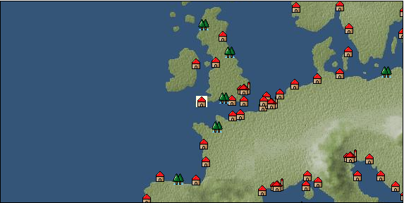

# Port: プリマス

import Tabs from '@theme/Tabs';
import TabItem from '@theme/TabItem';

## General Information

| Attribute | Details |
| :--- | :--- |
| **Port Name** | plymouth |
| **Port Type** | 領地 |
| **Region** | northern europe |
| **Sea Area** | Southern Britain |
| **Required Language** | English |
| **Coordinates** | （16085，2494） |
| **Investment Reward** | [Mode Design Collection Volume 3](Items/Recipe Book/item_952.md) （必要投資額：1,500,000ドゥカード） |

### Available Facilities

| guild | intermediary | exchange | tool shop | workshop craftsman | Painter | sculptor | peddler |
| --- | --- | --- | --- | --- | --- | --- | --- |
|   |   | ○ | ○ | ○ |   |   | ○ |
| Shipyard Master | Lumbermaker | Sail-maker | weapon craftsman | master | TavernFemale | archive | salesperson |
| --- | --- | --- | --- | --- | --- | --- | --- |
| ○ |   |   | ○ | ○ |   |   |   |
| Shipwright | 銀行 | street worker | 王宮 | Trading post | church | suburbs | translator |
| --- | --- | --- | --- | --- | --- | --- | --- |
| ○ | ○ | ○ |   |   | ○ |   |   |

### Description
A port town in southwestern England. It is flourishing because of its important position in England. The main products are various ores, and graphite is an especially important trade item. Cultural area: British Isles

<Tabs>
  <TabItem value="trade_goods_sales" label="Trade Goods Sales">

| item | group | purchase price | 同盟時 | remarks |
| --- | --- | --- | --- | --- |
| [crossbow](Items/Trade Goods/TradeGoods-Weapons/item_537.md) | [Trading Items (Arms)](Categories/category_16.md) | 738 | (646) |  |
| 時代限定（15世紀第3期、15世紀第4期） |
| [tin ore](Items/Trade Goods/TradeGoods-Minerals/item_23.md) | [Trading Items (Iron Stone)](Categories/category_7.md) | 484 | 424 |  |
| [cheese](Items/Trade Goods/TradeGoods-Foodstuffs/item_20.md) | [Trading items (food items)](Categories/category_3.md) | 347 | 304 |  |
| [lavender](Items/Trade Goods/TradeGoods-Perfume/item_150.md) | [Trading Goods (Spices)](Categories/category_11.md) | 540 | 676 |  |
| 要投資（必要投資額：120,000） |
| [two-handed sword](Items/Trade Goods/TradeGoods-Weapons/item_24.md) | [Trading Items (Arms)](Categories/category_16.md) | 1,420 | 1,247 |  |
| [malachite](Items/Trade Goods/TradeGoods-Gems/item_679.md) | [Trading Items (Gemstones)](Categories/category_15.md) | (1,881) | 1,646 |  |
| 要投資（必要投資額：240,000） |
| [graphite](Items/Trade Goods/TradeGoods-Wares/item_25.md) | [交易品（工業品）](Categories/category_19.md) | 830 | 776 |  |
| [lead ore](Items/Trade Goods/TradeGoods-Minerals/item_21.md) | [Trading Items (Iron Stone)](Categories/category_7.md) | 447 | 392 |  |
| [copper ore](Items/Trade Goods/TradeGoods-Minerals/item_65.md) | [Trading Items (Iron Stone)](Categories/category_7.md) | 789 | 692 |  |
| [青銅](Items/Trade Goods/TradeGoods-Wares/item_7.md) | [交易品（工業品）](Categories/category_19.md) | 984 | 858 |  |
  </TabItem>
  <TabItem value="sale_specialty" label="Sale (Specialty)">

| item | group | sale price | 同盟時 | remarks |
| --- | --- | --- | --- | --- |

#### [交易品（繊維）](Categories/category_1.md)

| [cashmere](Items/Trade Goods/TradeGoods-Fibers/item_5560.md) | 交易品（繊維） | (3,326) | 3,880 |  |
| [Basho](Items/Trade Goods/TradeGoods-Fibers/item_3862.md) | 交易品（繊維） | 28,000 | (31,503) |  |
| [Green ramie](Items/Trade Goods/TradeGoods-Fibers/item_3428.md) | 交易品（繊維） | (32,995) | 38,500 |  |

#### [Trading Goods (Dye)](Categories/category_2.md)

| [Indian Akane](Items/Trade Goods/TradeGoods-Dye/item_1037.md) | Trading Goods (Dye) | 1,278 | (1,437) |  |
| [Indian indigo](Items/Trade Goods/TradeGoods-Dye/item_157.md) | Trading Goods (Dye) | 1,189 | (1,337) |  |
| [ward](Items/Trade Goods/TradeGoods-Dye/item_57.md) | Trading Goods (Dye) | 1,377 | (1,549) |  |
| [Safflower](Items/Trade Goods/TradeGoods-Dye/item_1059.md) | Trading Goods (Dye) | [Edit Sale Price](Ports/port_25.md) |  |

#### [Trading items (food items)](Categories/category_3.md)

| [buckwheat](Items/Trade Goods/TradeGoods-Foodstuffs/item_3430.md) | Trading items (food items) | (32,652) | 38,100 |  |

#### [交易品（調味料）](Categories/category_4.md)

| [tamarind](Items/Trade Goods/TradeGoods-Seasonings/item_1968.md) | 交易品（調味料） | 2,200 | (2,475) |  |
| [soy sauce](Items/Trade Goods/TradeGoods-Seasonings/item_3425.md) | 交易品（調味料） | (35,309) | 41,200 |  |

#### [交易品（雑貨）](Categories/category_5.md)

| [old ink stick](Items/Trade Goods/TradeGoods-Misc/item_3921.md) | 交易品（雑貨） | (9,770) | 11,400 |  |
| [lantern](Items/Trade Goods/TradeGoods-Misc/item_3683.md) | 交易品（雑貨） | (36,701) | 42,824 |  |

#### [Trading products (medical products)](Categories/category_6.md)

| [Borei](Items/Trade Goods/TradeGoods-Medicine/item_3678.md) | Trading products (medical products) | (23,262) | 27,143 |  |
| [Nothing](Items/Trade Goods/TradeGoods-Medicine/item_1053.md) | Trading products (medical products) | 834 | (938) |  |
| [calamus](Items/Trade Goods/TradeGoods-Medicine/item_3427.md) | Trading products (medical products) | (44,907) | 52,400 |  |

#### [Trading Items (Iron Stone)](Categories/category_7.md)

| [white porcelain ore](Items/Trade Goods/TradeGoods-Minerals/item_3433.md) | Trading Items (Iron Stone) | (25,432) | 29,675 |  |
| [medical stone](Items/Trade Goods/TradeGoods-Minerals/item_3786.md) | Trading Items (Iron Stone) | 23,410 | (26,338) |  |

#### [交易品（酒類）](Categories/category_9.md)

| [sherry](Items/Trade Goods/TradeGoods-Alcohol/item_844.md) | 交易品（酒類） | 585 | (658) |  |
| [Sake](Items/Trade Goods/TradeGoods-Alcohol/item_3424.md) | 交易品（酒類） | (35,335) | 41,231 |  |

#### [Trading goods (hobby goods)](Categories/category_10.md)

| [Aigyoku](Items/Trade Goods/TradeGoods-Sunddries/item_3677.md) | Trading goods (hobby goods) | (30,391) | 35,462 |  |
| [cacao](Items/Trade Goods/TradeGoods-Sunddries/item_140.md) | Trading goods (hobby goods) | 1,455 | 1,488 |  |
| [cashew nuts](Items/Trade Goods/TradeGoods-Sunddries/item_2120.md) | Trading goods (hobby goods) | (1,110) | 1,295 |  |
| [tobacco](Items/Trade Goods/TradeGoods-Sunddries/item_109.md) | Trading goods (hobby goods) | 1,430 | 1,645 |  |
| [pineapple](Items/Trade Goods/TradeGoods-Sunddries/item_867.md) | Trading goods (hobby goods) | 1,927 | 2,286 |  |
| [peanuts](Items/Trade Goods/TradeGoods-Sunddries/item_134.md) | Trading goods (hobby goods) | 402 | 463 |  |
| [prune](Items/Trade Goods/TradeGoods-Sunddries/item_523.md) | Trading goods (hobby goods) | 489 | (550) |  |
| [Chinese tea](Items/Trade Goods/TradeGoods-Sunddries/item_3907.md) | Trading goods (hobby goods) | (31,624) | 36,900 |  |
| [Korean tea](Items/Trade Goods/TradeGoods-Sunddries/item_3751.md) | Trading goods (hobby goods) | (43,011) | 50,187 |  |
| 同盟時、107% |
| [black tea](Items/Trade Goods/TradeGoods-Sunddries/item_675.md) | Trading goods (hobby goods) | 2,989 | (3,362) |  |
| [金針花](Items/Trade Goods/TradeGoods-Sunddries/item_3739.md) | Trading goods (hobby goods) | 10,483 | (11,794) |  |

#### [Trading Goods (Spices)](Categories/category_11.md)

| [jasmine](Items/Trade Goods/TradeGoods-Perfume/item_772.md) | Trading Goods (Spices) | 6,572 | (7,394) |  |
| [geranium](Items/Trade Goods/TradeGoods-Perfume/item_145.md) | Trading Goods (Spices) | 1,256 | 1,302 |  |
| [Tang Muxiang](Items/Trade Goods/TradeGoods-Perfume/item_593.md) | Trading Goods (Spices) | 1,810 | (2,036) |  |
| [sandalwood](Items/Trade Goods/TradeGoods-Perfume/item_771.md) | Trading Goods (Spices) | 4,750 | (5,344) |  |

#### [Trading Goods (Spices)](Categories/category_12.md)

| [allspice](Items/Trade Goods/TradeGoods-Spices/item_1848.md) | Trading Goods (Spices) | 1,982 | (2,229) |  |
| [cloves](Items/Trade Goods/TradeGoods-Spices/item_1092.md) | Trading Goods (Spices) | 11,091 | 12,917 |  |
| [pepper](Items/Trade Goods/TradeGoods-Spices/item_58.md) | Trading Goods (Spices) | 12,550 | 14,608 |  |
| [cinnamon](Items/Trade Goods/TradeGoods-Spices/item_1432.md) | Trading Goods (Spices) | 5,030 | (5,659) |  |
| [nutmeg](Items/Trade Goods/TradeGoods-Spices/item_1969.md) | Trading Goods (Spices) | (20,628) | 24,070 |  |
| [mace](Items/Trade Goods/TradeGoods-Spices/item_2100.md) | Trading Goods (Spices) | 13,324 | 14,642 |  |
| [chili pepper](Items/Trade Goods/TradeGoods-Spices/item_1831.md) | Trading Goods (Spices) | (1,607) | 1,875 |  |
| [Grapefruit](Items/Trade Goods/TradeGoods-Spices/item_3422.md) | Trading Goods (Spices) | (34,709) | 40,500 |  |
| [green chili pepper](Items/Trade Goods/TradeGoods-Spices/item_1990.md) | Trading Goods (Spices) | (6,251) | 7,294 |  |
| Home country: 8460 (116%) points |

#### [Trading goods (artificial goods)](Categories/category_13.md)

| [african wood carving](Items/Trade Goods/TradeGoods-Luxuries/item_5558.md) | Trading goods (artificial goods) | 4,281 | (4,816) |  |
| [glasswork](Items/Trade Goods/TradeGoods-Luxuries/item_60.md) | Trading goods (artificial goods) | 1,680 | (1,890) |  |
| [Tumbaga](Items/Trade Goods/TradeGoods-Luxuries/item_3028.md) | Trading goods (artificial goods) | (16,901) | 19,721 |  |
| [Kuresute](Items/Trade Goods/TradeGoods-Luxuries/item_3897.md) | Trading goods (artificial goods) | (40,194) | 46,900 |  |
| [lacquerware](Items/Trade Goods/TradeGoods-Luxuries/item_3435.md) | Trading goods (artificial goods) | (36,423) | 42,500 |  |

#### [交易品（美術品）](Categories/category_14.md)

| [chinese calligraphy](Items/Trade Goods/TradeGoods-Art/item_3926.md) | 交易品（美術品） | 25,040 | (28,172) |  |
| [Mother-of-pearl lacquerware](Items/Trade Goods/TradeGoods-Art/item_3785.md) | 交易品（美術品） | 32,728 | (36,822) |  |

#### [Trading Items (Gemstones)](Categories/category_15.md)

| [aventurine](Items/Trade Goods/TradeGoods-Gems/item_678.md) | Trading Items (Gemstones) | 6,514 | (7,328) |  |
| [inca rose](Items/Trade Goods/TradeGoods-Gems/item_3014.md) | Trading Items (Gemstones) | (16,793) | 19,595 |  |
| [opal](Items/Trade Goods/TradeGoods-Gems/item_2006.md) | Trading Items (Gemstones) | 7,837 | (8,817) |  |
| [cat's eye](Items/Trade Goods/TradeGoods-Gems/item_1047.md) | Trading Items (Gemstones) | 9,753 | (10,973) |  |
| [sapphire](Items/Trade Goods/TradeGoods-Gems/item_676.md) | Trading Items (Gemstones) | 11,852 | (13,334) |  |
| [turquoise](Items/Trade Goods/TradeGoods-Gems/item_1006.md) | Trading Items (Gemstones) | 4,171 | (4,692) |  |
| [diamond](Items/Trade Goods/TradeGoods-Gems/item_449.md) | Trading Items (Gemstones) | (8,338) | 9,729 |  |
| [topaz](Items/Trade Goods/TradeGoods-Gems/item_1097.md) | Trading Items (Gemstones) | 5,538 | (6,230) |  |
| [tourmaline](Items/Trade Goods/TradeGoods-Gems/item_4092.md) | Trading Items (Gemstones) | (6,295) | 7,345 |  |
| [pink diamond](Items/Trade Goods/TradeGoods-Gems/item_2874.md) | Trading Items (Gemstones) | (13,627) | 15,900 |  |
| [lapis lazuli](Items/Trade Goods/TradeGoods-Gems/item_995.md) | Trading Items (Gemstones) | 6,424 | (7,227) |  |
| [ruby](Items/Trade Goods/TradeGoods-Gems/item_773.md) | Trading Items (Gemstones) | 12,453 | 15,607 |  |
| [amethyst](Items/Trade Goods/TradeGoods-Gems/item_3434.md) | Trading Items (Gemstones) | (37,194) | 43,400 |  |

#### [Trading Items (Arms)](Categories/category_16.md)

| [crossbow](Items/Trade Goods/TradeGoods-Weapons/item_537.md) | Trading Items (Arms) | 1,272 | (1,431) |  |
| 時代限定（15世紀第3期、15世紀第4期） |
| [Japanese sword](Items/Trade Goods/TradeGoods-Weapons/item_3437.md) | Trading Items (Arms) | (33,081) | 38,600 |  |

#### [Trading Items (Firearms)](Categories/category_17.md)

| [musket gun](Items/Trade Goods/TradeGoods-Firearms/item_584.md) | Trading Items (Firearms) | (3,107) | 3,625 |  |
| [throwing bomb](Items/Trade Goods/TradeGoods-Firearms/item_3784.md) | Trading Items (Firearms) | 31,961 | (35,959) |  |
| [tanegashima gun](Items/Trade Goods/TradeGoods-Firearms/item_3423.md) | Trading Items (Firearms) | (32,138) | 37,500 |  |

#### [交易品（工業品）](Categories/category_19.md)

| [papyrus](Items/Trade Goods/TradeGoods-Wares/item_616.md) | 交易品（工業品） | 646 | (726) |  |
| [Japanese paper](Items/Trade Goods/TradeGoods-Wares/item_3438.md) | 交易品（工業品） | (32,824) | 38,300 |  |
| [marble](Items/Trade Goods/TradeGoods-Wares/item_52.md) | 交易品（工業品） | 1,945 | (2,188) |  |
| [bamboo](Items/Trade Goods/TradeGoods-Wares/item_3899.md) | 交易品（工業品） | (31,624) | 36,900 |  |
| [羊皮紙](Items/Trade Goods/TradeGoods-Wares/item_53.md) | 交易品（工業品） | 1,630 | (1,833) |  |

#### [交易品（織物）](Categories/category_20.md)

| [Awaiyo](Items/Trade Goods/TradeGoods-Fabrics/item_3002.md) | 交易品（織物） | (8,913) | 10,400 |  |
| [indian chintz](Items/Trade Goods/TradeGoods-Fabrics/item_159.md) | 交易品（織物） | 2,721 | 2,859 |  |
| [damask](Items/Trade Goods/TradeGoods-Fabrics/item_614.md) | 交易品（織物） | 5,569 | (6,265) |  |
| [velvet](Items/Trade Goods/TradeGoods-Fabrics/item_902.md) | 交易品（織物） | 4,640 | (5,220) |  |
| [persian rug](Items/Trade Goods/TradeGoods-Fabrics/item_606.md) | 交易品（織物） | 10,432 | (11,737) |  |
| [唐錦](Items/Trade Goods/TradeGoods-Fabrics/item_3896.md) | 交易品（織物） | 26,053 | (29,312) |  |
| [明紬](Items/Trade Goods/TradeGoods-Fabrics/item_3753.md) | 交易品（織物） | 32,791 | 51,500 |  |
| Home country: market price 100% |
| [Nishijin textile](Items/Trade Goods/TradeGoods-Fabrics/item_3431.md) | 交易品（織物） | (33,488) | 39,075 |  |
  </TabItem>
  <TabItem value="sale_no_specialty" label="Sale (No Specialty)">

| item | group | sale price | 同盟時 | remarks |
| --- | --- | --- | --- | --- |

#### [交易品（繊維）](Categories/category_1.md)

| [flax](Items/Trade Goods/TradeGoods-Fibers/item_64.md) | 交易品（繊維） | 227 | (255) |  |
| [fur](Items/Trade Goods/TradeGoods-Fibers/item_634.md) | 交易品（繊維） | 1,363 | (1,533) |  |
| [leather](Items/Trade Goods/TradeGoods-Fibers/item_44.md) | 交易品（繊維） | 825 | (928) |  |
| [cotton](Items/Trade Goods/TradeGoods-Fibers/item_610.md) | 交易品（繊維） | 633 | (712) |  |

#### [Trading Goods (Dye)](Categories/category_2.md)

| [persian berry](Items/Trade Goods/TradeGoods-Dye/item_693.md) | Trading Goods (Dye) | 1,379 | (1,551) |  |
| [貝紫](Items/Trade Goods/TradeGoods-Dye/item_110.md) | Trading Goods (Dye) | 5,293 | 5,433 |  |

#### [Trading items (food items)](Categories/category_3.md)

| [fava beans](Items/Trade Goods/TradeGoods-Foodstuffs/item_102.md) | Trading items (food items) | 132 | (148) |  |
| [halibut](Items/Trade Goods/TradeGoods-Foodstuffs/item_1040.md) | Trading items (food items) | 688 | (774) |  |
| [turnip](Items/Trade Goods/TradeGoods-Foodstuffs/item_55.md) | Trading items (food items) | 94 | (105) |  |
| [Oat](Items/Trade Goods/TradeGoods-Foodstuffs/item_275.md) | Trading items (food items) | 80 | (90) |  |
| [sole](Items/Trade Goods/TradeGoods-Foodstuffs/item_45.md) | Trading items (food items) | 104 | (117) |  |
| [sausage](Items/Trade Goods/TradeGoods-Foodstuffs/item_27.md) | Trading items (food items) | 386 | 389 |  |
| [onion](Items/Trade Goods/TradeGoods-Foodstuffs/item_28.md) | Trading items (food items) | 137 | (154) |  |
| [sturgeon](Items/Trade Goods/TradeGoods-Foodstuffs/item_1667.md) | Trading items (food items) | 860 | (967) |  |
| [corn](Items/Trade Goods/TradeGoods-Foodstuffs/item_138.md) | Trading items (food items) | 211 | (237) |  |
| [carrot](Items/Trade Goods/TradeGoods-Foodstuffs/item_2708.md) | Trading items (food items) | 101 | (113) |  |
| [ham](Items/Trade Goods/TradeGoods-Foodstuffs/item_290.md) | Trading items (food items) | 433 | (487) |  |
| [bacon](Items/Trade Goods/TradeGoods-Foodstuffs/item_566.md) | Trading items (food items) | 391 | 395 |  |
| [sunfish](Items/Trade Goods/TradeGoods-Foodstuffs/item_878.md) | Trading items (food items) | 3,445 | (3,876) |  |
| [egg](Items/Trade Goods/TradeGoods-Foodstuffs/item_40.md) | Trading items (food items) | 34 | (38) |  |
| [wheat](Items/Trade Goods/TradeGoods-Foodstuffs/item_16.md) | Trading items (food items) | 79 | (88) |  |
| [beef](Items/Trade Goods/TradeGoods-Foodstuffs/item_26.md) | Trading items (food items) | 660 | (742) |  |
| [mutton](Items/Trade Goods/TradeGoods-Foodstuffs/item_33.md) | Trading items (food items) | 463 | (520) |  |
| [pork](Items/Trade Goods/TradeGoods-Foodstuffs/item_41.md) | Trading items (food items) | 359 | 362 |  |
| [魚肉](Items/Trade Goods/TradeGoods-Foodstuffs/item_10.md) | Trading items (food items) | 186 | 216 |  |
| [chicken meat](Items/Trade Goods/TradeGoods-Foodstuffs/item_29.md) | Trading items (food items) | 472 | (531) |  |

#### [交易品（調味料）](Categories/category_4.md)

| [anchovies](Items/Trade Goods/TradeGoods-Seasonings/item_3004.md) | 交易品（調味料） | 266 | (299) |  |
| [almond oil](Items/Trade Goods/TradeGoods-Seasonings/item_578.md) | 交易品（調味料） | 753 | (847) |  |
| [olive oil](Items/Trade Goods/TradeGoods-Seasonings/item_48.md) | 交易品（調味料） | 399 | (448) |  |
| [butter](Items/Trade Goods/TradeGoods-Seasonings/item_3.md) | 交易品（調味料） | 336 | (378) |  |
| [lard](Items/Trade Goods/TradeGoods-Seasonings/item_43.md) | 交易品（調味料） | 299 | 307 |  |
| [apple cider vinegar](Items/Trade Goods/TradeGoods-Seasonings/item_882.md) | 交易品（調味料） | 440 | (495) |  |
| [sugar](Items/Trade Goods/TradeGoods-Seasonings/item_94.md) | 交易品（調味料） | 946 | (1,064) |  |
| [Honey](Items/Trade Goods/TradeGoods-Seasonings/item_49.md) | 交易品（調味料） | 1,091 | (1,227) |  |

#### [交易品（雑貨）](Categories/category_5.md)

| [Western books](Items/Trade Goods/TradeGoods-Misc/item_293.md) | 交易品（雑貨） | 721 | (811) |  |

#### [Trading products (medical products)](Categories/category_6.md)

| [chamomile](Items/Trade Goods/TradeGoods-Medicine/item_292.md) | Trading products (medical products) | 366 | (411) |  |
| [rose hips](Items/Trade Goods/TradeGoods-Medicine/item_904.md) | Trading products (medical products) | 462 | (519) |  |

#### [Trading products (precious metals)](Categories/category_8.md)

| [gold](Items/Trade Goods/TradeGoods-Metals/item_659.md) | Trading products (precious metals) | 8,717 | 10,630 |  |

#### [交易品（酒類）](Categories/category_9.md)

| [aquavit](Items/Trade Goods/TradeGoods-Alcohol/item_572.md) | 交易品（酒類） | 600 | (675) |  |
| [whiskey](Items/Trade Goods/TradeGoods-Alcohol/item_1.md) | 交易品（酒類） | 717 | 729 |  |
| [gin](Items/Trade Goods/TradeGoods-Alcohol/item_291.md) | 交易品（酒類） | 630 | (708) |  |
| [Beer](Items/Trade Goods/TradeGoods-Alcohol/item_2.md) | 交易品（酒類） | 288 | 298 |  |
| [brandy](Items/Trade Goods/TradeGoods-Alcohol/item_9.md) | 交易品（酒類） | 826 | (929) |  |
| [palm wine](Items/Trade Goods/TradeGoods-Alcohol/item_436.md) | 交易品（酒類） | 450 | (506) |  |
| [rum](Items/Trade Goods/TradeGoods-Alcohol/item_139.md) | 交易品（酒類） | 749 | (842) |  |
| [liqueur](Items/Trade Goods/TradeGoods-Alcohol/item_18.md) | 交易品（酒類） | 669 | (752) |  |
| [wine](Items/Trade Goods/TradeGoods-Alcohol/item_11.md) | 交易品（酒類） | 541 | 560 |  |
| [Shochu](Items/Trade Goods/TradeGoods-Alcohol/item_3449.md) | 交易品（酒類） | (6,849) | 7,991 |  |
| 同盟：108％時 |

#### [Trading goods (hobby goods)](Categories/category_10.md)

| [dried apple](Items/Trade Goods/TradeGoods-Sunddries/item_19.md) | Trading goods (hobby goods) | 357 | (401) |  |

#### [Trading Goods (Spices)](Categories/category_11.md)

| [rose](Items/Trade Goods/TradeGoods-Perfume/item_536.md) | Trading Goods (Spices) | 2,750 | (3,094) |  |
| [Musk](Items/Trade Goods/TradeGoods-Perfume/item_158.md) | Trading Goods (Spices) | 4,795 | 5,102 |  |

#### [Trading Goods (Spices)](Categories/category_12.md)

| [cardamom](Items/Trade Goods/TradeGoods-Spices/item_1431.md) | Trading Goods (Spices) | (4,819) | 5,622 |  |
| [cumin](Items/Trade Goods/TradeGoods-Spices/item_156.md) | Trading Goods (Spices) | (1,314) | 1,533 |  |
| [bergamot](Items/Trade Goods/TradeGoods-Spices/item_879.md) | Trading Goods (Spices) | 724 | (814) |  |

#### [Trading goods (artificial goods)](Categories/category_13.md)

| [dragonfly ball](Items/Trade Goods/TradeGoods-Luxuries/item_294.md) | Trading goods (artificial goods) | 1,185 | (1,333) |  |
| [皮革製品](Items/Trade Goods/TradeGoods-Luxuries/item_12.md) | Trading goods (artificial goods) | 1,280 | 1,321 |  |
| [goldsmith](Items/Trade Goods/TradeGoods-Luxuries/item_687.md) | Trading goods (artificial goods) | 4,946 | (5,564) |  |

#### [交易品（美術品）](Categories/category_14.md)

| [青銅像](Items/Trade Goods/TradeGoods-Art/item_148.md) | 交易品（美術品） | 1,300 | (1,462) |  |

#### [Trading Items (Gemstones)](Categories/category_15.md)

| [Agate](Items/Trade Goods/TradeGoods-Gems/item_107.md) | Trading Items (Gemstones) | (4,633) | 5,405 |  |
| [emerald](Items/Trade Goods/TradeGoods-Gems/item_777.md) | Trading Items (Gemstones) | 8,184 | 8,472 |  |
| [garnet](Items/Trade Goods/TradeGoods-Gems/item_1005.md) | Trading Items (Gemstones) | (4,414) | 5,150 |  |
| [coral](Items/Trade Goods/TradeGoods-Gems/item_141.md) | Trading Items (Gemstones) | 3,609 | (4,060) |  |
| [peridot](Items/Trade Goods/TradeGoods-Gems/item_1098.md) | Trading Items (Gemstones) | (4,011) | 4,680 |  |
| [crystal](Items/Trade Goods/TradeGoods-Gems/item_893.md) | Trading Items (Gemstones) | (1,176) | 1,372 |  |
| [amber](Items/Trade Goods/TradeGoods-Gems/item_618.md) | Trading Items (Gemstones) | 2,480 | (2,790) |  |
| [pearl](Items/Trade Goods/TradeGoods-Gems/item_769.md) | Trading Items (Gemstones) | (10,169) | 11,865 |  |
| [ivory](Items/Trade Goods/TradeGoods-Gems/item_699.md) | Trading Items (Gemstones) | 3,960 | (4,455) |  |

#### [Trading Items (Arms)](Categories/category_16.md)

| [one handed sword](Items/Trade Goods/TradeGoods-Weapons/item_433.md) | Trading Items (Arms) | 1,170 | (1,316) |  |
| [western armor](Items/Trade Goods/TradeGoods-Weapons/item_6.md) | Trading Items (Arms) | 2,558 | (2,878) |  |

#### [Trading Items (Firearms)](Categories/category_17.md)

| [arquebus gun](Items/Trade Goods/TradeGoods-Firearms/item_14.md) | Trading Items (Firearms) | 1,949 | (2,192) |  |
| [大砲](Items/Trade Goods/TradeGoods-Firearms/item_4.md) | Trading Items (Firearms) | 3,377 | (3,799) |  |
| [gunpowder](Items/Trade Goods/TradeGoods-Firearms/item_352.md) | Trading Items (Firearms) | 1,125 | (1,265) |  |

#### [Trading Goods (Livestock)](Categories/category_18.md)

| [cow](Items/Trade Goods/TradeGoods-Livestock/item_17.md) | Trading Goods (Livestock) | 342 | (384) |  |
| [chicken](Items/Trade Goods/TradeGoods-Livestock/item_252.md) | Trading Goods (Livestock) | 54 | 55 |  |
| [sheep](Items/Trade Goods/TradeGoods-Livestock/item_253.md) | Trading Goods (Livestock) | 132 | (148) |  |

#### [交易品（工業品）](Categories/category_19.md)

| [wood](Items/Trade Goods/TradeGoods-Wares/item_277.md) | 交易品（工業品） | 729 | (820) |  |
| [vegetable oil](Items/Trade Goods/TradeGoods-Wares/item_842.md) | 交易品（工業品） | 89 | (100) |  |
| [coal](Items/Trade Goods/TradeGoods-Wares/item_359.md) | 交易品（工業品） | (446) | 520 |  |
| [iron material](Items/Trade Goods/TradeGoods-Wares/item_268.md) | 交易品（工業品） | 996 | (1,120) |  |

#### [交易品（織物）](Categories/category_20.md)

| [dutch calico](Items/Trade Goods/TradeGoods-Fabrics/item_1435.md) | 交易品（織物） | 943 | (1,060) |  |
| [corduroy](Items/Trade Goods/TradeGoods-Fabrics/item_824.md) | 交易品（織物） | 899 | (1,011) |  |
| [satin](Items/Trade Goods/TradeGoods-Fabrics/item_996.md) | 交易品（織物） | 3,822 | (4,300) |  |
| [georgette](Items/Trade Goods/TradeGoods-Fabrics/item_1000.md) | 交易品（織物） | 3,351 | (3,770) |  |
| [tweed](Items/Trade Goods/TradeGoods-Fabrics/item_31.md) | 交易品（織物） | 1,391 | (1,565) |  |
| [knit](Items/Trade Goods/TradeGoods-Fabrics/item_164.md) | 交易品（織物） | 602 | 616 |  |
| [woolen fabric](Items/Trade Goods/TradeGoods-Fabrics/item_163.md) | 交易品（織物） | 1,023 | (1,150) |  |
| [cotton fabric](Items/Trade Goods/TradeGoods-Fabrics/item_571.md) | 交易品（織物） | 1,189 | (1,337) |  |
| [linen fabric](Items/Trade Goods/TradeGoods-Fabrics/item_135.md) | 交易品（織物） | 443 | (498) |  |
  </TabItem>
  <TabItem value="guild_&_others" label="Guild & Others">

| item | group | Sales price | Handling NPC | remarks |
| --- | --- | --- | --- | --- |

#### others

| [20 gun casting method](Items/Recipe Book/item_6494.md) | [recipe book](Categories/category_22.md) | Fixed recipe |  |  |
| 1 |
| [Cylindrical hat sewing method](Items/Recipe Book/item_4490.md) | [recipe book](Categories/category_22.md) | Fixed recipe |  |  |
| sailor |
  </TabItem>
  <TabItem value="toolman" label="Toolman">

| item | group | Sales price | Handling NPC | remarks |
| --- | --- | --- | --- | --- |

#### [recipe book](Categories/category_22.md)

| [Mode Design Collection Volume 1](Items/Recipe Book/item_92.md) | recipe book | 10,000 | tool shop owner |  |
| [Textile secrets/fabric book](Items/Recipe Book/item_91.md) | recipe book | 10,000 | tool shop owner |  |

#### [Equipment (head)](Categories/category_23.md)

| [puritan hat](Items/Equipment/Equipment-Head/item_1013.md) | Equipment (head) | 26,000 | tool shop owner |  |

#### [Equipment (body)](Categories/category_24.md)

| [felt acton](Items/Equipment/Equipment-Body/item_130.md) | Equipment (body) | 8,300 | tool shop owner |  |
| [felt jerkin](Items/Equipment/Equipment-Body/item_552.md) | Equipment (body) | 23,000 | tool shop owner |  |
| [linen petticoat](Items/Equipment/Equipment-Body/item_272.md) | Equipment (body) | 8,300 | tool shop owner |  |

#### [Equipment (belongings)](Categories/category_27.md)

| [Guisalme](Items/Equipment/Equipment-Weapon/item_1140.md) | Equipment (belongings) | 38,700 | tool shop owner |  |
| [long sword](Items/Equipment/Equipment-Weapon/item_302.md) | Equipment (belongings) | 15,400 | tool shop owner |  |

#### [Consumables (land battle/deck battle)](Categories/category_29.md)

| [black kite feather](Items/Consumables/Consumables-Landbattle/item_88.md) | Consumables (land battle/deck battle) | 100 | tool shop owner |  |
| [Assortment of wound medicine](Items/Consumables/Consumables-Landbattle/item_90.md) | Consumables (land battle/deck battle) | 500 | tool shop owner |  |
| [therapeutic drug](Items/Consumables/Consumables-Landbattle/item_89.md) | Consumables (land battle/deck battle) | 300 | tool shop owner |  |
| [antidote](Items/Consumables/Consumables-Landbattle/item_270.md) | Consumables (land battle/deck battle) | 100 | tool shop owner |  |
  </TabItem>
  <TabItem value="kobo_craftsmen" label="Craftsman">

| item | group | Sales price | Handling NPC | remarks |
| --- | --- | --- | --- | --- |

#### [recipe book](Categories/category_22.md)

| [特殊兵装縫製法](Items/Recipe Book/item_1356.md) | recipe book | 50,000 | workshop craftsman |  |
| 要投資（必要投資額：180,000） |
| [Shipwright Introduction/Craft Book](Items/Recipe Book/item_75.md) | recipe book | 10,000 | workshop craftsman |  |
| [Shipwright Introduction/Sewing Book](Items/Recipe Book/item_74.md) | recipe book | 10,000 | workshop craftsman |  |
| [Shipwright Introduction/Casting Book](Items/Recipe Book/item_76.md) | recipe book | 10,000 | workshop craftsman |  |
| [Fireworks production technique book](Items/Recipe Book/item_3359.md) | recipe book | Fixed recipe | workshop craftsman |  |

#### [Consumables (skill activation)](Categories/category_31.md)

| [四分儀](Items/Consumables/Consumables-Skill/item_346.md) | Consumables (skill activation) | 500 | workshop craftsman |  |
| [simple salvage rope](Items/Consumables/Consumables-Skill/item_2294.md) | Consumables (skill activation) | 500 | workshop craftsman |  |
| [Simple towing auxiliary rope](Items/Consumables/Consumables-Skill/item_2295.md) | Consumables (skill activation) | 500 | workshop craftsman |  |

#### [shipbuilding materials](Categories/category_47.md)

| [General purpose small square sail](Items/Shipbuilding FS Material/item_3446.md) | shipbuilding materials | 30,000 | workshop craftsman |  |
| 要投資（必要投資額：300,000） |
| [General purpose small Latin sail](Items/Shipbuilding FS Material/item_3445.md) | shipbuilding materials | 30,000 | workshop craftsman |  |
| 要投資（必要投資額：300,000） |
| [General-purpose small oar](Items/Shipbuilding FS Material/item_3521.md) | shipbuilding materials | 50,000 | workshop craftsman |  |
| 要投資（必要投資額：680,000） |
| [General-purpose small reinforcement board](Items/Shipbuilding FS Material/item_3527.md) | shipbuilding materials | 50,000 | workshop craftsman |  |
| 要投資（必要投資額：680,000） |
| [General-purpose small expansion warehouse](Items/Shipbuilding FS Material/item_3524.md) | shipbuilding materials | 80,000 | workshop craftsman |  |
| 要投資（必要投資額：680,000） |
| [General-purpose small expansion cabin](Items/Shipbuilding FS Material/item_3523.md) | shipbuilding materials | 80,000 | workshop craftsman |  |
| 要投資（必要投資額：680,000） |
| [General-purpose small improved rudder](Items/Shipbuilding FS Material/item_3522.md) | shipbuilding materials | 80,000 | workshop craftsman |  |
| 要投資（必要投資額：680,000） |
| [General-purpose small paddle boat](Items/Shipbuilding FS Material/item_3444.md) | shipbuilding materials | 100,000 | workshop craftsman |  |
| 要投資（必要投資額：300,000） |
| [General-purpose small anti-swaying water tank](Items/Shipbuilding FS Material/item_3525.md) | shipbuilding materials | 80,000 | workshop craftsman |  |
| 要投資（必要投資額：680,000） |
| [General-purpose small gun port](Items/Shipbuilding FS Material/item_3447.md) | shipbuilding materials | 30,000 | workshop craftsman |  |
| 要投資（必要投資額：300,000） |
| [General-purpose small hull](Items/Shipbuilding FS Material/item_3443.md) | shipbuilding materials | 100,000 | workshop craftsman |  |
| 要投資（必要投資額：300,000） |
| [General-purpose small armor plate](Items/Shipbuilding FS Material/item_3526.md) | shipbuilding materials | 50,000 | workshop craftsman |  |
| 要投資（必要投資額：680,000） |
  </TabItem>
  <TabItem value="peddler" label="peddler">

| item | group | Sales price | Handling NPC | remarks |
| --- | --- | --- | --- | --- |

#### [Consumables (condition recovery)](Categories/category_21.md)

| [Nekoirazu](Items/Consumables/Consumables-Recovery/item_70.md) | Consumables (condition recovery) |  | peddler |  |
| [lime juice](Items/Consumables/Consumables-Recovery/item_121.md) | Consumables (condition recovery) |  | peddler |  |
| [spare sail](Items/Consumables/Consumables-Recovery/item_242.md) | Consumables (condition recovery) |  | peddler |  |
| [carpentry tools](Items/Consumables/Consumables-Recovery/item_271.md) | Consumables (condition recovery) |  | peddler |  |
| [fire extinguishing sand](Items/Consumables/Consumables-Recovery/item_68.md) | Consumables (condition recovery) |  | peddler |  |
| [clean deck brush](Items/Consumables/Consumables-Recovery/item_72.md) | Consumables (condition recovery) |  | peddler |  |

#### [Consumables (land battle/deck battle)](Categories/category_29.md)

| [frankisca](Items/Consumables/Consumables-Landbattle/item_1484.md) | Consumables (land battle/deck battle) |  | peddler |  |

#### [Consumables (skill activation)](Categories/category_31.md)

| [life aid](Items/Consumables/Consumables-Skill/item_67.md) | Consumables (skill activation) |  | peddler |  |
  </TabItem>
  <TabItem value="shipyard" label="Shipyard">

### Shipyard Master

| item | group | Sales price | Handling NPC | remarks |
| --- | --- | --- | --- | --- |

#### [Boat](Categories/category_43.md)

| [2 mast cogs](Items/Ships/item_265.md) | Boat | 96,000 | Shipyard Master |  |
| [warwick cog](Items/Ships/item_336.md) | Boat | 230,000 | Shipyard Master |  |
| [galleon](Items/Ships/item_411.md) | Boat | 4,500,000 | Shipyard Master |  |
| [carrack](Items/Ships/item_236.md) | Boat | 720,000 | Shipyard Master |  |
| [caravelle](Items/Ships/item_213.md) | Boat | 285,000 | Shipyard Master |  |
| [Hansa Cog](Items/Ships/item_263.md) | Boat | 24,000 | Shipyard Master |  |
| [Varsha](Items/Ships/item_201.md) | Boat | 2,000 | Shipyard Master |  |
| [frigate](Items/Ships/item_760.md) | Boat | 1,080,000 | Shipyard Master |  |
| [flute](Items/Ships/item_569.md) | Boat | 410,000 | Shipyard Master |  |
| [british cog](Items/Ships/item_567.md) | Boat | 96,000 | Shipyard Master |  |
| [bergantine](Items/Ships/item_208.md) | Boat | 148,800 | Shipyard Master |  |
| [commercial galleon](Items/Ships/item_412.md) | Boat | 4,600,000 | Shipyard Master |  |
| [commercial carrack](Items/Ships/item_239.md) | Boat | 728,000 | Shipyard Master |  |
| [commercial caravel](Items/Ships/item_215.md) | Boat | 290,000 | Shipyard Master |  |
| [commercial varsha](Items/Ships/item_204.md) | Boat | 5,200 | Shipyard Master |  |
| [commercial flute](Items/Ships/item_570.md) | Boat | 420,000 | Shipyard Master |  |
| [commercial large carrack](Items/Ships/item_409.md) | Boat | 1,840,000 | Shipyard Master |  |
| [commercial armed carrack](Items/Ships/item_1502.md) | Boat | 4,000,000 | Shipyard Master |  |
| [large carrack](Items/Ships/item_408.md) | Boat | 1,800,000 | Shipyard Master |  |
| [small galleon](Items/Ships/item_406.md) | Boat | 830,000 | Shipyard Master |  |
| [small carrack](Items/Ships/item_219.md) | Boat | 480,000 | Shipyard Master |  |
| [small caravel](Items/Ships/item_206.md) | Boat | 92,000 | Shipyard Master |  |
| [battle galleon](Items/Ships/item_413.md) | Boat | 4,600,000 | Shipyard Master |  |
| [combat carrack](Items/Ships/item_238.md) | Boat | 720,000 | Shipyard Master |  |
| [combat caravel](Items/Ships/item_212.md) | Boat | 280,000 | Shipyard Master |  |
| [Battle Barsha](Items/Ships/item_203.md) | Boat | 5,100 | Shipyard Master |  |
| [combat flute](Items/Ships/item_568.md) | Boat | 400,000 | Shipyard Master |  |
| [exploration barsha](Items/Ships/item_202.md) | Boat | 5,000 | Shipyard Master |  |
| [Large exploration carrack](Items/Ships/item_1503.md) | Boat | 3,360,000 | Shipyard Master |  |
| [refurbished heavy carrack](Items/Ships/item_1504.md) | Boat | 7,000,000 | Shipyard Master |  |
| [armed cog](Items/Ships/item_264.md) | Boat | 25,000 | Shipyard Master |  |
| [light galleon](Items/Ships/item_240.md) | Boat | 810,000 | Shipyard Master |  |
| [light carrack](Items/Ships/item_218.md) | Boat | 478,000 | Shipyard Master |  |
| [light caravelle](Items/Ships/item_207.md) | Boat | 92,000 | Shipyard Master |  |
| [transport galleon](Items/Ships/item_407.md) | Boat | 840,000 | Shipyard Master |  |
| [transport carrack](Items/Ships/item_222.md) | Boat | 488,000 | Shipyard Master |  |
| [Small caravel for transport](Items/Ships/item_3674.md) | Boat | 92,000 | Shipyard Master |  |
| [heavy carrack](Items/Ships/item_410.md) | Boat | 3,000,000 | Shipyard Master |  |

### Shipwright

| item | group | Sales price | Handling NPC | remarks |
| --- | --- | --- | --- | --- |

#### [recipe book](Categories/category_22.md)

| [Shipbuilding materials/processed iron materials](Items/Recipe Book/item_1735.md) | recipe book | Fixed recipe | Shipwright |  |

#### [shipbuilding materials](Categories/category_47.md)

| [Processing iron materials](Items/Shipbuilding FS Material/item_1722.md) | shipbuilding materials | Fixed recipe | Shipwright |  |
  </TabItem>
  <TabItem value="weapon craftsman" label="weapon craftsman">

| item | group | Sales price | Handling NPC | remarks |
| --- | --- | --- | --- | --- |

#### [recipe book](Categories/category_22.md)

| [Book of Shipbuilding Materials and Casting Volume 2](Items/Recipe Book/item_1723.md) | recipe book | Fixed recipe | weapon craftsman |  |

#### [Ship parts (cannon)](Categories/category_38.md)

| [4 amfer guns](Items/Ship Parts/Shipparts-Cannons/item_391.md) | Ship parts (cannon) | 26,600 | weapon craftsman |  |
| [6 Amfer cannons](Items/Ship Parts/Shipparts-Cannons/item_392.md) | Ship parts (cannon) | 81,000 | weapon craftsman |  |
| [10 angel cannons](Items/Ship Parts/Shipparts-Cannons/item_853.md) | Ship parts (cannon) | 249,400 | weapon craftsman |  |
| [2 angel cannons](Items/Ship Parts/Shipparts-Cannons/item_382.md) | Ship parts (cannon) | 10,000 | weapon craftsman |  |
| [4 angel cannons](Items/Ship Parts/Shipparts-Cannons/item_383.md) | Ship parts (cannon) | 39,900 | weapon craftsman |  |
| [6 angel cannons](Items/Ship Parts/Shipparts-Cannons/item_388.md) | Ship parts (cannon) | 89,800 | weapon craftsman |  |
| [8 angel cannons](Items/Ship Parts/Shipparts-Cannons/item_389.md) | Ship parts (cannon) | 159,600 | weapon craftsman |  |
| [4 Caprice guns](Items/Ship Parts/Shipparts-Cannons/item_395.md) | Ship parts (cannon) | 18,200 | weapon craftsman |  |
| [6 Caprice guns](Items/Ship Parts/Shipparts-Cannons/item_396.md) | Ship parts (cannon) | 55,500 | weapon craftsman |  |
| [8 Caprice guns](Items/Ship Parts/Shipparts-Cannons/item_397.md) | Ship parts (cannon) | 103,600 | weapon craftsman |  |
| [10 culverines](Items/Ship Parts/Shipparts-Cannons/item_375.md) | Ship parts (cannon) | 136,300 | weapon craftsman |  |
| [12 culverin guns](Items/Ship Parts/Shipparts-Cannons/item_744.md) | Ship parts (cannon) | 196,300 | weapon craftsman |  |
| [4 culverine guns](Items/Ship Parts/Shipparts-Cannons/item_372.md) | Ship parts (cannon) | 21,800 | weapon craftsman |  |
| [6 culverine guns](Items/Ship Parts/Shipparts-Cannons/item_373.md) | Ship parts (cannon) | 49,100 | weapon craftsman |  |
| [8 culverine guns](Items/Ship Parts/Shipparts-Cannons/item_374.md) | Ship parts (cannon) | 87,300 | weapon craftsman |  |
| [4 carronades](Items/Ship Parts/Shipparts-Cannons/item_836.md) | Ship parts (cannon) | 14,500 | weapon craftsman |  |
| [4 cannons](Items/Ship Parts/Shipparts-Cannons/item_1025.md) | Ship parts (cannon) | 19,300 | weapon craftsman |  |
| [4 Shumine cannons](Items/Ship Parts/Shipparts-Cannons/item_2967.md) | Ship parts (cannon) | 29,300 | weapon craftsman |  |
| [6 Shumine cannons](Items/Ship Parts/Shipparts-Cannons/item_2968.md) | Ship parts (cannon) | 89,100 | weapon craftsman |  |
| [10 Saker cannons](Items/Ship Parts/Shipparts-Cannons/item_187.md) | Ship parts (cannon) | 79,000 | weapon craftsman |  |
| [2 saker cannons](Items/Ship Parts/Shipparts-Cannons/item_183.md) | Ship parts (cannon) | 3,200 | weapon craftsman |  |
| [4 saker cannons](Items/Ship Parts/Shipparts-Cannons/item_184.md) | Ship parts (cannon) | 12,600 | weapon craftsman |  |
| [6 Saker cannons](Items/Ship Parts/Shipparts-Cannons/item_185.md) | Ship parts (cannon) | 28,400 | weapon craftsman |  |
| [8 Saker cannons](Items/Ship Parts/Shipparts-Cannons/item_186.md) | Ship parts (cannon) | 50,500 | weapon craftsman |  |
| [10 Seraphim cannons](Items/Ship Parts/Shipparts-Cannons/item_2293.md) | Ship parts (cannon) | 269,400 | weapon craftsman |  |
| [4 Seraphim cannons](Items/Ship Parts/Shipparts-Cannons/item_4018.md) | Ship parts (cannon) | 43,100 | weapon craftsman |  |
| [6 Seraphim cannons](Items/Ship Parts/Shipparts-Cannons/item_2291.md) | Ship parts (cannon) | 97,000 | weapon craftsman |  |
| [8 Seraphim cannons](Items/Ship Parts/Shipparts-Cannons/item_2292.md) | Ship parts (cannon) | 172,400 | weapon craftsman |  |
| [10 demi culverin cannons](Items/Ship Parts/Shipparts-Cannons/item_370.md) | Ship parts (cannon) | 10,100 | weapon craftsman |  |
| [12 demi culverin cannons](Items/Ship Parts/Shipparts-Cannons/item_371.md) | Ship parts (cannon) | 145,400 | weapon craftsman |  |
| [2 demi culverin cannons](Items/Ship Parts/Shipparts-Cannons/item_188.md) | Ship parts (cannon) | 4,000 | weapon craftsman |  |
| [4 demi culverin cannons](Items/Ship Parts/Shipparts-Cannons/item_189.md) | Ship parts (cannon) | 16,200 | weapon craftsman |  |
| [6 demi culverin cannons](Items/Ship Parts/Shipparts-Cannons/item_368.md) | Ship parts (cannon) | 36,400 | weapon craftsman |  |
| [8 demi culverin cannons](Items/Ship Parts/Shipparts-Cannons/item_369.md) | Ship parts (cannon) | 64,600 | weapon craftsman |  |
| [10 demi cannons](Items/Ship Parts/Shipparts-Cannons/item_940.md) | Ship parts (cannon) | 99,400 | weapon craftsman |  |
| [4 demi cannons](Items/Ship Parts/Shipparts-Cannons/item_941.md) | Ship parts (cannon) | 6,200 | weapon craftsman |  |
| [6 demi cannons](Items/Ship Parts/Shipparts-Cannons/item_942.md) | Ship parts (cannon) | 24,800 | weapon craftsman |  |
| [8 demi cannons](Items/Ship Parts/Shipparts-Cannons/item_943.md) | Ship parts (cannon) | 55,900 | weapon craftsman |  |
| [4 Draconis cannons](Items/Ship Parts/Shipparts-Cannons/item_386.md) | Ship parts (cannon) | 18,200 | weapon craftsman |  |
| [6 Draconis cannons](Items/Ship Parts/Shipparts-Cannons/item_387.md) | Ship parts (cannon) | 55,500 | weapon craftsman |  |
| [8 Draconis cannons](Items/Ship Parts/Shipparts-Cannons/item_390.md) | Ship parts (cannon) | 103,600 | weapon craftsman |  |
| [4 pyro cannons](Items/Ship Parts/Shipparts-Cannons/item_384.md) | Ship parts (cannon) | 12,500 | weapon craftsman |  |
| [6 pyro cannons](Items/Ship Parts/Shipparts-Cannons/item_385.md) | Ship parts (cannon) | 38,000 | weapon craftsman |  |
| [2 falcon guns](Items/Ship Parts/Shipparts-Cannons/item_174.md) | Ship parts (cannon) | 500 | weapon craftsman |  |
| [4 falcon guns](Items/Ship Parts/Shipparts-Cannons/item_175.md) | Ship parts (cannon) | 2,000 | weapon craftsman |  |
| [6 falcon guns](Items/Ship Parts/Shipparts-Cannons/item_176.md) | Ship parts (cannon) | 4,600 | weapon craftsman |  |
| [8 falcon guns](Items/Ship Parts/Shipparts-Cannons/item_177.md) | Ship parts (cannon) | 8,100 | weapon craftsman |  |
| [4 frango guns](Items/Ship Parts/Shipparts-Cannons/item_393.md) | Ship parts (cannon) | 12,500 | weapon craftsman |  |
| [6 frango guns](Items/Ship Parts/Shipparts-Cannons/item_394.md) | Ship parts (cannon) | 38,000 | weapon craftsman |  |
| [10 minion cannons](Items/Ship Parts/Shipparts-Cannons/item_182.md) | Ship parts (cannon) | 34,800 | weapon craftsman |  |
| [2 minion cannons](Items/Ship Parts/Shipparts-Cannons/item_178.md) | Ship parts (cannon) | 1,400 | weapon craftsman |  |
| [4 minion cannons](Items/Ship Parts/Shipparts-Cannons/item_179.md) | Ship parts (cannon) | 5,600 | weapon craftsman |  |
| [6 minion cannons](Items/Ship Parts/Shipparts-Cannons/item_180.md) | Ship parts (cannon) | 12,400 | weapon craftsman |  |
| [8 minion cannons](Items/Ship Parts/Shipparts-Cannons/item_181.md) | Ship parts (cannon) | 22,400 | weapon craftsman |  |
| [4 Meteora cannons](Items/Ship Parts/Shipparts-Cannons/item_398.md) | Ship parts (cannon) | 26,600 | weapon craftsman |  |
| [6 Meteora cannons](Items/Ship Parts/Shipparts-Cannons/item_399.md) | Ship parts (cannon) | 81,000 | weapon craftsman |  |
| [10 rapid fire cannons](Items/Ship Parts/Shipparts-Cannons/item_1024.md) | Ship parts (cannon) | 123,200 | weapon craftsman |  |
| [2 rapid fire cannons](Items/Ship Parts/Shipparts-Cannons/item_1016.md) | Ship parts (cannon) | 4,900 | weapon craftsman |  |
| [4 rapid fire cannons](Items/Ship Parts/Shipparts-Cannons/item_1017.md) | Ship parts (cannon) | 19,700 | weapon craftsman |  |
| [6 rapid fire cannons](Items/Ship Parts/Shipparts-Cannons/item_1022.md) | Ship parts (cannon) | 44,400 | weapon craftsman |  |
| [8 rapid fire cannons](Items/Ship Parts/Shipparts-Cannons/item_1023.md) | Ship parts (cannon) | 78,900 | weapon craftsman |  |
| [4 Volcan guns](Items/Ship Parts/Shipparts-Cannons/item_2965.md) | Ship parts (cannon) | 29,300 | weapon craftsman |  |
| [6 Volcan guns](Items/Ship Parts/Shipparts-Cannons/item_2966.md) | Ship parts (cannon) | 89,100 | weapon craftsman |  |

#### [shipbuilding materials](Categories/category_47.md)

| [改良中型砲門](Items/Shipbuilding FS Material/item_1724.md) | shipbuilding materials | Fixed recipe | weapon craftsman |  |
  </TabItem>
</Tabs>