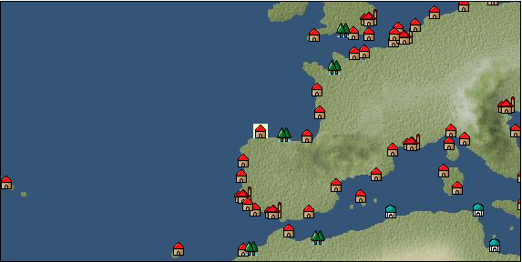

# Port: ヒホン

import Tabs from '@theme/Tabs';
import TabItem from '@theme/TabItem';

## General Information

| Attribute | Details |
| :--- | :--- |
| **Port Name** | Gijon |
| **Port Type** | 領地 |
| **Region** | western europe |
| **Sea Area** | northeast atlantic |
| **Required Language** | spanish |
| **Coordinates** | （15847，2921） |
| **Investment Reward** | [Adjutant skill development method](Items/Consumables/Consumables-Documents/item_4360.md) （必要投資額：5,000,000ドゥカード） |

### Available Facilities

| guild | intermediary | exchange | tool shop | workshop craftsman | Painter | sculptor | peddler |
| --- | --- | --- | --- | --- | --- | --- | --- |
|   |   | ○ | ○ |   |   |   |   |
| Shipyard Master | Lumbermaker | Sail-maker | weapon craftsman | master | TavernFemale | archive | salesperson |
| --- | --- | --- | --- | --- | --- | --- | --- |
|   |   |   |   | ○ |   |   |   |
| Shipwright | 銀行 | street worker | 王宮 | Trading post | church | suburbs | translator |
| --- | --- | --- | --- | --- | --- | --- | --- |
| ○ | ○ | ○ |   |   |   |   |   |

### Description
It is a small city on the south coast of the Bay of Biscay, west of Bordeaux. It is said to have originated as a military camp for the ancient Roman army. *Portuguese is also spoken Cultural area: Iberia

<Tabs>
  <TabItem value="trade_goods_sales" label="Trade Goods Sales">

| item | group | purchase price | 同盟時 | remarks |
| --- | --- | --- | --- | --- |
| [duck](Items/Trade Goods/TradeGoods-Livestock/item_38.md) | [Trading Goods (Livestock)](Categories/category_18.md) | 59 | 56 |  |
| [pig](Items/Trade Goods/TradeGoods-Livestock/item_37.md) | [Trading Goods (Livestock)](Categories/category_18.md) | 59 | 56 |  |
| [大砲](Items/Trade Goods/TradeGoods-Firearms/item_4.md) | [Trading Items (Firearms)](Categories/category_17.md) | 3,625 | (3,172) |  |
| [dried strawberries](Items/Trade Goods/TradeGoods-Sunddries/item_36.md) | [Trading goods (hobby goods)](Categories/category_10.md) | (342) | 300 |  |
| [iron ore](Items/Trade Goods/TradeGoods-Minerals/item_146.md) | [Trading Items (Iron Stone)](Categories/category_7.md) | (649) | 568 |  |
  </TabItem>
  <TabItem value="sale_specialty" label="Sale (Specialty)">

| item | group | sale price | 同盟時 | remarks |
| --- | --- | --- | --- | --- |

#### [交易品（繊維）](Categories/category_1.md)

| [Basho](Items/Trade Goods/TradeGoods-Fibers/item_3862.md) | 交易品（繊維） | (26,756) | 31,220 |  |
| [feather](Items/Trade Goods/TradeGoods-Fibers/item_585.md) | 交易品（繊維） | [Edit Sale Price](Ports/port_27.md) |  |
| [tiger skin](Items/Trade Goods/TradeGoods-Fibers/item_3790.md) | 交易品（繊維） | (22,516) | 26,273 |  |
| [Green ramie](Items/Trade Goods/TradeGoods-Fibers/item_3428.md) | 交易品（繊維） | (23,816) | 27,789 |  |

#### [Trading Goods (Dye)](Categories/category_2.md)

| [Indian Akane](Items/Trade Goods/TradeGoods-Dye/item_1037.md) | Trading Goods (Dye) | 1,095 | (1,231) |  |
| [Indian indigo](Items/Trade Goods/TradeGoods-Dye/item_157.md) | Trading Goods (Dye) | 1,167 | 1,274 |  |
| [gallnut](Items/Trade Goods/TradeGoods-Dye/item_3429.md) | Trading Goods (Dye) | (25,618) | 29,892 |  |

#### [Trading items (food items)](Categories/category_3.md)

| [buckwheat](Items/Trade Goods/TradeGoods-Foodstuffs/item_3430.md) | Trading items (food items) | (24,038) | 28,049 |  |
| [taro](Items/Trade Goods/TradeGoods-Foodstuffs/item_1960.md) | Trading items (food items) | (227) | 264 |  |
| [Pearl millet](Items/Trade Goods/TradeGoods-Foodstuffs/item_5557.md) | Trading items (food items) | (734) | 856 |  |

#### [交易品（調味料）](Categories/category_4.md)

| [oyster sauce](Items/Trade Goods/TradeGoods-Seasonings/item_3505.md) | 交易品（調味料） | (2,625) | 3,063 |  |
| [tamarind](Items/Trade Goods/TradeGoods-Seasonings/item_1968.md) | 交易品（調味料） | 2,033 | (2,287) |  |
| [Choshi](Items/Trade Goods/TradeGoods-Seasonings/item_3793.md) | 交易品（調味料） | (22,383) | 26,117 |  |
| [miso](Items/Trade Goods/TradeGoods-Seasonings/item_3420.md) | 交易品（調味料） | (3,533) | 4,122 |  |
| [Bean sauce](Items/Trade Goods/TradeGoods-Seasonings/item_3875.md) | 交易品（調味料） | (31,773) | 37,074 |  |
| [soy sauce](Items/Trade Goods/TradeGoods-Seasonings/item_3425.md) | 交易品（調味料） | (25,818) | 30,125 |  |
| [black vinegar](Items/Trade Goods/TradeGoods-Seasonings/item_3475.md) | 交易品（調味料） | (4,476) | 5,222 |  |

#### [交易品（雑貨）](Categories/category_5.md)

| [old ink stick](Items/Trade Goods/TradeGoods-Misc/item_3921.md) | 交易品（雑貨） | (9,071) | 10,584 |  |
| [Japanese books](Items/Trade Goods/TradeGoods-Misc/item_3439.md) | 交易品（雑貨） | (32,698) | 38,153 |  |
| [lantern](Items/Trade Goods/TradeGoods-Misc/item_3683.md) | 交易品（雑貨） | (9,142) | 10,667 |  |

#### [Trading products (medical products)](Categories/category_6.md)

| [Nothing](Items/Trade Goods/TradeGoods-Medicine/item_1053.md) | Trading products (medical products) | (646) | 753 |  |
| [calamus](Items/Trade Goods/TradeGoods-Medicine/item_3427.md) | Trading products (medical products) | (24,732) | 28,858 |  |

#### [Trading products (precious metals)](Categories/category_8.md)

| [佐摩銀](Items/Trade Goods/TradeGoods-Metals/item_3432.md) | Trading products (precious metals) | (33,657) | 39,273 |  |

#### [交易品（酒類）](Categories/category_9.md)

| [whiskey](Items/Trade Goods/TradeGoods-Alcohol/item_1.md) | 交易品（酒類） | 910 | (1,023) |  |
| [gin](Items/Trade Goods/TradeGoods-Alcohol/item_291.md) | 交易品（酒類） | 773 | (869) |  |
| [tequila](Items/Trade Goods/TradeGoods-Alcohol/item_108.md) | 交易品（酒類） | (1,860) | 2,170 |  |
| [Taiwan rice wine](Items/Trade Goods/TradeGoods-Alcohol/item_3672.md) | 交易品（酒類） | (22,645) | 26,423 |  |
| [Sake](Items/Trade Goods/TradeGoods-Alcohol/item_3424.md) | 交易品（酒類） | (25,710) | 30,000 |  |

#### [Trading goods (hobby goods)](Categories/category_10.md)

| [Aigyoku](Items/Trade Goods/TradeGoods-Sunddries/item_3677.md) | Trading goods (hobby goods) | (22,235) | 25,944 |  |
| [caviar](Items/Trade Goods/TradeGoods-Sunddries/item_2122.md) | Trading goods (hobby goods) | (1,337) | 1,559 |  |
| [tobacco](Items/Trade Goods/TradeGoods-Sunddries/item_109.md) | Trading goods (hobby goods) | (1,241) | 1,448 |  |
| [eggplant](Items/Trade Goods/TradeGoods-Sunddries/item_3426.md) | Trading goods (hobby goods) | (23,996) | 28,000 |  |
| [peanuts](Items/Trade Goods/TradeGoods-Sunddries/item_134.md) | Trading goods (hobby goods) | (384) | 447 |  |
| [blueberry](Items/Trade Goods/TradeGoods-Sunddries/item_4657.md) | Trading goods (hobby goods) | (1,138) | 1,327 |  |
| [raspberry](Items/Trade Goods/TradeGoods-Sunddries/item_4658.md) | Trading goods (hobby goods) | (899) | 1,048 |  |
| [Korean tea](Items/Trade Goods/TradeGoods-Sunddries/item_3751.md) | Trading goods (hobby goods) | (22,540) | 26,300 |  |
| [black tea](Items/Trade Goods/TradeGoods-Sunddries/item_675.md) | Trading goods (hobby goods) | (4,736) | 5,526 |  |
| [raspberry](Items/Trade Goods/TradeGoods-Sunddries/item_5419.md) | Trading goods (hobby goods) | (9,116) | 10,637 |  |

#### [Trading Goods (Spices)](Categories/category_11.md)

| [gardenia](Items/Trade Goods/TradeGoods-Perfume/item_1091.md) | Trading Goods (Spices) | (22,068) | 25,750 |  |
| [geranium](Items/Trade Goods/TradeGoods-Perfume/item_145.md) | Trading Goods (Spices) | 1,100 | (1,237) |  |
| [sandalwood](Items/Trade Goods/TradeGoods-Perfume/item_771.md) | Trading Goods (Spices) | 3,820 | (4,297) |  |

#### [Trading Goods (Spices)](Categories/category_12.md)

| [allspice](Items/Trade Goods/TradeGoods-Spices/item_1848.md) | Trading Goods (Spices) | (3,596) | 4,196 |  |
| [cloves](Items/Trade Goods/TradeGoods-Spices/item_1092.md) | Trading Goods (Spices) | (11,570) | 13,500 |  |
| [Kouzuku](Items/Trade Goods/TradeGoods-Spices/item_3690.md) | Trading Goods (Spices) | (23,568) | 27,500 |  |
| [pepper](Items/Trade Goods/TradeGoods-Spices/item_58.md) | Trading Goods (Spices) | (12,352) | 14,412 |  |
| [Sanshou](Items/Trade Goods/TradeGoods-Spices/item_3794.md) | Trading Goods (Spices) | (31,602) | 36,875 |  |
| [cinnamon](Items/Trade Goods/TradeGoods-Spices/item_1432.md) | Trading Goods (Spices) | 4,914 | (5,528) |  |
| [mace](Items/Trade Goods/TradeGoods-Spices/item_2100.md) | Trading Goods (Spices) | (12,621) | 14,726 |  |
| [Grapefruit](Items/Trade Goods/TradeGoods-Spices/item_3422.md) | Trading Goods (Spices) | (31,067) | 36,250 |  |

#### [Trading goods (artificial goods)](Categories/category_13.md)

| [Kuresute](Items/Trade Goods/TradeGoods-Luxuries/item_3897.md) | Trading goods (artificial goods) | (10,113) | 11,800 |  |
| [湖筆](Items/Trade Goods/TradeGoods-Luxuries/item_3898.md) | Trading goods (artificial goods) | (37,995) | 44,334 |  |
| [lacquerware](Items/Trade Goods/TradeGoods-Luxuries/item_3435.md) | Trading goods (artificial goods) | (26,129) | 30,488 |  |
| [Saori](Items/Trade Goods/TradeGoods-Luxuries/item_3676.md) | Trading goods (artificial goods) | (36,937) | 43,100 |  |

#### [交易品（美術品）](Categories/category_14.md)

| [taiwan wood carving](Items/Trade Goods/TradeGoods-Art/item_3697.md) | 交易品（美術品） | (33,981) | 39,650 |  |
| [Mianzhu New Year Pictures](Items/Trade Goods/TradeGoods-Art/item_4005.md) | 交易品（美術品） | (10,823) | 12,628 |  |

#### [Trading Items (Gemstones)](Categories/category_15.md)

| [aventurine](Items/Trade Goods/TradeGoods-Gems/item_678.md) | Trading Items (Gemstones) | 4,620 | (5,198) |  |
| [opal](Items/Trade Goods/TradeGoods-Gems/item_2006.md) | Trading Items (Gemstones) | (5,785) | 6,750 |  |
| [cat's eye](Items/Trade Goods/TradeGoods-Gems/item_1047.md) | Trading Items (Gemstones) | 8,899 | (10,012) |  |
| [sapphire](Items/Trade Goods/TradeGoods-Gems/item_676.md) | Trading Items (Gemstones) | 10,000 | 10,186 |  |
| [turquoise](Items/Trade Goods/TradeGoods-Gems/item_1006.md) | Trading Items (Gemstones) | 3,109 | (3,497) |  |
| [diamond](Items/Trade Goods/TradeGoods-Gems/item_449.md) | Trading Items (Gemstones) | 5,242 | 5,655 |  |
| [pink diamond](Items/Trade Goods/TradeGoods-Gems/item_2874.md) | Trading Items (Gemstones) | (11,839) | 13,814 |  |
| 同盟時16300=118% |
| [lapis lazuli](Items/Trade Goods/TradeGoods-Gems/item_995.md) | Trading Items (Gemstones) | 4,991 | (5,615) |  |
| [ruby](Items/Trade Goods/TradeGoods-Gems/item_773.md) | Trading Items (Gemstones) | 11,446 | 11,906 |  |
| [amber](Items/Trade Goods/TradeGoods-Gems/item_618.md) | Trading Items (Gemstones) | 4,130 | (4,646) |  |
| [amethyst](Items/Trade Goods/TradeGoods-Gems/item_3434.md) | Trading Items (Gemstones) | (27,472) | 32,055 |  |

#### [Trading Items (Arms)](Categories/category_16.md)

| [damascus sword](Items/Trade Goods/TradeGoods-Weapons/item_903.md) | Trading Items (Arms) | (4,945) | 5,770 |  |
| 同盟時100% |

#### [Trading Items (Firearms)](Categories/category_17.md)

| [tanegashima gun](Items/Trade Goods/TradeGoods-Firearms/item_3423.md) | Trading Items (Firearms) | (33,233) | 38,778 |  |

#### [Trading Goods (Livestock)](Categories/category_18.md)

| [donkey](Items/Trade Goods/TradeGoods-Livestock/item_3924.md) | Trading Goods (Livestock) | (1,927) | 2,248 |  |

#### [交易品（工業品）](Categories/category_19.md)

| [羊皮紙](Items/Trade Goods/TradeGoods-Wares/item_53.md) | 交易品（工業品） | 1,351 | (1,520) |  |

#### [交易品（織物）](Categories/category_20.md)

| [indian chintz](Items/Trade Goods/TradeGoods-Fabrics/item_159.md) | 交易品（織物） | (3,357) | 3,916 |  |
| [dutch calico](Items/Trade Goods/TradeGoods-Fabrics/item_1435.md) | 交易品（織物） | [Edit Sale Price](Ports/port_27.md) |  |
| [java chintz](Items/Trade Goods/TradeGoods-Fabrics/item_1970.md) | 交易品（織物） | (3,164) | 3,691 |  |
| [damask](Items/Trade Goods/TradeGoods-Fabrics/item_614.md) | 交易品（織物） | (4,160) | 4,853 |  |
| 同盟時3300=68% |
| [velvet](Items/Trade Goods/TradeGoods-Fabrics/item_902.md) | 交易品（織物） | 3,174 | (3,571) |  |
| [persian rug](Items/Trade Goods/TradeGoods-Fabrics/item_606.md) | 交易品（織物） | 8,103 | (9,116) |  |
| [明紬](Items/Trade Goods/TradeGoods-Fabrics/item_3753.md) | 交易品（織物） | (23,450) | 27,362 |  |
| [Nishijin textile](Items/Trade Goods/TradeGoods-Fabrics/item_3431.md) | 交易品（織物） | (25,932) | 30,259 |  |
  </TabItem>
  <TabItem value="sale_no_specialty" label="Sale (No Specialty)">

| item | group | sale price | 同盟時 | remarks |
| --- | --- | --- | --- | --- |

#### [交易品（繊維）](Categories/category_1.md)

| [leather](Items/Trade Goods/TradeGoods-Fibers/item_44.md) | 交易品（繊維） | 502 | (564) |  |
| [wool](Items/Trade Goods/TradeGoods-Fibers/item_5.md) | 交易品（繊維） | 454 | (510) |  |
| [jute](Items/Trade Goods/TradeGoods-Fibers/item_128.md) | 交易品（繊維） | 196 | (220) |  |

#### [Trading Goods (Dye)](Categories/category_2.md)

| [ward](Items/Trade Goods/TradeGoods-Dye/item_57.md) | Trading Goods (Dye) | 1,100 | (1,237) |  |
| [貝紫](Items/Trade Goods/TradeGoods-Dye/item_110.md) | Trading Goods (Dye) | 4,230 | (4,759) |  |

#### [Trading items (food items)](Categories/category_3.md)

| [fava beans](Items/Trade Goods/TradeGoods-Foodstuffs/item_102.md) | Trading items (food items) | 112 | (126) |  |
| [duck meat](Items/Trade Goods/TradeGoods-Foodstuffs/item_32.md) | Trading items (food items) | (400) | 466 |  |
| [sardine](Items/Trade Goods/TradeGoods-Foodstuffs/item_39.md) | Trading items (food items) | 11 | (12) |  |
| [shrimp](Items/Trade Goods/TradeGoods-Foodstuffs/item_870.md) | Trading items (food items) | (42) | 48 |  |
| [olive](Items/Trade Goods/TradeGoods-Foodstuffs/item_47.md) | Trading items (food items) | 302 | (339) |  |
| [sausage](Items/Trade Goods/TradeGoods-Foodstuffs/item_27.md) | Trading items (food items) | 383 | (430) |  |
| [onion](Items/Trade Goods/TradeGoods-Foodstuffs/item_28.md) | Trading items (food items) | 112 | (126) |  |
| [cheese](Items/Trade Goods/TradeGoods-Foodstuffs/item_20.md) | Trading items (food items) | 411 | (462) |  |
| [ham](Items/Trade Goods/TradeGoods-Foodstuffs/item_290.md) | Trading items (food items) | 414 | 440 |  |
| [bacon](Items/Trade Goods/TradeGoods-Foodstuffs/item_566.md) | Trading items (food items) | 375 | (421) |  |
| [egg](Items/Trade Goods/TradeGoods-Foodstuffs/item_40.md) | Trading items (food items) | 35 | 36 |  |
| [barley](Items/Trade Goods/TradeGoods-Foodstuffs/item_124.md) | Trading items (food items) | 78 | (87) |  |
| [wheat](Items/Trade Goods/TradeGoods-Foodstuffs/item_16.md) | Trading items (food items) | 63 | (70) |  |
| [seaweed](Items/Trade Goods/TradeGoods-Foodstuffs/item_871.md) | Trading items (food items) | 4 | (4) |  |
| [mutton](Items/Trade Goods/TradeGoods-Foodstuffs/item_33.md) | Trading items (food items) | 487 | (547) |  |
| [pork](Items/Trade Goods/TradeGoods-Foodstuffs/item_41.md) | Trading items (food items) | 341 | 362 |  |
| [red bean](Items/Trade Goods/TradeGoods-Foodstuffs/item_123.md) | Trading items (food items) | 136 | (153) |  |
| [魚肉](Items/Trade Goods/TradeGoods-Foodstuffs/item_10.md) | Trading items (food items) | 182 | (204) |  |
| [chicken meat](Items/Trade Goods/TradeGoods-Foodstuffs/item_29.md) | Trading items (food items) | 328 | (369) |  |

#### [交易品（調味料）](Categories/category_4.md)

| [butter](Items/Trade Goods/TradeGoods-Seasonings/item_3.md) | 交易品（調味料） | 397 | (446) |  |
| [lard](Items/Trade Goods/TradeGoods-Seasonings/item_43.md) | 交易品（調味料） | 305 | (343) |  |
| [wine vinegar](Items/Trade Goods/TradeGoods-Seasonings/item_429.md) | 交易品（調味料） | (497) | 579 |  |
| [salt](Items/Trade Goods/TradeGoods-Seasonings/item_42.md) | 交易品（調味料） | 267 | (300) |  |
| [sugar](Items/Trade Goods/TradeGoods-Seasonings/item_94.md) | 交易品（調味料） | 1,030 | (1,158) |  |
| [Honey](Items/Trade Goods/TradeGoods-Seasonings/item_49.md) | 交易品（調味料） | (874) | 1,019 |  |

#### [交易品（雑貨）](Categories/category_5.md)

| [Western books](Items/Trade Goods/TradeGoods-Misc/item_293.md) | 交易品（雑貨） | (608) | 709 |  |

#### [Trading products (medical products)](Categories/category_6.md)

| [lemon balm](Items/Trade Goods/TradeGoods-Medicine/item_127.md) | Trading products (medical products) | 310 | (348) |  |
| [mercury agent](Items/Trade Goods/TradeGoods-Medicine/item_703.md) | Trading products (medical products) | (1,200) | 1,400 |  |

#### [Trading Items (Iron Stone)](Categories/category_7.md)

| [tin ore](Items/Trade Goods/TradeGoods-Minerals/item_23.md) | Trading Items (Iron Stone) | (499) | 582 |  |

#### [Trading products (precious metals)](Categories/category_8.md)

| [gold](Items/Trade Goods/TradeGoods-Metals/item_659.md) | Trading products (precious metals) | 8,272 | 8,664 |  |
| 8490=98% |
| [silver](Items/Trade Goods/TradeGoods-Metals/item_136.md) | Trading products (precious metals) | 2,862 | 3,564 |  |

#### [交易品（酒類）](Categories/category_9.md)

| [Beer](Items/Trade Goods/TradeGoods-Alcohol/item_2.md) | 交易品（酒類） | 374 | (420) |  |
| [fruit brandy](Items/Trade Goods/TradeGoods-Alcohol/item_1440.md) | 交易品（酒類） | 635 | (714) |  |
| [brandy](Items/Trade Goods/TradeGoods-Alcohol/item_9.md) | 交易品（酒類） | 760 | 760 |  |
| [rum](Items/Trade Goods/TradeGoods-Alcohol/item_139.md) | 交易品（酒類） | 714 | 749 |  |
| [liqueur](Items/Trade Goods/TradeGoods-Alcohol/item_18.md) | 交易品（酒類） | 643 | (723) |  |
| [wine](Items/Trade Goods/TradeGoods-Alcohol/item_11.md) | 交易品（酒類） | (445) | 519 |  |
| When in alliance: confirmed at 100% |

#### [Trading goods (hobby goods)](Categories/category_10.md)

| [almond](Items/Trade Goods/TradeGoods-Sunddries/item_367.md) | Trading goods (hobby goods) | 194 | (218) |  |
| [prune](Items/Trade Goods/TradeGoods-Sunddries/item_523.md) | Trading goods (hobby goods) | (360) | 420 |  |
| [dried apricots](Items/Trade Goods/TradeGoods-Sunddries/item_8.md) | Trading goods (hobby goods) | 455 | (511) |  |
| [raisins](Items/Trade Goods/TradeGoods-Sunddries/item_35.md) | Trading goods (hobby goods) | 267 | (300) |  |
| [dried apple](Items/Trade Goods/TradeGoods-Sunddries/item_19.md) | Trading goods (hobby goods) | 372 | (418) |  |

#### [Trading Goods (Spices)](Categories/category_11.md)

| [lavender](Items/Trade Goods/TradeGoods-Perfume/item_150.md) | Trading Goods (Spices) | (881) | 1,028 |  |
| [lira](Items/Trade Goods/TradeGoods-Perfume/item_30.md) | Trading Goods (Spices) | 783 | (880) |  |
| [Ryushu incense](Items/Trade Goods/TradeGoods-Perfume/item_101.md) | Trading Goods (Spices) | 4,590 | (5,164) |  |
| [Musk](Items/Trade Goods/TradeGoods-Perfume/item_158.md) | Trading Goods (Spices) | (4,093) | 4,775 |  |

#### [Trading Goods (Spices)](Categories/category_12.md)

| [garlic](Items/Trade Goods/TradeGoods-Spices/item_526.md) | Trading Goods (Spices) | (288) | 335 |  |
| [cumin](Items/Trade Goods/TradeGoods-Spices/item_156.md) | Trading Goods (Spices) | (928) | 1,082 |  |
| [saffron](Items/Trade Goods/TradeGoods-Spices/item_845.md) | Trading Goods (Spices) | (2,043) | 2,383 |  |
| [time](Items/Trade Goods/TradeGoods-Spices/item_432.md) | Trading Goods (Spices) | 392 | (441) |  |
| [basil](Items/Trade Goods/TradeGoods-Spices/item_126.md) | Trading Goods (Spices) | 171 | (192) |  |

#### [Trading goods (artificial goods)](Categories/category_13.md)

| [glasswork](Items/Trade Goods/TradeGoods-Luxuries/item_60.md) | Trading goods (artificial goods) | (1,455) | 1,697 |  |
| [coral work](Items/Trade Goods/TradeGoods-Luxuries/item_595.md) | Trading goods (artificial goods) | (2,590) | 3,022 |  |
| [皮革製品](Items/Trade Goods/TradeGoods-Luxuries/item_12.md) | Trading goods (artificial goods) | 1,178 | 1,185 |  |
| [ceramics](Items/Trade Goods/TradeGoods-Luxuries/item_152.md) | Trading goods (artificial goods) | 1,463 | (1,646) |  |

#### [交易品（美術品）](Categories/category_14.md)

| [青銅像](Items/Trade Goods/TradeGoods-Art/item_148.md) | 交易品（美術品） | 1,068 | 1,140 |  |

#### [Trading Items (Gemstones)](Categories/category_15.md)

| [Agate](Items/Trade Goods/TradeGoods-Gems/item_107.md) | Trading Items (Gemstones) | (4,630) | 5,402 |  |
| [emerald](Items/Trade Goods/TradeGoods-Gems/item_777.md) | Trading Items (Gemstones) | 6,776 | 6,956 |  |
| [garnet](Items/Trade Goods/TradeGoods-Gems/item_1005.md) | Trading Items (Gemstones) | (3,632) | 4,237 |  |
| [tourmaline](Items/Trade Goods/TradeGoods-Gems/item_4092.md) | Trading Items (Gemstones) | (5,226) | 6,097 |  |
| [peridot](Items/Trade Goods/TradeGoods-Gems/item_1098.md) | Trading Items (Gemstones) | (2,413) | 2,815 |  |
| [crystal](Items/Trade Goods/TradeGoods-Gems/item_893.md) | Trading Items (Gemstones) | (1,462) | 1,705 |  |
| [pearl](Items/Trade Goods/TradeGoods-Gems/item_769.md) | Trading Items (Gemstones) | 8,617 | 8,924 |  |
| 9370=105% |
| [ivory](Items/Trade Goods/TradeGoods-Gems/item_699.md) | Trading Items (Gemstones) | 2,430 | 2,483 |  |

#### [Trading Items (Arms)](Categories/category_16.md)

| [crossbow](Items/Trade Goods/TradeGoods-Weapons/item_537.md) | Trading Items (Arms) | 1,050 | 1,070 |  |
| [dagger](Items/Trade Goods/TradeGoods-Weapons/item_143.md) | Trading Items (Arms) | 1,070 | 886 |  |

#### [Trading Items (Firearms)](Categories/category_17.md)

| [arquebus gun](Items/Trade Goods/TradeGoods-Firearms/item_14.md) | Trading Items (Firearms) | (1,577) | 1,840 |  |
| [musket gun](Items/Trade Goods/TradeGoods-Firearms/item_584.md) | Trading Items (Firearms) | 2,674 | 2,350 |  |
| [大砲](Items/Trade Goods/TradeGoods-Firearms/item_4.md) | Trading Items (Firearms) | 3,383 | (3,806) |  |
| [bullet](Items/Trade Goods/TradeGoods-Firearms/item_13.md) | Trading Items (Firearms) | (775) | 904 |  |
| [cannonball](Items/Trade Goods/TradeGoods-Firearms/item_144.md) | Trading Items (Firearms) | (1,200) | 1,400 |  |

#### [Trading Goods (Livestock)](Categories/category_18.md)

| [duck](Items/Trade Goods/TradeGoods-Livestock/item_38.md) | Trading Goods (Livestock) | 28 | (31) |  |
| [cow](Items/Trade Goods/TradeGoods-Livestock/item_17.md) | Trading Goods (Livestock) | 347 | (390) |  |

#### [交易品（工業品）](Categories/category_19.md)

| [log](Items/Trade Goods/TradeGoods-Wares/item_846.md) | 交易品（工業品） | (131) | 152 |  |
| [wood](Items/Trade Goods/TradeGoods-Wares/item_277.md) | 交易品（工業品） | (749) | 873 |  |

#### [交易品（織物）](Categories/category_20.md)

| [tweed](Items/Trade Goods/TradeGoods-Fabrics/item_31.md) | 交易品（織物） | 1,408 | (1,584) |  |
| [cotton fabric](Items/Trade Goods/TradeGoods-Fabrics/item_571.md) | 交易品（織物） | 1,024 | 1,105 |  |
| [linen fabric](Items/Trade Goods/TradeGoods-Fabrics/item_135.md) | 交易品（織物） | (423) | 493 |  |
  </TabItem>
  <TabItem value="guild_&_others" label="Guild & Others">

| item | group | Sales price | Handling NPC | remarks |
| --- | --- | --- | --- | --- |

#### others

| [How to make pioneering tools](Items/Recipe Book/item_2921.md) | [recipe book](Categories/category_22.md) | Fixed recipe |  |  |
  </TabItem>
  <TabItem value="toolman" label="Toolman">

| item | group | Sales price | Handling NPC | remarks |
| --- | --- | --- | --- | --- |

#### [recipe book](Categories/category_22.md)

| [Mode Design Collection Volume 1](Items/Recipe Book/item_92.md) | recipe book | 10,000 | tool shop owner |  |
| [Sword training/application](Items/Recipe Book/item_589.md) | recipe book | 50,000 | tool shop owner |  |
| 要投資（必要投資額：不明） |
| [Textile secrets/fabric book](Items/Recipe Book/item_91.md) | recipe book | 10,000 | tool shop owner |  |

#### [Consumables (land battle/deck battle)](Categories/category_29.md)

| [black kite feather](Items/Consumables/Consumables-Landbattle/item_88.md) | Consumables (land battle/deck battle) | 100 | tool shop owner |  |
| [Assortment of wound medicine](Items/Consumables/Consumables-Landbattle/item_90.md) | Consumables (land battle/deck battle) | 500 | tool shop owner |  |
| [therapeutic drug](Items/Consumables/Consumables-Landbattle/item_89.md) | Consumables (land battle/deck battle) | 300 | tool shop owner |  |
| [antidote](Items/Consumables/Consumables-Landbattle/item_270.md) | Consumables (land battle/deck battle) | 100 | tool shop owner |  |
  </TabItem>
</Tabs>