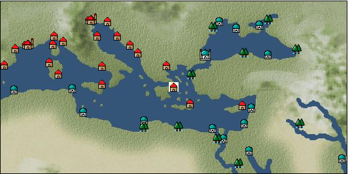

# Port: アテネ

import Tabs from '@theme/Tabs';
import TabItem from '@theme/TabItem';

## General Information

| Attribute | Details |
| :--- | :--- |
| **Port Name** | athens |
| **Port Type** | port of alliance |
| **Region** | eastern europe |
| **Sea Area** | eastern mediterranean |
| **Required Language** | greek |
| **Coordinates** | （1088，3258） |
| **Investment Reward** | [greek mythology sculpture](docs/Items/RecipeBooks/item_976.md) （必要投資額：1,660,000ドゥカード） |

### Available Facilities

| guild | intermediary | exchange | tool shop | workshop craftsman | Painter | sculptor | peddler |
| --- | --- | --- | --- | --- | --- | --- | --- |
| ○ | ○ | ○ | ○ | ○ |   |   | ○ |
| Shipyard Master | Lumbermaker | Sail-maker | weapon craftsman | master | TavernFemale | archive | salesperson |
| --- | --- | --- | --- | --- | --- | --- | --- |
| ○ |   |   | ○ | ○ | ○ | ○ | ○ |
| Shipwright | 銀行 | street worker | 王宮 | Trading post | church | suburbs | translator |
| --- | --- | --- | --- | --- | --- | --- | --- |
| ○ | ○ |   | ○ | ○ | ○ | ○ | ○ |

### Description
A city with a long history dating back to the ancient Greek era. The Parthenon stands on the Acropolis hill, and is said to have once housed a 10m tall statue of Athena. In addition to olives, the area also produces high-quality marble. Tavern woman: Myrine *Can also speak Turkish Suburbs: Northwest of Athens → Phokis region / West of Athens → Olympia region Cultural area: Balkans Memos, etc.: Eastern European languages

<Tabs>
  <TabItem value="trade_goods_sales" label="Trade Goods Sales">

| item | group | purchase price | 同盟時 | remarks |
| --- | --- | --- | --- | --- |
| [olive](docs/Items/TradeGoods/TradeGoods-Foodstuffs/item_47.md) | [Trading items (food items)](docs/Categories/category_3.md) | 250 | 224 |  |
| When in alliance: confirmed at 100% |
| [olive oil](docs/Items/TradeGoods/TradeGoods-Seasonings/item_48.md) | [交易品（調味料）](docs/Categories/category_4.md) | (315) | 276 |  |
| [oakmoss](docs/Items/TradeGoods/TradeGoods-Perfume/item_819.md) | [Trading Goods (Spices)](docs/Categories/category_11.md) | (685) | 600 |  |
| 要投資（必要投資額：240,000） |
| [wax](docs/Items/TradeGoods/TradeGoods-Wares/item_54.md) | [交易品（工業品）](docs/Categories/category_19.md) | (768) | 672 |  |
| [古美術品](docs/Items/TradeGoods/TradeGoods-Art/item_51.md) | [交易品（美術品）](docs/Categories/category_14.md) | 3,680 | 3,280 |  |
| [marble](docs/Items/TradeGoods/TradeGoods-Wares/item_52.md) | [交易品（工業品）](docs/Categories/category_19.md) | (1,268) | 1,110 |  |
| When in alliance: confirmed at 100% |
| [marble statue](docs/Items/TradeGoods/TradeGoods-Art/item_50.md) | [交易品（美術品）](docs/Categories/category_14.md) | (2,903) | 2,540 |  |
| When in alliance: confirmed at 100% |
| [scimitar](docs/Items/TradeGoods/TradeGoods-Weapons/item_142.md) | [Trading Items (Arms)](docs/Categories/category_16.md) | 972 | 868 |  |
| Investment required (Required investment amount: 180,000) At alliance: Confirmed at 100% |
| [羊皮紙](docs/Items/TradeGoods/TradeGoods-Wares/item_53.md) | [交易品（工業品）](docs/Categories/category_19.md) | (1,124) | 984 |  |
| When in alliance: confirmed at 100% |
| [Honey](docs/Items/TradeGoods/TradeGoods-Seasonings/item_49.md) | [交易品（調味料）](docs/Categories/category_4.md) | 860 | 768 |  |
| When in alliance: confirmed at 100% |
  </TabItem>
  <TabItem value="sale_specialty" label="Sale (Specialty)">

| item | group | sale price | 同盟時 | remarks |
| --- | --- | --- | --- | --- |

#### [交易品（繊維）](docs/Categories/category_1.md)

| [feather](docs/Items/TradeGoods/TradeGoods-Fibers/item_585.md) | 交易品（繊維） | 873 | (982) |  |

#### [Trading Goods (Dye)](docs/Categories/category_2.md)

| [mayan blue](docs/Items/TradeGoods/TradeGoods-Dye/item_1096.md) | Trading Goods (Dye) | (1,493) | 1,741 |  |
| [mimosa](docs/Items/TradeGoods/TradeGoods-Dye/item_2281.md) | Trading Goods (Dye) | 1,586 | (1,784) |  |

#### [Trading items (food items)](docs/Categories/category_3.md)

| [buckwheat](docs/Items/TradeGoods/TradeGoods-Foodstuffs/item_3430.md) | Trading items (food items) | (32,652) | 38,100 |  |
| When in alliance: confirmed at 100% |
| [Pearl millet](docs/Items/TradeGoods/TradeGoods-Foodstuffs/item_5557.md) | Trading items (food items) | (1,097) | 1,280 |  |

#### [交易品（調味料）](docs/Categories/category_4.md)

| [Gochujang](docs/Items/TradeGoods/TradeGoods-Seasonings/item_3591.md) | 交易品（調味料） | (6,608) | 7,710 |  |
| 98％＝7580　104％＝7980 |
| [tamarind](docs/Items/TradeGoods/TradeGoods-Seasonings/item_1968.md) | 交易品（調味料） | 2,203 | (2,478) |  |
| [soy sauce](docs/Items/TradeGoods/TradeGoods-Seasonings/item_3425.md) | 交易品（調味料） | (35,223) | 41,100 |  |
| 98％＝40300　104％＝42700 |
| [black vinegar](docs/Items/TradeGoods/TradeGoods-Seasonings/item_3475.md) | 交易品（調味料） | (4,611) | 5,380 |  |
| 98％＝5290　104％＝5560 |

#### [交易品（雑貨）](docs/Categories/category_5.md)

| [Japanese books](docs/Items/TradeGoods/TradeGoods-Misc/item_3439.md) | 交易品（雑貨） | (34,366) | 40,100 |  |
| When in alliance: confirmed at 100% |
| [lantern](docs/Items/TradeGoods/TradeGoods-Misc/item_3683.md) | 交易品（雑貨） | 9,670 | (10,879) |  |

#### [Trading products (medical products)](docs/Categories/category_6.md)

| [Saikaku](docs/Items/TradeGoods/TradeGoods-Medicine/item_1959.md) | Trading products (medical products) | (4,200) | 4,900 |  |
| When in alliance: confirmed at 100% |
| [tea tree](docs/Items/TradeGoods/TradeGoods-Medicine/item_2283.md) | Trading products (medical products) | 1,390 | (1,563) |  |
| [Borei](docs/Items/TradeGoods/TradeGoods-Medicine/item_3678.md) | Trading products (medical products) | (44,650) | 52,100 |  |
| 98％＝51100　105％＝54700 |

#### [Trading Items (Iron Stone)](docs/Categories/category_7.md)

| [Hokutolite](docs/Items/TradeGoods/TradeGoods-Minerals/item_3694.md) | Trading Items (Iron Stone) | (32,224) | 37,600 |  |
| 98％＝36900　103％＝38700 |

#### [Trading products (precious metals)](docs/Categories/category_8.md)

| [佐摩銀](docs/Items/TradeGoods/TradeGoods-Metals/item_3432.md) | Trading products (precious metals) | 37,700 | (42,416) |  |

#### [交易品（酒類）](docs/Categories/category_9.md)

| [aquavit](docs/Items/TradeGoods/TradeGoods-Alcohol/item_572.md) | 交易品（酒類） | 819 | (921) |  |
| [whiskey](docs/Items/TradeGoods/TradeGoods-Alcohol/item_1.md) | 交易品（酒類） | 979 | (1,101) |  |
| [sherry](docs/Items/TradeGoods/TradeGoods-Alcohol/item_844.md) | 交易品（酒類） | (494) | 576 |  |
| When in alliance: confirmed at 100% |
| [gin](docs/Items/TradeGoods/TradeGoods-Alcohol/item_291.md) | 交易品（酒類） | 1,002 | (1,127) |  |
| [Sake](docs/Items/TradeGoods/TradeGoods-Alcohol/item_3424.md) | 交易品（酒類） | 35,500 | (39,941) |  |

#### [Trading goods (hobby goods)](docs/Categories/category_10.md)

| [Aigyoku](docs/Items/TradeGoods/TradeGoods-Sunddries/item_3677.md) | Trading goods (hobby goods) | (31,709) | 37,000 |  |
| [almond](docs/Items/TradeGoods/TradeGoods-Sunddries/item_367.md) | Trading goods (hobby goods) | 207 | (232) |  |
| [durian](docs/Items/TradeGoods/TradeGoods-Sunddries/item_1949.md) | Trading goods (hobby goods) | 1,917 | (2,156) |  |
| [eggplant](docs/Items/TradeGoods/TradeGoods-Sunddries/item_3426.md) | Trading goods (hobby goods) | (45,164) | 52,700 |  |
| When in alliance: confirmed at 100% |
| [blueberry](docs/Items/TradeGoods/TradeGoods-Sunddries/item_4657.md) | Trading goods (hobby goods) | (1,166) | 1,360 |  |
| [macadamia nuts](docs/Items/TradeGoods/TradeGoods-Sunddries/item_2282.md) | Trading goods (hobby goods) | 1,158 | (1,302) |  |
| [black tea](docs/Items/TradeGoods/TradeGoods-Sunddries/item_675.md) | Trading goods (hobby goods) | 2,414 | (2,716) |  |
| [raspberry](docs/Items/TradeGoods/TradeGoods-Sunddries/item_5419.md) | Trading goods (hobby goods) | 9,730 | (10,947) |  |

#### [Trading Goods (Spices)](docs/Categories/category_11.md)

| [orange oil](docs/Items/TradeGoods/TradeGoods-Perfume/item_778.md) | Trading Goods (Spices) | 1,139 | (1,281) |  |
| ●Special products of East Africa |
| [gardenia](docs/Items/TradeGoods/TradeGoods-Perfume/item_1091.md) | Trading Goods (Spices) | (31,967) | 37,300 |  |
| 98％＝36600　104％＝38800 |
| [jasmine](docs/Items/TradeGoods/TradeGoods-Perfume/item_772.md) | Trading Goods (Spices) | 6,625 | (7,453) |  |
| [lily of the valley](docs/Items/TradeGoods/TradeGoods-Perfume/item_358.md) | Trading Goods (Spices) | 1,513 | (1,702) |  |
| [geranium](docs/Items/TradeGoods/TradeGoods-Perfume/item_145.md) | Trading Goods (Spices) | 1,154 | (1,298) |  |
| [Hamanasu](docs/Items/TradeGoods/TradeGoods-Perfume/item_3692.md) | Trading Goods (Spices) | (30,938) | 36,100 |  |
| When in alliance: confirmed at 100% |
| [eucalyptus](docs/Items/TradeGoods/TradeGoods-Perfume/item_2278.md) | Trading Goods (Spices) | 1,106 | (1,244) |  |
| [mastic](docs/Items/TradeGoods/TradeGoods-Perfume/item_680.md) | Trading Goods (Spices) | 2,424 | (2,727) |  |
| [sandalwood](docs/Items/TradeGoods/TradeGoods-Perfume/item_771.md) | Trading Goods (Spices) | 3,546 | (3,989) |  |
| [貝甲香](docs/Items/TradeGoods/TradeGoods-Perfume/item_776.md) | Trading Goods (Spices) | 2,102 | (2,364) |  |

#### [Trading Goods (Spices)](docs/Categories/category_12.md)

| [Kouzuku](docs/Items/TradeGoods/TradeGoods-Spices/item_3690.md) | Trading Goods (Spices) | (32,138) | 37,500 |  |
| 98％＝36800　103％＝38600 |
| [pepper](docs/Items/TradeGoods/TradeGoods-Spices/item_58.md) | Trading Goods (Spices) | 12,756 | (14,351) |  |
| [Grapefruit](docs/Items/TradeGoods/TradeGoods-Spices/item_3422.md) | Trading Goods (Spices) | (34,538) | 40,300 |  |
| 98％＝39500　105％＝42300 |

#### [Trading goods (artificial goods)](docs/Categories/category_13.md)

| [Darla Hest](docs/Items/TradeGoods/TradeGoods-Luxuries/item_6190.md) | Trading goods (artificial goods) | (4,285) | 5,000 |  |
| [lacquerware](docs/Items/TradeGoods/TradeGoods-Luxuries/item_3435.md) | Trading goods (artificial goods) | 37,059 | (41,695) |  |
| [Saori](docs/Items/TradeGoods/TradeGoods-Luxuries/item_3676.md) | Trading goods (artificial goods) | (9,809) | 11,445 |  |

#### [交易品（美術品）](docs/Categories/category_14.md)

| [Japanese painting](docs/Items/TradeGoods/TradeGoods-Art/item_3436.md) | 交易品（美術品） | 35,100 | (39,491) |  |

#### [Trading Items (Gemstones)](docs/Categories/category_15.md)

| [aventurine](docs/Items/TradeGoods/TradeGoods-Gems/item_678.md) | Trading Items (Gemstones) | (5,365) | 6,260 |  |
| [opal](docs/Items/TradeGoods/TradeGoods-Gems/item_2006.md) | Trading Items (Gemstones) | (7,775) | 9,072 |  |
| [cat's eye](docs/Items/TradeGoods/TradeGoods-Gems/item_1047.md) | Trading Items (Gemstones) | (9,727) | 11,350 |  |
| [sapphire](docs/Items/TradeGoods/TradeGoods-Gems/item_676.md) | Trading Items (Gemstones) | (11,141) | 13,000 |  |
| [diamond](docs/Items/TradeGoods/TradeGoods-Gems/item_449.md) | Trading Items (Gemstones) | (7,379) | 8,610 |  |
| When in alliance: confirmed at 100% |
| [topaz](docs/Items/TradeGoods/TradeGoods-Gems/item_1097.md) | Trading Items (Gemstones) | (5,571) | 6,500 |  |
| [ruby](docs/Items/TradeGoods/TradeGoods-Gems/item_773.md) | Trading Items (Gemstones) | (12,334) | 14,391 |  |
| [amber](docs/Items/TradeGoods/TradeGoods-Gems/item_618.md) | Trading Items (Gemstones) | (4,166) | 4,860 |  |

#### [Trading Items (Firearms)](docs/Categories/category_17.md)

| [musket gun](docs/Items/TradeGoods/TradeGoods-Firearms/item_584.md) | Trading Items (Firearms) | (2,846) | 3,320 |  |
| When in alliance: confirmed at 100% |
| [tanegashima gun](docs/Items/TradeGoods/TradeGoods-Firearms/item_3423.md) | Trading Items (Firearms) | (30,424) | 35,500 |  |

#### [交易品（工業品）](docs/Categories/category_19.md)

| [rubber](docs/Items/TradeGoods/TradeGoods-Wares/item_2819.md) | 交易品（工業品） | 1,596 | (1,795) |  |
| [Japanese paper](docs/Items/TradeGoods/TradeGoods-Wares/item_3438.md) | 交易品（工業品） | 34,855 | (39,215) |  |
| [paint](docs/Items/TradeGoods/TradeGoods-Wares/item_3411.md) | 交易品（工業品） | (2,623) | 3,060 |  |
| When in alliance: confirmed at 100% |

#### [交易品（織物）](docs/Categories/category_20.md)

| [indian chintz](docs/Items/TradeGoods/TradeGoods-Fabrics/item_159.md) | 交易品（織物） | 2,321 | (2,611) |  |
| [flannel](docs/Items/TradeGoods/TradeGoods-Fabrics/item_149.md) | 交易品（織物） | (1,483) | 1,730 |  |
| When in alliance: confirmed at 100% |
| [大和錦](docs/Items/TradeGoods/TradeGoods-Fabrics/item_3482.md) | 交易品（織物） | 18,900 | (21,264) |  |
| [Nishijin textile](docs/Items/TradeGoods/TradeGoods-Fabrics/item_3431.md) | 交易品（織物） | 36,600 | (41,179) |  |
  </TabItem>
  <TabItem value="sale_no_specialty" label="Sale (No Specialty)">

| item | group | sale price | 同盟時 | remarks |
| --- | --- | --- | --- | --- |

#### [交易品（繊維）](docs/Categories/category_1.md)

| [camel hair](docs/Items/TradeGoods/TradeGoods-Fibers/item_577.md) | 交易品（繊維） | 492 | (553) |  |
| [raw silk](docs/Items/TradeGoods/TradeGoods-Fibers/item_677.md) | 交易品（繊維） | (2,246) | 2,620 |  |
| [leather](docs/Items/TradeGoods/TradeGoods-Fibers/item_44.md) | 交易品（繊維） | (624) | 727 |  |
| 98% = 712 101% = 734 Expensive because it is made of parchment material |
| [cotton](docs/Items/TradeGoods/TradeGoods-Fibers/item_610.md) | 交易品（繊維） | 655 | (736) |  |
| [wool](docs/Items/TradeGoods/TradeGoods-Fibers/item_5.md) | 交易品（繊維） | 486 | (546) |  |
| [numb](docs/Items/TradeGoods/TradeGoods-Fibers/item_900.md) | 交易品（繊維） | 12 | (13) |  |

#### [Trading Goods (Dye)](docs/Categories/category_2.md)

| [ward](docs/Items/TradeGoods/TradeGoods-Dye/item_57.md) | Trading Goods (Dye) | 1,026 | (1,154) |  |
| [Safflower](docs/Items/TradeGoods/TradeGoods-Dye/item_1059.md) | Trading Goods (Dye) | 589 | (662) |  |
| [persian berry](docs/Items/TradeGoods/TradeGoods-Dye/item_693.md) | Trading Goods (Dye) | (1,226) | 1,430 |  |
| 98％＝1400　103％＝1470 |
| [貝紫](docs/Items/TradeGoods/TradeGoods-Dye/item_110.md) | Trading Goods (Dye) | 4,150 | (4,669) |  |

#### [Trading items (food items)](docs/Categories/category_3.md)

| [fava beans](docs/Items/TradeGoods/TradeGoods-Foodstuffs/item_102.md) | Trading items (food items) | 90 | (101) |  |
| [duck meat](docs/Items/TradeGoods/TradeGoods-Foodstuffs/item_32.md) | Trading items (food items) | 456 | (513) |  |
| [turnip](docs/Items/TradeGoods/TradeGoods-Foodstuffs/item_55.md) | Trading items (food items) | 85 | (95) |  |
| [Quinoa](docs/Items/TradeGoods/TradeGoods-Foodstuffs/item_2994.md) | Trading items (food items) | (335) | 390 |  |
| When in alliance: confirmed at 100% |
| [sugar cane](docs/Items/TradeGoods/TradeGoods-Foodstuffs/item_93.md) | Trading items (food items) | 253 | (284) |  |
| [sausage](docs/Items/TradeGoods/TradeGoods-Foodstuffs/item_27.md) | Trading items (food items) | 369 | (415) |  |
| [european crayfish](docs/Items/TradeGoods/TradeGoods-Foodstuffs/item_6188.md) | Trading items (food items) | (6,102) | 7,120 |  |
| [egg](docs/Items/TradeGoods/TradeGoods-Foodstuffs/item_40.md) | Trading items (food items) | 31 | (34) |  |
| [flour](docs/Items/TradeGoods/TradeGoods-Foodstuffs/item_605.md) | Trading items (food items) | 51 | (57) |  |
| [Paddy rice](docs/Items/TradeGoods/TradeGoods-Foodstuffs/item_654.md) | Trading items (food items) | (79) | 92 |  |
| When in alliance: confirmed at 100% |
| [beef](docs/Items/TradeGoods/TradeGoods-Foodstuffs/item_26.md) | Trading items (food items) | 724 | (814) |  |
| [mutton](docs/Items/TradeGoods/TradeGoods-Foodstuffs/item_33.md) | Trading items (food items) | 355 | (399) |  |
| [pork](docs/Items/TradeGoods/TradeGoods-Foodstuffs/item_41.md) | Trading items (food items) | (308) | 359 |  |
| When in alliance: confirmed at 100% |
| [陸稲](docs/Items/TradeGoods/TradeGoods-Foodstuffs/item_100.md) | Trading items (food items) | (89) | 103 |  |
| When in alliance: confirmed at 100% |
| [魚肉](docs/Items/TradeGoods/TradeGoods-Foodstuffs/item_10.md) | Trading items (food items) | (170) | 198 |  |
| [chicken meat](docs/Items/TradeGoods/TradeGoods-Foodstuffs/item_29.md) | Trading items (food items) | 310 | 357 |  |

#### [交易品（調味料）](docs/Categories/category_4.md)

| [jam](docs/Items/TradeGoods/TradeGoods-Seasonings/item_427.md) | 交易品（調味料） | (579) | 675 |  |
| 98％＝661　102％＝688 |
| [herbal vinegar](docs/Items/TradeGoods/TradeGoods-Seasonings/item_908.md) | 交易品（調味料） | (155) | 180 |  |
| When in alliance: confirmed at 100% |
| [butter](docs/Items/TradeGoods/TradeGoods-Seasonings/item_3.md) | 交易品（調味料） | 389 | (437) |  |
| [wine vinegar](docs/Items/TradeGoods/TradeGoods-Seasonings/item_429.md) | 交易品（調味料） | 579 | (651) |  |
| [salt](docs/Items/TradeGoods/TradeGoods-Seasonings/item_42.md) | 交易品（調味料） | 241 | (271) |  |
| [sugar](docs/Items/TradeGoods/TradeGoods-Seasonings/item_94.md) | 交易品（調味料） | (744) | 868 |  |
| 98％＝952　101％＝981 |

#### [Trading products (medical products)](docs/Categories/category_6.md)

| [nettle](docs/Items/TradeGoods/TradeGoods-Medicine/item_6189.md) | Trading products (medical products) | (659) | 768 |  |
| [digitalis](docs/Items/TradeGoods/TradeGoods-Medicine/item_2148.md) | Trading products (medical products) | 425 | (478) |  |
| [dandelion](docs/Items/TradeGoods/TradeGoods-Medicine/item_1089.md) | Trading products (medical products) | (270) | 315 |  |
| When in alliance: confirmed at 100% |
| [belladonna](docs/Items/TradeGoods/TradeGoods-Medicine/item_1056.md) | Trading products (medical products) | (481) | 561 |  |
| When in alliance: confirmed at 100% |
| [Nothing](docs/Items/TradeGoods/TradeGoods-Medicine/item_1053.md) | Trading products (medical products) | 712 | 711 |  |

#### [Trading Items (Iron Stone)](docs/Categories/category_7.md)

| [tin ore](docs/Items/TradeGoods/TradeGoods-Minerals/item_23.md) | Trading Items (Iron Stone) | (516) | 602 |  |
| When in alliance: confirmed at 100% |
| [zinc ore](docs/Items/TradeGoods/TradeGoods-Minerals/item_626.md) | Trading Items (Iron Stone) | (432) | 504 |  |
| When in alliance: confirmed at 100% |
| [iron ore](docs/Items/TradeGoods/TradeGoods-Minerals/item_146.md) | Trading Items (Iron Stone) | 752 | (846) |  |
| [lead ore](docs/Items/TradeGoods/TradeGoods-Minerals/item_21.md) | Trading Items (Iron Stone) | (447) | 521 |  |
| When in alliance: confirmed at 100% |

#### [Trading products (precious metals)](docs/Categories/category_8.md)

| [gold dust](docs/Items/TradeGoods/TradeGoods-Metals/item_111.md) | Trading products (precious metals) | 3,278 | (3,688) |  |
| [silver](docs/Items/TradeGoods/TradeGoods-Metals/item_136.md) | Trading products (precious metals) | (2,649) | 3,090 |  |
| When in alliance: confirmed at 100% |

#### [交易品（酒類）](docs/Categories/category_9.md)

| [brandy](docs/Items/TradeGoods/TradeGoods-Alcohol/item_9.md) | 交易品（酒類） | 853 | 853 |  |
| [palm wine](docs/Items/TradeGoods/TradeGoods-Alcohol/item_436.md) | 交易品（酒類） | 451 | (507) |  |
| [rum](docs/Items/TradeGoods/TradeGoods-Alcohol/item_139.md) | 交易品（酒類） | 719 | 757 |  |
| [liqueur](docs/Items/TradeGoods/TradeGoods-Alcohol/item_18.md) | 交易品（酒類） | 666 | (749) |  |
| [wine](docs/Items/TradeGoods/TradeGoods-Alcohol/item_11.md) | 交易品（酒類） | 497 | 519 |  |

#### [Trading goods (hobby goods)](docs/Categories/category_10.md)

| [walnut](docs/Items/TradeGoods/TradeGoods-Sunddries/item_522.md) | Trading goods (hobby goods) | 493 | (554) |  |
| [papaya](docs/Items/TradeGoods/TradeGoods-Sunddries/item_1948.md) | Trading goods (hobby goods) | 530 | (596) |  |
| [pickles](docs/Items/TradeGoods/TradeGoods-Sunddries/item_535.md) | Trading goods (hobby goods) | 287 | (322) |  |
| [prune](docs/Items/TradeGoods/TradeGoods-Sunddries/item_523.md) | Trading goods (hobby goods) | 395 | 403 |  |
| [hazelnut](docs/Items/TradeGoods/TradeGoods-Sunddries/item_125.md) | Trading goods (hobby goods) | 481 | (541) |  |
| [dried figs](docs/Items/TradeGoods/TradeGoods-Sunddries/item_611.md) | Trading goods (hobby goods) | 330 | (371) |  |

#### [Trading Goods (Spices)](docs/Categories/category_11.md)

| [daffodil](docs/Items/TradeGoods/TradeGoods-Perfume/item_612.md) | Trading Goods (Spices) | 855 | (961) |  |
| [lavender](docs/Items/TradeGoods/TradeGoods-Perfume/item_150.md) | Trading Goods (Spices) | 945 | (1,063) |  |
| [lemon oil](docs/Items/TradeGoods/TradeGoods-Perfume/item_151.md) | Trading Goods (Spices) | 625 | (703) |  |
| [rose](docs/Items/TradeGoods/TradeGoods-Perfume/item_536.md) | Trading Goods (Spices) | 3,113 | (3,502) |  |
| [Ryushu incense](docs/Items/TradeGoods/TradeGoods-Perfume/item_101.md) | Trading Goods (Spices) | 4,220 | 4,220 |  |
| 98％＝4140　107％＝4520 |
| [Musk](docs/Items/TradeGoods/TradeGoods-Perfume/item_158.md) | Trading Goods (Spices) | 4,099 | (4,611) |  |

#### [Trading Goods (Spices)](docs/Categories/category_12.md)

| [oregano](docs/Items/TradeGoods/TradeGoods-Spices/item_430.md) | Trading Goods (Spices) | 532 | 529 |  |
| [garlic](docs/Items/TradeGoods/TradeGoods-Spices/item_526.md) | Trading Goods (Spices) | 333 | (374) |  |
| [coriander](docs/Items/TradeGoods/TradeGoods-Spices/item_1044.md) | Trading Goods (Spices) | (432) | 503 |  |
| 98％＝492　102％＝513 |
| [ginger](docs/Items/TradeGoods/TradeGoods-Spices/item_112.md) | Trading Goods (Spices) | 2,094 | (2,355) |  |
| [parsley](docs/Items/TradeGoods/TradeGoods-Spices/item_46.md) | Trading Goods (Spices) | (132) | 154 |  |
| When in alliance: confirmed at 100% |
| [fennel](docs/Items/TradeGoods/TradeGoods-Spices/item_1045.md) | Trading Goods (Spices) | (321) | 374 |  |
| 98％＝366　103％＝385 |
| [Laurier](docs/Items/TradeGoods/TradeGoods-Spices/item_615.md) | Trading Goods (Spices) | 151 | (169) |  |

#### [Trading goods (artificial goods)](docs/Categories/category_13.md)

| [glasswork](docs/Items/TradeGoods/TradeGoods-Luxuries/item_60.md) | Trading goods (artificial goods) | 1,325 | 1,350 |  |
| [coral work](docs/Items/TradeGoods/TradeGoods-Luxuries/item_595.md) | Trading goods (artificial goods) | (2,626) | 3,064 |  |
| [dragonfly ball](docs/Items/TradeGoods/TradeGoods-Luxuries/item_294.md) | Trading goods (artificial goods) | (1,049) | 1,224 |  |
| [lapidary work](docs/Items/TradeGoods/TradeGoods-Luxuries/item_153.md) | Trading goods (artificial goods) | 4,240 | (4,770) |  |
| [皮革製品](docs/Items/TradeGoods/TradeGoods-Luxuries/item_12.md) | Trading goods (artificial goods) | (1,166) | 1,360 |  |
| When in alliance: confirmed at 100% |
| [Ivory work](docs/Items/TradeGoods/TradeGoods-Luxuries/item_1090.md) | Trading goods (artificial goods) | (2,863) | 3,340 |  |
| When in alliance: confirmed at 100% |
| [goldsmith](docs/Items/TradeGoods/TradeGoods-Luxuries/item_687.md) | Trading goods (artificial goods) | 2,820 | (3,172) |  |
| [silversmith](docs/Items/TradeGoods/TradeGoods-Luxuries/item_619.md) | Trading goods (artificial goods) | 2,893 | (3,254) |  |
| [ceramics](docs/Items/TradeGoods/TradeGoods-Luxuries/item_152.md) | Trading goods (artificial goods) | 1,510 | (1,698) |  |

#### [交易品（美術品）](docs/Categories/category_14.md)

| [wooden statue](docs/Items/TradeGoods/TradeGoods-Art/item_95.md) | 交易品（美術品） | (1,140) | 1,330 |  |
| 98％＝1300　102％＝1350 |
| [stone statue](docs/Items/TradeGoods/TradeGoods-Art/item_899.md) | 交易品（美術品） | (1,509) | 1,760 |  |
| 98％＝1720　103％＝1810 |
| [copperplate print](docs/Items/TradeGoods/TradeGoods-Art/item_1087.md) | 交易品（美術品） | 793 | (892) |  |
| [青銅像](docs/Items/TradeGoods/TradeGoods-Art/item_148.md) | 交易品（美術品） | 1,060 | (1,192) |  |

#### [Trading Items (Gemstones)](docs/Categories/category_15.md)

| [Agate](docs/Items/TradeGoods/TradeGoods-Gems/item_107.md) | Trading Items (Gemstones) | (4,637) | 5,410 |  |
| [emerald](docs/Items/TradeGoods/TradeGoods-Gems/item_777.md) | Trading Items (Gemstones) | (8,212) | 9,582 |  |
| [coral](docs/Items/TradeGoods/TradeGoods-Gems/item_141.md) | Trading Items (Gemstones) | 2,884 | 3,100 |  |
| [crystal](docs/Items/TradeGoods/TradeGoods-Gems/item_893.md) | Trading Items (Gemstones) | 1,902 | (2,139) |  |
| [pearl](docs/Items/TradeGoods/TradeGoods-Gems/item_769.md) | Trading Items (Gemstones) | (10,542) | 12,300 |  |
| When in alliance: confirmed at 100% |
| [ivory](docs/Items/TradeGoods/TradeGoods-Gems/item_699.md) | Trading Items (Gemstones) | 4,067 | (4,575) |  |

#### [Trading Items (Arms)](docs/Categories/category_16.md)

| [crossbow](docs/Items/TradeGoods/TradeGoods-Weapons/item_537.md) | Trading Items (Arms) | 979 | (1,101) |  |
| [two-handed sword](docs/Items/TradeGoods/TradeGoods-Weapons/item_24.md) | Trading Items (Arms) | 1,479 | (1,664) |  |
| [one handed sword](docs/Items/TradeGoods/TradeGoods-Weapons/item_433.md) | Trading Items (Arms) | (986) | 1,150 |  |
| When in alliance: confirmed at 100% |

#### [Trading Items (Firearms)](docs/Categories/category_17.md)

| [arquebus gun](docs/Items/TradeGoods/TradeGoods-Firearms/item_14.md) | Trading Items (Firearms) | (1,723) | 2,010 |  |
| When in alliance: confirmed at 100% |
| [大砲](docs/Items/TradeGoods/TradeGoods-Firearms/item_4.md) | Trading Items (Firearms) | (3,171) | 3,700 |  |
| When in alliance: confirmed at 100% |
| [bullet](docs/Items/TradeGoods/TradeGoods-Firearms/item_13.md) | Trading Items (Firearms) | (789) | 920 |  |
| When in alliance: confirmed at 100% |
| [cannonball](docs/Items/TradeGoods/TradeGoods-Firearms/item_144.md) | Trading Items (Firearms) | (1,483) | 1,730 |  |
| When in alliance: confirmed at 100% |

#### [Trading Goods (Livestock)](docs/Categories/category_18.md)

| [duck](docs/Items/TradeGoods/TradeGoods-Livestock/item_38.md) | Trading Goods (Livestock) | 60 | 69 |  |
| [chicken](docs/Items/TradeGoods/TradeGoods-Livestock/item_252.md) | Trading Goods (Livestock) | 48 | (54) |  |
| [sheep](docs/Items/TradeGoods/TradeGoods-Livestock/item_253.md) | Trading Goods (Livestock) | 131 | (147) |  |

#### [交易品（工業品）](docs/Categories/category_19.md)

| [papyrus](docs/Items/TradeGoods/TradeGoods-Wares/item_616.md) | 交易品（工業品） | (423) | 493 |  |
| [log](docs/Items/TradeGoods/TradeGoods-Wares/item_846.md) | 交易品（工業品） | 132 | (148) |  |
| [wood](docs/Items/TradeGoods/TradeGoods-Wares/item_277.md) | 交易品（工業品） | 743 | 864 |  |
| [水銀](docs/Items/TradeGoods/TradeGoods-Wares/item_15.md) | 交易品（工業品） | (1,157) | 1,350 |  |
| When in alliance: confirmed at 100% |
| [graphite](docs/Items/TradeGoods/TradeGoods-Wares/item_25.md) | 交易品（工業品） | (1,029) | 1,200 |  |
| When in alliance: confirmed at 100% |
| [Stone](docs/Items/TradeGoods/TradeGoods-Wares/item_276.md) | 交易品（工業品） | 927 | (1,042) |  |
| [oil](docs/Items/TradeGoods/TradeGoods-Wares/item_613.md) | 交易品（工業品） | 620 | (697) |  |
| [sulfur](docs/Items/TradeGoods/TradeGoods-Wares/item_66.md) | 交易品（工業品） | (496) | 578 |  |
| When in alliance: confirmed at 100% |
| [iron material](docs/Items/TradeGoods/TradeGoods-Wares/item_268.md) | 交易品（工業品） | 1,157 | (1,301) |  |
| [鋼](docs/Items/TradeGoods/TradeGoods-Wares/item_573.md) | 交易品（工業品） | 1,427 | (1,605) |  |
| [青銅](docs/Items/TradeGoods/TradeGoods-Wares/item_7.md) | 交易品（工業品） | 1,100 | (1,237) |  |

#### [交易品（織物）](docs/Categories/category_20.md)

| [georgette](docs/Items/TradeGoods/TradeGoods-Fabrics/item_1000.md) | 交易品（織物） | 3,120 | (3,510) |  |
| [damask](docs/Items/TradeGoods/TradeGoods-Fabrics/item_614.md) | 交易品（織物） | 3,486 | (3,922) |  |
| [tweed](docs/Items/TradeGoods/TradeGoods-Fabrics/item_31.md) | 交易品（織物） | 1,440 | (1,620) |  |
| [turkish rug](docs/Items/TradeGoods/TradeGoods-Fabrics/item_686.md) | 交易品（織物） | 3,900 | (4,387) |  |
| ▲Special products from neighboring cultural areas |
| [knit](docs/Items/TradeGoods/TradeGoods-Fabrics/item_164.md) | 交易品（織物） | 639 | (718) |  |
| [velvet](docs/Items/TradeGoods/TradeGoods-Fabrics/item_902.md) | 交易品（織物） | 3,313 | (3,727) |  |
| [woolen fabric](docs/Items/TradeGoods/TradeGoods-Fabrics/item_163.md) | 交易品（織物） | 1,009 | (1,135) |  |
| [cotton fabric](docs/Items/TradeGoods/TradeGoods-Fabrics/item_571.md) | 交易品（織物） | 1,053 | 1,100 |  |
| [linen fabric](docs/Items/TradeGoods/TradeGoods-Fabrics/item_135.md) | 交易品（織物） | 471 | (529) |  |
  </TabItem>
  <TabItem value="guild_&_others" label="Guild & Others">

| item | group | Sales price | Handling NPC | remarks |
| --- | --- | --- | --- | --- |

#### adventure guild

| [rescue](docs/Skills/Skill-Adventure/item_360.md) | [Skill (adventure)](docs/Categories/category_39.md) | 8,000 | adventure guild |  |
| [trap](docs/Skills/Skill-Adventure/item_3579.md) | [Skill (adventure)](docs/Categories/category_39.md) | 250,000 | adventure guild |  |
| [archeology](docs/Skills/Skill-Adventure/item_342.md) | [Skill (adventure)](docs/Categories/category_39.md) | 3,000 | adventure guild |  |

#### merchant guild

| [storage](docs/Skills/Skill-Trade/item_473.md) | [Skill (trade)](docs/Categories/category_40.md) | 8,000 | merchant guild |  |
| [art trade](docs/Skills/Skill-Trade/item_489.md) | [Skill (trade)](docs/Categories/category_40.md) | 50,000 | merchant guild |  |
| [運用](docs/Skills/Skill-Trade/item_469.md) | [Skill (trade)](docs/Categories/category_40.md) | 8,000 | merchant guild |  |

#### maritime guild

| [lookout](docs/Skills/Skill-Battle/item_508.md) | [Skill (combat)](docs/Categories/category_41.md) | 1,000 | maritime guild |  |
| [arabic](docs/Skills/Skills-Language/item_440.md) | [Skills (language)](docs/Categories/category_42.md) | 10,000 | maritime guild |  |

#### La Valette

| [swordplay](docs/Skills/Skill-Battle/item_495.md) | [Skill (combat)](docs/Categories/category_41.md) | 8,000 | La Valette |  |
| [tactics](docs/Skills/Skill-Battle/item_501.md) | [Skill (combat)](docs/Categories/category_41.md) | 10,000 | La Valette |  |
| [assault](docs/Skills/Skill-Battle/item_499.md) | [Skill (combat)](docs/Categories/category_41.md) | 30,000 | La Valette |  |

#### engineer martinengo

| [salvage](docs/Skills/Skill-Adventure/item_2275.md) | [Skill (adventure)](docs/Categories/category_39.md) | 8,000 | engineer martinengo |  |
| [Slavic languages](docs/Skills/Skills-Language/item_286.md) | [Skills (language)](docs/Categories/category_42.md) | 4,000 | engineer martinengo |  |

#### others

| [Folklore alchemy part 1](docs/Items/RecipeBooks/item_2144.md) | [recipe book](docs/Categories/category_22.md) | Fixed recipe |  |  |
| Owned by a wandering alchemist |
| [Shipbuilding materials/stern corridor](docs/Items/RecipeBooks/item_2443.md) | [recipe book](docs/Categories/category_22.md) | Fixed recipe |  |  |
  </TabItem>
  <TabItem value="toolman" label="Toolman">

| item | group | Sales price | Handling NPC | remarks |
| --- | --- | --- | --- | --- |

#### [recipe book](docs/Categories/category_22.md)

| [Mode Design Collection Volume 2](docs/Items/RecipeBooks/item_709.md) | recipe book | 30,000 | tool shop owner |  |
| 要投資（必要投資額：120,000） |
| [Staff officer's guide](docs/Items/RecipeBooks/item_743.md) | recipe book | 30,000 | tool shop owner |  |
| [Wand forging/application](docs/Items/RecipeBooks/item_710.md) | recipe book | 50,000 | tool shop owner |  |
| 要投資（必要投資額：120,000） |
| [How to sew long robes for ministers](docs/Items/RecipeBooks/item_866.md) | recipe book | 800,000 | tool shop owner |  |
| 要投資（必要投資額：400,000） |
| [Book of land battle props and crafts](docs/Items/RecipeBooks/item_521.md) | recipe book | 10,000 | tool shop owner |  |

#### [Equipment (body)](docs/Categories/category_24.md)

| [gilet](docs/Items/Equipment/Equipment-Body/item_78.md) | Equipment (body) | 27,500 | tool shop owner |  |
| [lace cufflinks handler](docs/Items/Equipment/Equipment-Body/item_528.md) | Equipment (body) | 41,100 | tool shop owner |  |
| [Toga, aide to the head of state](docs/Items/Equipment/Equipment-Body/item_864.md) | Equipment (body) | 360,000 | tool shop owner |  |
| 要投資（必要投資額：400,000） |

#### [Equipment (hands)](docs/Categories/category_25.md)

| [glove](docs/Items/Equipment/Equipment-Hands/item_223.md) | Equipment (hands) | 6,400 | tool shop owner |  |

#### [Equipment (legs)](docs/Categories/category_26.md)

| [cross strap sandals](docs/Items/Equipment/Equipment-Feet/item_99.md) | Equipment (legs) | 7,300 | tool shop owner |  |
| [gold embellished sandals](docs/Items/Equipment/Equipment-Feet/item_740.md) | Equipment (legs) | 6,600 | tool shop owner |  |

#### [Equipment (belongings)](docs/Categories/category_27.md)

| [saber](docs/Items/Equipment/Equipment-Weapon/item_865.md) | Equipment (belongings) | 29,100 | tool shop owner |  |
| 要投資（必要投資額：240,000） |
| [matchlock shooting gun](docs/Items/Equipment/Equipment-Weapon/item_103.md) | Equipment (belongings) | 3,000 | tool shop owner |  |
| [roundel dagger](docs/Items/Equipment/Equipment-Weapon/item_1670.md) | Equipment (belongings) | 24,500 | tool shop owner |  |
| 要投資（必要投資額：180,000） |
| [rosewood recorder](docs/Items/Equipment/Equipment-Weapon/item_741.md) | Equipment (belongings) | 8,000 | tool shop owner |  |
| 要投資（必要投資額：120,000） |
| [hunting bow](docs/Items/Equipment/Equipment-Weapon/item_3881.md) | Equipment (belongings) | 50,000 | tool shop owner |  |
| Added in EO Chapter 4 |

#### [装備品（服飾品）](docs/Categories/category_28.md)

| [Utilization guidebook volume 1](docs/Items/Equipment/Equipment-Accessory/item_2209.md) | 装備品（服飾品） | 10,000 | tool shop owner |  |
| 要投資（必要投資額：120,000） |
| [Consecutive Attack Guide Volume 1](docs/Items/Equipment/Equipment-Accessory/item_2208.md) | 装備品（服飾品） | 10,000 | tool shop owner |  |
| 要投資（必要投資額：120,000） |

#### [Consumables (land battle/deck battle)](docs/Categories/category_29.md)

| [hawk feather](docs/Items/Consumables/Consumables-Landbattle/item_562.md) | Consumables (land battle/deck battle) | 200 | tool shop owner |  |
| [throwing knife](docs/Items/Consumables/Consumables-Landbattle/item_560.md) | Consumables (land battle/deck battle) | 150 | tool shop owner |  |
| [Assortment of therapeutic drugs](docs/Items/Consumables/Consumables-Landbattle/item_564.md) | Consumables (land battle/deck battle) | 900 | tool shop owner |  |
| [secret cure](docs/Items/Consumables/Consumables-Landbattle/item_563.md) | Consumables (land battle/deck battle) | 600 | tool shop owner |  |

#### [Consumables (naval/hand-to-hand combat)](docs/Categories/category_30.md)

| [forged correspondence](docs/Items/Consumables/Consumables-navalhand-to-hand combat/item_559.md) | Consumables (naval/hand-to-hand combat) | 3,000 | tool shop owner |  |

#### [Consumables (skill activation)](docs/Categories/category_31.md)

| [card](docs/Items/Consumables/Consumables-Skill/item_855.md) | Consumables (skill activation) | 500 | tool shop owner |  |
| [Card (RANK2)](docs/Items/Consumables/Consumables-Skill/item_1652.md) | Consumables (skill activation) | 1,000 | tool shop owner |  |
| [fishing gear](docs/Items/Consumables/Consumables-Skill/item_79.md) | Consumables (skill activation) | 2,500 | tool shop owner |  |
| [sesame oil](docs/Items/Consumables/Consumables-Skill/item_742.md) | Consumables (skill activation) | 2,000 | tool shop owner |  |

#### [Consumables (request documents)](docs/Categories/category_45.md)

| [Textile purchase order](docs/Items/Consumables/Consumables-Documents/item_2977.md) | Consumables (request documents) | 50,000 | tool shop owner |  |
  </TabItem>
  <TabItem value="kobo_craftsmen" label="Craftsman">

| item | group | Sales price | Handling NPC | remarks |
| --- | --- | --- | --- | --- |

#### [Consumables (condition recovery)](docs/Categories/category_21.md)

| [Nostalgic carillon bell](docs/Items/Consumables/Consumables-Recovery/item_245.md) | Consumables (condition recovery) | 200 | workshop craftsman |  |
| [Ship song sheet music](docs/Items/Consumables/Consumables-Recovery/item_247.md) | Consumables (condition recovery) | 200 | workshop craftsman |  |

#### [recipe book](docs/Categories/category_22.md)

| [Special weapons manufacturing method](docs/Items/RecipeBooks/item_747.md) | recipe book | 100,000 | workshop craftsman |  |
| 要投資（必要投資額：180,000） |
| [Shipwright Introduction/Craft Book](docs/Items/RecipeBooks/item_75.md) | recipe book | Fixed recipe | workshop craftsman |  |

#### [Consumables (skill activation)](docs/Categories/category_31.md)

| [四分儀](docs/Items/Consumables/Consumables-Skill/item_346.md) | Consumables (skill activation) | 500 | workshop craftsman |  |

#### [Consumables (other)](docs/Categories/category_44.md)

| [帆塗料](docs/Items/Consumables/Consumables-Other/item_348.md) | Consumables (other) | 500 | workshop craftsman |  |
| [ship paint](docs/Items/Consumables/Consumables-Other/item_347.md) | Consumables (other) | 500 | workshop craftsman |  |

#### [shipbuilding materials](docs/Categories/category_47.md)

| [General purpose medium square sail](docs/Items/ShipbuildingFS/item_3453.md) | shipbuilding materials | 300,000 | workshop craftsman |  |
| [General purpose medium latin sail](docs/Items/ShipbuildingFS/item_3452.md) | shipbuilding materials | 300,000 | workshop craftsman |  |
| 要投資（必要投資額：不明） |
| [General-purpose medium-sized oar](docs/Items/ShipbuildingFS/item_3454.md) | shipbuilding materials | 500,000 | workshop craftsman |  |
| [General-purpose medium-sized reinforcement board](docs/Items/ShipbuildingFS/item_3456.md) | shipbuilding materials | 500,000 | workshop craftsman |  |
| [General-purpose medium-sized expansion warehouse](docs/Items/ShipbuildingFS/item_3534.md) | shipbuilding materials | 800,000 | workshop craftsman |  |
| [General-purpose medium-sized expansion cabin](docs/Items/ShipbuildingFS/item_3533.md) | shipbuilding materials | 800,000 | workshop craftsman |  |
| [General-purpose medium-sized improved rudder](docs/Items/ShipbuildingFS/item_3532.md) | shipbuilding materials | 800,000 | workshop craftsman |  |
| [General-purpose medium-sized paddle boat](docs/Items/ShipbuildingFS/item_3451.md) | shipbuilding materials | 1,000,000 | workshop craftsman |  |
| [General-purpose medium-sized anti-swaying water tank](docs/Items/ShipbuildingFS/item_3535.md) | shipbuilding materials | 800,000 | workshop craftsman |  |
| 要投資（必要投資額：700,000） |
| [General purpose medium gun port](docs/Items/ShipbuildingFS/item_3455.md) | shipbuilding materials | 300,000 | workshop craftsman |  |
| 要投資（必要投資額：500,000） |
| [General-purpose medium-sized hull](docs/Items/ShipbuildingFS/item_3450.md) | shipbuilding materials | 1,000,000 | workshop craftsman |  |
| 要投資（必要投資額：不明） |
| [General purpose medium armor plate](docs/Items/ShipbuildingFS/item_3503.md) | shipbuilding materials | 500,000 | workshop craftsman |  |
  </TabItem>
  <TabItem value="peddler" label="peddler">

| item | group | Sales price | Handling NPC | remarks |
| --- | --- | --- | --- | --- |

#### [Consumables (condition recovery)](docs/Categories/category_21.md)

| [Nekoirazu](docs/Items/Consumables/Consumables-Recovery/item_70.md) | Consumables (condition recovery) |  | peddler |  |
| [spare sail](docs/Items/Consumables/Consumables-Recovery/item_242.md) | Consumables (condition recovery) |  | peddler |  |
| [fire extinguishing sand](docs/Items/Consumables/Consumables-Recovery/item_68.md) | Consumables (condition recovery) |  | peddler |  |
| [clean deck brush](docs/Items/Consumables/Consumables-Recovery/item_72.md) | Consumables (condition recovery) |  | peddler |  |
| [cotton earplugs](docs/Items/Consumables/Consumables-Recovery/item_85.md) | Consumables (condition recovery) |  | peddler |  |

#### [Consumables (land battle/deck battle)](docs/Categories/category_29.md)

| [javelin](docs/Items/Consumables/Consumables-Landbattle/item_1515.md) | Consumables (land battle/deck battle) |  | peddler |  |
| [煙玉](docs/Items/Consumables/Consumables-Landbattle/item_86.md) | Consumables (land battle/deck battle) |  | peddler |  |

#### [Consumables (skill activation)](docs/Categories/category_31.md)

| [landmark ribbon](docs/Items/Consumables/Consumables-Skill/item_316.md) | Consumables (skill activation) |  | peddler |  |
  </TabItem>
  <TabItem value="salesperson" label="salesperson">

| item | group | Sales price | Handling NPC | remarks |
| --- | --- | --- | --- | --- |

#### [Consumables (cooking)](docs/Categories/category_32.md)

| [mushroom pasta](docs/Items/Consumables/Consumables-Cooking/item_1071.md) | Consumables (cooking) |  | salesperson |  |
| [zucchini mahasi](docs/Items/Consumables/Consumables-Cooking/item_1116.md) | Consumables (cooking) |  | salesperson |  |
| [cheesecake](docs/Items/Consumables/Consumables-Cooking/item_981.md) | Consumables (cooking) |  | salesperson |  |
| [pita](docs/Items/Consumables/Consumables-Cooking/item_1067.md) | Consumables (cooking) |  | salesperson |  |
| [focaccia](docs/Items/Consumables/Consumables-Cooking/item_1064.md) | Consumables (cooking) |  | salesperson |  |
| [pork and turnip pasta](docs/Items/Consumables/Consumables-Cooking/item_637.md) | Consumables (cooking) |  | salesperson |  |
| [Herb-grilled chicken](docs/Items/Consumables/Consumables-Cooking/item_854.md) | Consumables (cooking) |  | salesperson |  |
  </TabItem>
  <TabItem value="translator" label="translator">

| item | group | Sales price | Handling NPC | remarks |
| --- | --- | --- | --- | --- |

#### [Consumables (skill activation)](docs/Categories/category_31.md)

| [Romance languages ​​translation notes](docs/Items/Consumables/Consumables-Skill/item_2441.md) | Consumables (skill activation) |  | translator |  |
| [Eastern European languages ​​translation notes](docs/Items/Consumables/Consumables-Skill/item_2440.md) | Consumables (skill activation) |  | translator |  |
  </TabItem>
  <TabItem value="shipyard" label="Shipyard">

### Shipyard Master

| item | group | Sales price | Handling NPC | remarks |
| --- | --- | --- | --- | --- |

#### [Boat](docs/Categories/category_43.md)

| [Galliot](docs/Items/Ships/item_210.md) | Boat | 156,000 | Shipyard Master |  |
| [galeas](docs/Items/Ships/item_1447.md) | Boat | 7,500,000 | Shipyard Master |  |
| [galley](docs/Items/Ships/item_227.md) | Boat | 645,000 | Shipyard Master |  |
| [caravelle](docs/Items/Ships/item_213.md) | Boat | 285,000 | Shipyard Master |  |
| [Talette](docs/Items/Ships/item_205.md) | Boat | 11,500 | Shipyard Master |  |
| [bus](docs/Items/Ships/item_244.md) | Boat | 880,000 | Shipyard Master |  |
| [Varsha](docs/Items/Ships/item_201.md) | Boat | 2,000 | Shipyard Master |  |
| [commercial galley](docs/Items/Ships/item_229.md) | Boat | 650,000 | Shipyard Master |  |
| [commercial caravel](docs/Items/Ships/item_215.md) | Boat | 290,000 | Shipyard Master |  |
| [commercial varsha](docs/Items/Ships/item_204.md) | Boat | 5,200 | Shipyard Master |  |
| [large galley](docs/Items/Ships/item_250.md) | Boat | 2,250,000 | Shipyard Master |  |
| [small galleon](docs/Items/Ships/item_406.md) | Boat | 830,000 | Shipyard Master |  |
| [small caravel](docs/Items/Ships/item_206.md) | Boat | 92,000 | Shipyard Master |  |
| [assault galley](docs/Items/Ships/item_224.md) | Boat | 640,000 | Shipyard Master |  |
| [combat caravel](docs/Items/Ships/item_212.md) | Boat | 280,000 | Shipyard Master |  |
| [Battle Barsha](docs/Items/Ships/item_203.md) | Boat | 5,100 | Shipyard Master |  |
| [exploration barsha](docs/Items/Ships/item_202.md) | Boat | 5,000 | Shipyard Master |  |
| [research galley](docs/Items/Ships/item_4073.md) | Boat |  | Shipyard Master |  |
| [light galleon](docs/Items/Ships/item_240.md) | Boat | 810,000 | Shipyard Master |  |
| [light galley](docs/Items/Ships/item_209.md) | Boat | 150,000 | Shipyard Master |  |
| [light caravelle](docs/Items/Ships/item_207.md) | Boat | 92,000 | Shipyard Master |  |
| [transport galleon](docs/Items/Ships/item_407.md) | Boat | 840,000 | Shipyard Master |  |
| [transportation galley](docs/Items/Ships/item_211.md) | Boat | 160,000 | Shipyard Master |  |
| [Large galley for transportation](docs/Items/Ships/item_251.md) | Boat | 2,280,000 | Shipyard Master |  |
| [Small caravel for transport](docs/Items/Ships/item_3674.md) | Boat | 92,000 | Shipyard Master |  |
  </TabItem>
  <TabItem value="weapon craftsman" label="weapon craftsman">

| item | group | Sales price | Handling NPC | remarks |
| --- | --- | --- | --- | --- |

#### [Ship parts (special weapons)](docs/Categories/category_37.md)

| [Corvus](docs/Items/ShipParts/Shipparts-Special-Weapons/item_194.md) | Ship parts (special weapons) | 24,000 | weapon craftsman |  |
| [rum](docs/Items/ShipParts/Shipparts-Special-Weapons/item_191.md) | Ship parts (special weapons) | 4,800 | weapon craftsman |  |
| [medium sized ram](docs/Items/ShipParts/Shipparts-Special-Weapons/item_192.md) | Ship parts (special weapons) | 31,000 | weapon craftsman |  |
| [small corvus](docs/Items/ShipParts/Shipparts-Special-Weapons/item_193.md) | Ship parts (special weapons) | 3,000 | weapon craftsman |  |
| [small ram](docs/Items/ShipParts/Shipparts-Special-Weapons/item_190.md) | Ship parts (special weapons) | 1,000 | weapon craftsman |  |
| [small poop](docs/Items/ShipParts/Shipparts-Special-Weapons/item_198.md) | Ship parts (special weapons) | 39,000 | weapon craftsman |  |
| [small ship forecastle](docs/Items/ShipParts/Shipparts-Special-Weapons/item_195.md) | Ship parts (special weapons) | 5,000 | weapon craftsman |  |
| [additional spanker](docs/Items/ShipParts/Shipparts-Special-Weapons/item_200.md) | Ship parts (special weapons) | 55,000 | weapon craftsman |  |
| [additional split](docs/Items/ShipParts/Shipparts-Special-Weapons/item_197.md) | Ship parts (special weapons) | 44,000 | weapon craftsman |  |
| [additional small spanker](docs/Items/ShipParts/Shipparts-Special-Weapons/item_199.md) | Ship parts (special weapons) | 3,500 | weapon craftsman |  |
| [additional small split](docs/Items/ShipParts/Shipparts-Special-Weapons/item_196.md) | Ship parts (special weapons) | 2,000 | weapon craftsman |  |

#### [Ship parts (cannon)](docs/Categories/category_38.md)

| [4 amfer guns](docs/Items/ShipParts/Shipparts-Cannons/item_391.md) | Ship parts (cannon) | 26,600 | weapon craftsman |  |
| [6 Amfer cannons](docs/Items/ShipParts/Shipparts-Cannons/item_392.md) | Ship parts (cannon) | 81,000 | weapon craftsman |  |
| [4 Caprice guns](docs/Items/ShipParts/Shipparts-Cannons/item_395.md) | Ship parts (cannon) | 18,200 | weapon craftsman |  |
| [6 Caprice guns](docs/Items/ShipParts/Shipparts-Cannons/item_396.md) | Ship parts (cannon) | 55,500 | weapon craftsman |  |
| [8 Caprice guns](docs/Items/ShipParts/Shipparts-Cannons/item_397.md) | Ship parts (cannon) | 103,600 | weapon craftsman |  |
| [10 culverines](docs/Items/ShipParts/Shipparts-Cannons/item_375.md) | Ship parts (cannon) | 136,300 | weapon craftsman |  |
| [12 culverin guns](docs/Items/ShipParts/Shipparts-Cannons/item_744.md) | Ship parts (cannon) | 196,300 | weapon craftsman |  |
| [4 culverine guns](docs/Items/ShipParts/Shipparts-Cannons/item_372.md) | Ship parts (cannon) | 21,800 | weapon craftsman |  |
| [6 culverine guns](docs/Items/ShipParts/Shipparts-Cannons/item_373.md) | Ship parts (cannon) | 49,100 | weapon craftsman |  |
| [8 culverine guns](docs/Items/ShipParts/Shipparts-Cannons/item_374.md) | Ship parts (cannon) | 87,300 | weapon craftsman |  |
| [4 carronades](docs/Items/ShipParts/Shipparts-Cannons/item_836.md) | Ship parts (cannon) | 14,500 | weapon craftsman |  |
| [10 Cannon Pedro guns](docs/Items/ShipParts/Shipparts-Cannons/item_746.md) | Ship parts (cannon) | 190,900 | weapon craftsman |  |
| [12 Cannon Pedro guns](docs/Items/ShipParts/Shipparts-Cannons/item_834.md) | Ship parts (cannon) | 274,900 | weapon craftsman |  |
| [4 Cannon Pedro guns](docs/Items/ShipParts/Shipparts-Cannons/item_376.md) | Ship parts (cannon) | 30,500 | weapon craftsman |  |
| [6 Cannon Pedro guns](docs/Items/ShipParts/Shipparts-Cannons/item_377.md) | Ship parts (cannon) | 68,700 | weapon craftsman |  |
| [8 Cannon Pedro guns](docs/Items/ShipParts/Shipparts-Cannons/item_745.md) | Ship parts (cannon) | 122,200 | weapon craftsman |  |
| [4 cannons](docs/Items/ShipParts/Shipparts-Cannons/item_1025.md) | Ship parts (cannon) | 19,300 | weapon craftsman |  |
| [4 Shumine cannons](docs/Items/ShipParts/Shipparts-Cannons/item_2967.md) | Ship parts (cannon) | 29,300 | weapon craftsman |  |
| [6 Shumine cannons](docs/Items/ShipParts/Shipparts-Cannons/item_2968.md) | Ship parts (cannon) | 89,100 | weapon craftsman |  |
| [10 Saker cannons](docs/Items/ShipParts/Shipparts-Cannons/item_187.md) | Ship parts (cannon) | 79,000 | weapon craftsman |  |
| [2 saker cannons](docs/Items/ShipParts/Shipparts-Cannons/item_183.md) | Ship parts (cannon) | 3,200 | weapon craftsman |  |
| [4 saker cannons](docs/Items/ShipParts/Shipparts-Cannons/item_184.md) | Ship parts (cannon) | 12,600 | weapon craftsman |  |
| [6 Saker cannons](docs/Items/ShipParts/Shipparts-Cannons/item_185.md) | Ship parts (cannon) | 28,400 | weapon craftsman |  |
| [8 Saker cannons](docs/Items/ShipParts/Shipparts-Cannons/item_186.md) | Ship parts (cannon) | 50,500 | weapon craftsman |  |
| [10 demi culverin cannons](docs/Items/ShipParts/Shipparts-Cannons/item_370.md) | Ship parts (cannon) | 10,100 | weapon craftsman |  |
| [12 demi culverin cannons](docs/Items/ShipParts/Shipparts-Cannons/item_371.md) | Ship parts (cannon) | 145,400 | weapon craftsman |  |
| [2 demi culverin cannons](docs/Items/ShipParts/Shipparts-Cannons/item_188.md) | Ship parts (cannon) | 4,000 | weapon craftsman |  |
| [4 demi culverin cannons](docs/Items/ShipParts/Shipparts-Cannons/item_189.md) | Ship parts (cannon) | 16,200 | weapon craftsman |  |
| [6 demi culverin cannons](docs/Items/ShipParts/Shipparts-Cannons/item_368.md) | Ship parts (cannon) | 36,400 | weapon craftsman |  |
| [8 demi culverin cannons](docs/Items/ShipParts/Shipparts-Cannons/item_369.md) | Ship parts (cannon) | 64,600 | weapon craftsman |  |
| [4 Draconis cannons](docs/Items/ShipParts/Shipparts-Cannons/item_386.md) | Ship parts (cannon) | 18,200 | weapon craftsman |  |
| [6 Draconis cannons](docs/Items/ShipParts/Shipparts-Cannons/item_387.md) | Ship parts (cannon) | 55,500 | weapon craftsman |  |
| [8 Draconis cannons](docs/Items/ShipParts/Shipparts-Cannons/item_390.md) | Ship parts (cannon) | 103,600 | weapon craftsman |  |
| [4 pyro cannons](docs/Items/ShipParts/Shipparts-Cannons/item_384.md) | Ship parts (cannon) | 12,500 | weapon craftsman |  |
| [6 pyro cannons](docs/Items/ShipParts/Shipparts-Cannons/item_385.md) | Ship parts (cannon) | 38,000 | weapon craftsman |  |
| [2 falcon guns](docs/Items/ShipParts/Shipparts-Cannons/item_174.md) | Ship parts (cannon) | 500 | weapon craftsman |  |
| [4 falcon guns](docs/Items/ShipParts/Shipparts-Cannons/item_175.md) | Ship parts (cannon) | 2,000 | weapon craftsman |  |
| [6 falcon guns](docs/Items/ShipParts/Shipparts-Cannons/item_176.md) | Ship parts (cannon) | 4,600 | weapon craftsman |  |
| [8 falcon guns](docs/Items/ShipParts/Shipparts-Cannons/item_177.md) | Ship parts (cannon) | 8,100 | weapon craftsman |  |
| [4 frango guns](docs/Items/ShipParts/Shipparts-Cannons/item_393.md) | Ship parts (cannon) | 12,500 | weapon craftsman |  |
| [6 frango guns](docs/Items/ShipParts/Shipparts-Cannons/item_394.md) | Ship parts (cannon) | 38,000 | weapon craftsman |  |
| [10 minion cannons](docs/Items/ShipParts/Shipparts-Cannons/item_182.md) | Ship parts (cannon) | 34,800 | weapon craftsman |  |
| [2 minion cannons](docs/Items/ShipParts/Shipparts-Cannons/item_178.md) | Ship parts (cannon) | 1,400 | weapon craftsman |  |
| [4 minion cannons](docs/Items/ShipParts/Shipparts-Cannons/item_179.md) | Ship parts (cannon) | 5,600 | weapon craftsman |  |
| [6 minion cannons](docs/Items/ShipParts/Shipparts-Cannons/item_180.md) | Ship parts (cannon) | 12,400 | weapon craftsman |  |
| [8 minion cannons](docs/Items/ShipParts/Shipparts-Cannons/item_181.md) | Ship parts (cannon) | 22,400 | weapon craftsman |  |
| [4 Meteora cannons](docs/Items/ShipParts/Shipparts-Cannons/item_398.md) | Ship parts (cannon) | 26,600 | weapon craftsman |  |
| [6 Meteora cannons](docs/Items/ShipParts/Shipparts-Cannons/item_399.md) | Ship parts (cannon) | 81,000 | weapon craftsman |  |
| [4 Volcan guns](docs/Items/ShipParts/Shipparts-Cannons/item_2965.md) | Ship parts (cannon) | 29,300 | weapon craftsman |  |
| [6 Volcan guns](docs/Items/ShipParts/Shipparts-Cannons/item_2966.md) | Ship parts (cannon) | 89,100 | weapon craftsman |  |
  </TabItem>
  <TabItem value="Tavern Master" label="Tavern Master">

| item | group | Sales price | Handling NPC | remarks |
| --- | --- | --- | --- | --- |

#### [adjutant](docs/Categories/category_46.md)

| [duncan](docs/Items/Aides/item_1589.md) | adjutant | 100,000 | Tavern Master |  |
| [fiore](docs/Items/Aides/item_1599.md) | adjutant | 100,000 | Tavern Master |  |
| [Urban](docs/Items/Aides/item_1604.md) | adjutant | 100,000 | Tavern Master |  |
| [lancelot](docs/Items/Aides/item_1548.md) | adjutant | 100,000 | Tavern Master |  |
| [Laurencio](docs/Items/Aides/item_1567.md) | adjutant | 100,000 | Tavern Master |  |
  </TabItem>
  <TabItem value="scholar" label="scholar">

| item | group | Sales price | Handling NPC | remarks |
| --- | --- | --- | --- | --- |

#### [recipe book](docs/Categories/category_22.md)

| [How to create a dictionary of Eastern European languages](docs/Items/RecipeBooks/item_2012.md) | recipe book | Fixed recipe | scholar |  |
  </TabItem>
</Tabs>