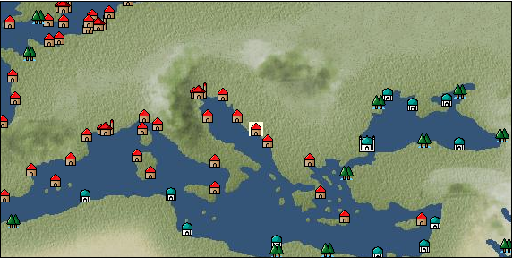

# Port: ラグーザ

import Tabs from '@theme/Tabs';
import TabItem from '@theme/TabItem';

## General Information

| Attribute | Details |
| :--- | :--- |
| **Port Name** | Ragusa |
| **Port Type** | 領地 |
| **Region** | eastern europe |
| **Sea Area** | adriatic sea |
| **Required Language** | Slavic languages |
| **Coordinates** | （799，2978） |
| **Investment Reward** | [Craftsman's Boot Strengthening Method](docs/Items/RecipeBooks/item_1509.md) （必要投資額：1,280,000ドゥカード） |

### Available Facilities

| guild | intermediary | exchange | tool shop | workshop craftsman | Painter | sculptor | peddler |
| --- | --- | --- | --- | --- | --- | --- | --- |
|   |   | ○ | ○ |   |   |   | ○ |
| Shipyard Master | Lumbermaker | Sail-maker | weapon craftsman | master | TavernFemale | archive | salesperson |
| --- | --- | --- | --- | --- | --- | --- | --- |
| ○ | ○ | ○ |   | ○ |   |   |   |
| Shipwright | 銀行 | street worker | 王宮 | Trading post | church | suburbs | translator |
| --- | --- | --- | --- | --- | --- | --- | --- |
| ○ | ○ | ○ |   |   | ○ |   |   |

### Description
A city on the eastern coast of the Italian peninsula. Ever since the ancient Romans founded the city, it has prospered as a trading port even though the ruling powers have changed. Various types of agriculture are flourishing, and many agricultural products and their processed products are distributed. *Italian is also spoken Cultural area: Italy/Southern France

<Tabs>
  <TabItem value="trade_goods_sales" label="Trade Goods Sales">

| item | group | purchase price | 同盟時 | remarks |
| --- | --- | --- | --- | --- |
| [duck meat](docs/Items/TradeGoods/TradeGoods-Foodstuffs/item_32.md) | [Trading items (food items)](docs/Categories/category_3.md) | 306 | 268 |  |
| When in alliance: confirmed at 100% |
| [ward](docs/Items/TradeGoods/TradeGoods-Dye/item_57.md) | [Trading Goods (Dye)](docs/Categories/category_2.md) | 959 | 840 |  |
| When in alliance: confirmed at 100% |
| [olive](docs/Items/TradeGoods/TradeGoods-Foodstuffs/item_47.md) | [Trading items (food items)](docs/Categories/category_3.md) | (256) | 224 |  |
| When in alliance: confirmed at 100% |
| [olive oil](docs/Items/TradeGoods/TradeGoods-Seasonings/item_48.md) | [交易品（調味料）](docs/Categories/category_4.md) | 315 | 304 |  |
| [oregano](docs/Items/TradeGoods/TradeGoods-Spices/item_430.md) | [Trading Goods (Spices)](docs/Categories/category_12.md) | (528) | 462 |  |
| Investment required (Required investment amount: 240,000) At alliance: Confirmed at 100% |
| [turnip](docs/Items/TradeGoods/TradeGoods-Foodstuffs/item_55.md) | [Trading items (food items)](docs/Categories/category_3.md) | 40 | 36 |  |
| When in alliance: confirmed at 100% |
| [cheese](docs/Items/TradeGoods/TradeGoods-Foodstuffs/item_20.md) | [Trading items (food items)](docs/Categories/category_3.md) | 347 | 304 |  |
| [hazelnut](docs/Items/TradeGoods/TradeGoods-Sunddries/item_125.md) | [Trading goods (hobby goods)](docs/Categories/category_10.md) | (422) | 370 |  |
| Investment required (Required investment amount: 180,000) At alliance: Confirmed at 100% |
| [white vinegar](docs/Items/TradeGoods/TradeGoods-Seasonings/item_56.md) | [交易品（調味料）](docs/Categories/category_4.md) | 164 | 144 |  |
| When in alliance: confirmed at 100% |
| [wheat](docs/Items/TradeGoods/TradeGoods-Foodstuffs/item_16.md) | [Trading items (food items)](docs/Categories/category_3.md) | 45 | 40 |  |
| When in alliance: confirmed at 100% |
  </TabItem>
  <TabItem value="sale_specialty" label="Sale (Specialty)">

| item | group | sale price | 同盟時 | remarks |
| --- | --- | --- | --- | --- |

#### [交易品（繊維）](docs/Categories/category_1.md)

| [alpaca hair](docs/Items/TradeGoods/TradeGoods-Fibers/item_3009.md) | 交易品（繊維） | (2,349) | 2,740 |  |
| When in alliance: confirmed at 100% |
| [Rush](docs/Items/TradeGoods/TradeGoods-Fibers/item_3675.md) | 交易品（繊維） | (3,720) | 4,340 |  |
| When in alliance: confirmed at 100% |
| [sisal hemp](docs/Items/TradeGoods/TradeGoods-Fibers/item_1766.md) | 交易品（繊維） | (329) | 383 |  |
| When in alliance: confirmed at 100% |
| [Basho](docs/Items/TradeGoods/TradeGoods-Fibers/item_3862.md) | 交易品（繊維） | (36,423) | 42,500 |  |
| When in alliance: confirmed at 100% |
| [Panya](docs/Items/TradeGoods/TradeGoods-Fibers/item_2097.md) | 交易品（繊維） | (706) | 823 |  |
| When in alliance: confirmed at 100% |
| [flax](docs/Items/TradeGoods/TradeGoods-Fibers/item_64.md) | 交易品（繊維） | (275) | 320 |  |
| When in alliance: confirmed at 100% |
| [feather](docs/Items/TradeGoods/TradeGoods-Fibers/item_585.md) | 交易品（繊維） | (784) | 914 |  |
| [tiger skin](docs/Items/TradeGoods/TradeGoods-Fibers/item_3790.md) | 交易品（繊維） | (30,938) | 36,100 |  |
| 98％＝35400　104％＝37400 |
| [Green ramie](docs/Items/TradeGoods/TradeGoods-Fibers/item_3428.md) | 交易品（繊維） | (32,652) | 38,100 |  |
| 98％＝37400　104％＝39600 |
| [deerskin](docs/Items/TradeGoods/TradeGoods-Fibers/item_3648.md) | 交易品（繊維） | (30,767) | 35,900 |  |
| When in alliance: confirmed at 100% |

#### [Trading Goods (Dye)](docs/Categories/category_2.md)

| [Indian indigo](docs/Items/TradeGoods/TradeGoods-Dye/item_157.md) | Trading Goods (Dye) | (1,115) | 1,300 |  |
| [cochineal](docs/Items/TradeGoods/TradeGoods-Dye/item_1817.md) | Trading Goods (Dye) | (1,466) | 1,710 |  |
| When in alliance: confirmed at 100% |
| [Shorou](docs/Items/TradeGoods/TradeGoods-Dye/item_3691.md) | Trading Goods (Dye) | (29,824) | 34,800 |  |
| When in alliance: confirmed at 100% |
| [turmeric](docs/Items/TradeGoods/TradeGoods-Dye/item_1433.md) | Trading Goods (Dye) | (662) | 772 |  |
| When in alliance: confirmed at 100% |
| [Safflower](docs/Items/TradeGoods/TradeGoods-Dye/item_1059.md) | Trading Goods (Dye) | 668 | (751) |  |
| [mayan blue](docs/Items/TradeGoods/TradeGoods-Dye/item_1096.md) | Trading Goods (Dye) | (1,406) | 1,640 |  |
| When in alliance: confirmed at 100% |
| [mimosa](docs/Items/TradeGoods/TradeGoods-Dye/item_2281.md) | Trading Goods (Dye) | (1,320) | 1,540 |  |
| 98％＝1520　102％＝1560 |
| [gallnut](docs/Items/TradeGoods/TradeGoods-Dye/item_3429.md) | Trading Goods (Dye) | (44,993) | 52,500 |  |
| 98％＝51500　104％＝54600 |
| [purple root](docs/Items/TradeGoods/TradeGoods-Dye/item_3752.md) | Trading Goods (Dye) | (30,852) | 36,000 |  |
| 98％＝35300　103％＝37000 |

#### [Trading items (food items)](docs/Categories/category_3.md)

| [buckwheat](docs/Items/TradeGoods/TradeGoods-Foodstuffs/item_3430.md) | Trading items (food items) | (45,164) | 52,700 |  |
| When in alliance: confirmed at 100% |
| [Karasumi](docs/Items/TradeGoods/TradeGoods-Foodstuffs/item_3687.md) | Trading items (food items) | (31,624) | 36,900 |  |
| 98％＝36200　103％＝38000 |
| [kangaroo meat](docs/Items/TradeGoods/TradeGoods-Foodstuffs/item_2285.md) | Trading items (food items) | (803) | 936 |  |
| When in alliance: confirmed at 100% |
| [cactus](docs/Items/TradeGoods/TradeGoods-Foodstuffs/item_2740.md) | Trading items (food items) | (391) | 456 |  |
| When in alliance: confirmed at 100% |
| [taro](docs/Items/TradeGoods/TradeGoods-Foodstuffs/item_1960.md) | Trading items (food items) | (235) | 274 |  |
| When in alliance: confirmed at 100% |
| [Chamtashima](docs/Items/TradeGoods/TradeGoods-Foodstuffs/item_3771.md) | Trading items (food items) | (1,423) | 1,660 |  |
| 98％＝1650　103％＝1680 |
| [楊州栗](docs/Items/TradeGoods/TradeGoods-Foodstuffs/item_3789.md) | Trading items (food items) | (9,256) | 10,800 |  |
| When in alliance: confirmed at 100% |

#### [交易品（調味料）](docs/Categories/category_4.md)

| [oyster sauce](docs/Items/TradeGoods/TradeGoods-Seasonings/item_3505.md) | 交易品（調味料） | (2,794) | 3,260 |  |
| When in alliance: confirmed at 100% |
| [Gochujang](docs/Items/TradeGoods/TradeGoods-Seasonings/item_3591.md) | 交易品（調味料） | (6,608) | 7,710 |  |
| When in alliance: confirmed at 100% |
| [tamarind](docs/Items/TradeGoods/TradeGoods-Seasonings/item_1968.md) | 交易品（調味料） | (1,869) | 2,180 |  |
| 98％＝2140　104％＝2250 |
| [Choshi](docs/Items/TradeGoods/TradeGoods-Seasonings/item_3793.md) | 交易品（調味料） | (30,681) | 35,800 |  |
| 98％＝35100　103％＝36800 |
| [Nampula](docs/Items/TradeGoods/TradeGoods-Seasonings/item_1972.md) | 交易品（調味料） | (525) | 612 |  |
| When in alliance: confirmed at 100% |
| [apple cider vinegar](docs/Items/TradeGoods/TradeGoods-Seasonings/item_882.md) | 交易品（調味料） | (428) | 499 |  |
| 98％＝490　101％＝503 |
| [miso](docs/Items/TradeGoods/TradeGoods-Seasonings/item_3420.md) | 交易品（調味料） | (3,643) | 4,250 |  |
| When in alliance: confirmed at 100% |
| [Sha Cha Ji](docs/Items/TradeGoods/TradeGoods-Seasonings/item_3689.md) | 交易品（調味料） | (32,265) | 37,648 |  |
| When in alliance: confirmed at 100% |
| [Bean sauce](docs/Items/TradeGoods/TradeGoods-Seasonings/item_3875.md) | 交易品（調味料） | (34,023) | 39,700 |  |
| When in alliance: confirmed at 100% |
| [soy sauce](docs/Items/TradeGoods/TradeGoods-Seasonings/item_3425.md) | 交易品（調味料） | (45,250) | 52,800 |  |
| 98％＝51800　104％＝54900 |
| [black vinegar](docs/Items/TradeGoods/TradeGoods-Seasonings/item_3475.md) | 交易品（調味料） | (4,611) | 5,380 |  |
| 98％＝5290　104％＝5560 |

#### [交易品（雑貨）](docs/Categories/category_5.md)

| [old ink stick](docs/Items/TradeGoods/TradeGoods-Misc/item_3921.md) | 交易品（雑貨） | (9,513) | 11,100 |  |
| When in alliance: confirmed at 100% |
| [Japanese books](docs/Items/TradeGoods/TradeGoods-Misc/item_3439.md) | 交易品（雑貨） | 34,750 | 40,100 |  |
| When in alliance: confirmed at 100% |
| [lantern](docs/Items/TradeGoods/TradeGoods-Misc/item_3683.md) | 交易品（雑貨） | 53,648 | 62,000 |  |
| When in alliance: confirmed at 100% |
| [Korean books](docs/Items/TradeGoods/TradeGoods-Misc/item_3750.md) | 交易品（雑貨） | (31,024) | 36,200 |  |
| When in alliance: confirmed at 100% |
| [rattan work](docs/Items/TradeGoods/TradeGoods-Misc/item_3698.md) | 交易品（雑貨） | (30,767) | 35,900 |  |
| When in alliance: confirmed at 100% |

#### [Trading products (medical products)](docs/Categories/category_6.md)

| [dog saffron](docs/Items/TradeGoods/TradeGoods-Medicine/item_1055.md) | Trading products (medical products) | (478) | 557 |  |
| 98%＝547　104%＝578 |
| [Saikaku](docs/Items/TradeGoods/TradeGoods-Medicine/item_1959.md) | Trading products (medical products) | (4,114) | 4,800 |  |
| When in alliance: confirmed at 100% |
| [tea tree](docs/Items/TradeGoods/TradeGoods-Medicine/item_2283.md) | Trading products (medical products) | (1,277) | 1,490 |  |
| When in alliance: confirmed at 100% |
| [Noni](docs/Items/TradeGoods/TradeGoods-Medicine/item_2099.md) | Trading products (medical products) | (1,200) | 1,400 |  |
| When in alliance: confirmed at 100% |
| [heath](docs/Items/TradeGoods/TradeGoods-Medicine/item_63.md) | Trading products (medical products) | (366) | 426 |  |
| 98％＝418　102％＝433 |
| [Borei](docs/Items/TradeGoods/TradeGoods-Medicine/item_3678.md) | Trading products (medical products) | (44,650) | 52,100 |  |
| 98％＝51100　105％＝54700 |
| [Korean ginseng](docs/Items/TradeGoods/TradeGoods-Medicine/item_3738.md) | Trading products (medical products) | (30,681) | 35,800 |  |
| 98％＝35100　106％＝37900 |
| [Nothing](docs/Items/TradeGoods/TradeGoods-Medicine/item_1053.md) | Trading products (medical products) | (681) | 794 |  |
| [calamus](docs/Items/TradeGoods/TradeGoods-Medicine/item_3427.md) | Trading products (medical products) | (33,938) | 39,600 |  |
| When in alliance: confirmed at 100% |

#### [Trading Items (Iron Stone)](docs/Categories/category_7.md)

| [Hokutolite](docs/Items/TradeGoods/TradeGoods-Minerals/item_3694.md) | Trading Items (Iron Stone) | (32,224) | 37,600 |  |
| 98％＝36900　103％＝38700 |
| [white porcelain ore](docs/Items/TradeGoods/TradeGoods-Minerals/item_3433.md) | Trading Items (Iron Stone) | (34,880) | 40,700 |  |
| 98％＝39900　103％＝41800 |
| [medical stone](docs/Items/TradeGoods/TradeGoods-Minerals/item_3786.md) | Trading Items (Iron Stone) | (31,110) | 36,300 |  |
| When in alliance: confirmed at 100% |

#### [Trading products (precious metals)](docs/Categories/category_8.md)

| [platinum](docs/Items/TradeGoods/TradeGoods-Metals/item_2178.md) | Trading products (precious metals) | (6,514) | 7,600 |  |
| [佐摩銀](docs/Items/TradeGoods/TradeGoods-Metals/item_3432.md) | Trading products (precious metals) | (36,680) | 42,800 |  |
| When in alliance: confirmed at 100% |
| [Korean silver](docs/Items/TradeGoods/TradeGoods-Metals/item_3796.md) | Trading products (precious metals) | (31,281) | 36,500 |  |
| When in alliance: confirmed at 100% |
| [Jinguashijin](docs/Items/TradeGoods/TradeGoods-Metals/item_3693.md) | Trading products (precious metals) | (30,938) | 36,100 |  |
| When in alliance: confirmed at 100% |

#### [交易品（酒類）](docs/Categories/category_9.md)

| [aquavit](docs/Items/TradeGoods/TradeGoods-Alcohol/item_572.md) | 交易品（酒類） | 841 | 894 |  |
| [whiskey](docs/Items/TradeGoods/TradeGoods-Alcohol/item_1.md) | 交易品（酒類） | 898 | 960 |  |
| [gin](docs/Items/TradeGoods/TradeGoods-Alcohol/item_291.md) | 交易品（酒類） | 888 | 920 |  |
| [tequila](docs/Items/TradeGoods/TradeGoods-Alcohol/item_108.md) | 交易品（酒類） | (1,972) | 2,300 |  |
| [fruit brandy](docs/Items/TradeGoods/TradeGoods-Alcohol/item_1440.md) | 交易品（酒類） | (667) | 778 |  |
| When in alliance: confirmed at 100% |
| [Taiwan rice wine](docs/Items/TradeGoods/TradeGoods-Alcohol/item_3672.md) | 交易品（酒類） | (31,024) | 36,200 |  |
| When in alliance: confirmed at 100% |
| [Andong soju](docs/Items/TradeGoods/TradeGoods-Alcohol/item_3757.md) | 交易品（酒類） | (31,024) | 36,200 |  |
| When in alliance: confirmed at 100% |
| [Sake](docs/Items/TradeGoods/TradeGoods-Alcohol/item_3424.md) | 交易品（酒類） | (34,623) | 40,400 |  |
| When in alliance: confirmed at 100% |

#### [Trading goods (hobby goods)](docs/Categories/category_10.md)

| [Aigyoku](docs/Items/TradeGoods/TradeGoods-Sunddries/item_3677.md) | Trading goods (hobby goods) | (30,510) | 35,600 |  |
| When in alliance: confirmed at 100% |
| [cacao](docs/Items/TradeGoods/TradeGoods-Sunddries/item_140.md) | Trading goods (hobby goods) | (1,286) | 1,500 |  |
| When in alliance: confirmed at 100% |
| [cashew nuts](docs/Items/TradeGoods/TradeGoods-Sunddries/item_2120.md) | Trading goods (hobby goods) | (866) | 1,010 |  |
| When in alliance: confirmed at 100% |
| [caviar](docs/Items/TradeGoods/TradeGoods-Sunddries/item_2122.md) | Trading goods (hobby goods) | (1,149) | 1,340 |  |
| When in alliance: confirmed at 100% |
| [durian](docs/Items/TradeGoods/TradeGoods-Sunddries/item_1949.md) | Trading goods (hobby goods) | (1,560) | 1,820 |  |
| When in alliance: confirmed at 100% |
| [eggplant](docs/Items/TradeGoods/TradeGoods-Sunddries/item_3426.md) | Trading goods (hobby goods) | (32,652) | 38,100 |  |
| When in alliance: confirmed at 100% |
| [banana](docs/Items/TradeGoods/TradeGoods-Sunddries/item_1947.md) | Trading goods (hobby goods) | 505 | 529 |  |
| 98％＝521　101％＝532 |
| [pineapple](docs/Items/TradeGoods/TradeGoods-Sunddries/item_867.md) | Trading goods (hobby goods) | (1,834) | 2,140 |  |
| When in alliance: confirmed at 100% |
| [peanuts](docs/Items/TradeGoods/TradeGoods-Sunddries/item_134.md) | Trading goods (hobby goods) | (395) | 460 |  |
| When in alliance: confirmed at 100% |
| [macadamia nuts](docs/Items/TradeGoods/TradeGoods-Sunddries/item_2282.md) | Trading goods (hobby goods) | (1,029) | 1,200 |  |
| When in alliance: confirmed at 100% |
| [mango](docs/Items/TradeGoods/TradeGoods-Sunddries/item_2095.md) | Trading goods (hobby goods) | (786) | 916 |  |
| When in alliance: confirmed at 100% |
| [lemon myrtle](docs/Items/TradeGoods/TradeGoods-Sunddries/item_2840.md) | Trading goods (hobby goods) | (1,963) | 2,290 |  |
| When in alliance: confirmed at 100% |
| [Chinese tea](docs/Items/TradeGoods/TradeGoods-Sunddries/item_3907.md) | Trading goods (hobby goods) | (33,595) | 39,200 |  |
| When in alliance: confirmed at 100% |
| [dried figs](docs/Items/TradeGoods/TradeGoods-Sunddries/item_611.md) | Trading goods (hobby goods) | (328) | 382 |  |
| When in alliance: confirmed at 100% |
| [dried apple](docs/Items/TradeGoods/TradeGoods-Sunddries/item_19.md) | Trading goods (hobby goods) | (369) | 430 |  |
| When in alliance: confirmed at 100% |
| [Korean tea](docs/Items/TradeGoods/TradeGoods-Sunddries/item_3751.md) | Trading goods (hobby goods) | 30,827 | 36,000 |  |
| When in alliance: confirmed at 100% |
| [black tea](docs/Items/TradeGoods/TradeGoods-Sunddries/item_675.md) | Trading goods (hobby goods) | (2,212) | 2,580 |  |
| When in alliance: confirmed at 100% |
| [金針花](docs/Items/TradeGoods/TradeGoods-Sunddries/item_3739.md) | Trading goods (hobby goods) | (9,342) | 10,900 |  |
| When in alliance: confirmed at 100% |

#### [Trading Goods (Spices)](docs/Categories/category_11.md)

| [ylang ylang](docs/Items/TradeGoods/TradeGoods-Perfume/item_1434.md) | Trading Goods (Spices) | (1,680) | 1,960 |  |
| 98%＝1930　103%＝2010 |
| [gardenia](docs/Items/TradeGoods/TradeGoods-Perfume/item_1091.md) | Trading Goods (Spices) | (23,373) | 27,273 |  |
| 98％＝36600　104％＝38800 |
| [jasmine](docs/Items/TradeGoods/TradeGoods-Perfume/item_772.md) | Trading Goods (Spices) | (5,597) | 6,530 |  |
| 98%＝6460　107%＝6790 |
| [daffodil](docs/Items/TradeGoods/TradeGoods-Perfume/item_612.md) | Trading Goods (Spices) | (810) | 945 |  |
| When in alliance: confirmed at 100% |
| [lily of the valley](docs/Items/TradeGoods/TradeGoods-Perfume/item_358.md) | Trading Goods (Spices) | (1,348) | 1,572 |  |
| [geranium](docs/Items/TradeGoods/TradeGoods-Perfume/item_145.md) | Trading Goods (Spices) | (1,089) | 1,270 |  |
| 98%＝1240　102%＝1290 |
| [Chindarle](docs/Items/TradeGoods/TradeGoods-Perfume/item_3795.md) | Trading Goods (Spices) | (30,767) | 35,900 |  |
| 98％＝35200　103％＝36900 |
| [Hamanasu](docs/Items/TradeGoods/TradeGoods-Perfume/item_3692.md) | Trading Goods (Spices) | (30,938) | 36,100 |  |
| When in alliance: confirmed at 100% |
| [patchouli](docs/Items/TradeGoods/TradeGoods-Perfume/item_1963.md) | Trading Goods (Spices) | (2,554) | 2,980 |  |
| 98％＝2950 103％＝3020 |
| [eucalyptus](docs/Items/TradeGoods/TradeGoods-Perfume/item_2278.md) | Trading Goods (Spices) | (952) | 1,110 |  |
| When in alliance: confirmed at 100% |
| [lira](docs/Items/TradeGoods/TradeGoods-Perfume/item_30.md) | Trading Goods (Spices) | (857) | 1,000 |  |
| 98%＝987 |
| [mastic](docs/Items/TradeGoods/TradeGoods-Perfume/item_680.md) | Trading Goods (Spices) | (2,314) | 2,700 |  |
| When in alliance: confirmed at 100% |
| [Tang Muxiang](docs/Items/TradeGoods/TradeGoods-Perfume/item_593.md) | Trading Goods (Spices) | (1,560) | 1,820 |  |
| When in alliance: confirmed at 100% |
| [benzoin](docs/Items/TradeGoods/TradeGoods-Perfume/item_1962.md) | Trading Goods (Spices) | (1,740) | 2,030 |  |
| When in alliance: confirmed at 100% |
| [sandalwood](docs/Items/TradeGoods/TradeGoods-Perfume/item_771.md) | Trading Goods (Spices) | (3,634) | 4,240 |  |
| When in alliance: confirmed at 100% |
| [龍脳](docs/Items/TradeGoods/TradeGoods-Perfume/item_1676.md) | Trading Goods (Spices) | (2,640) | 3,080 |  |
| When in alliance: confirmed at 100% |

#### [Trading Goods (Spices)](docs/Categories/category_12.md)

| [allspice](docs/Items/TradeGoods/TradeGoods-Spices/item_1848.md) | Trading Goods (Spices) | (1,586) | 1,850 |  |
| When in alliance: confirmed at 100% |
| [cardamom](docs/Items/TradeGoods/TradeGoods-Spices/item_1431.md) | Trading Goods (Spices) | (4,568) | 5,330 |  |
| When in alliance: confirmed at 100% |
| [garam masala](docs/Items/TradeGoods/TradeGoods-Spices/item_965.md) | Trading Goods (Spices) | (691) | 806 |  |
| When in alliance: confirmed at 100% |
| [cloves](docs/Items/TradeGoods/TradeGoods-Spices/item_1092.md) | Trading Goods (Spices) | (11,544) | 13,470 |  |
| 98%＝13200 |
| [Kouzuku](docs/Items/TradeGoods/TradeGoods-Spices/item_3690.md) | Trading Goods (Spices) | (32,138) | 37,500 |  |
| 98％＝36800　103％＝38600 |
| [pepper](docs/Items/TradeGoods/TradeGoods-Spices/item_58.md) | Trading Goods (Spices) | 9,324 | (10,490) |  |
| [Sanshou](docs/Items/TradeGoods/TradeGoods-Spices/item_3794.md) | Trading Goods (Spices) | (30,938) | 36,100 |  |
| 98％＝35400　104％＝37500 |
| [cinnamon](docs/Items/TradeGoods/TradeGoods-Spices/item_1432.md) | Trading Goods (Spices) | (4,740) | 5,530 |  |
| When in alliance: confirmed at 100% |
| [nutmeg](docs/Items/TradeGoods/TradeGoods-Spices/item_1969.md) | Trading Goods (Spices) | (20,814) | 24,286 |  |
| [bergamot](docs/Items/TradeGoods/TradeGoods-Spices/item_879.md) | Trading Goods (Spices) | (706) | 823 |  |
| When in alliance: confirmed at 100% |
| [mace](docs/Items/TradeGoods/TradeGoods-Spices/item_2100.md) | Trading Goods (Spices) | (19,883) | 23,200 |  |
| 98%＝14300 |
| [lemongrass](docs/Items/TradeGoods/TradeGoods-Spices/item_2096.md) | Trading Goods (Spices) | (2,914) | 3,400 |  |
| When in alliance: confirmed at 100% |
| [chili pepper](docs/Items/TradeGoods/TradeGoods-Spices/item_1831.md) | Trading Goods (Spices) | (1,457) | 1,700 |  |
| 98%＝1670　102%＝1730 |
| [Grapefruit](docs/Items/TradeGoods/TradeGoods-Spices/item_3422.md) | Trading Goods (Spices) | (34,538) | 40,300 |  |
| 98％＝39500　105％＝42300 |
| [green chili pepper](docs/Items/TradeGoods/TradeGoods-Spices/item_1990.md) | Trading Goods (Spices) | (2,297) | 2,680 |  |
| When in alliance: confirmed at 100% |

#### [Trading goods (artificial goods)](docs/Categories/category_13.md)

| [african wood carving](docs/Items/TradeGoods/TradeGoods-Luxuries/item_5558.md) | Trading goods (artificial goods) | (3,893) | 4,542 |  |
| [Tumbaga](docs/Items/TradeGoods/TradeGoods-Luxuries/item_3028.md) | Trading goods (artificial goods) | (16,969) | 19,800 |  |
| 98%＝19500　107%＝20900 |
| [Kuresute](docs/Items/TradeGoods/TradeGoods-Luxuries/item_3897.md) | Trading goods (artificial goods) | (10,370) | 12,100 |  |
| When in alliance: confirmed at 100% |
| [Song Baici](docs/Items/TradeGoods/TradeGoods-Luxuries/item_3904.md) | Trading goods (artificial goods) | (45,079) | 52,600 |  |
| 98％＝51600　105％＝55100 |
| [湖筆](docs/Items/TradeGoods/TradeGoods-Luxuries/item_3898.md) | Trading goods (artificial goods) | (9,856) | 11,500 |  |
| When in alliance: confirmed at 100% |
| [lacquerware](docs/Items/TradeGoods/TradeGoods-Luxuries/item_3435.md) | Trading goods (artificial goods) | 36,225 | 42,100 |  |
| 98％＝41300　103％＝43300 |
| [Saori](docs/Items/TradeGoods/TradeGoods-Luxuries/item_3676.md) | Trading goods (artificial goods) | (9,685) | 11,300 |  |
| When in alliance: confirmed at 100% |
| [Corner work](docs/Items/TradeGoods/TradeGoods-Luxuries/item_3696.md) | Trading goods (artificial goods) | (43,108) | 50,300 |  |
| 98％＝49300　103％＝51800 |
| [Goryeo celadon](docs/Items/TradeGoods/TradeGoods-Luxuries/item_3758.md) | Trading goods (artificial goods) | (43,279) | 50,500 |  |
| 98％＝49500　105％＝53000 |

#### [交易品（美術品）](docs/Categories/category_14.md)

| [taiwan wood carving](docs/Items/TradeGoods/TradeGoods-Art/item_3697.md) | 交易品（美術品） | (30,424) | 35,500 |  |
| When in alliance: confirmed at 100% |
| [Japanese painting](docs/Items/TradeGoods/TradeGoods-Art/item_3436.md) | 交易品（美術品） | (42,251) | 49,300 |  |
| When in alliance: confirmed at 100% |
| [Mother-of-pearl lacquerware](docs/Items/TradeGoods/TradeGoods-Art/item_3785.md) | 交易品（美術品） | (44,479) | 51,900 |  |
| When in alliance: confirmed at 100% |

#### [Trading Items (Gemstones)](docs/Categories/category_15.md)

| [jade](docs/Items/TradeGoods/TradeGoods-Gems/item_2015.md) | Trading Items (Gemstones) | (4,705) | 5,490 |  |
| When in alliance: confirmed at 100% |
| [Tortoiseshell](docs/Items/TradeGoods/TradeGoods-Gems/item_1980.md) | Trading Items (Gemstones) | (3,617) | 4,220 |  |
| When in alliance: confirmed at 100% |
| [aventurine](docs/Items/TradeGoods/TradeGoods-Gems/item_678.md) | Trading Items (Gemstones) | (5,091) | 5,940 |  |
| When in alliance: confirmed at 100% |
| [inca rose](docs/Items/TradeGoods/TradeGoods-Gems/item_3014.md) | Trading Items (Gemstones) | (14,255) | 16,633 |  |
| 98%＝16300 |
| [opal](docs/Items/TradeGoods/TradeGoods-Gems/item_2006.md) | Trading Items (Gemstones) | (6,865) | 8,010 |  |
| When in alliance: confirmed at 100% |
| [cat's eye](docs/Items/TradeGoods/TradeGoods-Gems/item_1047.md) | Trading Items (Gemstones) | (8,570) | 10,000 |  |
| When in alliance: confirmed at 100% |
| [sapphire](docs/Items/TradeGoods/TradeGoods-Gems/item_676.md) | Trading Items (Gemstones) | (10,542) | 12,300 |  |
| [turquoise](docs/Items/TradeGoods/TradeGoods-Gems/item_1006.md) | Trading Items (Gemstones) | (3,411) | 3,980 |  |
| When in alliance: confirmed at 100% |
| [diamond](docs/Items/TradeGoods/TradeGoods-Gems/item_449.md) | Trading Items (Gemstones) | (6,188) | 7,220 |  |
| [topaz](docs/Items/TradeGoods/TradeGoods-Gems/item_1097.md) | Trading Items (Gemstones) | 5,444 | (6,125) |  |
| [pink diamond](docs/Items/TradeGoods/TradeGoods-Gems/item_2874.md) | Trading Items (Gemstones) | (12,941) | 15,100 |  |
| [ruby](docs/Items/TradeGoods/TradeGoods-Gems/item_773.md) | Trading Items (Gemstones) | (11,056) | 12,900 |  |
| When in alliance: confirmed at 100% |
| [taiwan sapphire](docs/Items/TradeGoods/TradeGoods-Gems/item_3695.md) | Trading Items (Gemstones) | (45,079) | 52,600 |  |
| When in alliance: confirmed at 100% |
| [amber](docs/Items/TradeGoods/TradeGoods-Gems/item_618.md) | Trading Items (Gemstones) | (3,951) | 4,610 |  |
| [amethyst](docs/Items/TradeGoods/TradeGoods-Gems/item_3434.md) | Trading Items (Gemstones) | (37,023) | 43,200 |  |
| When in alliance: confirmed at 100% |
| [tiger eye stone](docs/Items/TradeGoods/TradeGoods-Gems/item_3797.md) | Trading Items (Gemstones) | (30,681) | 35,800 |  |
| When in alliance: confirmed at 100% |

#### [Trading Items (Arms)](docs/Categories/category_16.md)

| [damascus sword](docs/Items/TradeGoods/TradeGoods-Weapons/item_903.md) | Trading Items (Arms) | (4,551) | 5,310 |  |
| When in alliance: confirmed at 100% |
| [Japanese bow](docs/Items/TradeGoods/TradeGoods-Weapons/item_3469.md) | Trading Items (Arms) | (11,141) | 13,000 |  |
| 98％＝12800　101％＝13100 |
| [broadsword](docs/Items/TradeGoods/TradeGoods-Weapons/item_3754.md) | Trading Items (Arms) | (43,450) | 50,700 |  |
| When in alliance: confirmed at 100% |
| [Japanese sword](docs/Items/TradeGoods/TradeGoods-Weapons/item_3437.md) | Trading Items (Arms) | (33,252) | 38,800 |  |
| When in alliance: confirmed at 100% |
| [japanese armor](docs/Items/TradeGoods/TradeGoods-Weapons/item_3590.md) | Trading Items (Arms) | (11,056) | 12,900 |  |
| When in alliance: confirmed at 100% |
| [rattan armor](docs/Items/TradeGoods/TradeGoods-Weapons/item_3699.md) | Trading Items (Arms) | (29,910) | 34,900 |  |
| 98％＝34200　104％＝36200 |

#### [Trading Items (Firearms)](docs/Categories/category_17.md)

| [monocular gun](docs/Items/TradeGoods/TradeGoods-Firearms/item_3916.md) | Trading Items (Firearms) | (33,423) | 39,000 |  |
| When in alliance: confirmed at 100% |
| [throwing bomb](docs/Items/TradeGoods/TradeGoods-Firearms/item_3784.md) | Trading Items (Firearms) | (31,024) | 36,200 |  |
| When in alliance: confirmed at 100% |
| [tanegashima gun](docs/Items/TradeGoods/TradeGoods-Firearms/item_3423.md) | Trading Items (Firearms) | 32,223 | 37,300 |  |
| When in alliance: confirmed at 100% |
| [銅手銃](docs/Items/TradeGoods/TradeGoods-Firearms/item_3700.md) | Trading Items (Firearms) | (30,253) | 35,300 |  |
| When in alliance: confirmed at 100% |

#### [Trading Goods (Livestock)](docs/Categories/category_18.md)

| [boar](docs/Items/TradeGoods/TradeGoods-Livestock/item_3476.md) | Trading Goods (Livestock) | (32,309) | 37,700 |  |
| When in alliance: confirmed at 100% |
| [water buffalo](docs/Items/TradeGoods/TradeGoods-Livestock/item_3688.md) | Trading Goods (Livestock) | (1,440) | 1,680 |  |
| When in alliance: confirmed at 100% |
| [韓牛](docs/Items/TradeGoods/TradeGoods-Livestock/item_3792.md) | Trading Goods (Livestock) | (37,451) | 43,700 |  |
| When in alliance: confirmed at 100% |

#### [交易品（工業品）](docs/Categories/category_19.md)

| [papyrus](docs/Items/TradeGoods/TradeGoods-Wares/item_616.md) | 交易品（工業品） | 523 | 531 |  |
| [Japanese paper](docs/Items/TradeGoods/TradeGoods-Wares/item_3438.md) | 交易品（工業品） | (33,938) | 39,600 |  |
| When in alliance: confirmed at 100% |
| [paint](docs/Items/TradeGoods/TradeGoods-Wares/item_3411.md) | 交易品（工業品） | (2,623) | 3,060 |  |
| When in alliance: confirmed at 100% |
| [bamboo](docs/Items/TradeGoods/TradeGoods-Wares/item_3899.md) | 交易品（工業品） | (33,595) | 39,200 |  |
| When in alliance: confirmed at 100% |
| [rattan](docs/Items/TradeGoods/TradeGoods-Wares/item_3701.md) | 交易品（工業品） | (30,424) | 35,500 |  |
| When in alliance: confirmed at 100% |
| [韓紙](docs/Items/TradeGoods/TradeGoods-Wares/item_3755.md) | 交易品（工業品） | (31,367) | 36,600 |  |
| When in alliance: confirmed at 100% |

#### [交易品（織物）](docs/Categories/category_20.md)

| [Awaiyo](docs/Items/TradeGoods/TradeGoods-Fabrics/item_3002.md) | 交易品（織物） | (8,091) | 9,440 |  |
| When in alliance: confirmed at 100% |
| [dutch calico](docs/Items/TradeGoods/TradeGoods-Fabrics/item_1435.md) | 交易品（織物） | 1,255 | 1,350 |  |
| When in alliance: confirmed at 100% |
| [gobelin weave](docs/Items/TradeGoods/TradeGoods-Fabrics/item_1276.md) | 交易品（織物） | (3,634) | 4,240 |  |
| When in alliance: confirmed at 100% |
| [java chintz](docs/Items/TradeGoods/TradeGoods-Fabrics/item_1970.md) | 交易品（織物） | (3,557) | 4,150 |  |
| 98%＝4080　102%＝4220 |
| [taffeta](docs/Items/TradeGoods/TradeGoods-Fabrics/item_1001.md) | 交易品（織物） | (5,194) | 6,060 |  |
| When in alliance: confirmed at 100% |
| [damask](docs/Items/TradeGoods/TradeGoods-Fabrics/item_614.md) | 交易品（織物） | (3,454) | 4,030 |  |
| When in alliance: confirmed at 100% |
| [turkish rug](docs/Items/TradeGoods/TradeGoods-Fabrics/item_686.md) | 交易品（織物） | (4,037) | 4,710 |  |
| 98%＝4620　107％＝5010 |
| [flannel](docs/Items/TradeGoods/TradeGoods-Fabrics/item_149.md) | 交易品（織物） | (1,423) | 1,660 |  |
| When in alliance: confirmed at 100% |
| [persian rug](docs/Items/TradeGoods/TradeGoods-Fabrics/item_606.md) | 交易品（織物） | (8,176) | 9,540 |  |
| 98％＝9420　107％＝9940 |
| [China Duantong](docs/Items/TradeGoods/TradeGoods-Fabrics/item_3478.md) | 交易品（織物） | (18,169) | 21,200 |  |
| When in alliance: confirmed at 100% |
| [唐錦](docs/Items/TradeGoods/TradeGoods-Fabrics/item_3896.md) | 交易品（織物） | (35,052) | 40,900 |  |
| When in alliance: confirmed at 100% |
| [大和錦](docs/Items/TradeGoods/TradeGoods-Fabrics/item_3482.md) | 交易品（織物） | (18,169) | 21,200 |  |
| When in alliance: confirmed at 100% |
| [明紬](docs/Items/TradeGoods/TradeGoods-Fabrics/item_3753.md) | 交易品（織物） | (31,452) | 36,700 |  |
| When in alliance: confirmed at 100% |
| [Bingata](docs/Items/TradeGoods/TradeGoods-Fabrics/item_3479.md) | 交易品（織物） | (18,083) | 21,100 |  |
| 98％＝20800　103％＝21600 |
| [Nishijin textile](docs/Items/TradeGoods/TradeGoods-Fabrics/item_3431.md) | 交易品（織物） | (35,652) | 41,600 |  |
| When in alliance: confirmed at 100% |
| [麻織物](docs/Items/TradeGoods/TradeGoods-Fabrics/item_3673.md) | 交易品（織物） | (31,624) | 36,900 |  |
| When in alliance: confirmed at 100% |
  </TabItem>
  <TabItem value="sale_no_specialty" label="Sale (No Specialty)">

| item | group | sale price | 同盟時 | remarks |
| --- | --- | --- | --- | --- |

#### [交易品（繊維）](docs/Categories/category_1.md)

| [rabbit hair](docs/Items/TradeGoods/TradeGoods-Fibers/item_1036.md) | 交易品（繊維） | (836) | 975 |  |
| 96％＝936　102％＝994 |
| [peacock feather](docs/Items/TradeGoods/TradeGoods-Fibers/item_901.md) | 交易品（繊維） | (446) | 520 |  |
| 98％＝510　107％＝557 |
| [coconut fiber](docs/Items/TradeGoods/TradeGoods-Fibers/item_444.md) | 交易品（繊維） | (182) | 212 |  |
| When in alliance: confirmed at 100% |
| [camel hair](docs/Items/TradeGoods/TradeGoods-Fibers/item_577.md) | 交易品（繊維） | 499 | (561) |  |
| [goat hair](docs/Items/TradeGoods/TradeGoods-Fibers/item_770.md) | 交易品（繊維） | (1,169) | 1,364 |  |
| [fur](docs/Items/TradeGoods/TradeGoods-Fibers/item_634.md) | 交易品（繊維） | (2,152) | 2,510 |  |
| When in alliance: confirmed at 100% |
| [leather](docs/Items/TradeGoods/TradeGoods-Fibers/item_44.md) | 交易品（繊維） | (539) | 628 |  |
| [cotton](docs/Items/TradeGoods/TradeGoods-Fibers/item_610.md) | 交易品（繊維） | (558) | 651 |  |
| [wool](docs/Items/TradeGoods/TradeGoods-Fibers/item_5.md) | 交易品（繊維） | (431) | 502 |  |

#### [Trading Goods (Dye)](docs/Categories/category_2.md)

| [Gerep](docs/Items/TradeGoods/TradeGoods-Dye/item_1814.md) | Trading Goods (Dye) | (760) | 886 |  |
| When in alliance: confirmed at 100% |
| [persian berry](docs/Items/TradeGoods/TradeGoods-Dye/item_693.md) | Trading Goods (Dye) | (1,223) | 1,426 |  |
| [貝紫](docs/Items/TradeGoods/TradeGoods-Dye/item_110.md) | Trading Goods (Dye) | (3,943) | 4,600 |  |
| When in alliance: confirmed at 100% |

#### [Trading items (food items)](docs/Categories/category_3.md)

| [mushroom](docs/Items/TradeGoods/TradeGoods-Foodstuffs/item_160.md) | Trading items (food items) | 32 | (36) |  |
| [horse mackerel](docs/Items/TradeGoods/TradeGoods-Foodstuffs/item_161.md) | Trading items (food items) | (28) | 32 |  |
| [turnip](docs/Items/TradeGoods/TradeGoods-Foodstuffs/item_55.md) | Trading items (food items) | 18 | (20) |  |
| When in alliance: confirmed at 100% |
| [pumpkin](docs/Items/TradeGoods/TradeGoods-Foodstuffs/item_137.md) | Trading items (food items) | (243) | 283 |  |
| [Oat](docs/Items/TradeGoods/TradeGoods-Foodstuffs/item_275.md) | Trading items (food items) | 83 | (93) |  |
| [Quinoa](docs/Items/TradeGoods/TradeGoods-Foodstuffs/item_2994.md) | Trading items (food items) | (330) | 385 |  |
| When in alliance: confirmed at 100% |
| [sweet potato](docs/Items/TradeGoods/TradeGoods-Foodstuffs/item_1931.md) | Trading items (food items) | (203) | 236 |  |
| When in alliance: confirmed at 100% |
| [sugar cane](docs/Items/TradeGoods/TradeGoods-Foodstuffs/item_93.md) | Trading items (food items) | (300) | 349 |  |
| [potato](docs/Items/TradeGoods/TradeGoods-Foodstuffs/item_106.md) | Trading items (food items) | (350) | 408 |  |
| [Jambu](docs/Items/TradeGoods/TradeGoods-Foodstuffs/item_1827.md) | Trading items (food items) | (192) | 224 |  |
| 98％＝219　103％＝230 |
| [corn](docs/Items/TradeGoods/TradeGoods-Foodstuffs/item_138.md) | Trading items (food items) | (193) | 225 |  |
| [pasta](docs/Items/TradeGoods/TradeGoods-Foodstuffs/item_635.md) | Trading items (food items) | 64 | 72 |  |
| [crocodile meat](docs/Items/TradeGoods/TradeGoods-Foodstuffs/item_2284.md) | Trading items (food items) | (628) | 732 |  |
| 98％＝717　102％＝746 |
| [egg](docs/Items/TradeGoods/TradeGoods-Foodstuffs/item_40.md) | Trading items (food items) | (31) | 36 |  |
| [flour](docs/Items/TradeGoods/TradeGoods-Foodstuffs/item_605.md) | Trading items (food items) | 51 | 56 |  |
| [Paddy rice](docs/Items/TradeGoods/TradeGoods-Foodstuffs/item_654.md) | Trading items (food items) | (93) | 108 |  |
| When in alliance: confirmed at 100% |
| [beef](docs/Items/TradeGoods/TradeGoods-Foodstuffs/item_26.md) | Trading items (food items) | (556) | 648 |  |
| [pork](docs/Items/TradeGoods/TradeGoods-Foodstuffs/item_41.md) | Trading items (food items) | (334) | 389 |  |
| [taro](docs/Items/TradeGoods/TradeGoods-Foodstuffs/item_3421.md) | Trading items (food items) | (292) | 340 |  |
| When in alliance: confirmed at 100% |
| [陸稲](docs/Items/TradeGoods/TradeGoods-Foodstuffs/item_100.md) | Trading items (food items) | (96) | 112 |  |
| When in alliance: confirmed at 100% |
| [魚肉](docs/Items/TradeGoods/TradeGoods-Foodstuffs/item_10.md) | Trading items (food items) | 186 | 192 |  |
| [chicken meat](docs/Items/TradeGoods/TradeGoods-Foodstuffs/item_29.md) | Trading items (food items) | 331 | 331 |  |

#### [交易品（調味料）](docs/Categories/category_4.md)

| [anchovies](docs/Items/TradeGoods/TradeGoods-Seasonings/item_3004.md) | 交易品（調味料） | (247) | 288 |  |
| When in alliance: confirmed at 100% |
| [almond oil](docs/Items/TradeGoods/TradeGoods-Seasonings/item_578.md) | 交易品（調味料） | (615) | 717 |  |
| When in alliance: confirmed at 100% |
| [olive oil](docs/Items/TradeGoods/TradeGoods-Seasonings/item_48.md) | 交易品（調味料） | 138 | (155) |  |
| [coconut vinegar](docs/Items/TradeGoods/TradeGoods-Seasonings/item_1988.md) | 交易品（調味料） | (444) | 518 |  |
| When in alliance: confirmed at 100% |
| [jam](docs/Items/TradeGoods/TradeGoods-Seasonings/item_427.md) | 交易品（調味料） | (540) | 629 |  |
| 98％＝616　102％＝641 |
| [herbal salt](docs/Items/TradeGoods/TradeGoods-Seasonings/item_840.md) | 交易品（調味料） | (223) | 260 |  |
| When in alliance: confirmed at 100% |
| [herbal vinegar](docs/Items/TradeGoods/TradeGoods-Seasonings/item_908.md) | 交易品（調味料） | (155) | 180 |  |
| When in alliance: confirmed at 100% |
| [butter](docs/Items/TradeGoods/TradeGoods-Seasonings/item_3.md) | 交易品（調味料） | (350) | 408 |  |
| When in alliance: confirmed at 100% |
| [peanut oil](docs/Items/TradeGoods/TradeGoods-Seasonings/item_596.md) | 交易品（調味料） | (424) | 494 |  |
| When in alliance: confirmed at 100% |
| [wine vinegar](docs/Items/TradeGoods/TradeGoods-Seasonings/item_429.md) | 交易品（調味料） | 561 | (631) |  |
| [salt](docs/Items/TradeGoods/TradeGoods-Seasonings/item_42.md) | 交易品（調味料） | 252 | 272 |  |
| When in alliance: confirmed at 100% |
| [sugar](docs/Items/TradeGoods/TradeGoods-Seasonings/item_94.md) | 交易品（調味料） | 919 | 971 |  |
| [Honey](docs/Items/TradeGoods/TradeGoods-Seasonings/item_49.md) | 交易品（調味料） | 1,060 | 945 |  |

#### [Trading products (medical products)](docs/Categories/category_6.md)

| [anise](docs/Items/TradeGoods/TradeGoods-Medicine/item_1050.md) | Trading products (medical products) | (281) | 327 |  |
| [Elder](docs/Items/TradeGoods/TradeGoods-Medicine/item_34.md) | Trading products (medical products) | (238) | 277 |  |
| [cinchona bark](docs/Items/TradeGoods/TradeGoods-Medicine/item_2121.md) | Trading products (medical products) | (926) | 1,080 |  |
| When in alliance: confirmed at 100% |
| [Kyonin](docs/Items/TradeGoods/TradeGoods-Medicine/item_964.md) | Trading products (medical products) | (458) | 534 |  |
| [peonies](docs/Items/TradeGoods/TradeGoods-Medicine/item_1051.md) | Trading products (medical products) | (370) | 431 |  |
| When in alliance: confirmed at 100% |
| [digitalis](docs/Items/TradeGoods/TradeGoods-Medicine/item_2148.md) | Trading products (medical products) | (336) | 391 |  |
| [senna](docs/Items/TradeGoods/TradeGoods-Medicine/item_155.md) | Trading products (medical products) | (414) | 483 |  |
| 98%＝473 |
| [dandelion](docs/Items/TradeGoods/TradeGoods-Medicine/item_1089.md) | Trading products (medical products) | (252) | 294 |  |
| When in alliance: confirmed at 100% |
| [belladonna](docs/Items/TradeGoods/TradeGoods-Medicine/item_1056.md) | Trading products (medical products) | (471) | 549 |  |
| When in alliance: confirmed at 100% |
| [Maca](docs/Items/TradeGoods/TradeGoods-Medicine/item_3000.md) | Trading products (medical products) | (1,852) | 2,160 |  |
| 98％＝2120　101％＝2190 |
| [Mandragora](docs/Items/TradeGoods/TradeGoods-Medicine/item_1054.md) | Trading products (medical products) | 1,030 | 1,030 |  |
| [rose hips](docs/Items/TradeGoods/TradeGoods-Medicine/item_904.md) | Trading products (medical products) | (412) | 480 |  |
| 98％＝470　104％＝499 |

#### [Trading Items (Iron Stone)](docs/Categories/category_7.md)

| [tin ore](docs/Items/TradeGoods/TradeGoods-Minerals/item_23.md) | Trading Items (Iron Stone) | (504) | 587 |  |
| When in alliance: confirmed at 100% |
| [zinc ore](docs/Items/TradeGoods/TradeGoods-Minerals/item_626.md) | Trading Items (Iron Stone) | (424) | 494 |  |
| When in alliance: confirmed at 100% |
| [Saltpeter](docs/Items/TradeGoods/TradeGoods-Minerals/item_884.md) | Trading Items (Iron Stone) | 1,957 | 2,080 |  |
| [cinnabar](docs/Items/TradeGoods/TradeGoods-Minerals/item_154.md) | Trading Items (Iron Stone) | (889) | 1,037 |  |
| [iron ore](docs/Items/TradeGoods/TradeGoods-Minerals/item_146.md) | Trading Items (Iron Stone) | (672) | 784 |  |
| [lead ore](docs/Items/TradeGoods/TradeGoods-Minerals/item_21.md) | Trading Items (Iron Stone) | (444) | 517 |  |
| When in alliance: confirmed at 100% |
| [copper ore](docs/Items/TradeGoods/TradeGoods-Minerals/item_65.md) | Trading Items (Iron Stone) | (807) | 941 |  |

#### [Trading products (precious metals)](docs/Categories/category_8.md)

| [gold dust](docs/Items/TradeGoods/TradeGoods-Metals/item_111.md) | Trading products (precious metals) | 3,932 | 4,574 |  |
| [gold](docs/Items/TradeGoods/TradeGoods-Metals/item_659.md) | Trading products (precious metals) | (7,594) | 8,860 |  |
| 98％＝8680　107％＝9480 |
| [silver](docs/Items/TradeGoods/TradeGoods-Metals/item_136.md) | Trading products (precious metals) | (2,469) | 2,880 |  |
| When in alliance: confirmed at 100% |

#### [交易品（酒類）](docs/Categories/category_9.md)

| [sherry](docs/Items/TradeGoods/TradeGoods-Alcohol/item_844.md) | 交易品（酒類） | (444) | 518 |  |
| When in alliance: confirmed at 100% |
| [Beer](docs/Items/TradeGoods/TradeGoods-Alcohol/item_2.md) | 交易品（酒類） | 385 | 427 |  |
| [brandy](docs/Items/TradeGoods/TradeGoods-Alcohol/item_9.md) | 交易品（酒類） | (681) | 794 |  |
| When in alliance: confirmed at 100% |
| [palm wine](docs/Items/TradeGoods/TradeGoods-Alcohol/item_436.md) | 交易品（酒類） | (417) | 486 |  |
| When in alliance: confirmed at 100% |
| [rum](docs/Items/TradeGoods/TradeGoods-Alcohol/item_139.md) | 交易品（酒類） | (646) | 753 |  |
| [liqueur](docs/Items/TradeGoods/TradeGoods-Alcohol/item_18.md) | 交易品（酒類） | (555) | 647 |  |
| 98％＝634　102％＝659 |
| [wine](docs/Items/TradeGoods/TradeGoods-Alcohol/item_11.md) | 交易品（酒類） | 497 | 515 |  |
| [Shochu](docs/Items/TradeGoods/TradeGoods-Alcohol/item_3449.md) | 交易品（酒類） | (6,068) | 7,080 |  |
| When in alliance: confirmed at 100% |

#### [Trading goods (hobby goods)](docs/Categories/category_10.md)

| [walnut](docs/Items/TradeGoods/TradeGoods-Sunddries/item_522.md) | Trading goods (hobby goods) | (419) | 488 |  |
| [coconut](docs/Items/TradeGoods/TradeGoods-Sunddries/item_96.md) | Trading goods (hobby goods) | (352) | 410 |  |
| When in alliance: confirmed at 100% |
| [coffee](docs/Items/TradeGoods/TradeGoods-Sunddries/item_445.md) | Trading goods (hobby goods) | (471) | 549 |  |
| [pickles](docs/Items/TradeGoods/TradeGoods-Sunddries/item_535.md) | Trading goods (hobby goods) | (255) | 297 |  |
| When in alliance: confirmed at 100% |
| [prune](docs/Items/TradeGoods/TradeGoods-Sunddries/item_523.md) | Trading goods (hobby goods) | 374 | 374 |  |
| [Yerba mate tea](docs/Items/TradeGoods/TradeGoods-Sunddries/item_1808.md) | Trading goods (hobby goods) | (354) | 413 |  |
| When in alliance: confirmed at 100% |
| [raisins](docs/Items/TradeGoods/TradeGoods-Sunddries/item_35.md) | Trading goods (hobby goods) | (304) | 354 |  |
| [dried mango](docs/Items/TradeGoods/TradeGoods-Sunddries/item_883.md) | Trading goods (hobby goods) | (487) | 568 |  |
| 98％＝556　103％＝585 |

#### [Trading Goods (Spices)](docs/Categories/category_11.md)

| [oakmoss](docs/Items/TradeGoods/TradeGoods-Perfume/item_819.md) | Trading Goods (Spices) | (720) | 840 |  |
| [cedar wood](docs/Items/TradeGoods/TradeGoods-Perfume/item_905.md) | Trading Goods (Spices) | (459) | 535 |  |
| [lavender](docs/Items/TradeGoods/TradeGoods-Perfume/item_150.md) | Trading Goods (Spices) | (772) | 900 |  |
| [lemon oil](docs/Items/TradeGoods/TradeGoods-Perfume/item_151.md) | Trading Goods (Spices) | (490) | 571 |  |
| [rose](docs/Items/TradeGoods/TradeGoods-Perfume/item_536.md) | Trading Goods (Spices) | 2,902 | 2,950 |  |
| 98%＝2890　107％＝3150 |
| [agarwood](docs/Items/TradeGoods/TradeGoods-Perfume/item_1058.md) | Trading Goods (Spices) | (2,160) | 2,520 |  |
| When in alliance: confirmed at 100% |
| [Ryushu incense](docs/Items/TradeGoods/TradeGoods-Perfume/item_101.md) | Trading Goods (Spices) | (3,454) | 4,030 |  |
| 98％＝3950　107％＝4310 |
| [Musk](docs/Items/TradeGoods/TradeGoods-Perfume/item_158.md) | Trading Goods (Spices) | (3,891) | 4,540 |  |
| When in alliance: confirmed at 100% |

#### [Trading Goods (Spices)](docs/Categories/category_12.md)

| [oregano](docs/Items/TradeGoods/TradeGoods-Spices/item_430.md) | Trading Goods (Spices) | (198) | 231 |  |
| Investment required (Required investment amount: 240,000) At alliance: Confirmed at 100% |
| [garlic](docs/Items/TradeGoods/TradeGoods-Spices/item_526.md) | Trading Goods (Spices) | (290) | 338 |  |
| [cumin](docs/Items/TradeGoods/TradeGoods-Spices/item_156.md) | Trading Goods (Spices) | (969) | 1,130 |  |
| 98%＝1110　104%＝1180 |
| [coriander](docs/Items/TradeGoods/TradeGoods-Spices/item_1044.md) | Trading Goods (Spices) | (415) | 484 |  |
| When in alliance: confirmed at 100% |
| [Sesame](docs/Items/TradeGoods/TradeGoods-Spices/item_437.md) | Trading Goods (Spices) | (303) | 353 |  |
| [saffron](docs/Items/TradeGoods/TradeGoods-Spices/item_845.md) | Trading Goods (Spices) | (2,078) | 2,424 |  |
| [ginger](docs/Items/TradeGoods/TradeGoods-Spices/item_112.md) | Trading Goods (Spices) | (1,800) | 2,100 |  |
| [celery](docs/Items/TradeGoods/TradeGoods-Spices/item_431.md) | Trading Goods (Spices) | (122) | 142 |  |
| [time](docs/Items/TradeGoods/TradeGoods-Spices/item_432.md) | Trading Goods (Spices) | (391) | 456 |  |
| [dill](docs/Items/TradeGoods/TradeGoods-Spices/item_1093.md) | Trading Goods (Spices) | (176) | 205 |  |
| When in alliance: confirmed at 100% |
| [basil](docs/Items/TradeGoods/TradeGoods-Spices/item_126.md) | Trading Goods (Spices) | (152) | 177 |  |
| 95％＝168　101％＝178 |
| [vanilla](docs/Items/TradeGoods/TradeGoods-Spices/item_1810.md) | Trading Goods (Spices) | (593) | 691 |  |
| When in alliance: confirmed at 100% |
| [parsley](docs/Items/TradeGoods/TradeGoods-Spices/item_46.md) | Trading Goods (Spices) | (127) | 148 |  |
| When in alliance: confirmed at 100% |
| [fennel](docs/Items/TradeGoods/TradeGoods-Spices/item_1045.md) | Trading Goods (Spices) | (317) | 369 |  |
| 98％＝361　103％＝380 |
| [mustard](docs/Items/TradeGoods/TradeGoods-Spices/item_575.md) | Trading Goods (Spices) | (254) | 296 |  |
| When in alliance: confirmed at 100% |
| [mint](docs/Items/TradeGoods/TradeGoods-Spices/item_816.md) | Trading Goods (Spices) | (174) | 202 |  |
| 98％＝197　101％＝204 |
| [rosemary](docs/Items/TradeGoods/TradeGoods-Spices/item_428.md) | Trading Goods (Spices) | (359) | 418 |  |
| [Laurier](docs/Items/TradeGoods/TradeGoods-Spices/item_615.md) | Trading Goods (Spices) | (149) | 173 |  |

#### [Trading goods (artificial goods)](docs/Categories/category_13.md)

| [glasswork](docs/Items/TradeGoods/TradeGoods-Luxuries/item_60.md) | Trading goods (artificial goods) | 1,210 | 1,210 |  |
| [coral work](docs/Items/TradeGoods/TradeGoods-Luxuries/item_595.md) | Trading goods (artificial goods) | (2,589) | 3,020 |  |
| 98％＝2960　105％＝3170 |
| [lapidary work](docs/Items/TradeGoods/TradeGoods-Luxuries/item_153.md) | Trading goods (artificial goods) | (3,514) | 4,100 |  |
| [皮革製品](docs/Items/TradeGoods/TradeGoods-Luxuries/item_12.md) | Trading goods (artificial goods) | (1,132) | 1,320 |  |
| When in alliance: confirmed at 100% |
| [Ivory work](docs/Items/TradeGoods/TradeGoods-Luxuries/item_1090.md) | Trading goods (artificial goods) | (2,820) | 3,290 |  |
| When in alliance: confirmed at 100% |
| [goldsmith](docs/Items/TradeGoods/TradeGoods-Luxuries/item_687.md) | Trading goods (artificial goods) | (2,597) | 3,030 |  |
| When in alliance: confirmed at 100% |
| [silversmith](docs/Items/TradeGoods/TradeGoods-Luxuries/item_619.md) | Trading goods (artificial goods) | (2,597) | 3,030 |  |
| When in alliance: confirmed at 100% |
| [ceramics](docs/Items/TradeGoods/TradeGoods-Luxuries/item_152.md) | Trading goods (artificial goods) | (1,290) | 1,505 |  |
| 103％＝1550 |
| [luxury furniture](docs/Items/TradeGoods/TradeGoods-Luxuries/item_1048.md) | Trading goods (artificial goods) | (2,383) | 2,780 |  |
| 98％＝2720　105％＝2920 |
| [luxury clothing](docs/Items/TradeGoods/TradeGoods-Luxuries/item_165.md) | Trading goods (artificial goods) | (3,754) | 4,380 |  |
| When in alliance: confirmed at 100% |

#### [交易品（美術品）](docs/Categories/category_14.md)

| [古美術品](docs/Items/TradeGoods/TradeGoods-Art/item_51.md) | 交易品（美術品） | (3,069) | 3,580 |  |
| When in alliance: confirmed at 100% |
| [marble statue](docs/Items/TradeGoods/TradeGoods-Art/item_50.md) | 交易品（美術品） | (2,649) | 3,090 |  |
| When in alliance: confirmed at 100% |
| [wooden statue](docs/Items/TradeGoods/TradeGoods-Art/item_95.md) | 交易品（美術品） | (1,123) | 1,310 |  |
| 98％＝1280　102％＝1330 |
| [oil painting](docs/Items/TradeGoods/TradeGoods-Art/item_1088.md) | 交易品（美術品） | (1,869) | 2,180 |  |
| [stone statue](docs/Items/TradeGoods/TradeGoods-Art/item_899.md) | 交易品（美術品） | (1,560) | 1,820 |  |
| When in alliance: confirmed at 100% |
| [copperplate print](docs/Items/TradeGoods/TradeGoods-Art/item_1087.md) | 交易品（美術品） | (661) | 771 |  |
| 98％＝755 |
| [青銅像](docs/Items/TradeGoods/TradeGoods-Art/item_148.md) | 交易品（美術品） | (926) | 1,080 |  |
| When in alliance: confirmed at 100% |

#### [Trading Items (Gemstones)](docs/Categories/category_15.md)

| [Agate](docs/Items/TradeGoods/TradeGoods-Gems/item_107.md) | Trading Items (Gemstones) | (4,637) | 5,410 |  |
| When in alliance: confirmed at 100% |
| [emerald](docs/Items/TradeGoods/TradeGoods-Gems/item_777.md) | Trading Items (Gemstones) | 7,860 | 8,170 |  |
| When in alliance: confirmed at 100% |
| [garnet](docs/Items/TradeGoods/TradeGoods-Gems/item_1005.md) | Trading Items (Gemstones) | (4,260) | 4,970 |  |
| When in alliance: confirmed at 100% |
| [coral](docs/Items/TradeGoods/TradeGoods-Gems/item_141.md) | Trading Items (Gemstones) | (2,589) | 3,020 |  |
| 103％＝3110 |
| [nephrite](docs/Items/TradeGoods/TradeGoods-Gems/item_2314.md) | Trading Items (Gemstones) | (2,383) | 2,780 |  |
| When in alliance: confirmed at 100% |
| [peridot](docs/Items/TradeGoods/TradeGoods-Gems/item_1098.md) | Trading Items (Gemstones) | (3,763) | 4,390 |  |
| When in alliance: confirmed at 100% |
| [crystal](docs/Items/TradeGoods/TradeGoods-Gems/item_893.md) | Trading Items (Gemstones) | (1,843) | 2,150 |  |
| 97％＝2090　102％＝2190 |
| [pearl](docs/Items/TradeGoods/TradeGoods-Gems/item_769.md) | Trading Items (Gemstones) | (8,373) | 9,770 |  |
| 98％＝9570　107％＝10500 |
| [ivory](docs/Items/TradeGoods/TradeGoods-Gems/item_699.md) | Trading Items (Gemstones) | (3,309) | 3,860 |  |
| When in alliance: confirmed at 100% |

#### [Trading Items (Arms)](docs/Categories/category_16.md)

| [crossbow](docs/Items/TradeGoods/TradeGoods-Weapons/item_537.md) | Trading Items (Arms) | 993 | (1,117) |  |
| [two-handed sword](docs/Items/TradeGoods/TradeGoods-Weapons/item_24.md) | Trading Items (Arms) | 1,650 | 1,646 |  |
| [scimitar](docs/Items/TradeGoods/TradeGoods-Weapons/item_142.md) | Trading Items (Arms) | (935) | 1,090 |  |
| [one handed sword](docs/Items/TradeGoods/TradeGoods-Weapons/item_433.md) | Trading Items (Arms) | (969) | 1,130 |  |
| When in alliance: confirmed at 100% |
| [western armor](docs/Items/TradeGoods/TradeGoods-Weapons/item_6.md) | Trading Items (Arms) | (2,409) | 2,810 |  |
| When in alliance: confirmed at 100% |
| [長弓](docs/Items/TradeGoods/TradeGoods-Weapons/item_1049.md) | Trading Items (Arms) | (712) | 830 |  |
| When in alliance: confirmed at 100% |

#### [Trading Items (Firearms)](docs/Categories/category_17.md)

| [arquebus gun](docs/Items/TradeGoods/TradeGoods-Firearms/item_14.md) | Trading Items (Firearms) | (1,637) | 1,910 |  |
| When in alliance: confirmed at 100% |
| [musket gun](docs/Items/TradeGoods/TradeGoods-Firearms/item_584.md) | Trading Items (Firearms) | (2,374) | 2,770 |  |
| When in alliance: confirmed at 100% |
| [大砲](docs/Items/TradeGoods/TradeGoods-Firearms/item_4.md) | Trading Items (Firearms) | (3,009) | 3,510 |  |
| When in alliance: confirmed at 100% |
| [bullet](docs/Items/TradeGoods/TradeGoods-Firearms/item_13.md) | Trading Items (Firearms) | (783) | 913 |  |
| When in alliance: confirmed at 100% |
| [gunpowder](docs/Items/TradeGoods/TradeGoods-Firearms/item_352.md) | Trading Items (Firearms) | (989) | 1,154 |  |
| [cannonball](docs/Items/TradeGoods/TradeGoods-Firearms/item_144.md) | Trading Items (Firearms) | (1,509) | 1,760 |  |
| When in alliance: confirmed at 100% |

#### [Trading Goods (Livestock)](docs/Categories/category_18.md)

| [alpaca](docs/Items/TradeGoods/TradeGoods-Livestock/item_2995.md) | Trading Goods (Livestock) | (1,200) | 1,400 |  |
| When in alliance: confirmed at 100% |
| [cow](docs/Items/TradeGoods/TradeGoods-Livestock/item_17.md) | Trading Goods (Livestock) | (298) | 347 |  |
| [peacock](docs/Items/TradeGoods/TradeGoods-Livestock/item_2922.md) | Trading Goods (Livestock) | (391) | 456 |  |
| [chicken](docs/Items/TradeGoods/TradeGoods-Livestock/item_252.md) | Trading Goods (Livestock) | (48) | 55 |  |
| When in alliance: confirmed at 100% |
| [sheep](docs/Items/TradeGoods/TradeGoods-Livestock/item_253.md) | Trading Goods (Livestock) | (115) | 134 |  |
| [goat](docs/Items/TradeGoods/TradeGoods-Livestock/item_534.md) | Trading Goods (Livestock) | 199 | 203 |  |

#### [交易品（工業品）](docs/Categories/category_19.md)

| [alabaster](docs/Items/TradeGoods/TradeGoods-Wares/item_1086.md) | 交易品（工業品） | 637 | 661 |  |
| [wax](docs/Items/TradeGoods/TradeGoods-Wares/item_54.md) | 交易品（工業品） | (807) | 941 |  |
| [marble](docs/Items/TradeGoods/TradeGoods-Wares/item_52.md) | 交易品（工業品） | 1,370 | 1,380 |  |
| [wood](docs/Items/TradeGoods/TradeGoods-Wares/item_277.md) | 交易品（工業品） | (755) | 880 |  |
| When in alliance: confirmed at 100% |
| [水銀](docs/Items/TradeGoods/TradeGoods-Wares/item_15.md) | 交易品（工業品） | (1,072) | 1,250 |  |
| When in alliance: confirmed at 100% |
| [brass](docs/Items/TradeGoods/TradeGoods-Wares/item_624.md) | 交易品（工業品） | (753) | 878 |  |
| When in alliance: confirmed at 100% |
| [graphite](docs/Items/TradeGoods/TradeGoods-Wares/item_25.md) | 交易品（工業品） | (1,012) | 1,180 |  |
| When in alliance: confirmed at 100% |
| [oil](docs/Items/TradeGoods/TradeGoods-Wares/item_613.md) | 交易品（工業品） | (540) | 630 |  |
| [sulfur](docs/Items/TradeGoods/TradeGoods-Wares/item_66.md) | 交易品（工業品） | 503 | 585 |  |
| When in alliance: confirmed at 100% |
| [羊皮紙](docs/Items/TradeGoods/TradeGoods-Wares/item_53.md) | 交易品（工業品） | (1,106) | 1,290 |  |
| When in alliance: confirmed at 100% |
| [iron material](docs/Items/TradeGoods/TradeGoods-Wares/item_268.md) | 交易品（工業品） | 858 | 972 |  |
| [鉛](docs/Items/TradeGoods/TradeGoods-Wares/item_895.md) | 交易品（工業品） | (650) | 758 |  |
| 98％＝743　101％＝766 |
| [銅](docs/Items/TradeGoods/TradeGoods-Wares/item_894.md) | 交易品（工業品） | (977) | 1,140 |  |
| 98％＝1120　101％＝1150 |
| [鋼](docs/Items/TradeGoods/TradeGoods-Wares/item_573.md) | 交易品（工業品） | (1,111) | 1,296 |  |
| [青銅](docs/Items/TradeGoods/TradeGoods-Wares/item_7.md) | 交易品（工業品） | (969) | 1,130 |  |
| 98％＝1110　102％＝1150 |

#### [交易品（織物）](docs/Categories/category_20.md)

| [corduroy](docs/Items/TradeGoods/TradeGoods-Fabrics/item_824.md) | 交易品（織物） | (840) | 979 |  |
| [satin](docs/Items/TradeGoods/TradeGoods-Fabrics/item_996.md) | 交易品（織物） | (2,417) | 2,820 |  |
| When in alliance: confirmed at 100% |
| [georgette](docs/Items/TradeGoods/TradeGoods-Fabrics/item_1000.md) | 交易品（織物） | (2,529) | 2,950 |  |
| When in alliance: confirmed at 100% |
| [tweed](docs/Items/TradeGoods/TradeGoods-Fabrics/item_31.md) | 交易品（織物） | (1,297) | 1,513 |  |
| [knit](docs/Items/TradeGoods/TradeGoods-Fabrics/item_164.md) | 交易品（織物） | (516) | 602 |  |
| [velvet](docs/Items/TradeGoods/TradeGoods-Fabrics/item_902.md) | 交易品（織物） | (2,592) | 3,024 |  |
| [muslin](docs/Items/TradeGoods/TradeGoods-Fabrics/item_581.md) | 交易品（織物） | (1,372) | 1,600 |  |
| [race](docs/Items/TradeGoods/TradeGoods-Fabrics/item_59.md) | 交易品（織物） | (1,637) | 1,910 |  |
| [woolen fabric](docs/Items/TradeGoods/TradeGoods-Fabrics/item_163.md) | 交易品（織物） | 974 | 974 |  |
| [cotton fabric](docs/Items/TradeGoods/TradeGoods-Fabrics/item_571.md) | 交易品（織物） | (917) | 1,070 |  |
| When in alliance: confirmed at 100% |
| [linen fabric](docs/Items/TradeGoods/TradeGoods-Fabrics/item_135.md) | 交易品（織物） | (433) | 505 |  |
  </TabItem>
  <TabItem value="guild_&_others" label="Guild & Others">

| item | group | Sales price | Handling NPC | remarks |
| --- | --- | --- | --- | --- |

#### veronica franco

| [How to create a dictionary of Eastern European languages](docs/Items/RecipeBooks/item_2012.md) | [recipe book](docs/Categories/category_22.md) | Fixed recipe | veronica franco |  |
| [Slavic languages](docs/Skills/Skills-Language/item_286.md) | [Skills (language)](docs/Categories/category_42.md) | 4,000 | veronica franco |  |
  </TabItem>
  <TabItem value="toolman" label="Toolman">

| item | group | Sales price | Handling NPC | remarks |
| --- | --- | --- | --- | --- |

#### [recipe book](docs/Categories/category_22.md)

| [Mode Design Collection Volume 1](docs/Items/RecipeBooks/item_92.md) | recipe book | 10,000 | tool shop owner |  |
| [Sword training/application](docs/Items/RecipeBooks/item_589.md) | recipe book | 50,000 | tool shop owner |  |
| 要投資（必要投資額：120,000） |
| [Livestock secrets/bird chapter](docs/Items/RecipeBooks/item_162.md) | recipe book | 8,000 | tool shop owner |  |
| [Textile secrets/fabric book](docs/Items/RecipeBooks/item_91.md) | recipe book | 10,000 | tool shop owner |  |

#### [Equipment (head)](docs/Categories/category_23.md)

| [padded roll](docs/Items/Equipment/Equipment-Head/item_713.md) | Equipment (head) | 40,800 | tool shop owner |  |
| 要投資（必要投資額：120,000） |
| [Padded roll with wings](docs/Items/Equipment/Equipment-Head/item_714.md) | Equipment (head) | 53,800 | tool shop owner |  |
| 要投資（必要投資額：180,000） |

#### [Equipment (body)](docs/Categories/category_24.md)

| [Jerek](docs/Items/Equipment/Equipment-Body/item_695.md) | Equipment (body) | 58,400 | tool shop owner |  |
| [buccaneer vest](docs/Items/Equipment/Equipment-Body/item_77.md) | Equipment (body) | 11,800 | tool shop owner |  |
| [felt acton](docs/Items/Equipment/Equipment-Body/item_130.md) | Equipment (body) | 8,300 | tool shop owner |  |
| [linen petticoat](docs/Items/Equipment/Equipment-Body/item_272.md) | Equipment (body) | 8,300 | tool shop owner |  |

#### [Equipment (legs)](docs/Categories/category_26.md)

| [cross strap sandals](docs/Items/Equipment/Equipment-Feet/item_99.md) | Equipment (legs) | 7,300 | tool shop owner |  |

#### [Equipment (belongings)](docs/Categories/category_27.md)

| [Kufanjar](docs/Items/Equipment/Equipment-Weapon/item_1738.md) | Equipment (belongings) | 45,000 | tool shop owner |  |
| [recorder](docs/Items/Equipment/Equipment-Weapon/item_1449.md) | Equipment (belongings) | 5,000 | tool shop owner |  |

#### [Consumables (land battle/deck battle)](docs/Categories/category_29.md)

| [black kite feather](docs/Items/Consumables/Consumables-Landbattle/item_88.md) | Consumables (land battle/deck battle) | 100 | tool shop owner |  |
| [Assortment of wound medicine](docs/Items/Consumables/Consumables-Landbattle/item_90.md) | Consumables (land battle/deck battle) | 500 | tool shop owner |  |
| [therapeutic drug](docs/Items/Consumables/Consumables-Landbattle/item_89.md) | Consumables (land battle/deck battle) | 300 | tool shop owner |  |
| [antidote](docs/Items/Consumables/Consumables-Landbattle/item_270.md) | Consumables (land battle/deck battle) | 100 | tool shop owner |  |
  </TabItem>
  <TabItem value="peddler" label="peddler">

| item | group | Sales price | Handling NPC | remarks |
| --- | --- | --- | --- | --- |

#### [Consumables (condition recovery)](docs/Categories/category_21.md)

| [Nekoirazu](docs/Items/Consumables/Consumables-Recovery/item_70.md) | Consumables (condition recovery) |  | peddler |  |
| [lime juice](docs/Items/Consumables/Consumables-Recovery/item_121.md) | Consumables (condition recovery) |  | peddler |  |
| [spare sail](docs/Items/Consumables/Consumables-Recovery/item_242.md) | Consumables (condition recovery) |  | peddler |  |
| [carpentry tools](docs/Items/Consumables/Consumables-Recovery/item_271.md) | Consumables (condition recovery) |  | peddler |  |
| [fire extinguishing sand](docs/Items/Consumables/Consumables-Recovery/item_68.md) | Consumables (condition recovery) |  | peddler |  |
| [clean deck brush](docs/Items/Consumables/Consumables-Recovery/item_72.md) | Consumables (condition recovery) |  | peddler |  |

#### [Consumables (land battle/deck battle)](docs/Categories/category_29.md)

| [frankisca](docs/Items/Consumables/Consumables-Landbattle/item_1484.md) | Consumables (land battle/deck battle) |  | peddler |  |

#### [Consumables (skill activation)](docs/Categories/category_31.md)

| [life aid](docs/Items/Consumables/Consumables-Skill/item_67.md) | Consumables (skill activation) |  | peddler |  |
  </TabItem>
  <TabItem value="shipyard" label="Shipyard">

### Shipyard Master

| item | group | Sales price | Handling NPC | remarks |
| --- | --- | --- | --- | --- |

#### [recipe book](docs/Categories/category_22.md)

| [Book of Shipbuilding Materials and Hulls Volume 2](docs/Items/RecipeBooks/item_1719.md) | recipe book | Fixed recipe | Shipyard Master |  |

#### [Boat](docs/Categories/category_43.md)

| [Galliot](docs/Items/Ships/item_210.md) | Boat | 156,000 | Shipyard Master |  |
| [galleon](docs/Items/Ships/item_411.md) | Boat | 4,500,000 | Shipyard Master |  |
| [galley](docs/Items/Ships/item_227.md) | Boat | 645,000 | Shipyard Master |  |
| [carrack](docs/Items/Ships/item_236.md) | Boat | 720,000 | Shipyard Master |  |
| [caravelle](docs/Items/Ships/item_213.md) | Boat | 285,000 | Shipyard Master |  |
| [Talette](docs/Items/Ships/item_205.md) | Boat | 11,500 | Shipyard Master |  |
| [bus](docs/Items/Ships/item_244.md) | Boat | 880,000 | Shipyard Master |  |
| [Varsha](docs/Items/Ships/item_201.md) | Boat | 2,000 | Shipyard Master |  |
| [bergantine](docs/Items/Ships/item_208.md) | Boat | 148,800 | Shipyard Master |  |
| [la real](docs/Items/Ships/item_551.md) | Boat | 6,100,000 | Shipyard Master |  |
| [commercial galleon](docs/Items/Ships/item_412.md) | Boat | 4,600,000 | Shipyard Master |  |
| [commercial galley](docs/Items/Ships/item_229.md) | Boat | 650,000 | Shipyard Master |  |
| [commercial carrack](docs/Items/Ships/item_239.md) | Boat | 728,000 | Shipyard Master |  |
| [commercial caravel](docs/Items/Ships/item_215.md) | Boat | 290,000 | Shipyard Master |  |
| [commercial varsha](docs/Items/Ships/item_204.md) | Boat | 5,200 | Shipyard Master |  |
| [commercial large caravel](docs/Items/Ships/item_1513.md) | Boat | 1,632,000 | Shipyard Master |  |
| [large galley](docs/Items/Ships/item_250.md) | Boat | 2,250,000 | Shipyard Master |  |
| [large caravel](docs/Items/Ships/item_246.md) | Boat | 1,160,000 | Shipyard Master |  |
| [small carrack](docs/Items/Ships/item_219.md) | Boat | 480,000 | Shipyard Master |  |
| [small caravel](docs/Items/Ships/item_206.md) | Boat | 92,000 | Shipyard Master |  |
| [assault galley](docs/Items/Ships/item_224.md) | Boat | 640,000 | Shipyard Master |  |
| [battle galleon](docs/Items/Ships/item_413.md) | Boat | 4,600,000 | Shipyard Master |  |
| [combat carrack](docs/Items/Ships/item_238.md) | Boat | 720,000 | Shipyard Master |  |
| [combat caravel](docs/Items/Ships/item_212.md) | Boat | 280,000 | Shipyard Master |  |
| [Battle Barsha](docs/Items/Ships/item_203.md) | Boat | 5,100 | Shipyard Master |  |
| [exploration barsha](docs/Items/Ships/item_202.md) | Boat | 5,000 | Shipyard Master |  |
| [light galleon](docs/Items/Ships/item_240.md) | Boat | 810,000 | Shipyard Master |  |
| [light galley](docs/Items/Ships/item_209.md) | Boat | 150,000 | Shipyard Master |  |
| [light carrack](docs/Items/Ships/item_218.md) | Boat | 478,000 | Shipyard Master |  |
| [light caravelle](docs/Items/Ships/item_207.md) | Boat | 92,000 | Shipyard Master |  |
| [transportation galley](docs/Items/Ships/item_211.md) | Boat | 160,000 | Shipyard Master |  |
| [transport carrack](docs/Items/Ships/item_222.md) | Boat | 488,000 | Shipyard Master |  |
| [Large galley for transportation](docs/Items/Ships/item_251.md) | Boat | 2,280,000 | Shipyard Master |  |
| [heavy galley](docs/Items/Ships/item_550.md) | Boat | 2,650,000 | Shipyard Master |  |
| [heavy caravel](docs/Items/Ships/item_248.md) | Boat | 1,250,000 | Shipyard Master |  |

#### [shipbuilding materials](docs/Categories/category_47.md)

| [2-deck medium-sized hull](docs/Items/ShipbuildingFS/item_1721.md) | shipbuilding materials | Fixed recipe | Shipyard Master |  |
| [3-deck medium-sized hull](docs/Items/ShipbuildingFS/item_1935.md) | shipbuilding materials | Fixed recipe | Shipyard Master |  |
| [Flat deck medium-sized hull](docs/Items/ShipbuildingFS/item_1720.md) | shipbuilding materials | Fixed recipe | Shipyard Master |  |

### Lumbermaker

| item | group | Sales price | Handling NPC | remarks |
| --- | --- | --- | --- | --- |

#### [recipe book](docs/Categories/category_22.md)

| [Book of Shipbuilding Materials and Crafts Volume 2](docs/Items/RecipeBooks/item_1717.md) | recipe book | Fixed recipe | Lumbermaker |  |

#### [Ship parts (additional armor)](docs/Categories/category_35.md)

| [elm board](docs/Items/ShipParts/Shipparts-Plates/item_328.md) | Ship parts (additional armor) | 13,000 | Lumbermaker |  |
| [oak board](docs/Items/ShipParts/Shipparts-Plates/item_354.md) | Ship parts (additional armor) | 34,000 | Lumbermaker |  |
| [cedar board](docs/Items/ShipParts/Shipparts-Plates/item_353.md) | Ship parts (additional armor) | 800 | Lumbermaker |  |
| [beach board](docs/Items/ShipParts/Shipparts-Plates/item_327.md) | Ship parts (additional armor) | 6,400 | Lumbermaker |  |
| [red pine board](docs/Items/ShipParts/Shipparts-Plates/item_326.md) | Ship parts (additional armor) | 2,700 | Lumbermaker |  |
| [銅板](docs/Items/ShipParts/Shipparts-Plates/item_405.md) | Ship parts (additional armor) | 73,000 | Lumbermaker |  |

#### [shipbuilding materials](docs/Categories/category_47.md)

| [middle mast](docs/Items/ShipbuildingFS/item_1718.md) | shipbuilding materials | Fixed recipe | Lumbermaker |  |

### Sail-maker

| item | group | Sales price | Handling NPC | remarks |
| --- | --- | --- | --- | --- |

#### [recipe book](docs/Categories/category_22.md)

| [Book of Shipbuilding Materials and Sewing Volume 2](docs/Items/RecipeBooks/item_1686.md) | recipe book | Fixed recipe | Sail-maker |  |

#### [Ship parts (auxiliary sails)](docs/Categories/category_33.md)

| [outer jib](docs/Items/ShipParts/Shipparts-Studding-Sail/item_331.md) | Ship parts (auxiliary sails) | 18,000 | Sail-maker |  |
| [Outer & inner jib](docs/Items/ShipParts/Shipparts-Studding-Sail/item_332.md) | Ship parts (auxiliary sails) | 23,000 | Sail-maker |  |
| [inner jib](docs/Items/ShipParts/Shipparts-Studding-Sail/item_279.md) | Ship parts (auxiliary sails) | 1,700 | Sail-maker |  |
| [Vorgernstaisl](docs/Items/ShipParts/Shipparts-Studding-Sail/item_333.md) | Ship parts (auxiliary sails) | 22,000 | Sail-maker |  |
| [Forestaisle](docs/Items/ShipParts/Shipparts-Studding-Sail/item_280.md) | Ship parts (auxiliary sails) | 8,300 | Sail-maker |  |
| [Foretop Gernsur](docs/Items/ShipParts/Shipparts-Studding-Sail/item_282.md) | Ship parts (auxiliary sails) | 2,400 | Sail-maker |  |
| [Foretop staysle](docs/Items/ShipParts/Shipparts-Studding-Sail/item_357.md) | Ship parts (auxiliary sails) | 29,000 | Sail-maker |  |
| [Foretop Royal Sur](docs/Items/ShipParts/Shipparts-Studding-Sail/item_403.md) | Ship parts (auxiliary sails) | 48,000 | Sail-maker |  |
| [Foreroyalgernsl](docs/Items/ShipParts/Shipparts-Studding-Sail/item_330.md) | Ship parts (auxiliary sails) | 26,000 | Sail-maker |  |
| [flying outer jib](docs/Items/ShipParts/Shipparts-Studding-Sail/item_400.md) | Ship parts (auxiliary sails) | 49,000 | Sail-maker |  |
| [flying inner jib](docs/Items/ShipParts/Shipparts-Studding-Sail/item_401.md) | Ship parts (auxiliary sails) | 58,000 | Sail-maker |  |
| [bonnet](docs/Items/ShipParts/Shipparts-Studding-Sail/item_329.md) | Ship parts (auxiliary sails) | 25,000 | Sail-maker |  |
| [mizungernstaisl](docs/Items/ShipParts/Shipparts-Studding-Sail/item_334.md) | Ship parts (auxiliary sails) | 22,000 | Sail-maker |  |
| [mizzen staple](docs/Items/ShipParts/Shipparts-Studding-Sail/item_281.md) | Ship parts (auxiliary sails) | 11,000 | Sail-maker |  |
| [mizzen top gelrunsle](docs/Items/ShipParts/Shipparts-Studding-Sail/item_283.md) | Ship parts (auxiliary sails) | 4,200 | Sail-maker |  |
| [mizzen top staysle](docs/Items/ShipParts/Shipparts-Studding-Sail/item_402.md) | Ship parts (auxiliary sails) | 35,000 | Sail-maker |  |
| [Mizzen Top Royal Sur](docs/Items/ShipParts/Shipparts-Studding-Sail/item_404.md) | Ship parts (auxiliary sails) | 45,000 | Sail-maker |  |
| [mizzen royal gelrunsle](docs/Items/ShipParts/Shipparts-Studding-Sail/item_284.md) | Ship parts (auxiliary sails) | 21,000 | Sail-maker |  |
| [small inner jib](docs/Items/ShipParts/Shipparts-Studding-Sail/item_278.md) | Ship parts (auxiliary sails) | 500 | Sail-maker |  |
| [wide bonnet](docs/Items/ShipParts/Shipparts-Studding-Sail/item_356.md) | Ship parts (auxiliary sails) | 38,000 | Sail-maker |  |

#### [shipbuilding materials](docs/Categories/category_47.md)

| [medium gaff sail](docs/Items/ShipbuildingFS/item_1687.md) | shipbuilding materials | Fixed recipe | Sail-maker |  |
| [medium square sail](docs/Items/ShipbuildingFS/item_1797.md) | shipbuilding materials | Fixed recipe | Sail-maker |  |

### Shipwright

| item | group | Sales price | Handling NPC | remarks |
| --- | --- | --- | --- | --- |

#### [recipe book](docs/Categories/category_22.md)

| [Shipbuilding materials/processed iron materials](docs/Items/RecipeBooks/item_1735.md) | recipe book | Fixed recipe | Shipwright |  |

#### [shipbuilding materials](docs/Categories/category_47.md)

| [Processing iron materials](docs/Items/ShipbuildingFS/item_1722.md) | shipbuilding materials | Fixed recipe | Shipwright |  |
  </TabItem>
</Tabs>