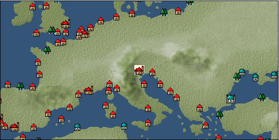

# Port: Venice

import Tabs from '@theme/Tabs';
import TabItem from '@theme/TabItem';

## General Information

| Attribute | Details |
| :--- | :--- |
| **Port Name** | Venice |
| **Port Type** | Headquarters |
| **Region** | eastern europe |
| **Sea Area** | adriatic sea |
| **Required Language** | italian |
| **Coordinates** | （542，2806） |
| **Investment Reward** | [Collection of Eastern Mediterranean specialties](docs/Items/RecipeBooks/item_850.md) （必要投資額：1,000,000ドゥカード） |

### Available Facilities

| guild | intermediary | exchange | tool shop | workshop craftsman | Painter | sculptor | peddler |
| --- | --- | --- | --- | --- | --- | --- | --- |
| ○ | ○ | ○ | ○ | ○ |   |   | ○ |
| Shipyard Master | Lumbermaker | Sail-maker | weapon craftsman | master | TavernFemale | archive | salesperson |
| --- | --- | --- | --- | --- | --- | --- | --- |
| ○ | ○ | ○ | ○ | ○ | ○ | ○ | ○ |
| Shipwright | 銀行 | street worker | 王宮 | Trading post | church | suburbs | translator |
| --- | --- | --- | --- | --- | --- | --- | --- |
| ○ | ○ |   | ○ | ○ | ○ |   | ○ |

### Description
The city is extremely prosperous as the largest trading city in the Mediterranean. Most of the products handled are also expensive. However, this city, which was at the height of its prosperity, is said to be beginning to decline due to the pressure from other emerging powers. Tavern Girl: Eleonora (Help Girl: Alice) Beginner Navigator Training School *Also speaks Arabic Cultural Area: Italy/Southern France *Translator has a bank NPC near the plaza and the trading post owner With the 9/19 update, if you talk to the coachman near the aristocratic daughter right next to the bank, you can travel overland to Florence, and you can now virtually cross to Pisa.

<Tabs>
  <TabItem value="trade_goods_sales" label="Trade Goods Sales">

| Item | Group | Purchase Price | Allied Price | Remarks |
| --- | --- | --- | --- | --- |
| [glasswork](docs/Items/TradeGoods/TradeGoods-Luxuries/item_60.md) | [Trading goods (artificial goods)](docs/Categories/category_13.md) | (1,257) | 1,100 |  |
| When in alliance: confirmed at 100% |
| [pepper](docs/Items/TradeGoods/TradeGoods-Spices/item_58.md) | [Trading Goods (Spices)](docs/Categories/category_12.md) | 10,300 | 8,960 |  |
| [satin](docs/Items/TradeGoods/TradeGoods-Fabrics/item_996.md) | [交易品（織物）](docs/Categories/category_20.md) | (3,474) | 3,040 |  |
| Investment required (Required investment amount: 180,000) At alliance: Confirmed at 100% |
| [georgette](docs/Items/TradeGoods/TradeGoods-Fabrics/item_1000.md) | [交易品（織物）](docs/Categories/category_20.md) | (3,646) | 3,190 |  |
| Investment required (Required investment amount: 240,000) At alliance: Confirmed at 100% |
| [parsley](docs/Items/TradeGoods/TradeGoods-Spices/item_46.md) | [Trading Goods (Spices)](docs/Categories/category_12.md) | 110 | 96 |  |
| When in alliance: confirmed at 100% |
| [race](docs/Items/TradeGoods/TradeGoods-Fabrics/item_59.md) | [交易品（織物）](docs/Categories/category_20.md) | 1,959 | 1,721 |  |
| 99%=1700 |
| [oil painting](docs/Items/TradeGoods/TradeGoods-Art/item_1088.md) | [交易品（美術品）](docs/Categories/category_14.md) | (2,583) | 2,260 |  |
| Investment required (Required investment amount: 320,000) At alliance: Confirmed at 100% |
| [silk fabric](docs/Items/TradeGoods/TradeGoods-Fabrics/item_823.md) | [交易品（織物）](docs/Categories/category_20.md) | (3,763) | 3,293 |  |
| 要投資（必要投資額：600,000） EO第4章で追加 |
| [goldsmith](docs/Items/TradeGoods/TradeGoods-Luxuries/item_687.md) | [Trading goods (artificial goods)](docs/Categories/category_13.md) | (3,589) | 3,140 |  |
| Investment required (Required investment amount: 180,000) At alliance: Confirmed at 100% |
| [chicken meat](docs/Items/TradeGoods/TradeGoods-Foodstuffs/item_29.md) | [Trading items (food items)](docs/Categories/category_3.md) | 329 | 288 |  |
| When in alliance: confirmed at 100% |
  </TabItem>
  <TabItem value="sale_specialty" label="Sale (Specialty)">

| Item | Group | sale price | Allied Price | Remarks |
| --- | --- | --- | --- | --- |

#### [交易品（繊維）](docs/Categories/category_1.md)

| [alpaca hair](docs/Items/TradeGoods/TradeGoods-Fibers/item_3009.md) | 交易品（繊維） | (2,349) | 2,740 |  |
| When in alliance: confirmed at 100% |
| [Rush](docs/Items/TradeGoods/TradeGoods-Fibers/item_3675.md) | 交易品（繊維） | (3,720) | 4,340 |  |
| When in alliance: confirmed at 100% |
| [sisal hemp](docs/Items/TradeGoods/TradeGoods-Fibers/item_1766.md) | 交易品（繊維） | (329) | 383 |  |
| When in alliance: confirmed at 100% |
| [Basho](docs/Items/TradeGoods/TradeGoods-Fibers/item_3862.md) | 交易品（繊維） | (26,964) | 31,463 |  |
| When in alliance: confirmed at 100% |
| [flax](docs/Items/TradeGoods/TradeGoods-Fibers/item_64.md) | 交易品（繊維） | (320) | 373 |  |
| [feather](docs/Items/TradeGoods/TradeGoods-Fibers/item_585.md) | 交易品（繊維） | (784) | 914 |  |
| When in alliance: confirmed at 100% |
| [tiger skin](docs/Items/TradeGoods/TradeGoods-Fibers/item_3790.md) | 交易品（繊維） | (30,938) | 36,100 |  |
| 98％＝35400　104％＝37400 |
| [Green ramie](docs/Items/TradeGoods/TradeGoods-Fibers/item_3428.md) | 交易品（繊維） | (32,652) | 38,100 |  |
| 98％＝37400　104％＝39600 |
| [deerskin](docs/Items/TradeGoods/TradeGoods-Fibers/item_3648.md) | 交易品（繊維） | (30,767) | 35,900 |  |
| When in alliance: confirmed at 100% |

#### [Trading Goods (Dye)](docs/Categories/category_2.md)

| [Indian Akane](docs/Items/TradeGoods/TradeGoods-Dye/item_1037.md) | Trading Goods (Dye) | (1,089) | 1,270 |  |
| When in alliance: confirmed at 100% |
| [Indian indigo](docs/Items/TradeGoods/TradeGoods-Dye/item_157.md) | Trading Goods (Dye) | (1,115) | 1,300 |  |
| When in alliance: confirmed at 100% |
| [cochineal](docs/Items/TradeGoods/TradeGoods-Dye/item_1817.md) | Trading Goods (Dye) | (1,466) | 1,710 |  |
| When in alliance: confirmed at 100% |
| [Shorou](docs/Items/TradeGoods/TradeGoods-Dye/item_3691.md) | Trading Goods (Dye) | (29,824) | 34,800 |  |
| When in alliance: confirmed at 100% |
| [turmeric](docs/Items/TradeGoods/TradeGoods-Dye/item_1433.md) | Trading Goods (Dye) | (662) | 772 |  |
| When in alliance: confirmed at 100% |
| [Safflower](docs/Items/TradeGoods/TradeGoods-Dye/item_1059.md) | Trading Goods (Dye) | (562) | 655 |  |
| [mayan blue](docs/Items/TradeGoods/TradeGoods-Dye/item_1096.md) | Trading Goods (Dye) | 1,565 | 1,640 |  |
| 98%＝1620 103%＝1680 |
| [mimosa](docs/Items/TradeGoods/TradeGoods-Dye/item_2281.md) | Trading Goods (Dye) | (1,320) | 1,540 |  |
| 98％＝1520　102％＝1560 |
| [gallnut](docs/Items/TradeGoods/TradeGoods-Dye/item_3429.md) | Trading Goods (Dye) | (44,993) | 52,500 |  |
| 98％＝51500　104％＝54600 |
| [purple root](docs/Items/TradeGoods/TradeGoods-Dye/item_3752.md) | Trading Goods (Dye) | (30,852) | 36,000 |  |
| 98％＝35300　103％＝37000 |

#### [Trading items (food items)](docs/Categories/category_3.md)

| [buckwheat](docs/Items/TradeGoods/TradeGoods-Foodstuffs/item_3430.md) | Trading items (food items) | (45,164) | 52,700 |  |
| When in alliance: confirmed at 100% |
| [Karasumi](docs/Items/TradeGoods/TradeGoods-Foodstuffs/item_3687.md) | Trading items (food items) | (31,624) | 36,900 |  |
| 98％＝36200　103％＝38000 |
| [kangaroo meat](docs/Items/TradeGoods/TradeGoods-Foodstuffs/item_2285.md) | Trading items (food items) | (803) | 936 |  |
| When in alliance: confirmed at 100% |
| [cactus](docs/Items/TradeGoods/TradeGoods-Foodstuffs/item_2740.md) | Trading items (food items) | (391) | 456 |  |
| When in alliance: confirmed at 100% |
| [taro](docs/Items/TradeGoods/TradeGoods-Foodstuffs/item_1960.md) | Trading items (food items) | (235) | 274 |  |
| When in alliance: confirmed at 100% |
| [Chamtashima](docs/Items/TradeGoods/TradeGoods-Foodstuffs/item_3771.md) | Trading items (food items) | (1,423) | 1,660 |  |
| 98％＝1650　103％＝1680 |
| [Red bean](docs/Items/TradeGoods/TradeGoods-Foodstuffs/item_3419.md) | Trading items (food items) | (264) | 308 |  |
| When in alliance: confirmed at 100% |
| [楊州栗](docs/Items/TradeGoods/TradeGoods-Foodstuffs/item_3789.md) | Trading items (food items) | (9,256) | 10,800 |  |
| When in alliance: confirmed at 100% |

#### [交易品（調味料）](docs/Categories/category_4.md)

| [oyster sauce](docs/Items/TradeGoods/TradeGoods-Seasonings/item_3505.md) | 交易品（調味料） | (2,794) | 3,260 |  |
| When in alliance: confirmed at 100% |
| [Gochujang](docs/Items/TradeGoods/TradeGoods-Seasonings/item_3591.md) | 交易品（調味料） | (6,608) | 7,710 |  |
| 98％＝7580　104％＝7980 |
| [tamarind](docs/Items/TradeGoods/TradeGoods-Seasonings/item_1968.md) | 交易品（調味料） | (1,869) | 2,180 |  |
| 98％＝2140　104％＝2250 |
| [Choshi](docs/Items/TradeGoods/TradeGoods-Seasonings/item_3793.md) | 交易品（調味料） | (30,681) | 35,800 |  |
| 98％＝35100　103％＝36800 |
| [Nampula](docs/Items/TradeGoods/TradeGoods-Seasonings/item_1972.md) | 交易品（調味料） | (525) | 612 |  |
| When in alliance: confirmed at 100% |
| [apple cider vinegar](docs/Items/TradeGoods/TradeGoods-Seasonings/item_882.md) | 交易品（調味料） | (428) | 499 |  |
| 98％＝490　101％＝503 |
| [miso](docs/Items/TradeGoods/TradeGoods-Seasonings/item_3420.md) | 交易品（調味料） | (3,643) | 4,250 |  |
| When in alliance: confirmed at 100% |
| [Sha Cha Ji](docs/Items/TradeGoods/TradeGoods-Seasonings/item_3689.md) | 交易品（調味料） | (43,965) | 51,300 |  |
| When in alliance: confirmed at 100% |
| [Bean sauce](docs/Items/TradeGoods/TradeGoods-Seasonings/item_3875.md) | 交易品（調味料） | (34,023) | 39,700 |  |
| When in alliance: confirmed at 100% |
| [soy sauce](docs/Items/TradeGoods/TradeGoods-Seasonings/item_3425.md) | 交易品（調味料） | (45,250) | 52,800 |  |
| 98％＝51800　104％＝54900 |
| [black vinegar](docs/Items/TradeGoods/TradeGoods-Seasonings/item_3475.md) | 交易品（調味料） | (4,611) | 5,380 |  |
| 98％＝5290　104％＝5560 |

#### [交易品（雑貨）](docs/Categories/category_5.md)

| [old ink stick](docs/Items/TradeGoods/TradeGoods-Misc/item_3921.md) | 交易品（雑貨） | (9,513) | 11,100 |  |
| When in alliance: confirmed at 100% |
| [Japanese books](docs/Items/TradeGoods/TradeGoods-Misc/item_3439.md) | 交易品（雑貨） | (34,366) | 40,100 |  |
| When in alliance: confirmed at 100% |
| [lantern](docs/Items/TradeGoods/TradeGoods-Misc/item_3683.md) | 交易品（雑貨） | (53,134) | 62,000 |  |
| 98％＝60800　103％＝63800 |
| [Korean books](docs/Items/TradeGoods/TradeGoods-Misc/item_3750.md) | 交易品（雑貨） | (31,024) | 36,200 |  |
| When in alliance: confirmed at 100% |
| [rattan work](docs/Items/TradeGoods/TradeGoods-Misc/item_3698.md) | 交易品（雑貨） | (30,767) | 35,900 |  |
| When in alliance: confirmed at 100% |

#### [Trading products (medical products)](docs/Categories/category_6.md)

| [dog saffron](docs/Items/TradeGoods/TradeGoods-Medicine/item_1055.md) | Trading products (medical products) | (478) | 557 |  |
| 98%＝547　104%＝578 |
| [Saikaku](docs/Items/TradeGoods/TradeGoods-Medicine/item_1959.md) | Trading products (medical products) | (4,114) | 4,800 |  |
| When in alliance: confirmed at 100% |
| [tea tree](docs/Items/TradeGoods/TradeGoods-Medicine/item_2283.md) | Trading products (medical products) | (1,277) | 1,490 |  |
| When in alliance: confirmed at 100% |
| [Noni](docs/Items/TradeGoods/TradeGoods-Medicine/item_2099.md) | Trading products (medical products) | (1,200) | 1,400 |  |
| When in alliance: confirmed at 100% |
| [heath](docs/Items/TradeGoods/TradeGoods-Medicine/item_63.md) | Trading products (medical products) | (368) | 429 |  |
| 98％＝418　102％＝433 |
| [Borei](docs/Items/TradeGoods/TradeGoods-Medicine/item_3678.md) | Trading products (medical products) | (44,650) | 52,100 |  |
| 96％＝50100　103％＝53700 |
| [Korean ginseng](docs/Items/TradeGoods/TradeGoods-Medicine/item_3738.md) | Trading products (medical products) | (30,681) | 35,800 |  |
| 98％＝35100　106％＝37900 |
| [Nothing](docs/Items/TradeGoods/TradeGoods-Medicine/item_1053.md) | Trading products (medical products) | (664) | 774 |  |
| [calamus](docs/Items/TradeGoods/TradeGoods-Medicine/item_3427.md) | Trading products (medical products) | (33,938) | 39,600 |  |
| When in alliance: confirmed at 100% |

#### [Trading Items (Iron Stone)](docs/Categories/category_7.md)

| [Hokutolite](docs/Items/TradeGoods/TradeGoods-Minerals/item_3694.md) | Trading Items (Iron Stone) | (32,224) | 37,600 |  |
| 98％＝36900　103％＝38700 |
| [white porcelain ore](docs/Items/TradeGoods/TradeGoods-Minerals/item_3433.md) | Trading Items (Iron Stone) | (34,880) | 40,700 |  |
| 98％＝39900　103％＝41800 |
| [medical stone](docs/Items/TradeGoods/TradeGoods-Minerals/item_3786.md) | Trading Items (Iron Stone) | (31,110) | 36,300 |  |
| When in alliance: confirmed at 100% |

#### [Trading products (precious metals)](docs/Categories/category_8.md)

| [platinum](docs/Items/TradeGoods/TradeGoods-Metals/item_2178.md) | Trading products (precious metals) | (6,514) | 7,600 |  |
| [佐摩銀](docs/Items/TradeGoods/TradeGoods-Metals/item_3432.md) | Trading products (precious metals) | (36,680) | 42,800 |  |
| When in alliance: confirmed at 100% |
| [Korean silver](docs/Items/TradeGoods/TradeGoods-Metals/item_3796.md) | Trading products (precious metals) | (31,281) | 36,500 |  |
| When in alliance: confirmed at 100% |
| [Jinguashijin](docs/Items/TradeGoods/TradeGoods-Metals/item_3693.md) | Trading products (precious metals) | (30,938) | 36,100 |  |
| When in alliance: confirmed at 100% |

#### [交易品（酒類）](docs/Categories/category_9.md)

| [aquavit](docs/Items/TradeGoods/TradeGoods-Alcohol/item_572.md) | 交易品（酒類） | (755) | 880 |  |
| When in alliance: confirmed at 100% |
| [whiskey](docs/Items/TradeGoods/TradeGoods-Alcohol/item_1.md) | 交易品（酒類） | (823) | 960 |  |
| [gin](docs/Items/TradeGoods/TradeGoods-Alcohol/item_291.md) | 交易品（酒類） | (804) | 937 |  |
| [tequila](docs/Items/TradeGoods/TradeGoods-Alcohol/item_108.md) | 交易品（酒類） | (1,972) | 2,300 |  |
| 98%＝2270 |
| [fruit brandy](docs/Items/TradeGoods/TradeGoods-Alcohol/item_1440.md) | 交易品（酒類） | (667) | 778 |  |
| When in alliance: confirmed at 100% |
| [Taiwan rice wine](docs/Items/TradeGoods/TradeGoods-Alcohol/item_3672.md) | 交易品（酒類） | (22,882) | 26,700 |  |
| Confirm at 100% |
| [Andong soju](docs/Items/TradeGoods/TradeGoods-Alcohol/item_3757.md) | 交易品（酒類） | (31,024) | 36,200 |  |
| When in alliance: confirmed at 100% |
| [Sake](docs/Items/TradeGoods/TradeGoods-Alcohol/item_3424.md) | 交易品（酒類） | (34,623) | 40,400 |  |
| When in alliance: confirmed at 100% |

#### [Trading goods (hobby goods)](docs/Categories/category_10.md)

| [Aigyoku](docs/Items/TradeGoods/TradeGoods-Sunddries/item_3677.md) | Trading goods (hobby goods) | (30,510) | 35,600 |  |
| When in alliance: confirmed at 100% |
| [cacao](docs/Items/TradeGoods/TradeGoods-Sunddries/item_140.md) | Trading goods (hobby goods) | (1,286) | 1,500 |  |
| 98%＝1480 |
| [cashew nuts](docs/Items/TradeGoods/TradeGoods-Sunddries/item_2120.md) | Trading goods (hobby goods) | (866) | 1,010 |  |
| When in alliance: confirmed at 100% |
| [caviar](docs/Items/TradeGoods/TradeGoods-Sunddries/item_2122.md) | Trading goods (hobby goods) | (1,149) | 1,340 |  |
| When in alliance: confirmed at 100% |
| [tobacco](docs/Items/TradeGoods/TradeGoods-Sunddries/item_109.md) | Trading goods (hobby goods) | (1,277) | 1,490 |  |
| When in alliance: confirmed at 100% |
| [durian](docs/Items/TradeGoods/TradeGoods-Sunddries/item_1949.md) | Trading goods (hobby goods) | (1,560) | 1,820 |  |
| When in alliance: confirmed at 100% |
| [eggplant](docs/Items/TradeGoods/TradeGoods-Sunddries/item_3426.md) | Trading goods (hobby goods) | (32,652) | 38,100 |  |
| When in alliance: confirmed at 100% |
| [banana](docs/Items/TradeGoods/TradeGoods-Sunddries/item_1947.md) | Trading goods (hobby goods) | (453) | 528 |  |
| 98%＝521 104%＝543 |
| [pineapple](docs/Items/TradeGoods/TradeGoods-Sunddries/item_867.md) | Trading goods (hobby goods) | (1,834) | 2,140 |  |
| When in alliance: confirmed at 100% |
| [pistachio](docs/Items/TradeGoods/TradeGoods-Sunddries/item_2353.md) | Trading goods (hobby goods) | (801) | 934 |  |
| When in alliance: confirmed at 100% |
| [peanuts](docs/Items/TradeGoods/TradeGoods-Sunddries/item_134.md) | Trading goods (hobby goods) | (395) | 460 |  |
| When in alliance: confirmed at 100% |
| [macadamia nuts](docs/Items/TradeGoods/TradeGoods-Sunddries/item_2282.md) | Trading goods (hobby goods) | (1,029) | 1,200 |  |
| When in alliance: confirmed at 100% |
| [mango](docs/Items/TradeGoods/TradeGoods-Sunddries/item_2095.md) | Trading goods (hobby goods) | (786) | 916 |  |
| When in alliance: confirmed at 100% |
| [lemon myrtle](docs/Items/TradeGoods/TradeGoods-Sunddries/item_2840.md) | Trading goods (hobby goods) | (1,963) | 2,290 |  |
| When in alliance: confirmed at 100% |
| [Chinese tea](docs/Items/TradeGoods/TradeGoods-Sunddries/item_3907.md) | Trading goods (hobby goods) | (33,595) | 39,200 |  |
| When in alliance: confirmed at 100% |
| [dried figs](docs/Items/TradeGoods/TradeGoods-Sunddries/item_611.md) | Trading goods (hobby goods) | (328) | 382 |  |
| When in alliance: confirmed at 100% |
| [dried apple](docs/Items/TradeGoods/TradeGoods-Sunddries/item_19.md) | Trading goods (hobby goods) | (369) | 430 |  |
| When in alliance: confirmed at 100% |
| [Korean tea](docs/Items/TradeGoods/TradeGoods-Sunddries/item_3751.md) | Trading goods (hobby goods) | (30,852) | 36,000 |  |
| When in alliance: confirmed at 100% |
| [black tea](docs/Items/TradeGoods/TradeGoods-Sunddries/item_675.md) | Trading goods (hobby goods) | (2,212) | 2,580 |  |
| When in alliance: confirmed at 100% |
| [金針花](docs/Items/TradeGoods/TradeGoods-Sunddries/item_3739.md) | Trading goods (hobby goods) | (9,342) | 10,900 |  |
| When in alliance: confirmed at 100% |

#### [Trading Goods (Spices)](docs/Categories/category_11.md)

| [ylang ylang](docs/Items/TradeGoods/TradeGoods-Perfume/item_1434.md) | Trading Goods (Spices) | (1,680) | 1,960 |  |
| 98%＝1930　103%＝2010 |
| [orange oil](docs/Items/TradeGoods/TradeGoods-Perfume/item_778.md) | Trading Goods (Spices) | (1,123) | 1,310 |  |
| When in alliance: confirmed at 100% |
| [gardenia](docs/Items/TradeGoods/TradeGoods-Perfume/item_1091.md) | Trading Goods (Spices) | (31,967) | 37,300 |  |
| 98％＝36600　104％＝38800 |
| [jasmine](docs/Items/TradeGoods/TradeGoods-Perfume/item_772.md) | Trading Goods (Spices) | (5,597) | 6,530 |  |
| 98%＝6460　107%＝6790 |
| [daffodil](docs/Items/TradeGoods/TradeGoods-Perfume/item_612.md) | Trading Goods (Spices) | (829) | 967 |  |
| [lily of the valley](docs/Items/TradeGoods/TradeGoods-Perfume/item_358.md) | Trading Goods (Spices) | (1,332) | 1,554 |  |
| [geranium](docs/Items/TradeGoods/TradeGoods-Perfume/item_145.md) | Trading Goods (Spices) | (1,089) | 1,270 |  |
| 98%＝1240　102%＝1290 |
| [Chindarle](docs/Items/TradeGoods/TradeGoods-Perfume/item_3795.md) | Trading Goods (Spices) | (30,767) | 35,900 |  |
| 98％＝35200　103％＝36900 |
| [Hamanasu](docs/Items/TradeGoods/TradeGoods-Perfume/item_3692.md) | Trading Goods (Spices) | (30,938) | 36,100 |  |
| When in alliance: confirmed at 100% |
| [patchouli](docs/Items/TradeGoods/TradeGoods-Perfume/item_1963.md) | Trading Goods (Spices) | (2,554) | 2,980 |  |
| 98％＝2950 103％＝3020 |
| [eucalyptus](docs/Items/TradeGoods/TradeGoods-Perfume/item_2278.md) | Trading Goods (Spices) | (952) | 1,110 |  |
| When in alliance: confirmed at 100% |
| [lira](docs/Items/TradeGoods/TradeGoods-Perfume/item_30.md) | Trading Goods (Spices) | (857) | 1,000 |  |
| [mastic](docs/Items/TradeGoods/TradeGoods-Perfume/item_680.md) | Trading Goods (Spices) | (2,314) | 2,700 |  |
| When in alliance: confirmed at 100% |
| [Tang Muxiang](docs/Items/TradeGoods/TradeGoods-Perfume/item_593.md) | Trading Goods (Spices) | (1,560) | 1,820 |  |
| When in alliance: confirmed at 100% |
| [benzoin](docs/Items/TradeGoods/TradeGoods-Perfume/item_1962.md) | Trading Goods (Spices) | (1,740) | 2,030 |  |
| When in alliance: confirmed at 100% |
| [sandalwood](docs/Items/TradeGoods/TradeGoods-Perfume/item_771.md) | Trading Goods (Spices) | (3,634) | 4,240 |  |
| When in alliance: confirmed at 100% |
| [貝甲香](docs/Items/TradeGoods/TradeGoods-Perfume/item_776.md) | Trading Goods (Spices) | (2,066) | 2,410 |  |
| When in alliance: confirmed at 100% |
| [龍脳](docs/Items/TradeGoods/TradeGoods-Perfume/item_1676.md) | Trading Goods (Spices) | (2,640) | 3,080 |  |
| When in alliance: confirmed at 100% |

#### [Trading Goods (Spices)](docs/Categories/category_12.md)

| [allspice](docs/Items/TradeGoods/TradeGoods-Spices/item_1848.md) | Trading Goods (Spices) | (1,586) | 1,850 |  |
| When in alliance: confirmed at 100% |
| [cardamom](docs/Items/TradeGoods/TradeGoods-Spices/item_1431.md) | Trading Goods (Spices) | (4,568) | 5,330 |  |
| When in alliance: confirmed at 100% |
| [garam masala](docs/Items/TradeGoods/TradeGoods-Spices/item_965.md) | Trading Goods (Spices) | (691) | 806 |  |
| When in alliance: confirmed at 100% |
| [cloves](docs/Items/TradeGoods/TradeGoods-Spices/item_1092.md) | Trading Goods (Spices) | (11,570) | 13,500 |  |
| 98%=13200 |
| [Kouzuku](docs/Items/TradeGoods/TradeGoods-Spices/item_3690.md) | Trading Goods (Spices) | (32,138) | 37,500 |  |
| 98％＝36800　103％＝38600 |
| [pepper](docs/Items/TradeGoods/TradeGoods-Spices/item_58.md) | Trading Goods (Spices) | (2,357) | 2,750 |  |
| [Sanshou](docs/Items/TradeGoods/TradeGoods-Spices/item_3794.md) | Trading Goods (Spices) | (30,938) | 36,100 |  |
| 98％＝35400　104％＝37500 |
| [cinnamon](docs/Items/TradeGoods/TradeGoods-Spices/item_1432.md) | Trading Goods (Spices) | (4,740) | 5,530 |  |
| When in alliance: confirmed at 100% |
| [nutmeg](docs/Items/TradeGoods/TradeGoods-Spices/item_1969.md) | Trading Goods (Spices) | (20,916) | 24,405 |  |
| 98%＝14600 |
| [bergamot](docs/Items/TradeGoods/TradeGoods-Spices/item_879.md) | Trading Goods (Spices) | (706) | 823 |  |
| When in alliance: confirmed at 100% |
| [mustard](docs/Items/TradeGoods/TradeGoods-Spices/item_575.md) | Trading Goods (Spices) | (254) | 296 |  |
| When in alliance: confirmed at 100% |
| [mace](docs/Items/TradeGoods/TradeGoods-Spices/item_2100.md) | Trading Goods (Spices) | (19,765) | 23,062 |  |
| [lemongrass](docs/Items/TradeGoods/TradeGoods-Spices/item_2096.md) | Trading Goods (Spices) | (2,914) | 3,400 |  |
| When in alliance: confirmed at 100% |
| [chili pepper](docs/Items/TradeGoods/TradeGoods-Spices/item_1831.md) | Trading Goods (Spices) | (1,457) | 1,700 |  |
| 98%＝1670　102%＝1730 |
| [Grapefruit](docs/Items/TradeGoods/TradeGoods-Spices/item_3422.md) | Trading Goods (Spices) | (34,538) | 40,300 |  |
| 98％＝39500　105％＝42300 |
| [green chili pepper](docs/Items/TradeGoods/TradeGoods-Spices/item_1990.md) | Trading Goods (Spices) | (2,297) | 2,680 |  |
| When in alliance: confirmed at 100% |

#### [Trading goods (artificial goods)](docs/Categories/category_13.md)

| [Darla Hest](docs/Items/TradeGoods/TradeGoods-Luxuries/item_6190.md) | Trading goods (artificial goods) | (3,908) | 4,560 |  |
| [Tumbaga](docs/Items/TradeGoods/TradeGoods-Luxuries/item_3028.md) | Trading goods (artificial goods) | (16,969) | 19,800 |  |
| 98%＝19500　107%＝20900 |
| [Kuresute](docs/Items/TradeGoods/TradeGoods-Luxuries/item_3897.md) | Trading goods (artificial goods) | (10,370) | 12,100 |  |
| When in alliance: confirmed at 100% |
| [Song Baici](docs/Items/TradeGoods/TradeGoods-Luxuries/item_3904.md) | Trading goods (artificial goods) | (45,079) | 52,600 |  |
| 98％＝51600　105％＝55100 |
| [湖筆](docs/Items/TradeGoods/TradeGoods-Luxuries/item_3898.md) | Trading goods (artificial goods) | (9,856) | 11,500 |  |
| When in alliance: confirmed at 100% |
| [lacquerware](docs/Items/TradeGoods/TradeGoods-Luxuries/item_3435.md) | Trading goods (artificial goods) | (36,080) | 42,100 |  |
| 98％＝41300　103％＝43300 |
| [Saori](docs/Items/TradeGoods/TradeGoods-Luxuries/item_3676.md) | Trading goods (artificial goods) | (9,685) | 11,300 |  |
| When in alliance: confirmed at 100% |
| [Corner work](docs/Items/TradeGoods/TradeGoods-Luxuries/item_3696.md) | Trading goods (artificial goods) | (43,108) | 50,300 |  |
| 98％＝49300　103％＝51800 |
| [Goryeo celadon](docs/Items/TradeGoods/TradeGoods-Luxuries/item_3758.md) | Trading goods (artificial goods) | (43,279) | 50,500 |  |
| 98％＝49500　105％＝53000 |

#### [交易品（美術品）](docs/Categories/category_14.md)

| [taiwan wood carving](docs/Items/TradeGoods/TradeGoods-Art/item_3697.md) | 交易品（美術品） | (30,424) | 35,500 |  |
| 98％＝34800　104％＝36800 |
| [Japanese painting](docs/Items/TradeGoods/TradeGoods-Art/item_3436.md) | 交易品（美術品） | (42,251) | 49,300 |  |
| When in alliance: confirmed at 100% |
| [Mother-of-pearl lacquerware](docs/Items/TradeGoods/TradeGoods-Art/item_3785.md) | 交易品（美術品） | (44,479) | 51,900 |  |
| When in alliance: confirmed at 100% |

#### [Trading Items (Gemstones)](docs/Categories/category_15.md)

| [jade](docs/Items/TradeGoods/TradeGoods-Gems/item_2015.md) | Trading Items (Gemstones) | (4,705) | 5,490 |  |
| When in alliance: confirmed at 100% |
| [Tortoiseshell](docs/Items/TradeGoods/TradeGoods-Gems/item_1980.md) | Trading Items (Gemstones) | (3,617) | 4,220 |  |
| When in alliance: confirmed at 100% |
| [aventurine](docs/Items/TradeGoods/TradeGoods-Gems/item_678.md) | Trading Items (Gemstones) | (5,091) | 5,940 |  |
| When in alliance: confirmed at 100% |
| [alexandrite](docs/Items/TradeGoods/TradeGoods-Gems/item_4429.md) | Trading Items (Gemstones) | (4,810) | 5,612 |  |
| [opal](docs/Items/TradeGoods/TradeGoods-Gems/item_2006.md) | Trading Items (Gemstones) | (6,865) | 8,010 |  |
| 98%＝7890 |
| [cat's eye](docs/Items/TradeGoods/TradeGoods-Gems/item_1047.md) | Trading Items (Gemstones) | (8,570) | 10,000 |  |
| When in alliance: confirmed at 100% |
| [sapphire](docs/Items/TradeGoods/TradeGoods-Gems/item_676.md) | Trading Items (Gemstones) | (10,584) | 12,350 |  |
| When in alliance: confirmed at 100% |
| [turquoise](docs/Items/TradeGoods/TradeGoods-Gems/item_1006.md) | Trading Items (Gemstones) | (3,411) | 3,980 |  |
| When in alliance: confirmed at 100% |
| [diamond](docs/Items/TradeGoods/TradeGoods-Gems/item_449.md) | Trading Items (Gemstones) | (6,188) | 7,220 |  |
| When in alliance: confirmed at 100% |
| [topaz](docs/Items/TradeGoods/TradeGoods-Gems/item_1097.md) | Trading Items (Gemstones) | (4,997) | 5,830 |  |
| When in alliance: confirmed at 100% |
| [pink diamond](docs/Items/TradeGoods/TradeGoods-Gems/item_2874.md) | Trading Items (Gemstones) | (12,941) | 15,100 |  |
| When in alliance: confirmed at 100% |
| [lapis lazuli](docs/Items/TradeGoods/TradeGoods-Gems/item_995.md) | Trading Items (Gemstones) | (5,485) | 6,400 |  |
| When in alliance: confirmed at 100% |
| [ruby](docs/Items/TradeGoods/TradeGoods-Gems/item_773.md) | Trading Items (Gemstones) | (11,056) | 12,900 |  |
| When in alliance: confirmed at 100% |
| [taiwan sapphire](docs/Items/TradeGoods/TradeGoods-Gems/item_3695.md) | Trading Items (Gemstones) | (45,079) | 52,600 |  |
| When in alliance: confirmed at 100% |
| [amber](docs/Items/TradeGoods/TradeGoods-Gems/item_618.md) | Trading Items (Gemstones) | (3,951) | 4,610 |  |
| [amethyst](docs/Items/TradeGoods/TradeGoods-Gems/item_3434.md) | Trading Items (Gemstones) | (37,023) | 43,200 |  |
| When in alliance: confirmed at 100% |
| [tiger eye stone](docs/Items/TradeGoods/TradeGoods-Gems/item_3797.md) | Trading Items (Gemstones) | (30,681) | 35,800 |  |
| When in alliance: confirmed at 100% |

#### [Trading Items (Arms)](docs/Categories/category_16.md)

| [damascus sword](docs/Items/TradeGoods/TradeGoods-Weapons/item_903.md) | Trading Items (Arms) | (4,551) | 5,310 |  |
| When in alliance: confirmed at 100% |
| [Japanese bow](docs/Items/TradeGoods/TradeGoods-Weapons/item_3469.md) | Trading Items (Arms) | (11,141) | 13,000 |  |
| 98％＝12800　101％＝13100 |
| [broadsword](docs/Items/TradeGoods/TradeGoods-Weapons/item_3754.md) | Trading Items (Arms) | (43,450) | 50,700 |  |
| When in alliance: confirmed at 100% |
| [Japanese sword](docs/Items/TradeGoods/TradeGoods-Weapons/item_3437.md) | Trading Items (Arms) | (33,252) | 38,800 |  |
| When in alliance: confirmed at 100% |
| [japanese armor](docs/Items/TradeGoods/TradeGoods-Weapons/item_3590.md) | Trading Items (Arms) | (11,056) | 12,900 |  |
| When in alliance: confirmed at 100% |
| [short bow](docs/Items/TradeGoods/TradeGoods-Weapons/item_3764.md) | Trading Items (Arms) | (11,141) | 13,000 |  |
| When in alliance: confirmed at 100% |
| [rattan armor](docs/Items/TradeGoods/TradeGoods-Weapons/item_3699.md) | Trading Items (Arms) | (29,910) | 34,900 |  |
| 98％＝34200　104％＝36200 |

#### [Trading Items (Firearms)](docs/Categories/category_17.md)

| [monocular gun](docs/Items/TradeGoods/TradeGoods-Firearms/item_3916.md) | Trading Items (Firearms) | (33,423) | 39,000 |  |
| When in alliance: confirmed at 100% |
| [throwing bomb](docs/Items/TradeGoods/TradeGoods-Firearms/item_3784.md) | Trading Items (Firearms) | (31,024) | 36,200 |  |
| When in alliance: confirmed at 100% |
| [tanegashima gun](docs/Items/TradeGoods/TradeGoods-Firearms/item_3423.md) | Trading Items (Firearms) | (31,967) | 37,300 |  |
| When in alliance: confirmed at 100% |
| [銅手銃](docs/Items/TradeGoods/TradeGoods-Firearms/item_3700.md) | Trading Items (Firearms) | (30,253) | 35,300 |  |
| When in alliance: confirmed at 100% |

#### [Trading Goods (Livestock)](docs/Categories/category_18.md)

| [boar](docs/Items/TradeGoods/TradeGoods-Livestock/item_3476.md) | Trading Goods (Livestock) | (32,309) | 37,700 |  |
| When in alliance: confirmed at 100% |
| [water buffalo](docs/Items/TradeGoods/TradeGoods-Livestock/item_3688.md) | Trading Goods (Livestock) | (1,440) | 1,680 |  |
| When in alliance: confirmed at 100% |
| [韓牛](docs/Items/TradeGoods/TradeGoods-Livestock/item_3792.md) | Trading Goods (Livestock) | (37,451) | 43,700 |  |
| When in alliance: confirmed at 100% |

#### [交易品（工業品）](docs/Categories/category_19.md)

| [rubber](docs/Items/TradeGoods/TradeGoods-Wares/item_2819.md) | 交易品（工業品） | (1,514) | 1,766 |  |
| [papyrus](docs/Items/TradeGoods/TradeGoods-Wares/item_616.md) | 交易品（工業品） | 520 | 530 |  |
| [Japanese paper](docs/Items/TradeGoods/TradeGoods-Wares/item_3438.md) | 交易品（工業品） | (33,938) | 39,600 |  |
| When in alliance: confirmed at 100% |
| [paint](docs/Items/TradeGoods/TradeGoods-Wares/item_3411.md) | 交易品（工業品） | (2,623) | 3,060 |  |
| When in alliance: confirmed at 100% |
| [bamboo](docs/Items/TradeGoods/TradeGoods-Wares/item_3899.md) | 交易品（工業品） | (33,595) | 39,200 |  |
| When in alliance: confirmed at 100% |
| [rattan](docs/Items/TradeGoods/TradeGoods-Wares/item_3701.md) | 交易品（工業品） | (30,424) | 35,500 |  |
| When in alliance: confirmed at 100% |
| [韓紙](docs/Items/TradeGoods/TradeGoods-Wares/item_3755.md) | 交易品（工業品） | (31,367) | 36,600 |  |
| When in alliance: confirmed at 100% |

#### [交易品（織物）](docs/Categories/category_20.md)

| [Awaiyo](docs/Items/TradeGoods/TradeGoods-Fabrics/item_3002.md) | 交易品（織物） | (8,091) | 9,440 |  |
| When in alliance: confirmed at 100% |
| [indian chintz](docs/Items/TradeGoods/TradeGoods-Fabrics/item_159.md) | 交易品（織物） | (2,229) | 2,600 |  |
| When in alliance: confirmed at 100% |
| [dutch calico](docs/Items/TradeGoods/TradeGoods-Fabrics/item_1435.md) | 交易品（織物） | 1,379 | 1,373 |  |
| [gobelin weave](docs/Items/TradeGoods/TradeGoods-Fabrics/item_1276.md) | 交易品（織物） | (3,634) | 4,240 |  |
| When in alliance: confirmed at 100% |
| [java chintz](docs/Items/TradeGoods/TradeGoods-Fabrics/item_1970.md) | 交易品（織物） | (3,557) | 4,150 |  |
| 98%＝4080　102%＝4220 |
| [taffeta](docs/Items/TradeGoods/TradeGoods-Fabrics/item_1001.md) | 交易品（織物） | (5,194) | 6,060 |  |
| When in alliance: confirmed at 100% |
| [damask](docs/Items/TradeGoods/TradeGoods-Fabrics/item_614.md) | 交易品（織物） | (3,454) | 4,030 |  |
| When in alliance: confirmed at 100% |
| [turkish rug](docs/Items/TradeGoods/TradeGoods-Fabrics/item_686.md) | 交易品（織物） | (4,037) | 4,710 |  |
| 98%＝4620　107％＝5010 |
| [felt](docs/Items/TradeGoods/TradeGoods-Fabrics/item_4439.md) | 交易品（織物） | (1,168) | 1,362 |  |
| [flannel](docs/Items/TradeGoods/TradeGoods-Fabrics/item_149.md) | 交易品（織物） | (1,423) | 1,660 |  |
| When in alliance: confirmed at 100% |
| [persian rug](docs/Items/TradeGoods/TradeGoods-Fabrics/item_606.md) | 交易品（織物） | (8,176) | 9,540 |  |
| 98％＝9420　107％＝9940 |
| [China Duantong](docs/Items/TradeGoods/TradeGoods-Fabrics/item_3478.md) | 交易品（織物） | (18,169) | 21,200 |  |
| When in alliance: confirmed at 100% |
| [唐錦](docs/Items/TradeGoods/TradeGoods-Fabrics/item_3896.md) | 交易品（織物） | (35,052) | 40,900 |  |
| When in alliance: confirmed at 100% |
| [大和錦](docs/Items/TradeGoods/TradeGoods-Fabrics/item_3482.md) | 交易品（織物） | (18,169) | 21,200 |  |
| 98％＝20900　102％＝21500 |
| [明紬](docs/Items/TradeGoods/TradeGoods-Fabrics/item_3753.md) | 交易品（織物） | (31,452) | 36,700 |  |
| When in alliance: confirmed at 100% |
| [Bingata](docs/Items/TradeGoods/TradeGoods-Fabrics/item_3479.md) | 交易品（織物） | (18,083) | 21,100 |  |
| 98％＝20800　103％＝21600 |
| [Nishijin textile](docs/Items/TradeGoods/TradeGoods-Fabrics/item_3431.md) | 交易品（織物） | (35,652) | 41,600 |  |
| When in alliance: confirmed at 100% |
| [麻織物](docs/Items/TradeGoods/TradeGoods-Fabrics/item_3673.md) | 交易品（織物） | (31,624) | 36,900 |  |
| When in alliance: confirmed at 100% |
  </TabItem>
  <TabItem value="sale_no_specialty" label="Sale (No Specialty)">

| Item | Group | sale price | Allied Price | Remarks |
| --- | --- | --- | --- | --- |

#### [交易品（繊維）](docs/Categories/category_1.md)

| [rabbit hair](docs/Items/TradeGoods/TradeGoods-Fibers/item_1036.md) | 交易品（繊維） | (836) | 975 |  |
| When in alliance: confirmed at 100% |
| [peacock feather](docs/Items/TradeGoods/TradeGoods-Fibers/item_901.md) | 交易品（繊維） | (446) | 520 |  |
| 98％＝510　107％＝557 |
| [coconut fiber](docs/Items/TradeGoods/TradeGoods-Fibers/item_444.md) | 交易品（繊維） | (181) | 211 |  |
| When in alliance: confirmed at 100% |
| [camel hair](docs/Items/TradeGoods/TradeGoods-Fibers/item_577.md) | 交易品（繊維） | (443) | 516 |  |
| [goat hair](docs/Items/TradeGoods/TradeGoods-Fibers/item_770.md) | 交易品（繊維） | (1,166) | 1,360 |  |
| When in alliance: confirmed at 100% |
| [fur](docs/Items/TradeGoods/TradeGoods-Fibers/item_634.md) | 交易品（繊維） | (2,152) | 2,510 |  |
| When in alliance: confirmed at 100% |
| [leather](docs/Items/TradeGoods/TradeGoods-Fibers/item_44.md) | 交易品（繊維） | (540) | 629 |  |
| [cotton](docs/Items/TradeGoods/TradeGoods-Fibers/item_610.md) | 交易品（繊維） | (558) | 651 |  |
| [wool](docs/Items/TradeGoods/TradeGoods-Fibers/item_5.md) | 交易品（繊維） | (431) | 502 |  |

#### [Trading Goods (Dye)](docs/Categories/category_2.md)

| [ward](docs/Items/TradeGoods/TradeGoods-Dye/item_57.md) | Trading Goods (Dye) | 907 | 907 |  |
| [Gerep](docs/Items/TradeGoods/TradeGoods-Dye/item_1814.md) | Trading Goods (Dye) | (760) | 886 |  |
| When in alliance: confirmed at 100% |
| [persian berry](docs/Items/TradeGoods/TradeGoods-Dye/item_693.md) | Trading Goods (Dye) | (1,225) | 1,429 |  |
| [貝紫](docs/Items/TradeGoods/TradeGoods-Dye/item_110.md) | Trading Goods (Dye) | (3,943) | 4,600 |  |

#### [Trading items (food items)](docs/Categories/category_3.md)

| [mushroom](docs/Items/TradeGoods/TradeGoods-Foodstuffs/item_160.md) | Trading items (food items) | 32 | 32 |  |
| [duck meat](docs/Items/TradeGoods/TradeGoods-Foodstuffs/item_32.md) | Trading items (food items) | (391) | 456 |  |
| When in alliance: confirmed at 100% |
| [olive](docs/Items/TradeGoods/TradeGoods-Foodstuffs/item_47.md) | Trading items (food items) | (262) | 305 |  |
| When in alliance: confirmed at 100% |
| [turnip](docs/Items/TradeGoods/TradeGoods-Foodstuffs/item_55.md) | Trading items (food items) | 80 | 84 |  |
| [pumpkin](docs/Items/TradeGoods/TradeGoods-Foodstuffs/item_137.md) | Trading items (food items) | (243) | 283 |  |
| [Quinoa](docs/Items/TradeGoods/TradeGoods-Foodstuffs/item_2994.md) | Trading items (food items) | (330) | 385 |  |
| When in alliance: confirmed at 100% |
| [sweet potato](docs/Items/TradeGoods/TradeGoods-Foodstuffs/item_1931.md) | Trading items (food items) | (203) | 236 |  |
| When in alliance: confirmed at 100% |
| [sugar cane](docs/Items/TradeGoods/TradeGoods-Foodstuffs/item_93.md) | Trading items (food items) | (300) | 349 |  |
| [potato](docs/Items/TradeGoods/TradeGoods-Foodstuffs/item_106.md) | Trading items (food items) | (350) | 408 |  |
| [Jambu](docs/Items/TradeGoods/TradeGoods-Foodstuffs/item_1827.md) | Trading items (food items) | (192) | 224 |  |
| 98％＝219　103％＝230 |
| [sausage](docs/Items/TradeGoods/TradeGoods-Foodstuffs/item_27.md) | Trading items (food items) | (478) | 557 |  |
| When in alliance: confirmed at 100% |
| [cheese](docs/Items/TradeGoods/TradeGoods-Foodstuffs/item_20.md) | Trading items (food items) | (349) | 407 |  |
| [Sugar beet](docs/Items/TradeGoods/TradeGoods-Foodstuffs/item_1846.md) | Trading items (food items) | (225) | 262 |  |
| [corn](docs/Items/TradeGoods/TradeGoods-Foodstuffs/item_138.md) | Trading items (food items) | (193) | 225 |  |
| [tomato](docs/Items/TradeGoods/TradeGoods-Foodstuffs/item_1809.md) | Trading items (food items) | (242) | 282 |  |
| When in alliance: confirmed at 100% |
| [ham](docs/Items/TradeGoods/TradeGoods-Foodstuffs/item_290.md) | Trading items (food items) | (381) | 444 |  |
| [european crayfish](docs/Items/TradeGoods/TradeGoods-Foodstuffs/item_6188.md) | Trading items (food items) | (5,434) | 6,340 |  |
| [crocodile meat](docs/Items/TradeGoods/TradeGoods-Foodstuffs/item_2284.md) | Trading items (food items) | (628) | 732 |  |
| 98％＝717　102％＝746 |
| [egg](docs/Items/TradeGoods/TradeGoods-Foodstuffs/item_40.md) | Trading items (food items) | 34 | (38) |  |
| [wheat](docs/Items/TradeGoods/TradeGoods-Foodstuffs/item_16.md) | Trading items (food items) | (56) | 65 |  |
| [Paddy rice](docs/Items/TradeGoods/TradeGoods-Foodstuffs/item_654.md) | Trading items (food items) | (93) | 108 |  |
| When in alliance: confirmed at 100% |
| [beef](docs/Items/TradeGoods/TradeGoods-Foodstuffs/item_26.md) | Trading items (food items) | (556) | 648 |  |
| [taro](docs/Items/TradeGoods/TradeGoods-Foodstuffs/item_3421.md) | Trading items (food items) | (292) | 340 |  |
| When in alliance: confirmed at 100% |
| [陸稲](docs/Items/TradeGoods/TradeGoods-Foodstuffs/item_100.md) | Trading items (food items) | (96) | 112 |  |
| When in alliance: confirmed at 100% |
| [餡](docs/Items/TradeGoods/TradeGoods-Foodstuffs/item_3474.md) | Trading items (food items) | (1,286) | 1,500 |  |
| When in alliance: confirmed at 100% |
| [魚肉](docs/Items/TradeGoods/TradeGoods-Foodstuffs/item_10.md) | Trading items (food items) | (165) | 192 |  |
| When in alliance: confirmed at 100% |

#### [交易品（調味料）](docs/Categories/category_4.md)

| [anchovies](docs/Items/TradeGoods/TradeGoods-Seasonings/item_3004.md) | 交易品（調味料） | (247) | 288 |  |
| When in alliance: confirmed at 100% |
| [almond oil](docs/Items/TradeGoods/TradeGoods-Seasonings/item_578.md) | 交易品（調味料） | (615) | 717 |  |
| [olive oil](docs/Items/TradeGoods/TradeGoods-Seasonings/item_48.md) | 交易品（調味料） | (291) | 339 |  |
| When in alliance: confirmed at 100% |
| [coconut vinegar](docs/Items/TradeGoods/TradeGoods-Seasonings/item_1988.md) | 交易品（調味料） | (444) | 518 |  |
| When in alliance: confirmed at 100% |
| [jam](docs/Items/TradeGoods/TradeGoods-Seasonings/item_427.md) | 交易品（調味料） | (540) | 629 |  |
| 98％＝616 102％＝641 |
| [herbal salt](docs/Items/TradeGoods/TradeGoods-Seasonings/item_840.md) | 交易品（調味料） | (223) | 260 |  |
| When in alliance: confirmed at 100% |
| [herbal vinegar](docs/Items/TradeGoods/TradeGoods-Seasonings/item_908.md) | 交易品（調味料） | (155) | 180 |  |
| When in alliance: confirmed at 100% |
| [butter](docs/Items/TradeGoods/TradeGoods-Seasonings/item_3.md) | 交易品（調味料） | (350) | 408 |  |
| When in alliance: confirmed at 100% |
| [peanut oil](docs/Items/TradeGoods/TradeGoods-Seasonings/item_596.md) | 交易品（調味料） | (424) | 494 |  |
| When in alliance: confirmed at 100% |
| [white vinegar](docs/Items/TradeGoods/TradeGoods-Seasonings/item_56.md) | 交易品（調味料） | (155) | 180 |  |
| [salt](docs/Items/TradeGoods/TradeGoods-Seasonings/item_42.md) | 交易品（調味料） | (234) | 272 |  |
| [sugar](docs/Items/TradeGoods/TradeGoods-Seasonings/item_94.md) | 交易品（調味料） | (833) | 971 |  |
| 98％＝952　101％＝981 |
| [Honey](docs/Items/TradeGoods/TradeGoods-Seasonings/item_49.md) | 交易品（調味料） | (810) | 945 |  |
| 98％＝926　103％＝973 |

#### [交易品（雑貨）](docs/Categories/category_5.md)

| [Western books](docs/Items/TradeGoods/TradeGoods-Misc/item_293.md) | 交易品（雑貨） | (627) | 731 |  |
| 101％＝739 |

#### [Trading products (medical products)](docs/Categories/category_6.md)

| [anise](docs/Items/TradeGoods/TradeGoods-Medicine/item_1050.md) | Trading products (medical products) | (281) | 327 |  |
| When in alliance: confirmed at 100% |
| [nettle](docs/Items/TradeGoods/TradeGoods-Medicine/item_6189.md) | Trading products (medical products) | (652) | 760 |  |
| [Elder](docs/Items/TradeGoods/TradeGoods-Medicine/item_34.md) | Trading products (medical products) | (238) | 277 |  |
| [cinchona bark](docs/Items/TradeGoods/TradeGoods-Medicine/item_2121.md) | Trading products (medical products) | (926) | 1,080 |  |
| When in alliance: confirmed at 100% |
| [Kyonin](docs/Items/TradeGoods/TradeGoods-Medicine/item_964.md) | Trading products (medical products) | (458) | 534 |  |
| [peonies](docs/Items/TradeGoods/TradeGoods-Medicine/item_1051.md) | Trading products (medical products) | (370) | 431 |  |
| When in alliance: confirmed at 100% |
| [digitalis](docs/Items/TradeGoods/TradeGoods-Medicine/item_2148.md) | Trading products (medical products) | (336) | 391 |  |
| [senna](docs/Items/TradeGoods/TradeGoods-Medicine/item_155.md) | Trading products (medical products) | (414) | 483 |  |
| [dandelion](docs/Items/TradeGoods/TradeGoods-Medicine/item_1089.md) | Trading products (medical products) | (252) | 294 |  |
| When in alliance: confirmed at 100% |
| [belladonna](docs/Items/TradeGoods/TradeGoods-Medicine/item_1056.md) | Trading products (medical products) | (471) | 549 |  |
| When in alliance: confirmed at 100% |
| [Maca](docs/Items/TradeGoods/TradeGoods-Medicine/item_3000.md) | Trading products (medical products) | (1,852) | 2,160 |  |
| 98％＝2120　101％＝2190 |
| [Mandragora](docs/Items/TradeGoods/TradeGoods-Medicine/item_1054.md) | Trading products (medical products) | 1,034 | 1,030 |  |
| [rose hips](docs/Items/TradeGoods/TradeGoods-Medicine/item_904.md) | Trading products (medical products) | (412) | 480 |  |
| 98％＝470　104％＝499 |

#### [Trading Items (Iron Stone)](docs/Categories/category_7.md)

| [tin ore](docs/Items/TradeGoods/TradeGoods-Minerals/item_23.md) | Trading Items (Iron Stone) | (504) | 587 |  |
| When in alliance: confirmed at 100% |
| [zinc ore](docs/Items/TradeGoods/TradeGoods-Minerals/item_626.md) | Trading Items (Iron Stone) | (424) | 494 |  |
| When in alliance: confirmed at 100% |
| [Saltpeter](docs/Items/TradeGoods/TradeGoods-Minerals/item_884.md) | Trading Items (Iron Stone) | 2,025 | 2,080 |  |
| [cinnabar](docs/Items/TradeGoods/TradeGoods-Minerals/item_154.md) | Trading Items (Iron Stone) | (886) | 1,033 |  |
| [iron ore](docs/Items/TradeGoods/TradeGoods-Minerals/item_146.md) | Trading Items (Iron Stone) | (672) | 784 |  |
| When in alliance: confirmed at 100% |
| [lead ore](docs/Items/TradeGoods/TradeGoods-Minerals/item_21.md) | Trading Items (Iron Stone) | (444) | 517 |  |
| When in alliance: confirmed at 100% |
| [copper ore](docs/Items/TradeGoods/TradeGoods-Minerals/item_65.md) | Trading Items (Iron Stone) | (805) | 939 |  |

#### [Trading products (precious metals)](docs/Categories/category_8.md)

| [gold dust](docs/Items/TradeGoods/TradeGoods-Metals/item_111.md) | Trading products (precious metals) | 3,936 | 4,570 |  |
| When in alliance: confirmed at 100% |
| [gold](docs/Items/TradeGoods/TradeGoods-Metals/item_659.md) | Trading products (precious metals) | (10,758) | 12,552 |  |
| 98%＝10400　96％＝10200 |
| [silver](docs/Items/TradeGoods/TradeGoods-Metals/item_136.md) | Trading products (precious metals) | (2,469) | 2,880 |  |
| When in alliance: confirmed at 100% |

#### [交易品（酒類）](docs/Categories/category_9.md)

| [vodka](docs/Items/TradeGoods/TradeGoods-Alcohol/item_579.md) | 交易品（酒類） | (634) | 739 |  |
| [sherry](docs/Items/TradeGoods/TradeGoods-Alcohol/item_844.md) | 交易品（酒類） | (444) | 518 |  |
| When in alliance: confirmed at 100% |
| [Beer](docs/Items/TradeGoods/TradeGoods-Alcohol/item_2.md) | 交易品（酒類） | (366) | 427 |  |
| [brandy](docs/Items/TradeGoods/TradeGoods-Alcohol/item_9.md) | 交易品（酒類） | (681) | 794 |  |
| When in alliance: confirmed at 100% |
| [palm wine](docs/Items/TradeGoods/TradeGoods-Alcohol/item_436.md) | 交易品（酒類） | (417) | 486 |  |
| When in alliance: confirmed at 100% |
| [rum](docs/Items/TradeGoods/TradeGoods-Alcohol/item_139.md) | 交易品（酒類） | (646) | 753 |  |
| [liqueur](docs/Items/TradeGoods/TradeGoods-Alcohol/item_18.md) | 交易品（酒類） | (555) | 647 |  |
| 98％＝634　102％＝659 |
| [wine](docs/Items/TradeGoods/TradeGoods-Alcohol/item_11.md) | 交易品（酒類） | (442) | 515 |  |
| When in alliance: confirmed at 100% |
| [Milk liquor](docs/Items/TradeGoods/TradeGoods-Alcohol/item_2897.md) | 交易品（酒類） | 397 | (446) |  |
| [Shochu](docs/Items/TradeGoods/TradeGoods-Alcohol/item_3449.md) | 交易品（酒類） | (6,068) | 7,080 |  |
| When in alliance: confirmed at 100% |

#### [Trading goods (hobby goods)](docs/Categories/category_10.md)

| [almond](docs/Items/TradeGoods/TradeGoods-Sunddries/item_367.md) | Trading goods (hobby goods) | (179) | 208 |  |
| When in alliance: confirmed at 100% |
| [walnut](docs/Items/TradeGoods/TradeGoods-Sunddries/item_522.md) | Trading goods (hobby goods) | 487 | 488 |  |
| [coconut](docs/Items/TradeGoods/TradeGoods-Sunddries/item_96.md) | Trading goods (hobby goods) | (352) | 410 |  |
| When in alliance: confirmed at 100% |
| [coffee](docs/Items/TradeGoods/TradeGoods-Sunddries/item_445.md) | Trading goods (hobby goods) | (471) | 549 |  |
| [pickles](docs/Items/TradeGoods/TradeGoods-Sunddries/item_535.md) | Trading goods (hobby goods) | (255) | 297 |  |
| [prune](docs/Items/TradeGoods/TradeGoods-Sunddries/item_523.md) | Trading goods (hobby goods) | 374 | 374 |  |
| When in alliance: confirmed at 100% |
| [hazelnut](docs/Items/TradeGoods/TradeGoods-Sunddries/item_125.md) | Trading goods (hobby goods) | (398) | 464 |  |
| [Yerba mate tea](docs/Items/TradeGoods/TradeGoods-Sunddries/item_1808.md) | Trading goods (hobby goods) | (354) | 413 |  |
| When in alliance: confirmed at 100% |
| [raisins](docs/Items/TradeGoods/TradeGoods-Sunddries/item_35.md) | Trading goods (hobby goods) | (304) | 354 |  |
| [dried mango](docs/Items/TradeGoods/TradeGoods-Sunddries/item_883.md) | Trading goods (hobby goods) | (487) | 568 |  |
| 98％＝556　103％＝585 |

#### [Trading Goods (Spices)](docs/Categories/category_11.md)

| [oakmoss](docs/Items/TradeGoods/TradeGoods-Perfume/item_819.md) | Trading Goods (Spices) | (720) | 840 |  |
| [cedar wood](docs/Items/TradeGoods/TradeGoods-Perfume/item_905.md) | Trading Goods (Spices) | (459) | 535 |  |
| When in alliance: confirmed at 100% |
| [lavender](docs/Items/TradeGoods/TradeGoods-Perfume/item_150.md) | Trading Goods (Spices) | (772) | 900 |  |
| [lemon oil](docs/Items/TradeGoods/TradeGoods-Perfume/item_151.md) | Trading Goods (Spices) | (490) | 571 |  |
| [rose](docs/Items/TradeGoods/TradeGoods-Perfume/item_536.md) | Trading Goods (Spices) | (2,529) | 2,950 |  |
| 98%＝2890　107％＝3150 |
| [agarwood](docs/Items/TradeGoods/TradeGoods-Perfume/item_1058.md) | Trading Goods (Spices) | (2,160) | 2,520 |  |
| When in alliance: confirmed at 100% |
| [Ryushu incense](docs/Items/TradeGoods/TradeGoods-Perfume/item_101.md) | Trading Goods (Spices) | (3,454) | 4,030 |  |
| 98％＝3950　107％＝4310 |
| [Musk](docs/Items/TradeGoods/TradeGoods-Perfume/item_158.md) | Trading Goods (Spices) | (3,891) | 4,540 |  |
| 98%＝4450 |

#### [Trading Goods (Spices)](docs/Categories/category_12.md)

| [oregano](docs/Items/TradeGoods/TradeGoods-Spices/item_430.md) | Trading Goods (Spices) | (457) | 533 |  |
| When in alliance: confirmed at 100% |
| [garlic](docs/Items/TradeGoods/TradeGoods-Spices/item_526.md) | Trading Goods (Spices) | (290) | 338 |  |
| [cumin](docs/Items/TradeGoods/TradeGoods-Spices/item_156.md) | Trading Goods (Spices) | (969) | 1,130 |  |
| 98%＝1110　104%＝1180 |
| [coriander](docs/Items/TradeGoods/TradeGoods-Spices/item_1044.md) | Trading Goods (Spices) | (415) | 484 |  |
| When in alliance: confirmed at 100% |
| [saffron](docs/Items/TradeGoods/TradeGoods-Spices/item_845.md) | Trading Goods (Spices) | (2,079) | 2,425 |  |
| [ginger](docs/Items/TradeGoods/TradeGoods-Spices/item_112.md) | Trading Goods (Spices) | (1,797) | 2,096 |  |
| [celery](docs/Items/TradeGoods/TradeGoods-Spices/item_431.md) | Trading Goods (Spices) | (123) | 143 |  |
| [time](docs/Items/TradeGoods/TradeGoods-Spices/item_432.md) | Trading Goods (Spices) | (391) | 456 |  |
| [dill](docs/Items/TradeGoods/TradeGoods-Spices/item_1093.md) | Trading Goods (Spices) | (176) | 205 |  |
| When in alliance: confirmed at 100% |
| [basil](docs/Items/TradeGoods/TradeGoods-Spices/item_126.md) | Trading Goods (Spices) | (152) | 177 |  |
| 95％＝168　101％＝178 |
| [vanilla](docs/Items/TradeGoods/TradeGoods-Spices/item_1810.md) | Trading Goods (Spices) | (593) | 691 |  |
| [fennel](docs/Items/TradeGoods/TradeGoods-Spices/item_1045.md) | Trading Goods (Spices) | (317) | 369 |  |
| 98％＝361　103％＝380 |
| [mint](docs/Items/TradeGoods/TradeGoods-Spices/item_816.md) | Trading Goods (Spices) | (174) | 202 |  |
| 98％＝197　101％＝204 |
| [rosemary](docs/Items/TradeGoods/TradeGoods-Spices/item_428.md) | Trading Goods (Spices) | (359) | 418 |  |
| When in alliance: confirmed at 100% |
| [Laurier](docs/Items/TradeGoods/TradeGoods-Spices/item_615.md) | Trading Goods (Spices) | (149) | 173 |  |

#### [Trading goods (artificial goods)](docs/Categories/category_13.md)

| [coral work](docs/Items/TradeGoods/TradeGoods-Luxuries/item_595.md) | Trading goods (artificial goods) | (2,589) | 3,020 |  |
| 98％＝2960　105％＝3170 |
| [lapidary work](docs/Items/TradeGoods/TradeGoods-Luxuries/item_153.md) | Trading goods (artificial goods) | (3,514) | 4,100 |  |
| When in alliance: confirmed at 100% |
| [皮革製品](docs/Items/TradeGoods/TradeGoods-Luxuries/item_12.md) | Trading goods (artificial goods) | (1,132) | 1,320 |  |
| When in alliance: confirmed at 100% |
| [Ivory work](docs/Items/TradeGoods/TradeGoods-Luxuries/item_1090.md) | Trading goods (artificial goods) | (2,820) | 3,290 |  |
| When in alliance: confirmed at 100% |
| [silversmith](docs/Items/TradeGoods/TradeGoods-Luxuries/item_619.md) | Trading goods (artificial goods) | (2,597) | 3,030 |  |
| When in alliance: confirmed at 100% |
| [ceramics](docs/Items/TradeGoods/TradeGoods-Luxuries/item_152.md) | Trading goods (artificial goods) | (1,295) | 1,510 |  |
| [luxury furniture](docs/Items/TradeGoods/TradeGoods-Luxuries/item_1048.md) | Trading goods (artificial goods) | (2,383) | 2,780 |  |
| 98％＝2720　105％＝2920 |
| [luxury clothing](docs/Items/TradeGoods/TradeGoods-Luxuries/item_165.md) | Trading goods (artificial goods) | 4,375 | 4,380 |  |

#### [交易品（美術品）](docs/Categories/category_14.md)

| [古美術品](docs/Items/TradeGoods/TradeGoods-Art/item_51.md) | 交易品（美術品） | (3,069) | 3,580 |  |
| When in alliance: confirmed at 100% |
| [marble statue](docs/Items/TradeGoods/TradeGoods-Art/item_50.md) | 交易品（美術品） | 2,721 | 3,090 |  |
| When in alliance: confirmed at 100% |
| [wooden statue](docs/Items/TradeGoods/TradeGoods-Art/item_95.md) | 交易品（美術品） | (1,123) | 1,310 |  |
| 98％＝1280　102％＝1330 |
| [stone statue](docs/Items/TradeGoods/TradeGoods-Art/item_899.md) | 交易品（美術品） | (1,560) | 1,820 |  |
| 98％＝1780　103％＝1870 |
| [copperplate print](docs/Items/TradeGoods/TradeGoods-Art/item_1087.md) | 交易品（美術品） | (661) | 771 |  |
| [青銅像](docs/Items/TradeGoods/TradeGoods-Art/item_148.md) | 交易品（美術品） | (926) | 1,080 |  |

#### [Trading Items (Gemstones)](docs/Categories/category_15.md)

| [Agate](docs/Items/TradeGoods/TradeGoods-Gems/item_107.md) | Trading Items (Gemstones) | (4,637) | 5,410 |  |
| When in alliance: confirmed at 100% |
| [emerald](docs/Items/TradeGoods/TradeGoods-Gems/item_777.md) | Trading Items (Gemstones) | 7,860 | 8,170 |  |
| When in alliance: confirmed at 100% |
| [garnet](docs/Items/TradeGoods/TradeGoods-Gems/item_1005.md) | Trading Items (Gemstones) | (4,260) | 4,970 |  |
| When in alliance: confirmed at 100% |
| [coral](docs/Items/TradeGoods/TradeGoods-Gems/item_141.md) | Trading Items (Gemstones) | (2,589) | 3,020 |  |
| When in alliance: confirmed at 100% |
| [nephrite](docs/Items/TradeGoods/TradeGoods-Gems/item_2314.md) | Trading Items (Gemstones) | (2,383) | 2,780 |  |
| 98％＝2730　104％＝2890 |
| [peridot](docs/Items/TradeGoods/TradeGoods-Gems/item_1098.md) | Trading Items (Gemstones) | (3,763) | 4,390 |  |
| When in alliance: confirmed at 100% |
| [crystal](docs/Items/TradeGoods/TradeGoods-Gems/item_893.md) | Trading Items (Gemstones) | (1,843) | 2,150 |  |
| 97％＝2090　102％＝2190 |
| [pearl](docs/Items/TradeGoods/TradeGoods-Gems/item_769.md) | Trading Items (Gemstones) | (8,373) | 9,770 |  |
| When in alliance: confirmed at 100% |
| [ivory](docs/Items/TradeGoods/TradeGoods-Gems/item_699.md) | Trading Items (Gemstones) | (3,309) | 3,860 |  |
| When in alliance: confirmed at 100% |

#### [Trading Items (Arms)](docs/Categories/category_16.md)

| [crossbow](docs/Items/TradeGoods/TradeGoods-Weapons/item_537.md) | Trading Items (Arms) | 1,000 | 1,020 |  |
| [two-handed sword](docs/Items/TradeGoods/TradeGoods-Weapons/item_24.md) | Trading Items (Arms) | (1,415) | 1,650 |  |
| When in alliance: confirmed at 100% |
| [scimitar](docs/Items/TradeGoods/TradeGoods-Weapons/item_142.md) | Trading Items (Arms) | (929) | 1,084 |  |
| [one handed sword](docs/Items/TradeGoods/TradeGoods-Weapons/item_433.md) | Trading Items (Arms) | (969) | 1,130 |  |
| When in alliance: confirmed at 100% |
| [western armor](docs/Items/TradeGoods/TradeGoods-Weapons/item_6.md) | Trading Items (Arms) | (2,409) | 2,810 |  |
| When in alliance: confirmed at 100% |
| [長弓](docs/Items/TradeGoods/TradeGoods-Weapons/item_1049.md) | Trading Items (Arms) | (712) | 830 |  |
| When in alliance: confirmed at 100% |

#### [Trading Items (Firearms)](docs/Categories/category_17.md)

| [arquebus gun](docs/Items/TradeGoods/TradeGoods-Firearms/item_14.md) | Trading Items (Firearms) | (1,637) | 1,910 |  |
| When in alliance: confirmed at 100% |
| [musket gun](docs/Items/TradeGoods/TradeGoods-Firearms/item_584.md) | Trading Items (Firearms) | 2,722 | 2,770 |  |
| When in alliance: confirmed at 100% |
| [大砲](docs/Items/TradeGoods/TradeGoods-Firearms/item_4.md) | Trading Items (Firearms) | (3,009) | 3,510 |  |
| When in alliance: confirmed at 100% |
| [bullet](docs/Items/TradeGoods/TradeGoods-Firearms/item_13.md) | Trading Items (Firearms) | (783) | 913 |  |
| When in alliance: confirmed at 100% |
| [gunpowder](docs/Items/TradeGoods/TradeGoods-Firearms/item_352.md) | Trading Items (Firearms) | (992) | 1,157 |  |
| [cannonball](docs/Items/TradeGoods/TradeGoods-Firearms/item_144.md) | Trading Items (Firearms) | (1,509) | 1,760 |  |
| When in alliance: confirmed at 100% |

#### [Trading Goods (Livestock)](docs/Categories/category_18.md)

| [duck](docs/Items/TradeGoods/TradeGoods-Livestock/item_38.md) | Trading Goods (Livestock) | (60) | 69 |  |
| [alpaca](docs/Items/TradeGoods/TradeGoods-Livestock/item_2995.md) | Trading Goods (Livestock) | (1,200) | 1,400 |  |
| When in alliance: confirmed at 100% |
| [cow](docs/Items/TradeGoods/TradeGoods-Livestock/item_17.md) | Trading Goods (Livestock) | (298) | 347 |  |
| [peacock](docs/Items/TradeGoods/TradeGoods-Livestock/item_2922.md) | Trading Goods (Livestock) | (391) | 456 |  |
| [chicken](docs/Items/TradeGoods/TradeGoods-Livestock/item_252.md) | Trading Goods (Livestock) | (48) | 55 |  |
| When in alliance: confirmed at 100% |
| [sheep](docs/Items/TradeGoods/TradeGoods-Livestock/item_253.md) | Trading Goods (Livestock) | (115) | 134 |  |
| [goat](docs/Items/TradeGoods/TradeGoods-Livestock/item_534.md) | Trading Goods (Livestock) | (174) | 203 |  |
| When in alliance: confirmed at 100% |

#### [交易品（工業品）](docs/Categories/category_19.md)

| [alabaster](docs/Items/TradeGoods/TradeGoods-Wares/item_1086.md) | 交易品（工業品） | 626 | 661 |  |
| [wax](docs/Items/TradeGoods/TradeGoods-Wares/item_54.md) | 交易品（工業品） | (807) | 941 |  |
| When in alliance: confirmed at 100% |
| [marble](docs/Items/TradeGoods/TradeGoods-Wares/item_52.md) | 交易品（工業品） | 1,378 | 1,380 |  |
| [wood](docs/Items/TradeGoods/TradeGoods-Wares/item_277.md) | 交易品（工業品） | (755) | 880 |  |
| When in alliance: confirmed at 100% |
| [水銀](docs/Items/TradeGoods/TradeGoods-Wares/item_15.md) | 交易品（工業品） | (1,072) | 1,250 |  |
| When in alliance: confirmed at 100% |
| [brass](docs/Items/TradeGoods/TradeGoods-Wares/item_624.md) | 交易品（工業品） | (753) | 878 |  |
| When in alliance: confirmed at 100% |
| [graphite](docs/Items/TradeGoods/TradeGoods-Wares/item_25.md) | 交易品（工業品） | (1,012) | 1,180 |  |
| When in alliance: confirmed at 100% |
| [oil](docs/Items/TradeGoods/TradeGoods-Wares/item_613.md) | 交易品（工業品） | (540) | 630 |  |
| [sulfur](docs/Items/TradeGoods/TradeGoods-Wares/item_66.md) | 交易品（工業品） | (502) | 585 |  |
| When in alliance: confirmed at 100% |
| [paper](docs/Items/TradeGoods/TradeGoods-Wares/item_625.md) | 交易品（工業品） | (276) | 322 |  |
| 98％＝315 102％＝328 |
| [羊皮紙](docs/Items/TradeGoods/TradeGoods-Wares/item_53.md) | 交易品（工業品） | (1,106) | 1,290 |  |
| When in alliance: confirmed at 100% |
| [iron material](docs/Items/TradeGoods/TradeGoods-Wares/item_268.md) | 交易品（工業品） | (834) | 972 |  |
| [鉛](docs/Items/TradeGoods/TradeGoods-Wares/item_895.md) | 交易品（工業品） | (650) | 758 |  |
| 98％＝743　101％＝766 |
| [銅](docs/Items/TradeGoods/TradeGoods-Wares/item_894.md) | 交易品（工業品） | (977) | 1,140 |  |
| 98％＝1120　101％＝1150 |
| [鋼](docs/Items/TradeGoods/TradeGoods-Wares/item_573.md) | 交易品（工業品） | 1,298 | 1,298 |  |
| [青銅](docs/Items/TradeGoods/TradeGoods-Wares/item_7.md) | 交易品（工業品） | (969) | 1,130 |  |
| 98％＝1110　102％＝1150 |

#### [交易品（織物）](docs/Categories/category_20.md)

| [corduroy](docs/Items/TradeGoods/TradeGoods-Fabrics/item_824.md) | 交易品（織物） | (840) | 979 |  |
| [tweed](docs/Items/TradeGoods/TradeGoods-Fabrics/item_31.md) | 交易品（織物） | (1,297) | 1,513 |  |
| [knit](docs/Items/TradeGoods/TradeGoods-Fabrics/item_164.md) | 交易品（織物） | (516) | 602 |  |
| [velvet](docs/Items/TradeGoods/TradeGoods-Fabrics/item_902.md) | 交易品（織物） | (2,589) | 3,020 |  |
| When in alliance: confirmed at 100% |
| [muslin](docs/Items/TradeGoods/TradeGoods-Fabrics/item_581.md) | 交易品（織物） | (1,372) | 1,600 |  |
| [woolen fabric](docs/Items/TradeGoods/TradeGoods-Fabrics/item_163.md) | 交易品（織物） | 959 | 974 |  |
| [cotton fabric](docs/Items/TradeGoods/TradeGoods-Fabrics/item_571.md) | 交易品（織物） | (917) | 1,070 |  |
| When in alliance: confirmed at 100% |
| [linen fabric](docs/Items/TradeGoods/TradeGoods-Fabrics/item_135.md) | 交易品（織物） | (433) | 505 |  |
  </TabItem>
  <TabItem value="guild_&_others" label="Guild & Others">

| Item | Group | Sales price | Handling NPC | Remarks |
| --- | --- | --- | --- | --- |

#### adventure guild

| [ecological survey](docs/Skills/Skill-Adventure/item_463.md) | [Skill (adventure)](docs/Categories/category_39.md) | 3,000 | adventure guild |  |
| [Visual recognition](docs/Skills/Skill-Adventure/item_458.md) | [Skill (adventure)](docs/Categories/category_39.md) | 3,000 | adventure guild |  |
| [Treasure appraisal](docs/Skills/Skill-Adventure/item_439.md) | [Skill (adventure)](docs/Categories/category_39.md) | 3,000 | adventure guild |  |

#### merchant guild

| [social contact](docs/Skills/Skill-Trade/item_467.md) | [Skill (trade)](docs/Categories/category_40.md) | 2,000 | merchant guild |  |
| [cooking](docs/Skills/Skill-Trade/item_472.md) | [Skill (trade)](docs/Categories/category_40.md) | 10,000 | merchant guild |  |
| [vigilance](docs/Skills/Skill-Trade/item_470.md) | [Skill (trade)](docs/Categories/category_40.md) | 2,000 | merchant guild |  |

#### maritime guild

| [repair](docs/Skills/Skill-Battle/item_502.md) | [Skill (combat)](docs/Categories/category_41.md) | 8,000 | maritime guild |  |
| [shooting](docs/Skills/Skill-Battle/item_500.md) | [Skill (combat)](docs/Categories/category_41.md) | 5,000 | maritime guild |  |
| [greek](docs/Skills/Skills-Language/item_604.md) | [Skills (language)](docs/Categories/category_42.md) | 6,000 | maritime guild |  |

#### President Shylock

| [craft trade](docs/Skills/Skill-Trade/item_258.md) | [Skill (trade)](docs/Categories/category_40.md) | 10,000 | President Shylock |  |
| [liquor trade](docs/Skills/Skill-Trade/item_478.md) | [Skill (trade)](docs/Categories/category_40.md) | 8,000 | President Shylock |  |
| [dutch](docs/Skills/Skills-Language/item_599.md) | [Skills (language)](docs/Categories/category_42.md) | 1,000 | President Shylock |  |

#### Giorgione

| [Luxury goods transaction](docs/Skills/Skill-Trade/item_479.md) | [Skill (trade)](docs/Categories/category_40.md) | 30,000 | Giorgione |  |
| [Precious metal trading](docs/Skills/Skill-Trade/item_487.md) | [Skill (trade)](docs/Categories/category_40.md) | 80,000 | Giorgione |  |

#### paracelsus

| [Paracelsus' alchemy](docs/Items/RecipeBooks/item_2123.md) | [recipe book](docs/Categories/category_22.md) | Fixed recipe | paracelsus |  |
| [tarot cards](docs/Items/Consumables/Consumables-Skill/item_2477.md) | [Consumables (skill activation)](docs/Categories/category_31.md) | 1,000 | paracelsus |  |
| [採集](docs/Skills/Skill-Adventure/item_423.md) | [Skill (adventure)](docs/Categories/category_39.md) | 4,000 | paracelsus |  |
| [casting](docs/Skills/Skill-Trade/item_475.md) | [Skill (trade)](docs/Categories/category_40.md) | 12,000 | paracelsus |  |
| [spanish](docs/Skills/Skills-Language/item_425.md) | [Skills (language)](docs/Categories/category_42.md) | 1,000 | paracelsus |  |

#### michelangelo

| [美術](docs/Skills/Skill-Adventure/item_285.md) | [Skill (adventure)](docs/Categories/category_39.md) | 5,000 | michelangelo |  |
| [art trade](docs/Skills/Skill-Trade/item_489.md) | [Skill (trade)](docs/Categories/category_40.md) | 50,000 | michelangelo |  |
| [French](docs/Skills/Skills-Language/item_603.md) | [Skills (language)](docs/Categories/category_42.md) | 1,000 | michelangelo |  |

#### others

| [元老院議員装束縫製法](docs/Items/RecipeBooks/item_4495.md) | [recipe book](docs/Categories/category_22.md) | Fixed recipe |  |  |
| 元老院議員 |
| [Reinforced rope manufacturing method](docs/Items/RecipeBooks/item_4208.md) | [recipe book](docs/Categories/category_22.md) | Fixed recipe |  |  |
| [Fixed] Confirmed in Venetian Adventurer 16th Century 2nd Period |
| [Secret book of special clothing processing](docs/Items/RecipeBooks/item_4340.md) | [recipe book](docs/Categories/category_22.md) | Fixed recipe |  |  |
| Eleonora |
| [超文明服飾縫製法](docs/Items/RecipeBooks/item_5018.md) | [recipe book](docs/Categories/category_22.md) | Fixed recipe |  |  |
| 書記官 |
  </TabItem>
  <TabItem value="toolman" label="Toolman">

| Item | Group | Sales price | Handling NPC | Remarks |
| --- | --- | --- | --- | --- |

#### [recipe book](docs/Categories/category_22.md)

| [pasta basics](docs/Items/RecipeBooks/item_636.md) | recipe book | 8,000 | tool shop owner |  |
| [Sword training/introduction](docs/Items/RecipeBooks/item_754.md) | recipe book | 20,000 | tool shop owner |  |
| [Fisherman's tips: How to preserve fresh fish](docs/Items/RecipeBooks/item_319.md) | recipe book | 5,000 | tool shop owner |  |
| [How to sew long robes for ministers](docs/Items/RecipeBooks/item_866.md) | recipe book | 800,000 | tool shop owner |  |
| 要投資（必要投資額：400,000） |
| [Book of textile secrets and materials](docs/Items/RecipeBooks/item_321.md) | recipe book | 5,000 | tool shop owner |  |
| [Textile secrets/book of high quality fabrics](docs/Items/RecipeBooks/item_756.md) | recipe book | 100,000 | tool shop owner |  |
| 要投資（必要投資額：240,000） |
| [Armor craftsman's craft techniques](docs/Items/RecipeBooks/item_1469.md) | recipe book | 300,000 | tool shop owner |  |
| 要投資（必要投資額：不明） |
| [How to sew a luxury hat](docs/Items/RecipeBooks/item_752.md) | recipe book | 200,000 | tool shop owner |  |
| 要投資（必要投資額：240,000） |

#### [Equipment (head)](docs/Categories/category_23.md)

| [crespin](docs/Items/Equipment/Equipment-Head/item_1426.md) | Equipment (head) | 53,900 | tool shop owner |  |
| 要投資（必要投資額：180,000） |
| [padded roll](docs/Items/Equipment/Equipment-Head/item_713.md) | Equipment (head) | 40,800 | tool shop owner |  |
| 要投資（必要投資額：120,000） |
| [breton](docs/Items/Equipment/Equipment-Head/item_299.md) | Equipment (head) | 3,800 | tool shop owner |  |
| [Morion Helm](docs/Items/Equipment/Equipment-Head/item_757.md) | Equipment (head) | 90,000 | tool shop owner |  |
| 要投資（必要投資額：180,000） |
| [Breton with wings](docs/Items/Equipment/Equipment-Head/item_587.md) | Equipment (head) | 8,400 | tool shop owner |  |
| [Morion Helm with Wings](docs/Items/Equipment/Equipment-Head/item_758.md) | Equipment (head) | 124,000 | tool shop owner |  |
| 要投資（必要投資額：240,000） |

#### [Equipment (body)](docs/Categories/category_24.md)

| [jerkin](docs/Items/Equipment/Equipment-Body/item_323.md) | Equipment (body) | 12,500 | tool shop owner |  |
| [felt tunic](docs/Items/Equipment/Equipment-Body/item_324.md) | Equipment (body) | 3,800 | tool shop owner |  |
| [breast plate](docs/Items/Equipment/Equipment-Body/item_609.md) | Equipment (body) | 104,000 | tool shop owner |  |
| 要投資（必要投資額：320,000） |
| [petticoat](docs/Items/Equipment/Equipment-Body/item_415.md) | Equipment (body) | 3,800 | tool shop owner |  |
| [元老院議員トーガ](docs/Items/Equipment/Equipment-Body/item_2237.md) | Equipment (body) | 360,000 | tool shop owner |  |
| 要投資（必要投資額：400,000） |

#### [Equipment (legs)](docs/Categories/category_26.md)

| [buckle boots](docs/Items/Equipment/Equipment-Feet/item_417.md) | Equipment (legs) | 100 | tool shop owner |  |
| [ribbon shoes](docs/Items/Equipment/Equipment-Feet/item_704.md) | Equipment (legs) | 10,000 | tool shop owner |  |

#### [Equipment (belongings)](docs/Categories/category_27.md)

| [short sword](docs/Items/Equipment/Equipment-Weapon/item_301.md) | Equipment (belongings) | 9,300 | tool shop owner |  |
| [spear](docs/Items/Equipment/Equipment-Weapon/item_555.md) | Equipment (belongings) | 34,400 | tool shop owner |  |
| [priest's cane](docs/Items/Equipment/Equipment-Weapon/item_517.md) | Equipment (belongings) | 10,900 | tool shop owner |  |

#### [装備品（服飾品）](docs/Categories/category_28.md)

| [Strange Hands Guide Volume 1](docs/Items/Equipment/Equipment-Accessory/item_2232.md) | 装備品（服飾品） | 10,000 | tool shop owner |  |
| 要投資（必要投資額：120,000） |
| [Attack Guide Volume 1](docs/Items/Equipment/Equipment-Accessory/item_2231.md) | 装備品（服飾品） | 10,000 | tool shop owner |  |
| 要投資（必要投資額：120,000） |
| [Onslaught Guidebook Volume 1](docs/Items/Equipment/Equipment-Accessory/item_3380.md) | 装備品（服飾品） | 10,000 | tool shop owner |  |
| [Strategy Guide Volume 1](docs/Items/Equipment/Equipment-Accessory/item_3382.md) | 装備品（服飾品） | 10,000 | tool shop owner |  |

#### [Consumables (land battle/deck battle)](docs/Categories/category_29.md)

| [傷薬](docs/Items/Consumables/Consumables-Landbattle/item_317.md) | Consumables (land battle/deck battle) | 150 | tool shop owner |  |
| [dart](docs/Items/Consumables/Consumables-Landbattle/item_312.md) | Consumables (land battle/deck battle) | 50 | tool shop owner |  |
| [torch for throwing](docs/Items/Consumables/Consumables-Landbattle/item_313.md) | Consumables (land battle/deck battle) | 150 | tool shop owner |  |
| [catapult](docs/Items/Consumables/Consumables-Landbattle/item_311.md) | Consumables (land battle/deck battle) | 30 | tool shop owner |  |
| [explosive powder](docs/Items/Consumables/Consumables-Landbattle/item_230.md) | Consumables (land battle/deck battle) | 150 | tool shop owner |  |
| [antidote](docs/Items/Consumables/Consumables-Landbattle/item_270.md) | Consumables (land battle/deck battle) | 100 | tool shop owner |  |

#### [Consumables (skill activation)](docs/Categories/category_31.md)

| [card](docs/Items/Consumables/Consumables-Skill/item_855.md) | Consumables (skill activation) | 500 | tool shop owner |  |
| [dowsing rod](docs/Items/Consumables/Consumables-Skill/item_304.md) | Consumables (skill activation) | 500 | tool shop owner |  |
| [捕獲網](docs/Items/Consumables/Consumables-Skill/item_315.md) | Consumables (skill activation) | 300 | tool shop owner |  |
| [Traveler's Notes](docs/Items/Consumables/Consumables-Skill/item_305.md) | Consumables (skill activation) | 500 | tool shop owner |  |
| [片眼鏡](docs/Items/Consumables/Consumables-Skill/item_306.md) | Consumables (skill activation) | 500 | tool shop owner |  |
| [mysterious spice](docs/Items/Consumables/Consumables-Skill/item_661.md) | Consumables (skill activation) | 10,000 | tool shop owner |  |
| 時代限定（16世紀第1期） |
| [簡易望遠鏡](docs/Items/Consumables/Consumables-Skill/item_303.md) | Consumables (skill activation) | 500 | tool shop owner |  |
| [Observation techniques for artists](docs/Items/Consumables/Consumables-Skill/item_1367.md) | Consumables (skill activation) | 300 | tool shop owner |  |
| [釣餌](docs/Items/Consumables/Consumables-Skill/item_307.md) | Consumables (skill activation) | 10 | tool shop owner |  |

#### [Consumables (other)](docs/Categories/category_44.md)

| [Dyed powder](docs/Items/Consumables/Consumables-Other/item_3370.md) | Consumables (other) | 2,000 | tool shop owner |  |
| [Dyeing agent](docs/Items/Consumables/Consumables-Other/item_309.md) | Consumables (other) | 1,000 | tool shop owner |  |
| [sewing tools](docs/Items/Consumables/Consumables-Other/item_310.md) | Consumables (other) | 10,000 | tool shop owner |  |
  </TabItem>
  <TabItem value="kobo_craftsmen" label="Craftsman">

| Item | Group | Sales price | Handling NPC | Remarks |
| --- | --- | --- | --- | --- |

#### [Consumables (condition recovery)](docs/Categories/category_21.md)

| [Nostalgic carillon bell](docs/Items/Consumables/Consumables-Recovery/item_245.md) | Consumables (condition recovery) | 200 | workshop craftsman |  |
| [Ship song sheet music](docs/Items/Consumables/Consumables-Recovery/item_247.md) | Consumables (condition recovery) | 200 | workshop craftsman |  |

#### [recipe book](docs/Categories/category_22.md)

| [Medium cannon casting method](docs/Items/RecipeBooks/item_926.md) | recipe book | 100,000 | workshop craftsman |  |
| 要投資（必要投資額：120,000） |
| [Full rigging auxiliary sail assembly method](docs/Items/RecipeBooks/item_607.md) | recipe book | 100,000 | workshop craftsman |  |
| 要投資（必要投資額：240,000） |
| [Single sail auxiliary sail sewing method](docs/Items/RecipeBooks/item_349.md) | recipe book | 15,000 | workshop craftsman |  |
| [Large cannon casting method](docs/Items/RecipeBooks/item_927.md) | recipe book | 200,000 | workshop craftsman |  |
| 要投資（必要投資額：320,000） |
| [Small cannon casting method](docs/Items/RecipeBooks/item_351.md) | recipe book | 10,000 | workshop craftsman |  |
| [How to create additional wood armor](docs/Items/RecipeBooks/item_350.md) | recipe book | 15,000 | workshop craftsman |  |
| [複合補助帆縫製法](docs/Items/RecipeBooks/item_924.md) | recipe book | 50,000 | workshop craftsman |  |
| 要投資（必要投資額：180,000） |
| [複帆補助帆縫製法](docs/Items/RecipeBooks/item_923.md) | recipe book | 30,000 | workshop craftsman |  |
| 要投資（必要投資額：120,000） |
| [通常大砲強化法](docs/Items/RecipeBooks/item_928.md) | recipe book | 800,000 | workshop craftsman |  |
| 要投資（必要投資額：320,000） |
| [How to create additional metal armor](docs/Items/RecipeBooks/item_925.md) | recipe book | 40,000 | workshop craftsman |  |
| 要投資（必要投資額：180,000） |
| [High quality delivery packaging (NO.1)](docs/Items/RecipeBooks/item_1699.md) | recipe book | Fixed recipe | workshop craftsman |  |

#### [Consumables (naval/hand-to-hand combat)](docs/Categories/category_30.md)

| [rope of assault](docs/Items/Consumables/Consumables-navalhand-to-hand combat/item_3805.md) | Consumables (naval/hand-to-hand combat) | 100,000 | workshop craftsman |  |
| [高級上納品（中型船用）](docs/Items/Consumables/Consumables-navalhand-to-hand combat/item_1700.md) | Consumables (naval/hand-to-hand combat) | Fixed recipe | workshop craftsman |  |
| [高級上納品（大型船用）](docs/Items/Consumables/Consumables-navalhand-to-hand combat/item_1701.md) | Consumables (naval/hand-to-hand combat) | Fixed recipe | workshop craftsman |  |
| [高級上納品（小型船用）](docs/Items/Consumables/Consumables-navalhand-to-hand combat/item_1698.md) | Consumables (naval/hand-to-hand combat) | Fixed recipe | workshop craftsman |  |

#### [Consumables (skill activation)](docs/Categories/category_31.md)

| [四分儀](docs/Items/Consumables/Consumables-Skill/item_346.md) | Consumables (skill activation) | 500 | workshop craftsman |  |

#### [Consumables (other)](docs/Categories/category_44.md)

| [帆塗料](docs/Items/Consumables/Consumables-Other/item_348.md) | Consumables (other) | 500 | workshop craftsman |  |
| [Special sail paint 3](docs/Items/Consumables/Consumables-Other/item_705.md) | Consumables (other) | 1,500 | workshop craftsman |  |
| [ship paint](docs/Items/Consumables/Consumables-Other/item_347.md) | Consumables (other) | 500 | workshop craftsman |  |

#### [shipbuilding materials](docs/Categories/category_47.md)

| [General-purpose large oar](docs/Items/ShipbuildingFS/item_3536.md) | shipbuilding materials | 2,500,000 | workshop craftsman |  |
| [General-purpose large expansion cabin](docs/Items/ShipbuildingFS/item_3529.md) | shipbuilding materials | 4,000,000 | workshop craftsman |  |

#### [furniture](docs/Categories/category_48.md)

| [Mannequin (usually female)](docs/Items/Furniture/item_2234.md) | furniture | 3,000 | workshop craftsman |  |
| [Mannequin (usually male)](docs/Items/Furniture/item_2233.md) | furniture | 3,000 | workshop craftsman |  |
  </TabItem>
  <TabItem value="peddler" label="peddler">

| Item | Group | Sales price | Handling NPC | Remarks |
| --- | --- | --- | --- | --- |

#### [Consumables (condition recovery)](docs/Categories/category_21.md)

| [Nekoirazu](docs/Items/Consumables/Consumables-Recovery/item_70.md) | Consumables (condition recovery) |  | peddler |  |
| [lime juice](docs/Items/Consumables/Consumables-Recovery/item_121.md) | Consumables (condition recovery) |  | peddler |  |
| [spare sail](docs/Items/Consumables/Consumables-Recovery/item_242.md) | Consumables (condition recovery) |  | peddler |  |
| [carpentry tools](docs/Items/Consumables/Consumables-Recovery/item_271.md) | Consumables (condition recovery) |  | peddler |  |
| [fire extinguishing sand](docs/Items/Consumables/Consumables-Recovery/item_68.md) | Consumables (condition recovery) |  | peddler |  |
| [clean deck brush](docs/Items/Consumables/Consumables-Recovery/item_72.md) | Consumables (condition recovery) |  | peddler |  |

#### [Consumables (land battle/deck battle)](docs/Categories/category_29.md)

| [frankisca](docs/Items/Consumables/Consumables-Landbattle/item_1484.md) | Consumables (land battle/deck battle) |  | peddler |  |

#### [Consumables (skill activation)](docs/Categories/category_31.md)

| [life aid](docs/Items/Consumables/Consumables-Skill/item_67.md) | Consumables (skill activation) |  | peddler |  |
  </TabItem>
  <TabItem value="trading merchant" label="trading merchant">

| Item | Group | Sales price | Handling NPC | Remarks |
| --- | --- | --- | --- | --- |

#### [Consumables (condition recovery)](docs/Categories/category_21.md)

| [reserve rudder](docs/Items/Consumables/Consumables-Recovery/item_243.md) | Consumables (condition recovery) |  | trading merchant |  |
| [recreational sake barrel](docs/Items/Consumables/Consumables-Recovery/item_83.md) | Consumables (condition recovery) |  | trading merchant |  |
| [Special drug for epidemics](docs/Items/Consumables/Consumables-Recovery/item_308.md) | Consumables (condition recovery) |  | trading merchant |  |

#### [Consumables (naval/hand-to-hand combat)](docs/Categories/category_30.md)

| [ceasefire agreement](docs/Items/Consumables/Consumables-navalhand-to-hand combat/item_129.md) | Consumables (naval/hand-to-hand combat) |  | trading merchant |  |
| [evacuation bell](docs/Items/Consumables/Consumables-navalhand-to-hand combat/item_919.md) | Consumables (naval/hand-to-hand combat) |  | trading merchant |  |
| [flag of calm](docs/Items/Consumables/Consumables-navalhand-to-hand combat/item_84.md) | Consumables (naval/hand-to-hand combat) |  | trading merchant |  |
  </TabItem>
  <TabItem value="salesperson" label="salesperson">

| Item | Group | Sales price | Handling NPC | Remarks |
| --- | --- | --- | --- | --- |

#### [Consumables (cooking)](docs/Categories/category_32.md)

| [mushroom pasta](docs/Items/Consumables/Consumables-Cooking/item_1071.md) | Consumables (cooking) |  | salesperson |  |
| [zucchini mahasi](docs/Items/Consumables/Consumables-Cooking/item_1116.md) | Consumables (cooking) |  | salesperson |  |
| [cheesecake](docs/Items/Consumables/Consumables-Cooking/item_981.md) | Consumables (cooking) |  | salesperson |  |
| [pita](docs/Items/Consumables/Consumables-Cooking/item_1067.md) | Consumables (cooking) |  | salesperson |  |
| [focaccia](docs/Items/Consumables/Consumables-Cooking/item_1064.md) | Consumables (cooking) |  | salesperson |  |
| [pork and turnip pasta](docs/Items/Consumables/Consumables-Cooking/item_637.md) | Consumables (cooking) |  | salesperson |  |
| [Herb-grilled chicken](docs/Items/Consumables/Consumables-Cooking/item_854.md) | Consumables (cooking) |  | salesperson |  |
  </TabItem>
  <TabItem value="translator" label="translator">

| Item | Group | Sales price | Handling NPC | Remarks |
| --- | --- | --- | --- | --- |

#### [Consumables (skill activation)](docs/Categories/category_31.md)

| [Romance languages ​​translation notes](docs/Items/Consumables/Consumables-Skill/item_2441.md) | Consumables (skill activation) |  | translator |  |
| [Eastern European languages ​​translation notes](docs/Items/Consumables/Consumables-Skill/item_2440.md) | Consumables (skill activation) |  | translator |  |
  </TabItem>
  <TabItem value="trainer" label="trainer">

| Item | Group | Sales price | Handling NPC | Remarks |
| --- | --- | --- | --- | --- |

#### [recipe book](docs/Categories/category_22.md)

| [How to raise a pet - beginner's edition](docs/Items/RecipeBooks/item_2736.md) | recipe book | Fixed recipe | trainer |  |
  </TabItem>
  <TabItem value="shipyard" label="Shipyard">

### Shipyard Master

| Item | Group | Sales price | Handling NPC | Remarks |
| --- | --- | --- | --- | --- |

#### [recipe book](docs/Categories/category_22.md)

| [Book of Shipbuilding Materials and Hulls Volume 1](docs/Items/RecipeBooks/item_1703.md) | recipe book | Fixed recipe | Shipyard Master |  |
| 要投資（必要投資額：不明） |

#### [Boat](docs/Categories/category_43.md)

| [Galliot](docs/Items/Ships/item_210.md) | Boat | 156,000 | Shipyard Master |  |
| [galeas](docs/Items/Ships/item_1447.md) | Boat | 7,500,000 | Shipyard Master |  |
| [galleon](docs/Items/Ships/item_411.md) | Boat | 4,500,000 | Shipyard Master |  |
| [galley](docs/Items/Ships/item_227.md) | Boat | 645,000 | Shipyard Master |  |
| [carrack](docs/Items/Ships/item_236.md) | Boat | 720,000 | Shipyard Master |  |
| [caravelle](docs/Items/Ships/item_213.md) | Boat | 285,000 | Shipyard Master |  |
| [Talette](docs/Items/Ships/item_205.md) | Boat | 11,500 | Shipyard Master |  |
| [bus](docs/Items/Ships/item_244.md) | Boat | 880,000 | Shipyard Master |  |
| [Varsha](docs/Items/Ships/item_201.md) | Boat | 2,000 | Shipyard Master |  |
| [frigate](docs/Items/Ships/item_760.md) | Boat | 1,080,000 | Shipyard Master |  |
| [bergantine](docs/Items/Ships/item_208.md) | Boat | 148,800 | Shipyard Master |  |
| [la real](docs/Items/Ships/item_551.md) | Boat | 6,100,000 | Shipyard Master |  |
| [Operation galley](docs/Items/Ships/item_4065.md) | Boat | 1,180,000 | Shipyard Master |  |
| [commercial galleon](docs/Items/Ships/item_412.md) | Boat | 4,600,000 | Shipyard Master |  |
| [commercial galley](docs/Items/Ships/item_229.md) | Boat | 650,000 | Shipyard Master |  |
| [commercial carrack](docs/Items/Ships/item_239.md) | Boat | 728,000 | Shipyard Master |  |
| [commercial caravel](docs/Items/Ships/item_215.md) | Boat | 290,000 | Shipyard Master |  |
| [commercial varsha](docs/Items/Ships/item_204.md) | Boat | 5,200 | Shipyard Master |  |
| [commercial large caravel](docs/Items/Ships/item_1513.md) | Boat | 1,632,000 | Shipyard Master |  |
| [large galley](docs/Items/Ships/item_250.md) | Boat | 2,250,000 | Shipyard Master |  |
| [large caravel](docs/Items/Ships/item_246.md) | Boat | 1,160,000 | Shipyard Master |  |
| [small galleon](docs/Items/Ships/item_406.md) | Boat | 830,000 | Shipyard Master |  |
| [small carrack](docs/Items/Ships/item_219.md) | Boat | 480,000 | Shipyard Master |  |
| [small caravel](docs/Items/Ships/item_206.md) | Boat | 92,000 | Shipyard Master |  |
| [assault galley](docs/Items/Ships/item_224.md) | Boat | 640,000 | Shipyard Master |  |
| [Assault heavy caravel](docs/Items/Ships/item_1512.md) | Boat | 1,872,000 | Shipyard Master |  |
| [battle galleon](docs/Items/Ships/item_413.md) | Boat | 4,600,000 | Shipyard Master |  |
| [combat carrack](docs/Items/Ships/item_238.md) | Boat | 720,000 | Shipyard Master |  |
| [combat caravel](docs/Items/Ships/item_212.md) | Boat | 280,000 | Shipyard Master |  |
| [Battle Barsha](docs/Items/Ships/item_203.md) | Boat | 5,100 | Shipyard Master |  |
| [exploration barsha](docs/Items/Ships/item_202.md) | Boat | 5,000 | Shipyard Master |  |
| [research galley](docs/Items/Ships/item_4073.md) | Boat | 1,220,000 | Shipyard Master |  |
| [light galleon](docs/Items/Ships/item_240.md) | Boat | 810,000 | Shipyard Master |  |
| [light galley](docs/Items/Ships/item_209.md) | Boat | 150,000 | Shipyard Master |  |
| [light carrack](docs/Items/Ships/item_218.md) | Boat | 478,000 | Shipyard Master |  |
| [light caravelle](docs/Items/Ships/item_207.md) | Boat | 92,000 | Shipyard Master |  |
| [transport galleon](docs/Items/Ships/item_407.md) | Boat | 840,000 | Shipyard Master |  |
| [transportation galley](docs/Items/Ships/item_211.md) | Boat | 160,000 | Shipyard Master |  |
| [transport carrack](docs/Items/Ships/item_222.md) | Boat | 488,000 | Shipyard Master |  |
| [Large galley for transportation](docs/Items/Ships/item_251.md) | Boat | 2,280,000 | Shipyard Master |  |
| [Small caravel for transport](docs/Items/Ships/item_3674.md) | Boat | 92,000 | Shipyard Master |  |
| [heavy galley](docs/Items/Ships/item_550.md) | Boat | 2,650,000 | Shipyard Master |  |
| [heavy caravel](docs/Items/Ships/item_248.md) | Boat | 1,250,000 | Shipyard Master |  |

#### [shipbuilding materials](docs/Categories/category_47.md)

| [Flat deck small hull](docs/Items/ShipbuildingFS/item_1702.md) | shipbuilding materials | Fixed recipe | Shipyard Master |  |

### Lumbermaker

| Item | Group | Sales price | Handling NPC | Remarks |
| --- | --- | --- | --- | --- |

#### [recipe book](docs/Categories/category_22.md)

| [Book of Shipbuilding Materials and Crafts Volume 1](docs/Items/RecipeBooks/item_1692.md) | recipe book | Fixed recipe | Lumbermaker |  |

#### [Ship parts (additional armor)](docs/Categories/category_35.md)

| [elm board](docs/Items/ShipParts/Shipparts-Plates/item_328.md) | Ship parts (additional armor) | 13,000 | Lumbermaker |  |
| [oak board](docs/Items/ShipParts/Shipparts-Plates/item_354.md) | Ship parts (additional armor) | 34,000 | Lumbermaker |  |
| [cedar board](docs/Items/ShipParts/Shipparts-Plates/item_353.md) | Ship parts (additional armor) | 800 | Lumbermaker |  |
| [beach board](docs/Items/ShipParts/Shipparts-Plates/item_327.md) | Ship parts (additional armor) | 6,400 | Lumbermaker |  |
| [red pine board](docs/Items/ShipParts/Shipparts-Plates/item_326.md) | Ship parts (additional armor) | 2,700 | Lumbermaker |  |
| [銅板](docs/Items/ShipParts/Shipparts-Plates/item_405.md) | Ship parts (additional armor) | 73,000 | Lumbermaker |  |

#### [shipbuilding materials](docs/Categories/category_47.md)

| [small mast](docs/Items/ShipbuildingFS/item_1690.md) | shipbuilding materials | Fixed recipe | Lumbermaker |  |

### Sail-maker

| Item | Group | Sales price | Handling NPC | Remarks |
| --- | --- | --- | --- | --- |

#### [recipe book](docs/Categories/category_22.md)

| [Book of Shipbuilding Materials and Sewing Volume 1](docs/Items/RecipeBooks/item_1680.md) | recipe book | Fixed recipe | Sail-maker |  |

#### [Ship parts (auxiliary sails)](docs/Categories/category_33.md)

| [outer jib](docs/Items/ShipParts/Shipparts-Studding-Sail/item_331.md) | Ship parts (auxiliary sails) | 18,000 | Sail-maker |  |
| [Outer & inner jib](docs/Items/ShipParts/Shipparts-Studding-Sail/item_332.md) | Ship parts (auxiliary sails) | 23,000 | Sail-maker |  |
| [inner jib](docs/Items/ShipParts/Shipparts-Studding-Sail/item_279.md) | Ship parts (auxiliary sails) | 1,700 | Sail-maker |  |
| [Vorgernstaisl](docs/Items/ShipParts/Shipparts-Studding-Sail/item_333.md) | Ship parts (auxiliary sails) | 22,000 | Sail-maker |  |
| [Vorgeln bonnet](docs/Items/ShipParts/Shipparts-Studding-Sail/item_929.md) | Ship parts (auxiliary sails) | 110,000 | Sail-maker |  |
| [Forestaisle](docs/Items/ShipParts/Shipparts-Studding-Sail/item_280.md) | Ship parts (auxiliary sails) | 8,300 | Sail-maker |  |
| [Foretop Gernsur](docs/Items/ShipParts/Shipparts-Studding-Sail/item_282.md) | Ship parts (auxiliary sails) | 2,400 | Sail-maker |  |
| [Foretop staysle](docs/Items/ShipParts/Shipparts-Studding-Sail/item_357.md) | Ship parts (auxiliary sails) | 29,000 | Sail-maker |  |
| [Foretop Royal Sur](docs/Items/ShipParts/Shipparts-Studding-Sail/item_403.md) | Ship parts (auxiliary sails) | 48,000 | Sail-maker |  |
| [Foreroyalgernsl](docs/Items/ShipParts/Shipparts-Studding-Sail/item_330.md) | Ship parts (auxiliary sails) | 26,000 | Sail-maker |  |
| [flying outer jib](docs/Items/ShipParts/Shipparts-Studding-Sail/item_400.md) | Ship parts (auxiliary sails) | 49,000 | Sail-maker |  |
| [flying inner jib](docs/Items/ShipParts/Shipparts-Studding-Sail/item_401.md) | Ship parts (auxiliary sails) | 58,000 | Sail-maker |  |
| [bonnet](docs/Items/ShipParts/Shipparts-Studding-Sail/item_329.md) | Ship parts (auxiliary sails) | 25,000 | Sail-maker |  |
| [mizungernstaisl](docs/Items/ShipParts/Shipparts-Studding-Sail/item_334.md) | Ship parts (auxiliary sails) | 22,000 | Sail-maker |  |
| [Mizungern bonnet](docs/Items/ShipParts/Shipparts-Studding-Sail/item_930.md) | Ship parts (auxiliary sails) | 130,000 | Sail-maker |  |
| [mizzen staple](docs/Items/ShipParts/Shipparts-Studding-Sail/item_281.md) | Ship parts (auxiliary sails) | 11,000 | Sail-maker |  |
| [mizzen top gelrunsle](docs/Items/ShipParts/Shipparts-Studding-Sail/item_283.md) | Ship parts (auxiliary sails) | 4,200 | Sail-maker |  |
| [mizzen top staysle](docs/Items/ShipParts/Shipparts-Studding-Sail/item_402.md) | Ship parts (auxiliary sails) | 35,000 | Sail-maker |  |
| [Mizzen Top Royal Sur](docs/Items/ShipParts/Shipparts-Studding-Sail/item_404.md) | Ship parts (auxiliary sails) | 45,000 | Sail-maker |  |
| [mizzen royal gelrunsle](docs/Items/ShipParts/Shipparts-Studding-Sail/item_284.md) | Ship parts (auxiliary sails) | 21,000 | Sail-maker |  |
| [small inner jib](docs/Items/ShipParts/Shipparts-Studding-Sail/item_278.md) | Ship parts (auxiliary sails) | 500 | Sail-maker |  |
| [wide bonnet](docs/Items/ShipParts/Shipparts-Studding-Sail/item_356.md) | Ship parts (auxiliary sails) | 38,000 | Sail-maker |  |

#### [shipbuilding materials](docs/Categories/category_47.md)

| [quality rigging](docs/Items/ShipbuildingFS/item_1688.md) | shipbuilding materials | Fixed recipe | Sail-maker |  |
| [small gaff sail](docs/Items/ShipbuildingFS/item_1683.md) | shipbuilding materials | Fixed recipe | Sail-maker |  |
| [small square sail](docs/Items/ShipbuildingFS/item_1681.md) | shipbuilding materials | Fixed recipe | Sail-maker |  |
| [small latin sails](docs/Items/ShipbuildingFS/item_1682.md) | shipbuilding materials | Fixed recipe | Sail-maker |  |

### Shipwright

| Item | Group | Sales price | Handling NPC | Remarks |
| --- | --- | --- | --- | --- |

#### [recipe book](docs/Categories/category_22.md)

| [How to make official equipment for each country's armed forces](docs/Items/RecipeBooks/item_5321.md) | recipe book | Fixed recipe | Shipwright |  |
| 要投資（必要投資額：2,000,000） |
  </TabItem>
  <TabItem value="weapon craftsman" label="weapon craftsman">

| Item | Group | Sales price | Handling NPC | Remarks |
| --- | --- | --- | --- | --- |

#### [recipe book](docs/Categories/category_22.md)

| [Book of Shipbuilding Materials and Casting Volume 1](docs/Items/RecipeBooks/item_1697.md) | recipe book | Fixed recipe | weapon craftsman |  |

#### [Ship parts (special weapons)](docs/Categories/category_37.md)

| [Corvus](docs/Items/ShipParts/Shipparts-Special-Equipment/item_194.md) | Ship parts (special weapons) | 24,000 | weapon craftsman |  |
| [rum](docs/Items/ShipParts/Shipparts-Special-Equipment/item_191.md) | Ship parts (special weapons) | 4,800 | weapon craftsman |  |
| [medium sized ram](docs/Items/ShipParts/Shipparts-Special-Equipment/item_192.md) | Ship parts (special weapons) | 31,000 | weapon craftsman |  |
| [small corvus](docs/Items/ShipParts/Shipparts-Special-Equipment/item_193.md) | Ship parts (special weapons) | 3,000 | weapon craftsman |  |
| [small ram](docs/Items/ShipParts/Shipparts-Special-Equipment/item_190.md) | Ship parts (special weapons) | 1,000 | weapon craftsman |  |
| [small poop](docs/Items/ShipParts/Shipparts-Special-Equipment/item_198.md) | Ship parts (special weapons) | 39,000 | weapon craftsman |  |
| [small ship forecastle](docs/Items/ShipParts/Shipparts-Special-Equipment/item_195.md) | Ship parts (special weapons) | 5,000 | weapon craftsman |  |
| [additional spanker](docs/Items/ShipParts/Shipparts-Special-Equipment/item_200.md) | Ship parts (special weapons) | 55,000 | weapon craftsman |  |
| [additional split](docs/Items/ShipParts/Shipparts-Special-Equipment/item_197.md) | Ship parts (special weapons) | 44,000 | weapon craftsman |  |
| [additional small spanker](docs/Items/ShipParts/Shipparts-Special-Equipment/item_199.md) | Ship parts (special weapons) | 3,500 | weapon craftsman |  |
| [additional small split](docs/Items/ShipParts/Shipparts-Special-Equipment/item_196.md) | Ship parts (special weapons) | 2,000 | weapon craftsman |  |

#### [Ship parts (cannon)](docs/Categories/category_38.md)

| [4 amfer guns](docs/Items/ShipParts/Shipparts-Cannons/item_391.md) | Ship parts (cannon) | 26,600 | weapon craftsman |  |
| [6 Amfer cannons](docs/Items/ShipParts/Shipparts-Cannons/item_392.md) | Ship parts (cannon) | 81,000 | weapon craftsman |  |
| [2 Exploder guns](docs/Items/ShipParts/Shipparts-Cannons/item_1416.md) | Ship parts (cannon) | 7,100 | weapon craftsman |  |
| [4 Exploder guns](docs/Items/ShipParts/Shipparts-Cannons/item_1415.md) | Ship parts (cannon) | 28,500 | weapon craftsman |  |
| [6 Exploder guns](docs/Items/ShipParts/Shipparts-Cannons/item_1163.md) | Ship parts (cannon) | 64,000 | weapon craftsman |  |
| [8 Exploder guns](docs/Items/ShipParts/Shipparts-Cannons/item_1164.md) | Ship parts (cannon) | 113,900 | weapon craftsman |  |
| [10 angel cannons](docs/Items/ShipParts/Shipparts-Cannons/item_853.md) | Ship parts (cannon) | 249,400 | weapon craftsman |  |
| [2 angel cannons](docs/Items/ShipParts/Shipparts-Cannons/item_382.md) | Ship parts (cannon) | 10,000 | weapon craftsman |  |
| [4 angel cannons](docs/Items/ShipParts/Shipparts-Cannons/item_383.md) | Ship parts (cannon) | 39,900 | weapon craftsman |  |
| [6 angel cannons](docs/Items/ShipParts/Shipparts-Cannons/item_388.md) | Ship parts (cannon) | 89,800 | weapon craftsman |  |
| [8 angel cannons](docs/Items/ShipParts/Shipparts-Cannons/item_389.md) | Ship parts (cannon) | 159,600 | weapon craftsman |  |
| [4 Caprice guns](docs/Items/ShipParts/Shipparts-Cannons/item_395.md) | Ship parts (cannon) | 18,200 | weapon craftsman |  |
| [6 Caprice guns](docs/Items/ShipParts/Shipparts-Cannons/item_396.md) | Ship parts (cannon) | 55,500 | weapon craftsman |  |
| [8 Caprice guns](docs/Items/ShipParts/Shipparts-Cannons/item_397.md) | Ship parts (cannon) | 103,600 | weapon craftsman |  |
| [10 culverines](docs/Items/ShipParts/Shipparts-Cannons/item_375.md) | Ship parts (cannon) | 136,300 | weapon craftsman |  |
| [12 culverin guns](docs/Items/ShipParts/Shipparts-Cannons/item_744.md) | Ship parts (cannon) | 196,300 | weapon craftsman |  |
| [4 culverine guns](docs/Items/ShipParts/Shipparts-Cannons/item_372.md) | Ship parts (cannon) | 21,800 | weapon craftsman |  |
| [6 culverine guns](docs/Items/ShipParts/Shipparts-Cannons/item_373.md) | Ship parts (cannon) | 49,100 | weapon craftsman |  |
| [8 culverine guns](docs/Items/ShipParts/Shipparts-Cannons/item_374.md) | Ship parts (cannon) | 87,300 | weapon craftsman |  |
| [4 carronades](docs/Items/ShipParts/Shipparts-Cannons/item_836.md) | Ship parts (cannon) | 14,500 | weapon craftsman |  |
| [10 Cannon Pedro guns](docs/Items/ShipParts/Shipparts-Cannons/item_746.md) | Ship parts (cannon) | 190,900 | weapon craftsman |  |
| [12 Cannon Pedro guns](docs/Items/ShipParts/Shipparts-Cannons/item_834.md) | Ship parts (cannon) | 274,900 | weapon craftsman |  |
| [4 Cannon Pedro guns](docs/Items/ShipParts/Shipparts-Cannons/item_376.md) | Ship parts (cannon) | 30,500 | weapon craftsman |  |
| [6 Cannon Pedro guns](docs/Items/ShipParts/Shipparts-Cannons/item_377.md) | Ship parts (cannon) | 68,700 | weapon craftsman |  |
| [8 Cannon Pedro guns](docs/Items/ShipParts/Shipparts-Cannons/item_745.md) | Ship parts (cannon) | 122,200 | weapon craftsman |  |
| [4 Shumine cannons](docs/Items/ShipParts/Shipparts-Cannons/item_2967.md) | Ship parts (cannon) | 29,300 | weapon craftsman |  |
| [6 Shumine cannons](docs/Items/ShipParts/Shipparts-Cannons/item_2968.md) | Ship parts (cannon) | 89,100 | weapon craftsman |  |
| [10 Saker cannons](docs/Items/ShipParts/Shipparts-Cannons/item_187.md) | Ship parts (cannon) | 79,000 | weapon craftsman |  |
| [2 saker cannons](docs/Items/ShipParts/Shipparts-Cannons/item_183.md) | Ship parts (cannon) | 3,200 | weapon craftsman |  |
| [4 saker cannons](docs/Items/ShipParts/Shipparts-Cannons/item_184.md) | Ship parts (cannon) | 12,600 | weapon craftsman |  |
| [6 Saker cannons](docs/Items/ShipParts/Shipparts-Cannons/item_185.md) | Ship parts (cannon) | 28,400 | weapon craftsman |  |
| [8 Saker cannons](docs/Items/ShipParts/Shipparts-Cannons/item_186.md) | Ship parts (cannon) | 50,500 | weapon craftsman |  |
| [10 Seraphim cannons](docs/Items/ShipParts/Shipparts-Cannons/item_2293.md) | Ship parts (cannon) | 269,400 | weapon craftsman |  |
| [4 Seraphim cannons](docs/Items/ShipParts/Shipparts-Cannons/item_4018.md) | Ship parts (cannon) | 43,100 | weapon craftsman |  |
| [6 Seraphim cannons](docs/Items/ShipParts/Shipparts-Cannons/item_2291.md) | Ship parts (cannon) | 97,000 | weapon craftsman |  |
| [8 Seraphim cannons](docs/Items/ShipParts/Shipparts-Cannons/item_2292.md) | Ship parts (cannon) | 172,400 | weapon craftsman |  |
| [10 demi culverin cannons](docs/Items/ShipParts/Shipparts-Cannons/item_370.md) | Ship parts (cannon) | 101,000 | weapon craftsman |  |
| [12 demi culverin cannons](docs/Items/ShipParts/Shipparts-Cannons/item_371.md) | Ship parts (cannon) | 145,400 | weapon craftsman |  |
| [2 demi culverin cannons](docs/Items/ShipParts/Shipparts-Cannons/item_188.md) | Ship parts (cannon) | 4,000 | weapon craftsman |  |
| [4 demi culverin cannons](docs/Items/ShipParts/Shipparts-Cannons/item_189.md) | Ship parts (cannon) | 16,200 | weapon craftsman |  |
| [6 demi culverin cannons](docs/Items/ShipParts/Shipparts-Cannons/item_368.md) | Ship parts (cannon) | 36,400 | weapon craftsman |  |
| [8 demi culverin cannons](docs/Items/ShipParts/Shipparts-Cannons/item_369.md) | Ship parts (cannon) | 64,600 | weapon craftsman |  |
| [10 trench guns](docs/Items/ShipParts/Shipparts-Cannons/item_835.md) | Ship parts (cannon) | 163,600 | weapon craftsman |  |
| [2 trench guns](docs/Items/ShipParts/Shipparts-Cannons/item_378.md) | Ship parts (cannon) | 6,500 | weapon craftsman |  |
| [4 trench guns](docs/Items/ShipParts/Shipparts-Cannons/item_379.md) | Ship parts (cannon) | 26,200 | weapon craftsman |  |
| [6 trench guns](docs/Items/ShipParts/Shipparts-Cannons/item_380.md) | Ship parts (cannon) | 58,900 | weapon craftsman |  |
| [8 trench guns](docs/Items/ShipParts/Shipparts-Cannons/item_381.md) | Ship parts (cannon) | 104,700 | weapon craftsman |  |
| [4 Draconis cannons](docs/Items/ShipParts/Shipparts-Cannons/item_386.md) | Ship parts (cannon) | 18,200 | weapon craftsman |  |
| [6 Draconis cannons](docs/Items/ShipParts/Shipparts-Cannons/item_387.md) | Ship parts (cannon) | 55,500 | weapon craftsman |  |
| [8 Draconis cannons](docs/Items/ShipParts/Shipparts-Cannons/item_390.md) | Ship parts (cannon) | 103,600 | weapon craftsman |  |
| [4 Hyperier guns](docs/Items/ShipParts/Shipparts-Cannons/item_3062.md) | Ship parts (cannon) | 9,200 | weapon craftsman |  |
| [6 Hyperier guns](docs/Items/ShipParts/Shipparts-Cannons/item_3061.md) | Ship parts (cannon) | 36,800 | weapon craftsman |  |
| [8 Hyperier guns](docs/Items/ShipParts/Shipparts-Cannons/item_2437.md) | Ship parts (cannon) | 83,100 | weapon craftsman |  |
| [4 pyro cannons](docs/Items/ShipParts/Shipparts-Cannons/item_384.md) | Ship parts (cannon) | 12,500 | weapon craftsman |  |
| [6 pyro cannons](docs/Items/ShipParts/Shipparts-Cannons/item_385.md) | Ship parts (cannon) | 38,000 | weapon craftsman |  |
| [2 falcon guns](docs/Items/ShipParts/Shipparts-Cannons/item_174.md) | Ship parts (cannon) | 500 | weapon craftsman |  |
| [4 falcon guns](docs/Items/ShipParts/Shipparts-Cannons/item_175.md) | Ship parts (cannon) | 2,000 | weapon craftsman |  |
| [6 falcon guns](docs/Items/ShipParts/Shipparts-Cannons/item_176.md) | Ship parts (cannon) | 4,600 | weapon craftsman |  |
| [8 falcon guns](docs/Items/ShipParts/Shipparts-Cannons/item_177.md) | Ship parts (cannon) | 8,100 | weapon craftsman |  |
| [4 frango guns](docs/Items/ShipParts/Shipparts-Cannons/item_393.md) | Ship parts (cannon) | 12,500 | weapon craftsman |  |
| [6 frango guns](docs/Items/ShipParts/Shipparts-Cannons/item_394.md) | Ship parts (cannon) | 38,000 | weapon craftsman |  |
| [4 Perrier guns](docs/Items/ShipParts/Shipparts-Cannons/item_937.md) | Ship parts (cannon) | 26,600 | weapon craftsman |  |
| [6 Perrier guns](docs/Items/ShipParts/Shipparts-Cannons/item_938.md) | Ship parts (cannon) | 31,200 | weapon craftsman |  |
| [8 Perrier guns](docs/Items/ShipParts/Shipparts-Cannons/item_1152.md) | Ship parts (cannon) | 70,400 | weapon craftsman |  |
| [10 minion cannons](docs/Items/ShipParts/Shipparts-Cannons/item_182.md) | Ship parts (cannon) | 34,800 | weapon craftsman |  |
| [2 minion cannons](docs/Items/ShipParts/Shipparts-Cannons/item_178.md) | Ship parts (cannon) | 1,400 | weapon craftsman |  |
| [4 minion cannons](docs/Items/ShipParts/Shipparts-Cannons/item_179.md) | Ship parts (cannon) | 5,600 | weapon craftsman |  |
| [6 minion cannons](docs/Items/ShipParts/Shipparts-Cannons/item_180.md) | Ship parts (cannon) | 12,400 | weapon craftsman |  |
| [8 minion cannons](docs/Items/ShipParts/Shipparts-Cannons/item_181.md) | Ship parts (cannon) | 22,400 | weapon craftsman |  |
| [4 Meteora cannons](docs/Items/ShipParts/Shipparts-Cannons/item_398.md) | Ship parts (cannon) | 26,600 | weapon craftsman |  |
| [6 Meteora cannons](docs/Items/ShipParts/Shipparts-Cannons/item_399.md) | Ship parts (cannon) | 81,000 | weapon craftsman |  |
| [4 Volcan guns](docs/Items/ShipParts/Shipparts-Cannons/item_2965.md) | Ship parts (cannon) | 29,300 | weapon craftsman |  |
| [6 Volcan guns](docs/Items/ShipParts/Shipparts-Cannons/item_2966.md) | Ship parts (cannon) | 89,100 | weapon craftsman |  |

#### [shipbuilding materials](docs/Categories/category_47.md)

| [改良小型砲門](docs/Items/ShipbuildingFS/item_1696.md) | shipbuilding materials | Fixed recipe | weapon craftsman |  |
  </TabItem>
  <TabItem value="Tavern Master" label="Tavern Master">

| Item | Group | Sales price | Handling NPC | Remarks |
| --- | --- | --- | --- | --- |

#### [adjutant](docs/Categories/category_46.md)

| [igor](docs/Items/Aides/item_1598.md) | adjutant | 100,000 | Tavern Master |  |
| [Elda](docs/Items/Aides/item_1601.md) | adjutant | 100,000 | Tavern Master |  |
| [Caldina](docs/Items/Aides/item_1570.md) | adjutant | 100,000 | Tavern Master |  |
| [Siegfried](docs/Items/Aides/item_1600.md) | adjutant | 100,000 | Tavern Master |  |
| [David](docs/Items/Aides/item_1590.md) | adjutant | 100,000 | Tavern Master |  |
| [fiore](docs/Items/Aides/item_1599.md) | adjutant | 100,000 | Tavern Master |  |
| [Firman](docs/Items/Aides/item_1552.md) | adjutant | 100,000 | Tavern Master |  |
| [Luciano](docs/Items/Aides/item_1562.md) | adjutant | 100,000 | Tavern Master |  |
  </TabItem>
</Tabs>