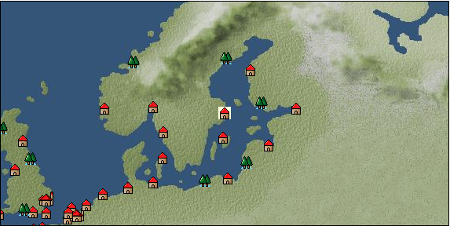

# Port: ストックホルム

import Tabs from '@theme/Tabs';
import TabItem from '@theme/TabItem';

## General Information

| Attribute | Details |
| :--- | :--- |
| **Port Name** | stockholm |
| **Port Type** | Headquarters |
| **Region** | northern europe |
| **Sea Area** | baltic sea |
| **Required Language** | Norse |
| **Coordinates** | （846，1979） |
| **Investment Reward** | [Norse mythology sculpture](Items/Recipe Book/item_1251.md) （必要投資額：1,500,000ドゥカード） |

### Available Facilities

| guild | intermediary | exchange | tool shop | workshop craftsman | Painter | sculptor | peddler |
| --- | --- | --- | --- | --- | --- | --- | --- |
|   | ○ | ○ | ○ | ○ | ○ |   | ○ |
| Shipyard Master | Lumbermaker | Sail-maker | weapon craftsman | master | TavernFemale | archive | salesperson |
| --- | --- | --- | --- | --- | --- | --- | --- |
| ○ | ○ |   | ○ | ○ | ○ |   | ○ |
| Shipwright | 銀行 | street worker | 王宮 | Trading post | church | suburbs | translator |
| --- | --- | --- | --- | --- | --- | --- | --- |
| ○ | ○ | ○ | ○ |   | ○ |   | ○ |

### Description
The city was founded by the Swedish Bilger Jarl in the mid-13th century. It consists of 14 islands connected by bridges. The land is rich in minerals NPC nation Headquarters of the Kingdom of Sweden Tavern Woman: Ingrid Cultural area: Scandinavia

<Tabs>
  <TabItem value="trade_goods_sales" label="Trade Goods Sales">

| item | group | purchase price | 同盟時 | remarks |
| --- | --- | --- | --- | --- |
| [Wormwood](Items/Trade Goods/TradeGoods-Medicine/item_62.md) | [Trading products (medical products)](Categories/category_6.md) | 327 | 292 |  |
| [heath](Items/Trade Goods/TradeGoods-Medicine/item_63.md) | [Trading products (medical products)](Categories/category_6.md) | 170 | 152 |  |
| [rye](Items/Trade Goods/TradeGoods-Foodstuffs/item_61.md) | [Trading items (food items)](Categories/category_3.md) | 35 | 32 |  |
| [flax](Items/Trade Goods/TradeGoods-Fibers/item_64.md) | [交易品（繊維）](Categories/category_1.md) | 191 | 168 |  |
| [scimitar](Items/Trade Goods/TradeGoods-Weapons/item_142.md) | [Trading Items (Arms)](Categories/category_16.md) | 990 | 868 |  |
| 要投資（必要投資額：240,000） |
| [fur](Items/Trade Goods/TradeGoods-Fibers/item_634.md) | [交易品（繊維）](Categories/category_1.md) | 1,293 | 1,138 |  |
| 要投資（必要投資額：180,000） |
| [leather](Items/Trade Goods/TradeGoods-Fibers/item_44.md) | [交易品（繊維）](Categories/category_1.md) | 424 | 372 |  |
| [sulfur](Items/Trade Goods/TradeGoods-Wares/item_66.md) | [交易品（工業品）](Categories/category_19.md) | 383 | 336 |  |
| [copper ore](Items/Trade Goods/TradeGoods-Minerals/item_65.md) | [Trading Items (Iron Stone)](Categories/category_7.md) | 789 | 692 |  |
| [luxury furniture](Items/Trade Goods/TradeGoods-Luxuries/item_1048.md) | [Trading goods (artificial goods)](Categories/category_13.md) | 2,760 | 2,461 |  |
| 要投資（必要投資額：400,000） |
  </TabItem>
  <TabItem value="sale_specialty" label="Sale (Specialty)">

| item | group | sale price | 同盟時 | remarks |
| --- | --- | --- | --- | --- |

#### [交易品（雑貨）](Categories/category_5.md)

| [old ink stick](Items/Trade Goods/TradeGoods-Misc/item_3921.md) | 交易品（雑貨） | 37,000 | (41,629) |  |

#### [Trading products (medical products)](Categories/category_6.md)

| [Nothing](Items/Trade Goods/TradeGoods-Medicine/item_1053.md) | Trading products (medical products) | 885 | (995) |  |

#### [Trading goods (hobby goods)](Categories/category_10.md)

| [black tea](Items/Trade Goods/TradeGoods-Sunddries/item_675.md) | Trading goods (hobby goods) | 2,780 | (3,127) |  |

#### [Trading Goods (Spices)](Categories/category_11.md)

| [jasmine](Items/Trade Goods/TradeGoods-Perfume/item_772.md) | Trading Goods (Spices) | 6,490 | (7,301) |  |
| [geranium](Items/Trade Goods/TradeGoods-Perfume/item_145.md) | Trading Goods (Spices) | 1,300 | (1,462) |  |
| [sandalwood](Items/Trade Goods/TradeGoods-Perfume/item_771.md) | Trading Goods (Spices) | 5,667 | (6,375) |  |

#### [Trading Goods (Spices)](Categories/category_12.md)

| [cardamom](Items/Trade Goods/TradeGoods-Spices/item_1431.md) | Trading Goods (Spices) | (4,097) | 4,780 |  |
| [pepper](Items/Trade Goods/TradeGoods-Spices/item_58.md) | Trading Goods (Spices) | (4,405) | 5,140 |  |

#### [Trading goods (artificial goods)](Categories/category_13.md)

| [glasswork](Items/Trade Goods/TradeGoods-Luxuries/item_60.md) | Trading goods (artificial goods) | (1,776) | 2,072 |  |
| [Tumbaga](Items/Trade Goods/TradeGoods-Luxuries/item_3028.md) | Trading goods (artificial goods) | (21,004) | 24,508 |  |

#### [交易品（美術品）](Categories/category_14.md)

| [oil painting](Items/Trade Goods/TradeGoods-Art/item_1088.md) | 交易品（美術品） | 2,630 | (2,959) |  |

#### [Trading Items (Gemstones)](Categories/category_15.md)

| [aventurine](Items/Trade Goods/TradeGoods-Gems/item_678.md) | Trading Items (Gemstones) | 6,110 | 6,510 |  |
| [opal](Items/Trade Goods/TradeGoods-Gems/item_2006.md) | Trading Items (Gemstones) | 7,818 | (8,796) |  |
| [cat's eye](Items/Trade Goods/TradeGoods-Gems/item_1047.md) | Trading Items (Gemstones) | 10,500 | 11,200 |  |
| [sapphire](Items/Trade Goods/TradeGoods-Gems/item_676.md) | Trading Items (Gemstones) | 12,800 | 13,500 |  |
| [diamond](Items/Trade Goods/TradeGoods-Gems/item_449.md) | Trading Items (Gemstones) | (7,912) | 9,232 |  |
| [pink diamond](Items/Trade Goods/TradeGoods-Gems/item_2874.md) | Trading Items (Gemstones) | 15,189 | (17,089) |  |

#### [Trading Items (Arms)](Categories/category_16.md)

| [crossbow](Items/Trade Goods/TradeGoods-Weapons/item_537.md) | Trading Items (Arms) | (1,352) | 1,577 |  |
| [damascus sword](Items/Trade Goods/TradeGoods-Weapons/item_903.md) | Trading Items (Arms) | 7,517 | (8,457) |  |

#### [交易品（工業品）](Categories/category_19.md)

| [rubber](Items/Trade Goods/TradeGoods-Wares/item_2819.md) | 交易品（工業品） | 1,712 | (1,926) |  |
| [Japanese paper](Items/Trade Goods/TradeGoods-Wares/item_3438.md) | 交易品（工業品） | 25,000 | (28,127) |  |
| [marble](Items/Trade Goods/TradeGoods-Wares/item_52.md) | 交易品（工業品） | (2,128) | 2,482 |  |
| [羊皮紙](Items/Trade Goods/TradeGoods-Wares/item_53.md) | 交易品（工業品） | 1,620 | 1,680 |  |

#### [交易品（織物）](Categories/category_20.md)

| [Awaiyo](Items/Trade Goods/TradeGoods-Fabrics/item_3002.md) | 交易品（織物） | (9,410) | 10,979 |  |
| [indian chintz](Items/Trade Goods/TradeGoods-Fabrics/item_159.md) | 交易品（織物） | 2,511 | (2,825) |  |
| [damask](Items/Trade Goods/TradeGoods-Fabrics/item_614.md) | 交易品（織物） | 6,643 | (7,474) |  |
| [turkish rug](Items/Trade Goods/TradeGoods-Fabrics/item_686.md) | 交易品（織物） | (7,678) | 8,958 |  |
| [flannel](Items/Trade Goods/TradeGoods-Fabrics/item_149.md) | 交易品（織物） | 1,267 | (1,425) |  |
| [velvet](Items/Trade Goods/TradeGoods-Fabrics/item_902.md) | 交易品（織物） | (4,442) | 5,183 |  |
  </TabItem>
  <TabItem value="sale_no_specialty" label="Sale (No Specialty)">

| item | group | sale price | 同盟時 | remarks |
| --- | --- | --- | --- | --- |

#### [交易品（繊維）](Categories/category_1.md)

| [raw silk](Items/Trade Goods/TradeGoods-Fibers/item_677.md) | 交易品（繊維） | 2,258 | (2,540) |  |
| [wool](Items/Trade Goods/TradeGoods-Fibers/item_5.md) | 交易品（繊維） | (422) | 492 |  |
| [numb](Items/Trade Goods/TradeGoods-Fibers/item_900.md) | 交易品（繊維） | 12 | (13) |  |

#### [Trading items (food items)](Categories/category_3.md)

| [cheese](Items/Trade Goods/TradeGoods-Foodstuffs/item_20.md) | Trading items (food items) | 426 | (479) |  |
| [Sugar beet](Items/Trade Goods/TradeGoods-Foodstuffs/item_1846.md) | Trading items (food items) | 212 | (238) |  |
| [mutton](Items/Trade Goods/TradeGoods-Foodstuffs/item_33.md) | Trading items (food items) | (467) | 544 |  |

#### [交易品（調味料）](Categories/category_4.md)

| [butter](Items/Trade Goods/TradeGoods-Seasonings/item_3.md) | 交易品（調味料） | (350) | 408 |  |
| [salt](Items/Trade Goods/TradeGoods-Seasonings/item_42.md) | 交易品（調味料） | 267 | (300) |  |

#### [交易品（雑貨）](Categories/category_5.md)

| [Western books](Items/Trade Goods/TradeGoods-Misc/item_293.md) | 交易品（雑貨） | 746 | (839) |  |

#### [Trading products (medical products)](Categories/category_6.md)

| [chamomile](Items/Trade Goods/TradeGoods-Medicine/item_292.md) | Trading products (medical products) | 448 | (504) |  |
| [belladonna](Items/Trade Goods/TradeGoods-Medicine/item_1056.md) | Trading products (medical products) | 548 | (616) |  |

#### [Trading Items (Iron Stone)](Categories/category_7.md)

| [chrome ore](Items/Trade Goods/TradeGoods-Minerals/item_5164.md) | Trading Items (Iron Stone) | 1,080 | (1,215) |  |
| [nickel ore](Items/Trade Goods/TradeGoods-Minerals/item_5163.md) | Trading Items (Iron Stone) | 1,260 | (1,417) |  |
| [bauxite](Items/Trade Goods/TradeGoods-Minerals/item_5160.md) | Trading Items (Iron Stone) | 1,030 | (1,158) |  |
| [cinnabar](Items/Trade Goods/TradeGoods-Minerals/item_154.md) | Trading Items (Iron Stone) | 874 | (983) |  |
| [lead ore](Items/Trade Goods/TradeGoods-Minerals/item_21.md) | Trading Items (Iron Stone) | 477 | (536) |  |

#### [Trading products (precious metals)](Categories/category_8.md)

| [gold](Items/Trade Goods/TradeGoods-Metals/item_659.md) | Trading products (precious metals) | (8,570) | 10,000 |  |
| [silver](Items/Trade Goods/TradeGoods-Metals/item_136.md) | Trading products (precious metals) | 2,810 | (3,161) |  |

#### [交易品（酒類）](Categories/category_9.md)

| [aquavit](Items/Trade Goods/TradeGoods-Alcohol/item_572.md) | 交易品（酒類） | 585 | 585 |  |
| [whiskey](Items/Trade Goods/TradeGoods-Alcohol/item_1.md) | 交易品（酒類） | 722 | (812) |  |
| [vodka](Items/Trade Goods/TradeGoods-Alcohol/item_579.md) | 交易品（酒類） | 615 | (691) |  |
| [gin](Items/Trade Goods/TradeGoods-Alcohol/item_291.md) | 交易品（酒類） | 700 | (787) |  |
| [Beer](Items/Trade Goods/TradeGoods-Alcohol/item_2.md) | 交易品（酒類） | 302 | 327 |  |

#### [Trading Goods (Spices)](Categories/category_11.md)

| [lily of the valley](Items/Trade Goods/TradeGoods-Perfume/item_358.md) | Trading Goods (Spices) | 833 | (937) |  |

#### [Trading Goods (Spices)](Categories/category_12.md)

| [cumin](Items/Trade Goods/TradeGoods-Spices/item_156.md) | Trading Goods (Spices) | (1,619) | 1,888 |  |
| [mint](Items/Trade Goods/TradeGoods-Spices/item_816.md) | Trading Goods (Spices) | 204 | (229) |  |

#### [Trading goods (artificial goods)](Categories/category_13.md)

| [dragonfly ball](Items/Trade Goods/TradeGoods-Luxuries/item_294.md) | Trading goods (artificial goods) | 1,220 | (1,372) |  |
| [lapidary work](Items/Trade Goods/TradeGoods-Luxuries/item_153.md) | Trading goods (artificial goods) | 3,900 | (4,387) |  |
| [silversmith](Items/Trade Goods/TradeGoods-Luxuries/item_619.md) | Trading goods (artificial goods) | 3,590 | (4,039) |  |

#### [交易品（美術品）](Categories/category_14.md)

| [古美術品](Items/Trade Goods/TradeGoods-Art/item_51.md) | 交易品（美術品） | (4,561) | 5,322 |  |

#### [Trading Items (Gemstones)](Categories/category_15.md)

| [emerald](Items/Trade Goods/TradeGoods-Gems/item_777.md) | Trading Items (Gemstones) | 8,500 | (9,563) |  |
| [coral](Items/Trade Goods/TradeGoods-Gems/item_141.md) | Trading Items (Gemstones) | 4,657 | (5,239) |  |
| [pearl](Items/Trade Goods/TradeGoods-Gems/item_769.md) | Trading Items (Gemstones) | 11,563 | 12,528 |  |
| [ivory](Items/Trade Goods/TradeGoods-Gems/item_699.md) | Trading Items (Gemstones) | 4,120 | 4,330 |  |

#### [Trading Items (Arms)](Categories/category_16.md)

| [dagger](Items/Trade Goods/TradeGoods-Weapons/item_143.md) | Trading Items (Arms) | 1,008 | (1,134) |  |
| [western armor](Items/Trade Goods/TradeGoods-Weapons/item_6.md) | Trading Items (Arms) | 2,867 | 2,915 |  |

#### [Trading Items (Firearms)](Categories/category_17.md)

| [大砲](Items/Trade Goods/TradeGoods-Firearms/item_4.md) | Trading Items (Firearms) | (3,188) | 3,719 |  |

#### [Trading Goods (Livestock)](Categories/category_18.md)

| [alpaca](Items/Trade Goods/TradeGoods-Livestock/item_2995.md) | Trading Goods (Livestock) | (1,233) | 1,438 |  |

#### [交易品（工業品）](Categories/category_19.md)

| [wood](Items/Trade Goods/TradeGoods-Wares/item_277.md) | 交易品（工業品） | 903 | (1,015) |  |
| [brass](Items/Trade Goods/TradeGoods-Wares/item_624.md) | 交易品（工業品） | 1,029 | (1,157) |  |
| [Stone](Items/Trade Goods/TradeGoods-Wares/item_276.md) | 交易品（工業品） | 674 | (758) |  |
| [oil](Items/Trade Goods/TradeGoods-Wares/item_613.md) | 交易品（工業品） | 670 | (753) |  |
| [paper](Items/Trade Goods/TradeGoods-Wares/item_625.md) | 交易品（工業品） | (313) | 365 |  |
| [iron material](Items/Trade Goods/TradeGoods-Wares/item_268.md) | 交易品（工業品） | (1,029) | 1,200 |  |
| [青銅](Items/Trade Goods/TradeGoods-Wares/item_7.md) | 交易品（工業品） | (973) | 1,135 |  |

#### [交易品（織物）](Categories/category_20.md)

| [dutch calico](Items/Trade Goods/TradeGoods-Fabrics/item_1435.md) | 交易品（織物） | 1,028 | (1,156) |  |
| [linen fabric](Items/Trade Goods/TradeGoods-Fabrics/item_135.md) | 交易品（織物） | 497 | (559) |  |
  </TabItem>
  <TabItem value="guild_&_others" label="Guild & Others">

| item | group | Sales price | Handling NPC | remarks |
| --- | --- | --- | --- | --- |

#### others

| [Swedish folk clothing sewing method](Items/Recipe Book/item_4522.md) | [recipe book](Categories/category_22.md) | Fixed recipe |  |  |
| 時代限定（17世紀第1期、17世紀第2期、17世紀第3期、17世紀第4期、17世紀第5期、18世紀第1期） |
| [Folklore alchemy part 3](Items/Recipe Book/item_2150.md) | [recipe book](Categories/category_22.md) | Fixed recipe |  |  |
| Owned by Alchemist Apprentice |
  </TabItem>
  <TabItem value="toolman" label="Toolman">

| item | group | Sales price | Handling NPC | remarks |
| --- | --- | --- | --- | --- |

#### [recipe book](Categories/category_22.md)

| [Spear training/application](Items/Recipe Book/item_1141.md) | recipe book | 50,000 | tool shop owner |  |
| 要投資（必要投資額：120,000） |
| [Decorative armor casting method](Items/Recipe Book/item_4503.md) | recipe book | Fixed recipe | tool shop owner |  |
| 時代限定（17世紀第1期、17世紀第2期、17世紀第3期、17世紀第4期、17世紀第5期） 17世紀第2期 |

#### [Equipment (body)](Categories/category_24.md)

| [apron dress](Items/Equipment/Equipment-Body/item_620.md) | Equipment (body) | 5,000 | tool shop owner |  |
| [Swedish folk clothes♀](Items/Equipment/Equipment-Body/item_4437.md) | Equipment (body) | 76,000 | tool shop owner |  |
| 時代限定（17世紀第1期、17世紀第2期、17世紀第3期、17世紀第4期、17世紀第5期、18世紀第1期） 17世紀第2期 |
| [Swedish folk clothes♂](Items/Equipment/Equipment-Body/item_4438.md) | Equipment (body) | 76,000 | tool shop owner |  |
| 時代限定（17世紀第1期、17世紀第2期、17世紀第3期、17世紀第4期、17世紀第5期、18世紀第1期） |
| [decorative cuirass](Items/Equipment/Equipment-Body/item_4396.md) | Equipment (body) | 164,000 | tool shop owner |  |
| 時代限定（17世紀第1期、17世紀第2期、18世紀第1期） 17世紀第2期 |

#### [Equipment (belongings)](Categories/category_27.md)

| [snap lock shooting gun](Items/Equipment/Equipment-Weapon/item_267.md) | Equipment (belongings) | 8,000 | tool shop owner |  |
| [maple violin](Items/Equipment/Equipment-Weapon/item_1485.md) | Equipment (belongings) | 17,000 | tool shop owner |  |
| 要投資（必要投資額：120,000） |

#### [Consumables (land battle/deck battle)](Categories/category_29.md)

| [poison](Items/Consumables/Consumables-Landbattle/item_269.md) | Consumables (land battle/deck battle) | 250 | tool shop owner |  |
| [antidote](Items/Consumables/Consumables-Landbattle/item_270.md) | Consumables (land battle/deck battle) | 100 | tool shop owner |  |

#### [Consumables (naval/hand-to-hand combat)](Categories/category_30.md)

| [Artillery knowledge](Items/Consumables/Consumables-navalhand-to-hand combat/item_759.md) | Consumables (naval/hand-to-hand combat) | 5,000 | tool shop owner |  |
| 要投資（必要投資額：180,000） |

#### [Consumables (skill activation)](Categories/category_31.md)

| [card](Items/Consumables/Consumables-Skill/item_855.md) | Consumables (skill activation) | 500 | tool shop owner |  |
| [Card (RANK2)](Items/Consumables/Consumables-Skill/item_1652.md) | Consumables (skill activation) | 1,000 | tool shop owner |  |
| [fishing gear](Items/Consumables/Consumables-Skill/item_79.md) | Consumables (skill activation) | 2,500 | tool shop owner |  |

#### [Consumables (other)](Categories/category_44.md)

| [Special dye #4](Items/Consumables/Consumables-Other/item_621.md) | Consumables (other) | 5,000 | tool shop owner |  |
  </TabItem>
  <TabItem value="kobo_craftsmen" label="Craftsman">

| item | group | Sales price | Handling NPC | remarks |
| --- | --- | --- | --- | --- |

#### [Consumables (condition recovery)](Categories/category_21.md)

| [Nostalgic carillon bell](Items/Consumables/Consumables-Recovery/item_245.md) | Consumables (condition recovery) | 200 | workshop craftsman |  |
| [Ship song sheet music](Items/Consumables/Consumables-Recovery/item_247.md) | Consumables (condition recovery) | 200 | workshop craftsman |  |

#### [recipe book](Categories/category_22.md)

| [Marine life sculpture](Items/Recipe Book/item_273.md) | recipe book | 10,000 | workshop craftsman |  |
| [Special cannon casting method](Items/Recipe Book/item_1166.md) | recipe book | 200,000 | workshop craftsman |  |
| 要投資（必要投資額：320,000） |
| [Shipwright Introduction/Sewing Book](Items/Recipe Book/item_74.md) | recipe book | Fixed recipe | workshop craftsman |  |

#### [Consumables (skill activation)](Categories/category_31.md)

| [四分儀](Items/Consumables/Consumables-Skill/item_346.md) | Consumables (skill activation) | 500 | workshop craftsman |  |

#### [Consumables (other)](Categories/category_44.md)

| [Special sail paint 4](Items/Consumables/Consumables-Other/item_1847.md) | Consumables (other) | 1,500 | workshop craftsman |  |
  </TabItem>
  <TabItem value="Painter" label="Painter">

| item | group | Sales price | Handling NPC | remarks |
| --- | --- | --- | --- | --- |

#### [Ship parts (emblem)](Categories/category_36.md)

| [admiral](Items/Ship Parts/Shipparts-Crests/item_548.md) | Ship parts (emblem) | 5,000 | Painter |  |
| [anchor](Items/Ship Parts/Shipparts-Crests/item_549.md) | Ship parts (emblem) | 5,000 | Painter |  |
| [circle cross](Items/Ship Parts/Shipparts-Crests/item_544.md) | Ship parts (emblem) | 5,000 | Painter |  |
| [shellfish](Items/Ship Parts/Shipparts-Crests/item_546.md) | Ship parts (emblem) | 5,000 | Painter |  |
| [Delphine](Items/Ship Parts/Shipparts-Crests/item_542.md) | Ship parts (emblem) | 5,000 | Painter |  |
| [butterfly](Items/Ship Parts/Shipparts-Crests/item_547.md) | Ship parts (emblem) | 5,000 | Painter |  |
| [fisherman](Items/Ship Parts/Shipparts-Crests/item_545.md) | Ship parts (emblem) | 5,000 | Painter |  |
| [Rose (coat of arms)](Items/Ship Parts/Shipparts-Crests/item_622.md) | Ship parts (emblem) | 5,000 | Painter |  |
  </TabItem>
  <TabItem value="peddler" label="peddler">

| item | group | Sales price | Handling NPC | remarks |
| --- | --- | --- | --- | --- |

#### [Consumables (condition recovery)](Categories/category_21.md)

| [spare sail](Items/Consumables/Consumables-Recovery/item_242.md) | Consumables (condition recovery) |  | peddler |  |
| [reserve rudder](Items/Consumables/Consumables-Recovery/item_243.md) | Consumables (condition recovery) |  | peddler |  |
| [sleep hammock](Items/Consumables/Consumables-Recovery/item_73.md) | Consumables (condition recovery) |  | peddler |  |
| [rope of punishment](Items/Consumables/Consumables-Recovery/item_71.md) | Consumables (condition recovery) |  | peddler |  |
| [cotton earplugs](Items/Consumables/Consumables-Recovery/item_85.md) | Consumables (condition recovery) |  | peddler |  |

#### [Consumables (naval/hand-to-hand combat)](Categories/category_30.md)

| [ceasefire agreement](Items/Consumables/Consumables-navalhand-to-hand combat/item_129.md) | Consumables (naval/hand-to-hand combat) |  | peddler |  |
| [evacuation bell](Items/Consumables/Consumables-navalhand-to-hand combat/item_919.md) | Consumables (naval/hand-to-hand combat) |  | peddler |  |
| [flag of calm](Items/Consumables/Consumables-navalhand-to-hand combat/item_84.md) | Consumables (naval/hand-to-hand combat) |  | peddler |  |
  </TabItem>
  <TabItem value="salesperson" label="salesperson">

| item | group | Sales price | Handling NPC | remarks |
| --- | --- | --- | --- | --- |

#### [Consumables (cooking)](Categories/category_32.md)

| [boiled egg](Items/Consumables/Consumables-Cooking/item_1034.md) | Consumables (cooking) |  | salesperson |  |
| [apple pie](Items/Consumables/Consumables-Cooking/item_1019.md) | Consumables (cooking) |  | salesperson |  |
| [Steamed flounder in wine](Items/Consumables/Consumables-Cooking/item_641.md) | Consumables (cooking) |  | salesperson |  |
| [Sauteed pork with apple](Items/Consumables/Consumables-Cooking/item_910.md) | Consumables (cooking) |  | salesperson |  |
| [rye bread](Items/Consumables/Consumables-Cooking/item_1065.md) | Consumables (cooking) |  | salesperson |  |
| [Rye bread with raisins](Items/Consumables/Consumables-Cooking/item_1069.md) | Consumables (cooking) |  | salesperson |  |
| [chicken roast](Items/Consumables/Consumables-Cooking/item_1082.md) | Consumables (cooking) |  | salesperson |  |
  </TabItem>
  <TabItem value="translator" label="translator">

| item | group | Sales price | Handling NPC | remarks |
| --- | --- | --- | --- | --- |

#### [Consumables (skill activation)](Categories/category_31.md)

| [Germanic languages ​​translation notes](Items/Consumables/Consumables-Skill/item_2467.md) | Consumables (skill activation) |  | translator |  |
| [Eastern European languages ​​translation notes](Items/Consumables/Consumables-Skill/item_2440.md) | Consumables (skill activation) |  | translator |  |
  </TabItem>
  <TabItem value="shipyard" label="Shipyard">

### Shipyard Master

| item | group | Sales price | Handling NPC | remarks |
| --- | --- | --- | --- | --- |

#### [Boat](Categories/category_43.md)

| [2 mast cogs](Items/Ships/item_265.md) | Boat | 96,000 | Shipyard Master |  |
| [warwick cog](Items/Ships/item_336.md) | Boat | 230,000 | Shipyard Master |  |
| [carrack](Items/Ships/item_236.md) | Boat | 720,000 | Shipyard Master |  |
| [Hansa Cog](Items/Ships/item_263.md) | Boat | 24,000 | Shipyard Master |  |
| [Varsha](Items/Ships/item_201.md) | Boat | 2,000 | Shipyard Master |  |
| [pinnace](Items/Ships/item_767.md) | Boat | 950,000 | Shipyard Master |  |
| [flute](Items/Ships/item_569.md) | Boat | 410,000 | Shipyard Master |  |
| [hooker](Items/Ships/item_335.md) | Boat | 220,000 | Shipyard Master |  |
| [commercial carrack](Items/Ships/item_239.md) | Boat | 728,000 | Shipyard Master |  |
| [commercial pinnace](Items/Ships/item_768.md) | Boat | 960,000 | Shipyard Master |  |
| [commercial flute](Items/Ships/item_570.md) | Boat | 420,000 | Shipyard Master |  |
| [commercial large carrack](Items/Ships/item_409.md) | Boat | 1,840,000 | Shipyard Master |  |
| [commercial armed carrack](Items/Ships/item_1502.md) | Boat | 4,000,000 | Shipyard Master |  |
| [large carrack](Items/Ships/item_408.md) | Boat | 1,800,000 | Shipyard Master |  |
| [small carrack](Items/Ships/item_219.md) | Boat | 480,000 | Shipyard Master |  |
| [small caravel](Items/Ships/item_206.md) | Boat | 92,000 | Shipyard Master |  |
| [combat carrack](Items/Ships/item_238.md) | Boat | 720,000 | Shipyard Master |  |
| [combat pinnace](Items/Ships/item_766.md) | Boat | 950,000 | Shipyard Master |  |
| [combat flute](Items/Ships/item_568.md) | Boat | 400,000 | Shipyard Master |  |
| [Large exploration carrack](Items/Ships/item_1503.md) | Boat | 3,360,000 | Shipyard Master |  |
| [armed cog](Items/Ships/item_264.md) | Boat | 25,000 | Shipyard Master |  |
| [light carrack](Items/Ships/item_218.md) | Boat | 478,000 | Shipyard Master |  |
| [light caravelle](Items/Ships/item_207.md) | Boat | 92,000 | Shipyard Master |  |
| [transport carrack](Items/Ships/item_222.md) | Boat | 488,000 | Shipyard Master |  |

### Lumbermaker

| item | group | Sales price | Handling NPC | remarks |
| --- | --- | --- | --- | --- |

#### [Ship parts (additional armor)](Categories/category_35.md)

| [elm board](Items/Ship Parts/Shipparts-Plates/item_328.md) | Ship parts (additional armor) | 13,000 | Lumbermaker |  |
| [Simple iron plate](Items/Ship Parts/Shipparts-Plates/item_1389.md) | Ship parts (additional armor) | 80,000 | Lumbermaker |  |
| [簡易銅板](Items/Ship Parts/Shipparts-Plates/item_617.md) | Ship parts (additional armor) | 41,000 | Lumbermaker |  |
| [lightweight oak board](Items/Ship Parts/Shipparts-Plates/item_533.md) | Ship parts (additional armor) | 38,000 | Lumbermaker |  |
| [lightweight cedar board](Items/Ship Parts/Shipparts-Plates/item_325.md) | Ship parts (additional armor) | 880 | Lumbermaker |  |
| [lightweight beach board](Items/Ship Parts/Shipparts-Plates/item_532.md) | Ship parts (additional armor) | 7,000 | Lumbermaker |  |
| [Lightweight red pine board](Items/Ship Parts/Shipparts-Plates/item_531.md) | Ship parts (additional armor) | 3,000 | Lumbermaker |  |
  </TabItem>
  <TabItem value="weapon craftsman" label="weapon craftsman">

| item | group | Sales price | Handling NPC | remarks |
| --- | --- | --- | --- | --- |

#### [recipe book](Categories/category_22.md)

| [Book of Shipbuilding Materials and Casting Volume 2](Items/Recipe Book/item_1723.md) | recipe book | Fixed recipe | weapon craftsman |  |

#### [Ship parts (special weapons)](Categories/category_37.md)

| [small corvus](Items/Ship Parts/Shipparts-Special-Weapons/item_193.md) | Ship parts (special weapons) | 3,000 | weapon craftsman |  |
| [small ram](Items/Ship Parts/Shipparts-Special-Weapons/item_190.md) | Ship parts (special weapons) | 1,000 | weapon craftsman |  |
| [small poop](Items/Ship Parts/Shipparts-Special-Weapons/item_198.md) | Ship parts (special weapons) | 39,000 | weapon craftsman |  |
| [small ship forecastle](Items/Ship Parts/Shipparts-Special-Weapons/item_195.md) | Ship parts (special weapons) | 5,000 | weapon craftsman |  |
| [forecastle](Items/Ship Parts/Shipparts-Special-Weapons/item_241.md) | Ship parts (special weapons) | 16,000 | weapon craftsman |  |
| [additional spanker](Items/Ship Parts/Shipparts-Special-Weapons/item_200.md) | Ship parts (special weapons) | 55,000 | weapon craftsman |  |
| [additional split](Items/Ship Parts/Shipparts-Special-Weapons/item_197.md) | Ship parts (special weapons) | 44,000 | weapon craftsman |  |
| [additional small spanker](Items/Ship Parts/Shipparts-Special-Weapons/item_199.md) | Ship parts (special weapons) | 3,500 | weapon craftsman |  |
| [additional small split](Items/Ship Parts/Shipparts-Special-Weapons/item_196.md) | Ship parts (special weapons) | 2,000 | weapon craftsman |  |

#### [Ship parts (cannon)](Categories/category_38.md)

| [4 amfer guns](Items/Ship Parts/Shipparts-Cannons/item_391.md) | Ship parts (cannon) | 26,600 | weapon craftsman |  |
| [6 Amfer cannons](Items/Ship Parts/Shipparts-Cannons/item_392.md) | Ship parts (cannon) | 81,000 | weapon craftsman |  |
| [4 Caprice guns](Items/Ship Parts/Shipparts-Cannons/item_395.md) | Ship parts (cannon) | 18,200 | weapon craftsman |  |
| [6 Caprice guns](Items/Ship Parts/Shipparts-Cannons/item_396.md) | Ship parts (cannon) | 55,500 | weapon craftsman |  |
| [8 Caprice guns](Items/Ship Parts/Shipparts-Cannons/item_397.md) | Ship parts (cannon) | 103,600 | weapon craftsman |  |
| [10 culverines](Items/Ship Parts/Shipparts-Cannons/item_375.md) | Ship parts (cannon) | 136,300 | weapon craftsman |  |
| [4 culverine guns](Items/Ship Parts/Shipparts-Cannons/item_372.md) | Ship parts (cannon) | 21,800 | weapon craftsman |  |
| [6 culverine guns](Items/Ship Parts/Shipparts-Cannons/item_373.md) | Ship parts (cannon) | 49,100 | weapon craftsman |  |
| [8 culverine guns](Items/Ship Parts/Shipparts-Cannons/item_374.md) | Ship parts (cannon) | 87,300 | weapon craftsman |  |
| [10 Saker cannons](Items/Ship Parts/Shipparts-Cannons/item_187.md) | Ship parts (cannon) | 79,000 | weapon craftsman |  |
| [2 saker cannons](Items/Ship Parts/Shipparts-Cannons/item_183.md) | Ship parts (cannon) | 3,200 | weapon craftsman |  |
| [4 saker cannons](Items/Ship Parts/Shipparts-Cannons/item_184.md) | Ship parts (cannon) | 12,600 | weapon craftsman |  |
| [6 Saker cannons](Items/Ship Parts/Shipparts-Cannons/item_185.md) | Ship parts (cannon) | 28,400 | weapon craftsman |  |
| [8 Saker cannons](Items/Ship Parts/Shipparts-Cannons/item_186.md) | Ship parts (cannon) | 50,500 | weapon craftsman |  |
| [10 demi culverin cannons](Items/Ship Parts/Shipparts-Cannons/item_370.md) | Ship parts (cannon) | 10,100 | weapon craftsman |  |
| [12 demi culverin cannons](Items/Ship Parts/Shipparts-Cannons/item_371.md) | Ship parts (cannon) | 145,400 | weapon craftsman |  |
| [2 demi culverin cannons](Items/Ship Parts/Shipparts-Cannons/item_188.md) | Ship parts (cannon) | 4,000 | weapon craftsman |  |
| [4 demi culverin cannons](Items/Ship Parts/Shipparts-Cannons/item_189.md) | Ship parts (cannon) | 16,200 | weapon craftsman |  |
| [6 demi culverin cannons](Items/Ship Parts/Shipparts-Cannons/item_368.md) | Ship parts (cannon) | 36,400 | weapon craftsman |  |
| [8 demi culverin cannons](Items/Ship Parts/Shipparts-Cannons/item_369.md) | Ship parts (cannon) | 64,600 | weapon craftsman |  |
| [4 Draconis cannons](Items/Ship Parts/Shipparts-Cannons/item_386.md) | Ship parts (cannon) | 18,200 | weapon craftsman |  |
| [6 Draconis cannons](Items/Ship Parts/Shipparts-Cannons/item_387.md) | Ship parts (cannon) | 55,500 | weapon craftsman |  |
| [8 Draconis cannons](Items/Ship Parts/Shipparts-Cannons/item_390.md) | Ship parts (cannon) | 103,600 | weapon craftsman |  |
| [4 pyro cannons](Items/Ship Parts/Shipparts-Cannons/item_384.md) | Ship parts (cannon) | 12,500 | weapon craftsman |  |
| [6 pyro cannons](Items/Ship Parts/Shipparts-Cannons/item_385.md) | Ship parts (cannon) | 38,000 | weapon craftsman |  |
| [2 falcon guns](Items/Ship Parts/Shipparts-Cannons/item_174.md) | Ship parts (cannon) | 500 | weapon craftsman |  |
| [4 falcon guns](Items/Ship Parts/Shipparts-Cannons/item_175.md) | Ship parts (cannon) | 2,000 | weapon craftsman |  |
| [6 falcon guns](Items/Ship Parts/Shipparts-Cannons/item_176.md) | Ship parts (cannon) | 4,600 | weapon craftsman |  |
| [8 falcon guns](Items/Ship Parts/Shipparts-Cannons/item_177.md) | Ship parts (cannon) | 8,100 | weapon craftsman |  |
| [4 frango guns](Items/Ship Parts/Shipparts-Cannons/item_393.md) | Ship parts (cannon) | 12,500 | weapon craftsman |  |
| [6 frango guns](Items/Ship Parts/Shipparts-Cannons/item_394.md) | Ship parts (cannon) | 38,000 | weapon craftsman |  |
| [2 Heutzer guns](Items/Ship Parts/Shipparts-Cannons/item_633.md) | Ship parts (cannon) | 9,100 | weapon craftsman |  |
| [4 Heitzer guns](Items/Ship Parts/Shipparts-Cannons/item_1390.md) | Ship parts (cannon) | 36,300 | weapon craftsman |  |
| [6 Heutzer guns](Items/Ship Parts/Shipparts-Cannons/item_945.md) | Ship parts (cannon) | 81,700 | weapon craftsman |  |
| [10 minion cannons](Items/Ship Parts/Shipparts-Cannons/item_182.md) | Ship parts (cannon) | 34,800 | weapon craftsman |  |
| [2 minion cannons](Items/Ship Parts/Shipparts-Cannons/item_178.md) | Ship parts (cannon) | 1,400 | weapon craftsman |  |
| [4 minion cannons](Items/Ship Parts/Shipparts-Cannons/item_179.md) | Ship parts (cannon) | 5,600 | weapon craftsman |  |
| [6 minion cannons](Items/Ship Parts/Shipparts-Cannons/item_180.md) | Ship parts (cannon) | 12,400 | weapon craftsman |  |
| [8 minion cannons](Items/Ship Parts/Shipparts-Cannons/item_181.md) | Ship parts (cannon) | 22,400 | weapon craftsman |  |
| [4 Meteora cannons](Items/Ship Parts/Shipparts-Cannons/item_398.md) | Ship parts (cannon) | 26,600 | weapon craftsman |  |
| [6 Meteora cannons](Items/Ship Parts/Shipparts-Cannons/item_399.md) | Ship parts (cannon) | 81,000 | weapon craftsman |  |

#### [shipbuilding materials](Categories/category_47.md)

| [改良中型砲門](Items/Shipbuilding FS Material/item_1724.md) | shipbuilding materials | Fixed recipe | weapon craftsman |  |
  </TabItem>
  <TabItem value="Tavern Master" label="Tavern Master">

| item | group | Sales price | Handling NPC | remarks |
| --- | --- | --- | --- | --- |

#### [recipe book](Categories/category_22.md)

| [Swedish home cooking](Items/Recipe Book/item_4505.md) | recipe book | Fixed recipe | Tavern Master |  |
  </TabItem>
</Tabs>