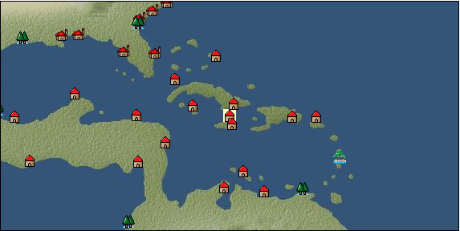

# Port: Jamaica

import Tabs from '@theme/Tabs';
import TabItem from '@theme/TabItem';

## General Information

| Attribute | Details |
| :--- | :--- |
| **Port Name** | Jamaica |
| **Port Type** | port of alliance |
| **Region** | Caribbean/Central America |
| **Sea Area** | Off the coast of the Antilles |
| **Required Language** | mayan languages |
| **Coordinates** | （13171，4034） |
| **Investment Reward** | [Carving techniques of caribbean divine beasts](docs/Items/RecipeBooks/item_977.md) （必要投資額：1,200,000ドゥカード） |

### Available Facilities

| guild | intermediary | exchange | tool shop | workshop craftsman | Painter | sculptor | peddler |
| --- | --- | --- | --- | --- | --- | --- | --- |
|   |   | ○ | ○ | ○ |   |   |   |
| Shipyard Master | Lumbermaker | Sail-maker | weapon craftsman | master | TavernFemale | archive | salesperson |
| --- | --- | --- | --- | --- | --- | --- | --- |
|   |   |   |   | ○ |   |   |   |
| Shipwright | 銀行 | street worker | 王宮 | Trading post | church | suburbs | translator |
| --- | --- | --- | --- | --- | --- | --- | --- |
| ○ | ○ | ○ |   |   |   |   |   |

### Description
A town on the island of Jamaica in the southern Caribbean. As the area is generally mountainous, coffee cultivation, which is suitable for high mountains, is popular. *Spanish is also spoken Cultural area: Caribbean

<Tabs>
  <TabItem value="trade_goods_sales" label="Trade Goods Sales">

| Item | Group | Purchase Price | Allied Price | Remarks |
| --- | --- | --- | --- | --- |
| [Agate](docs/Items/TradeGoods/TradeGoods-Gems/item_107.md) | [Trading Items (Gemstones)](docs/Categories/category_15.md) | 1,992 | 1,746 |  |
| [coffee](docs/Items/TradeGoods/TradeGoods-Sunddries/item_445.md) | [Trading goods (hobby goods)](docs/Categories/category_10.md) | 429 | 376 |  |
| [sugar cane](docs/Items/TradeGoods/TradeGoods-Foodstuffs/item_93.md) | [Trading items (food items)](docs/Categories/category_3.md) | 219 | 192 |  |
| [potato](docs/Items/TradeGoods/TradeGoods-Foodstuffs/item_106.md) | [Trading items (food items)](docs/Categories/category_3.md) | 133 | 116 |  |
| [ginger](docs/Items/TradeGoods/TradeGoods-Spices/item_112.md) | [Trading Goods (Spices)](docs/Categories/category_12.md) | 260 | 228 |  |
| [tobacco](docs/Items/TradeGoods/TradeGoods-Sunddries/item_109.md) | [Trading goods (hobby goods)](docs/Categories/category_10.md) | 510 | 448 |  |
| [tequila](docs/Items/TradeGoods/TradeGoods-Alcohol/item_108.md) | [交易品（酒類）](docs/Categories/category_9.md) | 1,130 | 990 |  |
| [rum](docs/Items/TradeGoods/TradeGoods-Alcohol/item_139.md) | [交易品（酒類）](docs/Categories/category_9.md) | 475 | 416 |  |
| 要投資（必要投資額：120,000） |
| [gold dust](docs/Items/TradeGoods/TradeGoods-Metals/item_111.md) | [Trading products (precious metals)](docs/Categories/category_8.md) | (3,163) | 2,768 |  |
| [貝紫](docs/Items/TradeGoods/TradeGoods-Dye/item_110.md) | [Trading Goods (Dye)](docs/Categories/category_2.md) | 4,332 | 3,800 |  |
  </TabItem>
  <TabItem value="sale_specialty" label="Sale (Specialty)">

| Item | Group | sale price | Allied Price | Remarks |
| --- | --- | --- | --- | --- |

#### [Trading Goods (Dye)](docs/Categories/category_2.md)

| [ward](docs/Items/TradeGoods/TradeGoods-Dye/item_57.md) | Trading Goods (Dye) | (1,991) | 2,323 |  |

#### [交易品（酒類）](docs/Categories/category_9.md)

| [aquavit](docs/Items/TradeGoods/TradeGoods-Alcohol/item_572.md) | 交易品（酒類） | [Edit Sale Price](docs/Ports/port_32.md) |  |
| [sherry](docs/Items/TradeGoods/TradeGoods-Alcohol/item_844.md) | 交易品（酒類） | 719 | (808) |  |
| [fruit brandy](docs/Items/TradeGoods/TradeGoods-Alcohol/item_1440.md) | 交易品（酒類） | (1,072) | 1,250 |  |

#### [Trading goods (hobby goods)](docs/Categories/category_10.md)

| [dried apple](docs/Items/TradeGoods/TradeGoods-Sunddries/item_19.md) | Trading goods (hobby goods) | (613) | 715 |  |

#### [Trading Goods (Spices)](docs/Categories/category_12.md)

| [saffron](docs/Items/TradeGoods/TradeGoods-Spices/item_845.md) | Trading Goods (Spices) | (3,825) | 4,463 |  |

#### [Trading goods (artificial goods)](docs/Categories/category_13.md)

| [glasswork](docs/Items/TradeGoods/TradeGoods-Luxuries/item_60.md) | Trading goods (artificial goods) | 2,802 | 3,237 |  |

#### [Trading Items (Arms)](docs/Categories/category_16.md)

| [damascus sword](docs/Items/TradeGoods/TradeGoods-Weapons/item_903.md) | Trading Items (Arms) | 7,128 | (8,019) |  |

#### [Trading Items (Firearms)](docs/Categories/category_17.md)

| [musket gun](docs/Items/TradeGoods/TradeGoods-Firearms/item_584.md) | Trading Items (Firearms) | (4,877) | 5,690 |  |

#### [交易品（織物）](docs/Categories/category_20.md)

| [dutch calico](docs/Items/TradeGoods/TradeGoods-Fabrics/item_1435.md) | 交易品（織物） | 2,330 | (2,621) |  |
| [gobelin weave](docs/Items/TradeGoods/TradeGoods-Fabrics/item_1276.md) | 交易品（織物） | 6,300 | (7,088) |  |
  </TabItem>
  <TabItem value="sale_no_specialty" label="Sale (No Specialty)">

| Item | Group | sale price | Allied Price | Remarks |
| --- | --- | --- | --- | --- |

#### [交易品（繊維）](docs/Categories/category_1.md)

| [Rush](docs/Items/TradeGoods/TradeGoods-Fibers/item_3675.md) | 交易品（繊維） | (30,053) | 35,067 |  |
| [wool](docs/Items/TradeGoods/TradeGoods-Fibers/item_5.md) | 交易品（繊維） | (403) | 470 |  |

#### [Trading items (food items)](docs/Categories/category_3.md)

| [pumpkin](docs/Items/TradeGoods/TradeGoods-Foodstuffs/item_137.md) | Trading items (food items) | 253 | (284) |  |
| [sweet potato](docs/Items/TradeGoods/TradeGoods-Foodstuffs/item_1931.md) | Trading items (food items) | (91) | 106 |  |
| [corn](docs/Items/TradeGoods/TradeGoods-Foodstuffs/item_138.md) | Trading items (food items) | 60 | (67) |  |
| [魚肉](docs/Items/TradeGoods/TradeGoods-Foodstuffs/item_10.md) | Trading items (food items) | (236) | 275 |  |

#### [交易品（調味料）](docs/Categories/category_4.md)

| [coconut vinegar](docs/Items/TradeGoods/TradeGoods-Seasonings/item_1988.md) | 交易品（調味料） | (428) | 499 |  |
| [peanut oil](docs/Items/TradeGoods/TradeGoods-Seasonings/item_596.md) | 交易品（調味料） | (415) | 484 |  |
| [wine vinegar](docs/Items/TradeGoods/TradeGoods-Seasonings/item_429.md) | 交易品（調味料） | (667) | 778 |  |
| [salt](docs/Items/TradeGoods/TradeGoods-Seasonings/item_42.md) | 交易品（調味料） | (234) | 272 |  |
| [sugar](docs/Items/TradeGoods/TradeGoods-Seasonings/item_94.md) | 交易品（調味料） | 988 | 1,039 |  |

#### [Trading products (medical products)](docs/Categories/category_6.md)

| [cinchona bark](docs/Items/TradeGoods/TradeGoods-Medicine/item_2121.md) | Trading products (medical products) | (701) | 817 |  |
| [belladonna](docs/Items/TradeGoods/TradeGoods-Medicine/item_1056.md) | Trading products (medical products) | (478) | 557 |  |

#### [Trading products (precious metals)](docs/Categories/category_8.md)

| [gold](docs/Items/TradeGoods/TradeGoods-Metals/item_659.md) | Trading products (precious metals) | (2,528) | 2,949 |  |
| [silver](docs/Items/TradeGoods/TradeGoods-Metals/item_136.md) | Trading products (precious metals) | (1,076) | 1,255 |  |

#### [交易品（酒類）](docs/Categories/category_9.md)

| [Beer](docs/Items/TradeGoods/TradeGoods-Alcohol/item_2.md) | 交易品（酒類） | 414 | 441 |  |
| [wine](docs/Items/TradeGoods/TradeGoods-Alcohol/item_11.md) | 交易品（酒類） | 629 | (707) |  |

#### [Trading goods (hobby goods)](docs/Categories/category_10.md)

| [cacao](docs/Items/TradeGoods/TradeGoods-Sunddries/item_140.md) | Trading goods (hobby goods) | 962 | 1,002 |  |
| ▲Special products from the same cultural area |
| [pineapple](docs/Items/TradeGoods/TradeGoods-Sunddries/item_867.md) | Trading goods (hobby goods) | 1,024 | (1,152) |  |
| [papaya](docs/Items/TradeGoods/TradeGoods-Sunddries/item_1948.md) | Trading goods (hobby goods) | (417) | 486 |  |
| [peanuts](docs/Items/TradeGoods/TradeGoods-Sunddries/item_134.md) | Trading goods (hobby goods) | (154) | 179 |  |

#### [Trading Goods (Spices)](docs/Categories/category_11.md)

| [Ryushu incense](docs/Items/TradeGoods/TradeGoods-Perfume/item_101.md) | Trading Goods (Spices) | (2,244) | 2,618 |  |

#### [Trading Goods (Spices)](docs/Categories/category_12.md)

| [allspice](docs/Items/TradeGoods/TradeGoods-Spices/item_1848.md) | Trading Goods (Spices) | (390) | 454 |  |
| [basil](docs/Items/TradeGoods/TradeGoods-Spices/item_126.md) | Trading Goods (Spices) | (234) | 272 |  |
| [fennel](docs/Items/TradeGoods/TradeGoods-Spices/item_1045.md) | Trading Goods (Spices) | (396) | 461 |  |

#### [Trading goods (artificial goods)](docs/Categories/category_13.md)

| [goldsmith](docs/Items/TradeGoods/TradeGoods-Luxuries/item_687.md) | Trading goods (artificial goods) | 3,331 | 3,424 |  |
| [silversmith](docs/Items/TradeGoods/TradeGoods-Luxuries/item_619.md) | Trading goods (artificial goods) | 2,552 | (2,871) |  |
| [ceramics](docs/Items/TradeGoods/TradeGoods-Luxuries/item_152.md) | Trading goods (artificial goods) | 1,545 | (1,738) |  |
| [luxury furniture](docs/Items/TradeGoods/TradeGoods-Luxuries/item_1048.md) | Trading goods (artificial goods) | (2,474) | 2,886 |  |

#### [交易品（美術品）](docs/Categories/category_14.md)

| [古美術品](docs/Items/TradeGoods/TradeGoods-Art/item_51.md) | 交易品（美術品） | 3,710 | (4,174) |  |
| [wooden statue](docs/Items/TradeGoods/TradeGoods-Art/item_95.md) | 交易品（美術品） | (842) | 982 |  |

#### [Trading Items (Gemstones)](docs/Categories/category_15.md)

| [emerald](docs/Items/TradeGoods/TradeGoods-Gems/item_777.md) | Trading Items (Gemstones) | 3,807 | (4,283) |  |
| [opal](docs/Items/TradeGoods/TradeGoods-Gems/item_2006.md) | Trading Items (Gemstones) | (2,368) | 2,763 |  |
| [crystal](docs/Items/TradeGoods/TradeGoods-Gems/item_893.md) | Trading Items (Gemstones) | (1,199) | 1,398 |  |
| [pearl](docs/Items/TradeGoods/TradeGoods-Gems/item_769.md) | Trading Items (Gemstones) | (4,885) | 5,699 |  |

#### [Trading Items (Firearms)](docs/Categories/category_17.md)

| [arquebus gun](docs/Items/TradeGoods/TradeGoods-Firearms/item_14.md) | Trading Items (Firearms) | 2,658 | (2,990) |  |
| [大砲](docs/Items/TradeGoods/TradeGoods-Firearms/item_4.md) | Trading Items (Firearms) | 5,167 | (5,813) |  |
| [gunpowder](docs/Items/TradeGoods/TradeGoods-Firearms/item_352.md) | Trading Items (Firearms) | (1,334) | 1,556 |  |
| [cannonball](docs/Items/TradeGoods/TradeGoods-Firearms/item_144.md) | Trading Items (Firearms) | (1,526) | 1,780 |  |

#### [Trading Goods (Livestock)](docs/Categories/category_18.md)

| [cow](docs/Items/TradeGoods/TradeGoods-Livestock/item_17.md) | Trading Goods (Livestock) | (298) | 347 |  |
| [rat](docs/Items/TradeGoods/TradeGoods-Livestock/item_2710.md) | Trading Goods (Livestock) | (18) | 20 |  |
| [pig](docs/Items/TradeGoods/TradeGoods-Livestock/item_37.md) | Trading Goods (Livestock) | (60) | 69 |  |

#### [交易品（工業品）](docs/Categories/category_19.md)

| [rubber](docs/Items/TradeGoods/TradeGoods-Wares/item_2819.md) | 交易品（工業品） | (726) | 846 |  |
| [wax](docs/Items/TradeGoods/TradeGoods-Wares/item_54.md) | 交易品（工業品） | 929 | (1,045) |  |
| [wood](docs/Items/TradeGoods/TradeGoods-Wares/item_277.md) | 交易品（工業品） | 812 | 831 |  |
| [Stone](docs/Items/TradeGoods/TradeGoods-Wares/item_276.md) | 交易品（工業品） | (736) | 858 |  |
| [iron material](docs/Items/TradeGoods/TradeGoods-Wares/item_268.md) | 交易品（工業品） | (676) | 788 |  |

#### [交易品（織物）](docs/Categories/category_20.md)

| [linen fabric](docs/Items/TradeGoods/TradeGoods-Fabrics/item_135.md) | 交易品（織物） | (322) | 375 |  |
  </TabItem>
  <TabItem value="guild_&_others" label="Guild & Others">

| Item | Group | Sales price | Handling NPC | Remarks |
| --- | --- | --- | --- | --- |
| There is no sales information for the Item |
| --- |
  </TabItem>
  <TabItem value="toolman" label="Toolman">

| Item | Group | Sales price | Handling NPC | Remarks |
| --- | --- | --- | --- | --- |

#### [Equipment (head)](docs/Categories/category_23.md)

| [caribbean feather](docs/Items/Equipment/Equipment-Head/item_115.md) | Equipment (head) | 14,500 | tool shop owner |  |
| [scarlet hat](docs/Items/Equipment/Equipment-Head/item_113.md) | Equipment (head) | 23,300 | tool shop owner |  |
| [straw hat](docs/Items/Equipment/Equipment-Head/item_5001.md) | Equipment (head) | 23,300 | tool shop owner |  |
| [bougainvillea](docs/Items/Equipment/Equipment-Head/item_116.md) | Equipment (head) | 14,300 | tool shop owner |  |
| [Musue](docs/Items/Equipment/Equipment-Head/item_114.md) | Equipment (head) | 13,300 | tool shop owner |  |

#### [Equipment (legs)](docs/Categories/category_26.md)

| [caribbean sandals](docs/Items/Equipment/Equipment-Feet/item_117.md) | Equipment (legs) | 5,600 | tool shop owner |  |

#### [装備品（服飾品）](docs/Categories/category_28.md)

| [agate brooch](docs/Items/Equipment/Equipment-Accessory/item_1439.md) | 装備品（服飾品） | 6,000,000 | tool shop owner |  |
| 要投資（必要投資額：180,000） |
| [agate ring](docs/Items/Equipment/Equipment-Accessory/item_1438.md) | 装備品（服飾品） | 7,000,000 | tool shop owner |  |
| 要投資（必要投資額：180,000） |
| [agate earrings](docs/Items/Equipment/Equipment-Accessory/item_598.md) | 装備品（服飾品） | 4,000,000 | tool shop owner |  |
| [agate necklace](docs/Items/Equipment/Equipment-Accessory/item_1437.md) | 装備品（服飾品） | 8,000,000 | tool shop owner |  |
| 要投資（必要投資額：180,000） |
| [agate hair ornament](docs/Items/Equipment/Equipment-Accessory/item_1436.md) | 装備品（服飾品） | 5,000,000 | tool shop owner |  |
| 要投資（必要投資額：120,000） |
| [Notes of a famous explorer](docs/Items/Equipment/Equipment-Accessory/item_119.md) | 装備品（服飾品） | 1,500 | tool shop owner |  |

#### [Consumables (skill activation)](docs/Categories/category_31.md)

| [Charlatan's Dowsing Rod](docs/Items/Consumables/Consumables-Skill/item_118.md) | Consumables (skill activation) | 2,500 | tool shop owner |  |
| [research monocle](docs/Items/Consumables/Consumables-Skill/item_120.md) | Consumables (skill activation) | 2,500 | tool shop owner |  |

#### [Consumables (other)](docs/Categories/category_44.md)

| [Dyed powder](docs/Items/Consumables/Consumables-Other/item_3370.md) | Consumables (other) | 2,000 | tool shop owner |  |
| [sewing tools](docs/Items/Consumables/Consumables-Other/item_310.md) | Consumables (other) | 10,000 | tool shop owner |  |

#### [Consumables (request documents)](docs/Categories/category_45.md)

| [Firearms purchase order](docs/Items/Consumables/Consumables-Documents/item_5097.md) | Consumables (request documents) | 40,000 | tool shop owner |  |
  </TabItem>
  <TabItem value="kobo_craftsmen" label="Craftsman">

| Item | Group | Sales price | Handling NPC | Remarks |
| --- | --- | --- | --- | --- |

#### [Consumables (condition recovery)](docs/Categories/category_21.md)

| [Nostalgic carillon bell](docs/Items/Consumables/Consumables-Recovery/item_245.md) | Consumables (condition recovery) | 200 | workshop craftsman |  |
| [Ship song sheet music](docs/Items/Consumables/Consumables-Recovery/item_247.md) | Consumables (condition recovery) | 200 | workshop craftsman |  |

#### [Consumables (other)](docs/Categories/category_44.md)

| [帆塗料](docs/Items/Consumables/Consumables-Other/item_348.md) | Consumables (other) | 500 | workshop craftsman |  |
| [Special sail paint 8](docs/Items/Consumables/Consumables-Other/item_1068.md) | Consumables (other) | 1,500 | workshop craftsman |  |
| [ship paint](docs/Items/Consumables/Consumables-Other/item_347.md) | Consumables (other) | 500 | workshop craftsman |  |
  </TabItem>
  <TabItem value="shipyard" label="Shipyard">

### Shipwright

| Item | Group | Sales price | Handling NPC | Remarks |
| --- | --- | --- | --- | --- |

#### [recipe book](docs/Categories/category_22.md)

| [Shipbuilding Materials/Adjutant's Office](docs/Items/RecipeBooks/item_1779.md) | recipe book | Fixed recipe | Shipwright |  |

#### [shipbuilding materials](docs/Categories/category_47.md)

| [Adjutant's Office](docs/Items/ShipbuildingFS/item_1780.md) | shipbuilding materials | Fixed recipe | Shipwright |  |
  </TabItem>
</Tabs>