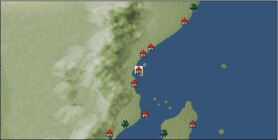

# Port: ザンジバル

import Tabs from '@theme/Tabs';
import TabItem from '@theme/TabItem';

## General Information

| Attribute | Details |
| :--- | :--- |
| **Port Name** | zanzibar |
| **Port Type** | port of alliance |
| **Region** | Eastern Africa/India |
| **Sea Area** | Off the coast of Zanzibar |
| **Required Language** | Swahili |
| **Coordinates** | （1813，4978） |
| **Investment Reward** | [jewelry cut green calligraphy](Items/Recipe Book/item_1213.md) （必要投資額：2,000,000ドゥカード） |

### Available Facilities

| guild | intermediary | exchange | tool shop | workshop craftsman | Painter | sculptor | peddler |
| --- | --- | --- | --- | --- | --- | --- | --- |
|   | ○ | ○ | ○ | ○ | ○ |   | ○ |
| Shipyard Master | Lumbermaker | Sail-maker | weapon craftsman | master | TavernFemale | archive | salesperson |
| --- | --- | --- | --- | --- | --- | --- | --- |
| ○ |   |   | ○ | ○ | ○ |   | ○ |
| Shipwright | 銀行 | street worker | 王宮 | Trading post | church | suburbs | translator |
| --- | --- | --- | --- | --- | --- | --- | --- |
| ○ | ○ | ○ |   |   |   |   | ○ |

### Description
A town on an island in East Africa. It flourished as a trading point between Africa and Arabia and India. In addition to agricultural products, precious metals and jewelry are produced. Tavern woman: Ghada Cultural area: East Africa

<Tabs>
  <TabItem value="trade_goods_sales" label="Trade Goods Sales">

| item | group | purchase price | 同盟時 | remarks |
| --- | --- | --- | --- | --- |
| [emerald](Items/Trade Goods/TradeGoods-Gems/item_777.md) | [Trading Items (Gemstones)](Categories/category_15.md) | 3,450 | (3,019) |  |
| [coffee](Items/Trade Goods/TradeGoods-Sunddries/item_445.md) | [Trading goods (hobby goods)](Categories/category_10.md) | 429 | (376) |  |
| [palm wine](Items/Trade Goods/TradeGoods-Alcohol/item_436.md) | [交易品（酒類）](Categories/category_9.md) | 292 | (256) |  |
| [malachite](Items/Trade Goods/TradeGoods-Gems/item_679.md) | [Trading Items (Gemstones)](Categories/category_15.md) | 1,762 | 3,021 |  |
| 要投資（必要投資額：180,000） |
| [wheat](Items/Trade Goods/TradeGoods-Foodstuffs/item_16.md) | [Trading items (food items)](Categories/category_3.md) | 45 | 40 |  |
| [cotton](Items/Trade Goods/TradeGoods-Fibers/item_610.md) | [交易品（繊維）](Categories/category_1.md) | 306 | 268 |  |
| [貝甲香](Items/Trade Goods/TradeGoods-Perfume/item_776.md) | [Trading Goods (Spices)](Categories/category_11.md) | 976 | (854) |  |
| [gold](Items/Trade Goods/TradeGoods-Metals/item_659.md) | [Trading products (precious metals)](Categories/category_8.md) | 4,214 | 3,934 |  |
| 要投資（必要投資額：320,000） |
| [陸稲](Items/Trade Goods/TradeGoods-Foodstuffs/item_100.md) | [Trading items (food items)](Categories/category_3.md) | 41 | (36) |  |
  </TabItem>
  <TabItem value="sale_specialty" label="Sale (Specialty)">

| item | group | sale price | 同盟時 | remarks |
| --- | --- | --- | --- | --- |

#### [交易品（繊維）](Categories/category_1.md)

| [feather](Items/Trade Goods/TradeGoods-Fibers/item_585.md) | 交易品（繊維） | 991 | (1,114) |  |

#### [Trading Goods (Dye)](Categories/category_2.md)

| [Indian Akane](Items/Trade Goods/TradeGoods-Dye/item_1037.md) | Trading Goods (Dye) | 817 | (919) |  |
| [Indian indigo](Items/Trade Goods/TradeGoods-Dye/item_157.md) | Trading Goods (Dye) | 826 | (929) |  |
| [ward](Items/Trade Goods/TradeGoods-Dye/item_57.md) | Trading Goods (Dye) | 1,990 | (2,238) |  |
| [Safflower](Items/Trade Goods/TradeGoods-Dye/item_1059.md) | Trading Goods (Dye) | 1,035 | (1,164) |  |

#### [交易品（調味料）](Categories/category_4.md)

| [apple cider vinegar](Items/Trade Goods/TradeGoods-Seasonings/item_882.md) | 交易品（調味料） | 667 | (750) |  |

#### [Trading products (medical products)](Categories/category_6.md)

| [Nothing](Items/Trade Goods/TradeGoods-Medicine/item_1053.md) | Trading products (medical products) | 1,103 | (1,240) |  |

#### [交易品（酒類）](Categories/category_9.md)

| [aquavit](Items/Trade Goods/TradeGoods-Alcohol/item_572.md) | 交易品（酒類） | 1,276 | 1,363 |  |
| [whiskey](Items/Trade Goods/TradeGoods-Alcohol/item_1.md) | 交易品（酒類） | 1,370 | 1,478 |  |
| [sherry](Items/Trade Goods/TradeGoods-Alcohol/item_844.md) | 交易品（酒類） | 643 | (723) |  |
| [gin](Items/Trade Goods/TradeGoods-Alcohol/item_291.md) | 交易品（酒類） | 1,480 | (1,665) |  |
| [fruit brandy](Items/Trade Goods/TradeGoods-Alcohol/item_1440.md) | 交易品（酒類） | 1,060 | (1,192) |  |

#### [Trading goods (hobby goods)](Categories/category_10.md)

| [prune](Items/Trade Goods/TradeGoods-Sunddries/item_523.md) | Trading goods (hobby goods) | 628 | (706) |  |
| [dried figs](Items/Trade Goods/TradeGoods-Sunddries/item_611.md) | Trading goods (hobby goods) | 622 | (699) |  |
| [dried apple](Items/Trade Goods/TradeGoods-Sunddries/item_19.md) | Trading goods (hobby goods) | 484 | (544) |  |
| [black tea](Items/Trade Goods/TradeGoods-Sunddries/item_675.md) | Trading goods (hobby goods) | 855 | 921 |  |
| [raspberry](Items/Trade Goods/TradeGoods-Sunddries/item_5419.md) | Trading goods (hobby goods) | (15,998) | 18,667 |  |

#### [Trading Goods (Spices)](Categories/category_11.md)

| [oakmoss](Items/Trade Goods/TradeGoods-Perfume/item_819.md) | Trading Goods (Spices) | 1,040 | (1,170) |  |
| [jasmine](Items/Trade Goods/TradeGoods-Perfume/item_772.md) | Trading Goods (Spices) | 6,075 | (6,835) |  |
| [daffodil](Items/Trade Goods/TradeGoods-Perfume/item_612.md) | Trading Goods (Spices) | 1,970 | (2,216) |  |
| [lily of the valley](Items/Trade Goods/TradeGoods-Perfume/item_358.md) | Trading Goods (Spices) | 1,580 | (1,777) |  |
| [geranium](Items/Trade Goods/TradeGoods-Perfume/item_145.md) | Trading Goods (Spices) | 929 | 958 |  |
| [lira](Items/Trade Goods/TradeGoods-Perfume/item_30.md) | Trading Goods (Spices) | 1,500 | (1,687) |  |
| [sandalwood](Items/Trade Goods/TradeGoods-Perfume/item_771.md) | Trading Goods (Spices) | 2,530 | (2,846) |  |

#### [Trading Goods (Spices)](Categories/category_12.md)

| [pepper](Items/Trade Goods/TradeGoods-Spices/item_58.md) | Trading Goods (Spices) | 451 | (507) |  |
| [cinnamon](Items/Trade Goods/TradeGoods-Spices/item_1432.md) | Trading Goods (Spices) | 686 | (771) |  |

#### [Trading goods (artificial goods)](Categories/category_13.md)

| [glasswork](Items/Trade Goods/TradeGoods-Luxuries/item_60.md) | Trading goods (artificial goods) | 2,480 | (2,790) |  |
| [Tumbaga](Items/Trade Goods/TradeGoods-Luxuries/item_3028.md) | Trading goods (artificial goods) | 11,049 | (12,431) |  |

#### [交易品（美術品）](Categories/category_14.md)

| [Japanese painting](Items/Trade Goods/TradeGoods-Art/item_3436.md) | 交易品（美術品） | (20,890) | 24,375 |  |

#### [Trading Items (Gemstones)](Categories/category_15.md)

| [aventurine](Items/Trade Goods/TradeGoods-Gems/item_678.md) | Trading Items (Gemstones) | 1,880 | (2,115) |  |
| [inca rose](Items/Trade Goods/TradeGoods-Gems/item_3014.md) | Trading Items (Gemstones) | 11,225 | (12,629) |  |
| [cat's eye](Items/Trade Goods/TradeGoods-Gems/item_1047.md) | Trading Items (Gemstones) | 3,300 | (3,712) |  |
| [sapphire](Items/Trade Goods/TradeGoods-Gems/item_676.md) | Trading Items (Gemstones) | 4,470 | (5,029) |  |
| [diamond](Items/Trade Goods/TradeGoods-Gems/item_449.md) | Trading Items (Gemstones) | 3,491 | 3,667 |  |
| [ruby](Items/Trade Goods/TradeGoods-Gems/item_773.md) | Trading Items (Gemstones) | 4,541 | (5,109) |  |

#### [Trading Items (Arms)](Categories/category_16.md)

| [crossbow](Items/Trade Goods/TradeGoods-Weapons/item_537.md) | Trading Items (Arms) | 1,360 | (1,530) |  |

#### [Trading Items (Firearms)](Categories/category_17.md)

| [musket gun](Items/Trade Goods/TradeGoods-Firearms/item_584.md) | Trading Items (Firearms) | 4,229 | (4,758) |  |

#### [交易品（工業品）](Categories/category_19.md)

| [marble](Items/Trade Goods/TradeGoods-Wares/item_52.md) | 交易品（工業品） | (1,752) | 2,044 |  |
| [羊皮紙](Items/Trade Goods/TradeGoods-Wares/item_53.md) | 交易品（工業品） | (1,440) | 1,680 |  |

#### [交易品（織物）](Categories/category_20.md)

| [Awaiyo](Items/Trade Goods/TradeGoods-Fabrics/item_3002.md) | 交易品（織物） | 3,514 | (3,953) |  |
| [indian chintz](Items/Trade Goods/TradeGoods-Fabrics/item_159.md) | 交易品（織物） | 1,170 | (1,316) |  |
| [dutch calico](Items/Trade Goods/TradeGoods-Fabrics/item_1435.md) | 交易品（織物） | 2,040 | (2,295) |  |
| [turkish rug](Items/Trade Goods/TradeGoods-Fabrics/item_686.md) | 交易品（織物） | (6,257) | 7,300 |  |
| [flannel](Items/Trade Goods/TradeGoods-Fabrics/item_149.md) | 交易品（織物） | (1,629) | 1,900 |  |
| [velvet](Items/Trade Goods/TradeGoods-Fabrics/item_902.md) | 交易品（織物） | 4,952 | (5,571) |  |
  </TabItem>
  <TabItem value="sale_no_specialty" label="Sale (No Specialty)">

| item | group | sale price | 同盟時 | remarks |
| --- | --- | --- | --- | --- |

#### [交易品（繊維）](Categories/category_1.md)

| [peacock feather](Items/Trade Goods/TradeGoods-Fibers/item_901.md) | 交易品（繊維） | 448 | (504) |  |
| [fur](Items/Trade Goods/TradeGoods-Fibers/item_634.md) | 交易品（繊維） | 1,375 | (1,547) |  |
| [wool](Items/Trade Goods/TradeGoods-Fibers/item_5.md) | 交易品（繊維） | 460 | (517) |  |

#### [Trading Goods (Dye)](Categories/category_2.md)

| [貝紫](Items/Trade Goods/TradeGoods-Dye/item_110.md) | Trading Goods (Dye) | (5,600) | 6,534 |  |

#### [Trading items (food items)](Categories/category_3.md)

| [sugar cane](Items/Trade Goods/TradeGoods-Foodstuffs/item_93.md) | Trading items (food items) | 215 | (241) |  |
| [pasta](Items/Trade Goods/TradeGoods-Foodstuffs/item_635.md) | Trading items (food items) | 64 | (72) |  |
| [wheat](Items/Trade Goods/TradeGoods-Foodstuffs/item_16.md) | Trading items (food items) | (18) | 20 |  |
| [flour](Items/Trade Goods/TradeGoods-Foodstuffs/item_605.md) | Trading items (food items) | 51 | 56 |  |
| [魚肉](Items/Trade Goods/TradeGoods-Foodstuffs/item_10.md) | Trading items (food items) | (152) | 177 |  |

#### [交易品（調味料）](Categories/category_4.md)

| [coconut vinegar](Items/Trade Goods/TradeGoods-Seasonings/item_1988.md) | 交易品（調味料） | 499 | (561) |  |
| [tamarind](Items/Trade Goods/TradeGoods-Seasonings/item_1968.md) | 交易品（調味料） | 883 | (993) |  |
| [herbal salt](Items/Trade Goods/TradeGoods-Seasonings/item_840.md) | 交易品（調味料） | (223) | 260 |  |
| [butter](Items/Trade Goods/TradeGoods-Seasonings/item_3.md) | 交易品（調味料） | (378) | 441 |  |

#### [交易品（雑貨）](Categories/category_5.md)

| [Western books](Items/Trade Goods/TradeGoods-Misc/item_293.md) | 交易品（雑貨） | (564) | 658 |  |

#### [Trading products (medical products)](Categories/category_6.md)

| [chamomile](Items/Trade Goods/TradeGoods-Medicine/item_292.md) | Trading products (medical products) | 458 | (515) |  |
| [Maca](Items/Trade Goods/TradeGoods-Medicine/item_3000.md) | Trading products (medical products) | 1,667 | (1,875) |  |

#### [Trading Items (Iron Stone)](Categories/category_7.md)

| [iron ore](Items/Trade Goods/TradeGoods-Minerals/item_146.md) | Trading Items (Iron Stone) | 704 | (792) |  |
| [copper ore](Items/Trade Goods/TradeGoods-Minerals/item_65.md) | Trading Items (Iron Stone) | 1,069 | (1,202) |  |

#### [Trading products (precious metals)](Categories/category_8.md)

| [silver](Items/Trade Goods/TradeGoods-Metals/item_136.md) | Trading products (precious metals) | 3,445 | (3,876) |  |

#### [交易品（酒類）](Categories/category_9.md)

| [Beer](Items/Trade Goods/TradeGoods-Alcohol/item_2.md) | 交易品（酒類） | 425 | 451 |  |

#### [Trading goods (hobby goods)](Categories/category_10.md)

| [coconut](Items/Trade Goods/TradeGoods-Sunddries/item_96.md) | Trading goods (hobby goods) | 331 | (372) |  |
| [coffee](Items/Trade Goods/TradeGoods-Sunddries/item_445.md) | Trading goods (hobby goods) | (162) | 188 |  |
| [dried apricots](Items/Trade Goods/TradeGoods-Sunddries/item_8.md) | Trading goods (hobby goods) | (375) | 437 |  |

#### [Trading Goods (Spices)](Categories/category_11.md)

| [ylang ylang](Items/Trade Goods/TradeGoods-Perfume/item_1434.md) | Trading Goods (Spices) | 793 | (892) |  |
| [orange oil](Items/Trade Goods/TradeGoods-Perfume/item_778.md) | Trading Goods (Spices) | 580 | 589 |  |
| [lavender](Items/Trade Goods/TradeGoods-Perfume/item_150.md) | Trading Goods (Spices) | 932 | (1,048) |  |
| [Ryushu incense](Items/Trade Goods/TradeGoods-Perfume/item_101.md) | Trading Goods (Spices) | 2,700 | (3,037) |  |
| [Musk](Items/Trade Goods/TradeGoods-Perfume/item_158.md) | Trading Goods (Spices) | 3,500 | (3,937) |  |

#### [Trading Goods (Spices)](Categories/category_12.md)

| [cumin](Items/Trade Goods/TradeGoods-Spices/item_156.md) | Trading Goods (Spices) | 922 | (1,037) |  |

#### [Trading goods (artificial goods)](Categories/category_13.md)

| [goldsmith](Items/Trade Goods/TradeGoods-Luxuries/item_687.md) | Trading goods (artificial goods) | 4,810 | (5,411) |  |
| [silversmith](Items/Trade Goods/TradeGoods-Luxuries/item_619.md) | Trading goods (artificial goods) | 5,010 | (5,636) |  |

#### [交易品（美術品）](Categories/category_14.md)

| [古美術品](Items/Trade Goods/TradeGoods-Art/item_51.md) | 交易品（美術品） | 3,608 | (4,059) |  |

#### [Trading Items (Gemstones)](Categories/category_15.md)

| [coral](Items/Trade Goods/TradeGoods-Gems/item_141.md) | Trading Items (Gemstones) | (2,864) | 3,341 |  |
| [turquoise](Items/Trade Goods/TradeGoods-Gems/item_1006.md) | Trading Items (Gemstones) | 1,350 | (1,518) |  |
| [lapis lazuli](Items/Trade Goods/TradeGoods-Gems/item_995.md) | Trading Items (Gemstones) | 2,623 | (2,951) |  |
| [crystal](Items/Trade Goods/TradeGoods-Gems/item_893.md) | Trading Items (Gemstones) | 1,430 | (1,608) |  |
| [pearl](Items/Trade Goods/TradeGoods-Gems/item_769.md) | Trading Items (Gemstones) | 5,063 | (5,696) |  |
| [ivory](Items/Trade Goods/TradeGoods-Gems/item_699.md) | Trading Items (Gemstones) | 1,900 | 1,937 |  |

#### [Trading Items (Firearms)](Categories/category_17.md)

| [arquebus gun](Items/Trade Goods/TradeGoods-Firearms/item_14.md) | Trading Items (Firearms) | 2,150 | (2,418) |  |
| [大砲](Items/Trade Goods/TradeGoods-Firearms/item_4.md) | Trading Items (Firearms) | 4,390 | (4,939) |  |
| [bullet](Items/Trade Goods/TradeGoods-Firearms/item_13.md) | Trading Items (Firearms) | 1,214 | (1,365) |  |
| [cannonball](Items/Trade Goods/TradeGoods-Firearms/item_144.md) | Trading Items (Firearms) | 1,566 | (1,761) |  |

#### [交易品（工業品）](Categories/category_19.md)

| [alabaster](Items/Trade Goods/TradeGoods-Wares/item_1086.md) | 交易品（工業品） | (547) | 638 |  |
| [wood](Items/Trade Goods/TradeGoods-Wares/item_277.md) | 交易品（工業品） | 805 | (905) |  |
| [paper](Items/Trade Goods/TradeGoods-Wares/item_625.md) | 交易品（工業品） | 340 | (382) |  |
| [iron material](Items/Trade Goods/TradeGoods-Wares/item_268.md) | 交易品（工業品） | 844 | (949) |  |

#### [交易品（織物）](Categories/category_20.md)

| [persian rug](Items/Trade Goods/TradeGoods-Fabrics/item_606.md) | 交易品（織物） | 4,655 | (5,237) |  |
| [cotton fabric](Items/Trade Goods/TradeGoods-Fabrics/item_571.md) | 交易品（織物） | 794 | (893) |  |
  </TabItem>
  <TabItem value="guild_&_others" label="Guild & Others">

| item | group | Sales price | Handling NPC | remarks |
| --- | --- | --- | --- | --- |

#### Genro Majid

| [dye trading](Skills/Skill-Trade/item_484.md) | [Skill (trade)](Categories/category_40.md) | 30,000 | Genro Majid |  |
| [persian](Skills/Skills-Language/item_591.md) | [Skills (language)](Categories/category_42.md) | 25,000 | Genro Majid |  |
  </TabItem>
  <TabItem value="toolman" label="Toolman">

| item | group | Sales price | Handling NPC | remarks |
| --- | --- | --- | --- | --- |

#### [Equipment (head)](Categories/category_23.md)

| [Fes](Items/Equipment/Equipment-Head/item_790.md) | Equipment (head) | 19,000 | tool shop owner |  |

#### [Equipment (body)](Categories/category_24.md)

| [masai beads](Items/Equipment/Equipment-Body/item_789.md) | Equipment (body) | 58,900 | tool shop owner |  |

#### [装備品（服飾品）](Categories/category_28.md)

| [golden brooch](Items/Equipment/Equipment-Accessory/item_2635.md) | 装備品（服飾品） | 6,000,000 | tool shop owner |  |
| 要投資（必要投資額：120,000） |
| [golden ring](Items/Equipment/Equipment-Accessory/item_2633.md) | 装備品（服飾品） | 7,000,000 | tool shop owner |  |
| 要投資（必要投資額：180,000） |
| [golden earrings](Items/Equipment/Equipment-Accessory/item_791.md) | 装備品（服飾品） | 4,000,000 | tool shop owner |  |
| [golden necklace](Items/Equipment/Equipment-Accessory/item_2637.md) | 装備品（服飾品） | 8,000,000 | tool shop owner |  |
| 要投資（必要投資額：180,000） |
| [golden hair ornament](Items/Equipment/Equipment-Accessory/item_2636.md) | 装備品（服飾品） | 5,000,000 | tool shop owner |  |
| 要投資（必要投資額：120,000） |

#### [Consumables (land battle/deck battle)](Categories/category_29.md)

| [boomerang](Items/Consumables/Consumables-Landbattle/item_454.md) | Consumables (land battle/deck battle) | 150 | tool shop owner |  |
| [Assortment of wound medicine](Items/Consumables/Consumables-Landbattle/item_90.md) | Consumables (land battle/deck battle) | 500 | tool shop owner |  |
| [dart](Items/Consumables/Consumables-Landbattle/item_312.md) | Consumables (land battle/deck battle) | 50 | tool shop owner |  |
| [torch for throwing](Items/Consumables/Consumables-Landbattle/item_313.md) | Consumables (land battle/deck battle) | 150 | tool shop owner |  |
| [therapeutic drug](Items/Consumables/Consumables-Landbattle/item_89.md) | Consumables (land battle/deck battle) | 300 | tool shop owner |  |

#### [Consumables (skill activation)](Categories/category_31.md)

| [card](Items/Consumables/Consumables-Skill/item_855.md) | Consumables (skill activation) | 500 | tool shop owner |  |
| [Card (RANK3)](Items/Consumables/Consumables-Skill/item_1829.md) | Consumables (skill activation) | 2,000 | tool shop owner |  |
| [捕獲網](Items/Consumables/Consumables-Skill/item_315.md) | Consumables (skill activation) | 300 | tool shop owner |  |

#### [Consumables (request documents)](Categories/category_45.md)

| [Dye purchase order](Items/Consumables/Consumables-Documents/item_4913.md) | Consumables (request documents) | 20,000 | tool shop owner |  |
  </TabItem>
  <TabItem value="kobo_craftsmen" label="Craftsman">

| item | group | Sales price | Handling NPC | remarks |
| --- | --- | --- | --- | --- |

#### [Consumables (condition recovery)](Categories/category_21.md)

| [Nostalgic carillon bell](Items/Consumables/Consumables-Recovery/item_245.md) | Consumables (condition recovery) | 200 | workshop craftsman |  |
| [Ship song sheet music](Items/Consumables/Consumables-Recovery/item_247.md) | Consumables (condition recovery) | 200 | workshop craftsman |  |

#### [recipe book](Categories/category_22.md)

| [Land battle props/casting book](Items/Recipe Book/item_234.md) | recipe book | Fixed recipe | workshop craftsman |  |
  </TabItem>
  <TabItem value="Painter" label="Painter">

| item | group | Sales price | Handling NPC | remarks |
| --- | --- | --- | --- | --- |

#### [Ship parts (emblem)](Categories/category_36.md)

| [admiral](Items/Ship Parts/Shipparts-Crests/item_548.md) | Ship parts (emblem) | 5,000 | Painter |  |
| [anchor](Items/Ship Parts/Shipparts-Crests/item_549.md) | Ship parts (emblem) | 5,000 | Painter |  |
| [ape](Items/Ship Parts/Shipparts-Crests/item_793.md) | Ship parts (emblem) | 5,000 | Painter |  |
| [whale](Items/Ship Parts/Shipparts-Crests/item_792.md) | Ship parts (emblem) | 5,000 | Painter |  |
| [circle cross](Items/Ship Parts/Shipparts-Crests/item_544.md) | Ship parts (emblem) | 5,000 | Painter |  |
| [Delphine](Items/Ship Parts/Shipparts-Crests/item_542.md) | Ship parts (emblem) | 5,000 | Painter |  |
| [butterfly](Items/Ship Parts/Shipparts-Crests/item_547.md) | Ship parts (emblem) | 5,000 | Painter |  |
| [fisherman](Items/Ship Parts/Shipparts-Crests/item_545.md) | Ship parts (emblem) | 5,000 | Painter |  |
  </TabItem>
  <TabItem value="peddler" label="peddler">

| item | group | Sales price | Handling NPC | remarks |
| --- | --- | --- | --- | --- |

#### [Consumables (condition recovery)](Categories/category_21.md)

| [spare sail](Items/Consumables/Consumables-Recovery/item_242.md) | Consumables (condition recovery) |  | peddler |  |
| [reserve rudder](Items/Consumables/Consumables-Recovery/item_243.md) | Consumables (condition recovery) |  | peddler |  |
| [fire extinguishing sand](Items/Consumables/Consumables-Recovery/item_68.md) | Consumables (condition recovery) |  | peddler |  |

#### [Consumables (land battle/deck battle)](Categories/category_29.md)

| [javelin](Items/Consumables/Consumables-Landbattle/item_1515.md) | Consumables (land battle/deck battle) | 300 | peddler |  |
| [explosive drug](Items/Consumables/Consumables-Landbattle/item_2493.md) | Consumables (land battle/deck battle) |  | peddler |  |

#### [Consumables (naval/hand-to-hand combat)](Categories/category_30.md)

| [evacuation bell](Items/Consumables/Consumables-navalhand-to-hand combat/item_919.md) | Consumables (naval/hand-to-hand combat) |  | peddler |  |
| [flag of calm](Items/Consumables/Consumables-navalhand-to-hand combat/item_84.md) | Consumables (naval/hand-to-hand combat) |  | peddler |  |
  </TabItem>
  <TabItem value="salesperson" label="salesperson">

| item | group | Sales price | Handling NPC | remarks |
| --- | --- | --- | --- | --- |

#### [Consumables (cooking)](Categories/category_32.md)

| [injera](Items/Consumables/Consumables-Cooking/item_999.md) | Consumables (cooking) |  | salesperson |  |
| [egusi soup](Items/Consumables/Consumables-Cooking/item_1102.md) | Consumables (cooking) |  | salesperson |  |
| [Thai grilled cheese](Items/Consumables/Consumables-Cooking/item_1487.md) | Consumables (cooking) |  | salesperson |  |
| [Biscocho](Items/Consumables/Consumables-Cooking/item_1079.md) | Consumables (cooking) |  | salesperson |  |
| [brick](Items/Consumables/Consumables-Cooking/item_1020.md) | Consumables (cooking) |  | salesperson |  |
| [coconut milk with fruit](Items/Consumables/Consumables-Cooking/item_1100.md) | Consumables (cooking) |  | salesperson |  |
| [Sheep Gourme Sabzui](Items/Consumables/Consumables-Cooking/item_1038.md) | Consumables (cooking) |  | salesperson |  |
  </TabItem>
  <TabItem value="translator" label="translator">

| item | group | Sales price | Handling NPC | remarks |
| --- | --- | --- | --- | --- |

#### [Consumables (skill activation)](Categories/category_31.md)

| [African languages ​​translation notes](Items/Consumables/Consumables-Skill/item_2302.md) | Consumables (skill activation) |  | translator |  |
  </TabItem>
  <TabItem value="shipyard" label="Shipyard">

### Shipyard Master

| item | group | Sales price | Handling NPC | remarks |
| --- | --- | --- | --- | --- |

#### [Boat](Categories/category_43.md)

| [arabian galley](Items/Ships/item_592.md) | Boat | 3,840,000 | Shipyard Master |  |
| [Galliot](Items/Ships/item_210.md) | Boat | 156,000 | Shipyard Master |  |
| [galley](Items/Ships/item_227.md) | Boat | 645,000 | Shipyard Master |  |
| [sambouk](Items/Ships/item_783.md) | Boat | 1,000,000 | Shipyard Master |  |
| [Dow](Items/Ships/item_780.md) | Boat | 360,000 | Shipyard Master |  |
| [Varsha](Items/Ships/item_201.md) | Boat | 2,000 | Shipyard Master |  |
| [commercial galley](Items/Ships/item_229.md) | Boat | 650,000 | Shipyard Master |  |
| [commercial thumb book](Items/Ships/item_785.md) | Boat | 1,100,000 | Shipyard Master |  |
| [commercial dow](Items/Ships/item_782.md) | Boat | 372,000 | Shipyard Master |  |
| [commercial varsha](Items/Ships/item_204.md) | Boat | 5,200 | Shipyard Master |  |
| [assault galley](Items/Ships/item_224.md) | Boat | 640,000 | Shipyard Master |  |
| [Battle Barsha](Items/Ships/item_203.md) | Boat | 5,100 | Shipyard Master |  |
| [exploration barsha](Items/Ships/item_202.md) | Boat | 5,000 | Shipyard Master |  |
| [Armed Sambouk](Items/Ships/item_784.md) | Boat | 1,000,000 | Shipyard Master |  |
| [assault dhow](Items/Ships/item_781.md) | Boat | 365,000 | Shipyard Master |  |
| [light galley](Items/Ships/item_209.md) | Boat | 150,000 | Shipyard Master |  |
| [transportation galley](Items/Ships/item_211.md) | Boat | 160,000 | Shipyard Master |  |

### Shipwright

| item | group | Sales price | Handling NPC | remarks |
| --- | --- | --- | --- | --- |

#### [recipe book](Categories/category_22.md)

| [Shipbuilding materials/custom-made all-purpose ram](Items/Recipe Book/item_1758.md) | recipe book | Fixed recipe | Shipwright |  |

#### [shipbuilding materials](Categories/category_47.md)

| [Custom-made all-purpose ram](Items/Shipbuilding FS Material/item_1750.md) | shipbuilding materials | Fixed recipe | Shipwright |  |
  </TabItem>
  <TabItem value="weapon craftsman" label="weapon craftsman">

| item | group | Sales price | Handling NPC | remarks |
| --- | --- | --- | --- | --- |

#### [Ship parts (special weapons)](Categories/category_37.md)

| [Corvus](Items/Ship Parts/Shipparts-Special-Weapons/item_194.md) | Ship parts (special weapons) | 24,000 | weapon craftsman |  |
| [rum](Items/Ship Parts/Shipparts-Special-Weapons/item_191.md) | Ship parts (special weapons) | 4,800 | weapon craftsman |  |
| [medium sized ram](Items/Ship Parts/Shipparts-Special-Weapons/item_192.md) | Ship parts (special weapons) | 31,000 | weapon craftsman |  |
| [large ram](Items/Ship Parts/Shipparts-Special-Weapons/item_788.md) | Ship parts (special weapons) | 100,000 | weapon craftsman |  |
| [small corvus](Items/Ship Parts/Shipparts-Special-Weapons/item_193.md) | Ship parts (special weapons) | 3,000 | weapon craftsman |  |
| [small ram](Items/Ship Parts/Shipparts-Special-Weapons/item_190.md) | Ship parts (special weapons) | 1,000 | weapon craftsman |  |
| [small poop](Items/Ship Parts/Shipparts-Special-Weapons/item_198.md) | Ship parts (special weapons) | 39,000 | weapon craftsman |  |
| [small ship forecastle](Items/Ship Parts/Shipparts-Special-Weapons/item_195.md) | Ship parts (special weapons) | 5,000 | weapon craftsman |  |
| [forecastle](Items/Ship Parts/Shipparts-Special-Weapons/item_241.md) | Ship parts (special weapons) | 16,000 | weapon craftsman |  |
| [additional small spanker](Items/Ship Parts/Shipparts-Special-Weapons/item_199.md) | Ship parts (special weapons) | 3,500 | weapon craftsman |  |
| [additional small split](Items/Ship Parts/Shipparts-Special-Weapons/item_196.md) | Ship parts (special weapons) | 2,000 | weapon craftsman |  |

#### [Ship parts (cannon)](Categories/category_38.md)

| [4 amfer guns](Items/Ship Parts/Shipparts-Cannons/item_391.md) | Ship parts (cannon) | 26,600 | weapon craftsman |  |
| [6 Amfer cannons](Items/Ship Parts/Shipparts-Cannons/item_392.md) | Ship parts (cannon) | 81,000 | weapon craftsman |  |
| [4 Caprice guns](Items/Ship Parts/Shipparts-Cannons/item_395.md) | Ship parts (cannon) | 18,200 | weapon craftsman |  |
| [6 Caprice guns](Items/Ship Parts/Shipparts-Cannons/item_396.md) | Ship parts (cannon) | 55,500 | weapon craftsman |  |
| [8 Caprice guns](Items/Ship Parts/Shipparts-Cannons/item_397.md) | Ship parts (cannon) | 103,600 | weapon craftsman |  |
| [10 culverines](Items/Ship Parts/Shipparts-Cannons/item_375.md) | Ship parts (cannon) | 136,300 | weapon craftsman |  |
| [4 culverine guns](Items/Ship Parts/Shipparts-Cannons/item_372.md) | Ship parts (cannon) | 21,800 | weapon craftsman |  |
| [6 culverine guns](Items/Ship Parts/Shipparts-Cannons/item_373.md) | Ship parts (cannon) | 49,100 | weapon craftsman |  |
| [8 culverine guns](Items/Ship Parts/Shipparts-Cannons/item_374.md) | Ship parts (cannon) | 87,300 | weapon craftsman |  |
| [4 Cannon Pedro guns](Items/Ship Parts/Shipparts-Cannons/item_376.md) | Ship parts (cannon) | 30,500 | weapon craftsman |  |
| [6 Cannon Pedro guns](Items/Ship Parts/Shipparts-Cannons/item_377.md) | Ship parts (cannon) | 68,700 | weapon craftsman |  |
| [10 Saker cannons](Items/Ship Parts/Shipparts-Cannons/item_187.md) | Ship parts (cannon) | 79,000 | weapon craftsman |  |
| [2 saker cannons](Items/Ship Parts/Shipparts-Cannons/item_183.md) | Ship parts (cannon) | 3,200 | weapon craftsman |  |
| [4 saker cannons](Items/Ship Parts/Shipparts-Cannons/item_184.md) | Ship parts (cannon) | 12,600 | weapon craftsman |  |
| [6 Saker cannons](Items/Ship Parts/Shipparts-Cannons/item_185.md) | Ship parts (cannon) | 28,400 | weapon craftsman |  |
| [8 Saker cannons](Items/Ship Parts/Shipparts-Cannons/item_186.md) | Ship parts (cannon) | 50,500 | weapon craftsman |  |
| [10 demi culverin cannons](Items/Ship Parts/Shipparts-Cannons/item_370.md) | Ship parts (cannon) | 101,000 | weapon craftsman |  |
| [12 demi culverin cannons](Items/Ship Parts/Shipparts-Cannons/item_371.md) | Ship parts (cannon) | 145,400 | weapon craftsman |  |
| [2 demi culverin cannons](Items/Ship Parts/Shipparts-Cannons/item_188.md) | Ship parts (cannon) | 4,000 | weapon craftsman |  |
| [4 demi culverin cannons](Items/Ship Parts/Shipparts-Cannons/item_189.md) | Ship parts (cannon) | 16,200 | weapon craftsman |  |
| [6 demi culverin cannons](Items/Ship Parts/Shipparts-Cannons/item_368.md) | Ship parts (cannon) | 36,400 | weapon craftsman |  |
| [8 demi culverin cannons](Items/Ship Parts/Shipparts-Cannons/item_369.md) | Ship parts (cannon) | 64,600 | weapon craftsman |  |
| [4 Draconis cannons](Items/Ship Parts/Shipparts-Cannons/item_386.md) | Ship parts (cannon) | 18,200 | weapon craftsman |  |
| [6 Draconis cannons](Items/Ship Parts/Shipparts-Cannons/item_387.md) | Ship parts (cannon) | 55,500 | weapon craftsman |  |
| [8 Draconis cannons](Items/Ship Parts/Shipparts-Cannons/item_390.md) | Ship parts (cannon) | 103,600 | weapon craftsman |  |
| [4 pyro cannons](Items/Ship Parts/Shipparts-Cannons/item_384.md) | Ship parts (cannon) | 12,500 | weapon craftsman |  |
| [6 pyro cannons](Items/Ship Parts/Shipparts-Cannons/item_385.md) | Ship parts (cannon) | 38,000 | weapon craftsman |  |
| [2 falcon guns](Items/Ship Parts/Shipparts-Cannons/item_174.md) | Ship parts (cannon) | 500 | weapon craftsman |  |
| [4 falcon guns](Items/Ship Parts/Shipparts-Cannons/item_175.md) | Ship parts (cannon) | 2,000 | weapon craftsman |  |
| [6 falcon guns](Items/Ship Parts/Shipparts-Cannons/item_176.md) | Ship parts (cannon) | 4,600 | weapon craftsman |  |
| [8 falcon guns](Items/Ship Parts/Shipparts-Cannons/item_177.md) | Ship parts (cannon) | 8,100 | weapon craftsman |  |
| [4 frango guns](Items/Ship Parts/Shipparts-Cannons/item_393.md) | Ship parts (cannon) | 12,500 | weapon craftsman |  |
| [6 frango guns](Items/Ship Parts/Shipparts-Cannons/item_394.md) | Ship parts (cannon) | 38,000 | weapon craftsman |  |
| [10 minion cannons](Items/Ship Parts/Shipparts-Cannons/item_182.md) | Ship parts (cannon) | 34,800 | weapon craftsman |  |
| [2 minion cannons](Items/Ship Parts/Shipparts-Cannons/item_178.md) | Ship parts (cannon) | 1,400 | weapon craftsman |  |
| [4 minion cannons](Items/Ship Parts/Shipparts-Cannons/item_179.md) | Ship parts (cannon) | 5,600 | weapon craftsman |  |
| [6 minion cannons](Items/Ship Parts/Shipparts-Cannons/item_180.md) | Ship parts (cannon) | 12,400 | weapon craftsman |  |
| [8 minion cannons](Items/Ship Parts/Shipparts-Cannons/item_181.md) | Ship parts (cannon) | 22,400 | weapon craftsman |  |
| [4 Meteora cannons](Items/Ship Parts/Shipparts-Cannons/item_398.md) | Ship parts (cannon) | 26,600 | weapon craftsman |  |
| [6 Meteora cannons](Items/Ship Parts/Shipparts-Cannons/item_399.md) | Ship parts (cannon) | 81,000 | weapon craftsman |  |
  </TabItem>
</Tabs>