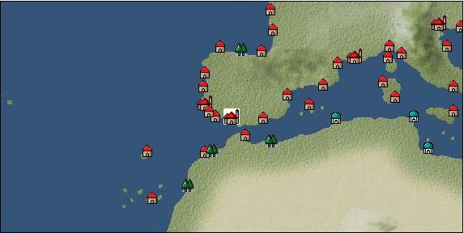

# Port: セビリア

import Tabs from '@theme/Tabs';
import TabItem from '@theme/TabItem';

## General Information

| Attribute | Details |
| :--- | :--- |
| **Port Name** | seville |
| **Port Type** | Headquarters |
| **Region** | western europe |
| **Sea Area** | Strait of Gibraltar |
| **Required Language** | spanish |
| **Coordinates** | （15902，3270） |
| **Investment Reward** | [Collection of Western Mediterranean specialties](Items/Recipe Book/item_750.md) （必要投資額：1,000,000ドゥカード） |

### Available Facilities

| guild | intermediary | exchange | tool shop | workshop craftsman | Painter | sculptor | peddler |
| --- | --- | --- | --- | --- | --- | --- | --- |
| ○ | ○ | ○ | ○ | ○ |   |   | ○ |
| Shipyard Master | Lumbermaker | Sail-maker | weapon craftsman | master | TavernFemale | archive | salesperson |
| --- | --- | --- | --- | --- | --- | --- | --- |
| ○ | ○ | ○ | ○ | ○ | ○ | ○ | ○ |
| Shipwright | 銀行 | street worker | 王宮 | Trading post | church | suburbs | translator |
| --- | --- | --- | --- | --- | --- | --- | --- |
| ○ | ○ |   | ○ | ○ | ○ |   | ○ |

### Description
Its foundations were laid by the Phoenicians, and it flourished from the time of ancient Rome. It developed greatly during the time it was ruled by Islamic forces, and now has a unique cityscape that is a mix of Islamic and European culture. Tavern girl: Rosario (Help girl: Emilia) Beginner navigator training school Cultural area: Iberia Specialty: Musket (requires investment) *There is a tool shop/workshop cousin around the square fountain, and a bank NPC is also near the Chamber of Commerce Administration Office.

<Tabs>
  <TabItem value="trade_goods_sales" label="Trade Goods Sales">

| item | group | purchase price | 同盟時 | remarks |
| --- | --- | --- | --- | --- |
| [arquebus gun](Items/Trade Goods/TradeGoods-Firearms/item_14.md) | [Trading Items (Firearms)](Categories/category_17.md) | 1,909 | 1,670 |  |
| When in alliance: confirmed at 100% |
| [musket gun](Items/Trade Goods/TradeGoods-Firearms/item_584.md) | [Trading Items (Firearms)](Categories/category_17.md) | (2,833) | 2,479 |  |
| 要投資（必要投資額：400,000） |
| [wine](Items/Trade Goods/TradeGoods-Alcohol/item_11.md) | [交易品（酒類）](Categories/category_9.md) | 429 | 376 |  |
| [大砲](Items/Trade Goods/TradeGoods-Firearms/item_4.md) | [Trading Items (Firearms)](Categories/category_17.md) | 3,610 | 3,250 |  |
| When in alliance: confirmed at 100% |
| [wheat](Items/Trade Goods/TradeGoods-Foodstuffs/item_16.md) | [Trading items (food items)](Categories/category_3.md) | 45 | 40 |  |
| [bullet](Items/Trade Goods/TradeGoods-Firearms/item_13.md) | [Trading Items (Firearms)](Categories/category_17.md) | 816 | 736 |  |
| When in alliance: confirmed at 100% |
| [水銀](Items/Trade Goods/TradeGoods-Wares/item_15.md) | [交易品（工業品）](Categories/category_19.md) | 1,050 | 980 |  |
| [mercury agent](Items/Trade Goods/TradeGoods-Medicine/item_703.md) | [Trading products (medical products)](Categories/category_6.md) | (1,485) | 1,300 |  |
| 要投資（必要投資額：400,000） |
| [皮革製品](Items/Trade Goods/TradeGoods-Luxuries/item_12.md) | [Trading goods (artificial goods)](Categories/category_13.md) | 1,090 | 984 |  |
| [cotton fabric](Items/Trade Goods/TradeGoods-Fabrics/item_571.md) | [交易品（織物）](Categories/category_20.md) | (763) | 668 |  |
| 要投資（必要投資額：120,000） |
  </TabItem>
  <TabItem value="sale_specialty" label="Sale (Specialty)">

| item | group | sale price | 同盟時 | remarks |
| --- | --- | --- | --- | --- |

#### [交易品（繊維）](Categories/category_1.md)

| [Basho](Items/Trade Goods/TradeGoods-Fibers/item_3862.md) | [交易品（繊維）](Categories/category_1.md) | 27,800 | (31,278) |  |
| [flax](Items/Trade Goods/TradeGoods-Fibers/item_64.md) | [交易品（繊維）](Categories/category_1.md) | (245) | 285 |  |
| When in alliance: confirmed at 100% |
| [feather](Items/Trade Goods/TradeGoods-Fibers/item_585.md) | [交易品（繊維）](Categories/category_1.md) | 722 | (812) |  |
| [Green ramie](Items/Trade Goods/TradeGoods-Fibers/item_3428.md) | [交易品（繊維）](Categories/category_1.md) | (32,781) | 38,250 |  |
| [deerskin](Items/Trade Goods/TradeGoods-Fibers/item_3648.md) | [交易品（繊維）](Categories/category_1.md) | (31,678) | 36,963 |  |

#### [Trading Goods (Dye)](Categories/category_2.md)

| [Indian Akane](Items/Trade Goods/TradeGoods-Dye/item_1037.md) | [Trading Goods (Dye)](Categories/category_2.md) | 1,082 | (1,217) |  |
| [Indian indigo](Items/Trade Goods/TradeGoods-Dye/item_157.md) | [Trading Goods (Dye)](Categories/category_2.md) | 1,224 | (1,377) |  |
| [cochineal](Items/Trade Goods/TradeGoods-Dye/item_1817.md) | [Trading Goods (Dye)](Categories/category_2.md) | (1,294) | 1,509 |  |
| [Safflower](Items/Trade Goods/TradeGoods-Dye/item_1059.md) | [Trading Goods (Dye)](Categories/category_2.md) | 672 | (756) |  |
| [mayan blue](Items/Trade Goods/TradeGoods-Dye/item_1096.md) | [Trading Goods (Dye)](Categories/category_2.md) | (1,392) | 1,624 |  |
| [mangosteen](Items/Trade Goods/TradeGoods-Dye/item_1973.md) | [Trading Goods (Dye)](Categories/category_2.md) | (2,092) | 2,441 |  |
| [mimosa](Items/Trade Goods/TradeGoods-Dye/item_2281.md) | [Trading Goods (Dye)](Categories/category_2.md) | (1,308) | 1,526 |  |
| [log wood](Items/Trade Goods/TradeGoods-Dye/item_1813.md) | [Trading Goods (Dye)](Categories/category_2.md) | (1,315) | 1,534 |  |
| [purple root](Items/Trade Goods/TradeGoods-Dye/item_3752.md) | [Trading Goods (Dye)](Categories/category_2.md) | 34,359 | (38,657) |  |

#### [Trading items (food items)](Categories/category_3.md)

| [buckwheat](Items/Trade Goods/TradeGoods-Foodstuffs/item_3430.md) | [Trading items (food items)](Categories/category_3.md) | 32,766 | (36,865) |  |
| [kangaroo meat](Items/Trade Goods/TradeGoods-Foodstuffs/item_2285.md) | [Trading items (food items)](Categories/category_3.md) | (664) | 774 |  |
| [cactus](Items/Trade Goods/TradeGoods-Foodstuffs/item_2740.md) | [Trading items (food items)](Categories/category_3.md) | (371) | 432 |  |
| [taro](Items/Trade Goods/TradeGoods-Foodstuffs/item_1960.md) | [Trading items (food items)](Categories/category_3.md) | (224) | 261 |  |
| When in alliance: confirmed at 100% |

#### [交易品（調味料）](Categories/category_4.md)

| [tamarind](Items/Trade Goods/TradeGoods-Seasonings/item_1968.md) | [交易品（調味料）](Categories/category_4.md) | (1,762) | 2,055 |  |
| [black vinegar](Items/Trade Goods/TradeGoods-Seasonings/item_3475.md) | [交易品（調味料）](Categories/category_4.md) | (4,605) | 5,373 |  |

#### [交易品（雑貨）](Categories/category_5.md)

| [old ink stick](Items/Trade Goods/TradeGoods-Misc/item_3921.md) | [交易品（雑貨）](Categories/category_5.md) | 9,854 | (11,086) |  |
| [Japanese books](Items/Trade Goods/TradeGoods-Misc/item_3439.md) | [交易品（雑貨）](Categories/category_5.md) | (44,789) | 52,262 |  |
| [lantern](Items/Trade Goods/TradeGoods-Misc/item_3683.md) | [交易品（雑貨）](Categories/category_5.md) | (9,361) | 10,922 |  |
| [Korean books](Items/Trade Goods/TradeGoods-Misc/item_3750.md) | [交易品（雑貨）](Categories/category_5.md) | 24,900 | (28,015) |  |

#### [Trading products (medical products)](Categories/category_6.md)

| [Saikaku](Items/Trade Goods/TradeGoods-Medicine/item_1959.md) | [Trading products (medical products)](Categories/category_6.md) | 4,850 | 4,891 |  |
| [tea tree](Items/Trade Goods/TradeGoods-Medicine/item_2283.md) | [Trading products (medical products)](Categories/category_6.md) | (1,118) | 1,304 |  |
| [Borei](Items/Trade Goods/TradeGoods-Medicine/item_3678.md) | [Trading products (medical products)](Categories/category_6.md) | (32,077) | 37,429 |  |
| [Nothing](Items/Trade Goods/TradeGoods-Medicine/item_1053.md) | [Trading products (medical products)](Categories/category_6.md) | 707 | 768 |  |
| [calamus](Items/Trade Goods/TradeGoods-Medicine/item_3427.md) | [Trading products (medical products)](Categories/category_6.md) | 34,267 | 39,734 |  |

#### [Trading Items (Iron Stone)](Categories/category_7.md)

| [medical stone](Items/Trade Goods/TradeGoods-Minerals/item_3786.md) | [Trading Items (Iron Stone)](Categories/category_7.md) | 25,122 | (28,264) |  |

#### [Trading products (precious metals)](Categories/category_8.md)

| [platinum](Items/Trade Goods/TradeGoods-Metals/item_2178.md) | [Trading products (precious metals)](Categories/category_8.md) | 7,234 | (8,139) |  |
| [佐摩銀](Items/Trade Goods/TradeGoods-Metals/item_3432.md) | [Trading products (precious metals)](Categories/category_8.md) | (33,027) | 38,537 |  |
| [Jinguashijin](Items/Trade Goods/TradeGoods-Metals/item_3693.md) | [Trading products (precious metals)](Categories/category_8.md) | (29,289) | 34,176 |  |

#### [交易品（酒類）](Categories/category_9.md)

| [aquavit](Items/Trade Goods/TradeGoods-Alcohol/item_572.md) | [交易品（酒類）](Categories/category_9.md) | 768 | 779 |  |
| [whiskey](Items/Trade Goods/TradeGoods-Alcohol/item_1.md) | [交易品（酒類）](Categories/category_9.md) | 843 | 890 |  |
| [gin](Items/Trade Goods/TradeGoods-Alcohol/item_291.md) | [交易品（酒類）](Categories/category_9.md) | 806 | 827 |  |
| [tequila](Items/Trade Goods/TradeGoods-Alcohol/item_108.md) | [交易品（酒類）](Categories/category_9.md) | (4,482) | 5,229 |  |
| ●Caribbean specialties |
| [Sake](Items/Trade Goods/TradeGoods-Alcohol/item_3424.md) | [交易品（酒類）](Categories/category_9.md) | 34,811 | 40,200 |  |

#### [Trading goods (hobby goods)](Categories/category_10.md)

| [Aigyoku](Items/Trade Goods/TradeGoods-Sunddries/item_3677.md) | [Trading goods (hobby goods)](Categories/category_10.md) | 23,860 | (26,845) |  |
| [cacao](Items/Trade Goods/TradeGoods-Sunddries/item_140.md) | [Trading goods (hobby goods)](Categories/category_10.md) | (1,252) | 1,460 |  |
| [cashew nuts](Items/Trade Goods/TradeGoods-Sunddries/item_2120.md) | [Trading goods (hobby goods)](Categories/category_10.md) | (935) | 1,090 |  |
| [caviar](Items/Trade Goods/TradeGoods-Sunddries/item_2122.md) | [Trading goods (hobby goods)](Categories/category_10.md) | (1,311) | 1,529 |  |
| [tobacco](Items/Trade Goods/TradeGoods-Sunddries/item_109.md) | [Trading goods (hobby goods)](Categories/category_10.md) | (1,307) | 1,524 |  |
| [chicle](Items/Trade Goods/TradeGoods-Sunddries/item_4083.md) | [Trading goods (hobby goods)](Categories/category_10.md) | (1,523) | 1,777 |  |
| ●Caribbean specialties |
| [durian](Items/Trade Goods/TradeGoods-Sunddries/item_1949.md) | [Trading goods (hobby goods)](Categories/category_10.md) | (1,437) | 1,676 |  |
| [eggplant](Items/Trade Goods/TradeGoods-Sunddries/item_3426.md) | [Trading goods (hobby goods)](Categories/category_10.md) | (32,566) | 38,000 |  |
| [banana](Items/Trade Goods/TradeGoods-Sunddries/item_1947.md) | [Trading goods (hobby goods)](Categories/category_10.md) | (429) | 500 |  |
| [pineapple](Items/Trade Goods/TradeGoods-Sunddries/item_867.md) | [Trading goods (hobby goods)](Categories/category_10.md) | (1,809) | 2,110 |  |
| [peanuts](Items/Trade Goods/TradeGoods-Sunddries/item_134.md) | [Trading goods (hobby goods)](Categories/category_10.md) | (396) | 462 |  |
| [macadamia nuts](Items/Trade Goods/TradeGoods-Sunddries/item_2282.md) | [Trading goods (hobby goods)](Categories/category_10.md) | (966) | 1,127 |  |
| [mango](Items/Trade Goods/TradeGoods-Sunddries/item_2095.md) | [Trading goods (hobby goods)](Categories/category_10.md) | (1,001) | 1,168 |  |
| [lemon myrtle](Items/Trade Goods/TradeGoods-Sunddries/item_2840.md) | [Trading goods (hobby goods)](Categories/category_10.md) | (1,906) | 2,224 |  |
| [dried figs](Items/Trade Goods/TradeGoods-Sunddries/item_611.md) | [Trading goods (hobby goods)](Categories/category_10.md) | 388 | (436) |  |
| [Korean tea](Items/Trade Goods/TradeGoods-Sunddries/item_3751.md) | [Trading goods (hobby goods)](Categories/category_10.md) | (31,305) | 36,528 |  |
| [black tea](Items/Trade Goods/TradeGoods-Sunddries/item_675.md) | [Trading goods (hobby goods)](Categories/category_10.md) | (4,811) | 5,613 |  |
| [金針花](Items/Trade Goods/TradeGoods-Sunddries/item_3739.md) | [Trading goods (hobby goods)](Categories/category_10.md) | (9,202) | 10,737 |  |

#### [Trading Goods (Spices)](Categories/category_11.md)

| [oakmoss](Items/Trade Goods/TradeGoods-Perfume/item_819.md) | [Trading Goods (Spices)](Categories/category_11.md) | 1,053 | (1,184) |  |
| [gardenia](Items/Trade Goods/TradeGoods-Perfume/item_1091.md) | [Trading Goods (Spices)](Categories/category_11.md) | 31,924 | 37,326 |  |
| [daffodil](Items/Trade Goods/TradeGoods-Perfume/item_612.md) | [Trading Goods (Spices)](Categories/category_11.md) | 990 | (1,113) |  |
| [lily of the valley](Items/Trade Goods/TradeGoods-Perfume/item_358.md) | [Trading Goods (Spices)](Categories/category_11.md) | 1,323 | (1,488) |  |
| [geranium](Items/Trade Goods/TradeGoods-Perfume/item_145.md) | [Trading Goods (Spices)](Categories/category_11.md) | 1,100 | (1,237) |  |
| [patchouli](Items/Trade Goods/TradeGoods-Perfume/item_1963.md) | [Trading Goods (Spices)](Categories/category_11.md) | 2,268 | (2,551) |  |
| [eucalyptus](Items/Trade Goods/TradeGoods-Perfume/item_2278.md) | [Trading Goods (Spices)](Categories/category_11.md) | (905) | 1,056 |  |
| [mastic](Items/Trade Goods/TradeGoods-Perfume/item_680.md) | [Trading Goods (Spices)](Categories/category_11.md) | 2,465 | (2,773) |  |
| [sandalwood](Items/Trade Goods/TradeGoods-Perfume/item_771.md) | [Trading Goods (Spices)](Categories/category_11.md) | 3,820 | (4,297) |  |
| [貝甲香](Items/Trade Goods/TradeGoods-Perfume/item_776.md) | [Trading Goods (Spices)](Categories/category_11.md) | (2,143) | 2,500 |  |
| [龍脳](Items/Trade Goods/TradeGoods-Perfume/item_1676.md) | [Trading Goods (Spices)](Categories/category_11.md) | (2,635) | 3,074 |  |

#### [Trading Goods (Spices)](Categories/category_12.md)

| [allspice](Items/Trade Goods/TradeGoods-Spices/item_1848.md) | [Trading Goods (Spices)](Categories/category_12.md) | (3,526) | 4,114 |  |
| ●Special products from the east coast of Central and South America |
| [cardamom](Items/Trade Goods/TradeGoods-Spices/item_1431.md) | [Trading Goods (Spices)](Categories/category_12.md) | 5,286 | (5,947) |  |
| [cloves](Items/Trade Goods/TradeGoods-Spices/item_1092.md) | [Trading Goods (Spices)](Categories/category_12.md) | 12,823 | (14,427) |  |
| [pepper](Items/Trade Goods/TradeGoods-Spices/item_58.md) | [Trading Goods (Spices)](Categories/category_12.md) | (12,341) | 14,400 |  |
| [cinnamon](Items/Trade Goods/TradeGoods-Spices/item_1432.md) | [Trading Goods (Spices)](Categories/category_12.md) | (6,599) | 7,700 |  |
| [nutmeg](Items/Trade Goods/TradeGoods-Spices/item_1969.md) | [Trading Goods (Spices)](Categories/category_12.md) | 12,324 | 14,286 |  |
| [mace](Items/Trade Goods/TradeGoods-Spices/item_2100.md) | [Trading Goods (Spices)](Categories/category_12.md) | 12,855 | 14,458 |  |
| [lemongrass](Items/Trade Goods/TradeGoods-Spices/item_2096.md) | [Trading Goods (Spices)](Categories/category_12.md) | 2,987 | (3,360) |  |
| [chili pepper](Items/Trade Goods/TradeGoods-Spices/item_1831.md) | [Trading Goods (Spices)](Categories/category_12.md) | (1,435) | 1,674 |  |
| [Grapefruit](Items/Trade Goods/TradeGoods-Spices/item_3422.md) | [Trading Goods (Spices)](Categories/category_12.md) | 34,706 | 40,564 |  |
| [green chili pepper](Items/Trade Goods/TradeGoods-Spices/item_1990.md) | [Trading Goods (Spices)](Categories/category_12.md) | (2,304) | 2,688 |  |

#### [Trading goods (artificial goods)](Categories/category_13.md)

| [Darla Hest](Items/Trade Goods/TradeGoods-Luxuries/item_6190.md) | [Trading goods (artificial goods)](Categories/category_13.md) | (3,600) | 4,200 |  |
| [Tumbaga](Items/Trade Goods/TradeGoods-Luxuries/item_3028.md) | [Trading goods (artificial goods)](Categories/category_13.md) | (16,616) | 19,388 |  |
| [湖筆](Items/Trade Goods/TradeGoods-Luxuries/item_3898.md) | [Trading goods (artificial goods)](Categories/category_13.md) | 38,100 | 44,200 |  |
| When allied: 100% confirmed *Resistance available |
| [lacquerware](Items/Trade Goods/TradeGoods-Luxuries/item_3435.md) | [Trading goods (artificial goods)](Categories/category_13.md) | 36,137 | 41,780 |  |
| [Saori](Items/Trade Goods/TradeGoods-Luxuries/item_3676.md) | [Trading goods (artificial goods)](Categories/category_13.md) | (37,280) | 43,500 |  |
| [Goryeo celadon](Items/Trade Goods/TradeGoods-Luxuries/item_3758.md) | [Trading goods (artificial goods)](Categories/category_13.md) | 24,953 | (28,074) |  |

#### [交易品（美術品）](Categories/category_14.md)

| [taiwan wood carving](Items/Trade Goods/TradeGoods-Art/item_3697.md) | [交易品（美術品）](Categories/category_14.md) | (33,471) | 39,055 |  |
| [Japanese painting](Items/Trade Goods/TradeGoods-Art/item_3436.md) | [交易品（美術品）](Categories/category_14.md) | 33,920 | 39,620 |  |
| [Mother-of-pearl lacquerware](Items/Trade Goods/TradeGoods-Art/item_3785.md) | [交易品（美術品）](Categories/category_14.md) | 25,569 | (28,767) |  |

#### [Trading Items (Gemstones)](Categories/category_15.md)

| [jade](Items/Trade Goods/TradeGoods-Gems/item_2015.md) | [Trading Items (Gemstones)](Categories/category_15.md) | 4,807 | 5,040 |  |
| [Tortoiseshell](Items/Trade Goods/TradeGoods-Gems/item_1980.md) | [Trading Items (Gemstones)](Categories/category_15.md) | 4,272 | (4,806) |  |
| [aventurine](Items/Trade Goods/TradeGoods-Gems/item_678.md) | [Trading Items (Gemstones)](Categories/category_15.md) | 4,620 | (5,198) |  |
| [inca rose](Items/Trade Goods/TradeGoods-Gems/item_3014.md) | [Trading Items (Gemstones)](Categories/category_15.md) | (14,319) | 16,708 |  |
| [opal](Items/Trade Goods/TradeGoods-Gems/item_2006.md) | [Trading Items (Gemstones)](Categories/category_15.md) | (5,494) | 6,410 |  |
| [cat's eye](Items/Trade Goods/TradeGoods-Gems/item_1047.md) | [Trading Items (Gemstones)](Categories/category_15.md) | (8,693) | 10,143 |  |
| [sapphire](Items/Trade Goods/TradeGoods-Gems/item_676.md) | [Trading Items (Gemstones)](Categories/category_15.md) | 10,000 | (11,251) |  |
| [turquoise](Items/Trade Goods/TradeGoods-Gems/item_1006.md) | [Trading Items (Gemstones)](Categories/category_15.md) | 3,174 | (3,571) |  |
| [diamond](Items/Trade Goods/TradeGoods-Gems/item_449.md) | [Trading Items (Gemstones)](Categories/category_15.md) | 6,057 | 5,550 |  |
| [topaz](Items/Trade Goods/TradeGoods-Gems/item_1097.md) | [Trading Items (Gemstones)](Categories/category_15.md) | (4,131) | 4,820 |  |
| [pink diamond](Items/Trade Goods/TradeGoods-Gems/item_2874.md) | [Trading Items (Gemstones)](Categories/category_15.md) | 13,948 | 15,264 |  |
| [lapis lazuli](Items/Trade Goods/TradeGoods-Gems/item_995.md) | [Trading Items (Gemstones)](Categories/category_15.md) | 5,500 | (6,188) |  |
| [ruby](Items/Trade Goods/TradeGoods-Gems/item_773.md) | [Trading Items (Gemstones)](Categories/category_15.md) | (10,713) | 12,500 |  |
| [amber](Items/Trade Goods/TradeGoods-Gems/item_618.md) | [Trading Items (Gemstones)](Categories/category_15.md) | (3,428) | 4,000 |  |
| [amethyst](Items/Trade Goods/TradeGoods-Gems/item_3434.md) | [Trading Items (Gemstones)](Categories/category_15.md) | 38,104 | 42,906 |  |

#### [Trading Items (Arms)](Categories/category_16.md)

| [damascus sword](Items/Trade Goods/TradeGoods-Weapons/item_903.md) | [Trading Items (Arms)](Categories/category_16.md) | (5,101) | 5,952 |  |
| [Japanese sword](Items/Trade Goods/TradeGoods-Weapons/item_3437.md) | [Trading Items (Arms)](Categories/category_16.md) | (33,166) | 38,700 |  |
| [short bow](Items/Trade Goods/TradeGoods-Weapons/item_3764.md) | [Trading Items (Arms)](Categories/category_16.md) | 11,945 | (13,439) |  |
| [western armor](Items/Trade Goods/TradeGoods-Weapons/item_6.md) | [Trading Items (Arms)](Categories/category_16.md) | (2,786) | 3,250 |  |

#### [Trading Items (Firearms)](Categories/category_17.md)

| [tanegashima gun](Items/Trade Goods/TradeGoods-Firearms/item_3423.md) | [Trading Items (Firearms)](Categories/category_17.md) | (33,081) | 38,600 |  |
| [銅手銃](Items/Trade Goods/TradeGoods-Firearms/item_3700.md) | [Trading Items (Firearms)](Categories/category_17.md) | (30,037) | 35,048 |  |

#### [Trading Goods (Livestock)](Categories/category_18.md)

| [boar](Items/Trade Goods/TradeGoods-Livestock/item_3476.md) | [Trading Goods (Livestock)](Categories/category_18.md) | (32,281) | 37,667 |  |

#### [交易品（工業品）](Categories/category_19.md)

| [rubber](Items/Trade Goods/TradeGoods-Wares/item_2819.md) | [交易品（工業品）](Categories/category_19.md) | (1,341) | 1,564 |  |
| [papyrus](Items/Trade Goods/TradeGoods-Wares/item_616.md) | [交易品（工業品）](Categories/category_19.md) | (456) | 532 |  |
| [pewter](Items/Trade Goods/TradeGoods-Wares/item_4660.md) | [交易品（工業品）](Categories/category_19.md) | 2,376 | 2,640 |  |
| [Japanese paper](Items/Trade Goods/TradeGoods-Wares/item_3438.md) | [交易品（工業品）](Categories/category_19.md) | 33,910 | 39,500 |  |
| [marble](Items/Trade Goods/TradeGoods-Wares/item_52.md) | [交易品（工業品）](Categories/category_19.md) | (1,358) | 1,584 |  |
| [韓紙](Items/Trade Goods/TradeGoods-Wares/item_3755.md) | [交易品（工業品）](Categories/category_19.md) | 34,892 | (39,257) |  |

#### [交易品（織物）](Categories/category_20.md)

| [Awaiyo](Items/Trade Goods/TradeGoods-Fabrics/item_3002.md) | [交易品（織物）](Categories/category_20.md) | 8,040 | 9,100 |  |
| [indian chintz](Items/Trade Goods/TradeGoods-Fabrics/item_159.md) | [交易品（織物）](Categories/category_20.md) | (3,316) | 3,869 |  |
| [dutch calico](Items/Trade Goods/TradeGoods-Fabrics/item_1435.md) | [交易品（織物）](Categories/category_20.md) | 1,199 | (1,349) |  |
| [java chintz](Items/Trade Goods/TradeGoods-Fabrics/item_1970.md) | [交易品（織物）](Categories/category_20.md) | (3,314) | 3,866 |  |
| [taffeta](Items/Trade Goods/TradeGoods-Fabrics/item_1001.md) | [交易品（織物）](Categories/category_20.md) | (4,585) | 5,350 |  |
| [damask](Items/Trade Goods/TradeGoods-Fabrics/item_614.md) | [交易品（織物）](Categories/category_20.md) | 4,520 | 4,853 |  |
| [flannel](Items/Trade Goods/TradeGoods-Fabrics/item_149.md) | [交易品（織物）](Categories/category_20.md) | 1,448 | (1,629) |  |
| [persian rug](Items/Trade Goods/TradeGoods-Fabrics/item_606.md) | [交易品（織物）](Categories/category_20.md) | 8,103 | (9,116) |  |
| [China Duantong](Items/Trade Goods/TradeGoods-Fabrics/item_3478.md) | [交易品（織物）](Categories/category_20.md) | 18,422 | 21,625 |  |
| [唐錦](Items/Trade Goods/TradeGoods-Fabrics/item_3896.md) | [交易品（織物）](Categories/category_20.md) | 28,750 | (32,346) |  |
| [大和錦](Items/Trade Goods/TradeGoods-Fabrics/item_3482.md) | [交易品（織物）](Categories/category_20.md) | (18,137) | 21,163 |  |
| [Bingata](Items/Trade Goods/TradeGoods-Fabrics/item_3479.md) | [交易品（織物）](Categories/category_20.md) | (16,990) | 19,824 |  |
| [Nishijin textile](Items/Trade Goods/TradeGoods-Fabrics/item_3431.md) | [交易品（織物）](Categories/category_20.md) | 36,030 | 41,400 |  |
| Confirmed at 100% when in alliance |
  </TabItem>
  <TabItem value="sale_no_specialty" label="Sale (No Specialty)">

| item | group | sale price | 同盟時 | remarks |
| --- | --- | --- | --- | --- |

#### [交易品（繊維）](Categories/category_1.md)

| [sisal hemp](Items/Trade Goods/TradeGoods-Fibers/item_1766.md) | [交易品（繊維）](Categories/category_1.md) | 313 | (352) |  |
| [kenaf](Items/Trade Goods/TradeGoods-Fibers/item_576.md) | [交易品（繊維）](Categories/category_1.md) | (205) | 239 |  |
| [raw silk](Items/Trade Goods/TradeGoods-Fibers/item_677.md) | [交易品（繊維）](Categories/category_1.md) | (2,264) | 2,641 |  |
| [leather](Items/Trade Goods/TradeGoods-Fibers/item_44.md) | [交易品（繊維）](Categories/category_1.md) | 603 | (678) |  |
| [cotton](Items/Trade Goods/TradeGoods-Fibers/item_610.md) | [交易品（繊維）](Categories/category_1.md) | 697 | 739 |  |
| [wool](Items/Trade Goods/TradeGoods-Fibers/item_5.md) | [交易品（繊維）](Categories/category_1.md) | 454 | 454 |  |
| [numb](Items/Trade Goods/TradeGoods-Fibers/item_900.md) | [交易品（繊維）](Categories/category_1.md) | (11) | 12 |  |
| [jute](Items/Trade Goods/TradeGoods-Fibers/item_128.md) | [交易品（繊維）](Categories/category_1.md) | (176) | 205 |  |

#### [Trading Goods (Dye)](Categories/category_2.md)

| [ward](Items/Trade Goods/TradeGoods-Dye/item_57.md) | [Trading Goods (Dye)](Categories/category_2.md) | 1,100 | 1,113 |  |
| [pomegranate](Items/Trade Goods/TradeGoods-Dye/item_907.md) | [Trading Goods (Dye)](Categories/category_2.md) | (457) | 533 |  |
| [Grass](Items/Trade Goods/TradeGoods-Dye/item_906.md) | [Trading Goods (Dye)](Categories/category_2.md) | 3 | (3) |  |
| [貝紫](Items/Trade Goods/TradeGoods-Dye/item_110.md) | [Trading Goods (Dye)](Categories/category_2.md) | 4,255 | 4,255 |  |

#### [Trading items (food items)](Categories/category_3.md)

| [mushroom](Items/Trade Goods/TradeGoods-Foodstuffs/item_160.md) | [Trading items (food items)](Categories/category_3.md) | (28) | 32 |  |
| [fava beans](Items/Trade Goods/TradeGoods-Foodstuffs/item_102.md) | [Trading items (food items)](Categories/category_3.md) | 111 | (124) |  |
| [duck meat](Items/Trade Goods/TradeGoods-Foodstuffs/item_32.md) | [Trading items (food items)](Categories/category_3.md) | 454 | 466 |  |
| [halibut](Items/Trade Goods/TradeGoods-Foodstuffs/item_1040.md) | [Trading items (food items)](Categories/category_3.md) | (686) | 800 |  |
| Headquarters 100% |
| [olive](Items/Trade Goods/TradeGoods-Foodstuffs/item_47.md) | [Trading items (food items)](Categories/category_3.md) | 288 | 305 |  |
| [pumpkin](Items/Trade Goods/TradeGoods-Foodstuffs/item_137.md) | [Trading items (food items)](Categories/category_3.md) | (243) | 283 |  |
| [Oat](Items/Trade Goods/TradeGoods-Foodstuffs/item_275.md) | [Trading items (food items)](Categories/category_3.md) | (76) | 88 |  |
| [Cassava](Items/Trade Goods/TradeGoods-Foodstuffs/item_1805.md) | [Trading items (food items)](Categories/category_3.md) | 137 | 104 |  |
| [sweet potato](Items/Trade Goods/TradeGoods-Foodstuffs/item_1931.md) | [Trading items (food items)](Categories/category_3.md) | (198) | 230 |  |
| [sugar cane](Items/Trade Goods/TradeGoods-Foodstuffs/item_93.md) | [Trading items (food items)](Categories/category_3.md) | (204) | 237 |  |
| [potato](Items/Trade Goods/TradeGoods-Foodstuffs/item_106.md) | [Trading items (food items)](Categories/category_3.md) | 300 | (337) |  |
| [Jambu](Items/Trade Goods/TradeGoods-Foodstuffs/item_1827.md) | [Trading items (food items)](Categories/category_3.md) | (181) | 211 |  |
| [sausage](Items/Trade Goods/TradeGoods-Foodstuffs/item_27.md) | [Trading items (food items)](Categories/category_3.md) | 408 | 408 |  |
| [onion](Items/Trade Goods/TradeGoods-Foodstuffs/item_28.md) | [Trading items (food items)](Categories/category_3.md) | 107 | 115 |  |
| [sturgeon](Items/Trade Goods/TradeGoods-Foodstuffs/item_1667.md) | [Trading items (food items)](Categories/category_3.md) | (857) | 1,000 |  |
| Headquarters 100% |
| [cheese](Items/Trade Goods/TradeGoods-Foodstuffs/item_20.md) | [Trading items (food items)](Categories/category_3.md) | (352) | 410 |  |
| [corn](Items/Trade Goods/TradeGoods-Foodstuffs/item_138.md) | [Trading items (food items)](Categories/category_3.md) | 200 | 225 |  |
| [carrot](Items/Trade Goods/TradeGoods-Foodstuffs/item_2708.md) | [Trading items (food items)](Categories/category_3.md) | 112 | (126) |  |
| [ham](Items/Trade Goods/TradeGoods-Foodstuffs/item_290.md) | [Trading items (food items)](Categories/category_3.md) | (378) | 440 |  |
| [pasta](Items/Trade Goods/TradeGoods-Foodstuffs/item_635.md) | [Trading items (food items)](Categories/category_3.md) | (62) | 72 |  |
| [bacon](Items/Trade Goods/TradeGoods-Foodstuffs/item_566.md) | [Trading items (food items)](Categories/category_3.md) | 347 | (390) |  |
| [Matsudai](Items/Trade Goods/TradeGoods-Foodstuffs/item_2204.md) | [Trading items (food items)](Categories/category_3.md) | (103) | 120 |  |
| [mussels](Items/Trade Goods/TradeGoods-Foodstuffs/item_876.md) | [Trading items (food items)](Categories/category_3.md) | (28) | 32 |  |
| [european crayfish](Items/Trade Goods/TradeGoods-Foodstuffs/item_6188.md) | [Trading items (food items)](Categories/category_3.md) | (4,174) | 4,870 |  |
| [rye](Items/Trade Goods/TradeGoods-Foodstuffs/item_61.md) | [Trading items (food items)](Categories/category_3.md) | (55) | 64 |  |
| [crocodile meat](Items/Trade Goods/TradeGoods-Foodstuffs/item_2284.md) | [Trading items (food items)](Categories/category_3.md) | (620) | 723 |  |
| [milk](Items/Trade Goods/TradeGoods-Foodstuffs/item_254.md) | [Trading items (food items)](Categories/category_3.md) | (127) | 148 |  |
| [egg](Items/Trade Goods/TradeGoods-Foodstuffs/item_40.md) | [Trading items (food items)](Categories/category_3.md) | (31) | 36 |  |
| [barley](Items/Trade Goods/TradeGoods-Foodstuffs/item_124.md) | [Trading items (food items)](Categories/category_3.md) | 75 | 83 |  |
| [flour](Items/Trade Goods/TradeGoods-Foodstuffs/item_605.md) | [Trading items (food items)](Categories/category_3.md) | 52 | 56 |  |
| [Paddy rice](Items/Trade Goods/TradeGoods-Foodstuffs/item_654.md) | [Trading items (food items)](Categories/category_3.md) | (93) | 108 |  |
| [seaweed](Items/Trade Goods/TradeGoods-Foodstuffs/item_871.md) | [Trading items (food items)](Categories/category_3.md) | (4) | 4 |  |
| [beef](Items/Trade Goods/TradeGoods-Foodstuffs/item_26.md) | [Trading items (food items)](Categories/category_3.md) | (565) | 659 |  |
| When in alliance: confirmed at 100% |
| [mutton](Items/Trade Goods/TradeGoods-Foodstuffs/item_33.md) | [Trading items (food items)](Categories/category_3.md) | 453 | 483 |  |
| [pork](Items/Trade Goods/TradeGoods-Foodstuffs/item_41.md) | [Trading items (food items)](Categories/category_3.md) | 362 | (407) |  |
| [red bean](Items/Trade Goods/TradeGoods-Foodstuffs/item_123.md) | [Trading items (food items)](Categories/category_3.md) | 132 | 143 |  |
| [taro](Items/Trade Goods/TradeGoods-Foodstuffs/item_3421.md) | [Trading items (food items)](Categories/category_3.md) | 302 | (339) |  |
| [魚肉](Items/Trade Goods/TradeGoods-Foodstuffs/item_10.md) | [Trading items (food items)](Categories/category_3.md) | (156) | 182 |  |
| When in alliance: confirmed at 100% |
| [chicken meat](Items/Trade Goods/TradeGoods-Foodstuffs/item_29.md) | [Trading items (food items)](Categories/category_3.md) | 352 | 377 |  |

#### [交易品（調味料）](Categories/category_4.md)

| [almond oil](Items/Trade Goods/TradeGoods-Seasonings/item_578.md) | [交易品（調味料）](Categories/category_4.md) | 643 | 672 |  |
| [olive oil](Items/Trade Goods/TradeGoods-Seasonings/item_48.md) | [交易品（調味料）](Categories/category_4.md) | 381 | 408 |  |
| When in alliance: confirmed at 100% |
| [coconut vinegar](Items/Trade Goods/TradeGoods-Seasonings/item_1988.md) | [交易品（調味料）](Categories/category_4.md) | (444) | 518 |  |
| [jam](Items/Trade Goods/TradeGoods-Seasonings/item_427.md) | [交易品（調味料）](Categories/category_4.md) | (489) | 570 |  |
| [butter](Items/Trade Goods/TradeGoods-Seasonings/item_3.md) | [交易品（調味料）](Categories/category_4.md) | (341) | 397 |  |
| [apple cider vinegar](Items/Trade Goods/TradeGoods-Seasonings/item_882.md) | [交易品（調味料）](Categories/category_4.md) | 429 | 435 |  |
| [wine vinegar](Items/Trade Goods/TradeGoods-Seasonings/item_429.md) | [交易品（調味料）](Categories/category_4.md) | 578 | 579 |  |
| [salt](Items/Trade Goods/TradeGoods-Seasonings/item_42.md) | [交易品（調味料）](Categories/category_4.md) | 252 | 267 |  |
| [sugar](Items/Trade Goods/TradeGoods-Seasonings/item_94.md) | [交易品（調味料）](Categories/category_4.md) | 933 | 939 |  |
| [Honey](Items/Trade Goods/TradeGoods-Seasonings/item_49.md) | [交易品（調味料）](Categories/category_4.md) | (866) | 1,010 |  |

#### [交易品（雑貨）](Categories/category_5.md)

| [Western books](Items/Trade Goods/TradeGoods-Misc/item_293.md) | [交易品（雑貨）](Categories/category_5.md) | 610 | 709 |  |

#### [Trading products (medical products)](Categories/category_6.md)

| [nettle](Items/Trade Goods/TradeGoods-Medicine/item_6189.md) | [Trading products (medical products)](Categories/category_6.md) | (632) | 737 |  |
| [peonies](Items/Trade Goods/TradeGoods-Medicine/item_1051.md) | [Trading products (medical products)](Categories/category_6.md) | 423 | 443 |  |
| [belladonna](Items/Trade Goods/TradeGoods-Medicine/item_1056.md) | [Trading products (medical products)](Categories/category_6.md) | (462) | 538 |  |
| [Mandragora](Items/Trade Goods/TradeGoods-Medicine/item_1054.md) | [Trading products (medical products)](Categories/category_6.md) | (944) | 1,101 |  |
| [lemon balm](Items/Trade Goods/TradeGoods-Medicine/item_127.md) | [Trading products (medical products)](Categories/category_6.md) | 304 | 310 |  |
| [rose hips](Items/Trade Goods/TradeGoods-Medicine/item_904.md) | [Trading products (medical products)](Categories/category_6.md) | (403) | 470 |  |

#### [Trading Items (Iron Stone)](Categories/category_7.md)

| [tin ore](Items/Trade Goods/TradeGoods-Minerals/item_23.md) | [Trading Items (Iron Stone)](Categories/category_7.md) | (544) | 634 |  |
| [zinc ore](Items/Trade Goods/TradeGoods-Minerals/item_626.md) | [Trading Items (Iron Stone)](Categories/category_7.md) | (418) | 487 |  |
| [Saltpeter](Items/Trade Goods/TradeGoods-Minerals/item_884.md) | [Trading Items (Iron Stone)](Categories/category_7.md) | (1,800) | 2,100 |  |
| [cinnabar](Items/Trade Goods/TradeGoods-Minerals/item_154.md) | [Trading Items (Iron Stone)](Categories/category_7.md) | (971) | 1,133 |  |
| [iron ore](Items/Trade Goods/TradeGoods-Minerals/item_146.md) | [Trading Items (Iron Stone)](Categories/category_7.md) | (672) | 784 |  |
| [lead ore](Items/Trade Goods/TradeGoods-Minerals/item_21.md) | [Trading Items (Iron Stone)](Categories/category_7.md) | (438) | 510 |  |
| [copper ore](Items/Trade Goods/TradeGoods-Minerals/item_65.md) | [Trading Items (Iron Stone)](Categories/category_7.md) | (798) | 930 |  |

#### [Trading products (precious metals)](Categories/category_8.md)

| [gold dust](Items/Trade Goods/TradeGoods-Metals/item_111.md) | [Trading products (precious metals)](Categories/category_8.md) | (3,925) | 4,579 |  |
| [gold](Items/Trade Goods/TradeGoods-Metals/item_659.md) | [Trading products (precious metals)](Categories/category_8.md) | (7,539) | 8,796 |  |
| [silver](Items/Trade Goods/TradeGoods-Metals/item_136.md) | [Trading products (precious metals)](Categories/category_8.md) | 2,957 | 3,564 |  |
| Base 99%: 3050 |

#### [交易品（酒類）](Categories/category_9.md)

| [vodka](Items/Trade Goods/TradeGoods-Alcohol/item_579.md) | [交易品（酒類）](Categories/category_9.md) | 734 | (825) |  |
| [sherry](Items/Trade Goods/TradeGoods-Alcohol/item_844.md) | [交易品（酒類）](Categories/category_9.md) | 440 | 453 |  |
| When in alliance: confirmed at 100% |
| [Beer](Items/Trade Goods/TradeGoods-Alcohol/item_2.md) | [交易品（酒類）](Categories/category_9.md) | 374 | 384 |  |
| [fruit brandy](Items/Trade Goods/TradeGoods-Alcohol/item_1440.md) | [交易品（酒類）](Categories/category_9.md) | (565) | 659 |  |
| [brandy](Items/Trade Goods/TradeGoods-Alcohol/item_9.md) | [交易品（酒類）](Categories/category_9.md) | 717 | 761 |  |
| [palm wine](Items/Trade Goods/TradeGoods-Alcohol/item_436.md) | [交易品（酒類）](Categories/category_9.md) | (414) | 482 |  |
| [rum](Items/Trade Goods/TradeGoods-Alcohol/item_139.md) | [交易品（酒類）](Categories/category_9.md) | (642) | 749 |  |
| [liqueur](Items/Trade Goods/TradeGoods-Alcohol/item_18.md) | [交易品（酒類）](Categories/category_9.md) | 643 | 643 |  |
| [Milk liquor](Items/Trade Goods/TradeGoods-Alcohol/item_2897.md) | [交易品（酒類）](Categories/category_9.md) | (420) | 490 |  |
| [Shochu](Items/Trade Goods/TradeGoods-Alcohol/item_3449.md) | [交易品（酒類）](Categories/category_9.md) | (6,226) | 7,264 |  |

#### [Trading goods (hobby goods)](Categories/category_10.md)

| [almond](Items/Trade Goods/TradeGoods-Sunddries/item_367.md) | [Trading goods (hobby goods)](Categories/category_10.md) | 194 | 198 |  |
| [walnut](Items/Trade Goods/TradeGoods-Sunddries/item_522.md) | [Trading goods (hobby goods)](Categories/category_10.md) | (449) | 523 |  |
| [coffee](Items/Trade Goods/TradeGoods-Sunddries/item_445.md) | [Trading goods (hobby goods)](Categories/category_10.md) | (450) | 525 |  |
| [pickles](Items/Trade Goods/TradeGoods-Sunddries/item_535.md) | [Trading goods (hobby goods)](Categories/category_10.md) | 320 | (360) |  |
| [prune](Items/Trade Goods/TradeGoods-Sunddries/item_523.md) | [Trading goods (hobby goods)](Categories/category_10.md) | 420 | 420 |  |
| [hazelnut](Items/Trade Goods/TradeGoods-Sunddries/item_125.md) | [Trading goods (hobby goods)](Categories/category_10.md) | 475 | (534) |  |
| [Yerba mate tea](Items/Trade Goods/TradeGoods-Sunddries/item_1808.md) | [Trading goods (hobby goods)](Categories/category_10.md) | (376) | 438 |  |
| [raisins](Items/Trade Goods/TradeGoods-Sunddries/item_35.md) | [Trading goods (hobby goods)](Categories/category_10.md) | 310 | 320 |  |
| [dried apple](Items/Trade Goods/TradeGoods-Sunddries/item_19.md) | [Trading goods (hobby goods)](Categories/category_10.md) | 368 | 372 |  |

#### [Trading Goods (Spices)](Categories/category_11.md)

| [civet](Items/Trade Goods/TradeGoods-Perfume/item_808.md) | [Trading Goods (Spices)](Categories/category_11.md) | (2,829) | 3,300 |  |
| [lavender](Items/Trade Goods/TradeGoods-Perfume/item_150.md) | [Trading Goods (Spices)](Categories/category_11.md) | (881) | 1,028 |  |
| [lira](Items/Trade Goods/TradeGoods-Perfume/item_30.md) | [Trading Goods (Spices)](Categories/category_11.md) | (672) | 783 |  |
| [lemon oil](Items/Trade Goods/TradeGoods-Perfume/item_151.md) | [Trading Goods (Spices)](Categories/category_11.md) | (457) | 533 |  |
| [rose](Items/Trade Goods/TradeGoods-Perfume/item_536.md) | [Trading Goods (Spices)](Categories/category_11.md) | 2,697 | 2,699 |  |
| [agarwood](Items/Trade Goods/TradeGoods-Perfume/item_1058.md) | [Trading Goods (Spices)](Categories/category_11.md) | (2,143) | 2,500 |  |
| [Ryushu incense](Items/Trade Goods/TradeGoods-Perfume/item_101.md) | [Trading Goods (Spices)](Categories/category_11.md) | (3,393) | 3,958 |  |
| [Musk](Items/Trade Goods/TradeGoods-Perfume/item_158.md) | [Trading Goods (Spices)](Categories/category_11.md) | 4,540 | (5,107) |  |

#### [Trading Goods (Spices)](Categories/category_12.md)

| [oregano](Items/Trade Goods/TradeGoods-Spices/item_430.md) | [Trading Goods (Spices)](Categories/category_12.md) | 516 | (580) |  |
| [garlic](Items/Trade Goods/TradeGoods-Spices/item_526.md) | [Trading Goods (Spices)](Categories/category_12.md) | (288) | 335 |  |
| [cumin](Items/Trade Goods/TradeGoods-Spices/item_156.md) | [Trading Goods (Spices)](Categories/category_12.md) | (930) | 1,085 |  |
| [coriander](Items/Trade Goods/TradeGoods-Spices/item_1044.md) | [Trading Goods (Spices)](Categories/category_12.md) | 392 | 416 |  |
| [Sesame](Items/Trade Goods/TradeGoods-Spices/item_437.md) | [Trading Goods (Spices)](Categories/category_12.md) | (288) | 335 |  |
| [saffron](Items/Trade Goods/TradeGoods-Spices/item_845.md) | [Trading Goods (Spices)](Categories/category_12.md) | (2,057) | 2,400 |  |
| [celery](Items/Trade Goods/TradeGoods-Spices/item_431.md) | [Trading Goods (Spices)](Categories/category_12.md) | (124) | 144 |  |
| [time](Items/Trade Goods/TradeGoods-Spices/item_432.md) | [Trading Goods (Spices)](Categories/category_12.md) | (342) | 398 |  |
| [basil](Items/Trade Goods/TradeGoods-Spices/item_126.md) | [Trading Goods (Spices)](Categories/category_12.md) | 167 | 179 |  |
| [vanilla](Items/Trade Goods/TradeGoods-Spices/item_1810.md) | [Trading Goods (Spices)](Categories/category_12.md) | 602 | 662 |  |
| [parsley](Items/Trade Goods/TradeGoods-Spices/item_46.md) | [Trading Goods (Spices)](Categories/category_12.md) | 145 | 154 |  |
| [mustard](Items/Trade Goods/TradeGoods-Spices/item_575.md) | [Trading Goods (Spices)](Categories/category_12.md) | (252) | 294 |  |
| [rosemary](Items/Trade Goods/TradeGoods-Spices/item_428.md) | [Trading Goods (Spices)](Categories/category_12.md) | (334) | 389 |  |

#### [Trading goods (artificial goods)](Categories/category_13.md)

| [embroidery thread](Items/Trade Goods/TradeGoods-Luxuries/item_898.md) | [Trading goods (artificial goods)](Categories/category_13.md) | 1,992 | (2,241) |  |
| [glasswork](Items/Trade Goods/TradeGoods-Luxuries/item_60.md) | [Trading goods (artificial goods)](Categories/category_13.md) | (1,457) | 1,700 |  |
| When in alliance: confirmed at 100% |
| [coral work](Items/Trade Goods/TradeGoods-Luxuries/item_595.md) | [Trading goods (artificial goods)](Categories/category_13.md) | (2,589) | 3,021 |  |
| [Ivory work](Items/Trade Goods/TradeGoods-Luxuries/item_1090.md) | [Trading goods (artificial goods)](Categories/category_13.md) | (2,820) | 3,290 |  |
| [goldsmith](Items/Trade Goods/TradeGoods-Luxuries/item_687.md) | [Trading goods (artificial goods)](Categories/category_13.md) | (2,958) | 3,451 |  |
| [silversmith](Items/Trade Goods/TradeGoods-Luxuries/item_619.md) | [Trading goods (artificial goods)](Categories/category_13.md) | 3,250 | 3,250 |  |
| Headquarters 100% |
| [ceramics](Items/Trade Goods/TradeGoods-Luxuries/item_152.md) | [Trading goods (artificial goods)](Categories/category_13.md) | (1,274) | 1,486 |  |
| [luxury furniture](Items/Trade Goods/TradeGoods-Luxuries/item_1048.md) | [Trading goods (artificial goods)](Categories/category_13.md) | (2,343) | 2,733 |  |

#### [交易品（美術品）](Categories/category_14.md)

| [古美術品](Items/Trade Goods/TradeGoods-Art/item_51.md) | [交易品（美術品）](Categories/category_14.md) | 3,740 | 3,880 |  |
| [marble statue](Items/Trade Goods/TradeGoods-Art/item_50.md) | [交易品（美術品）](Categories/category_14.md) | (2,652) | 3,094 |  |
| [wooden statue](Items/Trade Goods/TradeGoods-Art/item_95.md) | [交易品（美術品）](Categories/category_14.md) | (1,110) | 1,295 |  |
| [oil painting](Items/Trade Goods/TradeGoods-Art/item_1088.md) | [交易品（美術品）](Categories/category_14.md) | 2,054 | (2,310) |  |
| [stone statue](Items/Trade Goods/TradeGoods-Art/item_899.md) | [交易品（美術品）](Categories/category_14.md) | (1,559) | 1,818 |  |
| [青銅像](Items/Trade Goods/TradeGoods-Art/item_148.md) | [交易品（美術品）](Categories/category_14.md) | (977) | 1,140 |  |

#### [Trading Items (Gemstones)](Categories/category_15.md)

| [Agate](Items/Trade Goods/TradeGoods-Gems/item_107.md) | [Trading Items (Gemstones)](Categories/category_15.md) | (4,680) | 5,460 |  |
| [coral](Items/Trade Goods/TradeGoods-Gems/item_141.md) | [Trading Items (Gemstones)](Categories/category_15.md) | (2,520) | 2,940 |  |
| [peridot](Items/Trade Goods/TradeGoods-Gems/item_1098.md) | [Trading Items (Gemstones)](Categories/category_15.md) | (2,407) | 2,808 |  |
| [malachite](Items/Trade Goods/TradeGoods-Gems/item_679.md) | [Trading Items (Gemstones)](Categories/category_15.md) | (1,749) | 2,040 |  |
| When in alliance: confirmed at 100% |
| [crystal](Items/Trade Goods/TradeGoods-Gems/item_893.md) | [Trading Items (Gemstones)](Categories/category_15.md) | 1,476 | 1,704 |  |
| [pearl](Items/Trade Goods/TradeGoods-Gems/item_769.md) | [Trading Items (Gemstones)](Categories/category_15.md) | 8,759 | 8,920 |  |
| [ivory](Items/Trade Goods/TradeGoods-Gems/item_699.md) | [Trading Items (Gemstones)](Categories/category_15.md) | 2,430 | (2,734) |  |

#### [Trading Items (Arms)](Categories/category_16.md)

| [crossbow](Items/Trade Goods/TradeGoods-Weapons/item_537.md) | [Trading Items (Arms)](Categories/category_16.md) | 1,050 | 1,070 |  |
| [scimitar](Items/Trade Goods/TradeGoods-Weapons/item_142.md) | [Trading Items (Arms)](Categories/category_16.md) | 1,060 | (1,192) |  |
| [dagger](Items/Trade Goods/TradeGoods-Weapons/item_143.md) | [Trading Items (Arms)](Categories/category_16.md) | (760) | 886 |  |

#### [Trading Items (Firearms)](Categories/category_17.md)

| [gunpowder](Items/Trade Goods/TradeGoods-Firearms/item_352.md) | [Trading Items (Firearms)](Categories/category_17.md) | 744 | 1,090 |  |
| [cannonball](Items/Trade Goods/TradeGoods-Firearms/item_144.md) | [Trading Items (Firearms)](Categories/category_17.md) | (1,200) | 1,400 |  |

#### [Trading Goods (Livestock)](Categories/category_18.md)

| [duck](Items/Trade Goods/TradeGoods-Livestock/item_38.md) | [Trading Goods (Livestock)](Categories/category_18.md) | (60) | 69 |  |
| [cow](Items/Trade Goods/TradeGoods-Livestock/item_17.md) | [Trading Goods (Livestock)](Categories/category_18.md) | 343 | (385) |  |
| [chicken](Items/Trade Goods/TradeGoods-Livestock/item_252.md) | [Trading Goods (Livestock)](Categories/category_18.md) | 54 | 55 |  |
| [pig](Items/Trade Goods/TradeGoods-Livestock/item_37.md) | [Trading Goods (Livestock)](Categories/category_18.md) | 66 | (74) |  |
| [goat](Items/Trade Goods/TradeGoods-Livestock/item_534.md) | [Trading Goods (Livestock)](Categories/category_18.md) | (174) | 203 |  |

#### [交易品（工業品）](Categories/category_19.md)

| [alabaster](Items/Trade Goods/TradeGoods-Wares/item_1086.md) | [交易品（工業品）](Categories/category_19.md) | (559) | 652 |  |
| [wax](Items/Trade Goods/TradeGoods-Wares/item_54.md) | [交易品（工業品）](Categories/category_19.md) | 916 | (1,030) |  |
| [log](Items/Trade Goods/TradeGoods-Wares/item_846.md) | [交易品（工業品）](Categories/category_19.md) | (131) | 152 |  |
| [wood](Items/Trade Goods/TradeGoods-Wares/item_277.md) | [交易品（工業品）](Categories/category_19.md) | (749) | 873 |  |
| [brass](Items/Trade Goods/TradeGoods-Wares/item_624.md) | [交易品（工業品）](Categories/category_19.md) | (549) | 640 |  |
| Headquarters 100% |
| [graphite](Items/Trade Goods/TradeGoods-Wares/item_25.md) | [交易品（工業品）](Categories/category_19.md) | (969) | 1,130 |  |
| [oil](Items/Trade Goods/TradeGoods-Wares/item_613.md) | [交易品（工業品）](Categories/category_19.md) | (540) | 630 |  |
| [sulfur](Items/Trade Goods/TradeGoods-Wares/item_66.md) | [交易品（工業品）](Categories/category_19.md) | (519) | 605 |  |
| [羊皮紙](Items/Trade Goods/TradeGoods-Wares/item_53.md) | [交易品（工業品）](Categories/category_19.md) | (1,216) | 1,418 |  |
| [iron material](Items/Trade Goods/TradeGoods-Wares/item_268.md) | [交易品（工業品）](Categories/category_19.md) | (967) | 1,128 |  |
| [鋼](Items/Trade Goods/TradeGoods-Wares/item_573.md) | [交易品（工業品）](Categories/category_19.md) | (1,000) | 1,166 |  |

#### [交易品（織物）](Categories/category_20.md)

| [satin](Items/Trade Goods/TradeGoods-Fabrics/item_996.md) | [交易品（織物）](Categories/category_20.md) | 3,050 | (3,431) |  |
| [tweed](Items/Trade Goods/TradeGoods-Fabrics/item_31.md) | [交易品（織物）](Categories/category_20.md) | 1,414 | (1,590) |  |
| [knit](Items/Trade Goods/TradeGoods-Fabrics/item_164.md) | [交易品（織物）](Categories/category_20.md) | (588) | 686 |  |
| [velvet](Items/Trade Goods/TradeGoods-Fabrics/item_902.md) | [交易品（織物）](Categories/category_20.md) | 3,123 | 3,225 |  |
| ▲Special products from neighboring cultural areas |
| [muslin](Items/Trade Goods/TradeGoods-Fabrics/item_581.md) | [交易品（織物）](Categories/category_20.md) | 1,577 | (1,774) |  |
| [woolen fabric](Items/Trade Goods/TradeGoods-Fabrics/item_163.md) | [交易品（織物）](Categories/category_20.md) | (902) | 1,052 |  |
| [cotton fabric](Items/Trade Goods/TradeGoods-Fabrics/item_571.md) | [交易品（織物）](Categories/category_20.md) | 334 | (375) |  |
| 要投資（必要投資額：120,000） |
| [linen fabric](Items/Trade Goods/TradeGoods-Fabrics/item_135.md) | [交易品（織物）](Categories/category_20.md) | (423) | 493 |  |
  </TabItem>
  <TabItem value="guild_&_others" label="Guild & Others">

| item | group | Sales price | Handling NPC | remarks |
| --- | --- | --- | --- | --- |

#### adventure guild

| [Geography](Skills/Skill-Adventure/item_343.md) | [Skill (adventure)](Categories/category_39.md) | 5,000 | adventure guild |  |
| [ecological survey](Skills/Skill-Adventure/item_463.md) | [Skill (adventure)](Categories/category_39.md) | 3,000 | adventure guild |  |
| [observation](Skills/Skill-Adventure/item_459.md) | [Skill (adventure)](Categories/category_39.md) | 2,000 | adventure guild |  |

#### merchant guild

| [storage](Skills/Skill-Trade/item_473.md) | [Skill (trade)](Categories/category_40.md) | 8,000 | merchant guild |  |
| [cooking](Skills/Skill-Trade/item_472.md) | [Skill (trade)](Categories/category_40.md) | 10,000 | merchant guild |  |
| [vigilance](Skills/Skill-Trade/item_470.md) | [Skill (trade)](Categories/category_40.md) | 2,000 | merchant guild |  |

#### maritime guild

| [swordplay](Skills/Skill-Battle/item_495.md) | [Skill (combat)](Categories/category_41.md) | 8,000 | maritime guild |  |
| [steering](Skills/Skill-Battle/item_507.md) | [Skill (combat)](Categories/category_41.md) | 1,000 | maritime guild |  |
| [dutch](Skills/Skills-Language/item_599.md) | [Skills (language)](Categories/category_42.md) | 1,000 | maritime guild |  |

#### El Greco

| [美術](Skills/Skill-Adventure/item_285.md) | [Skill (adventure)](Categories/category_39.md) | 5,000 | El Greco |  |
| [Treasure appraisal](Skills/Skill-Adventure/item_439.md) | [Skill (adventure)](Categories/category_39.md) | 3,000 | El Greco |  |
| [italian](Skills/Skills-Language/item_422.md) | [Skills (language)](Categories/category_42.md) | 1,000 | El Greco |  |

#### Marquis of Santa Cruz

| [ballistics](Skills/Skill-Battle/item_443.md) | [Skill (combat)](Categories/category_41.md) | 25,000 | Marquis of Santa Cruz |  |
| [leadership](Skills/Skill-Battle/item_441.md) | [Skill (combat)](Categories/category_41.md) | 5,000 | Marquis of Santa Cruz |  |
| [貫通](Skills/Skill-Battle/item_442.md) | [Skill (combat)](Categories/category_41.md) | 80,000 | Marquis of Santa Cruz |  |

#### Tome Pires

| [How to create a Romance language dictionary](Items/Recipe Book/item_2010.md) | [recipe book](Categories/category_22.md) | Fixed recipe | Tome Pires |  |
| [fishing](Skills/Skill-Adventure/item_339.md) | [Skill (adventure)](Categories/category_39.md) | 3,000 | Tome Pires |  |
| [arabic](Skills/Skills-Language/item_440.md) | [Skills (language)](Categories/category_42.md) | 10,000 | Tome Pires |  |
| [portuguese](Skills/Skills-Language/item_345.md) | [Skills (language)](Categories/category_42.md) | 1,000 | Tome Pires |  |

#### Duke Farnese

| [religious studies](Skills/Skill-Adventure/item_340.md) | [Skill (adventure)](Categories/category_39.md) | 8,000 | Duke Farnese |  |
| [archeology](Skills/Skill-Adventure/item_342.md) | [Skill (adventure)](Categories/category_39.md) | 3,000 | Duke Farnese |  |
| [English](Skills/Skills-Language/item_341.md) | [Skills (language)](Categories/category_42.md) | 1,000 | Duke Farnese |  |

#### others

| [Reconquista weapons casting method](Items/Recipe Book/item_4524.md) | [recipe book](Categories/category_22.md) | Fixed recipe |  |  |
| Issue 2 and 5 of the 15th century |
| [超文明服飾縫製法](Items/Recipe Book/item_5018.md) | [recipe book](Categories/category_22.md) | Fixed recipe |  |  |
| 書記官 |
  </TabItem>
  <TabItem value="toolman" label="Toolman">

| item | group | Sales price | Handling NPC | remarks |
| --- | --- | --- | --- | --- |

#### [recipe book](Categories/category_22.md)

| [Sword training/introduction](Items/Recipe Book/item_754.md) | [recipe book](Categories/category_22.md) | 20,000 | tool shop owner |  |
| [Easy and nutritious bean dishes](Items/Recipe Book/item_755.md) | [recipe book](Categories/category_22.md) | 5,000 | tool shop owner |  |
| [Fisherman's tips: How to preserve fresh fish](Items/Recipe Book/item_319.md) | [recipe book](Categories/category_22.md) | 5,000 | tool shop owner |  |
| [Book of textile secrets and materials](Items/Recipe Book/item_321.md) | [recipe book](Categories/category_22.md) | 5,000 | tool shop owner |  |
| [Textile secrets/book of high quality fabrics](Items/Recipe Book/item_756.md) | [recipe book](Categories/category_22.md) | 100,000 | tool shop owner |  |
| 要投資（必要投資額：240,000） |
| [Precious metal smelting method](Items/Recipe Book/item_1119.md) | [recipe book](Categories/category_22.md) | 200,000 | tool shop owner |  |
| 時代限定（16世紀第2期、16世紀第3期） 16世紀第2/3期 |
| [How to sew golden priest clothes](Items/Recipe Book/item_753.md) | [recipe book](Categories/category_22.md) | 800,000 | tool shop owner |  |
| 要投資（必要投資額：500,000） |
| [Armor craftsman's craft techniques](Items/Recipe Book/item_1469.md) | [recipe book](Categories/category_22.md) | 300,000 | tool shop owner |  |
| 要投資（必要投資額：不明） |
| [High quality delivery packaging (NO.3)](Items/Recipe Book/item_4201.md) | [recipe book](Categories/category_22.md) | Fixed recipe | tool shop owner |  |
| [How to sew a luxury hat](Items/Recipe Book/item_752.md) | [recipe book](Categories/category_22.md) | 200,000 | tool shop owner |  |
| 要投資（必要投資額：240,000） |

#### [Equipment (head)](Categories/category_23.md)

| [admiral hat](Items/Equipment/Equipment-Head/item_363.md) | [Equipment (head)](Categories/category_23.md) | 6,600 | tool shop owner |  |
| [spanish talk](Items/Equipment/Equipment-Head/item_260.md) | [Equipment (head)](Categories/category_23.md) | 12,400 | tool shop owner |  |
| [breton](Items/Equipment/Equipment-Head/item_299.md) | [Equipment (head)](Categories/category_23.md) | 3,800 | tool shop owner |  |
| [Morion Helm](Items/Equipment/Equipment-Head/item_757.md) | [Equipment (head)](Categories/category_23.md) | 90,000 | tool shop owner |  |
| 要投資（必要投資額：180,000） |
| [Spanish talk with feathers](Items/Equipment/Equipment-Head/item_261.md) | [Equipment (head)](Categories/category_23.md) | 20,000 | tool shop owner |  |
| [Morion Helm with Wings](Items/Equipment/Equipment-Head/item_758.md) | [Equipment (head)](Categories/category_23.md) | 124,000 | tool shop owner |  |
| 要投資（必要投資額：240,000） |

#### [Equipment (body)](Categories/category_24.md)

| [jerkin](Items/Equipment/Equipment-Body/item_323.md) | [Equipment (body)](Categories/category_24.md) | 12,500 | tool shop owner |  |
| [breast plate](Items/Equipment/Equipment-Body/item_609.md) | [Equipment (body)](Categories/category_24.md) | 104,000 | tool shop owner |  |
| 要投資（必要投資額：320,000） |
| [pool point](Items/Equipment/Equipment-Body/item_414.md) | [Equipment (body)](Categories/category_24.md) | 40,700 | tool shop owner |  |
| [petticoat](Items/Equipment/Equipment-Body/item_415.md) | [Equipment (body)](Categories/category_24.md) | 3,800 | tool shop owner |  |
| [monk's robe](Items/Equipment/Equipment-Body/item_295.md) | [Equipment (body)](Categories/category_24.md) | 3,800 | tool shop owner |  |

#### [Equipment (legs)](Categories/category_26.md)

| [buckle boots](Items/Equipment/Equipment-Feet/item_417.md) | [Equipment (legs)](Categories/category_26.md) | 100 | tool shop owner |  |

#### [Equipment (belongings)](Categories/category_27.md)

| [short sword](Items/Equipment/Equipment-Weapon/item_301.md) | [Equipment (belongings)](Categories/category_27.md) | 9,300 | tool shop owner |  |
| [long sword](Items/Equipment/Equipment-Weapon/item_302.md) | [Equipment (belongings)](Categories/category_27.md) | 15,400 | tool shop owner |  |
| [hatchet](Items/Equipment/Equipment-Weapon/item_3837.md) | [Equipment (belongings)](Categories/category_27.md) | 25,000 | tool shop owner |  |
| Added in EO Chapter 4 |

#### [装備品（服飾品）](Categories/category_28.md)

| [Strange Hands Guide Volume 1](Items/Equipment/Equipment-Accessory/item_2232.md) | [装備品（服飾品）](Categories/category_28.md) | 10,000 | tool shop owner |  |
| 要投資（必要投資額：120,000） |
| [Strategy Guide Volume 1](Items/Equipment/Equipment-Accessory/item_3382.md) | [装備品（服飾品）](Categories/category_28.md) | 10,000 | tool shop owner |  |

#### [Consumables (land battle/deck battle)](Categories/category_29.md)

| [傷薬](Items/Consumables/Consumables-Landbattle/item_317.md) | [Consumables (land battle/deck battle)](Categories/category_29.md) | 150 | tool shop owner |  |
| [dart](Items/Consumables/Consumables-Landbattle/item_312.md) | [Consumables (land battle/deck battle)](Categories/category_29.md) | 50 | tool shop owner |  |
| [torch for throwing](Items/Consumables/Consumables-Landbattle/item_313.md) | [Consumables (land battle/deck battle)](Categories/category_29.md) | 150 | tool shop owner |  |
| [catapult](Items/Consumables/Consumables-Landbattle/item_311.md) | [Consumables (land battle/deck battle)](Categories/category_29.md) | 30 | tool shop owner |  |
| [explosive powder](Items/Consumables/Consumables-Landbattle/item_230.md) | [Consumables (land battle/deck battle)](Categories/category_29.md) | 150 | tool shop owner |  |
| [antidote](Items/Consumables/Consumables-Landbattle/item_270.md) | [Consumables (land battle/deck battle)](Categories/category_29.md) | 100 | tool shop owner |  |

#### [Consumables (naval/hand-to-hand combat)](Categories/category_30.md)

| [Artillery knowledge](Items/Consumables/Consumables-navalhand-to-hand combat/item_759.md) | [Consumables (naval/hand-to-hand combat)](Categories/category_30.md) | 5,000 | tool shop owner |  |
| 要投資（必要投資額：180,000） |

#### [Consumables (skill activation)](Categories/category_31.md)

| [card](Items/Consumables/Consumables-Skill/item_855.md) | [Consumables (skill activation)](Categories/category_31.md) | 500 | tool shop owner |  |
| [dowsing rod](Items/Consumables/Consumables-Skill/item_304.md) | [Consumables (skill activation)](Categories/category_31.md) | 500 | tool shop owner |  |
| [捕獲網](Items/Consumables/Consumables-Skill/item_315.md) | [Consumables (skill activation)](Categories/category_31.md) | 300 | tool shop owner |  |
| [Traveler's Notes](Items/Consumables/Consumables-Skill/item_305.md) | [Consumables (skill activation)](Categories/category_31.md) | 500 | tool shop owner |  |
| [片眼鏡](Items/Consumables/Consumables-Skill/item_306.md) | [Consumables (skill activation)](Categories/category_31.md) | 500 | tool shop owner |  |
| [簡易望遠鏡](Items/Consumables/Consumables-Skill/item_303.md) | [Consumables (skill activation)](Categories/category_31.md) | 500 | tool shop owner |  |
| [釣餌](Items/Consumables/Consumables-Skill/item_307.md) | [Consumables (skill activation)](Categories/category_31.md) | 10 | tool shop owner |  |

#### [Consumables (other)](Categories/category_44.md)

| [Dyed powder](Items/Consumables/Consumables-Other/item_3370.md) | [Consumables (other)](Categories/category_44.md) | 2,000 | tool shop owner |  |
| [Dyeing agent](Items/Consumables/Consumables-Other/item_309.md) | [Consumables (other)](Categories/category_44.md) | 1,000 | tool shop owner |  |
| [sewing tools](Items/Consumables/Consumables-Other/item_310.md) | [Consumables (other)](Categories/category_44.md) | 10,000 | tool shop owner |  |
  </TabItem>
  <TabItem value="kobo_craftsmen" label="Craftsman">

| item | group | Sales price | Handling NPC | remarks |
| --- | --- | --- | --- | --- |

#### [Consumables (condition recovery)](Categories/category_21.md)

| [Nostalgic carillon bell](Items/Consumables/Consumables-Recovery/item_245.md) | [Consumables (condition recovery)](Categories/category_21.md) | 200 | workshop craftsman |  |
| [Ship song sheet music](Items/Consumables/Consumables-Recovery/item_247.md) | [Consumables (condition recovery)](Categories/category_21.md) | 200 | workshop craftsman |  |

#### [recipe book](Categories/category_22.md)

| [Medium cannon casting method](Items/Recipe Book/item_926.md) | [recipe book](Categories/category_22.md) | 100,000 | workshop craftsman |  |
| 要投資（必要投資額：180,000） |
| [Full rigging auxiliary sail assembly method](Items/Recipe Book/item_607.md) | [recipe book](Categories/category_22.md) | 100,000 | workshop craftsman |  |
| 要投資（必要投資額：240,000） |
| [Single sail auxiliary sail sewing method](Items/Recipe Book/item_349.md) | [recipe book](Categories/category_22.md) | 15,000 | workshop craftsman |  |
| [Large cannon casting method](Items/Recipe Book/item_927.md) | [recipe book](Categories/category_22.md) | 200,000 | workshop craftsman |  |
| 要投資（必要投資額：320,000） |
| [Small cannon casting method](Items/Recipe Book/item_351.md) | [recipe book](Categories/category_22.md) | 10,000 | workshop craftsman |  |
| [How to create additional wood armor](Items/Recipe Book/item_350.md) | [recipe book](Categories/category_22.md) | 15,000 | workshop craftsman |  |
| [Shipwright Introduction/Craft Book](Items/Recipe Book/item_75.md) | [recipe book](Categories/category_22.md) | Fixed recipe | workshop craftsman |  |
| [複合補助帆縫製法](Items/Recipe Book/item_924.md) | [recipe book](Categories/category_22.md) | 50,000 | workshop craftsman |  |
| 要投資（必要投資額：180,000） |
| [複帆補助帆縫製法](Items/Recipe Book/item_923.md) | [recipe book](Categories/category_22.md) | 30,000 | workshop craftsman |  |
| 要投資（必要投資額：120,000） |
| [通常大砲強化法](Items/Recipe Book/item_928.md) | [recipe book](Categories/category_22.md) | 800,000 | workshop craftsman |  |
| 要投資（必要投資額：320,000） |
| [How to create additional metal armor](Items/Recipe Book/item_925.md) | [recipe book](Categories/category_22.md) | 40,000 | workshop craftsman |  |
| 要投資（必要投資額：180,000） |

#### [Consumables (naval/hand-to-hand combat)](Categories/category_30.md)

| [rope of assault](Items/Consumables/Consumables-navalhand-to-hand combat/item_3805.md) | [Consumables (naval/hand-to-hand combat)](Categories/category_30.md) | 100,000 | workshop craftsman |  |

#### [Consumables (skill activation)](Categories/category_31.md)

| [四分儀](Items/Consumables/Consumables-Skill/item_346.md) | [Consumables (skill activation)](Categories/category_31.md) | 500 | workshop craftsman |  |

#### [Consumables (other)](Categories/category_44.md)

| [帆塗料](Items/Consumables/Consumables-Other/item_348.md) | [Consumables (other)](Categories/category_44.md) | 500 | workshop craftsman |  |
| [ship paint](Items/Consumables/Consumables-Other/item_347.md) | [Consumables (other)](Categories/category_44.md) | 500 | workshop craftsman |  |

#### [shipbuilding materials](Categories/category_47.md)

| [General-purpose large anti-sway water tank](Items/Shipbuilding FS Material/item_3465.md) | [shipbuilding materials](Categories/category_47.md) | 4,000,000 | workshop craftsman |  |
| 要投資（必要投資額：不明） |
| [General-purpose large armor plate](Items/Shipbuilding FS Material/item_3463.md) | [shipbuilding materials](Categories/category_47.md) | 2,500,000 | workshop craftsman |  |

#### [furniture](Categories/category_48.md)

| [Mannequin (usually female)](Items/Furniture/item_2234.md) | [furniture](Categories/category_48.md) | 3,000 | workshop craftsman |  |
| [Mannequin (usually male)](Items/Furniture/item_2233.md) | [furniture](Categories/category_48.md) | 3,000 | workshop craftsman |  |
  </TabItem>
  <TabItem value="peddler" label="peddler">

| item | group | Sales price | Handling NPC | remarks |
| --- | --- | --- | --- | --- |

#### [Consumables (condition recovery)](Categories/category_21.md)

| [Nekoirazu](Items/Consumables/Consumables-Recovery/item_70.md) | [Consumables (condition recovery)](Categories/category_21.md) |  | peddler |  |
| [lime juice](Items/Consumables/Consumables-Recovery/item_121.md) | [Consumables (condition recovery)](Categories/category_21.md) |  | peddler |  |
| [spare sail](Items/Consumables/Consumables-Recovery/item_242.md) | [Consumables (condition recovery)](Categories/category_21.md) |  | peddler |  |
| [carpentry tools](Items/Consumables/Consumables-Recovery/item_271.md) | [Consumables (condition recovery)](Categories/category_21.md) |  | peddler |  |
| [fire extinguishing sand](Items/Consumables/Consumables-Recovery/item_68.md) | [Consumables (condition recovery)](Categories/category_21.md) |  | peddler |  |
| [clean deck brush](Items/Consumables/Consumables-Recovery/item_72.md) | [Consumables (condition recovery)](Categories/category_21.md) |  | peddler |  |

#### [Consumables (land battle/deck battle)](Categories/category_29.md)

| [frankisca](Items/Consumables/Consumables-Landbattle/item_1484.md) | [Consumables (land battle/deck battle)](Categories/category_29.md) |  | peddler |  |

#### [Consumables (skill activation)](Categories/category_31.md)

| [life aid](Items/Consumables/Consumables-Skill/item_67.md) | [Consumables (skill activation)](Categories/category_31.md) |  | peddler |  |
  </TabItem>
  <TabItem value="trading merchant" label="trading merchant">

| item | group | Sales price | Handling NPC | remarks |
| --- | --- | --- | --- | --- |

#### [Consumables (condition recovery)](Categories/category_21.md)

| [reserve rudder](Items/Consumables/Consumables-Recovery/item_243.md) | [Consumables (condition recovery)](Categories/category_21.md) |  | trading merchant |  |
| [recreational sake barrel](Items/Consumables/Consumables-Recovery/item_83.md) | [Consumables (condition recovery)](Categories/category_21.md) |  | trading merchant |  |
| [Special drug for epidemics](Items/Consumables/Consumables-Recovery/item_308.md) | [Consumables (condition recovery)](Categories/category_21.md) |  | trading merchant |  |

#### [Consumables (naval/hand-to-hand combat)](Categories/category_30.md)

| [ceasefire agreement](Items/Consumables/Consumables-navalhand-to-hand combat/item_129.md) | [Consumables (naval/hand-to-hand combat)](Categories/category_30.md) |  | trading merchant |  |
| [evacuation bell](Items/Consumables/Consumables-navalhand-to-hand combat/item_919.md) | [Consumables (naval/hand-to-hand combat)](Categories/category_30.md) |  | trading merchant |  |
| [flag of calm](Items/Consumables/Consumables-navalhand-to-hand combat/item_84.md) | [Consumables (naval/hand-to-hand combat)](Categories/category_30.md) |  | trading merchant |  |
  </TabItem>
  <TabItem value="salesperson" label="salesperson">

| item | group | Sales price | Handling NPC | remarks |
| --- | --- | --- | --- | --- |

#### [Consumables (cooking)](Categories/category_32.md)

| [fava bean soup](Items/Consumables/Consumables-Cooking/item_869.md) | [Consumables (cooking)](Categories/category_32.md) |  | salesperson |  |
| [boiled egg](Items/Consumables/Consumables-Cooking/item_1034.md) | [Consumables (cooking)](Categories/category_32.md) |  | salesperson |  |
| [Herb marinated shrimp](Items/Consumables/Consumables-Cooking/item_1114.md) | [Consumables (cooking)](Categories/category_32.md) |  | salesperson |  |
| [Consomme soup](Items/Consumables/Consumables-Cooking/item_1062.md) | [Consumables (cooking)](Categories/category_32.md) |  | salesperson |  |
| [scone](Items/Consumables/Consumables-Cooking/item_682.md) | [Consumables (cooking)](Categories/category_32.md) |  | salesperson |  |
| [basil spaghetti](Items/Consumables/Consumables-Cooking/item_957.md) | [Consumables (cooking)](Categories/category_32.md) |  | salesperson |  |
| [pretzels](Items/Consumables/Consumables-Cooking/item_1070.md) | [Consumables (cooking)](Categories/category_32.md) |  | salesperson |  |
  </TabItem>
  <TabItem value="translator" label="translator">

| item | group | Sales price | Handling NPC | remarks |
| --- | --- | --- | --- | --- |

#### [Consumables (skill activation)](Categories/category_31.md)

| [Romance languages ​​translation notes](Items/Consumables/Consumables-Skill/item_2441.md) | [Consumables (skill activation)](Categories/category_31.md) |  | translator |  |
  </TabItem>
  <TabItem value="trainer" label="trainer">

| item | group | Sales price | Handling NPC | remarks |
| --- | --- | --- | --- | --- |

#### [recipe book](Categories/category_22.md)

| [How to procure food animals](Items/Recipe Book/item_2721.md) | [recipe book](Categories/category_22.md) | Fixed recipe | trainer |  |
  </TabItem>
  <TabItem value="shipyard" label="Shipyard">

### Shipyard Master

| item | group | Sales price | Handling NPC | remarks |
| --- | --- | --- | --- | --- |

#### [recipe book](Categories/category_22.md)

| [Book of Shipbuilding Materials and Hulls Volume 1](Items/Recipe Book/item_1703.md) | [recipe book](Categories/category_22.md) | Fixed recipe | Shipyard Master |  |
| 要投資（必要投資額：不明） |

#### [Boat](Categories/category_43.md)

| [Galliot](Items/Ships/item_210.md) | [Boat](Categories/category_43.md) | 156,000 | Shipyard Master |  |
| [galleon](Items/Ships/item_411.md) | [Boat](Categories/category_43.md) | 4,500,000 | Shipyard Master |  |
| [galley](Items/Ships/item_227.md) | [Boat](Categories/category_43.md) | 645,000 | Shipyard Master |  |
| [carrack](Items/Ships/item_236.md) | [Boat](Categories/category_43.md) | 720,000 | Shipyard Master |  |
| [caravelle](Items/Ships/item_213.md) | [Boat](Categories/category_43.md) | 285,000 | Shipyard Master |  |
| [Talette](Items/Ships/item_205.md) | [Boat](Categories/category_43.md) | 11,500 | Shipyard Master |  |
| [Nao](Items/Ships/item_355.md) | [Boat](Categories/category_43.md) | 1,250,000 | Shipyard Master |  |
| [Hansa Cog](Items/Ships/item_263.md) | [Boat](Categories/category_43.md) | 24,000 | Shipyard Master |  |
| [Varsha](Items/Ships/item_201.md) | [Boat](Categories/category_43.md) | 2,000 | Shipyard Master |  |
| [frigate](Items/Ships/item_760.md) | [Boat](Categories/category_43.md) | 1,080,000 | Shipyard Master |  |
| [bergantine](Items/Ships/item_208.md) | [Boat](Categories/category_43.md) | 148,800 | Shipyard Master |  |
| [commercial galleon](Items/Ships/item_412.md) | [Boat](Categories/category_43.md) | 4,600,000 | Shipyard Master |  |
| [commercial galley](Items/Ships/item_229.md) | [Boat](Categories/category_43.md) | 650,000 | Shipyard Master |  |
| [commercial carrack](Items/Ships/item_239.md) | [Boat](Categories/category_43.md) | 728,000 | Shipyard Master |  |
| [commercial caravel](Items/Ships/item_215.md) | [Boat](Categories/category_43.md) | 290,000 | Shipyard Master |  |
| [commercial varsha](Items/Ships/item_204.md) | [Boat](Categories/category_43.md) | 5,200 | Shipyard Master |  |
| [commercial large carrack](Items/Ships/item_409.md) | [Boat](Categories/category_43.md) | 1,840,000 | Shipyard Master |  |
| [commercial armed carrack](Items/Ships/item_1502.md) | [Boat](Categories/category_43.md) | 4,000,000 | Shipyard Master |  |
| [large carrack](Items/Ships/item_408.md) | [Boat](Categories/category_43.md) | 1,800,000 | Shipyard Master |  |
| [large caravel](Items/Ships/item_246.md) | [Boat](Categories/category_43.md) | 1,160,000 | Shipyard Master |  |
| [small galleon](Items/Ships/item_406.md) | [Boat](Categories/category_43.md) | 830,000 | Shipyard Master |  |
| [small carrack](Items/Ships/item_219.md) | [Boat](Categories/category_43.md) | 480,000 | Shipyard Master |  |
| [small caravel](Items/Ships/item_206.md) | [Boat](Categories/category_43.md) | 92,000 | Shipyard Master |  |
| [assault galley](Items/Ships/item_224.md) | [Boat](Categories/category_43.md) | 640,000 | Shipyard Master |  |
| [Assault heavy caravel](Items/Ships/item_1512.md) | [Boat](Categories/category_43.md) | 1,872,000 | Shipyard Master |  |
| [battle galleon](Items/Ships/item_413.md) | [Boat](Categories/category_43.md) | 4,600,000 | Shipyard Master |  |
| [combat carrack](Items/Ships/item_238.md) | [Boat](Categories/category_43.md) | 720,000 | Shipyard Master |  |
| [combat caravel](Items/Ships/item_212.md) | [Boat](Categories/category_43.md) | 280,000 | Shipyard Master |  |
| [Battle Barsha](Items/Ships/item_203.md) | [Boat](Categories/category_43.md) | 5,100 | Shipyard Master |  |
| [Nao for exploration](Items/Ships/item_1511.md) | [Boat](Categories/category_43.md) | 1,704,000 | Shipyard Master |  |
| [exploration barsha](Items/Ships/item_202.md) | [Boat](Categories/category_43.md) | 5,000 | Shipyard Master |  |
| [refurbished heavy carrack](Items/Ships/item_1504.md) | [Boat](Categories/category_43.md) | 7,000,000 | Shipyard Master |  |
| [armed cog](Items/Ships/item_264.md) | [Boat](Categories/category_43.md) | 25,000 | Shipyard Master |  |
| [light galleon](Items/Ships/item_240.md) | [Boat](Categories/category_43.md) | 810,000 | Shipyard Master |  |
| [light galley](Items/Ships/item_209.md) | [Boat](Categories/category_43.md) | 150,000 | Shipyard Master |  |
| [light carrack](Items/Ships/item_218.md) | [Boat](Categories/category_43.md) | 478,000 | Shipyard Master |  |
| [light caravelle](Items/Ships/item_207.md) | [Boat](Categories/category_43.md) | 92,000 | Shipyard Master |  |
| [transport galleon](Items/Ships/item_407.md) | [Boat](Categories/category_43.md) | 840,000 | Shipyard Master |  |
| [transportation galley](Items/Ships/item_211.md) | [Boat](Categories/category_43.md) | 160,000 | Shipyard Master |  |
| [transport carrack](Items/Ships/item_222.md) | [Boat](Categories/category_43.md) | 488,000 | Shipyard Master |  |
| [heavy carrack](Items/Ships/item_410.md) | [Boat](Categories/category_43.md) | 3,600,000 | Shipyard Master |  |
| [heavy caravel](Items/Ships/item_248.md) | [Boat](Categories/category_43.md) | 1,250,000 | Shipyard Master |  |

#### [shipbuilding materials](Categories/category_47.md)

| [Flat deck small hull](Items/Shipbuilding FS Material/item_1702.md) | [shipbuilding materials](Categories/category_47.md) | Fixed recipe | Shipyard Master |  |

### Lumbermaker

| item | group | Sales price | Handling NPC | remarks |
| --- | --- | --- | --- | --- |

#### [recipe book](Categories/category_22.md)

| [Book of Shipbuilding Materials and Crafts Volume 1](Items/Recipe Book/item_1692.md) | [recipe book](Categories/category_22.md) | Fixed recipe | Lumbermaker |  |

#### [Ship parts (additional armor)](Categories/category_35.md)

| [elm board](Items/Ship Parts/Shipparts-Plates/item_328.md) | [Ship parts (additional armor)](Categories/category_35.md) | 13,000 | Lumbermaker |  |
| [oak board](Items/Ship Parts/Shipparts-Plates/item_354.md) | [Ship parts (additional armor)](Categories/category_35.md) | 34,000 | Lumbermaker |  |
| [cedar board](Items/Ship Parts/Shipparts-Plates/item_353.md) | [Ship parts (additional armor)](Categories/category_35.md) | 800 | Lumbermaker |  |
| [beach board](Items/Ship Parts/Shipparts-Plates/item_327.md) | [Ship parts (additional armor)](Categories/category_35.md) | 6,400 | Lumbermaker |  |
| [red pine board](Items/Ship Parts/Shipparts-Plates/item_326.md) | [Ship parts (additional armor)](Categories/category_35.md) | 2,700 | Lumbermaker |  |
| [iron plate](Items/Ship Parts/Shipparts-Plates/item_921.md) | [Ship parts (additional armor)](Categories/category_35.md) | 130,000 | Lumbermaker |  |
| [銅板](Items/Ship Parts/Shipparts-Plates/item_405.md) | [Ship parts (additional armor)](Categories/category_35.md) | 73,000 | Lumbermaker |  |

#### [shipbuilding materials](Categories/category_47.md)

| [small mast](Items/Shipbuilding FS Material/item_1690.md) | [shipbuilding materials](Categories/category_47.md) | Fixed recipe | Lumbermaker |  |

### Sail-maker

| item | group | Sales price | Handling NPC | remarks |
| --- | --- | --- | --- | --- |

#### [recipe book](Categories/category_22.md)

| [Book of Shipbuilding Materials and Sewing Volume 1](Items/Recipe Book/item_1680.md) | [recipe book](Categories/category_22.md) | Fixed recipe | Sail-maker |  |

#### [Ship parts (auxiliary sails)](Categories/category_33.md)

| [outer jib](Items/Ship Parts/Shipparts-Studding-Sail/item_331.md) | [Ship parts (auxiliary sails)](Categories/category_33.md) | 18,000 | Sail-maker |  |
| [Outer & inner jib](Items/Ship Parts/Shipparts-Studding-Sail/item_332.md) | [Ship parts (auxiliary sails)](Categories/category_33.md) | 23,000 | Sail-maker |  |
| [inner jib](Items/Ship Parts/Shipparts-Studding-Sail/item_279.md) | [Ship parts (auxiliary sails)](Categories/category_33.md) | 1,700 | Sail-maker |  |
| [Vorgeln bonnet](Items/Ship Parts/Shipparts-Studding-Sail/item_929.md) | [Ship parts (auxiliary sails)](Categories/category_33.md) | 110,000 | Sail-maker |  |
| [Forestaisle](Items/Ship Parts/Shipparts-Studding-Sail/item_280.md) | [Ship parts (auxiliary sails)](Categories/category_33.md) | 8,300 | Sail-maker |  |
| [Foretop Gernsur](Items/Ship Parts/Shipparts-Studding-Sail/item_282.md) | [Ship parts (auxiliary sails)](Categories/category_33.md) | 2,400 | Sail-maker |  |
| [Foretop staysle](Items/Ship Parts/Shipparts-Studding-Sail/item_357.md) | [Ship parts (auxiliary sails)](Categories/category_33.md) | 29,000 | Sail-maker |  |
| [Foretop Royal Sur](Items/Ship Parts/Shipparts-Studding-Sail/item_403.md) | [Ship parts (auxiliary sails)](Categories/category_33.md) | 48,000 | Sail-maker |  |
| [Fore Royal Stains](Items/Ship Parts/Shipparts-Studding-Sail/item_931.md) | [Ship parts (auxiliary sails)](Categories/category_33.md) | 70,000 | Sail-maker |  |
| [flying outer jib](Items/Ship Parts/Shipparts-Studding-Sail/item_400.md) | [Ship parts (auxiliary sails)](Categories/category_33.md) | 49,000 | Sail-maker |  |
| [bonnet](Items/Ship Parts/Shipparts-Studding-Sail/item_329.md) | [Ship parts (auxiliary sails)](Categories/category_33.md) | 25,000 | Sail-maker |  |
| [Mizungern bonnet](Items/Ship Parts/Shipparts-Studding-Sail/item_930.md) | [Ship parts (auxiliary sails)](Categories/category_33.md) | 130,000 | Sail-maker |  |
| [mizzen staple](Items/Ship Parts/Shipparts-Studding-Sail/item_281.md) | [Ship parts (auxiliary sails)](Categories/category_33.md) | 11,000 | Sail-maker |  |
| [mizzen top gelrunsle](Items/Ship Parts/Shipparts-Studding-Sail/item_283.md) | [Ship parts (auxiliary sails)](Categories/category_33.md) | 4,200 | Sail-maker |  |
| [mizzen top staysle](Items/Ship Parts/Shipparts-Studding-Sail/item_402.md) | [Ship parts (auxiliary sails)](Categories/category_33.md) | 35,000 | Sail-maker |  |
| [Mizzen Top Royal Sur](Items/Ship Parts/Shipparts-Studding-Sail/item_404.md) | [Ship parts (auxiliary sails)](Categories/category_33.md) | 48,000 | Sail-maker |  |
| [small inner jib](Items/Ship Parts/Shipparts-Studding-Sail/item_278.md) | [Ship parts (auxiliary sails)](Categories/category_33.md) | 500 | Sail-maker |  |
| [wide bonnet](Items/Ship Parts/Shipparts-Studding-Sail/item_356.md) | [Ship parts (auxiliary sails)](Categories/category_33.md) | 38,000 | Sail-maker |  |

#### [shipbuilding materials](Categories/category_47.md)

| [quality rigging](Items/Shipbuilding FS Material/item_1688.md) | [shipbuilding materials](Categories/category_47.md) | Fixed recipe | Sail-maker |  |
| [small gaff sail](Items/Shipbuilding FS Material/item_1683.md) | [shipbuilding materials](Categories/category_47.md) | Fixed recipe | Sail-maker |  |
| [small square sail](Items/Shipbuilding FS Material/item_1681.md) | [shipbuilding materials](Categories/category_47.md) | Fixed recipe | Sail-maker |  |
| [small latin sails](Items/Shipbuilding FS Material/item_1682.md) | [shipbuilding materials](Categories/category_47.md) | Fixed recipe | Sail-maker |  |

### Shipwright

| item | group | Sales price | Handling NPC | remarks |
| --- | --- | --- | --- | --- |

#### [recipe book](Categories/category_22.md)

| [How to make official equipment for each country's armed forces](Items/Recipe Book/item_5321.md) | [recipe book](Categories/category_22.md) | Fixed recipe | Shipwright |  |
| 要投資（必要投資額：2,000,000） |
  </TabItem>
  <TabItem value="weapon craftsman" label="weapon craftsman">

| item | group | Sales price | Handling NPC | remarks |
| --- | --- | --- | --- | --- |

#### [recipe book](Categories/category_22.md)

| [Book of Shipbuilding Materials and Casting Volume 1](Items/Recipe Book/item_1697.md) | [recipe book](Categories/category_22.md) | Fixed recipe | weapon craftsman |  |

#### [Ship parts (special weapons)](Categories/category_37.md)

| [Corvus](Items/Ship Parts/Shipparts-Special-Weapons/item_194.md) | [Ship parts (special weapons)](Categories/category_37.md) | 24,000 | weapon craftsman |  |
| [rum](Items/Ship Parts/Shipparts-Special-Weapons/item_191.md) | [Ship parts (special weapons)](Categories/category_37.md) | 4,800 | weapon craftsman |  |
| [medium sized ram](Items/Ship Parts/Shipparts-Special-Weapons/item_192.md) | [Ship parts (special weapons)](Categories/category_37.md) | 31,000 | weapon craftsman |  |
| [small corvus](Items/Ship Parts/Shipparts-Special-Weapons/item_193.md) | [Ship parts (special weapons)](Categories/category_37.md) | 3,000 | weapon craftsman |  |
| [small ram](Items/Ship Parts/Shipparts-Special-Weapons/item_190.md) | [Ship parts (special weapons)](Categories/category_37.md) | 1,000 | weapon craftsman |  |
| [small poop](Items/Ship Parts/Shipparts-Special-Weapons/item_198.md) | [Ship parts (special weapons)](Categories/category_37.md) | 39,000 | weapon craftsman |  |
| [small ship forecastle](Items/Ship Parts/Shipparts-Special-Weapons/item_195.md) | [Ship parts (special weapons)](Categories/category_37.md) | 5,000 | weapon craftsman |  |
| [additional spanker](Items/Ship Parts/Shipparts-Special-Weapons/item_200.md) | [Ship parts (special weapons)](Categories/category_37.md) | 55,000 | weapon craftsman |  |
| [additional split](Items/Ship Parts/Shipparts-Special-Weapons/item_197.md) | [Ship parts (special weapons)](Categories/category_37.md) | 44,000 | weapon craftsman |  |
| [additional small spanker](Items/Ship Parts/Shipparts-Special-Weapons/item_199.md) | [Ship parts (special weapons)](Categories/category_37.md) | 3,500 | weapon craftsman |  |
| [additional small split](Items/Ship Parts/Shipparts-Special-Weapons/item_196.md) | [Ship parts (special weapons)](Categories/category_37.md) | 2,000 | weapon craftsman |  |

#### [Ship parts (cannon)](Categories/category_38.md)

| [4 amfer guns](Items/Ship Parts/Shipparts-Cannons/item_391.md) | [Ship parts (cannon)](Categories/category_38.md) | 26,600 | weapon craftsman |  |
| [6 Amfer cannons](Items/Ship Parts/Shipparts-Cannons/item_392.md) | [Ship parts (cannon)](Categories/category_38.md) | 81,000 | weapon craftsman |  |
| [10 angel cannons](Items/Ship Parts/Shipparts-Cannons/item_853.md) | [Ship parts (cannon)](Categories/category_38.md) | 249,400 | weapon craftsman |  |
| [2 angel cannons](Items/Ship Parts/Shipparts-Cannons/item_382.md) | [Ship parts (cannon)](Categories/category_38.md) | 10,000 | weapon craftsman |  |
| [4 angel cannons](Items/Ship Parts/Shipparts-Cannons/item_383.md) | [Ship parts (cannon)](Categories/category_38.md) | 39,900 | weapon craftsman |  |
| [6 angel cannons](Items/Ship Parts/Shipparts-Cannons/item_388.md) | [Ship parts (cannon)](Categories/category_38.md) | 89,800 | weapon craftsman |  |
| [8 angel cannons](Items/Ship Parts/Shipparts-Cannons/item_389.md) | [Ship parts (cannon)](Categories/category_38.md) | 159,600 | weapon craftsman |  |
| [4 Caprice guns](Items/Ship Parts/Shipparts-Cannons/item_395.md) | [Ship parts (cannon)](Categories/category_38.md) | 18,200 | weapon craftsman |  |
| [6 Caprice guns](Items/Ship Parts/Shipparts-Cannons/item_396.md) | [Ship parts (cannon)](Categories/category_38.md) | 55,500 | weapon craftsman |  |
| [8 Caprice guns](Items/Ship Parts/Shipparts-Cannons/item_397.md) | [Ship parts (cannon)](Categories/category_38.md) | 103,600 | weapon craftsman |  |
| [10 culverines](Items/Ship Parts/Shipparts-Cannons/item_375.md) | [Ship parts (cannon)](Categories/category_38.md) | 136,300 | weapon craftsman |  |
| [12 culverin guns](Items/Ship Parts/Shipparts-Cannons/item_744.md) | [Ship parts (cannon)](Categories/category_38.md) | 196,300 | weapon craftsman |  |
| [4 culverine guns](Items/Ship Parts/Shipparts-Cannons/item_372.md) | [Ship parts (cannon)](Categories/category_38.md) | 21,800 | weapon craftsman |  |
| [6 culverine guns](Items/Ship Parts/Shipparts-Cannons/item_373.md) | [Ship parts (cannon)](Categories/category_38.md) | 49,100 | weapon craftsman |  |
| [8 culverine guns](Items/Ship Parts/Shipparts-Cannons/item_374.md) | [Ship parts (cannon)](Categories/category_38.md) | 87,300 | weapon craftsman |  |
| [4 carronades](Items/Ship Parts/Shipparts-Cannons/item_836.md) | [Ship parts (cannon)](Categories/category_38.md) | 14,500 | weapon craftsman |  |
| [10 Cannon Pedro guns](Items/Ship Parts/Shipparts-Cannons/item_746.md) | [Ship parts (cannon)](Categories/category_38.md) | 190,900 | weapon craftsman |  |
| [12 Cannon Pedro guns](Items/Ship Parts/Shipparts-Cannons/item_834.md) | [Ship parts (cannon)](Categories/category_38.md) | 274,900 | weapon craftsman |  |
| [4 Cannon Pedro guns](Items/Ship Parts/Shipparts-Cannons/item_376.md) | [Ship parts (cannon)](Categories/category_38.md) | 30,500 | weapon craftsman |  |
| [6 Cannon Pedro guns](Items/Ship Parts/Shipparts-Cannons/item_377.md) | [Ship parts (cannon)](Categories/category_38.md) | 68,700 | weapon craftsman |  |
| [8 Cannon Pedro guns](Items/Ship Parts/Shipparts-Cannons/item_745.md) | [Ship parts (cannon)](Categories/category_38.md) | 122,200 | weapon craftsman |  |
| [10 Saker cannons](Items/Ship Parts/Shipparts-Cannons/item_187.md) | [Ship parts (cannon)](Categories/category_38.md) | 79,000 | weapon craftsman |  |
| [2 saker cannons](Items/Ship Parts/Shipparts-Cannons/item_183.md) | [Ship parts (cannon)](Categories/category_38.md) | 3,200 | weapon craftsman |  |
| [4 saker cannons](Items/Ship Parts/Shipparts-Cannons/item_184.md) | [Ship parts (cannon)](Categories/category_38.md) | 12,600 | weapon craftsman |  |
| [6 Saker cannons](Items/Ship Parts/Shipparts-Cannons/item_185.md) | [Ship parts (cannon)](Categories/category_38.md) | 28,400 | weapon craftsman |  |
| [8 Saker cannons](Items/Ship Parts/Shipparts-Cannons/item_186.md) | [Ship parts (cannon)](Categories/category_38.md) | 50,500 | weapon craftsman |  |
| [10 demi culverin cannons](Items/Ship Parts/Shipparts-Cannons/item_370.md) | [Ship parts (cannon)](Categories/category_38.md) | 10,100 | weapon craftsman |  |
| [12 demi culverin cannons](Items/Ship Parts/Shipparts-Cannons/item_371.md) | [Ship parts (cannon)](Categories/category_38.md) | 145,400 | weapon craftsman |  |
| [2 demi culverin cannons](Items/Ship Parts/Shipparts-Cannons/item_188.md) | [Ship parts (cannon)](Categories/category_38.md) | 4,000 | weapon craftsman |  |
| [4 demi culverin cannons](Items/Ship Parts/Shipparts-Cannons/item_189.md) | [Ship parts (cannon)](Categories/category_38.md) | 16,200 | weapon craftsman |  |
| [6 demi culverin cannons](Items/Ship Parts/Shipparts-Cannons/item_368.md) | [Ship parts (cannon)](Categories/category_38.md) | 36,400 | weapon craftsman |  |
| [8 demi culverin cannons](Items/Ship Parts/Shipparts-Cannons/item_369.md) | [Ship parts (cannon)](Categories/category_38.md) | 64,600 | weapon craftsman |  |
| [10 trench guns](Items/Ship Parts/Shipparts-Cannons/item_835.md) | [Ship parts (cannon)](Categories/category_38.md) | 163,600 | weapon craftsman |  |
| [2 trench guns](Items/Ship Parts/Shipparts-Cannons/item_378.md) | [Ship parts (cannon)](Categories/category_38.md) | 6,500 | weapon craftsman |  |
| [4 trench guns](Items/Ship Parts/Shipparts-Cannons/item_379.md) | [Ship parts (cannon)](Categories/category_38.md) | 26,200 | weapon craftsman |  |
| [6 trench guns](Items/Ship Parts/Shipparts-Cannons/item_380.md) | [Ship parts (cannon)](Categories/category_38.md) | 58,900 | weapon craftsman |  |
| [8 trench guns](Items/Ship Parts/Shipparts-Cannons/item_381.md) | [Ship parts (cannon)](Categories/category_38.md) | 104,700 | weapon craftsman |  |
| [4 Draconis cannons](Items/Ship Parts/Shipparts-Cannons/item_386.md) | [Ship parts (cannon)](Categories/category_38.md) | 18,200 | weapon craftsman |  |
| [6 Draconis cannons](Items/Ship Parts/Shipparts-Cannons/item_387.md) | [Ship parts (cannon)](Categories/category_38.md) | 55,500 | weapon craftsman |  |
| [8 Draconis cannons](Items/Ship Parts/Shipparts-Cannons/item_390.md) | [Ship parts (cannon)](Categories/category_38.md) | 103,600 | weapon craftsman |  |
| [4 Hyperier guns](Items/Ship Parts/Shipparts-Cannons/item_3062.md) | [Ship parts (cannon)](Categories/category_38.md) | 9,200 | weapon craftsman |  |
| [6 Hyperier guns](Items/Ship Parts/Shipparts-Cannons/item_3061.md) | [Ship parts (cannon)](Categories/category_38.md) | 36,800 | weapon craftsman |  |
| [8 Hyperier guns](Items/Ship Parts/Shipparts-Cannons/item_2437.md) | [Ship parts (cannon)](Categories/category_38.md) | 83,100 | weapon craftsman |  |
| [4 pyro cannons](Items/Ship Parts/Shipparts-Cannons/item_384.md) | [Ship parts (cannon)](Categories/category_38.md) | 12,500 | weapon craftsman |  |
| [6 pyro cannons](Items/Ship Parts/Shipparts-Cannons/item_385.md) | [Ship parts (cannon)](Categories/category_38.md) | 38,000 | weapon craftsman |  |
| [2 falcon guns](Items/Ship Parts/Shipparts-Cannons/item_174.md) | [Ship parts (cannon)](Categories/category_38.md) | 500 | weapon craftsman |  |
| [4 falcon guns](Items/Ship Parts/Shipparts-Cannons/item_175.md) | [Ship parts (cannon)](Categories/category_38.md) | 2,000 | weapon craftsman |  |
| [6 falcon guns](Items/Ship Parts/Shipparts-Cannons/item_176.md) | [Ship parts (cannon)](Categories/category_38.md) | 4,600 | weapon craftsman |  |
| [8 falcon guns](Items/Ship Parts/Shipparts-Cannons/item_177.md) | [Ship parts (cannon)](Categories/category_38.md) | 8,100 | weapon craftsman |  |
| [4 frango guns](Items/Ship Parts/Shipparts-Cannons/item_393.md) | [Ship parts (cannon)](Categories/category_38.md) | 12,500 | weapon craftsman |  |
| [6 frango guns](Items/Ship Parts/Shipparts-Cannons/item_394.md) | [Ship parts (cannon)](Categories/category_38.md) | 38,000 | weapon craftsman |  |
| [4 Perrier guns](Items/Ship Parts/Shipparts-Cannons/item_937.md) | [Ship parts (cannon)](Categories/category_38.md) | 26,600 | weapon craftsman |  |
| [6 Perrier guns](Items/Ship Parts/Shipparts-Cannons/item_938.md) | [Ship parts (cannon)](Categories/category_38.md) | 31,200 | weapon craftsman |  |
| [10 minion cannons](Items/Ship Parts/Shipparts-Cannons/item_182.md) | [Ship parts (cannon)](Categories/category_38.md) | 34,800 | weapon craftsman |  |
| [2 minion cannons](Items/Ship Parts/Shipparts-Cannons/item_178.md) | [Ship parts (cannon)](Categories/category_38.md) | 1,400 | weapon craftsman |  |
| [4 minion cannons](Items/Ship Parts/Shipparts-Cannons/item_179.md) | [Ship parts (cannon)](Categories/category_38.md) | 5,600 | weapon craftsman |  |
| [6 minion cannons](Items/Ship Parts/Shipparts-Cannons/item_180.md) | [Ship parts (cannon)](Categories/category_38.md) | 12,400 | weapon craftsman |  |
| [8 minion cannons](Items/Ship Parts/Shipparts-Cannons/item_181.md) | [Ship parts (cannon)](Categories/category_38.md) | 22,400 | weapon craftsman |  |
| [4 Meteora cannons](Items/Ship Parts/Shipparts-Cannons/item_398.md) | [Ship parts (cannon)](Categories/category_38.md) | 26,600 | weapon craftsman |  |
| [6 Meteora cannons](Items/Ship Parts/Shipparts-Cannons/item_399.md) | [Ship parts (cannon)](Categories/category_38.md) | 81,000 | weapon craftsman |  |
| [2 motor guns](Items/Ship Parts/Shipparts-Cannons/item_933.md) | [Ship parts (cannon)](Categories/category_38.md) | 15,300 | weapon craftsman |  |
| [4 motor guns](Items/Ship Parts/Shipparts-Cannons/item_934.md) | [Ship parts (cannon)](Categories/category_38.md) | 61,300 | weapon craftsman |  |
| [6 motor guns](Items/Ship Parts/Shipparts-Cannons/item_935.md) | [Ship parts (cannon)](Categories/category_38.md) | 137,900 | weapon craftsman |  |
| [8 motor guns](Items/Ship Parts/Shipparts-Cannons/item_936.md) | [Ship parts (cannon)](Categories/category_38.md) | 245,200 | weapon craftsman |  |

#### [shipbuilding materials](Categories/category_47.md)

| [改良小型砲門](Items/Shipbuilding FS Material/item_1696.md) | [shipbuilding materials](Categories/category_47.md) | Fixed recipe | weapon craftsman |  |
  </TabItem>
  <TabItem value="Tavern Master" label="Tavern Master">

| item | group | Sales price | Handling NPC | remarks |
| --- | --- | --- | --- | --- |

#### [adjutant](Categories/category_46.md)

| [hernan](Items/Aides/item_1563.md) | [adjutant](Categories/category_46.md) | 100,000 | Tavern Master |  |
| [Oswald](Items/Aides/item_1566.md) | [adjutant](Categories/category_46.md) | 100,000 | Tavern Master |  |
| [philippe](Items/Aides/item_1564.md) | [adjutant](Categories/category_46.md) | 100,000 | Tavern Master |  |
| [federico](Items/Aides/item_1569.md) | [adjutant](Categories/category_46.md) | 100,000 | Tavern Master |  |
| [Forfina](Items/Aides/item_1565.md) | [adjutant](Categories/category_46.md) | 100,000 | Tavern Master |  |
| [Luciano](Items/Aides/item_1562.md) | [adjutant](Categories/category_46.md) | 100,000 | Tavern Master |  |
| [Laurencio](Items/Aides/item_1567.md) | [adjutant](Categories/category_46.md) | 100,000 | Tavern Master |  |
| [victor](Items/Aides/item_1568.md) | [adjutant](Categories/category_46.md) | 100,000 | Tavern Master |  |
  </TabItem>
</Tabs>