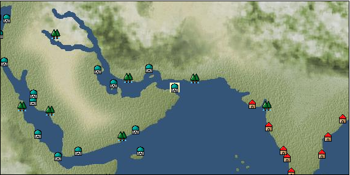

# Port: マスカット

import Tabs from '@theme/Tabs';
import TabItem from '@theme/TabItem';

## General Information

| Attribute | Details |
| :--- | :--- |
| **Port Name** | muscat |
| **Port Type** | port of alliance |
| **Region** | Eastern Africa/India |
| **Sea Area** | persian gulf |
| **Required Language** | arabic |
| **Coordinates** | （2698，3854） |
| **Investment Reward** | [Collection of famous dishes from the Indian Ocean](Items/Recipe Book/item_735.md) （必要投資額：800,000ドゥカード） |

### Available Facilities

| guild | intermediary | exchange | tool shop | workshop craftsman | Painter | sculptor | peddler |
| --- | --- | --- | --- | --- | --- | --- | --- |
|   |   | ○ | ○ | ○ | ○ |   | ○ |
| Shipyard Master | Lumbermaker | Sail-maker | weapon craftsman | master | TavernFemale | archive | salesperson |
| --- | --- | --- | --- | --- | --- | --- | --- |
| ○ | ○ | ○ |   | ○ |   |   |   |
| Shipwright | 銀行 | street worker | 王宮 | Trading post | church | suburbs | translator |
| --- | --- | --- | --- | --- | --- | --- | --- |
| ○ | ○ | ○ |   |   | ○ |   |   |

### Description
A city located between the Persian Gulf and the Arabian Sea. It has been an important port and prosperous trade center since ancient times. In addition to agricultural products unique to this region, ore and weapons are also distributed. Cultural area: Arab

<Tabs>
  <TabItem value="trade_goods_sales" label="Trade Goods Sales">

| item | group | purchase price | 同盟時 | remarks |
| --- | --- | --- | --- | --- |
| [Sesame](Items/Trade Goods/TradeGoods-Spices/item_437.md) | [Trading Goods (Spices)](Categories/category_12.md) | 180 | 192 |  |
| [camel hair](Items/Trade Goods/TradeGoods-Fibers/item_577.md) | [交易品（繊維）](Categories/category_1.md) | 392 | (343) |  |
| [lemon oil](Items/Trade Goods/TradeGoods-Perfume/item_151.md) | [Trading Goods (Spices)](Categories/category_11.md) | 538 | (471) |  |
| [mastic](Items/Trade Goods/TradeGoods-Perfume/item_680.md) | [Trading Goods (Spices)](Categories/category_11.md) | 1,497 | (1,310) |  |
| [zinc ore](Items/Trade Goods/TradeGoods-Minerals/item_626.md) | [Trading Items (Iron Stone)](Categories/category_7.md) | 383 | (336) |  |
| [malachite](Items/Trade Goods/TradeGoods-Gems/item_679.md) | [Trading Items (Gemstones)](Categories/category_15.md) | 1,882 | (1,647) |  |
| [scimitar](Items/Trade Goods/TradeGoods-Weapons/item_142.md) | [Trading Items (Arms)](Categories/category_16.md) | 993 | (869) |  |
| 要投資（必要投資額：180,000） |
| [copper ore](Items/Trade Goods/TradeGoods-Minerals/item_65.md) | [Trading Items (Iron Stone)](Categories/category_7.md) | 789 | (691) |  |
| [魚肉](Items/Trade Goods/TradeGoods-Foodstuffs/item_10.md) | [Trading items (food items)](Categories/category_3.md) | 146 | 131 |  |
  </TabItem>
  <TabItem value="sale_specialty" label="Sale (Specialty)">

| item | group | sale price | 同盟時 | remarks |
| --- | --- | --- | --- | --- |

#### [Trading Goods (Dye)](Categories/category_2.md)

| [Indian Akane](Items/Trade Goods/TradeGoods-Dye/item_1037.md) | [Trading Goods (Dye)](Categories/category_2.md) | 699 | (786) |  |
| [Indian indigo](Items/Trade Goods/TradeGoods-Dye/item_157.md) | [Trading Goods (Dye)](Categories/category_2.md) | 707 | (795) |  |
| [ward](Items/Trade Goods/TradeGoods-Dye/item_57.md) | [Trading Goods (Dye)](Categories/category_2.md) | 1,874 | (2,108) |  |
| [Safflower](Items/Trade Goods/TradeGoods-Dye/item_1059.md) | [Trading Goods (Dye)](Categories/category_2.md) | 900 | (1,012) |  |

#### [交易品（調味料）](Categories/category_4.md)

| [apple cider vinegar](Items/Trade Goods/TradeGoods-Seasonings/item_882.md) | [交易品（調味料）](Categories/category_4.md) | 770 | (866) |  |

#### [Trading products (medical products)](Categories/category_6.md)

| [Borei](Items/Trade Goods/TradeGoods-Medicine/item_3678.md) | [Trading products (medical products)](Categories/category_6.md) | 19,351 | (21,771) |  |
| [Nothing](Items/Trade Goods/TradeGoods-Medicine/item_1053.md) | [Trading products (medical products)](Categories/category_6.md) | 1,070 | (1,203) |  |

#### [Trading goods (hobby goods)](Categories/category_10.md)

| [banana](Items/Trade Goods/TradeGoods-Sunddries/item_1947.md) | [Trading goods (hobby goods)](Categories/category_10.md) | 292 | (328) |  |
| [prune](Items/Trade Goods/TradeGoods-Sunddries/item_523.md) | [Trading goods (hobby goods)](Categories/category_10.md) | 712 | (801) |  |
| [dried figs](Items/Trade Goods/TradeGoods-Sunddries/item_611.md) | [Trading goods (hobby goods)](Categories/category_10.md) | 682 | (767) |  |
| [dried apple](Items/Trade Goods/TradeGoods-Sunddries/item_19.md) | [Trading goods (hobby goods)](Categories/category_10.md) | 571 | (642) |  |
| [black tea](Items/Trade Goods/TradeGoods-Sunddries/item_675.md) | [Trading goods (hobby goods)](Categories/category_10.md) | 823 | (925) |  |
| [raspberry](Items/Trade Goods/TradeGoods-Sunddries/item_5419.md) | [Trading goods (hobby goods)](Categories/category_10.md) | (2,977) | 3,473 |  |

#### [Trading Goods (Spices)](Categories/category_11.md)

| [oakmoss](Items/Trade Goods/TradeGoods-Perfume/item_819.md) | [Trading Goods (Spices)](Categories/category_11.md) | 1,215 | (1,367) |  |
| [jasmine](Items/Trade Goods/TradeGoods-Perfume/item_772.md) | [Trading Goods (Spices)](Categories/category_11.md) | 3,916 | (4,405) |  |
| [daffodil](Items/Trade Goods/TradeGoods-Perfume/item_612.md) | [Trading Goods (Spices)](Categories/category_11.md) | 1,320 | (1,485) |  |
| [lily of the valley](Items/Trade Goods/TradeGoods-Perfume/item_358.md) | [Trading Goods (Spices)](Categories/category_11.md) | 2,050 | (2,306) |  |
| [geranium](Items/Trade Goods/TradeGoods-Perfume/item_145.md) | [Trading Goods (Spices)](Categories/category_11.md) | 1,250 | (1,406) |  |
| [lira](Items/Trade Goods/TradeGoods-Perfume/item_30.md) | [Trading Goods (Spices)](Categories/category_11.md) | 1,394 | (1,568) |  |
| [sandalwood](Items/Trade Goods/TradeGoods-Perfume/item_771.md) | [Trading Goods (Spices)](Categories/category_11.md) | 2,740 | 2,875 |  |

#### [Trading Goods (Spices)](Categories/category_12.md)

| [pepper](Items/Trade Goods/TradeGoods-Spices/item_58.md) | [Trading Goods (Spices)](Categories/category_12.md) | 460 | (517) |  |
| [saffron](Items/Trade Goods/TradeGoods-Spices/item_845.md) | [Trading Goods (Spices)](Categories/category_12.md) | 5,034 | (5,663) |  |

#### [Trading goods (artificial goods)](Categories/category_13.md)

| [glasswork](Items/Trade Goods/TradeGoods-Luxuries/item_60.md) | [Trading goods (artificial goods)](Categories/category_13.md) | 2,260 | (2,542) |  |

#### [Trading Items (Gemstones)](Categories/category_15.md)

| [aventurine](Items/Trade Goods/TradeGoods-Gems/item_678.md) | [Trading Items (Gemstones)](Categories/category_15.md) | 2,090 | 2,172 |  |
| [sapphire](Items/Trade Goods/TradeGoods-Gems/item_676.md) | [Trading Items (Gemstones)](Categories/category_15.md) | 4,560 | (5,130) |  |
| [diamond](Items/Trade Goods/TradeGoods-Gems/item_449.md) | [Trading Items (Gemstones)](Categories/category_15.md) | 4,550 | (5,119) |  |
| [ruby](Items/Trade Goods/TradeGoods-Gems/item_773.md) | [Trading Items (Gemstones)](Categories/category_15.md) | 4,634 | (5,213) |  |

#### [Trading Items (Arms)](Categories/category_16.md)

| [crossbow](Items/Trade Goods/TradeGoods-Weapons/item_537.md) | [Trading Items (Arms)](Categories/category_16.md) | 1,600 | (1,800) |  |

#### [Trading Items (Firearms)](Categories/category_17.md)

| [musket gun](Items/Trade Goods/TradeGoods-Firearms/item_584.md) | [Trading Items (Firearms)](Categories/category_17.md) | 4,917 | (5,532) |  |

#### [交易品（工業品）](Categories/category_19.md)

| [papyrus](Items/Trade Goods/TradeGoods-Wares/item_616.md) | [交易品（工業品）](Categories/category_19.md) | 698 | (785) |  |
| [羊皮紙](Items/Trade Goods/TradeGoods-Wares/item_53.md) | [交易品（工業品）](Categories/category_19.md) | 1,957 | (2,201) |  |

#### [交易品（織物）](Categories/category_20.md)

| [indian chintz](Items/Trade Goods/TradeGoods-Fabrics/item_159.md) | [交易品（織物）](Categories/category_20.md) | 1,120 | (1,260) |  |
| [dutch calico](Items/Trade Goods/TradeGoods-Fabrics/item_1435.md) | [交易品（織物）](Categories/category_20.md) | 2,220 | 2,363 |  |
| [turkish rug](Items/Trade Goods/TradeGoods-Fabrics/item_686.md) | [交易品（織物）](Categories/category_20.md) | 7,068 | (7,952) |  |
| [flannel](Items/Trade Goods/TradeGoods-Fabrics/item_149.md) | [交易品（織物）](Categories/category_20.md) | 2,095 | 2,300 |  |
| [velvet](Items/Trade Goods/TradeGoods-Fabrics/item_902.md) | [交易品（織物）](Categories/category_20.md) | 6,228 | (7,007) |  |
  </TabItem>
  <TabItem value="sale_no_specialty" label="Sale (No Specialty)">

| item | group | sale price | 同盟時 | remarks |
| --- | --- | --- | --- | --- |

#### [交易品（繊維）](Categories/category_1.md)

| [coconut fiber](Items/Trade Goods/TradeGoods-Fibers/item_444.md) | [交易品（繊維）](Categories/category_1.md) | 208 | (234) |  |
| [raw silk](Items/Trade Goods/TradeGoods-Fibers/item_677.md) | [交易品（繊維）](Categories/category_1.md) | 2,367 | (2,663) |  |
| [leather](Items/Trade Goods/TradeGoods-Fibers/item_44.md) | [交易品（繊維）](Categories/category_1.md) | 501 | (563) |  |
| [cotton](Items/Trade Goods/TradeGoods-Fibers/item_610.md) | [交易品（繊維）](Categories/category_1.md) | 355 | (399) |  |

#### [Trading items (food items)](Categories/category_3.md)

| [sugar cane](Items/Trade Goods/TradeGoods-Foodstuffs/item_93.md) | [Trading items (food items)](Categories/category_3.md) | 240 | (270) |  |
| [milk](Items/Trade Goods/TradeGoods-Foodstuffs/item_254.md) | [Trading items (food items)](Categories/category_3.md) | (127) | 148 |  |
| [mutton](Items/Trade Goods/TradeGoods-Foodstuffs/item_33.md) | [Trading items (food items)](Categories/category_3.md) | 428 | (481) |  |

#### [交易品（調味料）](Categories/category_4.md)

| [tamarind](Items/Trade Goods/TradeGoods-Seasonings/item_1968.md) | [交易品（調味料）](Categories/category_4.md) | 1,080 | (1,215) |  |
| [sugar](Items/Trade Goods/TradeGoods-Seasonings/item_94.md) | [交易品（調味料）](Categories/category_4.md) | 838 | (942) |  |

#### [Trading products (medical products)](Categories/category_6.md)

| [chamomile](Items/Trade Goods/TradeGoods-Medicine/item_292.md) | [Trading products (medical products)](Categories/category_6.md) | 731 | (822) |  |
| [belladonna](Items/Trade Goods/TradeGoods-Medicine/item_1056.md) | [Trading products (medical products)](Categories/category_6.md) | 606 | (681) |  |

#### [Trading Items (Iron Stone)](Categories/category_7.md)

| [copper ore](Items/Trade Goods/TradeGoods-Minerals/item_65.md) | [Trading Items (Iron Stone)](Categories/category_7.md) | 346 | (389) |  |

#### [Trading products (precious metals)](Categories/category_8.md)

| [platinum](Items/Trade Goods/TradeGoods-Metals/item_2178.md) | [Trading products (precious metals)](Categories/category_8.md) | 4,960 | (5,580) |  |
| [gold dust](Items/Trade Goods/TradeGoods-Metals/item_111.md) | [Trading products (precious metals)](Categories/category_8.md) | 4,460 | (5,017) |  |
| [gold](Items/Trade Goods/TradeGoods-Metals/item_659.md) | [Trading products (precious metals)](Categories/category_8.md) | 4,958 | (5,578) |  |
| [silver](Items/Trade Goods/TradeGoods-Metals/item_136.md) | [Trading products (precious metals)](Categories/category_8.md) | 2,900 | (3,262) |  |
| Sale 100% confirmed |

#### [Trading goods (hobby goods)](Categories/category_10.md)

| [coffee](Items/Trade Goods/TradeGoods-Sunddries/item_445.md) | [Trading goods (hobby goods)](Categories/category_10.md) | 488 | (549) |  |
| [papaya](Items/Trade Goods/TradeGoods-Sunddries/item_1948.md) | [Trading goods (hobby goods)](Categories/category_10.md) | 418 | (470) |  |

#### [Trading Goods (Spices)](Categories/category_11.md)

| [ylang ylang](Items/Trade Goods/TradeGoods-Perfume/item_1434.md) | [Trading Goods (Spices)](Categories/category_11.md) | 917 | (1,031) |  |
| [orange oil](Items/Trade Goods/TradeGoods-Perfume/item_778.md) | [Trading Goods (Spices)](Categories/category_11.md) | 610 | (686) |  |
| [civet](Items/Trade Goods/TradeGoods-Perfume/item_808.md) | [Trading Goods (Spices)](Categories/category_11.md) | 2,845 | (3,200) |  |
| [mastic](Items/Trade Goods/TradeGoods-Perfume/item_680.md) | [Trading Goods (Spices)](Categories/category_11.md) | 656 | (738) |  |
| [Ryushu incense](Items/Trade Goods/TradeGoods-Perfume/item_101.md) | [Trading Goods (Spices)](Categories/category_11.md) | 2,850 | (3,206) |  |
| [貝甲香](Items/Trade Goods/TradeGoods-Perfume/item_776.md) | [Trading Goods (Spices)](Categories/category_11.md) | 1,198 | (1,347) |  |
| Sale 100% confirmed |
| [Musk](Items/Trade Goods/TradeGoods-Perfume/item_158.md) | [Trading Goods (Spices)](Categories/category_11.md) | 3,775 | (4,247) |  |

#### [Trading Goods (Spices)](Categories/category_12.md)

| [cinnamon](Items/Trade Goods/TradeGoods-Spices/item_1432.md) | [Trading Goods (Spices)](Categories/category_12.md) | 668 | (751) |  |
| [ginger](Items/Trade Goods/TradeGoods-Spices/item_112.md) | [Trading Goods (Spices)](Categories/category_12.md) | 331 | (372) |  |
| [mustard](Items/Trade Goods/TradeGoods-Spices/item_575.md) | [Trading Goods (Spices)](Categories/category_12.md) | 298 | (335) |  |
| [mint](Items/Trade Goods/TradeGoods-Spices/item_816.md) | [Trading Goods (Spices)](Categories/category_12.md) | 130 | (146) |  |

#### [Trading goods (artificial goods)](Categories/category_13.md)

| [goldsmith](Items/Trade Goods/TradeGoods-Luxuries/item_687.md) | [Trading goods (artificial goods)](Categories/category_13.md) | 5,340 | (6,008) |  |
| [silversmith](Items/Trade Goods/TradeGoods-Luxuries/item_619.md) | [Trading goods (artificial goods)](Categories/category_13.md) | 5,260 | (5,918) |  |
| [ceramics](Items/Trade Goods/TradeGoods-Luxuries/item_152.md) | [Trading goods (artificial goods)](Categories/category_13.md) | 1,649 | (1,855) |  |

#### [交易品（美術品）](Categories/category_14.md)

| [古美術品](Items/Trade Goods/TradeGoods-Art/item_51.md) | [交易品（美術品）](Categories/category_14.md) | 4,030 | (4,534) |  |

#### [Trading Items (Gemstones)](Categories/category_15.md)

| [emerald](Items/Trade Goods/TradeGoods-Gems/item_777.md) | [Trading Items (Gemstones)](Categories/category_15.md) | 3,807 | (4,283) |  |
| [cat's eye](Items/Trade Goods/TradeGoods-Gems/item_1047.md) | [Trading Items (Gemstones)](Categories/category_15.md) | 3,370 | (3,791) |  |
| [turquoise](Items/Trade Goods/TradeGoods-Gems/item_1006.md) | [Trading Items (Gemstones)](Categories/category_15.md) | 1,369 | (1,540) |  |
| [lapis lazuli](Items/Trade Goods/TradeGoods-Gems/item_995.md) | [Trading Items (Gemstones)](Categories/category_15.md) | 2,664 | (2,997) |  |
| [ivory](Items/Trade Goods/TradeGoods-Gems/item_699.md) | [Trading Items (Gemstones)](Categories/category_15.md) | 2,130 | (2,396) |  |

#### [Trading Items (Firearms)](Categories/category_17.md)

| [arquebus gun](Items/Trade Goods/TradeGoods-Firearms/item_14.md) | [Trading Items (Firearms)](Categories/category_17.md) | 2,486 | (2,797) |  |
| [大砲](Items/Trade Goods/TradeGoods-Firearms/item_4.md) | [Trading Items (Firearms)](Categories/category_17.md) | 4,830 | (5,434) |  |
| [bullet](Items/Trade Goods/TradeGoods-Firearms/item_13.md) | [Trading Items (Firearms)](Categories/category_17.md) | 1,304 | (1,467) |  |

#### [Trading Goods (Livestock)](Categories/category_18.md)

| [cow](Items/Trade Goods/TradeGoods-Livestock/item_17.md) | [Trading Goods (Livestock)](Categories/category_18.md) | 340 | (382) |  |

#### [交易品（工業品）](Categories/category_19.md)

| [Stone](Items/Trade Goods/TradeGoods-Wares/item_276.md) | [交易品（工業品）](Categories/category_19.md) | 914 | (1,028) |  |
| [oil](Items/Trade Goods/TradeGoods-Wares/item_613.md) | [交易品（工業品）](Categories/category_19.md) | 527 | (592) |  |
| [paper](Items/Trade Goods/TradeGoods-Wares/item_625.md) | [交易品（工業品）](Categories/category_19.md) | 359 | (403) |  |

#### [交易品（織物）](Categories/category_20.md)

| [tweed](Items/Trade Goods/TradeGoods-Fabrics/item_31.md) | [交易品（織物）](Categories/category_20.md) | 1,569 | (1,765) |  |
| [persian rug](Items/Trade Goods/TradeGoods-Fabrics/item_606.md) | [交易品（織物）](Categories/category_20.md) | 4,541 | (5,109) |  |
| [cotton fabric](Items/Trade Goods/TradeGoods-Fabrics/item_571.md) | [交易品（織物）](Categories/category_20.md) | 811 | (912) |  |
  </TabItem>
  <TabItem value="guild_&_others" label="Guild & Others">

| item | group | Sales price | Handling NPC | remarks |
| --- | --- | --- | --- | --- |

#### Al Ghauri

| [How to make a dictionary of Semitic and Hamitic languages](Items/Recipe Book/item_1946.md) | [recipe book](Categories/category_22.md) | Fixed recipe | Al Ghauri |  |
| [行軍](Skills/Skill-Adventure/item_461.md) | [Skill (adventure)](Categories/category_39.md) | 3,000 | Al Ghauri |  |
| [Indian languages](Skills/Skills-Language/item_590.md) | [Skills (language)](Categories/category_42.md) | 30,000 | Al Ghauri |  |
  </TabItem>
  <TabItem value="toolman" label="Toolman">

| item | group | Sales price | Handling NPC | remarks |
| --- | --- | --- | --- | --- |

#### [Equipment (body)](Categories/category_24.md)

| [mitrah](Items/Equipment/Equipment-Body/item_913.md) | [Equipment (body)](Categories/category_24.md) | 304,600 | tool shop owner |  |
| 要投資（必要投資額：240,000） |

#### [装備品（服飾品）](Categories/category_28.md)

| [malachite brooch](Items/Equipment/Equipment-Accessory/item_914.md) | [装備品（服飾品）](Categories/category_28.md) | 6,000,000 | tool shop owner |  |
| 要投資（必要投資額：120,000） |
| [malachite ring](Items/Equipment/Equipment-Accessory/item_915.md) | [装備品（服飾品）](Categories/category_28.md) | 7,000,000 | tool shop owner |  |
| 要投資（必要投資額：180,000） |
| [malachite earrings](Items/Equipment/Equipment-Accessory/item_786.md) | [装備品（服飾品）](Categories/category_28.md) | 4,000,000 | tool shop owner |  |
| [malachite necklace](Items/Equipment/Equipment-Accessory/item_916.md) | [装備品（服飾品）](Categories/category_28.md) | 8,000,000 | tool shop owner |  |
| 要投資（必要投資額：180,000） |
| [malachite hair ornament](Items/Equipment/Equipment-Accessory/item_917.md) | [装備品（服飾品）](Categories/category_28.md) | 5,000,000 | tool shop owner |  |
| 要投資（必要投資額：120,000） |

#### [Consumables (land battle/deck battle)](Categories/category_29.md)

| [numbness medicine](Items/Consumables/Consumables-Landbattle/item_452.md) | [Consumables (land battle/deck battle)](Categories/category_29.md) | 500 | tool shop owner |  |
| [strong adhesive oil](Items/Consumables/Consumables-Landbattle/item_662.md) | [Consumables (land battle/deck battle)](Categories/category_29.md) | 200 | tool shop owner |  |
| [hellfire torch](Items/Consumables/Consumables-Landbattle/item_233.md) | [Consumables (land battle/deck battle)](Categories/category_29.md) | 300 | tool shop owner |  |

#### [Consumables (naval/hand-to-hand combat)](Categories/category_30.md)

| [strange smell](Items/Consumables/Consumables-navalhand-to-hand combat/item_809.md) | [Consumables (naval/hand-to-hand combat)](Categories/category_30.md) | 3,000 | tool shop owner |  |

#### [Consumables (request documents)](Categories/category_45.md)

| [Precious metal purchase order](Items/Consumables/Consumables-Documents/item_4916.md) | [Consumables (request documents)](Categories/category_45.md) | 60,000 | tool shop owner |  |
  </TabItem>
  <TabItem value="kobo_craftsmen" label="Craftsman">

| item | group | Sales price | Handling NPC | remarks |
| --- | --- | --- | --- | --- |

#### [Consumables (condition recovery)](Categories/category_21.md)

| [cat figurine](Items/Consumables/Consumables-Recovery/item_588.md) | [Consumables (condition recovery)](Categories/category_21.md) | 14,500 | workshop craftsman |  |
| [Nostalgic carillon bell](Items/Consumables/Consumables-Recovery/item_245.md) | [Consumables (condition recovery)](Categories/category_21.md) | 200 | workshop craftsman |  |
| [Ship song sheet music](Items/Consumables/Consumables-Recovery/item_247.md) | [Consumables (condition recovery)](Categories/category_21.md) | 200 | workshop craftsman |  |
  </TabItem>
  <TabItem value="Painter" label="Painter">

| item | group | Sales price | Handling NPC | remarks |
| --- | --- | --- | --- | --- |

#### [Ship parts (emblem)](Categories/category_36.md)

| [admiral](Items/Ship Parts/Shipparts-Crests/item_548.md) | [Ship parts (emblem)](Categories/category_36.md) | 5,000 | Painter |  |
| [anchor](Items/Ship Parts/Shipparts-Crests/item_549.md) | [Ship parts (emblem)](Categories/category_36.md) | 5,000 | Painter |  |
| [ape](Items/Ship Parts/Shipparts-Crests/item_793.md) | [Ship parts (emblem)](Categories/category_36.md) | 5,000 | Painter |  |
| [sunshine](Items/Ship Parts/Shipparts-Crests/item_810.md) | [Ship parts (emblem)](Categories/category_36.md) | 5,000 | Painter |  |
| [circle cross](Items/Ship Parts/Shipparts-Crests/item_544.md) | [Ship parts (emblem)](Categories/category_36.md) | 5,000 | Painter |  |
| [Delphine](Items/Ship Parts/Shipparts-Crests/item_542.md) | [Ship parts (emblem)](Categories/category_36.md) | 5,000 | Painter |  |
| [butterfly](Items/Ship Parts/Shipparts-Crests/item_547.md) | [Ship parts (emblem)](Categories/category_36.md) | 5,000 | Painter |  |
| [fisherman](Items/Ship Parts/Shipparts-Crests/item_545.md) | [Ship parts (emblem)](Categories/category_36.md) | 5,000 | Painter |  |
  </TabItem>
  <TabItem value="peddler" label="peddler">

| item | group | Sales price | Handling NPC | remarks |
| --- | --- | --- | --- | --- |

#### [Consumables (condition recovery)](Categories/category_21.md)

| [spare sail](Items/Consumables/Consumables-Recovery/item_242.md) | [Consumables (condition recovery)](Categories/category_21.md) |  | peddler |  |
| [reserve rudder](Items/Consumables/Consumables-Recovery/item_243.md) | [Consumables (condition recovery)](Categories/category_21.md) |  | peddler |  |
| [sleep hammock](Items/Consumables/Consumables-Recovery/item_73.md) | [Consumables (condition recovery)](Categories/category_21.md) |  | peddler |  |
| [hand bucket](Items/Consumables/Consumables-Recovery/item_69.md) | [Consumables (condition recovery)](Categories/category_21.md) |  | peddler |  |
| [cotton earplugs](Items/Consumables/Consumables-Recovery/item_85.md) | [Consumables (condition recovery)](Categories/category_21.md) |  | peddler |  |

#### [Consumables (land battle/deck battle)](Categories/category_29.md)

| [煙玉](Items/Consumables/Consumables-Landbattle/item_86.md) | [Consumables (land battle/deck battle)](Categories/category_29.md) |  | peddler |  |
| [explosive drug](Items/Consumables/Consumables-Landbattle/item_2493.md) | [Consumables (land battle/deck battle)](Categories/category_29.md) |  | peddler |  |

#### [Consumables (skill activation)](Categories/category_31.md)

| [landmark ribbon](Items/Consumables/Consumables-Skill/item_316.md) | [Consumables (skill activation)](Categories/category_31.md) |  | peddler |  |
  </TabItem>
  <TabItem value="shipyard" label="Shipyard">

### Shipyard Master

| item | group | Sales price | Handling NPC | remarks |
| --- | --- | --- | --- | --- |

#### [Boat](Categories/category_43.md)

| [arabian galley](Items/Ships/item_592.md) | [Boat](Categories/category_43.md) | 3,840,000 | Shipyard Master |  |
| [Galliot](Items/Ships/item_210.md) | [Boat](Categories/category_43.md) | 156,000 | Shipyard Master |  |
| [galley](Items/Ships/item_227.md) | [Boat](Categories/category_43.md) | 645,000 | Shipyard Master |  |
| [sambouk](Items/Ships/item_783.md) | [Boat](Categories/category_43.md) | 1,000,000 | Shipyard Master |  |
| [Xebec](Items/Ships/item_799.md) | [Boat](Categories/category_43.md) | 2,900,000 | Shipyard Master |  |
| [Dow](Items/Ships/item_780.md) | [Boat](Categories/category_43.md) | 360,000 | Shipyard Master |  |
| [Varsha](Items/Ships/item_201.md) | [Boat](Categories/category_43.md) | 2,000 | Shipyard Master |  |
| [commercial galley](Items/Ships/item_229.md) | [Boat](Categories/category_43.md) | 650,000 | Shipyard Master |  |
| [commercial thumb book](Items/Ships/item_785.md) | [Boat](Categories/category_43.md) | 1,100,000 | Shipyard Master |  |
| [commercial xebec](Items/Ships/item_800.md) | [Boat](Categories/category_43.md) | 2,960,000 | Shipyard Master |  |
| [commercial dow](Items/Ships/item_782.md) | [Boat](Categories/category_43.md) | 372,000 | Shipyard Master |  |
| [assault galley](Items/Ships/item_224.md) | [Boat](Categories/category_43.md) | 640,000 | Shipyard Master |  |
| [Battle Barsha](Items/Ships/item_203.md) | [Boat](Categories/category_43.md) | 5,100 | Shipyard Master |  |
| [exploration barsha](Items/Ships/item_202.md) | [Boat](Categories/category_43.md) | 5,000 | Shipyard Master |  |
| [Armed Sambouk](Items/Ships/item_784.md) | [Boat](Categories/category_43.md) | 1,000,000 | Shipyard Master |  |
| [Armed Xebec](Items/Ships/item_801.md) | [Boat](Categories/category_43.md) | 3,000,000 | Shipyard Master |  |
| [assault dhow](Items/Ships/item_781.md) | [Boat](Categories/category_43.md) | 365,000 | Shipyard Master |  |
| [light galley](Items/Ships/item_209.md) | [Boat](Categories/category_43.md) | 150,000 | Shipyard Master |  |
| [transportation galley](Items/Ships/item_211.md) | [Boat](Categories/category_43.md) | 160,000 | Shipyard Master |  |

### Lumbermaker

| item | group | Sales price | Handling NPC | remarks |
| --- | --- | --- | --- | --- |

#### [Ship parts (additional armor)](Categories/category_35.md)

| [elm board](Items/Ship Parts/Shipparts-Plates/item_328.md) | [Ship parts (additional armor)](Categories/category_35.md) | 13,000 | Lumbermaker |  |
| [cedar board](Items/Ship Parts/Shipparts-Plates/item_353.md) | [Ship parts (additional armor)](Categories/category_35.md) | 800 | Lumbermaker |  |
| [teak board](Items/Ship Parts/Shipparts-Plates/item_813.md) | [Ship parts (additional armor)](Categories/category_35.md) | 22,000 | Lumbermaker |  |
| [mahogany board](Items/Ship Parts/Shipparts-Plates/item_814.md) | [Ship parts (additional armor)](Categories/category_35.md) | 51,000 | Lumbermaker |  |
| [rosewood plank](Items/Ship Parts/Shipparts-Plates/item_815.md) | [Ship parts (additional armor)](Categories/category_35.md) | 100,000 | Lumbermaker |  |
| [simple beach board](Items/Ship Parts/Shipparts-Plates/item_812.md) | [Ship parts (additional armor)](Categories/category_35.md) | 2,200 | Lumbermaker |  |
| [Simple red pine board](Items/Ship Parts/Shipparts-Plates/item_811.md) | [Ship parts (additional armor)](Categories/category_35.md) | 500 | Lumbermaker |  |

### Sail-maker

| item | group | Sales price | Handling NPC | remarks |
| --- | --- | --- | --- | --- |

#### [Ship parts (auxiliary sails)](Categories/category_33.md)

| [outer jib](Items/Ship Parts/Shipparts-Studding-Sail/item_331.md) | [Ship parts (auxiliary sails)](Categories/category_33.md) | 18,000 | Sail-maker |  |
| [Outer & inner jib](Items/Ship Parts/Shipparts-Studding-Sail/item_332.md) | [Ship parts (auxiliary sails)](Categories/category_33.md) | 23,000 | Sail-maker |  |
| [inner jib](Items/Ship Parts/Shipparts-Studding-Sail/item_279.md) | [Ship parts (auxiliary sails)](Categories/category_33.md) | 1,700 | Sail-maker |  |
| [Vorgernstaisl](Items/Ship Parts/Shipparts-Studding-Sail/item_333.md) | [Ship parts (auxiliary sails)](Categories/category_33.md) | 22,000 | Sail-maker |  |
| [Vorgeln bonnet](Items/Ship Parts/Shipparts-Studding-Sail/item_929.md) | [Ship parts (auxiliary sails)](Categories/category_33.md) | 110,000 | Sail-maker |  |
| [Forestaisle](Items/Ship Parts/Shipparts-Studding-Sail/item_280.md) | [Ship parts (auxiliary sails)](Categories/category_33.md) | 8,300 | Sail-maker |  |
| [Foretop Gernsur](Items/Ship Parts/Shipparts-Studding-Sail/item_282.md) | [Ship parts (auxiliary sails)](Categories/category_33.md) | 2,400 | Sail-maker |  |
| [Foretop staysle](Items/Ship Parts/Shipparts-Studding-Sail/item_357.md) | [Ship parts (auxiliary sails)](Categories/category_33.md) | 29,000 | Sail-maker |  |
| [Foretop Royal Sur](Items/Ship Parts/Shipparts-Studding-Sail/item_403.md) | [Ship parts (auxiliary sails)](Categories/category_33.md) | 48,000 | Sail-maker |  |
| [Foreroyalgernsl](Items/Ship Parts/Shipparts-Studding-Sail/item_330.md) | [Ship parts (auxiliary sails)](Categories/category_33.md) | 26,000 | Sail-maker |  |
| [Fore Royal Stains](Items/Ship Parts/Shipparts-Studding-Sail/item_931.md) | [Ship parts (auxiliary sails)](Categories/category_33.md) | 70,000 | Sail-maker |  |
| [flying outer jib](Items/Ship Parts/Shipparts-Studding-Sail/item_400.md) | [Ship parts (auxiliary sails)](Categories/category_33.md) | 49,000 | Sail-maker |  |
| [flying inner jib](Items/Ship Parts/Shipparts-Studding-Sail/item_401.md) | [Ship parts (auxiliary sails)](Categories/category_33.md) | 58,000 | Sail-maker |  |
| [bonnet](Items/Ship Parts/Shipparts-Studding-Sail/item_329.md) | [Ship parts (auxiliary sails)](Categories/category_33.md) | 25,000 | Sail-maker |  |
| [mizungernstaisl](Items/Ship Parts/Shipparts-Studding-Sail/item_334.md) | [Ship parts (auxiliary sails)](Categories/category_33.md) | 22,000 | Sail-maker |  |
| [Mizungern bonnet](Items/Ship Parts/Shipparts-Studding-Sail/item_930.md) | [Ship parts (auxiliary sails)](Categories/category_33.md) | 130,000 | Sail-maker |  |
| [mizzen staple](Items/Ship Parts/Shipparts-Studding-Sail/item_281.md) | [Ship parts (auxiliary sails)](Categories/category_33.md) | 11,000 | Sail-maker |  |
| [mizzen top gelrunsle](Items/Ship Parts/Shipparts-Studding-Sail/item_283.md) | [Ship parts (auxiliary sails)](Categories/category_33.md) | 4,200 | Sail-maker |  |
| [mizzen top staysle](Items/Ship Parts/Shipparts-Studding-Sail/item_402.md) | [Ship parts (auxiliary sails)](Categories/category_33.md) | 35,000 | Sail-maker |  |
| [Mizzen Top Royal Sur](Items/Ship Parts/Shipparts-Studding-Sail/item_404.md) | [Ship parts (auxiliary sails)](Categories/category_33.md) | 45,000 | Sail-maker |  |
| [mizzen royal gelrunsle](Items/Ship Parts/Shipparts-Studding-Sail/item_284.md) | [Ship parts (auxiliary sails)](Categories/category_33.md) | 21,000 | Sail-maker |  |
| [small inner jib](Items/Ship Parts/Shipparts-Studding-Sail/item_278.md) | [Ship parts (auxiliary sails)](Categories/category_33.md) | 500 | Sail-maker |  |
| [wide bonnet](Items/Ship Parts/Shipparts-Studding-Sail/item_356.md) | [Ship parts (auxiliary sails)](Categories/category_33.md) | 38,000 | Sail-maker |  |
  </TabItem>
</Tabs>