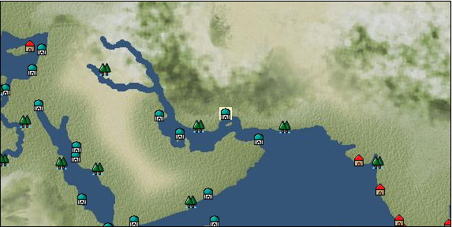

# Port: ホルムズ

import Tabs from '@theme/Tabs';
import TabItem from '@theme/TabItem';

## General Information

| Attribute | Details |
| :--- | :--- |
| **Port Name** | Holmes |
| **Port Type** | port of alliance |
| **Region** | Eastern Africa/India |
| **Sea Area** | persian gulf |
| **Required Language** | persian |
| **Coordinates** | （2532，3728） |
| **Investment Reward** | [jewelry cut blue calligraphy](Items/Recipe Book/item_1210.md) （必要投資額：2,000,000ドゥカード） |

### Available Facilities

| guild | intermediary | exchange | tool shop | workshop craftsman | Painter | sculptor | peddler |
| --- | --- | --- | --- | --- | --- | --- | --- |
|   |   | ○ | ○ | ○ | ○ |   |   |
| Shipyard Master | Lumbermaker | Sail-maker | weapon craftsman | master | TavernFemale | archive | salesperson |
| --- | --- | --- | --- | --- | --- | --- | --- |
| ○ |   |   | ○ | ○ |   |   |   |
| Shipwright | 銀行 | street worker | 王宮 | Trading post | church | suburbs | translator |
| --- | --- | --- | --- | --- | --- | --- | --- |
| ○ | ○ | ○ |   |   | ○ |   |   |

### Description
A city on the Strait of Homulz in the Persian Gulf. It has flourished since ancient times as an important point for maritime trade. Due to its importance, the ruling power has changed frequently. In addition to the thriving livestock industry, high-end Persian rugs and jewelry such as turquoise are sold here. Cultural area: Persia Disguise level 50 required

<Tabs>
  <TabItem value="trade_goods_sales" label="Trade Goods Sales">

| item | group | purchase price | 同盟時 | remarks |
| --- | --- | --- | --- | --- |
| [olive oil](Items/Trade Goods/TradeGoods-Seasonings/item_48.md) | [交易品（調味料）](Categories/category_4.md) | 314 | (275) |  |
| [ginger](Items/Trade Goods/TradeGoods-Spices/item_112.md) | [Trading Goods (Spices)](Categories/category_12.md) | 260 | (228) |  |
| [turquoise](Items/Trade Goods/TradeGoods-Gems/item_1006.md) | [Trading Items (Gemstones)](Categories/category_15.md) | 1,162 | (1,017) |  |
| 要投資（必要投資額：180,000） |
| [basil](Items/Trade Goods/TradeGoods-Spices/item_126.md) | [Trading Goods (Spices)](Categories/category_12.md) | 119 | (105) |  |
| [persian rug](Items/Trade Goods/TradeGoods-Fabrics/item_606.md) | [交易品（織物）](Categories/category_20.md) | 4,748 | (4,154) |  |
| [mint](Items/Trade Goods/TradeGoods-Spices/item_816.md) | [Trading Goods (Spices)](Categories/category_12.md) | 96 | (84) |  |
| [lapis lazuli](Items/Trade Goods/TradeGoods-Gems/item_995.md) | [Trading Items (Gemstones)](Categories/category_15.md) | 2,231 | (1,952) |  |
| 要投資（必要投資額：180,000） |
| [sugar](Items/Trade Goods/TradeGoods-Seasonings/item_94.md) | [交易品（調味料）](Categories/category_4.md) | 652 | (571) |  |
| [wool](Items/Trade Goods/TradeGoods-Fibers/item_5.md) | [交易品（繊維）](Categories/category_1.md) | 369 | (323) |  |
| [mutton](Items/Trade Goods/TradeGoods-Foodstuffs/item_33.md) | [Trading items (food items)](Categories/category_3.md) | 360 | (315) |  |
  </TabItem>
  <TabItem value="sale_specialty" label="Sale (Specialty)">

| item | group | sale price | 同盟時 | remarks |
| --- | --- | --- | --- | --- |

#### [Trading Goods (Dye)](Categories/category_2.md)

| [ward](Items/Trade Goods/TradeGoods-Dye/item_57.md) | Trading Goods (Dye) | 1,952 | (2,196) |  |
| [Safflower](Items/Trade Goods/TradeGoods-Dye/item_1059.md) | Trading Goods (Dye) | 939 | (1,056) |  |

#### [交易品（調味料）](Categories/category_4.md)

| [tamarind](Items/Trade Goods/TradeGoods-Seasonings/item_1968.md) | 交易品（調味料） | 1,142 | (1,284) |  |
| [apple cider vinegar](Items/Trade Goods/TradeGoods-Seasonings/item_882.md) | 交易品（調味料） | 813 | (914) |  |

#### [Trading products (medical products)](Categories/category_6.md)

| [Nothing](Items/Trade Goods/TradeGoods-Medicine/item_1053.md) | Trading products (medical products) | 1,143 | (1,286) |  |

#### [Trading goods (hobby goods)](Categories/category_10.md)

| [cacao](Items/Trade Goods/TradeGoods-Sunddries/item_140.md) | Trading goods (hobby goods) | 1,297 | (1,459) |  |
| [tobacco](Items/Trade Goods/TradeGoods-Sunddries/item_109.md) | Trading goods (hobby goods) | 1,524 | (1,714) |  |
| [banana](Items/Trade Goods/TradeGoods-Sunddries/item_1947.md) | Trading goods (hobby goods) | 285 | (320) |  |
| [prune](Items/Trade Goods/TradeGoods-Sunddries/item_523.md) | Trading goods (hobby goods) | 804 | (904) |  |
| [dried figs](Items/Trade Goods/TradeGoods-Sunddries/item_611.md) | Trading goods (hobby goods) | 673 | (757) |  |
| [dried apple](Items/Trade Goods/TradeGoods-Sunddries/item_19.md) | Trading goods (hobby goods) | 596 | (670) |  |
| [raspberry](Items/Trade Goods/TradeGoods-Sunddries/item_5419.md) | Trading goods (hobby goods) | (14,886) | 17,369 |  |

#### [Trading Goods (Spices)](Categories/category_11.md)

| [oakmoss](Items/Trade Goods/TradeGoods-Perfume/item_819.md) | Trading Goods (Spices) | 1,286 | (1,446) |  |
| [daffodil](Items/Trade Goods/TradeGoods-Perfume/item_612.md) | Trading Goods (Spices) | 1,353 | (1,522) |  |
| [lily of the valley](Items/Trade Goods/TradeGoods-Perfume/item_358.md) | Trading Goods (Spices) | 1,817 | (2,044) |  |
| [geranium](Items/Trade Goods/TradeGoods-Perfume/item_145.md) | Trading Goods (Spices) | 1,089 | (1,225) |  |
| [lira](Items/Trade Goods/TradeGoods-Perfume/item_30.md) | Trading Goods (Spices) | 1,680 | (1,890) |  |

#### [Trading Goods (Spices)](Categories/category_12.md)

| [saffron](Items/Trade Goods/TradeGoods-Spices/item_845.md) | Trading Goods (Spices) | 4,213 | (4,740) |  |

#### [Trading goods (artificial goods)](Categories/category_13.md)

| [glasswork](Items/Trade Goods/TradeGoods-Luxuries/item_60.md) | Trading goods (artificial goods) | 2,478 | (2,788) |  |

#### [Trading Items (Gemstones)](Categories/category_15.md)

| [inca rose](Items/Trade Goods/TradeGoods-Gems/item_3014.md) | Trading Items (Gemstones) | 10,776 | (12,124) |  |
| [diamond](Items/Trade Goods/TradeGoods-Gems/item_449.md) | Trading Items (Gemstones) | 4,610 | (5,186) |  |

#### [Trading Items (Arms)](Categories/category_16.md)

| [crossbow](Items/Trade Goods/TradeGoods-Weapons/item_537.md) | Trading Items (Arms) | 1,660 | (1,867) |  |

#### [Trading Items (Firearms)](Categories/category_17.md)

| [musket gun](Items/Trade Goods/TradeGoods-Firearms/item_584.md) | Trading Items (Firearms) | 5,089 | (5,725) |  |

#### [交易品（織物）](Categories/category_20.md)

| [dutch calico](Items/Trade Goods/TradeGoods-Fabrics/item_1435.md) | 交易品（織物） | 2,370 | (2,666) |  |
| [turkish rug](Items/Trade Goods/TradeGoods-Fabrics/item_686.md) | 交易品（織物） | (6,402) | 7,470 |  |
| [flannel](Items/Trade Goods/TradeGoods-Fabrics/item_149.md) | 交易品（織物） | 1,920 | (2,160) |  |
| [velvet](Items/Trade Goods/TradeGoods-Fabrics/item_902.md) | 交易品（織物） | (5,662) | 6,606 |  |
  </TabItem>
  <TabItem value="sale_no_specialty" label="Sale (No Specialty)">

| item | group | sale price | 同盟時 | remarks |
| --- | --- | --- | --- | --- |

#### [交易品（繊維）](Categories/category_1.md)

| [camel hair](Items/Trade Goods/TradeGoods-Fibers/item_577.md) | 交易品（繊維） | 501 | (563) |  |
| [leather](Items/Trade Goods/TradeGoods-Fibers/item_44.md) | 交易品（繊維） | 515 | (579) |  |
| [cotton](Items/Trade Goods/TradeGoods-Fibers/item_610.md) | 交易品（繊維） | 350 | (393) |  |

#### [Trading Goods (Dye)](Categories/category_2.md)

| [Indian Akane](Items/Trade Goods/TradeGoods-Dye/item_1037.md) | Trading Goods (Dye) | 562 | (632) |  |
| [Indian indigo](Items/Trade Goods/TradeGoods-Dye/item_157.md) | Trading Goods (Dye) | 568 | (639) |  |

#### [Trading items (food items)](Categories/category_3.md)

| [sugar cane](Items/Trade Goods/TradeGoods-Foodstuffs/item_93.md) | Trading items (food items) | 292 | (328) |  |
| [魚肉](Items/Trade Goods/TradeGoods-Foodstuffs/item_10.md) | Trading items (food items) | 184 | (207) |  |

#### [Trading products (medical products)](Categories/category_6.md)

| [chamomile](Items/Trade Goods/TradeGoods-Medicine/item_292.md) | Trading products (medical products) | 740 | (832) |  |

#### [Trading Items (Iron Stone)](Categories/category_7.md)

| [zinc ore](Items/Trade Goods/TradeGoods-Minerals/item_626.md) | Trading Items (Iron Stone) | 450 | (506) |  |

#### [Trading products (precious metals)](Categories/category_8.md)

| [gold](Items/Trade Goods/TradeGoods-Metals/item_659.md) | Trading products (precious metals) | 5,731 | (6,448) |  |
| [silver](Items/Trade Goods/TradeGoods-Metals/item_136.md) | Trading products (precious metals) | 2,920 | (3,285) |  |
| Sale 100% confirmed |

#### [Trading goods (hobby goods)](Categories/category_10.md)

| [coffee](Items/Trade Goods/TradeGoods-Sunddries/item_445.md) | Trading goods (hobby goods) | 547 | (615) |  |
| [papaya](Items/Trade Goods/TradeGoods-Sunddries/item_1948.md) | Trading goods (hobby goods) | 418 | (470) |  |
| [black tea](Items/Trade Goods/TradeGoods-Sunddries/item_675.md) | Trading goods (hobby goods) | 772 | (868) |  |

#### [Trading Goods (Spices)](Categories/category_11.md)

| [ylang ylang](Items/Trade Goods/TradeGoods-Perfume/item_1434.md) | Trading Goods (Spices) | 969 | (1,090) |  |
| [civet](Items/Trade Goods/TradeGoods-Perfume/item_808.md) | Trading Goods (Spices) | 2,929 | (3,295) |  |
| [jasmine](Items/Trade Goods/TradeGoods-Perfume/item_772.md) | Trading Goods (Spices) | 3,063 | (3,446) |  |
| [lemon oil](Items/Trade Goods/TradeGoods-Perfume/item_151.md) | Trading Goods (Spices) | 529 | (595) |  |
| [mastic](Items/Trade Goods/TradeGoods-Perfume/item_680.md) | Trading Goods (Spices) | 1,909 | (2,147) |  |
| [sandalwood](Items/Trade Goods/TradeGoods-Perfume/item_771.md) | Trading Goods (Spices) | 2,330 | (2,621) |  |
| [Ryushu incense](Items/Trade Goods/TradeGoods-Perfume/item_101.md) | Trading Goods (Spices) | 3,017 | (3,394) |  |
| [貝甲香](Items/Trade Goods/TradeGoods-Perfume/item_776.md) | Trading Goods (Spices) | 1,150 | (1,293) |  |
| [Musk](Items/Trade Goods/TradeGoods-Perfume/item_158.md) | Trading Goods (Spices) | 3,713 | (4,177) |  |

#### [Trading Goods (Spices)](Categories/category_12.md)

| [pepper](Items/Trade Goods/TradeGoods-Spices/item_58.md) | Trading Goods (Spices) | 404 | (454) |  |
| [Sesame](Items/Trade Goods/TradeGoods-Spices/item_437.md) | Trading Goods (Spices) | 283 | (318) |  |
| [cinnamon](Items/Trade Goods/TradeGoods-Spices/item_1432.md) | Trading Goods (Spices) | 611 | (687) |  |

#### [Trading goods (artificial goods)](Categories/category_13.md)

| [goldsmith](Items/Trade Goods/TradeGoods-Luxuries/item_687.md) | Trading goods (artificial goods) | 5,415 | (6,092) |  |
| [silversmith](Items/Trade Goods/TradeGoods-Luxuries/item_619.md) | Trading goods (artificial goods) | 5,290 | (5,951) |  |

#### [交易品（美術品）](Categories/category_14.md)

| [古美術品](Items/Trade Goods/TradeGoods-Art/item_51.md) | 交易品（美術品） | 4,120 | (4,635) |  |

#### [Trading Items (Gemstones)](Categories/category_15.md)

| [aventurine](Items/Trade Goods/TradeGoods-Gems/item_678.md) | Trading Items (Gemstones) | 1,980 | (2,227) |  |
| [emerald](Items/Trade Goods/TradeGoods-Gems/item_777.md) | Trading Items (Gemstones) | 3,825 | (4,303) |  |
| [cat's eye](Items/Trade Goods/TradeGoods-Gems/item_1047.md) | Trading Items (Gemstones) | 3,163 | (3,558) |  |
| [sapphire](Items/Trade Goods/TradeGoods-Gems/item_676.md) | Trading Items (Gemstones) | 4,090 | (4,601) |  |
| [ruby](Items/Trade Goods/TradeGoods-Gems/item_773.md) | Trading Items (Gemstones) | 4,293 | (4,830) |  |
| [ivory](Items/Trade Goods/TradeGoods-Gems/item_699.md) | Trading Items (Gemstones) | 2,130 | (2,396) |  |

#### [Trading Items (Firearms)](Categories/category_17.md)

| [arquebus gun](Items/Trade Goods/TradeGoods-Firearms/item_14.md) | Trading Items (Firearms) | 2,510 | (2,824) |  |
| [大砲](Items/Trade Goods/TradeGoods-Firearms/item_4.md) | Trading Items (Firearms) | 4,824 | (5,427) |  |
| [bullet](Items/Trade Goods/TradeGoods-Firearms/item_13.md) | Trading Items (Firearms) | 1,320 | (1,485) |  |
| [gunpowder](Items/Trade Goods/TradeGoods-Firearms/item_352.md) | Trading Items (Firearms) | 1,380 | (1,552) |  |

#### [交易品（工業品）](Categories/category_19.md)

| [Stone](Items/Trade Goods/TradeGoods-Wares/item_276.md) | 交易品（工業品） | 872 | (981) |  |
| [oil](Items/Trade Goods/TradeGoods-Wares/item_613.md) | 交易品（工業品） | 599 | (673) |  |
| [sulfur](Items/Trade Goods/TradeGoods-Wares/item_66.md) | 交易品（工業品） | 451 | (507) |  |
| [paper](Items/Trade Goods/TradeGoods-Wares/item_625.md) | 交易品（工業品） | 376 | (423) |  |

#### [交易品（織物）](Categories/category_20.md)

| [indian chintz](Items/Trade Goods/TradeGoods-Fabrics/item_159.md) | 交易品（織物） | 1,025 | (1,153) |  |
| [knit](Items/Trade Goods/TradeGoods-Fabrics/item_164.md) | 交易品（織物） | 656 | (738) |  |
| [woolen fabric](Items/Trade Goods/TradeGoods-Fabrics/item_163.md) | 交易品（織物） | 1,234 | (1,388) |  |
  </TabItem>
  <TabItem value="guild_&_others" label="Guild & Others">

| item | group | Sales price | Handling NPC | remarks |
| --- | --- | --- | --- | --- |

#### Allie Reis

| [How to make a dictionary of Indian Western languages](Items/Recipe Book/item_1976.md) | [recipe book](Categories/category_22.md) | Fixed recipe | Allie Reis |  |
| [Indian languages](Skills/Skills-Language/item_590.md) | [Skills (language)](Categories/category_42.md) | 30,000 | Allie Reis |  |
  </TabItem>
  <TabItem value="toolman" label="Toolman">

| item | group | Sales price | Handling NPC | remarks |
| --- | --- | --- | --- | --- |

#### [Equipment (head)](Categories/category_23.md)

| [hijab](Items/Equipment/Equipment-Head/item_805.md) | Equipment (head) | 33,200 | tool shop owner |  |

#### [Equipment (body)](Categories/category_24.md)

| [Chadli](Items/Equipment/Equipment-Body/item_694.md) | Equipment (body) | 84,700 | tool shop owner |  |
| [persian dress](Items/Equipment/Equipment-Body/item_1372.md) | Equipment (body) | 138,600 | tool shop owner |  |
| 要投資（必要投資額：240,000） |

#### [Equipment (belongings)](Categories/category_27.md)

| [Peshkad](Items/Equipment/Equipment-Weapon/item_2796.md) | Equipment (belongings) | 28,000 | tool shop owner |  |

#### [装備品（服飾品）](Categories/category_28.md)

| [turquoise brooch](Items/Equipment/Equipment-Accessory/item_1580.md) | 装備品（服飾品） | 6,000,000 | tool shop owner |  |
| 要投資（必要投資額：120,000） |
| [turquoise ring](Items/Equipment/Equipment-Accessory/item_1581.md) | 装備品（服飾品） | 7,000,000 | tool shop owner |  |
| 要投資（必要投資額：180,000） |
| [turquoise earrings](Items/Equipment/Equipment-Accessory/item_817.md) | 装備品（服飾品） | 4,000,000 | tool shop owner |  |
| [turquoise necklace](Items/Equipment/Equipment-Accessory/item_1582.md) | 装備品（服飾品） | 8,000,000 | tool shop owner |  |
| 要投資（必要投資額：180,000） |
| [turquoise hair ornament](Items/Equipment/Equipment-Accessory/item_1583.md) | 装備品（服飾品） | 5,000,000 | tool shop owner |  |
| 要投資（必要投資額：120,000） |

#### [Consumables (land battle/deck battle)](Categories/category_29.md)

| [numbness medicine](Items/Consumables/Consumables-Landbattle/item_452.md) | Consumables (land battle/deck battle) | 500 | tool shop owner |  |
| [strong adhesive oil](Items/Consumables/Consumables-Landbattle/item_662.md) | Consumables (land battle/deck battle) | 200 | tool shop owner |  |
| [hellfire torch](Items/Consumables/Consumables-Landbattle/item_233.md) | Consumables (land battle/deck battle) | 300 | tool shop owner |  |

#### [Consumables (naval/hand-to-hand combat)](Categories/category_30.md)

| [strange smell](Items/Consumables/Consumables-navalhand-to-hand combat/item_809.md) | Consumables (naval/hand-to-hand combat) | 3,000 | tool shop owner |  |

#### [Consumables (request documents)](Categories/category_45.md)

| [Precious metal purchase order](Items/Consumables/Consumables-Documents/item_4916.md) | Consumables (request documents) | 60,000 | tool shop owner |  |
  </TabItem>
  <TabItem value="kobo_craftsmen" label="Craftsman">

| item | group | Sales price | Handling NPC | remarks |
| --- | --- | --- | --- | --- |

#### [Consumables (condition recovery)](Categories/category_21.md)

| [cat figurine](Items/Consumables/Consumables-Recovery/item_588.md) | Consumables (condition recovery) | 14,500 | workshop craftsman |  |
| [Nostalgic carillon bell](Items/Consumables/Consumables-Recovery/item_245.md) | Consumables (condition recovery) | 200 | workshop craftsman |  |
| [Ship song sheet music](Items/Consumables/Consumables-Recovery/item_247.md) | Consumables (condition recovery) | 200 | workshop craftsman |  |
  </TabItem>
  <TabItem value="Painter" label="Painter">

| item | group | Sales price | Handling NPC | remarks |
| --- | --- | --- | --- | --- |

#### [Ship parts (emblem)](Categories/category_36.md)

| [admiral](Items/Ship Parts/Shipparts-Crests/item_548.md) | Ship parts (emblem) | 5,000 | Painter |  |
| [anchor](Items/Ship Parts/Shipparts-Crests/item_549.md) | Ship parts (emblem) | 5,000 | Painter |  |
| [ape](Items/Ship Parts/Shipparts-Crests/item_793.md) | Ship parts (emblem) | 5,000 | Painter |  |
| [circle cross](Items/Ship Parts/Shipparts-Crests/item_544.md) | Ship parts (emblem) | 5,000 | Painter |  |
| [scorpion](Items/Ship Parts/Shipparts-Crests/item_818.md) | Ship parts (emblem) | 5,000 | Painter |  |
| [Delphine](Items/Ship Parts/Shipparts-Crests/item_542.md) | Ship parts (emblem) | 5,000 | Painter |  |
| [butterfly](Items/Ship Parts/Shipparts-Crests/item_547.md) | Ship parts (emblem) | 5,000 | Painter |  |
| [fisherman](Items/Ship Parts/Shipparts-Crests/item_545.md) | Ship parts (emblem) | 5,000 | Painter |  |
  </TabItem>
  <TabItem value="shipyard" label="Shipyard">

### Shipyard Master

| item | group | Sales price | Handling NPC | remarks |
| --- | --- | --- | --- | --- |

#### [Boat](Categories/category_43.md)

| [arabian galley](Items/Ships/item_592.md) | Boat | 3,840,000 | Shipyard Master |  |
| [Galliot](Items/Ships/item_210.md) | Boat | 156,000 | Shipyard Master |  |
| [galley](Items/Ships/item_227.md) | Boat | 645,000 | Shipyard Master |  |
| [sambouk](Items/Ships/item_783.md) | Boat | 1,000,000 | Shipyard Master |  |
| [Xebec](Items/Ships/item_799.md) | Boat | 2,900,000 | Shipyard Master |  |
| [Dow](Items/Ships/item_780.md) | Boat | 360,000 | Shipyard Master |  |
| [Varsha](Items/Ships/item_201.md) | Boat | 2,000 | Shipyard Master |  |
| [commercial galley](Items/Ships/item_229.md) | Boat | 650,000 | Shipyard Master |  |
| [commercial thumb book](Items/Ships/item_785.md) | Boat | 1,100,000 | Shipyard Master |  |
| [commercial xebec](Items/Ships/item_800.md) | Boat | 2,960,000 | Shipyard Master |  |
| [commercial dow](Items/Ships/item_782.md) | Boat | 372,000 | Shipyard Master |  |
| [commercial varsha](Items/Ships/item_204.md) | Boat | 5,200 | Shipyard Master |  |
| [assault galley](Items/Ships/item_224.md) | Boat | 640,000 | Shipyard Master |  |
| [Battle Barsha](Items/Ships/item_203.md) | Boat | 5,100 | Shipyard Master |  |
| [exploration barsha](Items/Ships/item_202.md) | Boat | 5,000 | Shipyard Master |  |
| [Armed Sambouk](Items/Ships/item_784.md) | Boat | 1,000,000 | Shipyard Master |  |
| [Armed Xebec](Items/Ships/item_801.md) | Boat | 3,000,000 | Shipyard Master |  |
| [assault dhow](Items/Ships/item_781.md) | Boat | 365,000 | Shipyard Master |  |
| [light galley](Items/Ships/item_209.md) | Boat | 150,000 | Shipyard Master |  |
| [transportation galley](Items/Ships/item_211.md) | Boat | 160,000 | Shipyard Master |  |

### Shipwright

| item | group | Sales price | Handling NPC | remarks |
| --- | --- | --- | --- | --- |

#### [recipe book](Categories/category_22.md)

| [Shipbuilding materials/roaring mines](Items/Recipe Book/item_1756.md) | recipe book | Fixed recipe | Shipwright |  |

#### [shipbuilding materials](Categories/category_47.md)

| [roaring mine](Items/Shipbuilding FS Material/item_1748.md) | shipbuilding materials | Fixed recipe | Shipwright |  |
  </TabItem>
  <TabItem value="weapon craftsman" label="weapon craftsman">

| item | group | Sales price | Handling NPC | remarks |
| --- | --- | --- | --- | --- |

#### [Ship parts (special weapons)](Categories/category_37.md)

| [Corvus](Items/Ship Parts/Shipparts-Special-Weapons/item_194.md) | Ship parts (special weapons) | 24,000 | weapon craftsman |  |
| [rum](Items/Ship Parts/Shipparts-Special-Weapons/item_191.md) | Ship parts (special weapons) | 4,800 | weapon craftsman |  |
| [medium sized ram](Items/Ship Parts/Shipparts-Special-Weapons/item_192.md) | Ship parts (special weapons) | 31,000 | weapon craftsman |  |
| [large ram](Items/Ship Parts/Shipparts-Special-Weapons/item_788.md) | Ship parts (special weapons) | 100,000 | weapon craftsman |  |
| [small corvus](Items/Ship Parts/Shipparts-Special-Weapons/item_193.md) | Ship parts (special weapons) | 3,000 | weapon craftsman |  |
| [small ram](Items/Ship Parts/Shipparts-Special-Weapons/item_190.md) | Ship parts (special weapons) | 1,000 | weapon craftsman |  |
| [small poop](Items/Ship Parts/Shipparts-Special-Weapons/item_198.md) | Ship parts (special weapons) | 39,000 | weapon craftsman |  |
| [small ship forecastle](Items/Ship Parts/Shipparts-Special-Weapons/item_195.md) | Ship parts (special weapons) | 5,000 | weapon craftsman |  |
| [forecastle](Items/Ship Parts/Shipparts-Special-Weapons/item_241.md) | Ship parts (special weapons) | 16,000 | weapon craftsman |  |
| [additional small spanker](Items/Ship Parts/Shipparts-Special-Weapons/item_199.md) | Ship parts (special weapons) | 3,500 | weapon craftsman |  |
| [additional small split](Items/Ship Parts/Shipparts-Special-Weapons/item_196.md) | Ship parts (special weapons) | 2,000 | weapon craftsman |  |

#### [Ship parts (cannon)](Categories/category_38.md)

| [4 Caprice guns](Items/Ship Parts/Shipparts-Cannons/item_395.md) | Ship parts (cannon) | 18,200 | weapon craftsman |  |
| [6 Caprice guns](Items/Ship Parts/Shipparts-Cannons/item_396.md) | Ship parts (cannon) | 55,500 | weapon craftsman |  |
| [4 culverine guns](Items/Ship Parts/Shipparts-Cannons/item_372.md) | Ship parts (cannon) | 21,800 | weapon craftsman |  |
| [6 culverine guns](Items/Ship Parts/Shipparts-Cannons/item_373.md) | Ship parts (cannon) | 49,100 | weapon craftsman |  |
| [10 Saker cannons](Items/Ship Parts/Shipparts-Cannons/item_187.md) | Ship parts (cannon) | 79,000 | weapon craftsman |  |
| [2 saker cannons](Items/Ship Parts/Shipparts-Cannons/item_183.md) | Ship parts (cannon) | 3,200 | weapon craftsman |  |
| [4 saker cannons](Items/Ship Parts/Shipparts-Cannons/item_184.md) | Ship parts (cannon) | 12,600 | weapon craftsman |  |
| [6 Saker cannons](Items/Ship Parts/Shipparts-Cannons/item_185.md) | Ship parts (cannon) | 28,400 | weapon craftsman |  |
| [8 Saker cannons](Items/Ship Parts/Shipparts-Cannons/item_186.md) | Ship parts (cannon) | 50,500 | weapon craftsman |  |
| [10 demi culverin cannons](Items/Ship Parts/Shipparts-Cannons/item_370.md) | Ship parts (cannon) | 101,000 | weapon craftsman |  |
| [2 demi culverin cannons](Items/Ship Parts/Shipparts-Cannons/item_188.md) | Ship parts (cannon) | 4,000 | weapon craftsman |  |
| [4 demi culverin cannons](Items/Ship Parts/Shipparts-Cannons/item_189.md) | Ship parts (cannon) | 16,200 | weapon craftsman |  |
| [6 demi culverin cannons](Items/Ship Parts/Shipparts-Cannons/item_368.md) | Ship parts (cannon) | 36,400 | weapon craftsman |  |
| [8 demi culverin cannons](Items/Ship Parts/Shipparts-Cannons/item_369.md) | Ship parts (cannon) | 64,600 | weapon craftsman |  |
| [4 Draconis cannons](Items/Ship Parts/Shipparts-Cannons/item_386.md) | Ship parts (cannon) | 18,200 | weapon craftsman |  |
| [6 Draconis cannons](Items/Ship Parts/Shipparts-Cannons/item_387.md) | Ship parts (cannon) | 55,500 | weapon craftsman |  |
| [4 pyro cannons](Items/Ship Parts/Shipparts-Cannons/item_384.md) | Ship parts (cannon) | 12,500 | weapon craftsman |  |
| [6 pyro cannons](Items/Ship Parts/Shipparts-Cannons/item_385.md) | Ship parts (cannon) | 38,000 | weapon craftsman |  |
| [2 falcon guns](Items/Ship Parts/Shipparts-Cannons/item_174.md) | Ship parts (cannon) | 500 | weapon craftsman |  |
| [4 falcon guns](Items/Ship Parts/Shipparts-Cannons/item_175.md) | Ship parts (cannon) | 2,000 | weapon craftsman |  |
| [6 falcon guns](Items/Ship Parts/Shipparts-Cannons/item_176.md) | Ship parts (cannon) | 4,600 | weapon craftsman |  |
| [8 falcon guns](Items/Ship Parts/Shipparts-Cannons/item_177.md) | Ship parts (cannon) | 8,100 | weapon craftsman |  |
| [4 frango guns](Items/Ship Parts/Shipparts-Cannons/item_393.md) | Ship parts (cannon) | 12,500 | weapon craftsman |  |
| [6 frango guns](Items/Ship Parts/Shipparts-Cannons/item_394.md) | Ship parts (cannon) | 38,000 | weapon craftsman |  |
| [10 minion cannons](Items/Ship Parts/Shipparts-Cannons/item_182.md) | Ship parts (cannon) | 34,800 | weapon craftsman |  |
| [2 minion cannons](Items/Ship Parts/Shipparts-Cannons/item_178.md) | Ship parts (cannon) | 1,400 | weapon craftsman |  |
| [4 minion cannons](Items/Ship Parts/Shipparts-Cannons/item_179.md) | Ship parts (cannon) | 5,600 | weapon craftsman |  |
| [6 minion cannons](Items/Ship Parts/Shipparts-Cannons/item_180.md) | Ship parts (cannon) | 12,400 | weapon craftsman |  |
| [8 minion cannons](Items/Ship Parts/Shipparts-Cannons/item_181.md) | Ship parts (cannon) | 22,400 | weapon craftsman |  |
  </TabItem>
</Tabs>