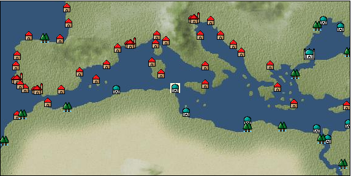

# Port: チュニス

import Tabs from '@theme/Tabs';
import TabItem from '@theme/TabItem';

## General Information

| Attribute | Details |
| :--- | :--- |
| **Port Name** | tunis |
| **Port Type** | port of alliance |
| **Region** | western europe |
| **Sea Area** | Tyrrhenian Sea |
| **Required Language** | arabic |
| **Coordinates** | （420，3268） |
| **Investment Reward** | [Stern gun casting method](Items/Recipe Book/item_748.md) （必要投資額：600,000ドゥカード） |

### Available Facilities

| guild | intermediary | exchange | tool shop | workshop craftsman | Painter | sculptor | peddler |
| --- | --- | --- | --- | --- | --- | --- | --- |
| ○ | ○ | ○ | ○ | ○ |   | ○ | ○ |
| Shipyard Master | Lumbermaker | Sail-maker | weapon craftsman | master | TavernFemale | archive | salesperson |
| --- | --- | --- | --- | --- | --- | --- | --- |
| ○ |   |   | ○ | ○ | ○ | ○ | ○ |
| Shipwright | 銀行 | street worker | 王宮 | Trading post | church | suburbs | translator |
| --- | --- | --- | --- | --- | --- | --- | --- |
| ○ | ○ |   | ○ | ○ | ○ | ○ | ○ |

### Description
This is where the ancient city of Carthage was once located. The city was founded by Islamic forces in the late 7th century. Later, it became the capital of several independent dynasties and became a cosmopolitan city. In addition to agricultural products and linen fabrics, high-quality dyes can also be obtained. Tavern Woman: Shajar Suburb: Tunis West Cultural Area: North Africa

<Tabs>
  <TabItem value="trade_goods_sales" label="Trade Goods Sales">

| item | group | purchase price | 同盟時 | remarks |
| --- | --- | --- | --- | --- |
| [fava beans](Items/Trade Goods/TradeGoods-Foodstuffs/item_102.md) | [Trading items (food items)](Categories/category_3.md) | 59 | 52 |  |
| [almond](Items/Trade Goods/TradeGoods-Sunddries/item_367.md) | [Trading goods (hobby goods)](Categories/category_10.md) | 137 | 124 |  |
| 要投資（必要投資額：120,000） |
| [olive](Items/Trade Goods/TradeGoods-Foodstuffs/item_47.md) | [Trading items (food items)](Categories/category_3.md) | 255 | 224 |  |
| [coriander](Items/Trade Goods/TradeGoods-Spices/item_1044.md) | [Trading Goods (Spices)](Categories/category_12.md) | 294 | 272 |  |
| 要投資（必要投資額：180,000） |
| [wheat](Items/Trade Goods/TradeGoods-Foodstuffs/item_16.md) | [Trading items (food items)](Categories/category_3.md) | 45 | 40 |  |
| [貝紫](Items/Trade Goods/TradeGoods-Dye/item_110.md) | [Trading Goods (Dye)](Categories/category_2.md) | 4,220 | 3,800 |  |
| [red bean](Items/Trade Goods/TradeGoods-Foodstuffs/item_123.md) | [Trading items (food items)](Categories/category_3.md) | 77 | (68) |  |
| [iron ore](Items/Trade Goods/TradeGoods-Minerals/item_146.md) | [Trading Items (Iron Stone)](Categories/category_7.md) | 630 | (552) |  |
| [魚肉](Items/Trade Goods/TradeGoods-Foodstuffs/item_10.md) | [Trading items (food items)](Categories/category_3.md) | 146 | 128 |  |
| [linen fabric](Items/Trade Goods/TradeGoods-Fabrics/item_135.md) | [交易品（織物）](Categories/category_20.md) | 368 | 332 |  |
| 要投資（必要投資額：240,000） |
  </TabItem>
  <TabItem value="sale_specialty" label="Sale (Specialty)">

| item | group | sale price | 同盟時 | remarks |
| --- | --- | --- | --- | --- |

#### [交易品（繊維）](Categories/category_1.md)

| [Basho](Items/Trade Goods/TradeGoods-Fibers/item_3862.md) | [交易品（繊維）](Categories/category_1.md) | 19,852 | (22,335) |  |
| [flax](Items/Trade Goods/TradeGoods-Fibers/item_64.md) | [交易品（繊維）](Categories/category_1.md) | 323 | (363) |  |
| [Green ramie](Items/Trade Goods/TradeGoods-Fibers/item_3428.md) | [交易品（繊維）](Categories/category_1.md) | (26,498) | 30,919 |  |

#### [Trading Goods (Dye)](Categories/category_2.md)

| [Indian indigo](Items/Trade Goods/TradeGoods-Dye/item_157.md) | [Trading Goods (Dye)](Categories/category_2.md) | (1,037) | 1,210 |  |
| [ward](Items/Trade Goods/TradeGoods-Dye/item_57.md) | [Trading Goods (Dye)](Categories/category_2.md) | 1,130 | 1,187 |  |
| [mayan blue](Items/Trade Goods/TradeGoods-Dye/item_1096.md) | [Trading Goods (Dye)](Categories/category_2.md) | (1,487) | 1,735 |  |

#### [Trading items (food items)](Categories/category_3.md)

| [楊州栗](Items/Trade Goods/TradeGoods-Foodstuffs/item_3789.md) | [Trading items (food items)](Categories/category_3.md) | 28,600 | (32,178) |  |

#### [交易品（雑貨）](Categories/category_5.md)

| [Japanese books](Items/Trade Goods/TradeGoods-Misc/item_3439.md) | [交易品（雑貨）](Categories/category_5.md) | 26,250 | (29,534) |  |
| [lantern](Items/Trade Goods/TradeGoods-Misc/item_3683.md) | [交易品（雑貨）](Categories/category_5.md) | 4,347 | (4,890) |  |

#### [Trading goods (hobby goods)](Categories/category_10.md)

| [cacao](Items/Trade Goods/TradeGoods-Sunddries/item_140.md) | [Trading goods (hobby goods)](Categories/category_10.md) | 1,429 | (1,607) |  |
| [walnut](Items/Trade Goods/TradeGoods-Sunddries/item_522.md) | [Trading goods (hobby goods)](Categories/category_10.md) | (585) | 682 |  |
| [tobacco](Items/Trade Goods/TradeGoods-Sunddries/item_109.md) | [Trading goods (hobby goods)](Categories/category_10.md) | 1,305 | (1,468) |  |
| [banana](Items/Trade Goods/TradeGoods-Sunddries/item_1947.md) | [Trading goods (hobby goods)](Categories/category_10.md) | 505 | (568) |  |
| [prune](Items/Trade Goods/TradeGoods-Sunddries/item_523.md) | [Trading goods (hobby goods)](Categories/category_10.md) | (406) | 473 |  |
| [Korean tea](Items/Trade Goods/TradeGoods-Sunddries/item_3751.md) | [Trading goods (hobby goods)](Categories/category_10.md) | 25,914 | (29,156) |  |

#### [Trading Goods (Spices)](Categories/category_11.md)

| [lily of the valley](Items/Trade Goods/TradeGoods-Perfume/item_358.md) | [Trading Goods (Spices)](Categories/category_11.md) | (1,115) | 1,300 |  |

#### [Trading Goods (Spices)](Categories/category_12.md)

| [cloves](Items/Trade Goods/TradeGoods-Spices/item_1092.md) | [Trading Goods (Spices)](Categories/category_12.md) | (7,239) | 8,446 |  |
| [pepper](Items/Trade Goods/TradeGoods-Spices/item_58.md) | [Trading Goods (Spices)](Categories/category_12.md) | 8,432 | (9,486) |  |
| [nutmeg](Items/Trade Goods/TradeGoods-Spices/item_1969.md) | [Trading Goods (Spices)](Categories/category_12.md) | (7,193) | 8,393 |  |
| [mace](Items/Trade Goods/TradeGoods-Spices/item_2100.md) | [Trading Goods (Spices)](Categories/category_12.md) | (7,810) | 9,113 |  |
| [Grapefruit](Items/Trade Goods/TradeGoods-Spices/item_3422.md) | [Trading Goods (Spices)](Categories/category_12.md) | (25,558) | 29,822 |  |

#### [Trading goods (artificial goods)](Categories/category_13.md)

| [african wood carving](Items/Trade Goods/TradeGoods-Luxuries/item_5558.md) | [Trading goods (artificial goods)](Categories/category_13.md) | (3,889) | 4,537 |  |
| [glasswork](Items/Trade Goods/TradeGoods-Luxuries/item_60.md) | [Trading goods (artificial goods)](Categories/category_13.md) | (1,505) | 1,756 |  |
| [lacquerware](Items/Trade Goods/TradeGoods-Luxuries/item_3435.md) | [Trading goods (artificial goods)](Categories/category_13.md) | 26,214 | (29,493) |  |

#### [Trading Items (Gemstones)](Categories/category_15.md)

| [opal](Items/Trade Goods/TradeGoods-Gems/item_2006.md) | [Trading Items (Gemstones)](Categories/category_15.md) | (5,810) | 6,779 |  |
| [cat's eye](Items/Trade Goods/TradeGoods-Gems/item_1047.md) | [Trading Items (Gemstones)](Categories/category_15.md) | (9,118) | 10,639 |  |
| [sapphire](Items/Trade Goods/TradeGoods-Gems/item_676.md) | [Trading Items (Gemstones)](Categories/category_15.md) | 14,567 | (16,389) |  |
| [topaz](Items/Trade Goods/TradeGoods-Gems/item_1097.md) | [Trading Items (Gemstones)](Categories/category_15.md) | (4,748) | 5,540 |  |
| [pink diamond](Items/Trade Goods/TradeGoods-Gems/item_2874.md) | [Trading Items (Gemstones)](Categories/category_15.md) | (11,348) | 13,241 |  |
| [ruby](Items/Trade Goods/TradeGoods-Gems/item_773.md) | [Trading Items (Gemstones)](Categories/category_15.md) | (10,027) | 11,699 |  |
| [amber](Items/Trade Goods/TradeGoods-Gems/item_618.md) | [Trading Items (Gemstones)](Categories/category_15.md) | 4,796 | (5,396) |  |

#### [Trading Items (Arms)](Categories/category_16.md)

| [crossbow](Items/Trade Goods/TradeGoods-Weapons/item_537.md) | [Trading Items (Arms)](Categories/category_16.md) | 1,059 | 1,062 |  |

#### [Trading Items (Firearms)](Categories/category_17.md)

| [musket gun](Items/Trade Goods/TradeGoods-Firearms/item_584.md) | [Trading Items (Firearms)](Categories/category_17.md) | 3,305 | 3,719 |  |
| [tanegashima gun](Items/Trade Goods/TradeGoods-Firearms/item_3423.md) | [Trading Items (Firearms)](Categories/category_17.md) | 19,712 | (22,178) |  |

#### [交易品（工業品）](Categories/category_19.md)

| [Japanese paper](Items/Trade Goods/TradeGoods-Wares/item_3438.md) | [交易品（工業品）](Categories/category_19.md) | (37,328) | 43,556 |  |

#### [交易品（織物）](Categories/category_20.md)

| [dutch calico](Items/Trade Goods/TradeGoods-Fabrics/item_1435.md) | [交易品（織物）](Categories/category_20.md) | 1,561 | (1,756) |  |
| [gobelin weave](Items/Trade Goods/TradeGoods-Fabrics/item_1276.md) | [交易品（織物）](Categories/category_20.md) | 5,390 | 5,620 |  |
| [flannel](Items/Trade Goods/TradeGoods-Fabrics/item_149.md) | [交易品（織物）](Categories/category_20.md) | 1,536 | (1,728) |  |
| [velvet](Items/Trade Goods/TradeGoods-Fabrics/item_902.md) | [交易品（織物）](Categories/category_20.md) | 3,572 | 3,738 |  |
  </TabItem>
  <TabItem value="sale_no_specialty" label="Sale (No Specialty)">

| item | group | sale price | 同盟時 | remarks |
| --- | --- | --- | --- | --- |

#### [交易品（繊維）](Categories/category_1.md)

| [camel hair](Items/Trade Goods/TradeGoods-Fibers/item_577.md) | [交易品（繊維）](Categories/category_1.md) | (398) | 464 |  |
| [fur](Items/Trade Goods/TradeGoods-Fibers/item_634.md) | [交易品（繊維）](Categories/category_1.md) | 2,410 | 2,518 |  |
| [cotton](Items/Trade Goods/TradeGoods-Fibers/item_610.md) | [交易品（繊維）](Categories/category_1.md) | 346 | 348 |  |
| [wool](Items/Trade Goods/TradeGoods-Fibers/item_5.md) | [交易品（繊維）](Categories/category_1.md) | (390) | 454 |  |
| [numb](Items/Trade Goods/TradeGoods-Fibers/item_900.md) | [交易品（繊維）](Categories/category_1.md) | 12 | (13) |  |

#### [Trading Goods (Dye)](Categories/category_2.md)

| [Safflower](Items/Trade Goods/TradeGoods-Dye/item_1059.md) | [Trading Goods (Dye)](Categories/category_2.md) | 631 | (709) |  |
| [persian berry](Items/Trade Goods/TradeGoods-Dye/item_693.md) | [Trading Goods (Dye)](Categories/category_2.md) | (1,155) | 1,347 |  |

#### [Trading items (food items)](Categories/category_3.md)

| [duck meat](Items/Trade Goods/TradeGoods-Foodstuffs/item_32.md) | [Trading items (food items)](Categories/category_3.md) | 448 | (504) |  |
| [turnip](Items/Trade Goods/TradeGoods-Foodstuffs/item_55.md) | [Trading items (food items)](Categories/category_3.md) | 79 | (88) |  |
| [pasta](Items/Trade Goods/TradeGoods-Foodstuffs/item_635.md) | [Trading items (food items)](Categories/category_3.md) | (62) | 72 |  |
| [Red bean](Items/Trade Goods/TradeGoods-Foodstuffs/item_3419.md) | [Trading items (food items)](Categories/category_3.md) | (264) | 308 |  |
| When in alliance: confirmed at 100% |
| [flour](Items/Trade Goods/TradeGoods-Foodstuffs/item_605.md) | [Trading items (food items)](Categories/category_3.md) | 50 | 50 |  |
| [beef](Items/Trade Goods/TradeGoods-Foodstuffs/item_26.md) | [Trading items (food items)](Categories/category_3.md) | 744 | (837) |  |
| [mutton](Items/Trade Goods/TradeGoods-Foodstuffs/item_33.md) | [Trading items (food items)](Categories/category_3.md) | (339) | 395 |  |
| [餡](Items/Trade Goods/TradeGoods-Foodstuffs/item_3474.md) | [Trading items (food items)](Categories/category_3.md) | (1,286) | 1,500 |  |
| When in alliance: confirmed at 100% |
| [chicken meat](Items/Trade Goods/TradeGoods-Foodstuffs/item_29.md) | [Trading items (food items)](Categories/category_3.md) | (366) | 426 |  |

#### [交易品（調味料）](Categories/category_4.md)

| [almond oil](Items/Trade Goods/TradeGoods-Seasonings/item_578.md) | [交易品（調味料）](Categories/category_4.md) | 766 | 820 |  |
| [olive oil](Items/Trade Goods/TradeGoods-Seasonings/item_48.md) | [交易品（調味料）](Categories/category_4.md) | 376 | 403 |  |
| [coconut vinegar](Items/Trade Goods/TradeGoods-Seasonings/item_1988.md) | [交易品（調味料）](Categories/category_4.md) | (444) | 518 |  |
| [wine vinegar](Items/Trade Goods/TradeGoods-Seasonings/item_429.md) | [交易品（調味料）](Categories/category_4.md) | (519) | 605 |  |
| [salt](Items/Trade Goods/TradeGoods-Seasonings/item_42.md) | [交易品（調味料）](Categories/category_4.md) | 280 | 297 |  |
| [seawater](Items/Trade Goods/TradeGoods-Seasonings/item_843.md) | [交易品（調味料）](Categories/category_4.md) | (1) | 1 |  |
| [Honey](Items/Trade Goods/TradeGoods-Seasonings/item_49.md) | [交易品（調味料）](Categories/category_4.md) | (872) | 1,017 |  |

#### [交易品（雑貨）](Categories/category_5.md)

| [Western books](Items/Trade Goods/TradeGoods-Misc/item_293.md) | [交易品（雑貨）](Categories/category_5.md) | (608) | 709 |  |

#### [Trading products (medical products)](Categories/category_6.md)

| [chamomile](Items/Trade Goods/TradeGoods-Medicine/item_292.md) | [Trading products (medical products)](Categories/category_6.md) | (684) | 797 |  |
| [cinchona bark](Items/Trade Goods/TradeGoods-Medicine/item_2121.md) | [Trading products (medical products)](Categories/category_6.md) | 944 | (1,062) |  |
| [Mandragora](Items/Trade Goods/TradeGoods-Medicine/item_1054.md) | [Trading products (medical products)](Categories/category_6.md) | 1,060 | 1,067 |  |
| [mercury agent](Items/Trade Goods/TradeGoods-Medicine/item_703.md) | [Trading products (medical products)](Categories/category_6.md) | (1,380) | 1,610 |  |
| [Nothing](Items/Trade Goods/TradeGoods-Medicine/item_1053.md) | [Trading products (medical products)](Categories/category_6.md) | 751 | 796 |  |

#### [Trading Items (Iron Stone)](Categories/category_7.md)

| [red ore](Items/Trade Goods/TradeGoods-Minerals/item_887.md) | [Trading Items (Iron Stone)](Categories/category_7.md) | 175 | (196) |  |
| [iron ore](Items/Trade Goods/TradeGoods-Minerals/item_146.md) | [Trading Items (Iron Stone)](Categories/category_7.md) | 284 | (319) |  |
| [lead ore](Items/Trade Goods/TradeGoods-Minerals/item_21.md) | [Trading Items (Iron Stone)](Categories/category_7.md) | 524 | (589) |  |

#### [Trading products (precious metals)](Categories/category_8.md)

| [gold](Items/Trade Goods/TradeGoods-Metals/item_659.md) | [Trading products (precious metals)](Categories/category_8.md) | (4,995) | 5,828 |  |
| [silver](Items/Trade Goods/TradeGoods-Metals/item_136.md) | [Trading products (precious metals)](Categories/category_8.md) | (2,901) | 3,384 |  |

#### [Trading goods (hobby goods)](Categories/category_10.md)

| [almond](Items/Trade Goods/TradeGoods-Sunddries/item_367.md) | [Trading goods (hobby goods)](Categories/category_10.md) | 54 | 62 |  |
| 要投資（必要投資額：120,000） |
| [coffee](Items/Trade Goods/TradeGoods-Sunddries/item_445.md) | [Trading goods (hobby goods)](Categories/category_10.md) | 531 | (597) |  |
| [pickles](Items/Trade Goods/TradeGoods-Sunddries/item_535.md) | [Trading goods (hobby goods)](Categories/category_10.md) | 327 | 336 |  |
| [hazelnut](Items/Trade Goods/TradeGoods-Sunddries/item_125.md) | [Trading goods (hobby goods)](Categories/category_10.md) | 504 | 504 |  |
| [dried figs](Items/Trade Goods/TradeGoods-Sunddries/item_611.md) | [Trading goods (hobby goods)](Categories/category_10.md) | 330 | 345 |  |

#### [Trading Goods (Spices)](Categories/category_11.md)

| [oakmoss](Items/Trade Goods/TradeGoods-Perfume/item_819.md) | [Trading Goods (Spices)](Categories/category_11.md) | (710) | 828 |  |
| [daffodil](Items/Trade Goods/TradeGoods-Perfume/item_612.md) | [Trading Goods (Spices)](Categories/category_11.md) | 804 | 804 |  |
| [lavender](Items/Trade Goods/TradeGoods-Perfume/item_150.md) | [Trading Goods (Spices)](Categories/category_11.md) | (811) | 946 |  |
| [lemon oil](Items/Trade Goods/TradeGoods-Perfume/item_151.md) | [Trading Goods (Spices)](Categories/category_11.md) | 639 | 648 |  |
| [rose](Items/Trade Goods/TradeGoods-Perfume/item_536.md) | [Trading Goods (Spices)](Categories/category_11.md) | (2,736) | 3,192 |  |
| [Ryushu incense](Items/Trade Goods/TradeGoods-Perfume/item_101.md) | [Trading Goods (Spices)](Categories/category_11.md) | 4,030 | 4,030 |  |

#### [Trading Goods (Spices)](Categories/category_12.md)

| [garlic](Items/Trade Goods/TradeGoods-Spices/item_526.md) | [Trading Goods (Spices)](Categories/category_12.md) | 305 | 305 |  |
| [cumin](Items/Trade Goods/TradeGoods-Spices/item_156.md) | [Trading Goods (Spices)](Categories/category_12.md) | (593) | 691 |  |
| [coriander](Items/Trade Goods/TradeGoods-Spices/item_1044.md) | [Trading Goods (Spices)](Categories/category_12.md) | (117) | 136 |  |
| 要投資（必要投資額：180,000） |
| [Sesame](Items/Trade Goods/TradeGoods-Spices/item_437.md) | [Trading Goods (Spices)](Categories/category_12.md) | 258 | (290) |  |
| [ginger](Items/Trade Goods/TradeGoods-Spices/item_112.md) | [Trading Goods (Spices)](Categories/category_12.md) | (1,427) | 1,664 |  |
| [celery](Items/Trade Goods/TradeGoods-Spices/item_431.md) | [Trading Goods (Spices)](Categories/category_12.md) | 153 | 161 |  |
| [parsley](Items/Trade Goods/TradeGoods-Spices/item_46.md) | [Trading Goods (Spices)](Categories/category_12.md) | (158) | 184 |  |
| [mint](Items/Trade Goods/TradeGoods-Spices/item_816.md) | [Trading Goods (Spices)](Categories/category_12.md) | (156) | 181 |  |
| [Laurier](Items/Trade Goods/TradeGoods-Spices/item_615.md) | [Trading Goods (Spices)](Categories/category_12.md) | (150) | 175 |  |
| ▲Special products from neighboring cultural areas |

#### [Trading goods (artificial goods)](Categories/category_13.md)

| [coral work](Items/Trade Goods/TradeGoods-Luxuries/item_595.md) | [Trading goods (artificial goods)](Categories/category_13.md) | (2,419) | 2,822 |  |
| [lapidary work](Items/Trade Goods/TradeGoods-Luxuries/item_153.md) | [Trading goods (artificial goods)](Categories/category_13.md) | (3,932) | 4,588 |  |
| [皮革製品](Items/Trade Goods/TradeGoods-Luxuries/item_12.md) | [Trading goods (artificial goods)](Categories/category_13.md) | 1,299 | 1,337 |  |
| [goldsmith](Items/Trade Goods/TradeGoods-Luxuries/item_687.md) | [Trading goods (artificial goods)](Categories/category_13.md) | (3,040) | 3,547 |  |
| [silversmith](Items/Trade Goods/TradeGoods-Luxuries/item_619.md) | [Trading goods (artificial goods)](Categories/category_13.md) | 3,600 | 3,780 |  |
| [ceramics](Items/Trade Goods/TradeGoods-Luxuries/item_152.md) | [Trading goods (artificial goods)](Categories/category_13.md) | 1,570 | 1,616 |  |
| [luxury furniture](Items/Trade Goods/TradeGoods-Luxuries/item_1048.md) | [Trading goods (artificial goods)](Categories/category_13.md) | 2,881 | (3,241) |  |
| [luxury clothing](Items/Trade Goods/TradeGoods-Luxuries/item_165.md) | [Trading goods (artificial goods)](Categories/category_13.md) | 4,328 | 4,330 |  |

#### [交易品（美術品）](Categories/category_14.md)

| [古美術品](Items/Trade Goods/TradeGoods-Art/item_51.md) | [交易品（美術品）](Categories/category_14.md) | (3,591) | 4,190 |  |
| [marble statue](Items/Trade Goods/TradeGoods-Art/item_50.md) | [交易品（美術品）](Categories/category_14.md) | (2,512) | 2,931 |  |
| [oil painting](Items/Trade Goods/TradeGoods-Art/item_1088.md) | [交易品（美術品）](Categories/category_14.md) | (2,083) | 2,430 |  |
| [copperplate print](Items/Trade Goods/TradeGoods-Art/item_1087.md) | [交易品（美術品）](Categories/category_14.md) | (661) | 771 |  |

#### [Trading Items (Gemstones)](Categories/category_15.md)

| [Agate](Items/Trade Goods/TradeGoods-Gems/item_107.md) | [Trading Items (Gemstones)](Categories/category_15.md) | (4,933) | 5,755 |  |
| [emerald](Items/Trade Goods/TradeGoods-Gems/item_777.md) | [Trading Items (Gemstones)](Categories/category_15.md) | 7,163 | (8,059) |  |
| [garnet](Items/Trade Goods/TradeGoods-Gems/item_1005.md) | [Trading Items (Gemstones)](Categories/category_15.md) | 3,870 | (4,354) |  |
| [coral](Items/Trade Goods/TradeGoods-Gems/item_141.md) | [Trading Items (Gemstones)](Categories/category_15.md) | 3,375 | 3,371 |  |
| [malachite](Items/Trade Goods/TradeGoods-Gems/item_679.md) | [Trading Items (Gemstones)](Categories/category_15.md) | 2,976 | (3,348) |  |
| [ivory](Items/Trade Goods/TradeGoods-Gems/item_699.md) | [Trading Items (Gemstones)](Categories/category_15.md) | (2,736) | 3,192 |  |

#### [Trading Items (Arms)](Categories/category_16.md)

| [two-handed sword](Items/Trade Goods/TradeGoods-Weapons/item_24.md) | [Trading Items (Arms)](Categories/category_16.md) | 1,425 | (1,603) |  |
| [scimitar](Items/Trade Goods/TradeGoods-Weapons/item_142.md) | [Trading Items (Arms)](Categories/category_16.md) | 1,142 | 1,176 |  |
| [one handed sword](Items/Trade Goods/TradeGoods-Weapons/item_433.md) | [Trading Items (Arms)](Categories/category_16.md) | 1,056 | (1,188) |  |
| [dagger](Items/Trade Goods/TradeGoods-Weapons/item_143.md) | [Trading Items (Arms)](Categories/category_16.md) | 963 | 963 |  |

#### [Trading Items (Firearms)](Categories/category_17.md)

| [arquebus gun](Items/Trade Goods/TradeGoods-Firearms/item_14.md) | [Trading Items (Firearms)](Categories/category_17.md) | (1,892) | 2,207 |  |
| [大砲](Items/Trade Goods/TradeGoods-Firearms/item_4.md) | [Trading Items (Firearms)](Categories/category_17.md) | (3,673) | 4,285 |  |
| [bullet](Items/Trade Goods/TradeGoods-Firearms/item_13.md) | [Trading Items (Firearms)](Categories/category_17.md) | 1,235 | 1,250 |  |
| [gunpowder](Items/Trade Goods/TradeGoods-Firearms/item_352.md) | [Trading Items (Firearms)](Categories/category_17.md) | 1,324 | 1,378 |  |
| [cannonball](Items/Trade Goods/TradeGoods-Firearms/item_144.md) | [Trading Items (Firearms)](Categories/category_17.md) | 1,790 | (2,013) |  |

#### [Trading Goods (Livestock)](Categories/category_18.md)

| [goat](Items/Trade Goods/TradeGoods-Livestock/item_534.md) | [Trading Goods (Livestock)](Categories/category_18.md) | (174) | 203 |  |

#### [交易品（工業品）](Categories/category_19.md)

| [papyrus](Items/Trade Goods/TradeGoods-Wares/item_616.md) | [交易品（工業品）](Categories/category_19.md) | (396) | 461 |  |
| [wax](Items/Trade Goods/TradeGoods-Wares/item_54.md) | [交易品（工業品）](Categories/category_19.md) | (832) | 970 |  |
| [log](Items/Trade Goods/TradeGoods-Wares/item_846.md) | [交易品（工業品）](Categories/category_19.md) | 130 | (146) |  |
| [marble](Items/Trade Goods/TradeGoods-Wares/item_52.md) | [交易品（工業品）](Categories/category_19.md) | (1,260) | 1,470 |  |
| [wood](Items/Trade Goods/TradeGoods-Wares/item_277.md) | [交易品（工業品）](Categories/category_19.md) | 743 | 864 |  |
| [vegetable oil](Items/Trade Goods/TradeGoods-Wares/item_842.md) | [交易品（工業品）](Categories/category_19.md) | 82 | (92) |  |
| [水銀](Items/Trade Goods/TradeGoods-Wares/item_15.md) | [交易品（工業品）](Categories/category_19.md) | (1,133) | 1,322 |  |
| [Stone](Items/Trade Goods/TradeGoods-Wares/item_276.md) | [交易品（工業品）](Categories/category_19.md) | 817 | (919) |  |
| [oil](Items/Trade Goods/TradeGoods-Wares/item_613.md) | [交易品（工業品）](Categories/category_19.md) | (506) | 590 |  |
| [sulfur](Items/Trade Goods/TradeGoods-Wares/item_66.md) | [交易品（工業品）](Categories/category_19.md) | (432) | 504 |  |
| [羊皮紙](Items/Trade Goods/TradeGoods-Wares/item_53.md) | [交易品（工業品）](Categories/category_19.md) | 1,220 | 1,220 |  |
| [iron material](Items/Trade Goods/TradeGoods-Wares/item_268.md) | [交易品（工業品）](Categories/category_19.md) | (689) | 803 |  |
| [鋼](Items/Trade Goods/TradeGoods-Wares/item_573.md) | [交易品（工業品）](Categories/category_19.md) | (1,103) | 1,287 |  |

#### [交易品（織物）](Categories/category_20.md)

| [satin](Items/Trade Goods/TradeGoods-Fabrics/item_996.md) | [交易品（織物）](Categories/category_20.md) | 3,400 | (3,825) |  |
| [georgette](Items/Trade Goods/TradeGoods-Fabrics/item_1000.md) | [交易品（織物）](Categories/category_20.md) | 3,445 | (3,876) |  |
| [damask](Items/Trade Goods/TradeGoods-Fabrics/item_614.md) | [交易品（織物）](Categories/category_20.md) | (3,069) | 3,580 |  |
| [turkish rug](Items/Trade Goods/TradeGoods-Fabrics/item_686.md) | [交易品（織物）](Categories/category_20.md) | (3,591) | 4,190 |  |
| ▲Special products from neighboring cultural areas |
| [knit](Items/Trade Goods/TradeGoods-Fabrics/item_164.md) | [交易品（織物）](Categories/category_20.md) | 604 | 616 |  |
| [muslin](Items/Trade Goods/TradeGoods-Fabrics/item_581.md) | [交易品（織物）](Categories/category_20.md) | 1,489 | (1,675) |  |
| [race](Items/Trade Goods/TradeGoods-Fabrics/item_59.md) | [交易品（織物）](Categories/category_20.md) | 2,218 | 2,300 |  |
| [woolen fabric](Items/Trade Goods/TradeGoods-Fabrics/item_163.md) | [交易品（織物）](Categories/category_20.md) | 1,108 | 1,147 |  |
| [cotton fabric](Items/Trade Goods/TradeGoods-Fabrics/item_571.md) | [交易品（織物）](Categories/category_20.md) | 802 | 802 |  |
| [linen fabric](Items/Trade Goods/TradeGoods-Fabrics/item_135.md) | [交易品（織物）](Categories/category_20.md) | (143) | 166 |  |
| 要投資（必要投資額：240,000） |
  </TabItem>
  <TabItem value="guild_&_others" label="Guild & Others">

| item | group | Sales price | Handling NPC | remarks |
| --- | --- | --- | --- | --- |

#### adventure guild

| [supply](Skills/Skill-Adventure/item_455.md) | [Skill (adventure)](Categories/category_39.md) | 2,000 | adventure guild |  |
| [procurement](Skills/Skill-Adventure/item_256.md) | [Skill (adventure)](Categories/category_39.md) | 6,000 | adventure guild |  |

#### merchant guild

| [sewing](Skills/Skill-Trade/item_474.md) | [Skill (trade)](Categories/category_40.md) | 10,000 | merchant guild |  |
| [ore trading](Skills/Skill-Trade/item_420.md) | [Skill (trade)](Categories/category_40.md) | 8,000 | merchant guild |  |
| [turkish](Skills/Skills-Language/item_602.md) | [Skills (language)](Categories/category_42.md) | 10,000 | merchant guild |  |

#### maritime guild

| [rowing boat](Skills/Skill-Battle/item_424.md) | [Skill (combat)](Categories/category_41.md) | 5,000 | maritime guild |  |
| [Pathology](Skills/Skill-Battle/item_505.md) | [Skill (combat)](Categories/category_41.md) | 4,000 | maritime guild |  |
| [shipbuilding](Skills/Skill-Battle/item_511.md) | [Skill (combat)](Categories/category_41.md) | 25,000 | maritime guild |  |

#### Hisar Reis

| [rapid fire](Skills/Skill-Battle/item_494.md) | [Skill (combat)](Categories/category_41.md) | 50,000 | Hisar Reis |  |
| [shooting](Skills/Skill-Battle/item_500.md) | [Skill (combat)](Categories/category_41.md) | 5,000 | Hisar Reis |  |
| [defense](Skills/Skill-Battle/item_498.md) | [Skill (combat)](Categories/category_41.md) | 5,000 | Hisar Reis |  |

#### leo africanus

| [採集](Skills/Skill-Adventure/item_423.md) | [Skill (adventure)](Categories/category_39.md) | 4,000 | leo africanus |  |
| [Survive](Skills/Skill-Adventure/item_462.md) | [Skill (adventure)](Categories/category_39.md) | 3,000 | leo africanus |  |
| [行軍](Skills/Skill-Adventure/item_461.md) | [Skill (adventure)](Categories/category_39.md) | 3,000 | leo africanus |  |
  </TabItem>
  <TabItem value="toolman" label="Toolman">

| item | group | Sales price | Handling NPC | remarks |
| --- | --- | --- | --- | --- |

#### [recipe book](Categories/category_22.md)

| [Practical Costume Sewing Techniques Volume 1](Items/Recipe Book/item_235.md) | [recipe book](Categories/category_22.md) | 30,000 | tool shop owner |  |
| [Land battle props/casting book](Items/Recipe Book/item_234.md) | [recipe book](Categories/category_22.md) | 10,000 | tool shop owner |  |

#### [Equipment (head)](Categories/category_23.md)

| [Agar](Items/Equipment/Equipment-Head/item_216.md) | [Equipment (head)](Categories/category_23.md) | 25,400 | tool shop owner |  |
| [Ajishe](Items/Equipment/Equipment-Head/item_217.md) | [Equipment (head)](Categories/category_23.md) | 32,600 | tool shop owner |  |
| [turban](Items/Equipment/Equipment-Head/item_132.md) | [Equipment (head)](Categories/category_23.md) | 31,500 | tool shop owner |  |

#### [Equipment (body)](Categories/category_24.md)

| [brunjuk](Items/Equipment/Equipment-Body/item_214.md) | [Equipment (body)](Categories/category_24.md) | 66,100 | tool shop owner |  |

#### [Equipment (hands)](Categories/category_25.md)

| [glove](Items/Equipment/Equipment-Hands/item_223.md) | [Equipment (hands)](Categories/category_25.md) | 6,400 | tool shop owner |  |

#### [Equipment (legs)](Categories/category_26.md)

| [arabian shoes](Items/Equipment/Equipment-Feet/item_220.md) | [Equipment (legs)](Categories/category_26.md) | 28,100 | tool shop owner |  |
| [leather boots](Items/Equipment/Equipment-Feet/item_221.md) | [Equipment (legs)](Categories/category_26.md) | 26,200 | tool shop owner |  |

#### [Equipment (belongings)](Categories/category_27.md)

| [Calavera](Items/Equipment/Equipment-Weapon/item_1122.md) | [Equipment (belongings)](Categories/category_27.md) | 35,500 | tool shop owner |  |
| 要投資（必要投資額：240,000） |
| [scimitar](Items/Equipment/Equipment-Weapon/item_225.md) | [Equipment (belongings)](Categories/category_27.md) | 29,000 | tool shop owner |  |
| [Goat skin tambourine](Items/Equipment/Equipment-Weapon/item_1420.md) | [Equipment (belongings)](Categories/category_27.md) | 5,000 | tool shop owner |  |
| 要投資（必要投資額：120,000） |

#### [Consumables (land battle/deck battle)](Categories/category_29.md)

| [tear gas powder bag](Items/Consumables/Consumables-Landbattle/item_104.md) | [Consumables (land battle/deck battle)](Categories/category_29.md) | 150 | tool shop owner |  |
| [hellfire torch](Items/Consumables/Consumables-Landbattle/item_233.md) | [Consumables (land battle/deck battle)](Categories/category_29.md) | 300 | tool shop owner |  |
| [explosive powder](Items/Consumables/Consumables-Landbattle/item_230.md) | [Consumables (land battle/deck battle)](Categories/category_29.md) | 150 | tool shop owner |  |
| [sticky oil](Items/Consumables/Consumables-Landbattle/item_231.md) | [Consumables (land battle/deck battle)](Categories/category_29.md) | 150 | tool shop owner |  |

#### [Consumables (naval/hand-to-hand combat)](Categories/category_30.md)

| [assault flag](Items/Consumables/Consumables-navalhand-to-hand combat/item_228.md) | [Consumables (naval/hand-to-hand combat)](Categories/category_30.md) | 5,000 | tool shop owner |  |

#### [Consumables (skill activation)](Categories/category_31.md)

| [card](Items/Consumables/Consumables-Skill/item_855.md) | [Consumables (skill activation)](Categories/category_31.md) | 500 | tool shop owner |  |
| [perfume](Items/Consumables/Consumables-Skill/item_226.md) | [Consumables (skill activation)](Categories/category_31.md) | 3,000 | tool shop owner |  |

#### [Consumables (request documents)](Categories/category_45.md)

| [jewelry purchase order](Items/Consumables/Consumables-Documents/item_4861.md) | [Consumables (request documents)](Categories/category_45.md) | 60,000 | tool shop owner |  |
  </TabItem>
  <TabItem value="kobo_craftsmen" label="Craftsman">

| item | group | Sales price | Handling NPC | remarks |
| --- | --- | --- | --- | --- |

#### [Consumables (condition recovery)](Categories/category_21.md)

| [Nostalgic carillon bell](Items/Consumables/Consumables-Recovery/item_245.md) | [Consumables (condition recovery)](Categories/category_21.md) | 200 | workshop craftsman |  |
| [Ship song sheet music](Items/Consumables/Consumables-Recovery/item_247.md) | [Consumables (condition recovery)](Categories/category_21.md) | 200 | workshop craftsman |  |

#### [recipe book](Categories/category_22.md)

| [Flame cannon casting method](Items/Recipe Book/item_1039.md) | [recipe book](Categories/category_22.md) | 300,000 | workshop craftsman |  |
| 要投資（必要投資額：240,000） |
| [Book of land battle props and crafts](Items/Recipe Book/item_521.md) | [recipe book](Categories/category_22.md) | Fixed recipe | workshop craftsman |  |

#### [Consumables (other)](Categories/category_44.md)

| [帆塗料](Items/Consumables/Consumables-Other/item_348.md) | [Consumables (other)](Categories/category_44.md) | 500 | workshop craftsman |  |
| [ship paint](Items/Consumables/Consumables-Other/item_347.md) | [Consumables (other)](Categories/category_44.md) | 500 | workshop craftsman |  |
  </TabItem>
  <TabItem value="sculptor" label="sculptor">

| item | group | Sales price | Handling NPC | remarks |
| --- | --- | --- | --- | --- |

#### [Ship parts (figurehead)](Categories/category_34.md)

| [dolphin statue](Items/Ship Parts/Shipparts-Figurehead/item_169.md) | [Ship parts (figurehead)](Categories/category_34.md) | 500 | sculptor |  |
| [whale statue](Items/Ship Parts/Shipparts-Figurehead/item_172.md) | [Ship parts (figurehead)](Categories/category_34.md) | 12,000 | sculptor |  |
| [shark statue](Items/Ship Parts/Shipparts-Figurehead/item_171.md) | [Ship parts (figurehead)](Categories/category_34.md) | 8,600 | sculptor |  |
| [killer whale statue](Items/Ship Parts/Shipparts-Figurehead/item_170.md) | [Ship parts (figurehead)](Categories/category_34.md) | 8,600 | sculptor |  |
| [phoenix statue](Items/Ship Parts/Shipparts-Figurehead/item_631.md) | [Ship parts (figurehead)](Categories/category_34.md) | 62,000 | sculptor |  |
| [maiden statue](Items/Ship Parts/Shipparts-Figurehead/item_167.md) | [Ship parts (figurehead)](Categories/category_34.md) | 13,000 | sculptor |  |
| [statue of a great man](Items/Ship Parts/Shipparts-Figurehead/item_717.md) | [Ship parts (figurehead)](Categories/category_34.md) | 60,000 | sculptor |  |
| [statue of the brave](Items/Ship Parts/Shipparts-Figurehead/item_716.md) | [Ship parts (figurehead)](Categories/category_34.md) | 60,000 | sculptor |  |
| [angel statue](Items/Ship Parts/Shipparts-Figurehead/item_168.md) | [Ship parts (figurehead)](Categories/category_34.md) | 13,000 | sculptor |  |
| [statue of tenryu](Items/Ship Parts/Shipparts-Figurehead/item_630.md) | [Ship parts (figurehead)](Categories/category_34.md) | 62,000 | sculptor |  |
| [statue of goddess](Items/Ship Parts/Shipparts-Figurehead/item_721.md) | [Ship parts (figurehead)](Categories/category_34.md) | 60,000 | sculptor |  |
| [sea ​​turtle statue](Items/Ship Parts/Shipparts-Figurehead/item_173.md) | [Ship parts (figurehead)](Categories/category_34.md) | 1,800 | sculptor |  |
| [sea ​​monster statue](Items/Ship Parts/Shipparts-Figurehead/item_628.md) | [Ship parts (figurehead)](Categories/category_34.md) | 62,000 | sculptor |  |
| [statue of sea god](Items/Ship Parts/Shipparts-Figurehead/item_720.md) | [Ship parts (figurehead)](Categories/category_34.md) | 60,000 | sculptor |  |
| [lion statue](Items/Ship Parts/Shipparts-Figurehead/item_249.md) | [Ship parts (figurehead)](Categories/category_34.md) | 7,500 | sculptor |  |
| [statue of king](Items/Ship Parts/Shipparts-Figurehead/item_718.md) | [Ship parts (figurehead)](Categories/category_34.md) | 60,000 | sculptor |  |
  </TabItem>
  <TabItem value="peddler" label="peddler">

| item | group | Sales price | Handling NPC | remarks |
| --- | --- | --- | --- | --- |

#### [Consumables (condition recovery)](Categories/category_21.md)

| [spare sail](Items/Consumables/Consumables-Recovery/item_242.md) | [Consumables (condition recovery)](Categories/category_21.md) |  | peddler |  |
| [reserve rudder](Items/Consumables/Consumables-Recovery/item_243.md) | [Consumables (condition recovery)](Categories/category_21.md) |  | peddler |  |
| [recreational sake barrel](Items/Consumables/Consumables-Recovery/item_83.md) | [Consumables (condition recovery)](Categories/category_21.md) |  | peddler |  |
| [fire extinguishing sand](Items/Consumables/Consumables-Recovery/item_68.md) | [Consumables (condition recovery)](Categories/category_21.md) |  | peddler |  |
| [Special drug for epidemics](Items/Consumables/Consumables-Recovery/item_308.md) | [Consumables (condition recovery)](Categories/category_21.md) |  | peddler |  |

#### [Consumables (naval/hand-to-hand combat)](Categories/category_30.md)

| [ceasefire agreement](Items/Consumables/Consumables-navalhand-to-hand combat/item_129.md) | [Consumables (naval/hand-to-hand combat)](Categories/category_30.md) |  | peddler |  |
| [evacuation bell](Items/Consumables/Consumables-navalhand-to-hand combat/item_919.md) | [Consumables (naval/hand-to-hand combat)](Categories/category_30.md) |  | peddler |  |
| [flag of calm](Items/Consumables/Consumables-navalhand-to-hand combat/item_84.md) | [Consumables (naval/hand-to-hand combat)](Categories/category_30.md) |  | peddler |  |
  </TabItem>
  <TabItem value="salesperson" label="salesperson">

| item | group | Sales price | Handling NPC | remarks |
| --- | --- | --- | --- | --- |

#### [Consumables (cooking)](Categories/category_32.md)

| [fig pie](Items/Consumables/Consumables-Cooking/item_1077.md) | [Consumables (cooking)](Categories/category_32.md) |  | salesperson |  |
| [Couscous](Items/Consumables/Consumables-Cooking/item_852.md) | [Consumables (cooking)](Categories/category_32.md) |  | salesperson |  |
| [watt](Items/Consumables/Consumables-Cooking/item_1101.md) | [Consumables (cooking)](Categories/category_32.md) |  | salesperson |  |
| [Stewed lamb and turnip](Items/Consumables/Consumables-Cooking/item_1083.md) | [Consumables (cooking)](Categories/category_32.md) |  | salesperson |  |
| [roast lamb](Items/Consumables/Consumables-Cooking/item_998.md) | [Consumables (cooking)](Categories/category_32.md) |  | salesperson |  |
| [pancakes with honey](Items/Consumables/Consumables-Cooking/item_1074.md) | [Consumables (cooking)](Categories/category_32.md) |  | salesperson |  |
  </TabItem>
  <TabItem value="translator" label="translator">

| item | group | Sales price | Handling NPC | remarks |
| --- | --- | --- | --- | --- |

#### [Consumables (skill activation)](Categories/category_31.md)

| [Altaic languages ​​translation notes](Items/Consumables/Consumables-Skill/item_2530.md) | [Consumables (skill activation)](Categories/category_31.md) |  | translator |  |
| [Shem-Hamite translation notes](Items/Consumables/Consumables-Skill/item_2529.md) | [Consumables (skill activation)](Categories/category_31.md) |  | translator |  |
  </TabItem>
  <TabItem value="shipyard" label="Shipyard">

### Shipyard Master

| item | group | Sales price | Handling NPC | remarks |
| --- | --- | --- | --- | --- |

#### [Boat](Categories/category_43.md)

| [Galliot](Items/Ships/item_210.md) | [Boat](Categories/category_43.md) | 156,000 | Shipyard Master |  |
| [galley](Items/Ships/item_227.md) | [Boat](Categories/category_43.md) | 645,000 | Shipyard Master |  |
| [carrack](Items/Ships/item_236.md) | [Boat](Categories/category_43.md) | 720,000 | Shipyard Master |  |
| [Varsha](Items/Ships/item_201.md) | [Boat](Categories/category_43.md) | 2,000 | Shipyard Master |  |
| [barbarian galley](Items/Ships/item_237.md) | [Boat](Categories/category_43.md) | 560,000 | Shipyard Master |  |
| [commercial galley](Items/Ships/item_229.md) | [Boat](Categories/category_43.md) | 650,000 | Shipyard Master |  |
| [commercial carrack](Items/Ships/item_239.md) | [Boat](Categories/category_43.md) | 728,000 | Shipyard Master |  |
| [commercial varsha](Items/Ships/item_204.md) | [Boat](Categories/category_43.md) | 5,200 | Shipyard Master |  |
| [large galley](Items/Ships/item_250.md) | [Boat](Categories/category_43.md) | 2,250,000 | Shipyard Master |  |
| [small galleon](Items/Ships/item_406.md) | [Boat](Categories/category_43.md) | 830,000 | Shipyard Master |  |
| [small carrack](Items/Ships/item_219.md) | [Boat](Categories/category_43.md) | 480,000 | Shipyard Master |  |
| [small caravel](Items/Ships/item_206.md) | [Boat](Categories/category_43.md) | 92,000 | Shipyard Master |  |
| [assault galley](Items/Ships/item_224.md) | [Boat](Categories/category_43.md) | 640,000 | Shipyard Master |  |
| [combat carrack](Items/Ships/item_238.md) | [Boat](Categories/category_43.md) | 720,000 | Shipyard Master |  |
| [Battle Barsha](Items/Ships/item_203.md) | [Boat](Categories/category_43.md) | 5,100 | Shipyard Master |  |
| [exploration barsha](Items/Ships/item_202.md) | [Boat](Categories/category_43.md) | 5,000 | Shipyard Master |  |
| [light galleon](Items/Ships/item_240.md) | [Boat](Categories/category_43.md) | 810,000 | Shipyard Master |  |
| [light galley](Items/Ships/item_209.md) | [Boat](Categories/category_43.md) | 150,000 | Shipyard Master |  |
| [light carrack](Items/Ships/item_218.md) | [Boat](Categories/category_43.md) | 478,000 | Shipyard Master |  |
| [light caravelle](Items/Ships/item_207.md) | [Boat](Categories/category_43.md) | 92,000 | Shipyard Master |  |
| [transport galleon](Items/Ships/item_407.md) | [Boat](Categories/category_43.md) | 840,000 | Shipyard Master |  |
| [transportation galley](Items/Ships/item_211.md) | [Boat](Categories/category_43.md) | 160,000 | Shipyard Master |  |
| [transport carrack](Items/Ships/item_222.md) | [Boat](Categories/category_43.md) | 488,000 | Shipyard Master |  |
| [Large galley for transportation](Items/Ships/item_251.md) | [Boat](Categories/category_43.md) | 2,280,000 | Shipyard Master |  |
| [heavy galley](Items/Ships/item_550.md) | [Boat](Categories/category_43.md) | 2,650,000 | Shipyard Master |  |

### Shipwright

| item | group | Sales price | Handling NPC | remarks |
| --- | --- | --- | --- | --- |

#### [recipe book](Categories/category_22.md)

| [Shipbuilding materials/lightweight oars](Items/Recipe Book/item_1783.md) | [recipe book](Categories/category_22.md) | Fixed recipe | Shipwright |  |

#### [shipbuilding materials](Categories/category_47.md)

| [Custom made lightweight oar](Items/Shipbuilding FS Material/item_1784.md) | [shipbuilding materials](Categories/category_47.md) | Fixed recipe | Shipwright |  |
  </TabItem>
  <TabItem value="weapon craftsman" label="weapon craftsman">

| item | group | Sales price | Handling NPC | remarks |
| --- | --- | --- | --- | --- |

#### [Ship parts (special weapons)](Categories/category_37.md)

| [Corvus](Items/Ship Parts/Shipparts-Special-Weapons/item_194.md) | [Ship parts (special weapons)](Categories/category_37.md) | 24,000 | weapon craftsman |  |
| [rum](Items/Ship Parts/Shipparts-Special-Weapons/item_191.md) | [Ship parts (special weapons)](Categories/category_37.md) | 4,800 | weapon craftsman |  |
| [small corvus](Items/Ship Parts/Shipparts-Special-Weapons/item_193.md) | [Ship parts (special weapons)](Categories/category_37.md) | 3,000 | weapon craftsman |  |
| [small ram](Items/Ship Parts/Shipparts-Special-Weapons/item_190.md) | [Ship parts (special weapons)](Categories/category_37.md) | 1,000 | weapon craftsman |  |
| [small poop](Items/Ship Parts/Shipparts-Special-Weapons/item_198.md) | [Ship parts (special weapons)](Categories/category_37.md) | 39,000 | weapon craftsman |  |
| [small ship forecastle](Items/Ship Parts/Shipparts-Special-Weapons/item_195.md) | [Ship parts (special weapons)](Categories/category_37.md) | 5,000 | weapon craftsman |  |
| [poop](Items/Ship Parts/Shipparts-Special-Weapons/item_837.md) | [Ship parts (special weapons)](Categories/category_37.md) | 130,000 | weapon craftsman |  |
| [forecastle](Items/Ship Parts/Shipparts-Special-Weapons/item_241.md) | [Ship parts (special weapons)](Categories/category_37.md) | 16,000 | weapon craftsman |  |
| [additional spanker](Items/Ship Parts/Shipparts-Special-Weapons/item_200.md) | [Ship parts (special weapons)](Categories/category_37.md) | 55,000 | weapon craftsman |  |
| [additional split](Items/Ship Parts/Shipparts-Special-Weapons/item_197.md) | [Ship parts (special weapons)](Categories/category_37.md) | 44,000 | weapon craftsman |  |
| [additional small spanker](Items/Ship Parts/Shipparts-Special-Weapons/item_199.md) | [Ship parts (special weapons)](Categories/category_37.md) | 3,500 | weapon craftsman |  |
| [additional small split](Items/Ship Parts/Shipparts-Special-Weapons/item_196.md) | [Ship parts (special weapons)](Categories/category_37.md) | 2,000 | weapon craftsman |  |

#### [Ship parts (cannon)](Categories/category_38.md)

| [4 amfer guns](Items/Ship Parts/Shipparts-Cannons/item_391.md) | [Ship parts (cannon)](Categories/category_38.md) | 26,600 | weapon craftsman |  |
| [6 Amfer cannons](Items/Ship Parts/Shipparts-Cannons/item_392.md) | [Ship parts (cannon)](Categories/category_38.md) | 81,000 | weapon craftsman |  |
| [2 Exploder guns](Items/Ship Parts/Shipparts-Cannons/item_1416.md) | [Ship parts (cannon)](Categories/category_38.md) | 7,100 | weapon craftsman |  |
| [4 Exploder guns](Items/Ship Parts/Shipparts-Cannons/item_1415.md) | [Ship parts (cannon)](Categories/category_38.md) | 28,500 | weapon craftsman |  |
| [6 Exploder guns](Items/Ship Parts/Shipparts-Cannons/item_1163.md) | [Ship parts (cannon)](Categories/category_38.md) | 64,000 | weapon craftsman |  |
| [8 Exploder guns](Items/Ship Parts/Shipparts-Cannons/item_1164.md) | [Ship parts (cannon)](Categories/category_38.md) | 113,900 | weapon craftsman |  |
| [10 angel cannons](Items/Ship Parts/Shipparts-Cannons/item_853.md) | [Ship parts (cannon)](Categories/category_38.md) | 249,400 | weapon craftsman |  |
| [2 angel cannons](Items/Ship Parts/Shipparts-Cannons/item_382.md) | [Ship parts (cannon)](Categories/category_38.md) | 10,000 | weapon craftsman |  |
| [4 angel cannons](Items/Ship Parts/Shipparts-Cannons/item_383.md) | [Ship parts (cannon)](Categories/category_38.md) | 39,900 | weapon craftsman |  |
| [6 angel cannons](Items/Ship Parts/Shipparts-Cannons/item_388.md) | [Ship parts (cannon)](Categories/category_38.md) | 89,800 | weapon craftsman |  |
| [8 angel cannons](Items/Ship Parts/Shipparts-Cannons/item_389.md) | [Ship parts (cannon)](Categories/category_38.md) | 159,600 | weapon craftsman |  |
| [4 Caprice guns](Items/Ship Parts/Shipparts-Cannons/item_395.md) | [Ship parts (cannon)](Categories/category_38.md) | 18,200 | weapon craftsman |  |
| [6 Caprice guns](Items/Ship Parts/Shipparts-Cannons/item_396.md) | [Ship parts (cannon)](Categories/category_38.md) | 55,500 | weapon craftsman |  |
| [8 Caprice guns](Items/Ship Parts/Shipparts-Cannons/item_397.md) | [Ship parts (cannon)](Categories/category_38.md) | 103,600 | weapon craftsman |  |
| [10 culverines](Items/Ship Parts/Shipparts-Cannons/item_375.md) | [Ship parts (cannon)](Categories/category_38.md) | 136,300 | weapon craftsman |  |
| [12 culverin guns](Items/Ship Parts/Shipparts-Cannons/item_744.md) | [Ship parts (cannon)](Categories/category_38.md) | 196,300 | weapon craftsman |  |
| [4 culverine guns](Items/Ship Parts/Shipparts-Cannons/item_372.md) | [Ship parts (cannon)](Categories/category_38.md) | 21,800 | weapon craftsman |  |
| [6 culverine guns](Items/Ship Parts/Shipparts-Cannons/item_373.md) | [Ship parts (cannon)](Categories/category_38.md) | 49,100 | weapon craftsman |  |
| [8 culverine guns](Items/Ship Parts/Shipparts-Cannons/item_374.md) | [Ship parts (cannon)](Categories/category_38.md) | 87,300 | weapon craftsman |  |
| [4 carronades](Items/Ship Parts/Shipparts-Cannons/item_836.md) | [Ship parts (cannon)](Categories/category_38.md) | 14,500 | weapon craftsman |  |
| [10 Cannon Pedro guns](Items/Ship Parts/Shipparts-Cannons/item_746.md) | [Ship parts (cannon)](Categories/category_38.md) | 190,900 | weapon craftsman |  |
| [12 Cannon Pedro guns](Items/Ship Parts/Shipparts-Cannons/item_834.md) | [Ship parts (cannon)](Categories/category_38.md) | 274,900 | weapon craftsman |  |
| [4 Cannon Pedro guns](Items/Ship Parts/Shipparts-Cannons/item_376.md) | [Ship parts (cannon)](Categories/category_38.md) | 30,500 | weapon craftsman |  |
| [6 Cannon Pedro guns](Items/Ship Parts/Shipparts-Cannons/item_377.md) | [Ship parts (cannon)](Categories/category_38.md) | 68,700 | weapon craftsman |  |
| [8 Cannon Pedro guns](Items/Ship Parts/Shipparts-Cannons/item_745.md) | [Ship parts (cannon)](Categories/category_38.md) | 122,200 | weapon craftsman |  |
| [10 Saker cannons](Items/Ship Parts/Shipparts-Cannons/item_187.md) | [Ship parts (cannon)](Categories/category_38.md) | 79,000 | weapon craftsman |  |
| [2 saker cannons](Items/Ship Parts/Shipparts-Cannons/item_183.md) | [Ship parts (cannon)](Categories/category_38.md) | 3,200 | weapon craftsman |  |
| [4 saker cannons](Items/Ship Parts/Shipparts-Cannons/item_184.md) | [Ship parts (cannon)](Categories/category_38.md) | 12,600 | weapon craftsman |  |
| [6 Saker cannons](Items/Ship Parts/Shipparts-Cannons/item_185.md) | [Ship parts (cannon)](Categories/category_38.md) | 28,400 | weapon craftsman |  |
| [8 Saker cannons](Items/Ship Parts/Shipparts-Cannons/item_186.md) | [Ship parts (cannon)](Categories/category_38.md) | 50,500 | weapon craftsman |  |
| [10 demi culverin cannons](Items/Ship Parts/Shipparts-Cannons/item_370.md) | [Ship parts (cannon)](Categories/category_38.md) | 101,000 | weapon craftsman |  |
| [12 demi culverin cannons](Items/Ship Parts/Shipparts-Cannons/item_371.md) | [Ship parts (cannon)](Categories/category_38.md) | 145,400 | weapon craftsman |  |
| [2 demi culverin cannons](Items/Ship Parts/Shipparts-Cannons/item_188.md) | [Ship parts (cannon)](Categories/category_38.md) | 4,000 | weapon craftsman |  |
| [4 demi culverin cannons](Items/Ship Parts/Shipparts-Cannons/item_189.md) | [Ship parts (cannon)](Categories/category_38.md) | 16,200 | weapon craftsman |  |
| [6 demi culverin cannons](Items/Ship Parts/Shipparts-Cannons/item_368.md) | [Ship parts (cannon)](Categories/category_38.md) | 36,400 | weapon craftsman |  |
| [8 demi culverin cannons](Items/Ship Parts/Shipparts-Cannons/item_369.md) | [Ship parts (cannon)](Categories/category_38.md) | 64,600 | weapon craftsman |  |
| [10 trench guns](Items/Ship Parts/Shipparts-Cannons/item_835.md) | [Ship parts (cannon)](Categories/category_38.md) | 163,600 | weapon craftsman |  |
| [2 trench guns](Items/Ship Parts/Shipparts-Cannons/item_378.md) | [Ship parts (cannon)](Categories/category_38.md) | 6,500 | weapon craftsman |  |
| [4 trench guns](Items/Ship Parts/Shipparts-Cannons/item_379.md) | [Ship parts (cannon)](Categories/category_38.md) | 26,200 | weapon craftsman |  |
| [6 trench guns](Items/Ship Parts/Shipparts-Cannons/item_380.md) | [Ship parts (cannon)](Categories/category_38.md) | 58,900 | weapon craftsman |  |
| [8 trench guns](Items/Ship Parts/Shipparts-Cannons/item_381.md) | [Ship parts (cannon)](Categories/category_38.md) | 104,700 | weapon craftsman |  |
| [4 Draconis cannons](Items/Ship Parts/Shipparts-Cannons/item_386.md) | [Ship parts (cannon)](Categories/category_38.md) | 18,200 | weapon craftsman |  |
| [6 Draconis cannons](Items/Ship Parts/Shipparts-Cannons/item_387.md) | [Ship parts (cannon)](Categories/category_38.md) | 55,500 | weapon craftsman |  |
| [8 Draconis cannons](Items/Ship Parts/Shipparts-Cannons/item_390.md) | [Ship parts (cannon)](Categories/category_38.md) | 103,600 | weapon craftsman |  |
| [2 falcon guns](Items/Ship Parts/Shipparts-Cannons/item_174.md) | [Ship parts (cannon)](Categories/category_38.md) | 500 | weapon craftsman |  |
| [4 falcon guns](Items/Ship Parts/Shipparts-Cannons/item_175.md) | [Ship parts (cannon)](Categories/category_38.md) | 2,000 | weapon craftsman |  |
| [6 falcon guns](Items/Ship Parts/Shipparts-Cannons/item_176.md) | [Ship parts (cannon)](Categories/category_38.md) | 4,600 | weapon craftsman |  |
| [8 falcon guns](Items/Ship Parts/Shipparts-Cannons/item_177.md) | [Ship parts (cannon)](Categories/category_38.md) | 8,100 | weapon craftsman |  |
| [4 frango guns](Items/Ship Parts/Shipparts-Cannons/item_393.md) | [Ship parts (cannon)](Categories/category_38.md) | 12,500 | weapon craftsman |  |
| [6 frango guns](Items/Ship Parts/Shipparts-Cannons/item_394.md) | [Ship parts (cannon)](Categories/category_38.md) | 38,000 | weapon craftsman |  |
| [10 minion cannons](Items/Ship Parts/Shipparts-Cannons/item_182.md) | [Ship parts (cannon)](Categories/category_38.md) | 34,800 | weapon craftsman |  |
| [2 minion cannons](Items/Ship Parts/Shipparts-Cannons/item_178.md) | [Ship parts (cannon)](Categories/category_38.md) | 1,400 | weapon craftsman |  |
| [4 minion cannons](Items/Ship Parts/Shipparts-Cannons/item_179.md) | [Ship parts (cannon)](Categories/category_38.md) | 5,600 | weapon craftsman |  |
| [6 minion cannons](Items/Ship Parts/Shipparts-Cannons/item_180.md) | [Ship parts (cannon)](Categories/category_38.md) | 12,400 | weapon craftsman |  |
| [8 minion cannons](Items/Ship Parts/Shipparts-Cannons/item_181.md) | [Ship parts (cannon)](Categories/category_38.md) | 22,400 | weapon craftsman |  |
| [4 Meteora cannons](Items/Ship Parts/Shipparts-Cannons/item_398.md) | [Ship parts (cannon)](Categories/category_38.md) | 26,600 | weapon craftsman |  |
| [6 Meteora cannons](Items/Ship Parts/Shipparts-Cannons/item_399.md) | [Ship parts (cannon)](Categories/category_38.md) | 81,000 | weapon craftsman |  |
| [2 motor guns](Items/Ship Parts/Shipparts-Cannons/item_933.md) | [Ship parts (cannon)](Categories/category_38.md) | 15,300 | weapon craftsman |  |
| [4 motor guns](Items/Ship Parts/Shipparts-Cannons/item_934.md) | [Ship parts (cannon)](Categories/category_38.md) | 61,300 | weapon craftsman |  |
| [6 motor guns](Items/Ship Parts/Shipparts-Cannons/item_935.md) | [Ship parts (cannon)](Categories/category_38.md) | 137,900 | weapon craftsman |  |
| [8 motor guns](Items/Ship Parts/Shipparts-Cannons/item_936.md) | [Ship parts (cannon)](Categories/category_38.md) | 245,200 | weapon craftsman |  |
  </TabItem>
  <TabItem value="Tavern Master" label="Tavern Master">

| item | group | Sales price | Handling NPC | remarks |
| --- | --- | --- | --- | --- |

#### [adjutant](Categories/category_46.md)

| [Iqbal](Items/Aides/item_1594.md) | [adjutant](Categories/category_46.md) | 100,000 | Tavern Master |  |
| [Jafar](Items/Aides/item_1593.md) | [adjutant](Categories/category_46.md) | 100,000 | Tavern Master |  |
| [Hasan](Items/Aides/item_1595.md) | [adjutant](Categories/category_46.md) | 100,000 | Tavern Master |  |
| [hans](Items/Aides/item_1587.md) | [adjutant](Categories/category_46.md) | 100,000 | Tavern Master |  |
| [pietro](Items/Aides/item_1558.md) | [adjutant](Categories/category_46.md) | 100,000 | Tavern Master |  |
  </TabItem>
</Tabs>