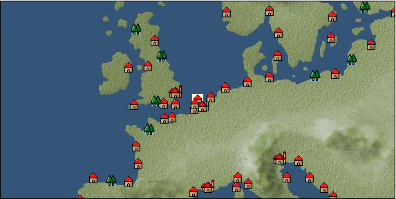

# Port: Herdel

import Tabs from '@theme/Tabs';
import TabItem from '@theme/TabItem';

## General Information

| Attribute | Details |
| :--- | :--- |
| **Port Name** | Herdel |
| **Port Type** | 領地 |
| **Region** | northern europe |
| **Sea Area** | North Sea |
| **Required Language** | dutch |
| **Coordinates** | （66，2466） |
| **Investment Reward** | [Textile secrets and pattern dyeing book](docs/Items/RecipeBooks/item_1491.md) （必要投資額：800,000ドゥカード） |

### Available Facilities

| guild | intermediary | exchange | tool shop | workshop craftsman | Painter | sculptor | peddler |
| --- | --- | --- | --- | --- | --- | --- | --- |
|   |   | ○ | ○ |   |   |   |   |
| Shipyard Master | Lumbermaker | Sail-maker | weapon craftsman | master | TavernFemale | archive | salesperson |
| --- | --- | --- | --- | --- | --- | --- | --- |
|   |   |   |   | ○ |   |   |   |
| Shipwright | 銀行 | street worker | 王宮 | Trading post | church | suburbs | translator |
| --- | --- | --- | --- | --- | --- | --- | --- |
| ○ | ○ | ○ |   |   |   |   |   |

### Description
A small city north of Amsterdam. It faces the North Sea and has a thriving fishing industry. *English is also spoken Cultural area: Low Countries

<Tabs>
  <TabItem value="trade_goods_sales" label="Trade Goods Sales">

| Item | Group | Purchase Price | Allied Price | Remarks |
| --- | --- | --- | --- | --- |
| [chicken](docs/Items/TradeGoods/TradeGoods-Livestock/item_252.md) | [Trading Goods (Livestock)](docs/Categories/category_18.md) | 50 | 44 |  |
| When in alliance: confirmed at 100% |
| [carrot](docs/Items/TradeGoods/TradeGoods-Foodstuffs/item_2708.md) | [Trading items (food items)](docs/Categories/category_3.md) | 88 | 80 |  |
| When in alliance: confirmed at 100% |
| [parsley](docs/Items/TradeGoods/TradeGoods-Spices/item_46.md) | [Trading Goods (Spices)](docs/Categories/category_12.md) | (109) | 96 |  |
| Investment required (Required investment amount: 600,000) When allied: Confirmed at 100% Added in EO Chapter 4 |
| [sheep](docs/Items/TradeGoods/TradeGoods-Livestock/item_253.md) | [Trading Goods (Livestock)](docs/Categories/category_18.md) | 124 | 108 |  |
| When in alliance: confirmed at 100% |
| [egg](docs/Items/TradeGoods/TradeGoods-Foodstuffs/item_40.md) | [Trading items (food items)](docs/Categories/category_3.md) | 28 | 24 |  |
| When in alliance: confirmed at 100% |
| [salt](docs/Items/TradeGoods/TradeGoods-Seasonings/item_42.md) | [交易品（調味料）](docs/Categories/category_4.md) | 237 | 208 |  |
| When in alliance: confirmed at 100% |
| [魚肉](docs/Items/TradeGoods/TradeGoods-Foodstuffs/item_10.md) | [Trading items (food items)](docs/Categories/category_3.md) | 146 | 128 |  |
| When in alliance: confirmed at 100% |
| [chicken meat](docs/Items/TradeGoods/TradeGoods-Foodstuffs/item_29.md) | [Trading items (food items)](docs/Categories/category_3.md) | 322 | 288 |  |
| When in alliance: confirmed at 100% |
  </TabItem>
  <TabItem value="sale_specialty" label="Sale (Specialty)">

| Item | Group | sale price | Allied Price | Remarks |
| --- | --- | --- | --- | --- |

#### [交易品（繊維）](docs/Categories/category_1.md)

| [Rush](docs/Items/TradeGoods/TradeGoods-Fibers/item_3675.md) | 交易品（繊維） | (3,831) | 4,470 |  |
| When in alliance: confirmed at 100% |
| [Basho](docs/Items/TradeGoods/TradeGoods-Fibers/item_3862.md) | 交易品（繊維） | (36,509) | 42,600 |  |
| When in alliance: confirmed at 100% |
| [tiger skin](docs/Items/TradeGoods/TradeGoods-Fibers/item_3790.md) | 交易品（繊維） | (30,852) | 36,000 |  |
| 98％＝35300　103％＝37000 |
| [Green ramie](docs/Items/TradeGoods/TradeGoods-Fibers/item_3428.md) | 交易品（繊維） | (44,479) | 51,900 |  |
| 98％＝50800　104％＝53900 |
| [deerskin](docs/Items/TradeGoods/TradeGoods-Fibers/item_3648.md) | 交易品（繊維） | (30,852) | 36,000 |  |
| When in alliance: confirmed at 100% |

#### [Trading Goods (Dye)](docs/Categories/category_2.md)

| [ward](docs/Items/TradeGoods/TradeGoods-Dye/item_57.md) | Trading Goods (Dye) | (1,175) | 1,370 |  |
| [Shorou](docs/Items/TradeGoods/TradeGoods-Dye/item_3691.md) | Trading Goods (Dye) | (44,050) | 51,400 |  |
| When in alliance: confirmed at 100% |
| [Safflower](docs/Items/TradeGoods/TradeGoods-Dye/item_1059.md) | Trading Goods (Dye) | 810 | (911) |  |
| [mimosa](docs/Items/TradeGoods/TradeGoods-Dye/item_2281.md) | Trading Goods (Dye) | (1,423) | 1,660 |  |
| 98％＝1630　102％＝1680 |
| [Locao](docs/Items/TradeGoods/TradeGoods-Dye/item_3909.md) | Trading Goods (Dye) | (43,965) | 51,300 |  |
| When in alliance: confirmed at 100% |
| [log wood](docs/Items/TradeGoods/TradeGoods-Dye/item_1813.md) | Trading Goods (Dye) | (1,303) | 1,520 |  |
| When in alliance: confirmed at 100% |
| [gallnut](docs/Items/TradeGoods/TradeGoods-Dye/item_3429.md) | Trading Goods (Dye) | (45,079) | 52,600 |  |
| 98％＝51600　104％＝54700 |
| [purple root](docs/Items/TradeGoods/TradeGoods-Dye/item_3752.md) | Trading Goods (Dye) | (30,852) | 36,000 |  |
| 98%＝35300　103％＝37100 |

#### [Trading items (food items)](docs/Categories/category_3.md)

| [buckwheat](docs/Items/TradeGoods/TradeGoods-Foodstuffs/item_3430.md) | Trading items (food items) | (32,738) | 38,200 |  |
| When in alliance: confirmed at 100% |
| [Karasumi](docs/Items/TradeGoods/TradeGoods-Foodstuffs/item_3687.md) | Trading items (food items) | (31,624) | 36,900 |  |
| 98％＝36200　103％＝38000 |
| [kangaroo meat](docs/Items/TradeGoods/TradeGoods-Foodstuffs/item_2285.md) | Trading items (food items) | (857) | 1,000 |  |
| When in alliance: confirmed at 100% |
| [taro](docs/Items/TradeGoods/TradeGoods-Foodstuffs/item_1960.md) | Trading items (food items) | (241) | 281 |  |
| When in alliance: confirmed at 100% |
| [Chinese noodles](docs/Items/TradeGoods/TradeGoods-Foodstuffs/item_3906.md) | Trading items (food items) | (31,881) | 37,200 |  |
| When in alliance: confirmed at 100% |
| [楊州栗](docs/Items/TradeGoods/TradeGoods-Foodstuffs/item_3789.md) | Trading items (food items) | (9,342) | 10,900 |  |
| When in alliance: confirmed at 100% |

#### [交易品（調味料）](docs/Categories/category_4.md)

| [oyster sauce](docs/Items/TradeGoods/TradeGoods-Seasonings/item_3505.md) | 交易品（調味料） | (2,846) | 3,320 |  |
| When in alliance: confirmed at 100% |
| [Gochujang](docs/Items/TradeGoods/TradeGoods-Seasonings/item_3591.md) | 交易品（調味料） | (6,668) | 7,780 |  |
| 98％＝7640　104％＝8050 |
| [tamarind](docs/Items/TradeGoods/TradeGoods-Seasonings/item_1968.md) | 交易品（調味料） | (2,040) | 2,380 |  |
| 98％＝2310　104％＝2420 |
| [Choshi](docs/Items/TradeGoods/TradeGoods-Seasonings/item_3793.md) | 交易品（調味料） | (30,767) | 35,900 |  |
| 98％＝35200　103％＝36900 |
| [apple cider vinegar](docs/Items/TradeGoods/TradeGoods-Seasonings/item_882.md) | 交易品（調味料） | 458 | 469 |  |
| [miso](docs/Items/TradeGoods/TradeGoods-Seasonings/item_3420.md) | 交易品（調味料） | (3,668) | 4,280 |  |
| When in alliance: confirmed at 100% |
| [Sha Cha Ji](docs/Items/TradeGoods/TradeGoods-Seasonings/item_3689.md) | 交易品（調味料） | (31,281) | 36,500 |  |
| When in alliance: confirmed at 100% |
| [Bean sauce](docs/Items/TradeGoods/TradeGoods-Seasonings/item_3875.md) | 交易品（調味料） | (34,109) | 39,800 |  |
| When in alliance: confirmed at 100% |
| [soy sauce](docs/Items/TradeGoods/TradeGoods-Seasonings/item_3425.md) | 交易品（調味料） | (35,309) | 41,200 |  |
| 98％＝40400　104％＝42800 |
| [black vinegar](docs/Items/TradeGoods/TradeGoods-Seasonings/item_3475.md) | 交易品（調味料） | (4,663) | 5,440 |  |
| 98％＝5350 104％＝5620 |

#### [交易品（雑貨）](docs/Categories/category_5.md)

| [chinese books](docs/Items/TradeGoods/TradeGoods-Misc/item_3927.md) | 交易品（雑貨） | (33,252) | 38,800 |  |
| 98％＝38000　102％＝39500 |
| [old ink stick](docs/Items/TradeGoods/TradeGoods-Misc/item_3921.md) | 交易品（雑貨） | (9,942) | 11,600 |  |
| [Japanese books](docs/Items/TradeGoods/TradeGoods-Misc/item_3439.md) | 交易品（雑貨） | (34,452) | 40,200 |  |
| When in alliance: confirmed at 100% |
| [lantern](docs/Items/TradeGoods/TradeGoods-Misc/item_3683.md) | 交易品（雑貨） | (9,513) | 11,100 |  |
| When in alliance: confirmed at 100% |
| [Korean books](docs/Items/TradeGoods/TradeGoods-Misc/item_3750.md) | 交易品（雑貨） | (31,110) | 36,300 |  |
| When in alliance: confirmed at 100% |
| [rattan work](docs/Items/TradeGoods/TradeGoods-Misc/item_3698.md) | 交易品（雑貨） | (45,421) | 53,000 |  |
| 98％＝51900　102％＝54000 |

#### [Trading products (medical products)](docs/Categories/category_6.md)

| [Saikaku](docs/Items/TradeGoods/TradeGoods-Medicine/item_1959.md) | Trading products (medical products) | (4,440) | 5,180 |  |
| When in alliance: confirmed at 100% |
| [tea tree](docs/Items/TradeGoods/TradeGoods-Medicine/item_2283.md) | Trading products (medical products) | (1,397) | 1,630 |  |
| When in alliance: confirmed at 100% |
| [Borei](docs/Items/TradeGoods/TradeGoods-Medicine/item_3678.md) | Trading products (medical products) | (31,881) | 37,200 |  |
| 98％＝36500　105％＝39000 |
| [Cordyceps sinensis](docs/Items/TradeGoods/TradeGoods-Medicine/item_3839.md) | Trading products (medical products) | (43,536) | 50,800 |  |
| 98％＝49800　104％＝52800 |
| [Korean ginseng](docs/Items/TradeGoods/TradeGoods-Medicine/item_3738.md) | Trading products (medical products) | (30,767) | 35,900 |  |
| 98％＝35200　106％＝37900 |
| [Nothing](docs/Items/TradeGoods/TradeGoods-Medicine/item_1053.md) | Trading products (medical products) | 1,016 | (1,143) |  |
| [calamus](docs/Items/TradeGoods/TradeGoods-Medicine/item_3427.md) | Trading products (medical products) | (34,023) | 39,700 |  |
| When in alliance: confirmed at 100% |

#### [Trading Items (Iron Stone)](docs/Categories/category_7.md)

| [white porcelain ore](docs/Items/TradeGoods/TradeGoods-Minerals/item_3433.md) | Trading Items (Iron Stone) | (34,880) | 40,700 |  |
| When in alliance: confirmed at 100% |
| [red copper ore](docs/Items/TradeGoods/TradeGoods-Minerals/item_3863.md) | Trading Items (Iron Stone) | (33,938) | 39,600 |  |
| 98％＝38800　102％＝40300 |
| [medical stone](docs/Items/TradeGoods/TradeGoods-Minerals/item_3786.md) | Trading Items (Iron Stone) | (31,195) | 36,400 |  |
| When in alliance: confirmed at 100% |

#### [Trading products (precious metals)](docs/Categories/category_8.md)

| [佐摩銀](docs/Items/TradeGoods/TradeGoods-Metals/item_3432.md) | Trading products (precious metals) | (36,766) | 42,900 |  |
| When in alliance: confirmed at 100% |
| [Korean silver](docs/Items/TradeGoods/TradeGoods-Metals/item_3796.md) | Trading products (precious metals) | (31,367) | 36,600 |  |
| When in alliance: confirmed at 100% |
| [Jinguashijin](docs/Items/TradeGoods/TradeGoods-Metals/item_3693.md) | Trading products (precious metals) | (31,024) | 36,200 |  |
| When in alliance: confirmed at 100% |
| [雲南銀](docs/Items/TradeGoods/TradeGoods-Metals/item_3905.md) | Trading products (precious metals) | (34,709) | 40,500 |  |
| When in alliance: confirmed at 100% |

#### [交易品（酒類）](docs/Categories/category_9.md)

| [sherry](docs/Items/TradeGoods/TradeGoods-Alcohol/item_844.md) | 交易品（酒類） | (517) | 603 |  |
| [fruit brandy](docs/Items/TradeGoods/TradeGoods-Alcohol/item_1440.md) | 交易品（酒類） | 681 | 688 |  |
| [Taiwan rice wine](docs/Items/TradeGoods/TradeGoods-Alcohol/item_3672.md) | 交易品（酒類） | (31,110) | 36,300 |  |
| When in alliance: confirmed at 100% |
| [Andong soju](docs/Items/TradeGoods/TradeGoods-Alcohol/item_3757.md) | 交易品（酒類） | 32,500 | 37,700 |  |
| When in alliance: confirmed at 100% |
| [Sake](docs/Items/TradeGoods/TradeGoods-Alcohol/item_3424.md) | 交易品（酒類） | (34,709) | 40,500 |  |
| When in alliance: confirmed at 100% |
| [紹興酒](docs/Items/TradeGoods/TradeGoods-Alcohol/item_3882.md) | 交易品（酒類） | (34,280) | 40,000 |  |
| When in alliance: confirmed at 100% |

#### [Trading goods (hobby goods)](docs/Categories/category_10.md)

| [Aigyoku](docs/Items/TradeGoods/TradeGoods-Sunddries/item_3677.md) | Trading goods (hobby goods) | (30,595) | 35,700 |  |
| When in alliance: confirmed at 100% |
| [caviar](docs/Items/TradeGoods/TradeGoods-Sunddries/item_2122.md) | Trading goods (hobby goods) | (1,569) | 1,830 |  |
| When in alliance: confirmed at 100% |
| [eggplant](docs/Items/TradeGoods/TradeGoods-Sunddries/item_3426.md) | Trading goods (hobby goods) | (32,738) | 38,200 |  |
| When in alliance: confirmed at 100% |
| [pistachio](docs/Items/TradeGoods/TradeGoods-Sunddries/item_2353.md) | Trading goods (hobby goods) | (844) | 984 |  |
| When in alliance: confirmed at 100% |
| [prune](docs/Items/TradeGoods/TradeGoods-Sunddries/item_523.md) | Trading goods (hobby goods) | (441) | 514 |  |
| When in alliance: confirmed at 100% |
| [macadamia nuts](docs/Items/TradeGoods/TradeGoods-Sunddries/item_2282.md) | Trading goods (hobby goods) | (1,080) | 1,260 |  |
| When in alliance: confirmed at 100% |
| [mango](docs/Items/TradeGoods/TradeGoods-Sunddries/item_2095.md) | Trading goods (hobby goods) | (840) | 979 |  |
| When in alliance: confirmed at 100% |
| [lemon myrtle](docs/Items/TradeGoods/TradeGoods-Sunddries/item_2840.md) | Trading goods (hobby goods) | (2,049) | 2,390 |  |
| When in alliance: confirmed at 100% |
| [Chinese tea](docs/Items/TradeGoods/TradeGoods-Sunddries/item_3907.md) | Trading goods (hobby goods) | (33,681) | 39,300 |  |
| When in alliance: confirmed at 100% |
| [dried figs](docs/Items/TradeGoods/TradeGoods-Sunddries/item_611.md) | Trading goods (hobby goods) | (417) | 486 |  |
| [dried apple](docs/Items/TradeGoods/TradeGoods-Sunddries/item_19.md) | Trading goods (hobby goods) | (345) | 402 |  |
| When in alliance: confirmed at 100% |
| [Korean tea](docs/Items/TradeGoods/TradeGoods-Sunddries/item_3751.md) | Trading goods (hobby goods) | 22,804 | 36,100 |  |
| When in alliance: confirmed at 100% |
| [金針花](docs/Items/TradeGoods/TradeGoods-Sunddries/item_3739.md) | Trading goods (hobby goods) | (9,513) | 11,100 |  |
| When in alliance: confirmed at 100% |

#### [Trading Goods (Spices)](docs/Categories/category_11.md)

| [oakmoss](docs/Items/TradeGoods/TradeGoods-Perfume/item_819.md) | Trading Goods (Spices) | 1,347 | (1,515) |  |
| [Osmanthus](docs/Items/TradeGoods/TradeGoods-Perfume/item_3925.md) | Trading Goods (Spices) | (35,137) | 41,000 |  |
| 98％＝40200　104％＝42600 |
| [gardenia](docs/Items/TradeGoods/TradeGoods-Perfume/item_1091.md) | Trading Goods (Spices) | (44,222) | 51,600 |  |
| 98％＝50600　104％＝53600 |
| [daffodil](docs/Items/TradeGoods/TradeGoods-Perfume/item_612.md) | Trading Goods (Spices) | 1,177 | (1,324) |  |
| [geranium](docs/Items/TradeGoods/TradeGoods-Perfume/item_145.md) | Trading Goods (Spices) | (1,140) | 1,330 |  |
| [Chindarle](docs/Items/TradeGoods/TradeGoods-Perfume/item_3795.md) | Trading Goods (Spices) | (30,852) | 36,000 |  |
| 98％＝35300　103％＝37000 |
| [Hamanasu](docs/Items/TradeGoods/TradeGoods-Perfume/item_3692.md) | Trading Goods (Spices) | (30,938) | 36,100 |  |
| When in alliance: confirmed at 100% |
| [patchouli](docs/Items/TradeGoods/TradeGoods-Perfume/item_1963.md) | Trading Goods (Spices) | (2,657) | 3,100 |  |
| 98％＝3070　103％＝3140 |
| [eucalyptus](docs/Items/TradeGoods/TradeGoods-Perfume/item_2278.md) | Trading Goods (Spices) | (1,012) | 1,180 |  |
| When in alliance: confirmed at 100% |
| [lira](docs/Items/TradeGoods/TradeGoods-Perfume/item_30.md) | Trading Goods (Spices) | (701) | 817 |  |
| 98％＝802　102％＝832 |
| [sandalwood](docs/Items/TradeGoods/TradeGoods-Perfume/item_771.md) | Trading Goods (Spices) | (4,320) | 5,040 |  |
| [龍脳](docs/Items/TradeGoods/TradeGoods-Perfume/item_1676.md) | Trading Goods (Spices) | 3,125 | (3,515) |  |

#### [Trading Goods (Spices)](docs/Categories/category_12.md)

| [allspice](docs/Items/TradeGoods/TradeGoods-Spices/item_1848.md) | Trading Goods (Spices) | (1,637) | 1,910 |  |
| When in alliance: confirmed at 100% |
| [garam masala](docs/Items/TradeGoods/TradeGoods-Spices/item_965.md) | Trading Goods (Spices) | (724) | 844 |  |
| 100％＝844 |
| [Kouzuku](docs/Items/TradeGoods/TradeGoods-Spices/item_3690.md) | Trading Goods (Spices) | (32,224) | 37,600 |  |
| When in alliance: confirmed at 100% |
| [pepper](docs/Items/TradeGoods/TradeGoods-Spices/item_58.md) | Trading Goods (Spices) | (12,427) | 14,500 |  |
| 100% Neder nationality confirmed |
| [Sanshou](docs/Items/TradeGoods/TradeGoods-Spices/item_3794.md) | Trading Goods (Spices) | (31,024) | 36,200 |  |
| 98％＝35500　104％＝37600 |
| [star anise](docs/Items/TradeGoods/TradeGoods-Spices/item_3908.md) | Trading Goods (Spices) | (32,224) | 37,600 |  |
| 98％＝36900　104％＝39100 |
| [nutmeg](docs/Items/TradeGoods/TradeGoods-Spices/item_1969.md) | Trading Goods (Spices) | (11,656) | 13,600 |  |
| 99％＝13500　106％＝14400 |
| [bergamot](docs/Items/TradeGoods/TradeGoods-Spices/item_879.md) | Trading Goods (Spices) | (698) | 814 |  |
| [mace](docs/Items/TradeGoods/TradeGoods-Spices/item_2100.md) | Trading Goods (Spices) | (12,213) | 14,250 |  |
| [Grapefruit](docs/Items/TradeGoods/TradeGoods-Spices/item_3422.md) | Trading Goods (Spices) | (34,623) | 40,400 |  |
| When in alliance: confirmed at 100% |

#### [Trading goods (artificial goods)](docs/Categories/category_13.md)

| [glasswork](docs/Items/TradeGoods/TradeGoods-Luxuries/item_60.md) | Trading goods (artificial goods) | (1,457) | 1,700 |  |
| [Tumbaga](docs/Items/TradeGoods/TradeGoods-Luxuries/item_3028.md) | Trading goods (artificial goods) | 20,562 | (23,134) |  |
| [Kuresute](docs/Items/TradeGoods/TradeGoods-Luxuries/item_3897.md) | Trading goods (artificial goods) | (10,542) | 12,300 |  |
| When in alliance: confirmed at 100% |
| [Song Baici](docs/Items/TradeGoods/TradeGoods-Luxuries/item_3904.md) | Trading goods (artificial goods) | (33,338) | 38,900 |  |
| 98％＝38200　105％＝40800 |
| [湖筆](docs/Items/TradeGoods/TradeGoods-Luxuries/item_3898.md) | Trading goods (artificial goods) | (10,027) | 11,700 |  |
| When in alliance: confirmed at 100% |
| [lacquerware](docs/Items/TradeGoods/TradeGoods-Luxuries/item_3435.md) | Trading goods (artificial goods) | (36,166) | 42,200 |  |
| 98％＝41400　103％＝43400 |
| [Corner work](docs/Items/TradeGoods/TradeGoods-Luxuries/item_3696.md) | Trading goods (artificial goods) | (29,995) | 35,000 |  |
| 98％＝34300　103％＝36000 |
| [Goryeo celadon](docs/Items/TradeGoods/TradeGoods-Luxuries/item_3758.md) | Trading goods (artificial goods) | (30,852) | 36,000 |  |
| 98%＝35300　105％＝37800 |

#### [交易品（美術品）](docs/Categories/category_14.md)

| [chinese calligraphy](docs/Items/TradeGoods/TradeGoods-Art/item_3926.md) | 交易品（美術品） | (34,109) | 39,800 |  |
| 98％＝39000　103％＝40900 |
| [taiwan wood carving](docs/Items/TradeGoods/TradeGoods-Art/item_3697.md) | 交易品（美術品） | (30,510) | 35,600 |  |
| 98％＝34900　104％＝36900 |
| [Japanese painting](docs/Items/TradeGoods/TradeGoods-Art/item_3436.md) | 交易品（美術品） | (34,280) | 40,000 |  |
| When in alliance: confirmed at 100% |
| [oil painting](docs/Items/TradeGoods/TradeGoods-Art/item_1088.md) | 交易品（美術品） | (2,426) | 2,830 |  |
| [Mother-of-pearl lacquerware](docs/Items/TradeGoods/TradeGoods-Art/item_3785.md) | 交易品（美術品） | (31,709) | 37,000 |  |
| When in alliance: confirmed at 100% |

#### [Trading Items (Gemstones)](docs/Categories/category_15.md)

| [jade](docs/Items/TradeGoods/TradeGoods-Gems/item_2015.md) | Trading Items (Gemstones) | (5,014) | 5,850 |  |
| When in alliance: confirmed at 100% |
| [aventurine](docs/Items/TradeGoods/TradeGoods-Gems/item_678.md) | Trading Items (Gemstones) | (5,400) | 6,300 |  |
| [inca rose](docs/Items/TradeGoods/TradeGoods-Gems/item_3014.md) | Trading Items (Gemstones) | (15,120) | 17,642 |  |
| [opal](docs/Items/TradeGoods/TradeGoods-Gems/item_2006.md) | Trading Items (Gemstones) | (6,991) | 8,157 |  |
| [cat's eye](docs/Items/TradeGoods/TradeGoods-Gems/item_1047.md) | Trading Items (Gemstones) | (9,256) | 10,800 |  |
| [sapphire](docs/Items/TradeGoods/TradeGoods-Gems/item_676.md) | Trading Items (Gemstones) | 11,800 | 13,100 |  |
| [turquoise](docs/Items/TradeGoods/TradeGoods-Gems/item_1006.md) | Trading Items (Gemstones) | (3,728) | 4,350 |  |
| 98％＝4280　103％＝4450 |
| [diamond](docs/Items/TradeGoods/TradeGoods-Gems/item_449.md) | Trading Items (Gemstones) | 8,350 | 9,160 |  |
| [pink diamond](docs/Items/TradeGoods/TradeGoods-Gems/item_2874.md) | Trading Items (Gemstones) | (13,627) | 15,900 |  |
| When in alliance: confirmed at 100% |
| [lapis lazuli](docs/Items/TradeGoods/TradeGoods-Gems/item_995.md) | Trading Items (Gemstones) | (5,768) | 6,730 |  |
| 98％＝6640　102％＝6820 |
| [ruby](docs/Items/TradeGoods/TradeGoods-Gems/item_773.md) | Trading Items (Gemstones) | (11,656) | 13,600 |  |
| 98%＝13400 |
| [mutton fat white jade](docs/Items/TradeGoods/TradeGoods-Gems/item_3903.md) | Trading Items (Gemstones) | (44,479) | 51,900 |  |
| 98％＝50900　105％＝54400 |
| [tiger eye stone](docs/Items/TradeGoods/TradeGoods-Gems/item_3797.md) | Trading Items (Gemstones) | (30,767) | 35,900 |  |
| When in alliance: confirmed at 100% |

#### [Trading Items (Arms)](docs/Categories/category_16.md)

| [crossbow](docs/Items/TradeGoods/TradeGoods-Weapons/item_537.md) | Trading Items (Arms) | 1,352 | 1,427 |  |
| [damascus sword](docs/Items/TradeGoods/TradeGoods-Weapons/item_903.md) | Trading Items (Arms) | (6,077) | 7,090 |  |
| [Japanese bow](docs/Items/TradeGoods/TradeGoods-Weapons/item_3469.md) | Trading Items (Arms) | (11,227) | 13,100 |  |
| 98％＝12800　101％＝13200 |
| [broadsword](docs/Items/TradeGoods/TradeGoods-Weapons/item_3754.md) | Trading Items (Arms) | (43,536) | 50,800 |  |
| When in alliance: confirmed at 100% |
| [Japanese sword](docs/Items/TradeGoods/TradeGoods-Weapons/item_3437.md) | Trading Items (Arms) | (33,338) | 38,900 |  |
| When in alliance: confirmed at 100% |
| [japanese armor](docs/Items/TradeGoods/TradeGoods-Weapons/item_3590.md) | Trading Items (Arms) | (11,141) | 13,000 |  |
| When in alliance: confirmed at 100% |
| [rattan armor](docs/Items/TradeGoods/TradeGoods-Weapons/item_3699.md) | Trading Items (Arms) | (29,995) | 35,000 |  |
| 98％＝34300　104％＝36300 |
| [Blue dragon sword](docs/Items/TradeGoods/TradeGoods-Weapons/item_3923.md) | Trading Items (Arms) | (33,252) | 38,800 |  |
| When in alliance: confirmed at 100% |

#### [Trading Items (Firearms)](docs/Categories/category_17.md)

| [musket gun](docs/Items/TradeGoods/TradeGoods-Firearms/item_584.md) | Trading Items (Firearms) | (3,051) | 3,559 |  |
| [monocular gun](docs/Items/TradeGoods/TradeGoods-Firearms/item_3916.md) | Trading Items (Firearms) | (33,509) | 39,100 |  |
| When in alliance: confirmed at 100% |
| [throwing bomb](docs/Items/TradeGoods/TradeGoods-Firearms/item_3784.md) | Trading Items (Firearms) | (31,110) | 36,300 |  |
| When in alliance: confirmed at 100% |
| [tanegashima gun](docs/Items/TradeGoods/TradeGoods-Firearms/item_3423.md) | Trading Items (Firearms) | (32,052) | 37,400 |  |
| When in alliance: confirmed at 100% |
| [銅手銃](docs/Items/TradeGoods/TradeGoods-Firearms/item_3700.md) | Trading Items (Firearms) | (30,338) | 35,400 |  |
| When in alliance: confirmed at 100% |

#### [Trading Goods (Livestock)](docs/Categories/category_18.md)

| [boar](docs/Items/TradeGoods/TradeGoods-Livestock/item_3476.md) | Trading Goods (Livestock) | (32,395) | 37,800 |  |
| When in alliance: confirmed at 100% |
| [water buffalo](docs/Items/TradeGoods/TradeGoods-Livestock/item_3688.md) | Trading Goods (Livestock) | (1,500) | 1,750 |  |
| When in alliance: confirmed at 100% |
| [donkey](docs/Items/TradeGoods/TradeGoods-Livestock/item_3924.md) | Trading Goods (Livestock) | (1,980) | 2,310 |  |
| When in alliance: confirmed at 100% |
| [韓牛](docs/Items/TradeGoods/TradeGoods-Livestock/item_3792.md) | Trading Goods (Livestock) | (31,538) | 36,800 |  |
| When in alliance: confirmed at 100% |

#### [交易品（工業品）](docs/Categories/category_19.md)

| [Japanese paper](docs/Items/TradeGoods/TradeGoods-Wares/item_3438.md) | 交易品（工業品） | (24,939) | 29,100 |  |
| [marble](docs/Items/TradeGoods/TradeGoods-Wares/item_52.md) | 交易品（工業品） | (1,697) | 1,980 |  |
| [bamboo](docs/Items/TradeGoods/TradeGoods-Wares/item_3899.md) | 交易品（工業品） | (33,681) | 39,300 |  |
| When in alliance: confirmed at 100% |
| [rattan](docs/Items/TradeGoods/TradeGoods-Wares/item_3701.md) | 交易品（工業品） | (43,279) | 50,500 |  |
| When in alliance: confirmed at 100% |
| [羊皮紙](docs/Items/TradeGoods/TradeGoods-Wares/item_53.md) | 交易品（工業品） | (1,432) | 1,670 |  |
| [韓紙](docs/Items/TradeGoods/TradeGoods-Wares/item_3755.md) | 交易品（工業品） | (43,707) | 51,000 |  |
| When in alliance: confirmed at 100% |

#### [交易品（織物）](docs/Categories/category_20.md)

| [Awaiyo](docs/Items/TradeGoods/TradeGoods-Fabrics/item_3002.md) | 交易品（織物） | 10,282 | 11,422 |  |
| [gobelin weave](docs/Items/TradeGoods/TradeGoods-Fabrics/item_1276.md) | 交易品（織物） | (3,317) | 3,870 |  |
| When in alliance: confirmed at 100% |
| [damask](docs/Items/TradeGoods/TradeGoods-Fabrics/item_614.md) | 交易品（織物） | 5,259 | (5,916) |  |
| [turkish rug](docs/Items/TradeGoods/TradeGoods-Fabrics/item_686.md) | 交易品（織物） | (6,565) | 7,660 |  |
| 98%＝7540　107％＝8070 |
| [velvet](docs/Items/TradeGoods/TradeGoods-Fabrics/item_902.md) | 交易品（織物） | (4,057) | 4,733 |  |
| [China Duantong](docs/Items/TradeGoods/TradeGoods-Fabrics/item_3478.md) | 交易品（織物） | (18,512) | 21,600 |  |
| When in alliance: confirmed at 100% |
| [唐錦](docs/Items/TradeGoods/TradeGoods-Fabrics/item_3896.md) | 交易品（織物） | (35,137) | 41,000 |  |
| When in alliance: confirmed at 100% |
| [大和錦](docs/Items/TradeGoods/TradeGoods-Fabrics/item_3482.md) | 交易品（織物） | (18,512) | 21,600 |  |
| 98％＝21300　102％＝21900 |
| [明紬](docs/Items/TradeGoods/TradeGoods-Fabrics/item_3753.md) | 交易品（織物） | (31,538) | 36,800 |  |
| When in alliance: confirmed at 100% |
| [Bingata](docs/Items/TradeGoods/TradeGoods-Fabrics/item_3479.md) | 交易品（織物） | (18,426) | 21,500 |  |
| 96％＝20900　101％＝21700 |
| [Nishijin textile](docs/Items/TradeGoods/TradeGoods-Fabrics/item_3431.md) | 交易品（織物） | (45,764) | 53,400 |  |
| When in alliance: confirmed at 100% |
| [麻織物](docs/Items/TradeGoods/TradeGoods-Fabrics/item_3673.md) | 交易品（織物） | (32,824) | 38,300 |  |
| When in alliance: confirmed at 100% |
  </TabItem>
  <TabItem value="sale_no_specialty" label="Sale (No Specialty)">

| Item | Group | sale price | Allied Price | Remarks |
| --- | --- | --- | --- | --- |

#### [交易品（繊維）](docs/Categories/category_1.md)

| [peacock feather](docs/Items/TradeGoods/TradeGoods-Fibers/item_901.md) | 交易品（繊維） | (446) | 520 |  |
| 92％＝479　101％＝526 |
| [fur](docs/Items/TradeGoods/TradeGoods-Fibers/item_634.md) | 交易品（繊維） | 1,323 | 1,361 |  |
| [leather](docs/Items/TradeGoods/TradeGoods-Fibers/item_44.md) | 交易品（繊維） | 774 | (870) |  |
| [cotton](docs/Items/TradeGoods/TradeGoods-Fibers/item_610.md) | 交易品（繊維） | 675 | (759) |  |
| [wool](docs/Items/TradeGoods/TradeGoods-Fibers/item_5.md) | 交易品（繊維） | 444 | 458 |  |
| [feather](docs/Items/TradeGoods/TradeGoods-Fibers/item_585.md) | 交易品（繊維） | 618 | (695) |  |

#### [Trading Goods (Dye)](docs/Categories/category_2.md)

| [貝紫](docs/Items/TradeGoods/TradeGoods-Dye/item_110.md) | Trading Goods (Dye) | (4,691) | 5,473 |  |

#### [Trading items (food items)](docs/Categories/category_3.md)

| [mushroom](docs/Items/TradeGoods/TradeGoods-Foodstuffs/item_160.md) | Trading items (food items) | 32 | (36) |  |
| [duck meat](docs/Items/TradeGoods/TradeGoods-Foodstuffs/item_32.md) | Trading items (food items) | 423 | 469 |  |
| [sardine](docs/Items/TradeGoods/TradeGoods-Foodstuffs/item_39.md) | Trading items (food items) | (14) | 16 |  |
| [Flatfish](docs/Items/TradeGoods/TradeGoods-Foodstuffs/item_255.md) | Trading items (food items) | (28) | 32 |  |
| [Quinoa](docs/Items/TradeGoods/TradeGoods-Foodstuffs/item_2994.md) | Trading items (food items) | (335) | 390 |  |
| When in alliance: confirmed at 100% |
| [sole](docs/Items/TradeGoods/TradeGoods-Foodstuffs/item_45.md) | Trading items (food items) | (96) | 112 |  |
| [sausage](docs/Items/TradeGoods/TradeGoods-Foodstuffs/item_27.md) | Trading items (food items) | 375 | 389 |  |
| [onion](docs/Items/TradeGoods/TradeGoods-Foodstuffs/item_28.md) | Trading items (food items) | (120) | 140 |  |
| [cheese](docs/Items/TradeGoods/TradeGoods-Foodstuffs/item_20.md) | Trading items (food items) | 409 | 420 |  |
| 101％＝424　98％＝411 |
| [corn](docs/Items/TradeGoods/TradeGoods-Foodstuffs/item_138.md) | Trading items (food items) | (193) | 225 |  |
| [ham](docs/Items/TradeGoods/TradeGoods-Foodstuffs/item_290.md) | Trading items (food items) | 423 | 440 |  |
| [bacon](docs/Items/TradeGoods/TradeGoods-Foodstuffs/item_566.md) | Trading items (food items) | 391 | 405 |  |
| [crocodile meat](docs/Items/TradeGoods/TradeGoods-Foodstuffs/item_2284.md) | Trading items (food items) | (656) | 765 |  |
| 98％＝750　105％＝804 |
| [milk](docs/Items/TradeGoods/TradeGoods-Foodstuffs/item_254.md) | Trading items (food items) | 146 | (164) |  |
| [egg](docs/Items/TradeGoods/TradeGoods-Foodstuffs/item_40.md) | Trading items (food items) | 12 | (13) |  |
| When in alliance: confirmed at 100% |
| [wheat](docs/Items/TradeGoods/TradeGoods-Foodstuffs/item_16.md) | Trading items (food items) | 72 | 77 |  |
| When in alliance: confirmed at 100% |
| [beef](docs/Items/TradeGoods/TradeGoods-Foodstuffs/item_26.md) | Trading items (food items) | (580) | 676 |  |
| [mutton](docs/Items/TradeGoods/TradeGoods-Foodstuffs/item_33.md) | Trading items (food items) | 428 | 487 |  |
| [pork](docs/Items/TradeGoods/TradeGoods-Foodstuffs/item_41.md) | Trading items (food items) | 353 | (397) |  |
| [taro](docs/Items/TradeGoods/TradeGoods-Foodstuffs/item_3421.md) | Trading items (food items) | (292) | 340 |  |
| When in alliance: confirmed at 100% |
| [魚肉](docs/Items/TradeGoods/TradeGoods-Foodstuffs/item_10.md) | Trading items (food items) | 55 | 64 |  |
| When in alliance: confirmed at 100% |
| [chicken meat](docs/Items/TradeGoods/TradeGoods-Foodstuffs/item_29.md) | Trading items (food items) | 458 | (515) |  |
| When in alliance: confirmed at 100% |

#### [交易品（調味料）](docs/Categories/category_4.md)

| [anchovies](docs/Items/TradeGoods/TradeGoods-Seasonings/item_3004.md) | 交易品（調味料） | (245) | 285 |  |
| When in alliance: confirmed at 100% |
| [herbal oil](docs/Items/TradeGoods/TradeGoods-Seasonings/item_880.md) | 交易品（調味料） | (237) | 276 |  |
| When in alliance: confirmed at 100% |
| [herbal salt](docs/Items/TradeGoods/TradeGoods-Seasonings/item_840.md) | 交易品（調味料） | (223) | 260 |  |
| When in alliance: confirmed at 100% |
| [butter](docs/Items/TradeGoods/TradeGoods-Seasonings/item_3.md) | 交易品（調味料） | (308) | 359 |  |
| When in alliance: confirmed at 100% |
| [lard](docs/Items/TradeGoods/TradeGoods-Seasonings/item_43.md) | 交易品（調味料） | (294) | 342 |  |
| When in alliance: confirmed at 100% |
| [Honey](docs/Items/TradeGoods/TradeGoods-Seasonings/item_49.md) | 交易品（調味料） | (917) | 1,070 |  |
| 98％＝1050 103％＝1110 |

#### [交易品（雑貨）](docs/Categories/category_5.md)

| [Western books](docs/Items/TradeGoods/TradeGoods-Misc/item_293.md) | 交易品（雑貨） | (608) | 709 |  |

#### [Trading products (medical products)](docs/Categories/category_6.md)

| [anise](docs/Items/TradeGoods/TradeGoods-Medicine/item_1050.md) | Trading products (medical products) | (303) | 353 |  |
| When in alliance: confirmed at 100% |
| [Elder](docs/Items/TradeGoods/TradeGoods-Medicine/item_34.md) | Trading products (medical products) | (235) | 274 |  |
| 102％＝279 98％＝268 |
| [chamomile](docs/Items/TradeGoods/TradeGoods-Medicine/item_292.md) | Trading products (medical products) | 357 | 363 |  |
| [dandelion](docs/Items/TradeGoods/TradeGoods-Medicine/item_1089.md) | Trading products (medical products) | (277) | 323 |  |
| When in alliance: confirmed at 100% |
| [belladonna](docs/Items/TradeGoods/TradeGoods-Medicine/item_1056.md) | Trading products (medical products) | (487) | 568 |  |
| When in alliance: confirmed at 100% |
| [rose hips](docs/Items/TradeGoods/TradeGoods-Medicine/item_904.md) | Trading products (medical products) | 476 | 487 |  |

#### [Trading Items (Iron Stone)](docs/Categories/category_7.md)

| [tin ore](docs/Items/TradeGoods/TradeGoods-Minerals/item_23.md) | Trading Items (Iron Stone) | 552 | (621) |  |
| [iron ore](docs/Items/TradeGoods/TradeGoods-Minerals/item_146.md) | Trading Items (Iron Stone) | 734 | (825) |  |
| [lead ore](docs/Items/TradeGoods/TradeGoods-Minerals/item_21.md) | Trading Items (Iron Stone) | 504 | (567) |  |
| [copper ore](docs/Items/TradeGoods/TradeGoods-Minerals/item_65.md) | Trading Items (Iron Stone) | (772) | 900 |  |

#### [Trading products (precious metals)](docs/Categories/category_8.md)

| [silver](docs/Items/TradeGoods/TradeGoods-Metals/item_136.md) | Trading products (precious metals) | (2,709) | 3,160 |  |
| When in alliance: confirmed at 100% |

#### [交易品（酒類）](docs/Categories/category_9.md)

| [aquavit](docs/Items/TradeGoods/TradeGoods-Alcohol/item_572.md) | 交易品（酒類） | 623 | 625 |  |
| [whiskey](docs/Items/TradeGoods/TradeGoods-Alcohol/item_1.md) | 交易品（酒類） | (625) | 729 |  |
| [gin](docs/Items/TradeGoods/TradeGoods-Alcohol/item_291.md) | 交易品（酒類） | 589 | 614 |  |
| [Beer](docs/Items/TradeGoods/TradeGoods-Alcohol/item_2.md) | 交易品（酒類） | 293 | 303 |  |
| When in alliance: confirmed at 100% |
| [brandy](docs/Items/TradeGoods/TradeGoods-Alcohol/item_9.md) | 交易品（酒類） | (765) | 892 |  |
| [liqueur](docs/Items/TradeGoods/TradeGoods-Alcohol/item_18.md) | 交易品（酒類） | (584) | 681 |  |
| [wine](docs/Items/TradeGoods/TradeGoods-Alcohol/item_11.md) | 交易品（酒類） | (480) | 560 |  |
| [Shochu](docs/Items/TradeGoods/TradeGoods-Alcohol/item_3449.md) | 交易品（酒類） | (6,848) | 7,990 |  |
| When in alliance: confirmed at 100% |

#### [Trading goods (hobby goods)](docs/Categories/category_10.md)

| [almond](docs/Items/TradeGoods/TradeGoods-Sunddries/item_367.md) | Trading goods (hobby goods) | (181) | 211 |  |
| When in alliance: confirmed at 100% |
| [dried apricots](docs/Items/TradeGoods/TradeGoods-Sunddries/item_8.md) | Trading goods (hobby goods) | (395) | 460 |  |
| [raisins](docs/Items/TradeGoods/TradeGoods-Sunddries/item_35.md) | Trading goods (hobby goods) | (264) | 308 |  |

#### [Trading Goods (Spices)](docs/Categories/category_11.md)

| [cedar wood](docs/Items/TradeGoods/TradeGoods-Perfume/item_905.md) | Trading Goods (Spices) | (452) | 527 |  |
| [rose](docs/Items/TradeGoods/TradeGoods-Perfume/item_536.md) | Trading Goods (Spices) | (2,404) | 2,804 |  |
| [agarwood](docs/Items/TradeGoods/TradeGoods-Perfume/item_1058.md) | Trading Goods (Spices) | (2,160) | 2,520 |  |
| When in alliance: confirmed at 100% |
| [Musk](docs/Items/TradeGoods/TradeGoods-Perfume/item_158.md) | Trading Goods (Spices) | 4,795 | (5,394) |  |

#### [Trading Goods (Spices)](docs/Categories/category_12.md)

| [garlic](docs/Items/TradeGoods/TradeGoods-Spices/item_526.md) | Trading Goods (Spices) | (297) | 346 |  |
| When in alliance: confirmed at 100% |
| [celery](docs/Items/TradeGoods/TradeGoods-Spices/item_431.md) | Trading Goods (Spices) | (144) | 168 |  |
| When in alliance: confirmed at 100% |
| [parsley](docs/Items/TradeGoods/TradeGoods-Spices/item_46.md) | Trading Goods (Spices) | (165) | 192 |  |
| Investment required (Required investment amount: 600,000) When allied: Confirmed at 100% Added in EO Chapter 4 |
| [mint](docs/Items/TradeGoods/TradeGoods-Spices/item_816.md) | Trading Goods (Spices) | (180) | 210 |  |
| When in alliance: confirmed at 100% |

#### [Trading goods (artificial goods)](docs/Categories/category_13.md)

| [dragonfly ball](docs/Items/TradeGoods/TradeGoods-Luxuries/item_294.md) | Trading goods (artificial goods) | 1,200 | 1,220 |  |
| When in alliance: confirmed at 100% |
| [Ivory work](docs/Items/TradeGoods/TradeGoods-Luxuries/item_1090.md) | Trading goods (artificial goods) | (3,206) | 3,740 |  |
| When in alliance: confirmed at 100% |
| [silversmith](docs/Items/TradeGoods/TradeGoods-Luxuries/item_619.md) | Trading goods (artificial goods) | (2,854) | 3,330 |  |
| [luxury furniture](docs/Items/TradeGoods/TradeGoods-Luxuries/item_1048.md) | Trading goods (artificial goods) | 2,806 | (3,157) |  |
| [luxury clothing](docs/Items/TradeGoods/TradeGoods-Luxuries/item_165.md) | Trading goods (artificial goods) | 3,817 | (4,294) |  |

#### [交易品（美術品）](docs/Categories/category_14.md)

| [marble statue](docs/Items/TradeGoods/TradeGoods-Art/item_50.md) | 交易品（美術品） | (3,214) | 3,750 |  |
| [wooden statue](docs/Items/TradeGoods/TradeGoods-Art/item_95.md) | 交易品（美術品） | (1,121) | 1,307 |  |
| 98%＝1280 |
| [stone statue](docs/Items/TradeGoods/TradeGoods-Art/item_899.md) | 交易品（美術品） | (1,536) | 1,792 |  |
| [copperplate print](docs/Items/TradeGoods/TradeGoods-Art/item_1087.md) | 交易品（美術品） | (726) | 847 |  |
| 98％＝830　101％＝855 |
| [青銅像](docs/Items/TradeGoods/TradeGoods-Art/item_148.md) | 交易品（美術品） | (1,169) | 1,363 |  |

#### [Trading Items (Gemstones)](docs/Categories/category_15.md)

| [alexandrite](docs/Items/TradeGoods/TradeGoods-Gems/item_4429.md) | Trading Items (Gemstones) | (3,684) | 4,298 |  |
| [emerald](docs/Items/TradeGoods/TradeGoods-Gems/item_777.md) | Trading Items (Gemstones) | (7,328) | 8,550 |  |
| [coral](docs/Items/TradeGoods/TradeGoods-Gems/item_141.md) | Trading Items (Gemstones) | (3,266) | 3,810 |  |
| [nephrite](docs/Items/TradeGoods/TradeGoods-Gems/item_2314.md) | Trading Items (Gemstones) | (2,512) | 2,930 |  |
| When in alliance: confirmed at 100% |
| [peridot](docs/Items/TradeGoods/TradeGoods-Gems/item_1098.md) | Trading Items (Gemstones) | (4,054) | 4,730 |  |
| When in alliance: confirmed at 100% |
| [malachite](docs/Items/TradeGoods/TradeGoods-Gems/item_679.md) | Trading Items (Gemstones) | 1,963 | (2,208) |  |
| [crystal](docs/Items/TradeGoods/TradeGoods-Gems/item_893.md) | Trading Items (Gemstones) | (1,157) | 1,350 |  |
| [amber](docs/Items/TradeGoods/TradeGoods-Gems/item_618.md) | Trading Items (Gemstones) | 2,444 | (2,749) |  |
| [pearl](docs/Items/TradeGoods/TradeGoods-Gems/item_769.md) | Trading Items (Gemstones) | 11,311 | (12,726) |  |
| [ivory](docs/Items/TradeGoods/TradeGoods-Gems/item_699.md) | Trading Items (Gemstones) | (3,557) | 4,150 |  |
| When in alliance: confirmed at 100% |

#### [Trading Items (Arms)](docs/Categories/category_16.md)

| [two-handed sword](docs/Items/TradeGoods/TradeGoods-Weapons/item_24.md) | Trading Items (Arms) | (1,341) | 1,564 |  |
| [scimitar](docs/Items/TradeGoods/TradeGoods-Weapons/item_142.md) | Trading Items (Arms) | (893) | 1,042 |  |
| 96％＝1000 |
| [western armor](docs/Items/TradeGoods/TradeGoods-Weapons/item_6.md) | Trading Items (Arms) | 2,660 | 2,660 |  |
| [長弓](docs/Items/TradeGoods/TradeGoods-Weapons/item_1049.md) | Trading Items (Arms) | (740) | 863 |  |
| When in alliance: confirmed at 100% |

#### [Trading Items (Firearms)](docs/Categories/category_17.md)

| [大砲](docs/Items/TradeGoods/TradeGoods-Firearms/item_4.md) | Trading Items (Firearms) | 3,410 | 3,410 |  |
| [cannonball](docs/Items/TradeGoods/TradeGoods-Firearms/item_144.md) | Trading Items (Firearms) | (1,552) | 1,810 |  |

#### [Trading Goods (Livestock)](docs/Categories/category_18.md)

| [duck](docs/Items/TradeGoods/TradeGoods-Livestock/item_38.md) | Trading Goods (Livestock) | 67 | 69 |  |
| [cow](docs/Items/TradeGoods/TradeGoods-Livestock/item_17.md) | Trading Goods (Livestock) | (298) | 347 |  |
| [peacock](docs/Items/TradeGoods/TradeGoods-Livestock/item_2922.md) | Trading Goods (Livestock) | (391) | 456 |  |
| [chicken](docs/Items/TradeGoods/TradeGoods-Livestock/item_252.md) | Trading Goods (Livestock) | 22 | (24) |  |
| When in alliance: confirmed at 100% |
| [sheep](docs/Items/TradeGoods/TradeGoods-Livestock/item_253.md) | Trading Goods (Livestock) | 54 | (60) |  |
| When in alliance: confirmed at 100% |

#### [交易品（工業品）](docs/Categories/category_19.md)

| [alabaster](docs/Items/TradeGoods/TradeGoods-Wares/item_1086.md) | 交易品（工業品） | (665) | 775 |  |
| [wood](docs/Items/TradeGoods/TradeGoods-Wares/item_277.md) | 交易品（工業品） | 815 | 837 |  |
| [vegetable oil](docs/Items/TradeGoods/TradeGoods-Wares/item_842.md) | 交易品（工業品） | (83) | 96 |  |
| [graphite](docs/Items/TradeGoods/TradeGoods-Wares/item_25.md) | 交易品（工業品） | 1,030 | 1,070 |  |
| [Stone](docs/Items/TradeGoods/TradeGoods-Wares/item_276.md) | 交易品（工業品） | 755 | (849) |  |
| [iron material](docs/Items/TradeGoods/TradeGoods-Wares/item_268.md) | 交易品（工業品） | (731) | 852 |  |
| [鉛](docs/Items/TradeGoods/TradeGoods-Wares/item_895.md) | 交易品（工業品） | (636) | 742 |  |
| 98％＝727 101％＝749 |
| [銅](docs/Items/TradeGoods/TradeGoods-Wares/item_894.md) | 交易品（工業品） | (943) | 1,100 |  |
| 98％＝1080　103％＝1140 |
| [青銅](docs/Items/TradeGoods/TradeGoods-Wares/item_7.md) | 交易品（工業品） | 1,058 | 1,070 |  |

#### [交易品（織物）](docs/Categories/category_20.md)

| [dutch calico](docs/Items/TradeGoods/TradeGoods-Fabrics/item_1435.md) | 交易品（織物） | (787) | 918 |  |
| [corduroy](docs/Items/TradeGoods/TradeGoods-Fabrics/item_824.md) | 交易品（織物） | (825) | 962 |  |
| 98%＝942　102％＝981 |
| [tweed](docs/Items/TradeGoods/TradeGoods-Fabrics/item_31.md) | 交易品（織物） | 1,400 | 1,448 |  |
| [knit](docs/Items/TradeGoods/TradeGoods-Fabrics/item_164.md) | 交易品（織物） | (579) | 675 |  |
| When in alliance: confirmed at 100% |
| [felt](docs/Items/TradeGoods/TradeGoods-Fabrics/item_4439.md) | 交易品（織物） | (892) | 1,040 |  |
| [flannel](docs/Items/TradeGoods/TradeGoods-Fabrics/item_149.md) | 交易品（織物） | 1,273 | (1,432) |  |
| [race](docs/Items/TradeGoods/TradeGoods-Fabrics/item_59.md) | 交易品（織物） | 1,960 | 1,964 |  |
| [woolen fabric](docs/Items/TradeGoods/TradeGoods-Fabrics/item_163.md) | 交易品（織物） | 909 | 974 |  |
| [cotton fabric](docs/Items/TradeGoods/TradeGoods-Fabrics/item_571.md) | 交易品（織物） | 1,160 | (1,305) |  |
| [linen fabric](docs/Items/TradeGoods/TradeGoods-Fabrics/item_135.md) | 交易品（織物） | (371) | 432 |  |
| When in alliance: confirmed at 100% |
  </TabItem>
  <TabItem value="guild_&_others" label="Guild & Others">

| Item | Group | Sales price | Handling NPC | Remarks |
| --- | --- | --- | --- | --- |

#### others

| [Dutch hat sewing method](docs/Items/RecipeBooks/item_4499.md) | [recipe book](docs/Categories/category_22.md) | Fixed recipe |  |  |
| 17世紀第2期、3期　住人 |
  </TabItem>
  <TabItem value="toolman" label="Toolman">

| Item | Group | Sales price | Handling NPC | Remarks |
| --- | --- | --- | --- | --- |

#### [recipe book](docs/Categories/category_22.md)

| [Mode Design Collection Volume 1](docs/Items/RecipeBooks/item_92.md) | recipe book | 10,000 | tool shop owner |  |
| [Textile secrets/fabric book](docs/Items/RecipeBooks/item_91.md) | recipe book | 10,000 | tool shop owner |  |

#### [Consumables (land battle/deck battle)](docs/Categories/category_29.md)

| [black kite feather](docs/Items/Consumables/Consumables-Landbattle/item_88.md) | Consumables (land battle/deck battle) | 100 | tool shop owner |  |
| [Assortment of wound medicine](docs/Items/Consumables/Consumables-Landbattle/item_90.md) | Consumables (land battle/deck battle) | 500 | tool shop owner |  |
| [therapeutic drug](docs/Items/Consumables/Consumables-Landbattle/item_89.md) | Consumables (land battle/deck battle) | 300 | tool shop owner |  |
| [antidote](docs/Items/Consumables/Consumables-Landbattle/item_270.md) | Consumables (land battle/deck battle) | 100 | tool shop owner |  |

#### [Consumables (lots, treasure chests)](docs/Categories/category_50.md)

| [east asian festival bag](docs/Items/Consumables/Consumables-Treasure-Chests/item_6101.md) | Consumables (lots, treasure chests) | 10,000,000 | tool shop owner |  |
| 時代限定（17世紀第3期） |
  </TabItem>
</Tabs>