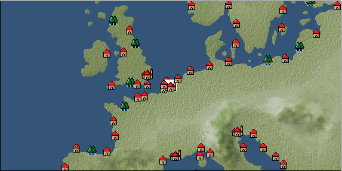

# Port: アムステルダム

import Tabs from '@theme/Tabs';
import TabItem from '@theme/TabItem';

## General Information

| Attribute | Details |
| :--- | :--- |
| **Port Name** | Amsterdam |
| **Port Type** | Headquarters |
| **Region** | northern europe |
| **Sea Area** | North Sea |
| **Required Language** | dutch |
| **Coordinates** | （97，2497） |
| **Investment Reward** | [Collection of North Sea specialty dishes](Items/Recipe Book/item_731.md) （必要投資額：1,000,000ドゥカード） |

### Available Facilities

| guild | intermediary | exchange | tool shop | workshop craftsman | Painter | sculptor | peddler |
| --- | --- | --- | --- | --- | --- | --- | --- |
| ○ | ○ | ○ | ○ | ○ |   |   | ○ |
| Shipyard Master | Lumbermaker | Sail-maker | weapon craftsman | master | TavernFemale | archive | salesperson |
| --- | --- | --- | --- | --- | --- | --- | --- |
| ○ | ○ | ○ | ○ | ○ | ○ | ○ | ○ |
| Shipwright | 銀行 | street worker | 王宮 | Trading post | church | suburbs | translator |
| --- | --- | --- | --- | --- | --- | --- | --- |
| ○ | ○ |   | ○ | ○ | ○ |   | ○ |

### Description
Among the seven provinces of the Northern Netherlands, this city is particularly prosperous for shipping. It was once under Spanish rule, but rebelled against the oppression and became independent. Various industries are developing, especially spinning and iron manufacturing. Tavern Woman: Johanna (Help Girl: Theresia) Beginner Navigator Training School Cultural Area: Netherlands

<Tabs>
  <TabItem value="trade_goods_sales" label="Trade Goods Sales">

| item | group | purchase price | 同盟時 | remarks |
| --- | --- | --- | --- | --- |
| [dutch calico](Items/Trade Goods/TradeGoods-Fabrics/item_1435.md) | [交易品（織物）](Categories/category_20.md) | 935 | 820 |  |
| When in alliance: confirmed at 100% |
| [chamomile](Items/Trade Goods/TradeGoods-Medicine/item_292.md) | [Trading products (medical products)](Categories/category_6.md) | 322 | 288 |  |
| [gin](Items/Trade Goods/TradeGoods-Alcohol/item_291.md) | [交易品（酒類）](Categories/category_9.md) | 588 | 516 |  |
| [dragonfly ball](Items/Trade Goods/TradeGoods-Luxuries/item_294.md) | [Trading goods (artificial goods)](Categories/category_13.md) | 1,100 | 984 |  |
| [ham](Items/Trade Goods/TradeGoods-Foodstuffs/item_290.md) | [Trading items (food items)](Categories/category_3.md) | 429 | 376 |  |
| [woolen fabric](Items/Trade Goods/TradeGoods-Fabrics/item_163.md) | [交易品（織物）](Categories/category_20.md) | 925 | 812 |  |
| [crystal](Items/Trade Goods/TradeGoods-Gems/item_893.md) | [Trading Items (Gemstones)](Categories/category_15.md) | (1,348) | 1,180 |  |
| Investment required (Required investment amount: 240,000) At alliance: Confirmed at 100% |
| [Western books](Items/Trade Goods/TradeGoods-Misc/item_293.md) | [交易品（雑貨）](Categories/category_5.md) | 652 | 572 |  |
| [iron material](Items/Trade Goods/TradeGoods-Wares/item_268.md) | [交易品（工業品）](Categories/category_19.md) | 802 | 704 |  |
| [linen fabric](Items/Trade Goods/TradeGoods-Fabrics/item_135.md) | [交易品（織物）](Categories/category_20.md) | 371 | 332 |  |
| When in alliance: confirmed at 100% |
  </TabItem>
  <TabItem value="sale_specialty" label="Sale (Specialty)">

| item | group | sale price | 同盟時 | remarks |
| --- | --- | --- | --- | --- |

#### [交易品（繊維）](Categories/category_1.md)

| [alpaca hair](Items/Trade Goods/TradeGoods-Fibers/item_3009.md) | 交易品（繊維） | (2,486) | 2,900 |  |
| When in alliance: confirmed at 100% |
| [Rush](Items/Trade Goods/TradeGoods-Fibers/item_3675.md) | 交易品（繊維） | (3,831) | 4,470 |  |
| When in alliance: confirmed at 100% |
| [sisal hemp](Items/Trade Goods/TradeGoods-Fibers/item_1766.md) | 交易品（繊維） | (341) | 397 |  |
| When in alliance: confirmed at 100% |
| [Basho](Items/Trade Goods/TradeGoods-Fibers/item_3862.md) | 交易品（繊維） | 28,000 | (31,503) |  |
| When in alliance: confirmed at 100% |
| [Panya](Items/Trade Goods/TradeGoods-Fibers/item_2097.md) | 交易品（繊維） | (732) | 854 |  |
| 98％＝845　102％＝863 |
| [tiger skin](Items/Trade Goods/TradeGoods-Fibers/item_3790.md) | 交易品（繊維） | (30,852) | 36,000 |  |
| 98％＝35300　103％＝37000 |
| [Green ramie](Items/Trade Goods/TradeGoods-Fibers/item_3428.md) | 交易品（繊維） | (32,224) | 37,600 |  |
| [deerskin](Items/Trade Goods/TradeGoods-Fibers/item_3648.md) | 交易品（繊維） | (30,852) | 36,000 |  |
| When in alliance: confirmed at 100% |

#### [Trading Goods (Dye)](Categories/category_2.md)

| [Indian Akane](Items/Trade Goods/TradeGoods-Dye/item_1037.md) | Trading Goods (Dye) | (1,132) | 1,320 |  |
| When in alliance: confirmed at 100% |
| [Indian indigo](Items/Trade Goods/TradeGoods-Dye/item_157.md) | Trading Goods (Dye) | 1,173 | 1,360 |  |
| When in alliance: confirmed at 100% |
| [ward](Items/Trade Goods/TradeGoods-Dye/item_57.md) | Trading Goods (Dye) | (1,175) | 1,370 |  |
| When in alliance: confirmed at 100% |
| [cochineal](Items/Trade Goods/TradeGoods-Dye/item_1817.md) | Trading Goods (Dye) | (1,655) | 1,930 |  |
| When in alliance: confirmed at 100% |
| [Shorou](Items/Trade Goods/TradeGoods-Dye/item_3691.md) | Trading Goods (Dye) | (44,050) | 51,400 |  |
| When in alliance: confirmed at 100% |
| [turmeric](Items/Trade Goods/TradeGoods-Dye/item_1433.md) | Trading Goods (Dye) | (696) | 811 |  |
| 98%＝799　102%＝822 |
| [natal indigo](Items/Trade Goods/TradeGoods-Dye/item_4102.md) | Trading Goods (Dye) | (3,272) | 3,817 |  |
| 98％＝3740 |
| [Safflower](Items/Trade Goods/TradeGoods-Dye/item_1059.md) | Trading Goods (Dye) | (729) | 850 |  |
| When in alliance: confirmed at 100% |
| [mayan blue](Items/Trade Goods/TradeGoods-Dye/item_1096.md) | Trading Goods (Dye) | (1,457) | 1,700 |  |
| 98%＝1670　103%＝1730 |
| [mangosteen](Items/Trade Goods/TradeGoods-Dye/item_1973.md) | Trading Goods (Dye) | (2,152) | 2,510 |  |
| When in alliance: confirmed at 100% |
| [mimosa](Items/Trade Goods/TradeGoods-Dye/item_2281.md) | Trading Goods (Dye) | (1,423) | 1,660 |  |
| 98％＝1630　102％＝1680 |
| [Locao](Items/Trade Goods/TradeGoods-Dye/item_3909.md) | Trading Goods (Dye) | (43,965) | 51,300 |  |
| When in alliance: confirmed at 100% |
| [log wood](Items/Trade Goods/TradeGoods-Dye/item_1813.md) | Trading Goods (Dye) | (1,303) | 1,520 |  |
| When in alliance: confirmed at 100% |
| [gallnut](Items/Trade Goods/TradeGoods-Dye/item_3429.md) | Trading Goods (Dye) | (45,079) | 52,600 |  |
| 98％＝51600　104％＝54700 |
| [purple root](Items/Trade Goods/TradeGoods-Dye/item_3752.md) | Trading Goods (Dye) | (30,852) | 36,000 |  |
| 98%＝35300　103％＝37100 |

#### [Trading items (food items)](Categories/category_3.md)

| [buckwheat](Items/Trade Goods/TradeGoods-Foodstuffs/item_3430.md) | Trading items (food items) | (32,738) | 38,200 |  |
| When in alliance: confirmed at 100% |
| [Karasumi](Items/Trade Goods/TradeGoods-Foodstuffs/item_3687.md) | Trading items (food items) | (31,624) | 36,900 |  |
| 98％＝36200　103％＝38000 |
| [kangaroo meat](Items/Trade Goods/TradeGoods-Foodstuffs/item_2285.md) | Trading items (food items) | (857) | 1,000 |  |
| When in alliance: confirmed at 100% |
| [cactus](Items/Trade Goods/TradeGoods-Foodstuffs/item_2740.md) | Trading items (food items) | (412) | 480 |  |
| When in alliance: confirmed at 100% |
| [taro](Items/Trade Goods/TradeGoods-Foodstuffs/item_1960.md) | Trading items (food items) | (241) | 281 |  |
| When in alliance: confirmed at 100% |
| [Chinese noodles](Items/Trade Goods/TradeGoods-Foodstuffs/item_3906.md) | Trading items (food items) | (31,881) | 37,200 |  |
| When in alliance: confirmed at 100% |
| [楊州栗](Items/Trade Goods/TradeGoods-Foodstuffs/item_3789.md) | Trading items (food items) | (9,342) | 10,900 |  |
| When in alliance: confirmed at 100% |

#### [交易品（調味料）](Categories/category_4.md)

| [oyster sauce](Items/Trade Goods/TradeGoods-Seasonings/item_3505.md) | 交易品（調味料） | (2,846) | 3,320 |  |
| When in alliance: confirmed at 100% |
| [Gochujang](Items/Trade Goods/TradeGoods-Seasonings/item_3591.md) | 交易品（調味料） | (6,668) | 7,780 |  |
| 98％＝7640　104％＝8050 |
| [tamarind](Items/Trade Goods/TradeGoods-Seasonings/item_1968.md) | 交易品（調味料） | (2,040) | 2,380 |  |
| 98％＝2310　104％＝2420 |
| [Choshi](Items/Trade Goods/TradeGoods-Seasonings/item_3793.md) | 交易品（調味料） | (30,767) | 35,900 |  |
| 98％＝35200　103％＝36900 |
| [Nampula](Items/Trade Goods/TradeGoods-Seasonings/item_1972.md) | 交易品（調味料） | (556) | 648 |  |
| 98%＝641　102%＝654　104%＝661 |
| [Nyoc mam](Items/Trade Goods/TradeGoods-Seasonings/item_1971.md) | 交易品（調味料） | (470) | 548 |  |
| When in alliance: confirmed at 100% |
| [maple syrup](Items/Trade Goods/TradeGoods-Seasonings/item_4028.md) | 交易品（調味料） | 3,198 | 3,230 |  |
| [apple cider vinegar](Items/Trade Goods/TradeGoods-Seasonings/item_882.md) | 交易品（調味料） | 467 | 472 |  |
| 98％＝459 |
| [miso](Items/Trade Goods/TradeGoods-Seasonings/item_3420.md) | 交易品（調味料） | (3,668) | 4,280 |  |
| When in alliance: confirmed at 100% |
| [Sha Cha Ji](Items/Trade Goods/TradeGoods-Seasonings/item_3689.md) | 交易品（調味料） | (31,281) | 36,500 |  |
| When in alliance: confirmed at 100% |
| [Bean sauce](Items/Trade Goods/TradeGoods-Seasonings/item_3875.md) | 交易品（調味料） | (34,109) | 39,800 |  |
| When in alliance: confirmed at 100% |
| [soy sauce](Items/Trade Goods/TradeGoods-Seasonings/item_3425.md) | 交易品（調味料） | 35,400 | 41,200 |  |
| 98％＝40400　104％＝42800 |
| [black vinegar](Items/Trade Goods/TradeGoods-Seasonings/item_3475.md) | 交易品（調味料） | (4,663) | 5,440 |  |
| 98％＝5350 104％＝5620 |

#### [交易品（雑貨）](Categories/category_5.md)

| [chinese books](Items/Trade Goods/TradeGoods-Misc/item_3927.md) | 交易品（雑貨） | (33,252) | 38,800 |  |
| 98％＝38000　102％＝39500 |
| [old ink stick](Items/Trade Goods/TradeGoods-Misc/item_3921.md) | 交易品（雑貨） | (9,513) | 11,100 |  |
| [Japanese books](Items/Trade Goods/TradeGoods-Misc/item_3439.md) | 交易品（雑貨） | 34,660 | 40,200 |  |
| When in alliance: confirmed at 100% |
| [lantern](Items/Trade Goods/TradeGoods-Misc/item_3683.md) | 交易品（雑貨） | (9,513) | 11,100 |  |
| When in alliance: confirmed at 100% |
| [Korean books](Items/Trade Goods/TradeGoods-Misc/item_3750.md) | 交易品（雑貨） | (31,110) | 36,300 |  |
| When in alliance: confirmed at 100% |
| [rattan work](Items/Trade Goods/TradeGoods-Misc/item_3698.md) | 交易品（雑貨） | (45,421) | 53,000 |  |
| 98％＝51900　102％＝54000 |

#### [Trading products (medical products)](Categories/category_6.md)

| [dog saffron](Items/Trade Goods/TradeGoods-Medicine/item_1055.md) | Trading products (medical products) | (622) | 725 |  |
| 98%＝714 104%＝748 |
| [Saikaku](Items/Trade Goods/TradeGoods-Medicine/item_1959.md) | Trading products (medical products) | (4,440) | 5,180 |  |
| When in alliance: confirmed at 100% |
| [tea tree](Items/Trade Goods/TradeGoods-Medicine/item_2283.md) | Trading products (medical products) | (1,397) | 1,630 |  |
| When in alliance: confirmed at 100% |
| [Noni](Items/Trade Goods/TradeGoods-Medicine/item_2099.md) | Trading products (medical products) | (1,235) | 1,440 |  |
| When in alliance: confirmed at 100% |
| [Borei](Items/Trade Goods/TradeGoods-Medicine/item_3678.md) | Trading products (medical products) | (31,881) | 37,200 |  |
| 98％＝36500　105％＝39000 |
| [Cordyceps sinensis](Items/Trade Goods/TradeGoods-Medicine/item_3839.md) | Trading products (medical products) | (43,536) | 50,800 |  |
| 98％＝49800　104％＝52800 |
| [Korean ginseng](Items/Trade Goods/TradeGoods-Medicine/item_3738.md) | Trading products (medical products) | (30,767) | 35,900 |  |
| 98％＝35200　106％＝37900 |
| [Nothing](Items/Trade Goods/TradeGoods-Medicine/item_1053.md) | Trading products (medical products) | (793) | 925 |  |
| When in alliance: confirmed at 100% |
| [calamus](Items/Trade Goods/TradeGoods-Medicine/item_3427.md) | Trading products (medical products) | (34,023) | 39,700 |  |
| When in alliance: confirmed at 100% |

#### [Trading Items (Iron Stone)](Categories/category_7.md)

| [Hokutolite](Items/Trade Goods/TradeGoods-Minerals/item_3694.md) | Trading Items (Iron Stone) | (32,632) | 38,077 |  |
| [white porcelain ore](Items/Trade Goods/TradeGoods-Minerals/item_3433.md) | Trading Items (Iron Stone) | (34,880) | 40,700 |  |
| When in alliance: confirmed at 100% |
| [red copper ore](Items/Trade Goods/TradeGoods-Minerals/item_3863.md) | Trading Items (Iron Stone) | (33,938) | 39,600 |  |
| 98％＝38800　102％＝40300 |
| [medical stone](Items/Trade Goods/TradeGoods-Minerals/item_3786.md) | Trading Items (Iron Stone) | 23,300 | (26,215) |  |
| revised price |

#### [Trading products (precious metals)](Categories/category_8.md)

| [platinum](Items/Trade Goods/TradeGoods-Metals/item_2178.md) | Trading products (precious metals) | (7,199) | 8,400 |  |
| When in alliance: confirmed at 100% |
| [佐摩銀](Items/Trade Goods/TradeGoods-Metals/item_3432.md) | Trading products (precious metals) | (36,766) | 42,900 |  |
| When in alliance: confirmed at 100% |
| [Korean silver](Items/Trade Goods/TradeGoods-Metals/item_3796.md) | Trading products (precious metals) | (31,367) | 36,600 |  |
| When in alliance: confirmed at 100% |
| [Jinguashijin](Items/Trade Goods/TradeGoods-Metals/item_3693.md) | Trading products (precious metals) | (31,024) | 36,200 |  |
| When in alliance: confirmed at 100% |
| [雲南銀](Items/Trade Goods/TradeGoods-Metals/item_3905.md) | Trading products (precious metals) | (34,709) | 40,500 |  |
| When in alliance: confirmed at 100% |

#### [交易品（酒類）](Categories/category_9.md)

| [sherry](Items/Trade Goods/TradeGoods-Alcohol/item_844.md) | 交易品（酒類） | 585 | 614 |  |
| When in alliance: confirmed at 100% |
| [tequila](Items/Trade Goods/TradeGoods-Alcohol/item_108.md) | 交易品（酒類） | (4,515) | 5,268 |  |
| 98%＝2370　104%＝2460 |
| [fruit brandy](Items/Trade Goods/TradeGoods-Alcohol/item_1440.md) | 交易品（酒類） | 681 | 686 |  |
| [Taiwan rice wine](Items/Trade Goods/TradeGoods-Alcohol/item_3672.md) | 交易品（酒類） | (31,110) | 36,300 |  |
| When in alliance: confirmed at 100% |
| [Andong soju](Items/Trade Goods/TradeGoods-Alcohol/item_3757.md) | 交易品（酒類） | 32,500 | 37,700 |  |
| When in alliance: confirmed at 100% |
| [Sake](Items/Trade Goods/TradeGoods-Alcohol/item_3424.md) | 交易品（酒類） | (34,709) | 40,500 |  |
| When in alliance: confirmed at 100% |
| [紹興酒](Items/Trade Goods/TradeGoods-Alcohol/item_3882.md) | 交易品（酒類） | (34,280) | 40,000 |  |
| When in alliance: confirmed at 100% |

#### [Trading goods (hobby goods)](Categories/category_10.md)

| [Aigyoku](Items/Trade Goods/TradeGoods-Sunddries/item_3677.md) | Trading goods (hobby goods) | (30,595) | 35,700 |  |
| When in alliance: confirmed at 100% |
| [almond](Items/Trade Goods/TradeGoods-Sunddries/item_367.md) | Trading goods (hobby goods) | (205) | 239 |  |
| [cacao](Items/Trade Goods/TradeGoods-Sunddries/item_140.md) | Trading goods (hobby goods) | (1,329) | 1,550 |  |
| 98%＝1520　105%＝1610 |
| [cashew nuts](Items/Trade Goods/TradeGoods-Sunddries/item_2120.md) | Trading goods (hobby goods) | (1,003) | 1,170 |  |
| When in alliance: confirmed at 100% |
| [caviar](Items/Trade Goods/TradeGoods-Sunddries/item_2122.md) | Trading goods (hobby goods) | (1,569) | 1,830 |  |
| 同盟時：100% |
| [cranberry](Items/Trade Goods/TradeGoods-Sunddries/item_4008.md) | Trading goods (hobby goods) | (1,113) | 1,298 |  |
| 94％＝1220　96％＝1240 |
| [tobacco](Items/Trade Goods/TradeGoods-Sunddries/item_109.md) | Trading goods (hobby goods) | (1,432) | 1,670 |  |
| When in alliance: confirmed at 100% |
| [durian](Items/Trade Goods/TradeGoods-Sunddries/item_1949.md) | Trading goods (hobby goods) | (1,680) | 1,960 |  |
| When in alliance: confirmed at 100% |
| [eggplant](Items/Trade Goods/TradeGoods-Sunddries/item_3426.md) | Trading goods (hobby goods) | 32,900 | 38,200 |  |
| When in alliance: confirmed at 100% |
| [banana](Items/Trade Goods/TradeGoods-Sunddries/item_1947.md) | Trading goods (hobby goods) | (486) | 567 |  |
| 98%＝559 101%＝571 |
| [pineapple](Items/Trade Goods/TradeGoods-Sunddries/item_867.md) | Trading goods (hobby goods) | (1,903) | 2,220 |  |
| When in alliance: confirmed at 100% |
| [pistachio](Items/Trade Goods/TradeGoods-Sunddries/item_2353.md) | Trading goods (hobby goods) | (844) | 984 |  |
| When in alliance: confirmed at 100% |
| [peanuts](Items/Trade Goods/TradeGoods-Sunddries/item_134.md) | Trading goods (hobby goods) | (402) | 468 |  |
| When in alliance: confirmed at 100% |
| [prune](Items/Trade Goods/TradeGoods-Sunddries/item_523.md) | Trading goods (hobby goods) | (441) | 514 |  |
| When in alliance: confirmed at 100% |
| [macadamia nuts](Items/Trade Goods/TradeGoods-Sunddries/item_2282.md) | Trading goods (hobby goods) | (1,080) | 1,260 |  |
| When in alliance: confirmed at 100% |
| [mango](Items/Trade Goods/TradeGoods-Sunddries/item_2095.md) | Trading goods (hobby goods) | (840) | 979 |  |
| When in alliance: confirmed at 100% |
| [lemon myrtle](Items/Trade Goods/TradeGoods-Sunddries/item_2840.md) | Trading goods (hobby goods) | (2,049) | 2,390 |  |
| When in alliance: confirmed at 100% |
| [Chinese tea](Items/Trade Goods/TradeGoods-Sunddries/item_3907.md) | Trading goods (hobby goods) | (33,681) | 39,300 |  |
| When in alliance: confirmed at 100% |
| [dried figs](Items/Trade Goods/TradeGoods-Sunddries/item_611.md) | Trading goods (hobby goods) | (417) | 486 |  |
| When in alliance: confirmed at 100% |
| [dried apple](Items/Trade Goods/TradeGoods-Sunddries/item_19.md) | Trading goods (hobby goods) | (345) | 402 |  |
| When in alliance: confirmed at 100% |
| [Korean tea](Items/Trade Goods/TradeGoods-Sunddries/item_3751.md) | Trading goods (hobby goods) | (30,938) | 36,100 |  |
| When in alliance: confirmed at 100% |
| [black tea](Items/Trade Goods/TradeGoods-Sunddries/item_675.md) | Trading goods (hobby goods) | 5,242 | 6,072 |  |
| [金針花](Items/Trade Goods/TradeGoods-Sunddries/item_3739.md) | Trading goods (hobby goods) | (9,513) | 11,100 |  |
| When in alliance: confirmed at 100% |

#### [Trading Goods (Spices)](Categories/category_11.md)

| [ylang ylang](Items/Trade Goods/TradeGoods-Perfume/item_1434.md) | Trading Goods (Spices) | (1,852) | 2,160 |  |
| 98%=2120　103%＝2210 |
| [orange oil](Items/Trade Goods/TradeGoods-Perfume/item_778.md) | Trading Goods (Spices) | (1,217) | 1,420 |  |
| 98%＝1390 102%＝1440 |
| [oakmoss](Items/Trade Goods/TradeGoods-Perfume/item_819.md) | Trading Goods (Spices) | (1,183) | 1,380 |  |
| 98%＝1360 |
| [Osmanthus](Items/Trade Goods/TradeGoods-Perfume/item_3925.md) | Trading Goods (Spices) | (35,137) | 41,000 |  |
| 98％＝40200　104％＝42600 |
| [gardenia](Items/Trade Goods/TradeGoods-Perfume/item_1091.md) | Trading Goods (Spices) | (44,222) | 51,600 |  |
| 98％＝50600　104％＝53600 |
| [jasmine](Items/Trade Goods/TradeGoods-Perfume/item_772.md) | Trading Goods (Spices) | (5,854) | 6,830 |  |
| 98%＝6690 |
| [daffodil](Items/Trade Goods/TradeGoods-Perfume/item_612.md) | Trading Goods (Spices) | (1,132) | 1,320 |  |
| When in alliance: confirmed at 100% |
| [geranium](Items/Trade Goods/TradeGoods-Perfume/item_145.md) | Trading Goods (Spices) | (1,140) | 1,330 |  |
| 102%＝1350 |
| [Chindarle](Items/Trade Goods/TradeGoods-Perfume/item_3795.md) | Trading Goods (Spices) | (30,852) | 36,000 |  |
| 98％＝35300　103％＝37000 |
| [Hamanasu](Items/Trade Goods/TradeGoods-Perfume/item_3692.md) | Trading Goods (Spices) | (30,938) | 36,100 |  |
| When in alliance: confirmed at 100% |
| [patchouli](Items/Trade Goods/TradeGoods-Perfume/item_1963.md) | Trading Goods (Spices) | (2,657) | 3,100 |  |
| 98％＝3070　103％＝3140 |
| [eucalyptus](Items/Trade Goods/TradeGoods-Perfume/item_2278.md) | Trading Goods (Spices) | (1,012) | 1,180 |  |
| When in alliance: confirmed at 100% |
| [lira](Items/Trade Goods/TradeGoods-Perfume/item_30.md) | Trading Goods (Spices) | (701) | 817 |  |
| 98％＝802　102％＝832 |
| [mastic](Items/Trade Goods/TradeGoods-Perfume/item_680.md) | Trading Goods (Spices) | (2,871) | 3,350 |  |
| When in alliance: confirmed at 100% |
| [Tang Muxiang](Items/Trade Goods/TradeGoods-Perfume/item_593.md) | Trading Goods (Spices) | (1,732) | 2,020 |  |
| When in alliance: confirmed at 100% |
| [benzoin](Items/Trade Goods/TradeGoods-Perfume/item_1962.md) | Trading Goods (Spices) | (1,809) | 2,110 |  |
| When in alliance: confirmed at 100% |
| [sandalwood](Items/Trade Goods/TradeGoods-Perfume/item_771.md) | Trading Goods (Spices) | 6,159 | 6,472 |  |
| [貝甲香](Items/Trade Goods/TradeGoods-Perfume/item_776.md) | Trading Goods (Spices) | (2,272) | 2,650 |  |
| When in alliance: confirmed at 100% |
| [龍脳](Items/Trade Goods/TradeGoods-Perfume/item_1676.md) | Trading Goods (Spices) | (2,803) | 3,270 |  |
| When in alliance: confirmed at 100% |

#### [Trading Goods (Spices)](Categories/category_12.md)

| [allspice](Items/Trade Goods/TradeGoods-Spices/item_1848.md) | Trading Goods (Spices) | (1,637) | 1,910 |  |
| When in alliance: confirmed at 100% |
| [cardamom](Items/Trade Goods/TradeGoods-Spices/item_1431.md) | Trading Goods (Spices) | (4,645) | 5,420 |  |
| When in alliance: confirmed at 100% |
| [garam masala](Items/Trade Goods/TradeGoods-Spices/item_965.md) | Trading Goods (Spices) | (724) | 844 |  |
| When in alliance: confirmed at 100% |
| [cloves](Items/Trade Goods/TradeGoods-Spices/item_1092.md) | Trading Goods (Spices) | 11,175 | 12,900 |  |
| When in alliance: confirmed at 100% |
| [Kouzuku](Items/Trade Goods/TradeGoods-Spices/item_3690.md) | Trading Goods (Spices) | (32,224) | 37,600 |  |
| When in alliance: confirmed at 100% |
| [pepper](Items/Trade Goods/TradeGoods-Spices/item_58.md) | Trading Goods (Spices) | 12,680 | 14,500 |  |
| 100% confirmed in alliance |
| [saffron](Items/Trade Goods/TradeGoods-Spices/item_845.md) | Trading Goods (Spices) | (2,837) | 3,310 |  |
| When in alliance: confirmed at 100% |
| [Sanshou](Items/Trade Goods/TradeGoods-Spices/item_3794.md) | Trading Goods (Spices) | (31,024) | 36,200 |  |
| 98％＝35500　104％＝37600 |
| [cinnamon](Items/Trade Goods/TradeGoods-Spices/item_1432.md) | Trading Goods (Spices) | (6,522) | 7,610 |  |
| When in alliance: confirmed at 100% |
| [star anise](Items/Trade Goods/TradeGoods-Spices/item_3908.md) | Trading Goods (Spices) | (32,224) | 37,600 |  |
| 98％＝36900　104％＝39100 |
| [bergamot](Items/Trade Goods/TradeGoods-Spices/item_879.md) | Trading Goods (Spices) | (688) | 802 |  |
| When in alliance: confirmed at 100% |
| [mace](Items/Trade Goods/TradeGoods-Spices/item_2100.md) | Trading Goods (Spices) | (11,998) | 14,000 |  |
| When in alliance: confirmed at 100% |
| [lemongrass](Items/Trade Goods/TradeGoods-Spices/item_2096.md) | Trading Goods (Spices) | (2,923) | 3,410 |  |
| 105％＝3580　104％＝3540　98％＝3350 99％＝3380 |
| [Laurier](Items/Trade Goods/TradeGoods-Spices/item_615.md) | Trading Goods (Spices) | (210) | 244 |  |
| When in alliance: confirmed at 100% |
| [chili pepper](Items/Trade Goods/TradeGoods-Spices/item_1831.md) | Trading Goods (Spices) | (1,509) | 1,760 |  |
| When in alliance: confirmed at 100% |
| [Grapefruit](Items/Trade Goods/TradeGoods-Spices/item_3422.md) | Trading Goods (Spices) | (34,623) | 40,400 |  |
| When in alliance: confirmed at 100% |
| [green chili pepper](Items/Trade Goods/TradeGoods-Spices/item_1990.md) | Trading Goods (Spices) | (6,315) | 7,368 |  |
| 98%＝7220 |

#### [Trading goods (artificial goods)](Categories/category_13.md)

| [glasswork](Items/Trade Goods/TradeGoods-Luxuries/item_60.md) | Trading goods (artificial goods) | 1,640 | 1,700 |  |
| [Tumbaga](Items/Trade Goods/TradeGoods-Luxuries/item_3028.md) | Trading goods (artificial goods) | (18,512) | 21,600 |  |
| 98%＝21300 |
| [Kuresute](Items/Trade Goods/TradeGoods-Luxuries/item_3897.md) | Trading goods (artificial goods) | (10,542) | 12,300 |  |
| When in alliance: confirmed at 100% |
| [Song Baici](Items/Trade Goods/TradeGoods-Luxuries/item_3904.md) | Trading goods (artificial goods) | (33,338) | 38,900 |  |
| 98％＝38200　105％＝40800 |
| [ethnic costume](Items/Trade Goods/TradeGoods-Luxuries/item_4050.md) | Trading goods (artificial goods) | (5,417) | 6,320 |  |
| 98％＝6220　102％＝6410 |
| [湖筆](Items/Trade Goods/TradeGoods-Luxuries/item_3898.md) | Trading goods (artificial goods) | (10,027) | 11,700 |  |
| When in alliance: confirmed at 100% |
| [lacquerware](Items/Trade Goods/TradeGoods-Luxuries/item_3435.md) | Trading goods (artificial goods) | (36,166) | 42,200 |  |
| 98％＝41400　103％＝43400 |
| [Saori](Items/Trade Goods/TradeGoods-Luxuries/item_3676.md) | Trading goods (artificial goods) | (37,366) | 43,600 |  |
| [Corner work](Items/Trade Goods/TradeGoods-Luxuries/item_3696.md) | Trading goods (artificial goods) | (29,995) | 35,000 |  |
| 98％＝34300　103％＝36000 |
| [Goryeo celadon](Items/Trade Goods/TradeGoods-Luxuries/item_3758.md) | Trading goods (artificial goods) | 23,048 | (25,931) |  |
| revised price |

#### [交易品（美術品）](Categories/category_14.md)

| [chinese calligraphy](Items/Trade Goods/TradeGoods-Art/item_3926.md) | 交易品（美術品） | (34,109) | 39,800 |  |
| 98％＝39000　103％＝40900 |
| [taiwan wood carving](Items/Trade Goods/TradeGoods-Art/item_3697.md) | 交易品（美術品） | (30,510) | 35,600 |  |
| 98％＝34900　104％＝36900 |
| [Japanese painting](Items/Trade Goods/TradeGoods-Art/item_3436.md) | 交易品（美術品） | (34,280) | 40,000 |  |
| When in alliance: confirmed at 100% |
| [oil painting](Items/Trade Goods/TradeGoods-Art/item_1088.md) | 交易品（美術品） | (2,143) | 2,500 |  |
| [Mianzhu New Year Pictures](Items/Trade Goods/TradeGoods-Art/item_4005.md) | 交易品（美術品） | (38,823) | 45,300 |  |
| [Mother-of-pearl lacquerware](Items/Trade Goods/TradeGoods-Art/item_3785.md) | 交易品（美術品） | 24,286 | (27,324) |  |
| revised price |

#### [Trading Items (Gemstones)](Categories/category_15.md)

| [jade](Items/Trade Goods/TradeGoods-Gems/item_2015.md) | Trading Items (Gemstones) | (5,014) | 5,850 |  |
| When in alliance: confirmed at 100% |
| [Tortoiseshell](Items/Trade Goods/TradeGoods-Gems/item_1980.md) | Trading Items (Gemstones) | (3,737) | 4,360 |  |
| When in alliance: confirmed at 100% |
| [aventurine](Items/Trade Goods/TradeGoods-Gems/item_678.md) | Trading Items (Gemstones) | (5,400) | 6,300 |  |
| [inca rose](Items/Trade Goods/TradeGoods-Gems/item_3014.md) | Trading Items (Gemstones) | (15,341) | 17,900 |  |
| 98%＝17600 |
| [opal](Items/Trade Goods/TradeGoods-Gems/item_2006.md) | Trading Items (Gemstones) | (6,899) | 8,050 |  |
| 98％＝7940　104％＝8280 |
| [cat's eye](Items/Trade Goods/TradeGoods-Gems/item_1047.md) | Trading Items (Gemstones) | (9,256) | 10,800 |  |
| [sapphire](Items/Trade Goods/TradeGoods-Gems/item_676.md) | Trading Items (Gemstones) | 13,800 | 14,700 |  |
| Alliance 100% confirmed |
| [turquoise](Items/Trade Goods/TradeGoods-Gems/item_1006.md) | Trading Items (Gemstones) | 4,162 | 4,350 |  |
| 98％＝4280　103％＝4450 |
| [diamond](Items/Trade Goods/TradeGoods-Gems/item_449.md) | Trading Items (Gemstones) | 8,350 | 9,160 |  |
| [topaz](Items/Trade Goods/TradeGoods-Gems/item_1097.md) | Trading Items (Gemstones) | (5,168) | 6,030 |  |
| When in alliance: confirmed at 100% |
| [pink diamond](Items/Trade Goods/TradeGoods-Gems/item_2874.md) | Trading Items (Gemstones) | (13,627) | 15,900 |  |
| When in alliance: confirmed at 100% |
| [lapis lazuli](Items/Trade Goods/TradeGoods-Gems/item_995.md) | Trading Items (Gemstones) | 6,210 | 6,730 |  |
| 98％＝6640　102％＝6820 |
| [ruby](Items/Trade Goods/TradeGoods-Gems/item_773.md) | Trading Items (Gemstones) | (12,937) | 15,095 |  |
| 同盟時：106％ |
| [taiwan sapphire](Items/Trade Goods/TradeGoods-Gems/item_3695.md) | Trading Items (Gemstones) | (29,653) | 34,600 |  |
| When in alliance: confirmed at 100% |
| [amethyst](Items/Trade Goods/TradeGoods-Gems/item_3434.md) | Trading Items (Gemstones) | 37,300 | 43,300 |  |
| 98％＝42500　103％＝44600 |
| [mutton fat white jade](Items/Trade Goods/TradeGoods-Gems/item_3903.md) | Trading Items (Gemstones) | (44,479) | 51,900 |  |
| 98％＝50900　105％＝54400 |
| [tiger eye stone](Items/Trade Goods/TradeGoods-Gems/item_3797.md) | Trading Items (Gemstones) | (30,767) | 35,900 |  |
| When in alliance: confirmed at 100% |

#### [Trading Items (Arms)](Categories/category_16.md)

| [crossbow](Items/Trade Goods/TradeGoods-Weapons/item_537.md) | Trading Items (Arms) | (1,175) | 1,370 |  |
| When in alliance: confirmed at 100% |
| [damascus sword](Items/Trade Goods/TradeGoods-Weapons/item_903.md) | Trading Items (Arms) | (6,077) | 7,090 |  |
| When in alliance: confirmed at 100% |
| [Japanese bow](Items/Trade Goods/TradeGoods-Weapons/item_3469.md) | Trading Items (Arms) | (11,227) | 13,100 |  |
| 98％＝12800　101％＝13200　104％＝13600 |
| [broadsword](Items/Trade Goods/TradeGoods-Weapons/item_3754.md) | Trading Items (Arms) | (43,536) | 50,800 |  |
| When in alliance: confirmed at 100% |
| [Japanese sword](Items/Trade Goods/TradeGoods-Weapons/item_3437.md) | Trading Items (Arms) | (33,338) | 38,900 |  |
| When in alliance: confirmed at 100% |
| [japanese armor](Items/Trade Goods/TradeGoods-Weapons/item_3590.md) | Trading Items (Arms) | (11,141) | 13,000 |  |
| When in alliance: confirmed at 100% |
| [rattan armor](Items/Trade Goods/TradeGoods-Weapons/item_3699.md) | Trading Items (Arms) | (29,995) | 35,000 |  |
| 98％＝34300　104％＝36300 |
| [Blue dragon sword](Items/Trade Goods/TradeGoods-Weapons/item_3923.md) | Trading Items (Arms) | (33,252) | 38,800 |  |
| When in alliance: confirmed at 100% |

#### [Trading Items (Firearms)](Categories/category_17.md)

| [musket gun](Items/Trade Goods/TradeGoods-Firearms/item_584.md) | Trading Items (Firearms) | (3,060) | 3,570 |  |
| When in alliance: confirmed at 100% |
| [monocular gun](Items/Trade Goods/TradeGoods-Firearms/item_3916.md) | Trading Items (Firearms) | (33,509) | 39,100 |  |
| When in alliance: confirmed at 100% |
| [throwing bomb](Items/Trade Goods/TradeGoods-Firearms/item_3784.md) | Trading Items (Firearms) | (31,110) | 36,300 |  |
| When in alliance: confirmed at 100% |
| [tanegashima gun](Items/Trade Goods/TradeGoods-Firearms/item_3423.md) | Trading Items (Firearms) | (32,052) | 37,400 |  |
| When in alliance: confirmed at 100% |
| [銅手銃](Items/Trade Goods/TradeGoods-Firearms/item_3700.md) | Trading Items (Firearms) | (30,338) | 35,400 |  |
| When in alliance: confirmed at 100% |

#### [Trading Goods (Livestock)](Categories/category_18.md)

| [boar](Items/Trade Goods/TradeGoods-Livestock/item_3476.md) | Trading Goods (Livestock) | (32,395) | 37,800 |  |
| When in alliance: confirmed at 100% |
| [water buffalo](Items/Trade Goods/TradeGoods-Livestock/item_3688.md) | Trading Goods (Livestock) | (1,500) | 1,750 |  |
| When in alliance: confirmed at 100% |
| [donkey](Items/Trade Goods/TradeGoods-Livestock/item_3924.md) | Trading Goods (Livestock) | (1,980) | 2,310 |  |
| When in alliance: confirmed at 100% |
| [韓牛](Items/Trade Goods/TradeGoods-Livestock/item_3792.md) | Trading Goods (Livestock) | (31,538) | 36,800 |  |
| When in alliance: confirmed at 100% |

#### [交易品（工業品）](Categories/category_19.md)

| [rubber](Items/Trade Goods/TradeGoods-Wares/item_2819.md) | 交易品（工業品） | (1,637) | 1,910 |  |
| 98%＝1890 102%=1930 |
| [papyrus](Items/Trade Goods/TradeGoods-Wares/item_616.md) | 交易品（工業品） | (550) | 641 |  |
| When in alliance: confirmed at 100% |
| [Japanese paper](Items/Trade Goods/TradeGoods-Wares/item_3438.md) | 交易品（工業品） | (24,853) | 29,000 |  |
| [marble](Items/Trade Goods/TradeGoods-Wares/item_52.md) | 交易品（工業品） | (1,697) | 1,980 |  |
| When in alliance: confirmed at 100% |
| [paint](Items/Trade Goods/TradeGoods-Wares/item_3411.md) | 交易品（工業品） | (2,683) | 3,130 |  |
| When in alliance: confirmed at 100% |
| [bamboo](Items/Trade Goods/TradeGoods-Wares/item_3899.md) | 交易品（工業品） | (33,681) | 39,300 |  |
| When in alliance: confirmed at 100% |
| [rattan](Items/Trade Goods/TradeGoods-Wares/item_3701.md) | 交易品（工業品） | (43,279) | 50,500 |  |
| When in alliance: confirmed at 100% |
| [羊皮紙](Items/Trade Goods/TradeGoods-Wares/item_53.md) | 交易品（工業品） | 1,600 | 1,670 |  |
| When in alliance: confirmed at 100% |
| [韓紙](Items/Trade Goods/TradeGoods-Wares/item_3755.md) | 交易品（工業品） | (43,707) | 51,000 |  |
| When in alliance: confirmed at 100% |

#### [交易品（織物）](Categories/category_20.md)

| [Awaiyo](Items/Trade Goods/TradeGoods-Fabrics/item_3002.md) | 交易品（織物） | (8,913) | 10,400 |  |
| When in alliance: confirmed at 100% |
| [indian chintz](Items/Trade Goods/TradeGoods-Fabrics/item_159.md) | 交易品（織物） | 4,269 | 4,324 |  |
| 同盟時 102% 4410 |
| [gobelin weave](Items/Trade Goods/TradeGoods-Fabrics/item_1276.md) | 交易品（織物） | (3,317) | 3,870 |  |
| When in alliance: confirmed at 100% |
| [java chintz](Items/Trade Goods/TradeGoods-Fabrics/item_1970.md) | 交易品（織物） | (3,857) | 4,500 |  |
| 98%＝4420　102%＝4570 |
| [taffeta](Items/Trade Goods/TradeGoods-Fabrics/item_1001.md) | 交易品（織物） | (5,811) | 6,780 |  |
| When in alliance: confirmed at 100% |
| [damask](Items/Trade Goods/TradeGoods-Fabrics/item_614.md) | 交易品（織物） | (5,087) | 5,935 |  |
| [turkish rug](Items/Trade Goods/TradeGoods-Fabrics/item_686.md) | 交易品（織物） | (6,565) | 7,660 |  |
| 98%＝7540　107％＝8070 |
| [velvet](Items/Trade Goods/TradeGoods-Fabrics/item_902.md) | 交易品（織物） | 4,300 | 4,800 |  |
| [persian rug](Items/Trade Goods/TradeGoods-Fabrics/item_606.md) | 交易品（織物） | 13,625 | 13,371 |  |
| 89%＝11900 |
| [China Duantong](Items/Trade Goods/TradeGoods-Fabrics/item_3478.md) | 交易品（織物） | (18,512) | 21,600 |  |
| When in alliance: confirmed at 100% |
| [唐錦](Items/Trade Goods/TradeGoods-Fabrics/item_3896.md) | 交易品（織物） | 26,924 | (30,292) |  |
| revised price |
| [大和錦](Items/Trade Goods/TradeGoods-Fabrics/item_3482.md) | 交易品（織物） | (18,512) | 21,600 |  |
| 98％＝21300　102％＝21900 |
| [明紬](Items/Trade Goods/TradeGoods-Fabrics/item_3753.md) | 交易品（織物） | (31,538) | 36,800 |  |
| When in alliance: confirmed at 100% |
| [Bingata](Items/Trade Goods/TradeGoods-Fabrics/item_3479.md) | 交易品（織物） | (18,426) | 21,500 |  |
| 98％＝21200　103％＝22000 |
| [Nishijin textile](Items/Trade Goods/TradeGoods-Fabrics/item_3431.md) | 交易品（織物） | (45,764) | 53,400 |  |
| When in alliance: confirmed at 100% |
| [麻織物](Items/Trade Goods/TradeGoods-Fabrics/item_3673.md) | 交易品（織物） | (32,824) | 38,300 |  |
| When in alliance: confirmed at 100% |
  </TabItem>
  <TabItem value="sale_no_specialty" label="Sale (No Specialty)">

| item | group | sale price | 同盟時 | remarks |
| --- | --- | --- | --- | --- |

#### [交易品（繊維）](Categories/category_1.md)

| [rabbit hair](Items/Trade Goods/TradeGoods-Fibers/item_1036.md) | 交易品（繊維） | (745) | 869 |  |
| When in alliance: confirmed at 100% |
| [peacock feather](Items/Trade Goods/TradeGoods-Fibers/item_901.md) | 交易品（繊維） | (446) | 520 |  |
| 92％＝479　101％＝526 |
| [Manila hemp](Items/Trade Goods/TradeGoods-Fibers/item_2098.md) | 交易品（繊維） | (196) | 228 |  |
| 98％＝223　104％＝237 |
| [coconut fiber](Items/Trade Goods/TradeGoods-Fibers/item_444.md) | 交易品（繊維） | (182) | 212 |  |
| When in alliance: confirmed at 100% |
| [camel hair](Items/Trade Goods/TradeGoods-Fibers/item_577.md) | 交易品（繊維） | (449) | 523 |  |
| [ramy](Items/Trade Goods/TradeGoods-Fibers/item_1961.md) | 交易品（繊維） | (266) | 310 |  |
| When in alliance: confirmed at 100% |
| [flax](Items/Trade Goods/TradeGoods-Fibers/item_64.md) | 交易品（繊維） | 280 | 301 |  |
| [goat hair](Items/Trade Goods/TradeGoods-Fibers/item_770.md) | 交易品（繊維） | (1,406) | 1,640 |  |
| 98%＝1640 |
| [fur](Items/Trade Goods/TradeGoods-Fibers/item_634.md) | 交易品（繊維） | 1,363 | (1,533) |  |
| [raw silk](Items/Trade Goods/TradeGoods-Fibers/item_677.md) | 交易品（繊維） | (2,272) | 2,650 |  |
| 98%＝2600 |
| [leather](Items/Trade Goods/TradeGoods-Fibers/item_44.md) | 交易品（繊維） | (702) | 818 |  |
| 98％＝801 101％＝826 |
| [cotton](Items/Trade Goods/TradeGoods-Fibers/item_610.md) | 交易品（繊維） | (731) | 852 |  |
| When in alliance: confirmed at 100% |
| [wool](Items/Trade Goods/TradeGoods-Fibers/item_5.md) | 交易品（繊維） | 454 | 454 |  |
| [feather](Items/Trade Goods/TradeGoods-Fibers/item_585.md) | 交易品（繊維） | 625 | 678 |  |
| [numb](Items/Trade Goods/TradeGoods-Fibers/item_900.md) | 交易品（繊維） | 12 | (13) |  |
| [jute](Items/Trade Goods/TradeGoods-Fibers/item_128.md) | 交易品（繊維） | (176) | 205 |  |
| When in alliance: confirmed at 100% |

#### [Trading Goods (Dye)](Categories/category_2.md)

| [Gerep](Items/Trade Goods/TradeGoods-Dye/item_1814.md) | Trading Goods (Dye) | (797) | 929 |  |
| When in alliance: confirmed at 100% |
| [pomegranate](Items/Trade Goods/TradeGoods-Dye/item_907.md) | Trading Goods (Dye) | (461) | 537 |  |
| When in alliance: confirmed at 100% |
| [persian berry](Items/Trade Goods/TradeGoods-Dye/item_693.md) | Trading Goods (Dye) | (1,226) | 1,430 |  |
| When in alliance: confirmed at 100% |
| [貝紫](Items/Trade Goods/TradeGoods-Dye/item_110.md) | Trading Goods (Dye) | (4,688) | 5,470 |  |
| When in alliance: confirmed at 100% |

#### [Trading items (food items)](Categories/category_3.md)

| [fava beans](Items/Trade Goods/TradeGoods-Foodstuffs/item_102.md) | Trading items (food items) | 127 | (142) |  |
| [duck meat](Items/Trade Goods/TradeGoods-Foodstuffs/item_32.md) | Trading items (food items) | 418 | 469 |  |
| [sardine](Items/Trade Goods/TradeGoods-Foodstuffs/item_39.md) | Trading items (food items) | (14) | 16 |  |
| [halibut](Items/Trade Goods/TradeGoods-Foodstuffs/item_1040.md) | Trading items (food items) | 688 | (774) |  |
| [olive](Items/Trade Goods/TradeGoods-Foodstuffs/item_47.md) | Trading items (food items) | (327) | 381 |  |
| When in alliance: confirmed at 100% |
| [turnip](Items/Trade Goods/TradeGoods-Foodstuffs/item_55.md) | Trading items (food items) | (87) | 101 |  |
| When in alliance: confirmed at 100% |
| [pumpkin](Items/Trade Goods/TradeGoods-Foodstuffs/item_137.md) | Trading items (food items) | (240) | 280 |  |
| When in alliance: confirmed at 100% |
| [Oat](Items/Trade Goods/TradeGoods-Foodstuffs/item_275.md) | Trading items (food items) | (74) | 86 |  |
| When in alliance: confirmed at 100% |
| [Flatfish](Items/Trade Goods/TradeGoods-Foodstuffs/item_255.md) | Trading items (food items) | (28) | 32 |  |
| [Quinoa](Items/Trade Goods/TradeGoods-Foodstuffs/item_2994.md) | Trading items (food items) | (335) | 390 |  |
| When in alliance: confirmed at 100% |
| [Cassava](Items/Trade Goods/TradeGoods-Foodstuffs/item_1805.md) | Trading items (food items) | (135) | 157 |  |
| When in alliance: confirmed at 100% |
| [sweet potato](Items/Trade Goods/TradeGoods-Foodstuffs/item_1931.md) | Trading items (food items) | (209) | 243 |  |
| When in alliance: confirmed at 100% |
| [sugar cane](Items/Trade Goods/TradeGoods-Foodstuffs/item_93.md) | Trading items (food items) | (330) | 384 |  |
| [sole](Items/Trade Goods/TradeGoods-Foodstuffs/item_45.md) | Trading items (food items) | 98 | 112 |  |
| [potato](Items/Trade Goods/TradeGoods-Foodstuffs/item_106.md) | Trading items (food items) | (354) | 412 |  |
| [Jambu](Items/Trade Goods/TradeGoods-Foodstuffs/item_1827.md) | Trading items (food items) | (194) | 226 |  |
| 98%＝221 |
| [sausage](Items/Trade Goods/TradeGoods-Foodstuffs/item_27.md) | Trading items (food items) | 373 | 389 |  |
| When in alliance: confirmed at 100% |
| [onion](Items/Trade Goods/TradeGoods-Foodstuffs/item_28.md) | Trading items (food items) | (120) | 140 |  |
| [sturgeon](Items/Trade Goods/TradeGoods-Foodstuffs/item_1667.md) | Trading items (food items) | 860 | (967) |  |
| [cheese](Items/Trade Goods/TradeGoods-Foodstuffs/item_20.md) | Trading items (food items) | 409 | 420 |  |
| 104％＝436　101％＝424　98％＝411 |
| [Sugar beet](Items/Trade Goods/TradeGoods-Foodstuffs/item_1846.md) | Trading items (food items) | (204) | 237 |  |
| When in alliance: confirmed at 100% |
| [corn](Items/Trade Goods/TradeGoods-Foodstuffs/item_138.md) | Trading items (food items) | (193) | 225 |  |
| [tomato](Items/Trade Goods/TradeGoods-Foodstuffs/item_1809.md) | Trading items (food items) | (249) | 290 |  |
| When in alliance: confirmed at 100% |
| [carrot](Items/Trade Goods/TradeGoods-Foodstuffs/item_2708.md) | Trading items (food items) | (90) | 104 |  |
| When in alliance: confirmed at 100% |
| [ham](Items/Trade Goods/TradeGoods-Foodstuffs/item_290.md) | Trading items (food items) | (162) | 188 |  |
| [bacon](Items/Trade Goods/TradeGoods-Foodstuffs/item_566.md) | Trading items (food items) | (348) | 405 |  |
| When in alliance: confirmed at 100% |
| [european crayfish](Items/Trade Goods/TradeGoods-Foodstuffs/item_6188.md) | Trading items (food items) | (3,977) | 4,640 |  |
| [rye](Items/Trade Goods/TradeGoods-Foodstuffs/item_61.md) | Trading items (food items) | 67 | 73 |  |
| [crocodile meat](Items/Trade Goods/TradeGoods-Foodstuffs/item_2284.md) | Trading items (food items) | (656) | 765 |  |
| 98％＝750　105％＝804 |
| [milk](Items/Trade Goods/TradeGoods-Foodstuffs/item_254.md) | Trading items (food items) | 148 | 148 |  |
| [egg](Items/Trade Goods/TradeGoods-Foodstuffs/item_40.md) | Trading items (food items) | 34 | 36 |  |
| When in alliance: confirmed at 100% |
| [barley](Items/Trade Goods/TradeGoods-Foodstuffs/item_124.md) | Trading items (food items) | (95) | 110 |  |
| When in alliance: confirmed at 100% |
| [Red bean](Items/Trade Goods/TradeGoods-Foodstuffs/item_3419.md) | Trading items (food items) | (264) | 308 |  |
| When in alliance: confirmed at 100% |
| [wheat](Items/Trade Goods/TradeGoods-Foodstuffs/item_16.md) | Trading items (food items) | 70 | 77 |  |
| When in alliance: confirmed at 100% |
| [Paddy rice](Items/Trade Goods/TradeGoods-Foodstuffs/item_654.md) | Trading items (food items) | (102) | 119 |  |
| When in alliance: confirmed at 100% |
| [beef](Items/Trade Goods/TradeGoods-Foodstuffs/item_26.md) | Trading items (food items) | 630 | 676 |  |
| [mutton](Items/Trade Goods/TradeGoods-Foodstuffs/item_33.md) | Trading items (food items) | 441 | 487 |  |
| When in alliance: confirmed at 100% |
| [pork](Items/Trade Goods/TradeGoods-Foodstuffs/item_41.md) | Trading items (food items) | (372) | 434 |  |
| When in alliance: confirmed at 100% |
| [red bean](Items/Trade Goods/TradeGoods-Foodstuffs/item_123.md) | Trading items (food items) | (171) | 199 |  |
| When in alliance: confirmed at 100% |
| [taro](Items/Trade Goods/TradeGoods-Foodstuffs/item_3421.md) | Trading items (food items) | (292) | 340 |  |
| When in alliance: confirmed at 100% |
| [餡](Items/Trade Goods/TradeGoods-Foodstuffs/item_3474.md) | Trading items (food items) | (1,286) | 1,500 |  |
| When in alliance: confirmed at 100% |
| [魚肉](Items/Trade Goods/TradeGoods-Foodstuffs/item_10.md) | Trading items (food items) | 188 | 218 |  |
| When in alliance: confirmed at 100% |
| [chicken meat](Items/Trade Goods/TradeGoods-Foodstuffs/item_29.md) | Trading items (food items) | 442 | 484 |  |
| When in alliance: confirmed at 100% |

#### [交易品（調味料）](Categories/category_4.md)

| [anchovies](Items/Trade Goods/TradeGoods-Seasonings/item_3004.md) | 交易品（調味料） | (245) | 285 |  |
| When in alliance: confirmed at 100% |
| [almond oil](Items/Trade Goods/TradeGoods-Seasonings/item_578.md) | 交易品（調味料） | (684) | 797 |  |
| When in alliance: confirmed at 100% |
| [olive oil](Items/Trade Goods/TradeGoods-Seasonings/item_48.md) | 交易品（調味料） | (355) | 414 |  |
| When in alliance: confirmed at 100% |
| [coconut vinegar](Items/Trade Goods/TradeGoods-Seasonings/item_1988.md) | 交易品（調味料） | (462) | 538 |  |
| When in alliance: confirmed at 100% |
| [jam](Items/Trade Goods/TradeGoods-Seasonings/item_427.md) | 交易品（調味料） | (606) | 707 |  |
| 98%＝692　102%＝721 |
| [herbal oil](Items/Trade Goods/TradeGoods-Seasonings/item_880.md) | 交易品（調味料） | (237) | 276 |  |
| When in alliance: confirmed at 100% |
| [herbal salt](Items/Trade Goods/TradeGoods-Seasonings/item_840.md) | 交易品（調味料） | (223) | 260 |  |
| When in alliance: confirmed at 100% |
| [herbal vinegar](Items/Trade Goods/TradeGoods-Seasonings/item_908.md) | 交易品（調味料） | (155) | 180 |  |
| When in alliance: confirmed at 100% |
| [butter](Items/Trade Goods/TradeGoods-Seasonings/item_3.md) | 交易品（調味料） | 359 | (403) |  |
| [bouquet garni](Items/Trade Goods/TradeGoods-Seasonings/item_881.md) | 交易品（調味料） | (244) | 284 |  |
| When in alliance: confirmed at 100% |
| [white vinegar](Items/Trade Goods/TradeGoods-Seasonings/item_56.md) | 交易品（調味料） | (198) | 230 |  |
| [coconut oil](Items/Trade Goods/TradeGoods-Seasonings/item_446.md) | 交易品（調味料） | (289) | 337 |  |
| When in alliance: confirmed at 100% |
| [lard](Items/Trade Goods/TradeGoods-Seasonings/item_43.md) | 交易品（調味料） | (294) | 342 |  |
| When in alliance: confirmed at 100% |
| [wine vinegar](Items/Trade Goods/TradeGoods-Seasonings/item_429.md) | 交易品（調味料） | (537) | 626 |  |
| When in alliance: confirmed at 100% |
| [salt](Items/Trade Goods/TradeGoods-Seasonings/item_42.md) | 交易品（調味料） | 288 | 293 |  |
| When in alliance: confirmed at 100% |
| [sugar](Items/Trade Goods/TradeGoods-Seasonings/item_94.md) | 交易品（調味料） | (849) | 990 |  |
| 98%＝970　101%＝999　104%＝1030 |
| [Honey](Items/Trade Goods/TradeGoods-Seasonings/item_49.md) | 交易品（調味料） | (917) | 1,070 |  |
| 98％＝1050 103％＝1110 |

#### [交易品（雑貨）](Categories/category_5.md)

| [rare book](Items/Trade Goods/TradeGoods-Misc/item_2127.md) | 交易品（雑貨） | (686) | 800 |  |

#### [Trading products (medical products)](Categories/category_6.md)

| [anise](Items/Trade Goods/TradeGoods-Medicine/item_1050.md) | Trading products (medical products) | (303) | 353 |  |
| When in alliance: confirmed at 100% |
| [nettle](Items/Trade Goods/TradeGoods-Medicine/item_6189.md) | Trading products (medical products) | (533) | 621 |  |
| [Elder](Items/Trade Goods/TradeGoods-Medicine/item_34.md) | Trading products (medical products) | (235) | 274 |  |
| 98％＝268　102％＝279 |
| [cinchona bark](Items/Trade Goods/TradeGoods-Medicine/item_2121.md) | Trading products (medical products) | (969) | 1,130 |  |
| When in alliance: confirmed at 100% |
| [Kyonin](Items/Trade Goods/TradeGoods-Medicine/item_964.md) | Trading products (medical products) | (507) | 591 |  |
| 98％＝579 104％＝614 |
| [peonies](Items/Trade Goods/TradeGoods-Medicine/item_1051.md) | Trading products (medical products) | (444) | 518 |  |
| When in alliance: confirmed at 100% |
| [senna](Items/Trade Goods/TradeGoods-Medicine/item_155.md) | Trading products (medical products) | 457 | 476 |  |
| 98%＝466　103%＝490 |
| [dandelion](Items/Trade Goods/TradeGoods-Medicine/item_1089.md) | Trading products (medical products) | (277) | 323 |  |
| When in alliance: confirmed at 100% |
| [Wormwood](Items/Trade Goods/TradeGoods-Medicine/item_62.md) | Trading products (medical products) | (401) | 467 |  |
| When in alliance: confirmed at 100% |
| [heath](Items/Trade Goods/TradeGoods-Medicine/item_63.md) | Trading products (medical products) | (209) | 243 |  |
| 98％＝238　102％＝247 |
| [belladonna](Items/Trade Goods/TradeGoods-Medicine/item_1056.md) | Trading products (medical products) | (487) | 568 |  |
| When in alliance: confirmed at 100% |
| [Maca](Items/Trade Goods/TradeGoods-Medicine/item_3000.md) | Trading products (medical products) | (1,877) | 2,190 |  |
| 95％＝2080　101％＝2210 |
| [Mandragora](Items/Trade Goods/TradeGoods-Medicine/item_1054.md) | Trading products (medical products) | (917) | 1,070 |  |
| When in alliance: confirmed at 100% |
| [lemon balm](Items/Trade Goods/TradeGoods-Medicine/item_127.md) | Trading products (medical products) | (373) | 435 |  |
| 98%＝426　102%＝443 |
| [rose hips](Items/Trade Goods/TradeGoods-Medicine/item_904.md) | Trading products (medical products) | (418) | 487 |  |

#### [Trading Items (Iron Stone)](Categories/category_7.md)

| [tin ore](Items/Trade Goods/TradeGoods-Minerals/item_23.md) | Trading Items (Iron Stone) | 560 | 560 |  |
| [Saltpeter](Items/Trade Goods/TradeGoods-Minerals/item_884.md) | Trading Items (Iron Stone) | (1,763) | 2,057 |  |
| 106％＝2180 |
| [cinnabar](Items/Trade Goods/TradeGoods-Minerals/item_154.md) | Trading Items (Iron Stone) | (811) | 946 |  |
| 98%＝927 104%＝983 |
| [iron ore](Items/Trade Goods/TradeGoods-Minerals/item_146.md) | Trading Items (Iron Stone) | 892 | 892 |  |
| [lead ore](Items/Trade Goods/TradeGoods-Minerals/item_21.md) | Trading Items (Iron Stone) | 490 | 510 |  |
| [copper ore](Items/Trade Goods/TradeGoods-Minerals/item_65.md) | Trading Items (Iron Stone) | 866 | 900 |  |

#### [Trading products (precious metals)](Categories/category_8.md)

| [gold dust](Items/Trade Goods/TradeGoods-Metals/item_111.md) | Trading products (precious metals) | (3,917) | 4,570 |  |
| When in alliance: confirmed at 100% |
| [gold](Items/Trade Goods/TradeGoods-Metals/item_659.md) | Trading products (precious metals) | (7,756) | 9,050 |  |
| [silver](Items/Trade Goods/TradeGoods-Metals/item_136.md) | Trading products (precious metals) | (2,709) | 3,160 |  |
| When in alliance: confirmed at 100% |

#### [交易品（酒類）](Categories/category_9.md)

| [aquavit](Items/Trade Goods/TradeGoods-Alcohol/item_572.md) | 交易品（酒類） | 614 | 625 |  |
| [whiskey](Items/Trade Goods/TradeGoods-Alcohol/item_1.md) | 交易品（酒類） | 727 | 729 |  |
| When in alliance: confirmed at 100% |
| [gin](Items/Trade Goods/TradeGoods-Alcohol/item_291.md) | 交易品（酒類） | (222) | 258 |  |
| [Beer](Items/Trade Goods/TradeGoods-Alcohol/item_2.md) | 交易品（酒類） | 290 | 303 |  |
| When in alliance: confirmed at 100% |
| [brandy](Items/Trade Goods/TradeGoods-Alcohol/item_9.md) | 交易品（酒類） | 886 | 896 |  |
| [palm wine](Items/Trade Goods/TradeGoods-Alcohol/item_436.md) | 交易品（酒類） | (420) | 489 |  |
| When in alliance: confirmed at 100% |
| [rum](Items/Trade Goods/TradeGoods-Alcohol/item_139.md) | 交易品（酒類） | 717 | 749 |  |
| When in alliance: confirmed at 100% |
| [liqueur](Items/Trade Goods/TradeGoods-Alcohol/item_18.md) | 交易品（酒類） | (583) | 680 |  |
| [wine](Items/Trade Goods/TradeGoods-Alcohol/item_11.md) | 交易品（酒類） | 541 | 560 |  |
| When in alliance: confirmed at 100% |
| [Shochu](Items/Trade Goods/TradeGoods-Alcohol/item_3449.md) | 交易品（酒類） | (6,848) | 7,990 |  |
| When in alliance: confirmed at 100% |

#### [Trading goods (hobby goods)](Categories/category_10.md)

| [walnut](Items/Trade Goods/TradeGoods-Sunddries/item_522.md) | Trading goods (hobby goods) | (612) | 713 |  |
| 98%＝698　105%＝748 |
| [coconut](Items/Trade Goods/TradeGoods-Sunddries/item_96.md) | Trading goods (hobby goods) | (362) | 422 |  |
| When in alliance: confirmed at 100% |
| [coffee](Items/Trade Goods/TradeGoods-Sunddries/item_445.md) | Trading goods (hobby goods) | (872) | 1,017 |  |
| When in alliance: confirmed at 100% |
| [papaya](Items/Trade Goods/TradeGoods-Sunddries/item_1948.md) | Trading goods (hobby goods) | (469) | 547 |  |
| 98％＝536 |
| [pickles](Items/Trade Goods/TradeGoods-Sunddries/item_535.md) | Trading goods (hobby goods) | (285) | 332 |  |
| [hazelnut](Items/Trade Goods/TradeGoods-Sunddries/item_125.md) | Trading goods (hobby goods) | (432) | 504 |  |
| When in alliance: confirmed at 100% |
| [Yerba mate tea](Items/Trade Goods/TradeGoods-Sunddries/item_1808.md) | Trading goods (hobby goods) | (414) | 483 |  |
| When in alliance: confirmed at 100% |
| [dried apricots](Items/Trade Goods/TradeGoods-Sunddries/item_8.md) | Trading goods (hobby goods) | (395) | 460 |  |
| 98%＝450　104%＝478 |
| [dried strawberries](Items/Trade Goods/TradeGoods-Sunddries/item_36.md) | Trading goods (hobby goods) | (337) | 393 |  |
| 98%＝385　104%＝408 |
| [raisins](Items/Trade Goods/TradeGoods-Sunddries/item_35.md) | Trading goods (hobby goods) | (264) | 308 |  |
| When in alliance: confirmed at 100% |
| [dried mango](Items/Trade Goods/TradeGoods-Sunddries/item_883.md) | Trading goods (hobby goods) | (495) | 577 |  |
| 98％＝565　103％＝594 |

#### [Trading Goods (Spices)](Categories/category_11.md)

| [cedar wood](Items/Trade Goods/TradeGoods-Perfume/item_905.md) | Trading Goods (Spices) | (452) | 527 |  |
| When in alliance: confirmed at 100% |
| [civet](Items/Trade Goods/TradeGoods-Perfume/item_808.md) | Trading Goods (Spices) | (3,257) | 3,800 |  |
| 98%＝3720 107%＝4060 |
| [lily of the valley](Items/Trade Goods/TradeGoods-Perfume/item_358.md) | Trading Goods (Spices) | 833 | 863 |  |
| [lavender](Items/Trade Goods/TradeGoods-Perfume/item_150.md) | Trading Goods (Spices) | (926) | 1,080 |  |
| When in alliance: confirmed at 100% |
| [lemon oil](Items/Trade Goods/TradeGoods-Perfume/item_151.md) | Trading Goods (Spices) | (527) | 614 |  |
| 98%＝601　102%＝626 |
| [rose](Items/Trade Goods/TradeGoods-Perfume/item_536.md) | Trading Goods (Spices) | (2,400) | 2,800 |  |
| 98%＝2740 107%＝3000 |
| [agarwood](Items/Trade Goods/TradeGoods-Perfume/item_1058.md) | Trading Goods (Spices) | (2,160) | 2,520 |  |
| When in alliance: confirmed at 100% |
| [Ryushu incense](Items/Trade Goods/TradeGoods-Perfume/item_101.md) | Trading Goods (Spices) | (3,617) | 4,220 |  |
| 98%＝4140　107%＝4520 |
| [Musk](Items/Trade Goods/TradeGoods-Perfume/item_158.md) | Trading Goods (Spices) | 4,968 | 5,100 |  |
| 98%＝5000　104％＝5310 |

#### [Trading Goods (Spices)](Categories/category_12.md)

| [oregano](Items/Trade Goods/TradeGoods-Spices/item_430.md) | Trading Goods (Spices) | (464) | 541 |  |
| When in alliance: confirmed at 100% |
| [garlic](Items/Trade Goods/TradeGoods-Spices/item_526.md) | Trading Goods (Spices) | (297) | 346 |  |
| When in alliance: confirmed at 100% |
| [cumin](Items/Trade Goods/TradeGoods-Spices/item_156.md) | Trading Goods (Spices) | 1,432 | 1,500 |  |
| When in alliance: confirmed at 100% |
| [coriander](Items/Trade Goods/TradeGoods-Spices/item_1044.md) | Trading Goods (Spices) | (444) | 517 |  |
| When in alliance: confirmed at 100% |
| [Sesame](Items/Trade Goods/TradeGoods-Spices/item_437.md) | Trading Goods (Spices) | (331) | 386 |  |
| [ginger](Items/Trade Goods/TradeGoods-Spices/item_112.md) | Trading Goods (Spices) | 1,888 | 2,100 |  |
| When in alliance: confirmed at 100% |
| [celery](Items/Trade Goods/TradeGoods-Spices/item_431.md) | Trading Goods (Spices) | (144) | 168 |  |
| When in alliance: confirmed at 100% |
| [time](Items/Trade Goods/TradeGoods-Spices/item_432.md) | Trading Goods (Spices) | (435) | 507 |  |
| 98％＝497　104％＝528 |
| [nutmeg](Items/Trade Goods/TradeGoods-Spices/item_1969.md) | Trading Goods (Spices) | (11,656) | 13,600 |  |
| 97％＝13200　105％＝14300 |
| [basil](Items/Trade Goods/TradeGoods-Spices/item_126.md) | Trading Goods (Spices) | (179) | 208 |  |
| 99%＝205　104%＝216 |
| [vanilla](Items/Trade Goods/TradeGoods-Spices/item_1810.md) | Trading Goods (Spices) | (666) | 777 |  |
| 96％＝746 98％＝762　105％＝816 |
| [parsley](Items/Trade Goods/TradeGoods-Spices/item_46.md) | Trading Goods (Spices) | (165) | 192 |  |
| When in alliance: confirmed at 100% |
| [mustard](Items/Trade Goods/TradeGoods-Spices/item_575.md) | Trading Goods (Spices) | (282) | 328 |  |
| 100％＝328 |
| [mint](Items/Trade Goods/TradeGoods-Spices/item_816.md) | Trading Goods (Spices) | 194 | 210 |  |
| [rosemary](Items/Trade Goods/TradeGoods-Spices/item_428.md) | Trading Goods (Spices) | (386) | 450 |  |
| When in alliance: confirmed at 100% |

#### [Trading goods (artificial goods)](Categories/category_13.md)

| [coral work](Items/Trade Goods/TradeGoods-Luxuries/item_595.md) | Trading goods (artificial goods) | 3,440 | (3,870) |  |
| [Darla Hest](Items/Trade Goods/TradeGoods-Luxuries/item_6190.md) | Trading goods (artificial goods) | (2,306) | 2,690 |  |
| [lapidary work](Items/Trade Goods/TradeGoods-Luxuries/item_153.md) | Trading goods (artificial goods) | (3,934) | 4,590 |  |
| [皮革製品](Items/Trade Goods/TradeGoods-Luxuries/item_12.md) | Trading goods (artificial goods) | (1,140) | 1,330 |  |
| When in alliance: confirmed at 100% |
| [Ivory work](Items/Trade Goods/TradeGoods-Luxuries/item_1090.md) | Trading goods (artificial goods) | (3,206) | 3,740 |  |
| When in alliance: confirmed at 100% |
| [gold thread](Items/Trade Goods/TradeGoods-Luxuries/item_897.md) | Trading goods (artificial goods) | (2,640) | 3,080 |  |
| When in alliance: confirmed at 100% |
| [goldsmith](Items/Trade Goods/TradeGoods-Luxuries/item_687.md) | Trading goods (artificial goods) | 4,927 | 5,056 |  |
| [silversmith](Items/Trade Goods/TradeGoods-Luxuries/item_619.md) | Trading goods (artificial goods) | 3,330 | 3,330 |  |
| When in alliance: confirmed at 100% |
| [ceramics](Items/Trade Goods/TradeGoods-Luxuries/item_152.md) | Trading goods (artificial goods) | (1,336) | 1,558 |  |
| [leather thong](Items/Trade Goods/TradeGoods-Luxuries/item_623.md) | Trading goods (artificial goods) | 392 | 392 |  |
| [luxury furniture](Items/Trade Goods/TradeGoods-Luxuries/item_1048.md) | Trading goods (artificial goods) | (2,400) | 2,800 |  |
| 105％＝2940 98％＝2750 |
| [luxury clothing](Items/Trade Goods/TradeGoods-Luxuries/item_165.md) | Trading goods (artificial goods) | (3,377) | 3,940 |  |
| When in alliance: confirmed at 100% |

#### [交易品（美術品）](Categories/category_14.md)

| [古美術品](Items/Trade Goods/TradeGoods-Art/item_51.md) | 交易品（美術品） | (5,065) | 5,910 |  |
| When in alliance: confirmed at 100% |
| [marble statue](Items/Trade Goods/TradeGoods-Art/item_50.md) | 交易品（美術品） | (3,214) | 3,750 |  |
| When in alliance: confirmed at 100% |
| [wooden statue](Items/Trade Goods/TradeGoods-Art/item_95.md) | 交易品（美術品） | (1,123) | 1,310 |  |
| When in alliance: confirmed at 100% |
| [stone statue](Items/Trade Goods/TradeGoods-Art/item_899.md) | 交易品（美術品） | (1,530) | 1,785 |  |
| [copperplate print](Items/Trade Goods/TradeGoods-Art/item_1087.md) | 交易品（美術品） | (726) | 847 |  |
| 98％＝830　101％＝855 |
| [青銅像](Items/Trade Goods/TradeGoods-Art/item_148.md) | 交易品（美術品） | (1,175) | 1,370 |  |

#### [Trading Items (Gemstones)](Categories/category_15.md)

| [Agate](Items/Trade Goods/TradeGoods-Gems/item_107.md) | Trading Items (Gemstones) | (4,637) | 5,410 |  |
| When in alliance: confirmed at 100% |
| [emerald](Items/Trade Goods/TradeGoods-Gems/item_777.md) | Trading Items (Gemstones) | (7,336) | 8,560 |  |
| 98％＝8390 106％＝9070 |
| [garnet](Items/Trade Goods/TradeGoods-Gems/item_1005.md) | Trading Items (Gemstones) | (4,465) | 5,210 |  |
| When in alliance: confirmed at 100% |
| [coral](Items/Trade Goods/TradeGoods-Gems/item_141.md) | Trading Items (Gemstones) | (3,266) | 3,810 |  |
| [nephrite](Items/Trade Goods/TradeGoods-Gems/item_2314.md) | Trading Items (Gemstones) | (2,512) | 2,930 |  |
| When in alliance: confirmed at 100% |
| [peridot](Items/Trade Goods/TradeGoods-Gems/item_1098.md) | Trading Items (Gemstones) | (4,054) | 4,730 |  |
| When in alliance: confirmed at 100% |
| [malachite](Items/Trade Goods/TradeGoods-Gems/item_679.md) | Trading Items (Gemstones) | (1,680) | 1,960 |  |
| When in alliance: confirmed at 100% |
| [amber](Items/Trade Goods/TradeGoods-Gems/item_618.md) | Trading Items (Gemstones) | 2,467 | 2,470 |  |
| [pearl](Items/Trade Goods/TradeGoods-Gems/item_769.md) | Trading Items (Gemstones) | 10,800 | 12,000 |  |
| [ivory](Items/Trade Goods/TradeGoods-Gems/item_699.md) | Trading Items (Gemstones) | (3,557) | 4,150 |  |

#### [Trading Items (Arms)](Categories/category_16.md)

| [two-handed sword](Items/Trade Goods/TradeGoods-Weapons/item_24.md) | Trading Items (Arms) | 1,512 | 1,560 |  |
| [scimitar](Items/Trade Goods/TradeGoods-Weapons/item_142.md) | Trading Items (Arms) | (892) | 1,040 |  |
| When in alliance: confirmed at 100% |
| [one handed sword](Items/Trade Goods/TradeGoods-Weapons/item_433.md) | Trading Items (Arms) | (1,003) | 1,170 |  |
| 98%＝1140　102%＝1190 |
| [dagger](Items/Trade Goods/TradeGoods-Weapons/item_143.md) | Trading Items (Arms) | 993 | 993 |  |
| When in alliance: confirmed at 100% |
| [western armor](Items/Trade Goods/TradeGoods-Weapons/item_6.md) | Trading Items (Arms) | 2,634 | 2,660 |  |
| [長弓](Items/Trade Goods/TradeGoods-Weapons/item_1049.md) | Trading Items (Arms) | (740) | 863 |  |
| When in alliance: confirmed at 100% |

#### [Trading Items (Firearms)](Categories/category_17.md)

| [arquebus gun](Items/Trade Goods/TradeGoods-Firearms/item_14.md) | Trading Items (Firearms) | 1,886 | 2,030 |  |
| [大砲](Items/Trade Goods/TradeGoods-Firearms/item_4.md) | Trading Items (Firearms) | 3,412 | 3,415 |  |
| [bullet](Items/Trade Goods/TradeGoods-Firearms/item_13.md) | Trading Items (Firearms) | 915 | 935 |  |
| [gunpowder](Items/Trade Goods/TradeGoods-Firearms/item_352.md) | Trading Items (Firearms) | (977) | 1,140 |  |
| When in alliance: confirmed at 100% |
| [cannonball](Items/Trade Goods/TradeGoods-Firearms/item_144.md) | Trading Items (Firearms) | (1,552) | 1,810 |  |
| When in alliance: confirmed at 100% |

#### [Trading Goods (Livestock)](Categories/category_18.md)

| [duck](Items/Trade Goods/TradeGoods-Livestock/item_38.md) | Trading Goods (Livestock) | 67 | 69 |  |
| [alpaca](Items/Trade Goods/TradeGoods-Livestock/item_2995.md) | Trading Goods (Livestock) | (1,217) | 1,420 |  |
| When in alliance: confirmed at 100% |
| [cow](Items/Trade Goods/TradeGoods-Livestock/item_17.md) | Trading Goods (Livestock) | (298) | 347 |  |
| When in alliance: confirmed at 100% |
| [peacock](Items/Trade Goods/TradeGoods-Livestock/item_2922.md) | Trading Goods (Livestock) | (391) | 456 |  |
| When in alliance: confirmed at 100% |
| [chicken](Items/Trade Goods/TradeGoods-Livestock/item_252.md) | Trading Goods (Livestock) | (48) | 55 |  |
| When in alliance: confirmed at 100% |
| [sheep](Items/Trade Goods/TradeGoods-Livestock/item_253.md) | Trading Goods (Livestock) | 131 | 134 |  |
| [pig](Items/Trade Goods/TradeGoods-Livestock/item_37.md) | Trading Goods (Livestock) | (60) | 69 |  |
| When in alliance: confirmed at 100% |
| [goat](Items/Trade Goods/TradeGoods-Livestock/item_534.md) | Trading Goods (Livestock) | (174) | 203 |  |
| When in alliance: confirmed at 100% |

#### [交易品（工業品）](Categories/category_19.md)

| [alabaster](Items/Trade Goods/TradeGoods-Wares/item_1086.md) | 交易品（工業品） | (665) | 775 |  |
| [wax](Items/Trade Goods/TradeGoods-Wares/item_54.md) | 交易品（工業品） | (824) | 961 |  |
| When in alliance: confirmed at 100% |
| [wood](Items/Trade Goods/TradeGoods-Wares/item_277.md) | 交易品（工業品） | 800 | 837 |  |
| When in alliance: confirmed at 100% |
| [vegetable oil](Items/Trade Goods/TradeGoods-Wares/item_842.md) | 交易品（工業品） | (83) | 96 |  |
| [水銀](Items/Trade Goods/TradeGoods-Wares/item_15.md) | 交易品（工業品） | (1,123) | 1,310 |  |
| When in alliance: confirmed at 100% |
| [brass](Items/Trade Goods/TradeGoods-Wares/item_624.md) | 交易品（工業品） | (725) | 845 |  |
| When in alliance: confirmed at 100% |
| [graphite](Items/Trade Goods/TradeGoods-Wares/item_25.md) | 交易品（工業品） | 1,137 | 1,071 |  |
| [Stone](Items/Trade Goods/TradeGoods-Wares/item_276.md) | 交易品（工業品） | (648) | 755 |  |
| When in alliance: confirmed at 100% |
| [oil](Items/Trade Goods/TradeGoods-Wares/item_613.md) | 交易品（工業品） | 640 | (720) |  |
| [coal](Items/Trade Goods/TradeGoods-Wares/item_359.md) | 交易品（工業品） | (462) | 538 |  |
| When in alliance: confirmed at 100% |
| [paper](Items/Trade Goods/TradeGoods-Wares/item_625.md) | 交易品（工業品） | (309) | 360 |  |
| When in alliance: confirmed at 100% |
| [iron material](Items/Trade Goods/TradeGoods-Wares/item_268.md) | 交易品（工業品） | (302) | 352 |  |
| [鉛](Items/Trade Goods/TradeGoods-Wares/item_895.md) | 交易品（工業品） | (636) | 742 |  |
| 98％＝727 101％＝749 |
| [銅](Items/Trade Goods/TradeGoods-Wares/item_894.md) | 交易品（工業品） | (943) | 1,100 |  |
| 98％＝1080　103％＝1140 |
| [鋼](Items/Trade Goods/TradeGoods-Wares/item_573.md) | 交易品（工業品） | (1,072) | 1,250 |  |
| When in alliance: confirmed at 100% |
| [青銅](Items/Trade Goods/TradeGoods-Wares/item_7.md) | 交易品（工業品） | 1,043 | 1,070 |  |
| [ebony](Items/Trade Goods/TradeGoods-Wares/item_2094.md) | 交易品（工業品） | (1,989) | 2,320 |  |
| When in alliance: confirmed at 100% |

#### [交易品（織物）](Categories/category_20.md)

| [corduroy](Items/Trade Goods/TradeGoods-Fabrics/item_824.md) | 交易品（織物） | (825) | 962 |  |
| 98%＝942　102％＝981 |
| [satin](Items/Trade Goods/TradeGoods-Fabrics/item_996.md) | 交易品（織物） | 3,870 | 3,957 |  |
| [georgette](Items/Trade Goods/TradeGoods-Fabrics/item_1000.md) | 交易品（織物） | (2,957) | 3,450 |  |
| When in alliance: confirmed at 100% |
| [tweed](Items/Trade Goods/TradeGoods-Fabrics/item_31.md) | 交易品（織物） | (1,243) | 1,450 |  |
| When in alliance: confirmed at 100% |
| [knit](Items/Trade Goods/TradeGoods-Fabrics/item_164.md) | 交易品（織物） | (579) | 675 |  |
| When in alliance: confirmed at 100% |
| [flannel](Items/Trade Goods/TradeGoods-Fabrics/item_149.md) | 交易品（織物） | (1,106) | 1,290 |  |
| When in alliance: confirmed at 100% |
| [muslin](Items/Trade Goods/TradeGoods-Fabrics/item_581.md) | 交易品（織物） | (1,432) | 1,670 |  |
| When in alliance: confirmed at 100% |
| [race](Items/Trade Goods/TradeGoods-Fabrics/item_59.md) | 交易品（織物） | 1,960 | 1,960 |  |
| [silk fabric](Items/Trade Goods/TradeGoods-Fabrics/item_823.md) | 交易品（織物） | (3,300) | 3,850 |  |
| 98%＝3770 |
| [cotton fabric](Items/Trade Goods/TradeGoods-Fabrics/item_571.md) | 交易品（織物） | (1,046) | 1,220 |  |
| When in alliance: confirmed at 100% |
| [linen fabric](Items/Trade Goods/TradeGoods-Fabrics/item_135.md) | 交易品（織物） | (143) | 166 |  |
| When in alliance: confirmed at 100% |
  </TabItem>
  <TabItem value="guild_&_others" label="Guild & Others">

| item | group | Sales price | Handling NPC | remarks |
| --- | --- | --- | --- | --- |

#### adventure guild

| [biology](Skills/Skill-Adventure/item_434.md) | [Skill (adventure)](Categories/category_39.md) | 5,000 | adventure guild |  |
| [Visual recognition](Skills/Skill-Adventure/item_458.md) | [Skill (adventure)](Categories/category_39.md) | 3,000 | adventure guild |  |
| [observation](Skills/Skill-Adventure/item_459.md) | [Skill (adventure)](Categories/category_39.md) | 2,000 | adventure guild |  |

#### merchant guild

| [storage](Skills/Skill-Trade/item_473.md) | [Skill (trade)](Categories/category_40.md) | 8,000 | merchant guild |  |
| [textile trading](Skills/Skill-Trade/item_482.md) | [Skill (trade)](Categories/category_40.md) | 10,000 | merchant guild |  |
| [cooking](Skills/Skill-Trade/item_472.md) | [Skill (trade)](Categories/category_40.md) | 10,000 | merchant guild |  |

#### maritime guild

| [swordplay](Skills/Skill-Battle/item_495.md) | [Skill (combat)](Categories/category_41.md) | 8,000 | maritime guild |  |
| [rowing boat](Skills/Skill-Battle/item_424.md) | [Skill (combat)](Categories/category_41.md) | 5,000 | maritime guild |  |
| [german](Skills/Skills-Language/item_600.md) | [Skills (language)](Categories/category_42.md) | 1,000 | maritime guild |  |

#### Erasmus

| [How to make a Germanic language dictionary](Items/Recipe Book/item_2009.md) | [recipe book](Categories/category_22.md) | Fixed recipe | Erasmus |  |
| [religious studies](Skills/Skill-Adventure/item_340.md) | [Skill (adventure)](Categories/category_39.md) | 8,000 | Erasmus |  |
| [archeology](Skills/Skill-Adventure/item_342.md) | [Skill (adventure)](Categories/category_39.md) | 3,000 | Erasmus |  |
| [English](Skills/Skills-Language/item_341.md) | [Skills (language)](Categories/category_42.md) | 1,000 | Erasmus |  |

#### mercator

| [Geography](Skills/Skill-Adventure/item_343.md) | [Skill (adventure)](Categories/category_39.md) | 5,000 | mercator |  |
| [測量](Skills/Skill-Adventure/item_344.md) | [Skill (adventure)](Categories/category_39.md) | 8,000 | mercator |  |
| [portuguese](Skills/Skills-Language/item_345.md) | [Skills (language)](Categories/category_42.md) | 1,000 | mercator |  |

#### rubens

| [美術](Skills/Skill-Adventure/item_285.md) | [Skill (adventure)](Categories/category_39.md) | 5,000 | rubens |  |
| [French](Skills/Skills-Language/item_603.md) | [Skills (language)](Categories/category_42.md) | 1,000 | rubens |  |

#### wealthy merchant bickel

| [fishing](Skills/Skill-Adventure/item_339.md) | [Skill (adventure)](Categories/category_39.md) | 3,000 | wealthy merchant bickel |  |
| [Industrial goods trading](Skills/Skill-Trade/item_338.md) | [Skill (trade)](Categories/category_40.md) | 15,000 | wealthy merchant bickel |  |
| [arms trade](Skills/Skill-Trade/item_337.md) | [Skill (trade)](Categories/category_40.md) | 15,000 | wealthy merchant bickel |  |

#### others

| [Processed wood manufacturing method](Items/Recipe Book/item_3097.md) | [recipe book](Categories/category_22.md) | Fixed recipe |  |  |
| Carrying cargo. Confirmed in the 4th period of the 15th century. Confirmed in the first period of the 16th century. 2023/8/28　Neither of the above appeared. It appeared in the second period of the 15th century. ↑ It will be presented in the 4th period of the 15th century. It was first implemented in the 1st period of the 16th century, and currently dates from the 2nd period of the 15th century to the 4th period of the 15th century. |
| [East India Company Clothing Collection](Items/Recipe Book/item_4514.md) | [recipe book](Categories/category_22.md) | Fixed recipe |  |  |
| 時代限定（17世紀第1期、17世紀第2期） Tavern内仕立屋 |
| [East India Company textile collection](Items/Recipe Book/item_4509.md) | [recipe book](Categories/category_22.md) | Fixed recipe |  |  |
| Period limited (1st period of the 17th century, 2nd period of the 17th century) In front of the merchant guild, textile merchant |
| [超文明服飾縫製法](Items/Recipe Book/item_5018.md) | [recipe book](Categories/category_22.md) | Fixed recipe |  |  |
| 書記官 |
| [iron shoe casting method](Items/Recipe Book/item_4486.md) | [recipe book](Categories/category_22.md) | Fixed recipe |  |  |
| Courier 17th century 1st, 2nd, 3rd period |
  </TabItem>
  <TabItem value="Market Manager" label="Market Manager">

| item | group | Sales price | Handling NPC | remarks |
| --- | --- | --- | --- | --- |

#### [shipbuilding materials](Categories/category_47.md)

| [processed wood](Items/Shipbuilding FS Material/item_1695.md) | shipbuilding materials | Fixed recipe | Market Manager |  |
| Period-specific (15th century 2nd period, 15th century 3rd period, 15th century 4th period) Carrying cargo opposite the Market Manager |
  </TabItem>
  <TabItem value="toolman" label="Toolman">

| item | group | Sales price | Handling NPC | remarks |
| --- | --- | --- | --- | --- |

#### [recipe book](Categories/category_22.md)

| [How to make sweets (beginner version)](Items/Recipe Book/item_318.md) | recipe book | 7,000 | tool shop owner |  |
| [Sword training/introduction](Items/Recipe Book/item_754.md) | recipe book | 20,000 | tool shop owner |  |
| [Fisherman's tips: How to preserve fresh fish](Items/Recipe Book/item_319.md) | recipe book | 5,000 | tool shop owner |  |
| [Livestock secrets/sheep chapter](Items/Recipe Book/item_320.md) | recipe book | 8,000 | tool shop owner |  |
| [Textile secrets/fabric book](Items/Recipe Book/item_91.md) | recipe book | 10,000 | tool shop owner |  |
| [Book of textile secrets and materials](Items/Recipe Book/item_321.md) | recipe book | 5,000 | tool shop owner |  |
| [Textile secrets/book of high quality fabrics](Items/Recipe Book/item_756.md) | recipe book | 100,000 | tool shop owner |  |
| 要投資（必要投資額：240,000） |
| [How to sew a bridal gown](Items/Recipe Book/item_1339.md) | recipe book | 800,000 | tool shop owner |  |
| 要投資（必要投資額：400,000） |
| [Armor craftsman's craft techniques](Items/Recipe Book/item_1469.md) | recipe book | 300,000 | tool shop owner |  |
| 要投資（必要投資額：不明） |
| [How to sew a luxury hat](Items/Recipe Book/item_752.md) | recipe book | 200,000 | tool shop owner |  |
| 要投資（必要投資額：240,000） |

#### [Equipment (head)](Categories/category_23.md)

| [flat cap](Items/Equipment/Equipment-Head/item_297.md) | Equipment (head) | 600 | tool shop owner |  |
| [breton](Items/Equipment/Equipment-Head/item_299.md) | Equipment (head) | 3,800 | tool shop owner |  |
| [flat cap with wings](Items/Equipment/Equipment-Head/item_298.md) | Equipment (head) | 5,100 | tool shop owner |  |

#### [Equipment (body)](Categories/category_24.md)

| [jerkin](Items/Equipment/Equipment-Body/item_323.md) | Equipment (body) | 12,500 | tool shop owner |  |
| [felt tunic](Items/Equipment/Equipment-Body/item_324.md) | Equipment (body) | 3,800 | tool shop owner |  |
| [breast plate](Items/Equipment/Equipment-Body/item_609.md) | Equipment (body) | 104,000 | tool shop owner |  |
| 要投資（必要投資額：320,000） |
| [Monastic Clothes](Items/Equipment/Equipment-Body/item_296.md) | Equipment (body) | 23,000 | tool shop owner |  |
| [monk's robe](Items/Equipment/Equipment-Body/item_295.md) | Equipment (body) | 3,800 | tool shop owner |  |

#### [Equipment (legs)](Categories/category_26.md)

| [ankle boots](Items/Equipment/Equipment-Feet/item_300.md) | Equipment (legs) | 12,500 | tool shop owner |  |

#### [Equipment (belongings)](Categories/category_27.md)

| [short sword](Items/Equipment/Equipment-Weapon/item_301.md) | Equipment (belongings) | 9,300 | tool shop owner |  |
| [long sword](Items/Equipment/Equipment-Weapon/item_302.md) | Equipment (belongings) | 15,400 | tool shop owner |  |
| [hatchet](Items/Equipment/Equipment-Weapon/item_3837.md) | Equipment (belongings) | 25,000 | tool shop owner |  |
| Added in EO Chapter 4 |

#### [装備品（服飾品）](Categories/category_28.md)

| [Strange Hands Guide Volume 1](Items/Equipment/Equipment-Accessory/item_2232.md) | 装備品（服飾品） | 10,000 | tool shop owner |  |
| 要投資（必要投資額：120,000） |
| [Attack Guide Volume 1](Items/Equipment/Equipment-Accessory/item_2231.md) | 装備品（服飾品） | 10,000 | tool shop owner |  |
| 要投資（必要投資額：120,000） |
| [Strategy Guide Volume 1](Items/Equipment/Equipment-Accessory/item_3382.md) | 装備品（服飾品） | 10,000 | tool shop owner |  |
| 要投資（必要投資額：120,000） |

#### [Consumables (land battle/deck battle)](Categories/category_29.md)

| [傷薬](Items/Consumables/Consumables-Landbattle/item_317.md) | Consumables (land battle/deck battle) | 150 | tool shop owner |  |
| [dart](Items/Consumables/Consumables-Landbattle/item_312.md) | Consumables (land battle/deck battle) | 50 | tool shop owner |  |
| [torch for throwing](Items/Consumables/Consumables-Landbattle/item_313.md) | Consumables (land battle/deck battle) | 150 | tool shop owner |  |
| [catapult](Items/Consumables/Consumables-Landbattle/item_311.md) | Consumables (land battle/deck battle) | 30 | tool shop owner |  |
| [explosive powder](Items/Consumables/Consumables-Landbattle/item_230.md) | Consumables (land battle/deck battle) | 150 | tool shop owner |  |
| [antidote](Items/Consumables/Consumables-Landbattle/item_270.md) | Consumables (land battle/deck battle) | 100 | tool shop owner |  |

#### [Consumables (skill activation)](Categories/category_31.md)

| [card](Items/Consumables/Consumables-Skill/item_855.md) | Consumables (skill activation) | 500 | tool shop owner |  |
| [dowsing rod](Items/Consumables/Consumables-Skill/item_304.md) | Consumables (skill activation) | 500 | tool shop owner |  |
| [Seal of the Hanseatic League](Items/Consumables/Consumables-Skill/item_2578.md) | Consumables (skill activation) | 5,000 | tool shop owner |  |
| 時代限定（16世紀第5期） |
| [Greedy Merchant's Iron Chain](Items/Consumables/Consumables-Skill/item_530.md) | Consumables (skill activation) | 3,000 | tool shop owner |  |
| 時代限定（16世紀第1期、16世紀第2期、16世紀第3期） |
| [捕獲網](Items/Consumables/Consumables-Skill/item_315.md) | Consumables (skill activation) | 300 | tool shop owner |  |
| [Traveler's Notes](Items/Consumables/Consumables-Skill/item_305.md) | Consumables (skill activation) | 500 | tool shop owner |  |
| [片眼鏡](Items/Consumables/Consumables-Skill/item_306.md) | Consumables (skill activation) | 500 | tool shop owner |  |
| [簡易望遠鏡](Items/Consumables/Consumables-Skill/item_303.md) | Consumables (skill activation) | 500 | tool shop owner |  |
| [釣餌](Items/Consumables/Consumables-Skill/item_307.md) | Consumables (skill activation) | 10 | tool shop owner |  |

#### [Consumables (other)](Categories/category_44.md)

| [Dyed powder](Items/Consumables/Consumables-Other/item_3370.md) | Consumables (other) | 2,000 | tool shop owner |  |
| [Dyeing agent](Items/Consumables/Consumables-Other/item_309.md) | Consumables (other) | 1,000 | tool shop owner |  |
| [sewing tools](Items/Consumables/Consumables-Other/item_310.md) | Consumables (other) | 10,000 | tool shop owner |  |
  </TabItem>
  <TabItem value="kobo_craftsmen" label="Craftsman">

| item | group | Sales price | Handling NPC | remarks |
| --- | --- | --- | --- | --- |

#### [Consumables (condition recovery)](Categories/category_21.md)

| [Nostalgic carillon bell](Items/Consumables/Consumables-Recovery/item_245.md) | Consumables (condition recovery) | 200 | workshop craftsman |  |
| [Ship song sheet music](Items/Consumables/Consumables-Recovery/item_247.md) | Consumables (condition recovery) | 200 | workshop craftsman |  |

#### [recipe book](Categories/category_22.md)

| [Medium cannon casting method](Items/Recipe Book/item_926.md) | recipe book | 100,000 | workshop craftsman |  |
| 要投資（必要投資額：120,000） |
| [Full rigging auxiliary sail assembly method](Items/Recipe Book/item_607.md) | recipe book | 100,000 | workshop craftsman |  |
| 要投資（必要投資額：240,000） |
| [Single sail auxiliary sail sewing method](Items/Recipe Book/item_349.md) | recipe book | 15,000 | workshop craftsman |  |
| [Large cannon casting method](Items/Recipe Book/item_927.md) | recipe book | 200,000 | workshop craftsman |  |
| 要投資（必要投資額：320,000） |
| [Small cannon casting method](Items/Recipe Book/item_351.md) | recipe book | 10,000 | workshop craftsman |  |
| [How to create additional wood armor](Items/Recipe Book/item_350.md) | recipe book | 15,000 | workshop craftsman |  |
| [複合補助帆縫製法](Items/Recipe Book/item_924.md) | recipe book | 50,000 | workshop craftsman |  |
| 要投資（必要投資額：180,000） |
| [複帆補助帆縫製法](Items/Recipe Book/item_923.md) | recipe book | 30,000 | workshop craftsman |  |
| 要投資（必要投資額：120,000） |
| [通常大砲強化法](Items/Recipe Book/item_928.md) | recipe book | 800,000 | workshop craftsman |  |
| 要投資（必要投資額：320,000） |
| [How to create additional metal armor](Items/Recipe Book/item_925.md) | recipe book | 40,000 | workshop craftsman |  |
| 要投資（必要投資額：180,000） |
| [High quality delivery packaging (NO.1)](Items/Recipe Book/item_1699.md) | recipe book | Fixed recipe | workshop craftsman |  |

#### [Consumables (naval/hand-to-hand combat)](Categories/category_30.md)

| [rope of assault](Items/Consumables/Consumables-navalhand-to-hand combat/item_3805.md) | Consumables (naval/hand-to-hand combat) | 100,000 | workshop craftsman |  |
| [高級上納品（大型船用）](Items/Consumables/Consumables-navalhand-to-hand combat/item_1701.md) | Consumables (naval/hand-to-hand combat) | Fixed recipe | workshop craftsman |  |

#### [Consumables (skill activation)](Categories/category_31.md)

| [四分儀](Items/Consumables/Consumables-Skill/item_346.md) | Consumables (skill activation) | 500 | workshop craftsman |  |

#### [Consumables (other)](Categories/category_44.md)

| [帆塗料](Items/Consumables/Consumables-Other/item_348.md) | Consumables (other) | 500 | workshop craftsman |  |
| [ship paint](Items/Consumables/Consumables-Other/item_347.md) | Consumables (other) | 500 | workshop craftsman |  |

#### [shipbuilding materials](Categories/category_47.md)

| [General purpose large square sail](Items/Shipbuilding FS Material/item_3462.md) | shipbuilding materials | 1,500,000 | workshop craftsman |  |
| 要投資（必要投資額：不明） |
| [General purpose large Latin sail](Items/Shipbuilding FS Material/item_3461.md) | shipbuilding materials | 1,500,000 | workshop craftsman |  |
| 要投資（必要投資額：不明） |
| [General-purpose large expansion warehouse](Items/Shipbuilding FS Material/item_3530.md) | shipbuilding materials | 4,000,000 | workshop craftsman |  |
| 要投資（必要投資額：不明） |
| [General-purpose large paddle boat](Items/Shipbuilding FS Material/item_3459.md) | shipbuilding materials | 5,000,000 | workshop craftsman |  |
| 要投資（必要投資額：不明） |
| [General-purpose large anti-sway water tank](Items/Shipbuilding FS Material/item_3465.md) | shipbuilding materials | 4,000,000 | workshop craftsman |  |
| 要投資（必要投資額：不明） |
| [General-purpose large gun port](Items/Shipbuilding FS Material/item_3464.md) | shipbuilding materials | 1,500,000 | workshop craftsman |  |
| 要投資（必要投資額：不明） |
| [General-purpose large hull](Items/Shipbuilding FS Material/item_3460.md) | shipbuilding materials | 5,000,000 | workshop craftsman |  |
| 要投資（必要投資額：不明） |

#### [furniture](Categories/category_48.md)

| [Mannequin (usually female)](Items/Furniture/item_2234.md) | furniture | 3,000 | workshop craftsman |  |
| [Mannequin (usually male)](Items/Furniture/item_2233.md) | furniture | 3,000 | workshop craftsman |  |
  </TabItem>
  <TabItem value="peddler" label="peddler">

| item | group | Sales price | Handling NPC | remarks |
| --- | --- | --- | --- | --- |

#### [Consumables (condition recovery)](Categories/category_21.md)

| [Nekoirazu](Items/Consumables/Consumables-Recovery/item_70.md) | Consumables (condition recovery) |  | peddler |  |
| [lime juice](Items/Consumables/Consumables-Recovery/item_121.md) | Consumables (condition recovery) |  | peddler |  |
| [spare sail](Items/Consumables/Consumables-Recovery/item_242.md) | Consumables (condition recovery) |  | peddler |  |
| [carpentry tools](Items/Consumables/Consumables-Recovery/item_271.md) | Consumables (condition recovery) |  | peddler |  |
| [fire extinguishing sand](Items/Consumables/Consumables-Recovery/item_68.md) | Consumables (condition recovery) |  | peddler |  |
| [clean deck brush](Items/Consumables/Consumables-Recovery/item_72.md) | Consumables (condition recovery) |  | peddler |  |

#### [Consumables (land battle/deck battle)](Categories/category_29.md)

| [frankisca](Items/Consumables/Consumables-Landbattle/item_1484.md) | Consumables (land battle/deck battle) |  | peddler |  |

#### [Consumables (skill activation)](Categories/category_31.md)

| [life aid](Items/Consumables/Consumables-Skill/item_67.md) | Consumables (skill activation) |  | peddler |  |
  </TabItem>
  <TabItem value="trading merchant" label="trading merchant">

| item | group | Sales price | Handling NPC | remarks |
| --- | --- | --- | --- | --- |

#### [Consumables (condition recovery)](Categories/category_21.md)

| [reserve rudder](Items/Consumables/Consumables-Recovery/item_243.md) | Consumables (condition recovery) | 3,000 | trading merchant |  |
| [recreational sake barrel](Items/Consumables/Consumables-Recovery/item_83.md) | Consumables (condition recovery) | 1,440 | trading merchant |  |
| [Special drug for epidemics](Items/Consumables/Consumables-Recovery/item_308.md) | Consumables (condition recovery) | 2,250 | trading merchant |  |

#### [Consumables (naval/hand-to-hand combat)](Categories/category_30.md)

| [ceasefire agreement](Items/Consumables/Consumables-navalhand-to-hand combat/item_129.md) | Consumables (naval/hand-to-hand combat) | 2,100 | trading merchant |  |
| [evacuation bell](Items/Consumables/Consumables-navalhand-to-hand combat/item_919.md) | Consumables (naval/hand-to-hand combat) | 3,750 | trading merchant |  |
| [flag of calm](Items/Consumables/Consumables-navalhand-to-hand combat/item_84.md) | Consumables (naval/hand-to-hand combat) | 1,348 | trading merchant |  |
  </TabItem>
  <TabItem value="salesperson" label="salesperson">

| item | group | Sales price | Handling NPC | remarks |
| --- | --- | --- | --- | --- |

#### [Consumables (cooking)](Categories/category_32.md)

| [boiled egg](Items/Consumables/Consumables-Cooking/item_1034.md) | Consumables (cooking) |  | salesperson |  |
| [apple pie](Items/Consumables/Consumables-Cooking/item_1019.md) | Consumables (cooking) |  | salesperson |  |
| [Steamed flounder in wine](Items/Consumables/Consumables-Cooking/item_641.md) | Consumables (cooking) |  | salesperson |  |
| [Sauteed pork with apple](Items/Consumables/Consumables-Cooking/item_910.md) | Consumables (cooking) |  | salesperson |  |
| [rye bread](Items/Consumables/Consumables-Cooking/item_1065.md) | Consumables (cooking) |  | salesperson |  |
| [Rye bread with raisins](Items/Consumables/Consumables-Cooking/item_1069.md) | Consumables (cooking) |  | salesperson |  |
| [chicken roast](Items/Consumables/Consumables-Cooking/item_1082.md) | Consumables (cooking) |  | salesperson |  |
  </TabItem>
  <TabItem value="translator" label="translator">

| item | group | Sales price | Handling NPC | remarks |
| --- | --- | --- | --- | --- |

#### [Consumables (skill activation)](Categories/category_31.md)

| [Germanic languages ​​translation notes](Items/Consumables/Consumables-Skill/item_2467.md) | Consumables (skill activation) |  | translator |  |
| [Eastern European languages ​​translation notes](Items/Consumables/Consumables-Skill/item_2440.md) | Consumables (skill activation) |  | translator |  |
  </TabItem>
  <TabItem value="trainer" label="trainer">

| item | group | Sales price | Handling NPC | remarks |
| --- | --- | --- | --- | --- |

#### [recipe book](Categories/category_22.md)

| [How to raise pets: advanced edition](Items/Recipe Book/item_2738.md) | recipe book | Fixed recipe | trainer |  |
| Owned by the trainer in the small square |
  </TabItem>
  <TabItem value="shipyard" label="Shipyard">

### Shipyard Master

| item | group | Sales price | Handling NPC | remarks |
| --- | --- | --- | --- | --- |

#### [recipe book](Categories/category_22.md)

| [Book of Shipbuilding Materials and Hulls Volume 1](Items/Recipe Book/item_1703.md) | recipe book | Fixed recipe | Shipyard Master |  |
| 要投資（必要投資額：不明） |

#### [Boat](Categories/category_43.md)

| [2 mast cogs](Items/Ships/item_265.md) | Boat | 96,000 | Shipyard Master |  |
| [warwick cog](Items/Ships/item_336.md) | Boat | 230,000 | Shipyard Master |  |
| [galleon](Items/Ships/item_411.md) | Boat | 4,500,000 | Shipyard Master |  |
| [carrack](Items/Ships/item_236.md) | Boat | 720,000 | Shipyard Master |  |
| [caravelle](Items/Ships/item_213.md) | Boat | 285,000 | Shipyard Master |  |
| [Hansa Cog](Items/Ships/item_263.md) | Boat | 24,000 | Shipyard Master |  |
| [Varsha](Items/Ships/item_201.md) | Boat | 2,000 | Shipyard Master |  |
| [pinnace](Items/Ships/item_767.md) | Boat | 950,000 | Shipyard Master |  |
| [flanders galley](Items/Ships/item_1012.md) | Boat | 2,460,000 | Shipyard Master |  |
| [frigate](Items/Ships/item_760.md) | Boat | 1,080,000 | Shipyard Master |  |
| [flute](Items/Ships/item_569.md) | Boat | 410,000 | Shipyard Master |  |
| [hooker](Items/Ships/item_335.md) | Boat | 220,000 | Shipyard Master |  |
| [commercial galleon](Items/Ships/item_412.md) | Boat | 4,600,000 | Shipyard Master |  |
| [commercial carrack](Items/Ships/item_239.md) | Boat | 728,000 | Shipyard Master |  |
| [commercial caravel](Items/Ships/item_215.md) | Boat | 290,000 | Shipyard Master |  |
| [commercial varsha](Items/Ships/item_204.md) | Boat | 5,200 | Shipyard Master |  |
| [commercial pinnace](Items/Ships/item_768.md) | Boat | 960,000 | Shipyard Master |  |
| [commercial flute](Items/Ships/item_570.md) | Boat | 420,000 | Shipyard Master |  |
| [commercial large carrack](Items/Ships/item_409.md) | Boat | 1,840,000 | Shipyard Master |  |
| [commercial armed carrack](Items/Ships/item_1502.md) | Boat | 4,000,000 | Shipyard Master |  |
| [large carrack](Items/Ships/item_408.md) | Boat | 1,800,000 | Shipyard Master |  |
| [small galleon](Items/Ships/item_406.md) | Boat | 830,000 | Shipyard Master |  |
| [small carrack](Items/Ships/item_219.md) | Boat | 480,000 | Shipyard Master |  |
| [small caravel](Items/Ships/item_206.md) | Boat | 92,000 | Shipyard Master |  |
| [battle galleon](Items/Ships/item_413.md) | Boat | 4,600,000 | Shipyard Master |  |
| [combat carrack](Items/Ships/item_238.md) | Boat | 720,000 | Shipyard Master |  |
| [combat caravel](Items/Ships/item_212.md) | Boat | 280,000 | Shipyard Master |  |
| [Battle Barsha](Items/Ships/item_203.md) | Boat | 5,100 | Shipyard Master |  |
| [combat pinnace](Items/Ships/item_766.md) | Boat | 950,000 | Shipyard Master |  |
| [combat flute](Items/Ships/item_568.md) | Boat | 400,000 | Shipyard Master |  |
| [exploration barsha](Items/Ships/item_202.md) | Boat | 5,000 | Shipyard Master |  |
| [Large exploration carrack](Items/Ships/item_1503.md) | Boat | 3,360,000 | Shipyard Master |  |
| [refurbished heavy carrack](Items/Ships/item_1504.md) | Boat | 7,000,000 | Shipyard Master |  |
| [armed cog](Items/Ships/item_264.md) | Boat | 25,000 | Shipyard Master |  |
| [light galleon](Items/Ships/item_240.md) | Boat | 810,000 | Shipyard Master |  |
| [light carrack](Items/Ships/item_218.md) | Boat | 478,000 | Shipyard Master |  |
| [light caravelle](Items/Ships/item_207.md) | Boat | 92,000 | Shipyard Master |  |
| [transport galleon](Items/Ships/item_407.md) | Boat | 840,000 | Shipyard Master |  |
| [transport carrack](Items/Ships/item_222.md) | Boat | 488,000 | Shipyard Master |  |
| [heavy carrack](Items/Ships/item_410.md) | Boat | 3,600,000 | Shipyard Master |  |

#### [shipbuilding materials](Categories/category_47.md)

| [Flat deck small hull](Items/Shipbuilding FS Material/item_1702.md) | shipbuilding materials | Fixed recipe | Shipyard Master |  |

### Lumbermaker

| item | group | Sales price | Handling NPC | remarks |
| --- | --- | --- | --- | --- |

#### [recipe book](Categories/category_22.md)

| [Book of Shipbuilding Materials and Crafts Volume 1](Items/Recipe Book/item_1692.md) | recipe book | Fixed recipe | Lumbermaker |  |

#### [Ship parts (additional armor)](Categories/category_35.md)

| [elm board](Items/Ship Parts/Shipparts-Plates/item_328.md) | Ship parts (additional armor) | 13,000 | Lumbermaker |  |
| [oak board](Items/Ship Parts/Shipparts-Plates/item_354.md) | Ship parts (additional armor) | 34,000 | Lumbermaker |  |
| [beach board](Items/Ship Parts/Shipparts-Plates/item_327.md) | Ship parts (additional armor) | 6,400 | Lumbermaker |  |
| [red pine board](Items/Ship Parts/Shipparts-Plates/item_326.md) | Ship parts (additional armor) | 2,700 | Lumbermaker |  |
| [lightweight cedar board](Items/Ship Parts/Shipparts-Plates/item_325.md) | Ship parts (additional armor) | 880 | Lumbermaker |  |
| [iron plate](Items/Ship Parts/Shipparts-Plates/item_921.md) | Ship parts (additional armor) | 130,000 | Lumbermaker |  |
| [銅板](Items/Ship Parts/Shipparts-Plates/item_405.md) | Ship parts (additional armor) | 73,000 | Lumbermaker |  |

#### [shipbuilding materials](Categories/category_47.md)

| [small mast](Items/Shipbuilding FS Material/item_1690.md) | shipbuilding materials | Fixed recipe | Lumbermaker |  |

### Sail-maker

| item | group | Sales price | Handling NPC | remarks |
| --- | --- | --- | --- | --- |

#### [recipe book](Categories/category_22.md)

| [Book of Shipbuilding Materials and Sewing Volume 1](Items/Recipe Book/item_1680.md) | recipe book | Fixed recipe | Sail-maker |  |

#### [Ship parts (auxiliary sails)](Categories/category_33.md)

| [outer jib](Items/Ship Parts/Shipparts-Studding-Sail/item_331.md) | Ship parts (auxiliary sails) | 18,000 | Sail-maker |  |
| [Outer & inner jib](Items/Ship Parts/Shipparts-Studding-Sail/item_332.md) | Ship parts (auxiliary sails) | 23,000 | Sail-maker |  |
| [inner jib](Items/Ship Parts/Shipparts-Studding-Sail/item_279.md) | Ship parts (auxiliary sails) | 1,700 | Sail-maker |  |
| [Vorgernstaisl](Items/Ship Parts/Shipparts-Studding-Sail/item_333.md) | Ship parts (auxiliary sails) | 22,000 | Sail-maker |  |
| [Forestaisle](Items/Ship Parts/Shipparts-Studding-Sail/item_280.md) | Ship parts (auxiliary sails) | 8,300 | Sail-maker |  |
| [Foretop Gernsur](Items/Ship Parts/Shipparts-Studding-Sail/item_282.md) | Ship parts (auxiliary sails) | 2,400 | Sail-maker |  |
| [Foretop staysle](Items/Ship Parts/Shipparts-Studding-Sail/item_357.md) | Ship parts (auxiliary sails) | 29,000 | Sail-maker |  |
| [Foretop Royal Sur](Items/Ship Parts/Shipparts-Studding-Sail/item_403.md) | Ship parts (auxiliary sails) | 48,000 | Sail-maker |  |
| [Foreroyalgernsl](Items/Ship Parts/Shipparts-Studding-Sail/item_330.md) | Ship parts (auxiliary sails) | 26,000 | Sail-maker |  |
| [bonnet](Items/Ship Parts/Shipparts-Studding-Sail/item_329.md) | Ship parts (auxiliary sails) | 25,000 | Sail-maker |  |
| [mizungernstaisl](Items/Ship Parts/Shipparts-Studding-Sail/item_334.md) | Ship parts (auxiliary sails) | 22,000 | Sail-maker |  |
| [mizzen staple](Items/Ship Parts/Shipparts-Studding-Sail/item_281.md) | Ship parts (auxiliary sails) | 11,000 | Sail-maker |  |
| [mizzen top gelrunsle](Items/Ship Parts/Shipparts-Studding-Sail/item_283.md) | Ship parts (auxiliary sails) | 4,200 | Sail-maker |  |
| [mizzen top staysle](Items/Ship Parts/Shipparts-Studding-Sail/item_402.md) | Ship parts (auxiliary sails) | 35,000 | Sail-maker |  |
| [Mizzen Top Royal Sur](Items/Ship Parts/Shipparts-Studding-Sail/item_404.md) | Ship parts (auxiliary sails) | 45,000 | Sail-maker |  |
| [mizzen royal gelrunsle](Items/Ship Parts/Shipparts-Studding-Sail/item_284.md) | Ship parts (auxiliary sails) | 21,000 | Sail-maker |  |
| [mizzen royal staysle](Items/Ship Parts/Shipparts-Studding-Sail/item_932.md) | Ship parts (auxiliary sails) | 79,000 | Sail-maker |  |
| [small inner jib](Items/Ship Parts/Shipparts-Studding-Sail/item_278.md) | Ship parts (auxiliary sails) | 500 | Sail-maker |  |
| [wide bonnet](Items/Ship Parts/Shipparts-Studding-Sail/item_356.md) | Ship parts (auxiliary sails) | 38,000 | Sail-maker |  |

#### [shipbuilding materials](Categories/category_47.md)

| [quality rigging](Items/Shipbuilding FS Material/item_1688.md) | shipbuilding materials | Fixed recipe | Sail-maker |  |
| [small gaff sail](Items/Shipbuilding FS Material/item_1683.md) | shipbuilding materials | Fixed recipe | Sail-maker |  |
| [small square sail](Items/Shipbuilding FS Material/item_1681.md) | shipbuilding materials | Fixed recipe | Sail-maker |  |
| [small latin sails](Items/Shipbuilding FS Material/item_1682.md) | shipbuilding materials | Fixed recipe | Sail-maker |  |

### Shipwright

| item | group | Sales price | Handling NPC | remarks |
| --- | --- | --- | --- | --- |

#### [recipe book](Categories/category_22.md)

| [How to make official equipment for each country's armed forces](Items/Recipe Book/item_5321.md) | recipe book | Fixed recipe | Shipwright |  |
| 要投資（必要投資額：2,000,000） |
  </TabItem>
  <TabItem value="weapon craftsman" label="weapon craftsman">

| item | group | Sales price | Handling NPC | remarks |
| --- | --- | --- | --- | --- |

#### [recipe book](Categories/category_22.md)

| [Book of Shipbuilding Materials and Casting Volume 1](Items/Recipe Book/item_1697.md) | recipe book | Fixed recipe | weapon craftsman |  |

#### [Ship parts (special weapons)](Categories/category_37.md)

| [small corvus](Items/Ship Parts/Shipparts-Special-Weapons/item_193.md) | Ship parts (special weapons) | 3,000 | weapon craftsman |  |
| [small ram](Items/Ship Parts/Shipparts-Special-Weapons/item_190.md) | Ship parts (special weapons) | 1,000 | weapon craftsman |  |
| [small poop](Items/Ship Parts/Shipparts-Special-Weapons/item_198.md) | Ship parts (special weapons) | 39,000 | weapon craftsman |  |
| [small ship forecastle](Items/Ship Parts/Shipparts-Special-Weapons/item_195.md) | Ship parts (special weapons) | 5,000 | weapon craftsman |  |
| [forecastle](Items/Ship Parts/Shipparts-Special-Weapons/item_241.md) | Ship parts (special weapons) | 16,000 | weapon craftsman |  |
| [additional spanker](Items/Ship Parts/Shipparts-Special-Weapons/item_200.md) | Ship parts (special weapons) | 55,000 | weapon craftsman |  |
| [additional split](Items/Ship Parts/Shipparts-Special-Weapons/item_197.md) | Ship parts (special weapons) | 44,000 | weapon craftsman |  |
| [additional small spanker](Items/Ship Parts/Shipparts-Special-Weapons/item_199.md) | Ship parts (special weapons) | 3,500 | weapon craftsman |  |
| [additional small split](Items/Ship Parts/Shipparts-Special-Weapons/item_196.md) | Ship parts (special weapons) | 2,000 | weapon craftsman |  |

#### [Ship parts (cannon)](Categories/category_38.md)

| [4 amfer guns](Items/Ship Parts/Shipparts-Cannons/item_391.md) | Ship parts (cannon) | 26,600 | weapon craftsman |  |
| [6 Amfer cannons](Items/Ship Parts/Shipparts-Cannons/item_392.md) | Ship parts (cannon) | 81,000 | weapon craftsman |  |
| [10 angel cannons](Items/Ship Parts/Shipparts-Cannons/item_853.md) | Ship parts (cannon) | 249,400 | weapon craftsman |  |
| [2 angel cannons](Items/Ship Parts/Shipparts-Cannons/item_382.md) | Ship parts (cannon) | 10,000 | weapon craftsman |  |
| [4 angel cannons](Items/Ship Parts/Shipparts-Cannons/item_383.md) | Ship parts (cannon) | 39,900 | weapon craftsman |  |
| [6 angel cannons](Items/Ship Parts/Shipparts-Cannons/item_388.md) | Ship parts (cannon) | 89,800 | weapon craftsman |  |
| [8 angel cannons](Items/Ship Parts/Shipparts-Cannons/item_389.md) | Ship parts (cannon) | 159,600 | weapon craftsman |  |
| [4 Caprice guns](Items/Ship Parts/Shipparts-Cannons/item_395.md) | Ship parts (cannon) | 18,200 | weapon craftsman |  |
| [6 Caprice guns](Items/Ship Parts/Shipparts-Cannons/item_396.md) | Ship parts (cannon) | 55,500 | weapon craftsman |  |
| [8 Caprice guns](Items/Ship Parts/Shipparts-Cannons/item_397.md) | Ship parts (cannon) | 103,600 | weapon craftsman |  |
| [10 culverines](Items/Ship Parts/Shipparts-Cannons/item_375.md) | Ship parts (cannon) | 136,300 | weapon craftsman |  |
| [12 culverin guns](Items/Ship Parts/Shipparts-Cannons/item_744.md) | Ship parts (cannon) | 196,300 | weapon craftsman |  |
| [4 culverine guns](Items/Ship Parts/Shipparts-Cannons/item_372.md) | Ship parts (cannon) | 21,800 | weapon craftsman |  |
| [6 culverine guns](Items/Ship Parts/Shipparts-Cannons/item_373.md) | Ship parts (cannon) | 49,100 | weapon craftsman |  |
| [8 culverine guns](Items/Ship Parts/Shipparts-Cannons/item_374.md) | Ship parts (cannon) | 87,300 | weapon craftsman |  |
| [10 Saker cannons](Items/Ship Parts/Shipparts-Cannons/item_187.md) | Ship parts (cannon) | 79,000 | weapon craftsman |  |
| [2 saker cannons](Items/Ship Parts/Shipparts-Cannons/item_183.md) | Ship parts (cannon) | 3,200 | weapon craftsman |  |
| [4 saker cannons](Items/Ship Parts/Shipparts-Cannons/item_184.md) | Ship parts (cannon) | 12,600 | weapon craftsman |  |
| [6 Saker cannons](Items/Ship Parts/Shipparts-Cannons/item_185.md) | Ship parts (cannon) | 28,400 | weapon craftsman |  |
| [8 Saker cannons](Items/Ship Parts/Shipparts-Cannons/item_186.md) | Ship parts (cannon) | 50,500 | weapon craftsman |  |
| [10 demi culverin cannons](Items/Ship Parts/Shipparts-Cannons/item_370.md) | Ship parts (cannon) | 101,000 | weapon craftsman |  |
| [12 demi culverin cannons](Items/Ship Parts/Shipparts-Cannons/item_371.md) | Ship parts (cannon) | 145,400 | weapon craftsman |  |
| [2 demi culverin cannons](Items/Ship Parts/Shipparts-Cannons/item_188.md) | Ship parts (cannon) | 4,000 | weapon craftsman |  |
| [4 demi culverin cannons](Items/Ship Parts/Shipparts-Cannons/item_189.md) | Ship parts (cannon) | 16,200 | weapon craftsman |  |
| [6 demi culverin cannons](Items/Ship Parts/Shipparts-Cannons/item_368.md) | Ship parts (cannon) | 36,400 | weapon craftsman |  |
| [8 demi culverin cannons](Items/Ship Parts/Shipparts-Cannons/item_369.md) | Ship parts (cannon) | 64,600 | weapon craftsman |  |
| [4 Draconis cannons](Items/Ship Parts/Shipparts-Cannons/item_386.md) | Ship parts (cannon) | 18,200 | weapon craftsman |  |
| [6 Draconis cannons](Items/Ship Parts/Shipparts-Cannons/item_387.md) | Ship parts (cannon) | 55,500 | weapon craftsman |  |
| [8 Draconis cannons](Items/Ship Parts/Shipparts-Cannons/item_390.md) | Ship parts (cannon) | 103,600 | weapon craftsman |  |
| [4 pyro cannons](Items/Ship Parts/Shipparts-Cannons/item_384.md) | Ship parts (cannon) | 12,500 | weapon craftsman |  |
| [6 pyro cannons](Items/Ship Parts/Shipparts-Cannons/item_385.md) | Ship parts (cannon) | 38,000 | weapon craftsman |  |
| [2 falcon guns](Items/Ship Parts/Shipparts-Cannons/item_174.md) | Ship parts (cannon) | 500 | weapon craftsman |  |
| [4 falcon guns](Items/Ship Parts/Shipparts-Cannons/item_175.md) | Ship parts (cannon) | 2,000 | weapon craftsman |  |
| [6 falcon guns](Items/Ship Parts/Shipparts-Cannons/item_176.md) | Ship parts (cannon) | 4,600 | weapon craftsman |  |
| [8 falcon guns](Items/Ship Parts/Shipparts-Cannons/item_177.md) | Ship parts (cannon) | 8,100 | weapon craftsman |  |
| [4 frango guns](Items/Ship Parts/Shipparts-Cannons/item_393.md) | Ship parts (cannon) | 12,500 | weapon craftsman |  |
| [6 frango guns](Items/Ship Parts/Shipparts-Cannons/item_394.md) | Ship parts (cannon) | 38,000 | weapon craftsman |  |
| [10 minion cannons](Items/Ship Parts/Shipparts-Cannons/item_182.md) | Ship parts (cannon) | 34,800 | weapon craftsman |  |
| [2 minion cannons](Items/Ship Parts/Shipparts-Cannons/item_178.md) | Ship parts (cannon) | 1,400 | weapon craftsman |  |
| [4 minion cannons](Items/Ship Parts/Shipparts-Cannons/item_179.md) | Ship parts (cannon) | 5,600 | weapon craftsman |  |
| [6 minion cannons](Items/Ship Parts/Shipparts-Cannons/item_180.md) | Ship parts (cannon) | 12,400 | weapon craftsman |  |
| [8 minion cannons](Items/Ship Parts/Shipparts-Cannons/item_181.md) | Ship parts (cannon) | 22,400 | weapon craftsman |  |
| [4 Meteora cannons](Items/Ship Parts/Shipparts-Cannons/item_398.md) | Ship parts (cannon) | 26,600 | weapon craftsman |  |
| [6 Meteora cannons](Items/Ship Parts/Shipparts-Cannons/item_399.md) | Ship parts (cannon) | 81,000 | weapon craftsman |  |
| [2 rapid fire cannons](Items/Ship Parts/Shipparts-Cannons/item_1016.md) | Ship parts (cannon) | 4,900 | weapon craftsman |  |
| [4 rapid fire cannons](Items/Ship Parts/Shipparts-Cannons/item_1017.md) | Ship parts (cannon) | 19,700 | weapon craftsman |  |
| [6 rapid fire cannons](Items/Ship Parts/Shipparts-Cannons/item_1022.md) | Ship parts (cannon) | 44,400 | weapon craftsman |  |
| [8 rapid fire cannons](Items/Ship Parts/Shipparts-Cannons/item_1023.md) | Ship parts (cannon) | 78,900 | weapon craftsman |  |

#### [shipbuilding materials](Categories/category_47.md)

| [改良小型砲門](Items/Shipbuilding FS Material/item_1696.md) | shipbuilding materials | Fixed recipe | weapon craftsman |  |
  </TabItem>
  <TabItem value="Tavern Master" label="Tavern Master">

| item | group | Sales price | Handling NPC | remarks |
| --- | --- | --- | --- | --- |

#### [recipe book](Categories/category_22.md)

| [East India Company Cookbook](Items/Recipe Book/item_4498.md) | recipe book | Fixed recipe | Tavern Master |  |
| 時代限定（17世紀第1期、17世紀第2期、17世紀第3期） |

#### [adjutant](Categories/category_46.md)

| [edgar](Items/Aides/item_1555.md) | adjutant | 100,000 | Tavern Master |  |
| [Oswald](Items/Aides/item_1566.md) | adjutant | 100,000 | Tavern Master |  |
| [cornelia](Items/Aides/item_1586.md) | adjutant | 100,000 | Tavern Master |  |
| [silvia](Items/Aides/item_1585.md) | adjutant | 100,000 | Tavern Master |  |
| [hans](Items/Aides/item_1587.md) | adjutant | 100,000 | Tavern Master |  |
| [philippe](Items/Aides/item_1564.md) | adjutant | 100,000 | Tavern Master |  |
| [vincent](Items/Aides/item_1584.md) | adjutant | 100,000 | Tavern Master |  |
| [hermann](Items/Aides/item_1574.md) | adjutant | 100,000 | Tavern Master |  |
  </TabItem>
</Tabs>