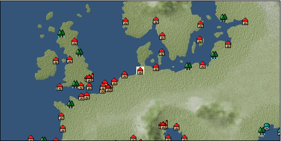

# Port: ハンブルク

import Tabs from '@theme/Tabs';
import TabItem from '@theme/TabItem';

## General Information

| Attribute | Details |
| :--- | :--- |
| **Port Name** | hamburg |
| **Port Type** | port of alliance |
| **Region** | northern europe |
| **Sea Area** | Off the coast of Jutland |
| **Required Language** | german |
| **Coordinates** | （357，2364） |
| **Investment Reward** | [Bow gun casting method](Items/Recipe Book/item_1003.md) （必要投資額：600,000ドゥカード） |

### Available Facilities

| guild | intermediary | exchange | tool shop | workshop craftsman | Painter | sculptor | peddler |
| --- | --- | --- | --- | --- | --- | --- | --- |
|   |   | ○ | ○ | ○ |   |   |   |
| Shipyard Master | Lumbermaker | Sail-maker | weapon craftsman | master | TavernFemale | archive | salesperson |
| --- | --- | --- | --- | --- | --- | --- | --- |
| ○ | ○ |   | ○ | ○ |   |   |   |
| Shipwright | 銀行 | street worker | 王宮 | Trading post | church | suburbs | translator |
| --- | --- | --- | --- | --- | --- | --- | --- |
| ○ | ○ | ○ |   |   | ○ |   |   |

### Description
The city flourishes as an important trading port in northern Germany. There are rich mineral deposits inland, producing various types of ores such as lead, tin, copper, and iron. Cultural area: Germany

<Tabs>
  <TabItem value="trade_goods_sales" label="Trade Goods Sales">

| item | group | purchase price | 同盟時 | remarks |
| --- | --- | --- | --- | --- |
| [corduroy](Items/Trade Goods/TradeGoods-Fabrics/item_824.md) | [交易品（織物）](Categories/category_20.md) | 788 | (690) |  |
| 要投資（必要投資額：400,000） EO第４章で追加 |
| [lily of the valley](Items/Trade Goods/TradeGoods-Perfume/item_358.md) | [Trading Goods (Spices)](Categories/category_11.md) | 848 | 744 |  |
| [tin ore](Items/Trade Goods/TradeGoods-Minerals/item_23.md) | [Trading Items (Iron Stone)](Categories/category_7.md) | 453 | 424 |  |
| [Beer](Items/Trade Goods/TradeGoods-Alcohol/item_2.md) | [交易品（酒類）](Categories/category_9.md) | 267 | 248 |  |
| [malachite](Items/Trade Goods/TradeGoods-Gems/item_679.md) | [Trading Items (Gemstones)](Categories/category_15.md) | 1,750 | 1,650 |  |
| 要投資（必要投資額：240,000） |
| [lapidary work](Items/Trade Goods/TradeGoods-Luxuries/item_153.md) | [Trading goods (artificial goods)](Categories/category_13.md) | 4,180 | 3,760 |  |
| 要投資（必要投資額：600,000） |
| [coal](Items/Trade Goods/TradeGoods-Wares/item_359.md) | [交易品（工業品）](Categories/category_19.md) | 445 | 416 |  |
| [iron ore](Items/Trade Goods/TradeGoods-Minerals/item_146.md) | [Trading Items (Iron Stone)](Categories/category_7.md) | 648 | 568 |  |
| [lead ore](Items/Trade Goods/TradeGoods-Minerals/item_21.md) | [Trading Items (Iron Stone)](Categories/category_7.md) | 447 | 392 |  |
| [copper ore](Items/Trade Goods/TradeGoods-Minerals/item_65.md) | [Trading Items (Iron Stone)](Categories/category_7.md) | 789 | 692 |  |
  </TabItem>
  <TabItem value="sale_specialty" label="Sale (Specialty)">

| item | group | sale price | 同盟時 | remarks |
| --- | --- | --- | --- | --- |

#### [交易品（繊維）](Categories/category_1.md)

| [Basho](Items/Trade Goods/TradeGoods-Fibers/item_3862.md) | 交易品（繊維） | 26,000 | (29,252) |  |
| [Green ramie](Items/Trade Goods/TradeGoods-Fibers/item_3428.md) | 交易品（繊維） | (32,794) | 38,266 |  |
| 98%=37500 |

#### [Trading Goods (Dye)](Categories/category_2.md)

| [ward](Items/Trade Goods/TradeGoods-Dye/item_57.md) | Trading Goods (Dye) | 1,440 | 1,480 |  |
| [Locao](Items/Trade Goods/TradeGoods-Dye/item_3909.md) | Trading Goods (Dye) | (43,965) | 51,300 |  |

#### [Trading items (food items)](Categories/category_3.md)

| [buckwheat](Items/Trade Goods/TradeGoods-Foodstuffs/item_3430.md) | Trading items (food items) | (32,738) | 38,200 |  |
| [Karasumi](Items/Trade Goods/TradeGoods-Foodstuffs/item_3687.md) | Trading items (food items) | 32,960 | (37,083) |  |

#### [交易品（調味料）](Categories/category_4.md)

| [tamarind](Items/Trade Goods/TradeGoods-Seasonings/item_1968.md) | 交易品（調味料） | 2,276 | 2,378 |  |
| [Sha Cha Ji](Items/Trade Goods/TradeGoods-Seasonings/item_3689.md) | 交易品（調味料） | 46,000 | (51,755) |  |
| [soy sauce](Items/Trade Goods/TradeGoods-Seasonings/item_3425.md) | 交易品（調味料） | (35,052) | 40,900 |  |

#### [交易品（雑貨）](Categories/category_5.md)

| [Japanese books](Items/Trade Goods/TradeGoods-Misc/item_3439.md) | 交易品（雑貨） | (33,102) | 38,625 |  |
| [rattan work](Items/Trade Goods/TradeGoods-Misc/item_3698.md) | 交易品（雑貨） | 32,112 | (36,129) |  |

#### [Trading products (medical products)](Categories/category_6.md)

| [Borei](Items/Trade Goods/TradeGoods-Medicine/item_3678.md) | Trading products (medical products) | (23,426) | 27,334 |  |
| [calamus](Items/Trade Goods/TradeGoods-Medicine/item_3427.md) | Trading products (medical products) | 35,474 | 39,500 |  |
| 120%=47400 |

#### [交易品（酒類）](Categories/category_9.md)

| [sherry](Items/Trade Goods/TradeGoods-Alcohol/item_844.md) | 交易品（酒類） | 588 | 637 |  |
| [fruit brandy](Items/Trade Goods/TradeGoods-Alcohol/item_1440.md) | 交易品（酒類） | 714 | (803) |  |
| [Sake](Items/Trade Goods/TradeGoods-Alcohol/item_3424.md) | 交易品（酒類） | (45,883) | 53,539 |  |

#### [Trading goods (hobby goods)](Categories/category_10.md)

| [Aigyoku](Items/Trade Goods/TradeGoods-Sunddries/item_3677.md) | Trading goods (hobby goods) | (43,433) | 50,680 |  |
| [cacao](Items/Trade Goods/TradeGoods-Sunddries/item_140.md) | Trading goods (hobby goods) | (1,348) | 1,572 |  |
| [eggplant](Items/Trade Goods/TradeGoods-Sunddries/item_3426.md) | Trading goods (hobby goods) | (32,995) | 38,500 |  |
| 80%=30800 |
| [peanuts](Items/Trade Goods/TradeGoods-Sunddries/item_134.md) | Trading goods (hobby goods) | (377) | 439 |  |
| [prune](Items/Trade Goods/TradeGoods-Sunddries/item_523.md) | Trading goods (hobby goods) | (444) | 518 |  |
| [dried apple](Items/Trade Goods/TradeGoods-Sunddries/item_19.md) | Trading goods (hobby goods) | [Edit Sale Price](Ports/port_50.md) |  |
| [black tea](Items/Trade Goods/TradeGoods-Sunddries/item_675.md) | Trading goods (hobby goods) | 2,670 | 2,847 |  |

#### [Trading Goods (Spices)](Categories/category_11.md)

| [jasmine](Items/Trade Goods/TradeGoods-Perfume/item_772.md) | Trading Goods (Spices) | (5,851) | 6,827 |  |
| [geranium](Items/Trade Goods/TradeGoods-Perfume/item_145.md) | Trading Goods (Spices) | 1,340 | 1,280 |  |
| [lira](Items/Trade Goods/TradeGoods-Perfume/item_30.md) | Trading Goods (Spices) | 827 | (930) |  |
| [sandalwood](Items/Trade Goods/TradeGoods-Perfume/item_771.md) | Trading Goods (Spices) | 4,720 | 4,930 |  |

#### [Trading Goods (Spices)](Categories/category_12.md)

| [garam masala](Items/Trade Goods/TradeGoods-Spices/item_965.md) | Trading Goods (Spices) | 769 | (865) |  |
| [Sanshou](Items/Trade Goods/TradeGoods-Spices/item_3794.md) | Trading Goods (Spices) | 33,266 | (37,427) |  |
| [nutmeg](Items/Trade Goods/TradeGoods-Spices/item_1969.md) | Trading Goods (Spices) | (20,610) | 24,048 |  |
| [bergamot](Items/Trade Goods/TradeGoods-Spices/item_879.md) | Trading Goods (Spices) | 714 | (803) |  |
| [chili pepper](Items/Trade Goods/TradeGoods-Spices/item_1831.md) | Trading Goods (Spices) | (1,549) | 1,807 |  |
| [Grapefruit](Items/Trade Goods/TradeGoods-Spices/item_3422.md) | Trading Goods (Spices) | (34,631) | 40,409 |  |
| 98%=39600 |

#### [Trading goods (artificial goods)](Categories/category_13.md)

| [glasswork](Items/Trade Goods/TradeGoods-Luxuries/item_60.md) | Trading goods (artificial goods) | 1,690 | (1,901) |  |
| [Tumbaga](Items/Trade Goods/TradeGoods-Luxuries/item_3028.md) | Trading goods (artificial goods) | (20,762) | 24,226 |  |
| [Saori](Items/Trade Goods/TradeGoods-Luxuries/item_3676.md) | Trading goods (artificial goods) | 10,500 | (11,813) |  |
| [Corner work](Items/Trade Goods/TradeGoods-Luxuries/item_3696.md) | Trading goods (artificial goods) | 30,933 | (34,803) |  |

#### [交易品（美術品）](Categories/category_14.md)

| [Japanese painting](Items/Trade Goods/TradeGoods-Art/item_3436.md) | 交易品（美術品） | (29,858) | 34,839 |  |
| 93%=32400 |

#### [Trading Items (Gemstones)](Categories/category_15.md)

| [aventurine](Items/Trade Goods/TradeGoods-Gems/item_678.md) | Trading Items (Gemstones) | 5,980 | 6,265 |  |
| [inca rose](Items/Trade Goods/TradeGoods-Gems/item_3014.md) | Trading Items (Gemstones) | (15,998) | 18,667 |  |
| [cat's eye](Items/Trade Goods/TradeGoods-Gems/item_1047.md) | Trading Items (Gemstones) | 10,300 | 10,800 |  |
| [sapphire](Items/Trade Goods/TradeGoods-Gems/item_676.md) | Trading Items (Gemstones) | 12,500 | 13,100 |  |
| [diamond](Items/Trade Goods/TradeGoods-Gems/item_449.md) | Trading Items (Gemstones) | 8,720 | 9,138 |  |
| 8500 before change |
| [ruby](Items/Trade Goods/TradeGoods-Gems/item_773.md) | Trading Items (Gemstones) | (11,656) | 13,600 |  |
| [taiwan sapphire](Items/Trade Goods/TradeGoods-Gems/item_3695.md) | Trading Items (Gemstones) | (29,487) | 34,407 |  |

#### [Trading Items (Arms)](Categories/category_16.md)

| [crossbow](Items/Trade Goods/TradeGoods-Weapons/item_537.md) | Trading Items (Arms) | 1,362 | (1,532) |  |
| [Japanese bow](Items/Trade Goods/TradeGoods-Weapons/item_3469.md) | Trading Items (Arms) | 11,505 | (12,944) |  |
| [Japanese sword](Items/Trade Goods/TradeGoods-Weapons/item_3437.md) | Trading Items (Arms) | (24,596) | 28,700 |  |
| 2017.11.10 Alliance 100%=28700 confirmed |
| [japanese armor](Items/Trade Goods/TradeGoods-Weapons/item_3590.md) | Trading Items (Arms) | 11,500 | (12,938) |  |

#### [Trading Items (Firearms)](Categories/category_17.md)

| [musket gun](Items/Trade Goods/TradeGoods-Firearms/item_584.md) | Trading Items (Firearms) | (3,051) | 3,559 |  |
| [monocular gun](Items/Trade Goods/TradeGoods-Firearms/item_3916.md) | Trading Items (Firearms) | (24,573) | 28,673 |  |
| [tanegashima gun](Items/Trade Goods/TradeGoods-Firearms/item_3423.md) | Trading Items (Firearms) | (33,157) | 38,689 |  |
| 61%=23600 |
| [銅手銃](Items/Trade Goods/TradeGoods-Firearms/item_3700.md) | Trading Items (Firearms) | (22,298) | 26,018 |  |

#### [Trading Goods (Livestock)](Categories/category_18.md)

| [boar](Items/Trade Goods/TradeGoods-Livestock/item_3476.md) | Trading Goods (Livestock) | (32,738) | 38,200 |  |

#### [交易品（工業品）](Categories/category_19.md)

| [Japanese paper](Items/Trade Goods/TradeGoods-Wares/item_3438.md) | 交易品（工業品） | (24,939) | 29,100 |  |
| [marble](Items/Trade Goods/TradeGoods-Wares/item_52.md) | 交易品（工業品） | 2,024 | (2,277) |  |
| [rattan](Items/Trade Goods/TradeGoods-Wares/item_3701.md) | 交易品（工業品） | 31,740 | (35,710) |  |
| [羊皮紙](Items/Trade Goods/TradeGoods-Wares/item_53.md) | 交易品（工業品） | (1,415) | 1,650 |  |

#### [交易品（織物）](Categories/category_20.md)

| [Awaiyo](Items/Trade Goods/TradeGoods-Fabrics/item_3002.md) | 交易品（織物） | 10,535 | (11,853) |  |
| [gobelin weave](Items/Trade Goods/TradeGoods-Fabrics/item_1276.md) | 交易品（織物） | 3,979 | (4,476) |  |
| [damask](Items/Trade Goods/TradeGoods-Fabrics/item_614.md) | 交易品（織物） | 6,358 | (7,153) |  |
| [velvet](Items/Trade Goods/TradeGoods-Fabrics/item_902.md) | 交易品（織物） | 4,642 | (5,222) |  |
| [明紬](Items/Trade Goods/TradeGoods-Fabrics/item_3753.md) | 交易品（織物） | 33,917 | (38,160) |  |
| [Nishijin textile](Items/Trade Goods/TradeGoods-Fabrics/item_3431.md) | 交易品（織物） | (35,913) | 41,905 |  |
| 84%=35200 |
  </TabItem>
  <TabItem value="sale_no_specialty" label="Sale (No Specialty)">

| item | group | sale price | 同盟時 | remarks |
| --- | --- | --- | --- | --- |

#### [交易品（繊維）](Categories/category_1.md)

| [flax](Items/Trade Goods/TradeGoods-Fibers/item_64.md) | 交易品（繊維） | 235 | (264) |  |
| [fur](Items/Trade Goods/TradeGoods-Fibers/item_634.md) | 交易品（繊維） | 1,363 | (1,533) |  |
| [leather](Items/Trade Goods/TradeGoods-Fibers/item_44.md) | 交易品（繊維） | 735 | (826) |  |
| [wool](Items/Trade Goods/TradeGoods-Fibers/item_5.md) | 交易品（繊維） | 436 | (490) |  |
| [numb](Items/Trade Goods/TradeGoods-Fibers/item_900.md) | 交易品（繊維） | 12 | (13) |  |

#### [Trading Goods (Dye)](Categories/category_2.md)

| [貝紫](Items/Trade Goods/TradeGoods-Dye/item_110.md) | Trading Goods (Dye) | 5,537 | (6,229) |  |

#### [Trading items (food items)](Categories/category_3.md)

| [redfish](Items/Trade Goods/TradeGoods-Foodstuffs/item_701.md) | Trading items (food items) | 42 | (47) |  |
| [duck meat](Items/Trade Goods/TradeGoods-Foodstuffs/item_32.md) | Trading items (food items) | 459 | (516) |  |
| [turnip](Items/Trade Goods/TradeGoods-Foodstuffs/item_55.md) | Trading items (food items) | 95 | (106) |  |
| [Oat](Items/Trade Goods/TradeGoods-Foodstuffs/item_275.md) | Trading items (food items) | 80 | (90) |  |
| [Pacific saury](Items/Trade Goods/TradeGoods-Foodstuffs/item_700.md) | Trading items (food items) | 28 | (31) |  |
| [cheese](Items/Trade Goods/TradeGoods-Foodstuffs/item_20.md) | Trading items (food items) | 450 | (506) |  |
| [corn](Items/Trade Goods/TradeGoods-Foodstuffs/item_138.md) | Trading items (food items) | 211 | (237) |  |
| [herring](Items/Trade Goods/TradeGoods-Foodstuffs/item_698.md) | Trading items (food items) | 28 | (31) |  |
| [carrot](Items/Trade Goods/TradeGoods-Foodstuffs/item_2708.md) | Trading items (food items) | 109 | (122) |  |
| [ham](Items/Trade Goods/TradeGoods-Foodstuffs/item_290.md) | Trading items (food items) | 420 | (472) |  |
| [european crayfish](Items/Trade Goods/TradeGoods-Foodstuffs/item_6188.md) | Trading items (food items) | (3,661) | 4,271 |  |
| [milk](Items/Trade Goods/TradeGoods-Foodstuffs/item_254.md) | Trading items (food items) | 148 | (166) |  |
| [egg](Items/Trade Goods/TradeGoods-Foodstuffs/item_40.md) | Trading items (food items) | 35 | 36 |  |
| [wheat](Items/Trade Goods/TradeGoods-Foodstuffs/item_16.md) | Trading items (food items) | 76 | (85) |  |
| [beef](Items/Trade Goods/TradeGoods-Foodstuffs/item_26.md) | Trading items (food items) | 682 | (767) |  |
| [魚肉](Items/Trade Goods/TradeGoods-Foodstuffs/item_10.md) | Trading items (food items) | 206 | (231) |  |
| [chicken meat](Items/Trade Goods/TradeGoods-Foodstuffs/item_29.md) | Trading items (food items) | 471 | (529) |  |

#### [交易品（調味料）](Categories/category_4.md)

| [butter](Items/Trade Goods/TradeGoods-Seasonings/item_3.md) | 交易品（調味料） | 350 | (393) |  |
| [salt](Items/Trade Goods/TradeGoods-Seasonings/item_42.md) | 交易品（調味料） | 286 | (321) |  |
| [Honey](Items/Trade Goods/TradeGoods-Seasonings/item_49.md) | 交易品（調味料） | 1,113 | (1,252) |  |

#### [交易品（雑貨）](Categories/category_5.md)

| [Western books](Items/Trade Goods/TradeGoods-Misc/item_293.md) | 交易品（雑貨） | 722 | (812) |  |

#### [Trading products (medical products)](Categories/category_6.md)

| [chamomile](Items/Trade Goods/TradeGoods-Medicine/item_292.md) | Trading products (medical products) | 356 | 363 |  |
| [dandelion](Items/Trade Goods/TradeGoods-Medicine/item_1089.md) | Trading products (medical products) | 288 | (324) |  |
| [mercury agent](Items/Trade Goods/TradeGoods-Medicine/item_703.md) | Trading products (medical products) | 1,610 | (1,811) |  |

#### [Trading products (precious metals)](Categories/category_8.md)

| [佐摩銀](Items/Trade Goods/TradeGoods-Metals/item_3432.md) | Trading products (precious metals) | (32,295) | 37,683 |  |
| 82%=30900 |
| [gold dust](Items/Trade Goods/TradeGoods-Metals/item_111.md) | Trading products (precious metals) | 4,475 | (5,034) |  |
| [gold](Items/Trade Goods/TradeGoods-Metals/item_659.md) | Trading products (precious metals) | 9,052 | 10,200 |  |

#### [交易品（酒類）](Categories/category_9.md)

| [aquavit](Items/Trade Goods/TradeGoods-Alcohol/item_572.md) | 交易品（酒類） | 594 | (668) |  |
| [whiskey](Items/Trade Goods/TradeGoods-Alcohol/item_1.md) | 交易品（酒類） | 748 | (841) |  |
| [vodka](Items/Trade Goods/TradeGoods-Alcohol/item_579.md) | 交易品（酒類） | 692 | (778) |  |
| [gin](Items/Trade Goods/TradeGoods-Alcohol/item_291.md) | 交易品（酒類） | 605 | (680) |  |
| [brandy](Items/Trade Goods/TradeGoods-Alcohol/item_9.md) | 交易品（酒類） | 912 | (1,026) |  |
| [Shochu](Items/Trade Goods/TradeGoods-Alcohol/item_3449.md) | 交易品（酒類） | 6,905 | (7,768) |  |

#### [Trading goods (hobby goods)](Categories/category_10.md)

| [pickles](Items/Trade Goods/TradeGoods-Sunddries/item_535.md) | Trading goods (hobby goods) | 330 | (371) |  |

#### [Trading Goods (Spices)](Categories/category_11.md)

| [lemon oil](Items/Trade Goods/TradeGoods-Perfume/item_151.md) | Trading Goods (Spices) | 635 | (714) |  |
| [Musk](Items/Trade Goods/TradeGoods-Perfume/item_158.md) | Trading Goods (Spices) | 4,938 | (5,555) |  |

#### [Trading Goods (Spices)](Categories/category_12.md)

| [cumin](Items/Trade Goods/TradeGoods-Spices/item_156.md) | Trading Goods (Spices) | 1,657 | (1,864) |  |
| [celery](Items/Trade Goods/TradeGoods-Spices/item_431.md) | Trading Goods (Spices) | 164 | (184) |  |
| [fennel](Items/Trade Goods/TradeGoods-Spices/item_1045.md) | Trading Goods (Spices) | 297 | (334) |  |

#### [Trading goods (artificial goods)](Categories/category_13.md)

| [dragonfly ball](Items/Trade Goods/TradeGoods-Luxuries/item_294.md) | Trading goods (artificial goods) | 1,220 | 1,220 |  |
| [Ivory work](Items/Trade Goods/TradeGoods-Luxuries/item_1090.md) | Trading goods (artificial goods) | 3,370 | (3,791) |  |
| [silversmith](Items/Trade Goods/TradeGoods-Luxuries/item_619.md) | Trading goods (artificial goods) | 3,309 | (3,722) |  |
| [ceramics](Items/Trade Goods/TradeGoods-Luxuries/item_152.md) | Trading goods (artificial goods) | (1,325) | 1,545 |  |
| [luxury furniture](Items/Trade Goods/TradeGoods-Luxuries/item_1048.md) | Trading goods (artificial goods) | 2,858 | (3,215) |  |

#### [交易品（美術品）](Categories/category_14.md)

| [青銅像](Items/Trade Goods/TradeGoods-Art/item_148.md) | 交易品（美術品） | 1,365 | 1,382 |  |

#### [Trading Items (Gemstones)](Categories/category_15.md)

| [emerald](Items/Trade Goods/TradeGoods-Gems/item_777.md) | Trading Items (Gemstones) | 8,225 | 8,560 |  |
| [crystal](Items/Trade Goods/TradeGoods-Gems/item_893.md) | Trading Items (Gemstones) | 1,389 | (1,562) |  |
| [amber](Items/Trade Goods/TradeGoods-Gems/item_618.md) | Trading Items (Gemstones) | 2,480 | (2,790) |  |
| [pearl](Items/Trade Goods/TradeGoods-Gems/item_769.md) | Trading Items (Gemstones) | 11,179 | (12,577) |  |
| [ivory](Items/Trade Goods/TradeGoods-Gems/item_699.md) | Trading Items (Gemstones) | 3,950 | 4,150 |  |

#### [Trading Items (Arms)](Categories/category_16.md)

| [scimitar](Items/Trade Goods/TradeGoods-Weapons/item_142.md) | Trading Items (Arms) | 1,040 | (1,170) |  |
| [dagger](Items/Trade Goods/TradeGoods-Weapons/item_143.md) | Trading Items (Arms) | 983 | (1,105) |  |
| [western armor](Items/Trade Goods/TradeGoods-Weapons/item_6.md) | Trading Items (Arms) | 2,706 | (3,044) |  |
| [長弓](Items/Trade Goods/TradeGoods-Weapons/item_1049.md) | Trading Items (Arms) | 869 | (977) |  |

#### [Trading Items (Firearms)](Categories/category_17.md)

| [arquebus gun](Items/Trade Goods/TradeGoods-Firearms/item_14.md) | Trading Items (Firearms) | (1,761) | 2,054 |  |
| [大砲](Items/Trade Goods/TradeGoods-Firearms/item_4.md) | Trading Items (Firearms) | 3,445 | (3,876) |  |
| [gunpowder](Items/Trade Goods/TradeGoods-Firearms/item_352.md) | Trading Items (Firearms) | 1,099 | (1,236) |  |

#### [Trading Goods (Livestock)](Categories/category_18.md)

| [duck](Items/Trade Goods/TradeGoods-Livestock/item_38.md) | Trading Goods (Livestock) | 67 | (75) |  |
| [alpaca](Items/Trade Goods/TradeGoods-Livestock/item_2995.md) | Trading Goods (Livestock) | (1,235) | 1,440 |  |
| [chicken](Items/Trade Goods/TradeGoods-Livestock/item_252.md) | Trading Goods (Livestock) | 54 | 55 |  |

#### [交易品（工業品）](Categories/category_19.md)

| [wood](Items/Trade Goods/TradeGoods-Wares/item_277.md) | 交易品（工業品） | 800 | 830 |  |
| [brass](Items/Trade Goods/TradeGoods-Wares/item_624.md) | 交易品（工業品） | 874 | (983) |  |
| [Stone](Items/Trade Goods/TradeGoods-Wares/item_276.md) | 交易品（工業品） | 734 | (825) |  |
| [oil](Items/Trade Goods/TradeGoods-Wares/item_613.md) | 交易品（工業品） | 650 | (731) |  |
| [iron material](Items/Trade Goods/TradeGoods-Wares/item_268.md) | 交易品（工業品） | 892 | (1,003) |  |
| [鉛](Items/Trade Goods/TradeGoods-Wares/item_895.md) | 交易品（工業品） | (630) | 735 |  |
| [銅](Items/Trade Goods/TradeGoods-Wares/item_894.md) | 交易品（工業品） | (933) | 1,088 |  |
| [青銅](Items/Trade Goods/TradeGoods-Wares/item_7.md) | 交易品（工業品） | 963 | (1,083) |  |

#### [交易品（織物）](Categories/category_20.md)

| [dutch calico](Items/Trade Goods/TradeGoods-Fabrics/item_1435.md) | 交易品（織物） | 903 | (1,015) |  |
| [satin](Items/Trade Goods/TradeGoods-Fabrics/item_996.md) | 交易品（織物） | 3,910 | (4,399) |  |
| [georgette](Items/Trade Goods/TradeGoods-Fabrics/item_1000.md) | 交易品（織物） | 3,510 | (3,949) |  |
| [woolen fabric](Items/Trade Goods/TradeGoods-Fabrics/item_163.md) | 交易品（織物） | 1,007 | (1,132) |  |
| [cotton fabric](Items/Trade Goods/TradeGoods-Fabrics/item_571.md) | 交易品（織物） | 1,179 | (1,326) |  |
| [linen fabric](Items/Trade Goods/TradeGoods-Fabrics/item_135.md) | 交易品（織物） | 441 | (496) |  |
  </TabItem>
  <TabItem value="guild_&_others" label="Guild & Others">

| item | group | Sales price | Handling NPC | remarks |
| --- | --- | --- | --- | --- |

#### martin luther

| [How to make a Germanic language dictionary](Items/Recipe Book/item_2009.md) | [recipe book](Categories/category_22.md) | Fixed recipe | martin luther |  |
| [religious studies](Skills/Skill-Adventure/item_340.md) | [Skill (adventure)](Categories/category_39.md) | 8,000 | martin luther |  |
| [Banquet](Skills/Skill-Adventure/item_457.md) | [Skill (adventure)](Categories/category_39.md) | 25,000 | martin luther |  |

#### others

| [How to make beautiful pointed shoes](Items/Recipe Book/item_4496.md) | [recipe book](Categories/category_22.md) | Fixed recipe |  |  |
| 15th century 2nd and 3rd period shoemakers |
| [High lethality sword casting method](Items/Recipe Book/item_4510.md) | [recipe book](Categories/category_22.md) | Fixed recipe |  |  |
| 16th century third period young knight |
  </TabItem>
  <TabItem value="toolman" label="Toolman">

| item | group | Sales price | Handling NPC | remarks |
| --- | --- | --- | --- | --- |

#### [recipe book](Categories/category_22.md)

| [Mode Design Collection Volume 2](Items/Recipe Book/item_709.md) | recipe book | 30,000 | tool shop owner |  |
| 要投資（必要投資額：120,000） |
| [Wand forging/application](Items/Recipe Book/item_710.md) | recipe book | 50,000 | tool shop owner |  |
| 要投資（必要投資額：120,000） |
| [Sake brewing secret](Items/Recipe Book/item_565.md) | recipe book | 10,000 | tool shop owner |  |
| [Book of land battle props and crafts](Items/Recipe Book/item_521.md) | recipe book | 10,000 | tool shop owner |  |

#### [Equipment (body)](Categories/category_24.md)

| [plate armor](Items/Equipment/Equipment-Body/item_1148.md) | Equipment (body) | 300,000 | tool shop owner |  |
| 要投資（必要投資額：400,000） |

#### [Equipment (legs)](Categories/category_26.md)

| [leather boots](Items/Equipment/Equipment-Feet/item_221.md) | Equipment (legs) | 26,200 | tool shop owner |  |

#### [Equipment (belongings)](Categories/category_27.md)

| [serpentine lock gun](Items/Equipment/Equipment-Weapon/item_2212.md) | Equipment (belongings) | 40,000 | tool shop owner |  |
| 要投資（必要投資額：180,000） |
| [spear](Items/Equipment/Equipment-Weapon/item_555.md) | Equipment (belongings) | 34,400 | tool shop owner |  |
| [violin](Items/Equipment/Equipment-Weapon/item_556.md) | Equipment (belongings) | 12,000 | tool shop owner |  |
| [matchlock shooting gun](Items/Equipment/Equipment-Weapon/item_103.md) | Equipment (belongings) | 3,000 | tool shop owner |  |
| [roundel dagger](Items/Equipment/Equipment-Weapon/item_1670.md) | Equipment (belongings) | 24,500 | tool shop owner |  |
| 要投資（必要投資額：180,000） |

#### [装備品（服飾品）](Categories/category_28.md)

| [Utilization guidebook volume 1](Items/Equipment/Equipment-Accessory/item_2209.md) | 装備品（服飾品） | 10,000 | tool shop owner |  |
| 要投資（必要投資額：120,000） |
| [Consecutive Attack Guide Volume 1](Items/Equipment/Equipment-Accessory/item_2208.md) | 装備品（服飾品） | 10,000 | tool shop owner |  |
| 要投資（必要投資額：120,000） |

#### [Consumables (land battle/deck battle)](Categories/category_29.md)

| [hawk feather](Items/Consumables/Consumables-Landbattle/item_562.md) | Consumables (land battle/deck battle) | 200 | tool shop owner |  |
| [throwing knife](Items/Consumables/Consumables-Landbattle/item_560.md) | Consumables (land battle/deck battle) | 150 | tool shop owner |  |
| [Assortment of therapeutic drugs](Items/Consumables/Consumables-Landbattle/item_564.md) | Consumables (land battle/deck battle) | 900 | tool shop owner |  |
| [explosive drug](Items/Consumables/Consumables-Landbattle/item_558.md) | Consumables (land battle/deck battle) | 300 | tool shop owner |  |
| [secret cure](Items/Consumables/Consumables-Landbattle/item_563.md) | Consumables (land battle/deck battle) | 600 | tool shop owner |  |

#### [Consumables (naval/hand-to-hand combat)](Categories/category_30.md)

| [forged correspondence](Items/Consumables/Consumables-navalhand-to-hand combat/item_559.md) | Consumables (naval/hand-to-hand combat) | 3,000 | tool shop owner |  |
| [steel cannonball](Items/Consumables/Consumables-navalhand-to-hand combat/item_1117.md) | Consumables (naval/hand-to-hand combat) | 5,000 | tool shop owner |  |
| 要投資（必要投資額：180,000） |

#### [Consumables (skill activation)](Categories/category_31.md)

| [fishing gear](Items/Consumables/Consumables-Skill/item_79.md) | Consumables (skill activation) | 2,500 | tool shop owner |  |

#### [Consumables (request documents)](Categories/category_45.md)

| [Textile purchase order](Items/Consumables/Consumables-Documents/item_2977.md) | Consumables (request documents) | 50,000 | tool shop owner |  |
  </TabItem>
  <TabItem value="kobo_craftsmen" label="Craftsman">

| item | group | Sales price | Handling NPC | remarks |
| --- | --- | --- | --- | --- |

#### [Consumables (condition recovery)](Categories/category_21.md)

| [Nostalgic carillon bell](Items/Consumables/Consumables-Recovery/item_245.md) | Consumables (condition recovery) | 200 | workshop craftsman |  |
| [Ship song sheet music](Items/Consumables/Consumables-Recovery/item_247.md) | Consumables (condition recovery) | 200 | workshop craftsman |  |

#### [recipe book](Categories/category_22.md)

| [Special weapons manufacturing method](Items/Recipe Book/item_747.md) | recipe book | 100,000 | workshop craftsman |  |
| 要投資（必要投資額：180,000） |

#### [Consumables (skill activation)](Categories/category_31.md)

| [四分儀](Items/Consumables/Consumables-Skill/item_346.md) | Consumables (skill activation) | 500 | workshop craftsman |  |

#### [shipbuilding materials](Categories/category_47.md)

| [General purpose medium square sail](Items/Shipbuilding FS Material/item_3453.md) | shipbuilding materials | 300,000 | workshop craftsman |  |
| 要投資（必要投資額：500,000） |
| [General purpose medium latin sail](Items/Shipbuilding FS Material/item_3452.md) | shipbuilding materials | 300,000 | workshop craftsman |  |
| 要投資（必要投資額：500,000） |
| [General-purpose medium-sized oar](Items/Shipbuilding FS Material/item_3454.md) | shipbuilding materials | 500,000 | workshop craftsman |  |
| 要投資（必要投資額：720,000） |
| [General-purpose medium-sized reinforcement board](Items/Shipbuilding FS Material/item_3456.md) | shipbuilding materials | 500,000 | workshop craftsman |  |
| 要投資（必要投資額：720,000） |
| [General-purpose medium-sized expansion warehouse](Items/Shipbuilding FS Material/item_3534.md) | shipbuilding materials | 800,000 | workshop craftsman |  |
| 要投資（必要投資額：690,000） |
| [General-purpose medium-sized expansion cabin](Items/Shipbuilding FS Material/item_3533.md) | shipbuilding materials | 800,000 | workshop craftsman |  |
| 要投資（必要投資額：690,000） |
| [General-purpose medium-sized improved rudder](Items/Shipbuilding FS Material/item_3532.md) | shipbuilding materials | 800,000 | workshop craftsman |  |
| 要投資（必要投資額：720,000） |
| [General-purpose medium-sized paddle boat](Items/Shipbuilding FS Material/item_3451.md) | shipbuilding materials | 1,000,000 | workshop craftsman |  |
| 要投資（必要投資額：720,000） |
| [General-purpose medium-sized anti-swaying water tank](Items/Shipbuilding FS Material/item_3535.md) | shipbuilding materials | 800,000 | workshop craftsman |  |
| 要投資（必要投資額：720,000） |
| [General purpose medium gun port](Items/Shipbuilding FS Material/item_3455.md) | shipbuilding materials | 300,000 | workshop craftsman |  |
| 要投資（必要投資額：500,000） |
| [General-purpose medium-sized hull](Items/Shipbuilding FS Material/item_3450.md) | shipbuilding materials | 1,000,000 | workshop craftsman |  |
| 要投資（必要投資額：720,000） |
| [General purpose medium armor plate](Items/Shipbuilding FS Material/item_3503.md) | shipbuilding materials | 500,000 | workshop craftsman |  |
| 要投資（必要投資額：720,000） |
  </TabItem>
  <TabItem value="shipyard" label="Shipyard">

### Shipyard Master

| item | group | Sales price | Handling NPC | remarks |
| --- | --- | --- | --- | --- |

#### [recipe book](Categories/category_22.md)

| [Book of Shipbuilding Materials and Hulls Volume 2](Items/Recipe Book/item_1719.md) | recipe book | Fixed recipe | Shipyard Master |  |

#### [Boat](Categories/category_43.md)

| [2 mast cogs](Items/Ships/item_265.md) | Boat | 96,000 | Shipyard Master |  |
| [warwick cog](Items/Ships/item_336.md) | Boat | 230,000 | Shipyard Master |  |
| [carrack](Items/Ships/item_236.md) | Boat | 720,000 | Shipyard Master |  |
| [caravelle](Items/Ships/item_213.md) | Boat | 285,000 | Shipyard Master |  |
| [Hansa Cog](Items/Ships/item_263.md) | Boat | 24,000 | Shipyard Master |  |
| [Varsha](Items/Ships/item_201.md) | Boat | 2,000 | Shipyard Master |  |
| [pinnace](Items/Ships/item_767.md) | Boat | 950,000 | Shipyard Master |  |
| [flute](Items/Ships/item_569.md) | Boat | 410,000 | Shipyard Master |  |
| [hooker](Items/Ships/item_335.md) | Boat | 220,000 | Shipyard Master |  |
| [commercial carrack](Items/Ships/item_239.md) | Boat | 728,000 | Shipyard Master |  |
| [commercial caravel](Items/Ships/item_215.md) | Boat | 290,000 | Shipyard Master |  |
| [commercial pinnace](Items/Ships/item_768.md) | Boat | 960,000 | Shipyard Master |  |
| [commercial flute](Items/Ships/item_570.md) | Boat | 420,000 | Shipyard Master |  |
| [commercial large carrack](Items/Ships/item_409.md) | Boat | 1,840,000 | Shipyard Master |  |
| [commercial armed carrack](Items/Ships/item_1502.md) | Boat | 4,000,000 | Shipyard Master |  |
| [large carrack](Items/Ships/item_408.md) | Boat | 1,800,000 | Shipyard Master |  |
| [small galleon](Items/Ships/item_406.md) | Boat | 830,000 | Shipyard Master |  |
| [small carrack](Items/Ships/item_219.md) | Boat | 480,000 | Shipyard Master |  |
| [small caravel](Items/Ships/item_206.md) | Boat | 92,000 | Shipyard Master |  |
| [combat carrack](Items/Ships/item_238.md) | Boat | 720,000 | Shipyard Master |  |
| [combat caravel](Items/Ships/item_212.md) | Boat | 280,000 | Shipyard Master |  |
| [combat pinnace](Items/Ships/item_766.md) | Boat | 950,000 | Shipyard Master |  |
| [combat flute](Items/Ships/item_568.md) | Boat | 400,000 | Shipyard Master |  |
| [Large exploration carrack](Items/Ships/item_1503.md) | Boat | 3,360,000 | Shipyard Master |  |
| [refurbished heavy carrack](Items/Ships/item_1504.md) | Boat | 7,000,000 | Shipyard Master |  |
| [armed cog](Items/Ships/item_264.md) | Boat | 25,000 | Shipyard Master |  |
| [light galleon](Items/Ships/item_240.md) | Boat | 810,000 | Shipyard Master |  |
| [light carrack](Items/Ships/item_218.md) | Boat | 478,000 | Shipyard Master |  |
| [light caravelle](Items/Ships/item_207.md) | Boat | 92,000 | Shipyard Master |  |
| [transport carrack](Items/Ships/item_222.md) | Boat | 488,000 | Shipyard Master |  |
| [heavy carrack](Items/Ships/item_410.md) | Boat | 3,600,000 | Shipyard Master |  |

#### [shipbuilding materials](Categories/category_47.md)

| [2-deck medium-sized hull](Items/Shipbuilding FS Material/item_1721.md) | shipbuilding materials | Fixed recipe | Shipyard Master |  |
| [3-deck medium-sized hull](Items/Shipbuilding FS Material/item_1935.md) | shipbuilding materials | Fixed recipe | Shipyard Master |  |
| [Flat deck medium-sized hull](Items/Shipbuilding FS Material/item_1720.md) | shipbuilding materials | Fixed recipe | Shipyard Master |  |

### Lumbermaker

| item | group | Sales price | Handling NPC | remarks |
| --- | --- | --- | --- | --- |

#### [recipe book](Categories/category_22.md)

| [Book of Shipbuilding Materials and Crafts Volume 2](Items/Recipe Book/item_1717.md) | recipe book | Fixed recipe | Lumbermaker |  |

#### [Ship parts (additional armor)](Categories/category_35.md)

| [elm board](Items/Ship Parts/Shipparts-Plates/item_328.md) | Ship parts (additional armor) | 13,000 | Lumbermaker |  |
| [oak board](Items/Ship Parts/Shipparts-Plates/item_354.md) | Ship parts (additional armor) | 34,000 | Lumbermaker |  |
| [beach board](Items/Ship Parts/Shipparts-Plates/item_327.md) | Ship parts (additional armor) | 6,400 | Lumbermaker |  |
| [red pine board](Items/Ship Parts/Shipparts-Plates/item_326.md) | Ship parts (additional armor) | 2,700 | Lumbermaker |  |
| [lightweight cedar board](Items/Ship Parts/Shipparts-Plates/item_325.md) | Ship parts (additional armor) | 880 | Lumbermaker |  |
| [iron plate](Items/Ship Parts/Shipparts-Plates/item_921.md) | Ship parts (additional armor) | 130,000 | Lumbermaker |  |
| [銅板](Items/Ship Parts/Shipparts-Plates/item_405.md) | Ship parts (additional armor) | 73,000 | Lumbermaker |  |

#### [shipbuilding materials](Categories/category_47.md)

| [middle mast](Items/Shipbuilding FS Material/item_1718.md) | shipbuilding materials | Fixed recipe | Lumbermaker |  |

### Shipwright

| item | group | Sales price | Handling NPC | remarks |
| --- | --- | --- | --- | --- |

#### [recipe book](Categories/category_22.md)

| [Shipbuilding materials and studio](Items/Recipe Book/item_1782.md) | recipe book | Fixed recipe | Shipwright |  |

#### [shipbuilding materials](Categories/category_47.md)

| [studio](Items/Shipbuilding FS Material/item_1781.md) | shipbuilding materials | Fixed recipe | Shipwright |  |
  </TabItem>
  <TabItem value="weapon craftsman" label="weapon craftsman">

| item | group | Sales price | Handling NPC | remarks |
| --- | --- | --- | --- | --- |

#### [recipe book](Categories/category_22.md)

| [Book of Shipbuilding Materials and Casting Volume 2](Items/Recipe Book/item_1723.md) | recipe book | Fixed recipe | weapon craftsman |  |

#### [Ship parts (special weapons)](Categories/category_37.md)

| [small corvus](Items/Ship Parts/Shipparts-Special-Weapons/item_193.md) | Ship parts (special weapons) | 3,000 | weapon craftsman |  |
| [small ram](Items/Ship Parts/Shipparts-Special-Weapons/item_190.md) | Ship parts (special weapons) | 1,000 | weapon craftsman |  |
| [small poop](Items/Ship Parts/Shipparts-Special-Weapons/item_198.md) | Ship parts (special weapons) | 39,000 | weapon craftsman |  |
| [small ship forecastle](Items/Ship Parts/Shipparts-Special-Weapons/item_195.md) | Ship parts (special weapons) | 5,000 | weapon craftsman |  |
| [poop](Items/Ship Parts/Shipparts-Special-Weapons/item_837.md) | Ship parts (special weapons) | 130,000 | weapon craftsman |  |
| [forecastle](Items/Ship Parts/Shipparts-Special-Weapons/item_241.md) | Ship parts (special weapons) | 16,000 | weapon craftsman |  |
| [additional spanker](Items/Ship Parts/Shipparts-Special-Weapons/item_200.md) | Ship parts (special weapons) | 55,000 | weapon craftsman |  |
| [additional split](Items/Ship Parts/Shipparts-Special-Weapons/item_197.md) | Ship parts (special weapons) | 44,000 | weapon craftsman |  |
| [additional small spanker](Items/Ship Parts/Shipparts-Special-Weapons/item_199.md) | Ship parts (special weapons) | 3,500 | weapon craftsman |  |
| [additional small split](Items/Ship Parts/Shipparts-Special-Weapons/item_196.md) | Ship parts (special weapons) | 2,000 | weapon craftsman |  |

#### [Ship parts (cannon)](Categories/category_38.md)

| [4 amfer guns](Items/Ship Parts/Shipparts-Cannons/item_391.md) | Ship parts (cannon) | 26,600 | weapon craftsman |  |
| [6 Amfer cannons](Items/Ship Parts/Shipparts-Cannons/item_392.md) | Ship parts (cannon) | 81,000 | weapon craftsman |  |
| [4 Caprice guns](Items/Ship Parts/Shipparts-Cannons/item_395.md) | Ship parts (cannon) | 18,200 | weapon craftsman |  |
| [6 Caprice guns](Items/Ship Parts/Shipparts-Cannons/item_396.md) | Ship parts (cannon) | 55,500 | weapon craftsman |  |
| [8 Caprice guns](Items/Ship Parts/Shipparts-Cannons/item_397.md) | Ship parts (cannon) | 103,600 | weapon craftsman |  |
| [10 culverines](Items/Ship Parts/Shipparts-Cannons/item_375.md) | Ship parts (cannon) | 136,300 | weapon craftsman |  |
| [12 culverin guns](Items/Ship Parts/Shipparts-Cannons/item_744.md) | Ship parts (cannon) | 196,300 | weapon craftsman |  |
| [4 culverine guns](Items/Ship Parts/Shipparts-Cannons/item_372.md) | Ship parts (cannon) | 21,800 | weapon craftsman |  |
| [6 culverine guns](Items/Ship Parts/Shipparts-Cannons/item_373.md) | Ship parts (cannon) | 49,100 | weapon craftsman |  |
| [8 culverine guns](Items/Ship Parts/Shipparts-Cannons/item_374.md) | Ship parts (cannon) | 87,300 | weapon craftsman |  |
| [10 Cannon Pedro guns](Items/Ship Parts/Shipparts-Cannons/item_746.md) | Ship parts (cannon) | 190,900 | weapon craftsman |  |
| [12 Cannon Pedro guns](Items/Ship Parts/Shipparts-Cannons/item_834.md) | Ship parts (cannon) | 274,900 | weapon craftsman |  |
| [4 Cannon Pedro guns](Items/Ship Parts/Shipparts-Cannons/item_376.md) | Ship parts (cannon) | 30,500 | weapon craftsman |  |
| [6 Cannon Pedro guns](Items/Ship Parts/Shipparts-Cannons/item_377.md) | Ship parts (cannon) | 68,700 | weapon craftsman |  |
| [8 Cannon Pedro guns](Items/Ship Parts/Shipparts-Cannons/item_745.md) | Ship parts (cannon) | 122,200 | weapon craftsman |  |
| [10 Saker cannons](Items/Ship Parts/Shipparts-Cannons/item_187.md) | Ship parts (cannon) | 79,000 | weapon craftsman |  |
| [2 saker cannons](Items/Ship Parts/Shipparts-Cannons/item_183.md) | Ship parts (cannon) | 3,200 | weapon craftsman |  |
| [4 saker cannons](Items/Ship Parts/Shipparts-Cannons/item_184.md) | Ship parts (cannon) | 12,600 | weapon craftsman |  |
| [6 Saker cannons](Items/Ship Parts/Shipparts-Cannons/item_185.md) | Ship parts (cannon) | 28,400 | weapon craftsman |  |
| [8 Saker cannons](Items/Ship Parts/Shipparts-Cannons/item_186.md) | Ship parts (cannon) | 50,500 | weapon craftsman |  |
| [10 demi culverin cannons](Items/Ship Parts/Shipparts-Cannons/item_370.md) | Ship parts (cannon) | 10,100 | weapon craftsman |  |
| [12 demi culverin cannons](Items/Ship Parts/Shipparts-Cannons/item_371.md) | Ship parts (cannon) | 145,400 | weapon craftsman |  |
| [2 demi culverin cannons](Items/Ship Parts/Shipparts-Cannons/item_188.md) | Ship parts (cannon) | 4,000 | weapon craftsman |  |
| [4 demi culverin cannons](Items/Ship Parts/Shipparts-Cannons/item_189.md) | Ship parts (cannon) | 16,200 | weapon craftsman |  |
| [6 demi culverin cannons](Items/Ship Parts/Shipparts-Cannons/item_368.md) | Ship parts (cannon) | 36,400 | weapon craftsman |  |
| [8 demi culverin cannons](Items/Ship Parts/Shipparts-Cannons/item_369.md) | Ship parts (cannon) | 64,600 | weapon craftsman |  |
| [4 Draconis cannons](Items/Ship Parts/Shipparts-Cannons/item_386.md) | Ship parts (cannon) | 18,200 | weapon craftsman |  |
| [6 Draconis cannons](Items/Ship Parts/Shipparts-Cannons/item_387.md) | Ship parts (cannon) | 55,500 | weapon craftsman |  |
| [8 Draconis cannons](Items/Ship Parts/Shipparts-Cannons/item_390.md) | Ship parts (cannon) | 103,600 | weapon craftsman |  |
| [4 Hyperier guns](Items/Ship Parts/Shipparts-Cannons/item_3062.md) | Ship parts (cannon) | 9,200 | weapon craftsman |  |
| [6 Hyperier guns](Items/Ship Parts/Shipparts-Cannons/item_3061.md) | Ship parts (cannon) | 36,800 | weapon craftsman |  |
| [8 Hyperier guns](Items/Ship Parts/Shipparts-Cannons/item_2437.md) | Ship parts (cannon) | 83,100 | weapon craftsman |  |
| [4 pyro cannons](Items/Ship Parts/Shipparts-Cannons/item_384.md) | Ship parts (cannon) | 12,500 | weapon craftsman |  |
| [6 pyro cannons](Items/Ship Parts/Shipparts-Cannons/item_385.md) | Ship parts (cannon) | 38,000 | weapon craftsman |  |
| [2 falcon guns](Items/Ship Parts/Shipparts-Cannons/item_174.md) | Ship parts (cannon) | 500 | weapon craftsman |  |
| [4 falcon guns](Items/Ship Parts/Shipparts-Cannons/item_175.md) | Ship parts (cannon) | 2,000 | weapon craftsman |  |
| [6 falcon guns](Items/Ship Parts/Shipparts-Cannons/item_176.md) | Ship parts (cannon) | 4,600 | weapon craftsman |  |
| [8 falcon guns](Items/Ship Parts/Shipparts-Cannons/item_177.md) | Ship parts (cannon) | 8,100 | weapon craftsman |  |
| [4 frango guns](Items/Ship Parts/Shipparts-Cannons/item_393.md) | Ship parts (cannon) | 12,500 | weapon craftsman |  |
| [6 frango guns](Items/Ship Parts/Shipparts-Cannons/item_394.md) | Ship parts (cannon) | 38,000 | weapon craftsman |  |
| [10 Heitzer guns](Items/Ship Parts/Shipparts-Cannons/item_947.md) | Ship parts (cannon) | 226,800 | weapon craftsman |  |
| [2 Heutzer guns](Items/Ship Parts/Shipparts-Cannons/item_633.md) | Ship parts (cannon) | 9,100 | weapon craftsman |  |
| [6 Heutzer guns](Items/Ship Parts/Shipparts-Cannons/item_945.md) | Ship parts (cannon) | 81,700 | weapon craftsman |  |
| [8 Heutzer guns](Items/Ship Parts/Shipparts-Cannons/item_946.md) | Ship parts (cannon) | 145,200 | weapon craftsman |  |
| [10 minion cannons](Items/Ship Parts/Shipparts-Cannons/item_182.md) | Ship parts (cannon) | 34,800 | weapon craftsman |  |
| [2 minion cannons](Items/Ship Parts/Shipparts-Cannons/item_178.md) | Ship parts (cannon) | 1,400 | weapon craftsman |  |
| [4 minion cannons](Items/Ship Parts/Shipparts-Cannons/item_179.md) | Ship parts (cannon) | 5,600 | weapon craftsman |  |
| [6 minion cannons](Items/Ship Parts/Shipparts-Cannons/item_180.md) | Ship parts (cannon) | 12,400 | weapon craftsman |  |
| [8 minion cannons](Items/Ship Parts/Shipparts-Cannons/item_181.md) | Ship parts (cannon) | 22,400 | weapon craftsman |  |
| [4 Meteora cannons](Items/Ship Parts/Shipparts-Cannons/item_398.md) | Ship parts (cannon) | 26,600 | weapon craftsman |  |
| [6 Meteora cannons](Items/Ship Parts/Shipparts-Cannons/item_399.md) | Ship parts (cannon) | 81,000 | weapon craftsman |  |
| [2 motor guns](Items/Ship Parts/Shipparts-Cannons/item_933.md) | Ship parts (cannon) | 15,300 | weapon craftsman |  |
| [4 motor guns](Items/Ship Parts/Shipparts-Cannons/item_934.md) | Ship parts (cannon) | 61,300 | weapon craftsman |  |
| [6 motor guns](Items/Ship Parts/Shipparts-Cannons/item_935.md) | Ship parts (cannon) | 137,900 | weapon craftsman |  |
| [10 rapid fire cannons](Items/Ship Parts/Shipparts-Cannons/item_1024.md) | Ship parts (cannon) | 123,200 | weapon craftsman |  |
| [2 rapid fire cannons](Items/Ship Parts/Shipparts-Cannons/item_1016.md) | Ship parts (cannon) | 4,900 | weapon craftsman |  |
| [4 rapid fire cannons](Items/Ship Parts/Shipparts-Cannons/item_1017.md) | Ship parts (cannon) | 19,700 | weapon craftsman |  |
| [6 rapid fire cannons](Items/Ship Parts/Shipparts-Cannons/item_1022.md) | Ship parts (cannon) | 44,400 | weapon craftsman |  |
| [8 rapid fire cannons](Items/Ship Parts/Shipparts-Cannons/item_1023.md) | Ship parts (cannon) | 78,900 | weapon craftsman |  |

#### [shipbuilding materials](Categories/category_47.md)

| [改良中型砲門](Items/Shipbuilding FS Material/item_1724.md) | shipbuilding materials | Fixed recipe | weapon craftsman |  |
  </TabItem>
</Tabs>