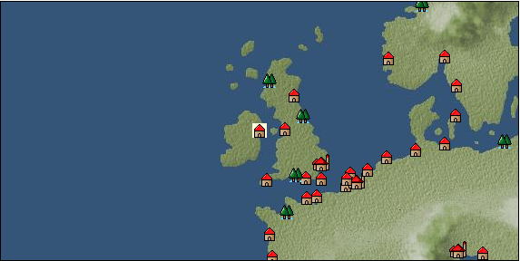

# Port: ダブリン

import Tabs from '@theme/Tabs';
import TabItem from '@theme/TabItem';

## General Information

| Attribute | Details |
| :--- | :--- |
| **Port Name** | dublin |
| **Port Type** | port of alliance |
| **Region** | northern europe |
| **Sea Area** | northern britain |
| **Required Language** | English |
| **Coordinates** | （16050，2278） |
| **Investment Reward** | [Alloy Refining Book](Items/Recipe Book/item_912.md) （必要投資額：300,000ドゥカード） |

### Available Facilities

| guild | intermediary | exchange | tool shop | workshop craftsman | Painter | sculptor | peddler |
| --- | --- | --- | --- | --- | --- | --- | --- |
|   |   | ○ | ○ | ○ |   |   |   |
| Shipyard Master | Lumbermaker | Sail-maker | weapon craftsman | master | TavernFemale | archive | salesperson |
| --- | --- | --- | --- | --- | --- | --- | --- |
|   |   |   | ○ |   |   |   |   |
| Shipwright | 銀行 | street worker | 王宮 | Trading post | church | suburbs | translator |
| --- | --- | --- | --- | --- | --- | --- | --- |
| ○ | ○ | ○ |   |   | ○ | ○ |   |

### Description
It is Ireland's largest city. The Vikings once built a fort, and later a castle. The name Dublin means "black puddle". In addition to processed pork products and whisky, the area also produces coal and graphite. *Celtic language is also spoken Suburbs: North Dublin → Boyne Valley Cultural area: British Isles

<Tabs>
  <TabItem value="trade_goods_sales" label="Trade Goods Sales">

| item | group | purchase price | 同盟時 | remarks |
| --- | --- | --- | --- | --- |
| [whiskey](Items/Trade Goods/TradeGoods-Alcohol/item_1.md) | [交易品（酒類）](Categories/category_9.md) | 630 | 552 |  |
| [glasswork](Items/Trade Goods/TradeGoods-Luxuries/item_60.md) | [Trading goods (artificial goods)](Categories/category_13.md) | 1,743 | 1,660 |  |
| 要投資（必要投資額：700,000） EO第４章で追加 |
| [sausage](Items/Trade Goods/TradeGoods-Foodstuffs/item_27.md) | [Trading items (food items)](Categories/category_3.md) | 369 | 324 |  |
| [knit](Items/Trade Goods/TradeGoods-Fabrics/item_164.md) | [交易品（織物）](Categories/category_20.md) | 488 | 456 |  |
| 要投資（必要投資額：240,000） |
| [bacon](Items/Trade Goods/TradeGoods-Foodstuffs/item_566.md) | [Trading items (food items)](Categories/category_3.md) | 370 | 324 |  |
| [lard](Items/Trade Goods/TradeGoods-Seasonings/item_43.md) | [交易品（調味料）](Categories/category_4.md) | 260 | 228 |  |
| [graphite](Items/Trade Goods/TradeGoods-Wares/item_25.md) | [交易品（工業品）](Categories/category_19.md) | 830 | 777 |  |
| 要投資（必要投資額：180,000） |
| [coal](Items/Trade Goods/TradeGoods-Wares/item_359.md) | [交易品（工業品）](Categories/category_19.md) | 474 | 416 |  |
| [pork](Items/Trade Goods/TradeGoods-Foodstuffs/item_41.md) | [Trading items (food items)](Categories/category_3.md) | (395) | 346 |  |
| [iron material](Items/Trade Goods/TradeGoods-Wares/item_268.md) | [交易品（工業品）](Categories/category_19.md) | 803 | 704 |  |
| 要投資（必要投資額：400,000） |
  </TabItem>
  <TabItem value="sale_specialty" label="Sale (Specialty)">

| item | group | sale price | 同盟時 | remarks |
| --- | --- | --- | --- | --- |

#### [交易品（繊維）](Categories/category_1.md)

| [numb](Items/Trade Goods/TradeGoods-Fibers/item_900.md) | 交易品（繊維） | 12 | (13) |  |

#### [Trading Goods (Dye)](Categories/category_2.md)

| [ward](Items/Trade Goods/TradeGoods-Dye/item_57.md) | Trading Goods (Dye) | 1,340 | (1,507) |  |

#### [交易品（調味料）](Categories/category_4.md)

| [maple syrup](Items/Trade Goods/TradeGoods-Seasonings/item_4028.md) | 交易品（調味料） | 4,148 | (4,666) |  |
| [Bean sauce](Items/Trade Goods/TradeGoods-Seasonings/item_3875.md) | 交易品（調味料） | (33,935) | 39,597 |  |

#### [交易品（雑貨）](Categories/category_5.md)

| [lantern](Items/Trade Goods/TradeGoods-Misc/item_3683.md) | 交易品（雑貨） | (53,134) | 62,000 |  |

#### [Trading products (medical products)](Categories/category_6.md)

| [Borei](Items/Trade Goods/TradeGoods-Medicine/item_3678.md) | Trading products (medical products) | (23,339) | 27,233 |  |
| [Nothing](Items/Trade Goods/TradeGoods-Medicine/item_1053.md) | Trading products (medical products) | 936 | (1,053) |  |
| [calamus](Items/Trade Goods/TradeGoods-Medicine/item_3427.md) | Trading products (medical products) | (45,079) | 52,600 |  |

#### [Trading Items (Iron Stone)](Categories/category_7.md)

| [white porcelain ore](Items/Trade Goods/TradeGoods-Minerals/item_3433.md) | Trading Items (Iron Stone) | (25,710) | 30,000 |  |

#### [交易品（酒類）](Categories/category_9.md)

| [sherry](Items/Trade Goods/TradeGoods-Alcohol/item_844.md) | 交易品（酒類） | (484) | 564 |  |
| [tequila](Items/Trade Goods/TradeGoods-Alcohol/item_108.md) | 交易品（酒類） | (4,583) | 5,347 |  |
| [Taiwan rice wine](Items/Trade Goods/TradeGoods-Alcohol/item_3672.md) | 交易品（酒類） | (44,370) | 51,773 |  |
| [紹興酒](Items/Trade Goods/TradeGoods-Alcohol/item_3882.md) | 交易品（酒類） | (44,398) | 51,806 |  |

#### [Trading goods (hobby goods)](Categories/category_10.md)

| [almond](Items/Trade Goods/TradeGoods-Sunddries/item_367.md) | Trading goods (hobby goods) | 218 | (245) |  |
| ●Iberian specialties |
| [cacao](Items/Trade Goods/TradeGoods-Sunddries/item_140.md) | Trading goods (hobby goods) | (1,426) | 1,663 |  |
| [tobacco](Items/Trade Goods/TradeGoods-Sunddries/item_109.md) | Trading goods (hobby goods) | (4,862) | 5,673 |  |
| [prune](Items/Trade Goods/TradeGoods-Sunddries/item_523.md) | Trading goods (hobby goods) | (464) | 541 |  |
| [black tea](Items/Trade Goods/TradeGoods-Sunddries/item_675.md) | Trading goods (hobby goods) | (8,085) | 9,433 |  |
| [raspberry](Items/Trade Goods/TradeGoods-Sunddries/item_5419.md) | Trading goods (hobby goods) | 9,440 | (10,621) |  |

#### [Trading Goods (Spices)](Categories/category_11.md)

| [jasmine](Items/Trade Goods/TradeGoods-Perfume/item_772.md) | Trading Goods (Spices) | 6,184 | (6,957) |  |
| [geranium](Items/Trade Goods/TradeGoods-Perfume/item_145.md) | Trading Goods (Spices) | 1,128 | (1,269) |  |
| [Tang Muxiang](Items/Trade Goods/TradeGoods-Perfume/item_593.md) | Trading Goods (Spices) | 1,810 | (2,036) |  |
| [sandalwood](Items/Trade Goods/TradeGoods-Perfume/item_771.md) | Trading Goods (Spices) | 64 | 7 |  |
| bvvCONRrnTkQVF |

#### [Trading Goods (Spices)](Categories/category_12.md)

| [cloves](Items/Trade Goods/TradeGoods-Spices/item_1092.md) | Trading Goods (Spices) | 11,838 | (13,319) |  |
| [pepper](Items/Trade Goods/TradeGoods-Spices/item_58.md) | Trading Goods (Spices) | (12,482) | 14,564 |  |
| [saffron](Items/Trade Goods/TradeGoods-Spices/item_845.md) | Trading Goods (Spices) | 2,340 | (2,632) |  |
| [cinnamon](Items/Trade Goods/TradeGoods-Spices/item_1432.md) | Trading Goods (Spices) | 5,030 | (5,659) |  |
| [nutmeg](Items/Trade Goods/TradeGoods-Spices/item_1969.md) | Trading Goods (Spices) | (20,551) | 23,980 |  |
| [mace](Items/Trade Goods/TradeGoods-Spices/item_2100.md) | Trading Goods (Spices) | 12,939 | (14,557) |  |

#### [Trading goods (artificial goods)](Categories/category_13.md)

| [glasswork](Items/Trade Goods/TradeGoods-Luxuries/item_60.md) | Trading goods (artificial goods) | 1,829 | (2,057) |  |
| 要投資（必要投資額：700,000） EO第４章で追加 |
| [Kuresute](Items/Trade Goods/TradeGoods-Luxuries/item_3897.md) | Trading goods (artificial goods) | (40,046) | 46,728 |  |

#### [交易品（美術品）](Categories/category_14.md)

| [taiwan wood carving](Items/Trade Goods/TradeGoods-Art/item_3697.md) | 交易品（美術品） | (45,645) | 53,261 |  |
| [oil painting](Items/Trade Goods/TradeGoods-Art/item_1088.md) | 交易品（美術品） | (2,134) | 2,490 |  |

#### [Trading Items (Gemstones)](Categories/category_15.md)

| [inca rose](Items/Trade Goods/TradeGoods-Gems/item_3014.md) | Trading Items (Gemstones) | 15,400 | (17,326) |  |
| [sapphire](Items/Trade Goods/TradeGoods-Gems/item_676.md) | Trading Items (Gemstones) | (12,513) | 14,600 |  |
| [diamond](Items/Trade Goods/TradeGoods-Gems/item_449.md) | Trading Items (Gemstones) | 8,600 | (9,675) |  |
| [pink diamond](Items/Trade Goods/TradeGoods-Gems/item_2874.md) | Trading Items (Gemstones) | 16,269 | (18,304) |  |
| [ruby](Items/Trade Goods/TradeGoods-Gems/item_773.md) | Trading Items (Gemstones) | 14,324 | 14,391 |  |
| [amethyst](Items/Trade Goods/TradeGoods-Gems/item_3434.md) | Trading Items (Gemstones) | (37,451) | 43,700 |  |

#### [Trading Items (Arms)](Categories/category_16.md)

| [crossbow](Items/Trade Goods/TradeGoods-Weapons/item_537.md) | Trading Items (Arms) | 1,282 | (1,442) |  |
| [damascus sword](Items/Trade Goods/TradeGoods-Weapons/item_903.md) | Trading Items (Arms) | 6,505 | (7,318) |  |
| [Japanese sword](Items/Trade Goods/TradeGoods-Weapons/item_3437.md) | Trading Items (Arms) | (45,247) | 52,796 |  |

#### [Trading Items (Firearms)](Categories/category_17.md)

| [musket gun](Items/Trade Goods/TradeGoods-Firearms/item_584.md) | Trading Items (Firearms) | 3,458 | 3,625 |  |
| [monocular gun](Items/Trade Goods/TradeGoods-Firearms/item_3916.md) | Trading Items (Firearms) | (24,579) | 28,680 |  |
| [銅手銃](Items/Trade Goods/TradeGoods-Firearms/item_3700.md) | Trading Items (Firearms) | (43,854) | 51,171 |  |

#### [交易品（工業品）](Categories/category_19.md)

| [rubber](Items/Trade Goods/TradeGoods-Wares/item_2819.md) | 交易品（工業品） | 1,712 | (1,926) |  |
| [marble](Items/Trade Goods/TradeGoods-Wares/item_52.md) | 交易品（工業品） | 2,026 | (2,279) |  |
| [羊皮紙](Items/Trade Goods/TradeGoods-Wares/item_53.md) | 交易品（工業品） | 1,590 | (1,788) |  |

#### [交易品（織物）](Categories/category_20.md)

| [Awaiyo](Items/Trade Goods/TradeGoods-Fabrics/item_3002.md) | 交易品（織物） | (9,051) | 10,561 |  |
| [turkish rug](Items/Trade Goods/TradeGoods-Fabrics/item_686.md) | 交易品（織物） | 6,891 | (7,753) |  |
| [Nishijin textile](Items/Trade Goods/TradeGoods-Fabrics/item_3431.md) | 交易品（織物） | (33,629) | 39,240 |  |
| [麻織物](Items/Trade Goods/TradeGoods-Fabrics/item_3673.md) | 交易品（織物） | (31,709) | 37,000 |  |
  </TabItem>
  <TabItem value="sale_no_specialty" label="Sale (No Specialty)">

| item | group | sale price | 同盟時 | remarks |
| --- | --- | --- | --- | --- |

#### [交易品（繊維）](Categories/category_1.md)

| [flax](Items/Trade Goods/TradeGoods-Fibers/item_64.md) | 交易品（繊維） | 235 | (264) |  |
| ▲Special products from neighboring cultural areas |
| [fur](Items/Trade Goods/TradeGoods-Fibers/item_634.md) | 交易品（繊維） | 1,363 | (1,533) |  |
| [wool](Items/Trade Goods/TradeGoods-Fibers/item_5.md) | 交易品（繊維） | 515 | (579) |  |

#### [Trading items (food items)](Categories/category_3.md)

| [olive](Items/Trade Goods/TradeGoods-Foodstuffs/item_47.md) | Trading items (food items) | 348 | (391) |  |
| [cheese](Items/Trade Goods/TradeGoods-Foodstuffs/item_20.md) | Trading items (food items) | 420 | (472) |  |
| [ham](Items/Trade Goods/TradeGoods-Foodstuffs/item_290.md) | Trading items (food items) | 426 | (479) |  |
| [sunfish](Items/Trade Goods/TradeGoods-Foodstuffs/item_878.md) | Trading items (food items) | (2,949) | 3,440 |  |
| [beef](Items/Trade Goods/TradeGoods-Foodstuffs/item_26.md) | Trading items (food items) | 637 | (716) |  |
| [mutton](Items/Trade Goods/TradeGoods-Foodstuffs/item_33.md) | Trading items (food items) | (445) | 519 |  |
| [魚肉](Items/Trade Goods/TradeGoods-Foodstuffs/item_10.md) | Trading items (food items) | 186 | (209) |  |
| [chicken meat](Items/Trade Goods/TradeGoods-Foodstuffs/item_29.md) | Trading items (food items) | (376) | 438 |  |

#### [交易品（調味料）](Categories/category_4.md)

| [almond oil](Items/Trade Goods/TradeGoods-Seasonings/item_578.md) | 交易品（調味料） | 737 | (829) |  |
| [olive oil](Items/Trade Goods/TradeGoods-Seasonings/item_48.md) | 交易品（調味料） | 393 | (442) |  |
| [butter](Items/Trade Goods/TradeGoods-Seasonings/item_3.md) | 交易品（調味料） | 350 | (393) |  |
| [apple cider vinegar](Items/Trade Goods/TradeGoods-Seasonings/item_882.md) | 交易品（調味料） | 428 | (481) |  |
| ▲Special products from neighboring cultural areas |
| [salt](Items/Trade Goods/TradeGoods-Seasonings/item_42.md) | 交易品（調味料） | 248 | (279) |  |

#### [交易品（雑貨）](Categories/category_5.md)

| [Western books](Items/Trade Goods/TradeGoods-Misc/item_293.md) | 交易品（雑貨） | 724 | (814) |  |

#### [Trading products (medical products)](Categories/category_6.md)

| [chamomile](Items/Trade Goods/TradeGoods-Medicine/item_292.md) | Trading products (medical products) | (314) | 366 |  |
| [belladonna](Items/Trade Goods/TradeGoods-Medicine/item_1056.md) | Trading products (medical products) | 525 | (590) |  |
| [lemon balm](Items/Trade Goods/TradeGoods-Medicine/item_127.md) | Trading products (medical products) | 420 | (472) |  |
| [rose hips](Items/Trade Goods/TradeGoods-Medicine/item_904.md) | Trading products (medical products) | 470 | (528) |  |

#### [Trading Items (Iron Stone)](Categories/category_7.md)

| [tin ore](Items/Trade Goods/TradeGoods-Minerals/item_23.md) | Trading Items (Iron Stone) | 542 | 551 |  |
| [lead ore](Items/Trade Goods/TradeGoods-Minerals/item_21.md) | Trading Items (Iron Stone) | 496 | 502 |  |
| [copper ore](Items/Trade Goods/TradeGoods-Minerals/item_65.md) | Trading Items (Iron Stone) | (759) | 885 |  |

#### [Trading products (precious metals)](Categories/category_8.md)

| [gold](Items/Trade Goods/TradeGoods-Metals/item_659.md) | Trading products (precious metals) | 8,423 | (9,476) |  |
| [silver](Items/Trade Goods/TradeGoods-Metals/item_136.md) | Trading products (precious metals) | 2,850 | (3,206) |  |

#### [交易品（酒類）](Categories/category_9.md)

| [aquavit](Items/Trade Goods/TradeGoods-Alcohol/item_572.md) | 交易品（酒類） | 595 | (669) |  |
| ▲Special products from neighboring cultural areas |
| [whiskey](Items/Trade Goods/TradeGoods-Alcohol/item_1.md) | 交易品（酒類） | 276 | (310) |  |
| [gin](Items/Trade Goods/TradeGoods-Alcohol/item_291.md) | 交易品（酒類） | 630 | (708) |  |
| [Beer](Items/Trade Goods/TradeGoods-Alcohol/item_2.md) | 交易品（酒類） | 293 | (329) |  |
| [fruit brandy](Items/Trade Goods/TradeGoods-Alcohol/item_1440.md) | 交易品（酒類） | 635 | (714) |  |
| [brandy](Items/Trade Goods/TradeGoods-Alcohol/item_9.md) | 交易品（酒類） | 826 | (929) |  |
| [rum](Items/Trade Goods/TradeGoods-Alcohol/item_139.md) | 交易品（酒類） | 700 | (787) |  |
| [liqueur](Items/Trade Goods/TradeGoods-Alcohol/item_18.md) | 交易品（酒類） | 659 | (741) |  |
| [wine](Items/Trade Goods/TradeGoods-Alcohol/item_11.md) | 交易品（酒類） | 530 | (596) |  |

#### [Trading goods (hobby goods)](Categories/category_10.md)

| [dried apple](Items/Trade Goods/TradeGoods-Sunddries/item_19.md) | Trading goods (hobby goods) | 365 | (410) |  |
| ▲Special products from neighboring cultural areas |

#### [Trading Goods (Spices)](Categories/category_11.md)

| [lavender](Items/Trade Goods/TradeGoods-Perfume/item_150.md) | Trading Goods (Spices) | (834) | 972 |  |
| [lira](Items/Trade Goods/TradeGoods-Perfume/item_30.md) | Trading Goods (Spices) | 735 | (826) |  |
| [Ryushu incense](Items/Trade Goods/TradeGoods-Perfume/item_101.md) | Trading Goods (Spices) | 3,846 | (4,327) |  |
| [Musk](Items/Trade Goods/TradeGoods-Perfume/item_158.md) | Trading Goods (Spices) | (4,374) | 5,103 |  |

#### [Trading Goods (Spices)](Categories/category_12.md)

| [cumin](Items/Trade Goods/TradeGoods-Spices/item_156.md) | Trading Goods (Spices) | (1,321) | 1,541 |  |
| [time](Items/Trade Goods/TradeGoods-Spices/item_432.md) | Trading Goods (Spices) | 542 | (609) |  |
| [basil](Items/Trade Goods/TradeGoods-Spices/item_126.md) | Trading Goods (Spices) | 208 | (234) |  |
| [mint](Items/Trade Goods/TradeGoods-Spices/item_816.md) | Trading Goods (Spices) | 202 | (227) |  |

#### [Trading goods (artificial goods)](Categories/category_13.md)

| [lapidary work](Items/Trade Goods/TradeGoods-Luxuries/item_153.md) | Trading goods (artificial goods) | 4,130 | (4,646) |  |
| [皮革製品](Items/Trade Goods/TradeGoods-Luxuries/item_12.md) | Trading goods (artificial goods) | 1,288 | (1,449) |  |
| [goldsmith](Items/Trade Goods/TradeGoods-Luxuries/item_687.md) | Trading goods (artificial goods) | 4,672 | (5,256) |  |
| [silversmith](Items/Trade Goods/TradeGoods-Luxuries/item_619.md) | Trading goods (artificial goods) | 3,309 | (3,722) |  |

#### [交易品（美術品）](Categories/category_14.md)

| [古美術品](Items/Trade Goods/TradeGoods-Art/item_51.md) | 交易品（美術品） | 5,620 | (6,323) |  |
| [青銅像](Items/Trade Goods/TradeGoods-Art/item_148.md) | 交易品（美術品） | 1,330 | (1,496) |  |

#### [Trading Items (Gemstones)](Categories/category_15.md)

| [coral](Items/Trade Goods/TradeGoods-Gems/item_141.md) | Trading Items (Gemstones) | 3,566 | (4,012) |  |
| [malachite](Items/Trade Goods/TradeGoods-Gems/item_679.md) | Trading Items (Gemstones) | (1,637) | 1,910 |  |
| [amber](Items/Trade Goods/TradeGoods-Gems/item_618.md) | Trading Items (Gemstones) | 2,267 | (2,550) |  |
| [pearl](Items/Trade Goods/TradeGoods-Gems/item_769.md) | Trading Items (Gemstones) | 10,319 | 11,887 |  |
| [ivory](Items/Trade Goods/TradeGoods-Gems/item_699.md) | Trading Items (Gemstones) | (3,548) | 4,139 |  |

#### [Trading Items (Arms)](Categories/category_16.md)

| [two-handed sword](Items/Trade Goods/TradeGoods-Weapons/item_24.md) | Trading Items (Arms) | 1,496 | 1,507 |  |
| [dagger](Items/Trade Goods/TradeGoods-Weapons/item_143.md) | Trading Items (Arms) | 978 | (1,100) |  |
| [western armor](Items/Trade Goods/TradeGoods-Weapons/item_6.md) | Trading Items (Arms) | 2,560 | (2,880) |  |

#### [Trading Items (Firearms)](Categories/category_17.md)

| [arquebus gun](Items/Trade Goods/TradeGoods-Firearms/item_14.md) | Trading Items (Firearms) | 2,082 | (2,342) |  |
| [大砲](Items/Trade Goods/TradeGoods-Firearms/item_4.md) | Trading Items (Firearms) | 3,377 | (3,799) |  |
| [cannonball](Items/Trade Goods/TradeGoods-Firearms/item_144.md) | Trading Items (Firearms) | 1,770 | (1,991) |  |

#### [Trading Goods (Livestock)](Categories/category_18.md)

| [cow](Items/Trade Goods/TradeGoods-Livestock/item_17.md) | Trading Goods (Livestock) | 341 | (383) |  |
| [chicken](Items/Trade Goods/TradeGoods-Livestock/item_252.md) | Trading Goods (Livestock) | 54 | (60) |  |

#### [交易品（工業品）](Categories/category_19.md)

| [log](Items/Trade Goods/TradeGoods-Wares/item_846.md) | 交易品（工業品） | 132 | (148) |  |
| [vegetable oil](Items/Trade Goods/TradeGoods-Wares/item_842.md) | 交易品（工業品） | (83) | 96 |  |
| [水銀](Items/Trade Goods/TradeGoods-Wares/item_15.md) | 交易品（工業品） | 1,276 | (1,435) |  |
| [graphite](Items/Trade Goods/TradeGoods-Wares/item_25.md) | 交易品（工業品） | 388 | (436) |  |
| 要投資（必要投資額：180,000） |
| [sulfur](Items/Trade Goods/TradeGoods-Wares/item_66.md) | 交易品（工業品） | 437 | (491) |  |
| [鉛](Items/Trade Goods/TradeGoods-Wares/item_895.md) | 交易品（工業品） | (552) | 643 |  |
| [青銅](Items/Trade Goods/TradeGoods-Wares/item_7.md) | 交易品（工業品） | 1,031 | 1,041 |  |

#### [交易品（織物）](Categories/category_20.md)

| [dutch calico](Items/Trade Goods/TradeGoods-Fabrics/item_1435.md) | 交易品（織物） | 943 | (1,060) |  |
| [damask](Items/Trade Goods/TradeGoods-Fabrics/item_614.md) | 交易品（織物） | 5,922 | (6,662) |  |
| [knit](Items/Trade Goods/TradeGoods-Fabrics/item_164.md) | 交易品（織物） | 228 | (256) |  |
| 要投資（必要投資額：240,000） |
| [race](Items/Trade Goods/TradeGoods-Fabrics/item_59.md) | 交易品（織物） | 2,025 | (2,278) |  |
  </TabItem>
  <TabItem value="guild_&_others" label="Guild & Others">

| item | group | Sales price | Handling NPC | remarks |
| --- | --- | --- | --- | --- |

#### others

| [Folklore alchemy part 2](Items/Recipe Book/item_2149.md) | [recipe book](Categories/category_22.md) | Fixed recipe |  |  |
| Owned by a drug dealer's daughter |
| [Thief style gloves sewing method](Items/Recipe Book/item_4508.md) | [recipe book](Categories/category_22.md) | Fixed recipe |  |  |
| 15th century 2nd and 5th period gatekeeper |
  </TabItem>
  <TabItem value="toolman" label="Toolman">

| item | group | Sales price | Handling NPC | remarks |
| --- | --- | --- | --- | --- |

#### [recipe book](Categories/category_22.md)

| [Master the pie](Items/Recipe Book/item_1075.md) | recipe book | 20,000 | tool shop owner |  |
| 要投資（必要投資額：180,000） |
| [Mode Design Collection Volume 1](Items/Recipe Book/item_92.md) | recipe book | 10,000 | tool shop owner |  |
| [Sword training/application](Items/Recipe Book/item_589.md) | recipe book | 50,000 | tool shop owner |  |
| [Textile secrets/fabric book](Items/Recipe Book/item_91.md) | recipe book | 10,000 | tool shop owner |  |
| [Book of ore smelting](Items/Recipe Book/item_1085.md) | recipe book | 8,000 | tool shop owner |  |

#### [Equipment (head)](Categories/category_23.md)

| [puritan hat with feathers](Items/Equipment/Equipment-Head/item_1397.md) | Equipment (head) | 36,700 | tool shop owner |  |
| 要投資（必要投資額：180,000） |

#### [Equipment (body)](Categories/category_24.md)

| [gilet](Items/Equipment/Equipment-Body/item_78.md) | Equipment (body) | 27,500 | tool shop owner |  |
| [buccaneer vest](Items/Equipment/Equipment-Body/item_77.md) | Equipment (body) | 11,800 | tool shop owner |  |
| [breast plate](Items/Equipment/Equipment-Body/item_609.md) | Equipment (body) | 104,000 | tool shop owner |  |
| 要投資（必要投資額：300,000） |

#### [Consumables (land battle/deck battle)](Categories/category_29.md)

| [black kite feather](Items/Consumables/Consumables-Landbattle/item_88.md) | Consumables (land battle/deck battle) | 100 | tool shop owner |  |
| [Assortment of wound medicine](Items/Consumables/Consumables-Landbattle/item_90.md) | Consumables (land battle/deck battle) | 500 | tool shop owner |  |
| [therapeutic drug](Items/Consumables/Consumables-Landbattle/item_89.md) | Consumables (land battle/deck battle) | 300 | tool shop owner |  |
| [antidote](Items/Consumables/Consumables-Landbattle/item_270.md) | Consumables (land battle/deck battle) | 100 | tool shop owner |  |

#### [Consumables (skill activation)](Categories/category_31.md)

| [fishing gear](Items/Consumables/Consumables-Skill/item_79.md) | Consumables (skill activation) | 2,500 | tool shop owner |  |

#### [Consumables (request documents)](Categories/category_45.md)

| [Seasoning purchase order form](Items/Consumables/Consumables-Documents/item_4777.md) | Consumables (request documents) | 20,000 | tool shop owner |  |
  </TabItem>
  <TabItem value="kobo_craftsmen" label="Craftsman">

| item | group | Sales price | Handling NPC | remarks |
| --- | --- | --- | --- | --- |

#### [recipe book](Categories/category_22.md)

| [特殊兵装縫製法](Items/Recipe Book/item_1356.md) | recipe book | 50,000 | workshop craftsman |  |
| 要投資（必要投資額：180,000） |
| [Shipwright Introduction/Craft Book](Items/Recipe Book/item_75.md) | recipe book | 10,000 | workshop craftsman |  |
| [Shipwright Introduction/Sewing Book](Items/Recipe Book/item_74.md) | recipe book | 10,000 | workshop craftsman |  |
| [Shipwright Introduction/Casting Book](Items/Recipe Book/item_76.md) | recipe book | 10,000 | workshop craftsman |  |

#### [Consumables (skill activation)](Categories/category_31.md)

| [四分儀](Items/Consumables/Consumables-Skill/item_346.md) | Consumables (skill activation) | 500 | workshop craftsman |  |
| [simple salvage rope](Items/Consumables/Consumables-Skill/item_2294.md) | Consumables (skill activation) | 500 | workshop craftsman |  |
| [Simple towing auxiliary rope](Items/Consumables/Consumables-Skill/item_2295.md) | Consumables (skill activation) | 500 | workshop craftsman |  |

#### [shipbuilding materials](Categories/category_47.md)

| [General purpose small square sail](Items/Shipbuilding FS Material/item_3446.md) | shipbuilding materials | 30,000 | workshop craftsman |  |
| 要投資（必要投資額：320,000） |
| [General purpose small Latin sail](Items/Shipbuilding FS Material/item_3445.md) | shipbuilding materials | 30,000 | workshop craftsman |  |
| 要投資（必要投資額：320,000） |
| [General-purpose small oar](Items/Shipbuilding FS Material/item_3521.md) | shipbuilding materials | 50,000 | workshop craftsman |  |
| 要投資（必要投資額：720,000） |
| [General-purpose small reinforcement board](Items/Shipbuilding FS Material/item_3527.md) | shipbuilding materials | 50,000 | workshop craftsman |  |
| 要投資（必要投資額：720,000） |
| [General-purpose small expansion warehouse](Items/Shipbuilding FS Material/item_3524.md) | shipbuilding materials | 80,000 | workshop craftsman |  |
| 要投資（必要投資額：720,000） |
| [General-purpose small expansion cabin](Items/Shipbuilding FS Material/item_3523.md) | shipbuilding materials | 80,000 | workshop craftsman |  |
| 要投資（必要投資額：680,000） |
| [General-purpose small improved rudder](Items/Shipbuilding FS Material/item_3522.md) | shipbuilding materials | 80,000 | workshop craftsman |  |
| 要投資（必要投資額：680,000） |
| [General-purpose small paddle boat](Items/Shipbuilding FS Material/item_3444.md) | shipbuilding materials | 100,000 | workshop craftsman |  |
| 要投資（必要投資額：720,000） |
| [General-purpose small anti-swaying water tank](Items/Shipbuilding FS Material/item_3525.md) | shipbuilding materials | 80,000 | workshop craftsman |  |
| 要投資（必要投資額：680,000） |
| [General-purpose small gun port](Items/Shipbuilding FS Material/item_3447.md) | shipbuilding materials | 30,000 | workshop craftsman |  |
| 要投資（必要投資額：300,000） |
| [General-purpose small hull](Items/Shipbuilding FS Material/item_3443.md) | shipbuilding materials | 100,000 | workshop craftsman |  |
| 要投資（必要投資額：300,000） |
| [General-purpose small armor plate](Items/Shipbuilding FS Material/item_3526.md) | shipbuilding materials | 50,000 | workshop craftsman |  |
| 要投資（必要投資額：720,000） |
  </TabItem>
  <TabItem value="shipyard" label="Shipyard">

### Shipwright

| item | group | Sales price | Handling NPC | remarks |
| --- | --- | --- | --- | --- |

#### [recipe book](Categories/category_22.md)

| [Iron cladding manufacturing method](Items/Recipe Book/item_3570.md) | recipe book | Fixed recipe | Shipwright |  |
| 要投資（必要投資額：1,000,000） |

#### [shipbuilding materials](Categories/category_47.md)

| [iron cladding](Items/Shipbuilding FS Material/item_3502.md) | shipbuilding materials | Fixed recipe | Shipwright |  |
| 要投資（必要投資額：1,000,000） |
| [copper cladding](Items/Shipbuilding FS Material/item_3545.md) | shipbuilding materials | Fixed recipe | Shipwright |  |
| 要投資（必要投資額：1,000,000） |
  </TabItem>
</Tabs>