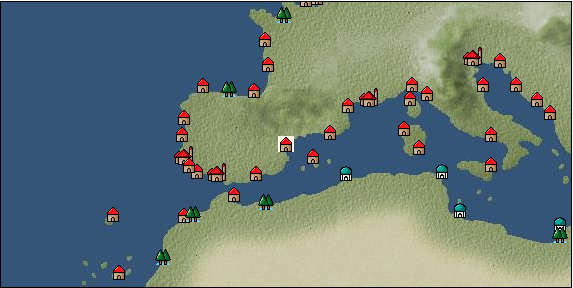

# Port: バレンシア

import Tabs from '@theme/Tabs';
import TabItem from '@theme/TabItem';

## General Information

| Attribute | Details |
| :--- | :--- |
| **Port Name** | valencia |
| **Port Type** | 領地 |
| **Region** | western europe |
| **Sea Area** | Off the Balearic Islands |
| **Required Language** | spanish |
| **Coordinates** | （16179，3159） |
| **Investment Reward** |  |

### Available Facilities

| guild | intermediary | exchange | tool shop | workshop craftsman | Painter | sculptor | peddler |
| --- | --- | --- | --- | --- | --- | --- | --- |
|   |   | ○ | ○ | ○ |   |   | ○ |
| Shipyard Master | Lumbermaker | Sail-maker | weapon craftsman | master | TavernFemale | archive | salesperson |
| --- | --- | --- | --- | --- | --- | --- | --- |
| ○ |   | ○ |   | ○ |   |   |   |
| Shipwright | 銀行 | street worker | 王宮 | Trading post | church | suburbs | translator |
| --- | --- | --- | --- | --- | --- | --- | --- |
| ○ | ○ | ○ |   |   | ○ |   |   |

### Description
A city that has flourished since ancient Roman times. Because there was a time when it was ruled by Islamic forces, Islamic culture and European culture coexist. In addition to abundant agricultural products, cinnabar can be obtained from nearby mines. Cultural area: Iberia

<Tabs>
  <TabItem value="trade_goods_sales" label="Trade Goods Sales">

| item | group | purchase price | 同盟時 | remarks |
| --- | --- | --- | --- | --- |
| [duck meat](Items/Trade Goods/TradeGoods-Foodstuffs/item_32.md) | [Trading items (food items)](Categories/category_3.md) | 306 | 268 |  |
| [almond](Items/Trade Goods/TradeGoods-Sunddries/item_367.md) | [Trading goods (hobby goods)](Categories/category_10.md) | 142 | 124 |  |
| [olive](Items/Trade Goods/TradeGoods-Foodstuffs/item_47.md) | [Trading items (food items)](Categories/category_3.md) | 256 | 224 |  |
| When in alliance: confirmed at 100% |
| [cuenca tiles](Items/Trade Goods/TradeGoods-Luxuries/item_4279.md) | [Trading goods (artificial goods)](Categories/category_13.md) | 1,347 | (1,179) |  |
| 時代限定（15世紀第4期） |
| [jam](Items/Trade Goods/TradeGoods-Seasonings/item_427.md) | [交易品（調味料）](Categories/category_4.md) | 520 | 456 |  |
| [rosemary](Items/Trade Goods/TradeGoods-Spices/item_428.md) | [Trading Goods (Spices)](Categories/category_12.md) | 306 | 268 |  |
| When in alliance: confirmed at 100% |
| [wheat](Items/Trade Goods/TradeGoods-Foodstuffs/item_16.md) | [Trading items (food items)](Categories/category_3.md) | 45 | 40 |  |
| [raisins](Items/Trade Goods/TradeGoods-Sunddries/item_35.md) | [Trading goods (hobby goods)](Categories/category_10.md) | (237) | 208 |  |
| 要投資（必要投資額：120,000） |
| [wool](Items/Trade Goods/TradeGoods-Fibers/item_5.md) | [交易品（繊維）](Categories/category_1.md) | 370 | 324 |  |
| [cinnabar](Items/Trade Goods/TradeGoods-Minerals/item_154.md) | [Trading Items (Iron Stone)](Categories/category_7.md) | 830 | 728 |  |
  </TabItem>
  <TabItem value="sale_specialty" label="Sale (Specialty)">

| item | group | sale price | 同盟時 | remarks |
| --- | --- | --- | --- | --- |

#### [交易品（繊維）](Categories/category_1.md)

| [feather](Items/Trade Goods/TradeGoods-Fibers/item_585.md) | 交易品（繊維） | 745 | (838) |  |
| [Green ramie](Items/Trade Goods/TradeGoods-Fibers/item_3428.md) | 交易品（繊維） | (32,468) | 37,885 |  |
| [deerskin](Items/Trade Goods/TradeGoods-Fibers/item_3648.md) | 交易品（繊維） | (43,285) | 50,507 |  |

#### [Trading Goods (Dye)](Categories/category_2.md)

| [Indian indigo](Items/Trade Goods/TradeGoods-Dye/item_157.md) | Trading Goods (Dye) | 1,204 | (1,354) |  |
| [cochineal](Items/Trade Goods/TradeGoods-Dye/item_1817.md) | Trading Goods (Dye) | (1,372) | 1,600 |  |
| [Safflower](Items/Trade Goods/TradeGoods-Dye/item_1059.md) | Trading Goods (Dye) | 707 | (795) |  |
| [mayan blue](Items/Trade Goods/TradeGoods-Dye/item_1096.md) | Trading Goods (Dye) | (1,413) | 1,648 |  |

#### [Trading items (food items)](Categories/category_3.md)

| [taro](Items/Trade Goods/TradeGoods-Foodstuffs/item_1960.md) | Trading items (food items) | (222) | 258 |  |

#### [交易品（調味料）](Categories/category_4.md)

| [apple cider vinegar](Items/Trade Goods/TradeGoods-Seasonings/item_882.md) | 交易品（調味料） | 428 | (481) |  |

#### [Trading products (medical products)](Categories/category_6.md)

| [Nothing](Items/Trade Goods/TradeGoods-Medicine/item_1053.md) | Trading products (medical products) | 781 | (878) |  |

#### [Trading products (precious metals)](Categories/category_8.md)

| [platinum](Items/Trade Goods/TradeGoods-Metals/item_2178.md) | Trading products (precious metals) | 8,363 | (9,409) |  |

#### [交易品（酒類）](Categories/category_9.md)

| [aquavit](Items/Trade Goods/TradeGoods-Alcohol/item_572.md) | 交易品（酒類） | (672) | 783 |  |
| [whiskey](Items/Trade Goods/TradeGoods-Alcohol/item_1.md) | 交易品（酒類） | 887 | 904 |  |
| [gin](Items/Trade Goods/TradeGoods-Alcohol/item_291.md) | 交易品（酒類） | 790 | (888) |  |
| [tequila](Items/Trade Goods/TradeGoods-Alcohol/item_108.md) | 交易品（酒類） | (1,840) | 2,146 |  |

#### [Trading goods (hobby goods)](Categories/category_10.md)

| [cacao](Items/Trade Goods/TradeGoods-Sunddries/item_140.md) | Trading goods (hobby goods) | (1,348) | 1,572 |  |
| [tobacco](Items/Trade Goods/TradeGoods-Sunddries/item_109.md) | Trading goods (hobby goods) | (1,291) | 1,506 |  |
| [eggplant](Items/Trade Goods/TradeGoods-Sunddries/item_3426.md) | Trading goods (hobby goods) | (23,654) | 27,600 |  |
| [pineapple](Items/Trade Goods/TradeGoods-Sunddries/item_867.md) | Trading goods (hobby goods) | (2,104) | 2,455 |  |
| [peanuts](Items/Trade Goods/TradeGoods-Sunddries/item_134.md) | Trading goods (hobby goods) | (379) | 442 |  |
| [dried figs](Items/Trade Goods/TradeGoods-Sunddries/item_611.md) | Trading goods (hobby goods) | 385 | (433) |  |
| [raspberry](Items/Trade Goods/TradeGoods-Sunddries/item_5419.md) | Trading goods (hobby goods) | (9,256) | 10,800 |  |
| [金針花](Items/Trade Goods/TradeGoods-Sunddries/item_3739.md) | Trading goods (hobby goods) | (9,470) | 11,050 |  |

#### [Trading Goods (Spices)](Categories/category_11.md)

| [oakmoss](Items/Trade Goods/TradeGoods-Perfume/item_819.md) | Trading Goods (Spices) | 1,029 | (1,157) |  |
| [jasmine](Items/Trade Goods/TradeGoods-Perfume/item_772.md) | Trading Goods (Spices) | 7,736 | (8,703) |  |
| [daffodil](Items/Trade Goods/TradeGoods-Perfume/item_612.md) | Trading Goods (Spices) | 1,000 | (1,125) |  |
| [lily of the valley](Items/Trade Goods/TradeGoods-Perfume/item_358.md) | Trading Goods (Spices) | 1,362 | (1,532) |  |
| [geranium](Items/Trade Goods/TradeGoods-Perfume/item_145.md) | Trading Goods (Spices) | 1,100 | (1,237) |  |
| [sandalwood](Items/Trade Goods/TradeGoods-Perfume/item_771.md) | Trading Goods (Spices) | 3,820 | (4,297) |  |

#### [Trading Goods (Spices)](Categories/category_12.md)

| [allspice](Items/Trade Goods/TradeGoods-Spices/item_1848.md) | Trading Goods (Spices) | (1,559) | 1,819 |  |
| [cloves](Items/Trade Goods/TradeGoods-Spices/item_1092.md) | Trading Goods (Spices) | (11,570) | 13,500 |  |
| [pepper](Items/Trade Goods/TradeGoods-Spices/item_58.md) | Trading Goods (Spices) | 5,190 | (5,839) |  |
| [nutmeg](Items/Trade Goods/TradeGoods-Spices/item_1969.md) | Trading Goods (Spices) | (12,244) | 14,286 |  |
| [mace](Items/Trade Goods/TradeGoods-Spices/item_2100.md) | Trading Goods (Spices) | (12,742) | 14,868 |  |
| [Grapefruit](Items/Trade Goods/TradeGoods-Spices/item_3422.md) | Trading Goods (Spices) | (34,363) | 40,096 |  |

#### [Trading goods (artificial goods)](Categories/category_13.md)

| [Tumbaga](Items/Trade Goods/TradeGoods-Luxuries/item_3028.md) | Trading goods (artificial goods) | (18,106) | 21,127 |  |
| [湖筆](Items/Trade Goods/TradeGoods-Luxuries/item_3898.md) | Trading goods (artificial goods) | 38,100 | 44,200 |  |
| ※There is patience |
| [Saori](Items/Trade Goods/TradeGoods-Luxuries/item_3676.md) | Trading goods (artificial goods) | 52,223 | (58,756) |  |

#### [Trading Items (Gemstones)](Categories/category_15.md)

| [aventurine](Items/Trade Goods/TradeGoods-Gems/item_678.md) | Trading Items (Gemstones) | 4,620 | (5,198) |  |
| [opal](Items/Trade Goods/TradeGoods-Gems/item_2006.md) | Trading Items (Gemstones) | (5,676) | 6,623 |  |
| [sapphire](Items/Trade Goods/TradeGoods-Gems/item_676.md) | Trading Items (Gemstones) | 10,000 | (11,251) |  |
| [topaz](Items/Trade Goods/TradeGoods-Gems/item_1097.md) | Trading Items (Gemstones) | (4,003) | 4,670 |  |
| [pink diamond](Items/Trade Goods/TradeGoods-Gems/item_2874.md) | Trading Items (Gemstones) | 12,823 | 14,300 |  |
| When in alliance: confirmed at 100% |
| [ruby](Items/Trade Goods/TradeGoods-Gems/item_773.md) | Trading Items (Gemstones) | (10,492) | 12,242 |  |
| [amber](Items/Trade Goods/TradeGoods-Gems/item_618.md) | Trading Items (Gemstones) | (3,517) | 4,103 |  |

#### [Trading Items (Arms)](Categories/category_16.md)

| [crossbow](Items/Trade Goods/TradeGoods-Weapons/item_537.md) | Trading Items (Arms) | 1,050 | 1,070 |  |

#### [Trading Items (Firearms)](Categories/category_17.md)

| [tanegashima gun](Items/Trade Goods/TradeGoods-Firearms/item_3423.md) | Trading Items (Firearms) | 33,266 | (37,427) |  |

#### [Trading Goods (Livestock)](Categories/category_18.md)

| [boar](Items/Trade Goods/TradeGoods-Livestock/item_3476.md) | Trading Goods (Livestock) | 23,700 | (26,665) |  |

#### [交易品（工業品）](Categories/category_19.md)

| [papyrus](Items/Trade Goods/TradeGoods-Wares/item_616.md) | 交易品（工業品） | (459) | 535 |  |
| [Japanese paper](Items/Trade Goods/TradeGoods-Wares/item_3438.md) | 交易品（工業品） | (33,852) | 39,500 |  |

#### [交易品（織物）](Categories/category_20.md)

| [Awaiyo](Items/Trade Goods/TradeGoods-Fabrics/item_3002.md) | 交易品（織物） | (7,918) | 9,239 |  |
| [dutch calico](Items/Trade Goods/TradeGoods-Fabrics/item_1435.md) | 交易品（織物） | 1,187 | (1,335) |  |
| [flannel](Items/Trade Goods/TradeGoods-Fabrics/item_149.md) | 交易品（織物） | 1,511 | 1,600 |  |
| [persian rug](Items/Trade Goods/TradeGoods-Fabrics/item_606.md) | 交易品（織物） | 8,103 | (9,116) |  |
  </TabItem>
  <TabItem value="sale_no_specialty" label="Sale (No Specialty)">

| item | group | sale price | 同盟時 | remarks |
| --- | --- | --- | --- | --- |

#### [交易品（繊維）](Categories/category_1.md)

| [camel hair](Items/Trade Goods/TradeGoods-Fibers/item_577.md) | 交易品（繊維） | 479 | (538) |  |
| [raw silk](Items/Trade Goods/TradeGoods-Fibers/item_677.md) | 交易品（繊維） | (2,260) | 2,637 |  |

#### [Trading Goods (Dye)](Categories/category_2.md)

| [ward](Items/Trade Goods/TradeGoods-Dye/item_57.md) | Trading Goods (Dye) | 1,100 | 1,109 |  |
| [貝紫](Items/Trade Goods/TradeGoods-Dye/item_110.md) | Trading Goods (Dye) | 4,261 | (4,794) |  |

#### [Trading items (food items)](Categories/category_3.md)

| [duck meat](Items/Trade Goods/TradeGoods-Foodstuffs/item_32.md) | Trading items (food items) | 134 | (150) |  |
| [sardine](Items/Trade Goods/TradeGoods-Foodstuffs/item_39.md) | Trading items (food items) | 16 | (18) |  |
| [olive](Items/Trade Goods/TradeGoods-Foodstuffs/item_47.md) | Trading items (food items) | 112 | (126) |  |
| When in alliance: confirmed at 100% |
| [cheese](Items/Trade Goods/TradeGoods-Foodstuffs/item_20.md) | Trading items (food items) | (352) | 410 |  |
| [wheat](Items/Trade Goods/TradeGoods-Foodstuffs/item_16.md) | Trading items (food items) | 20 | (22) |  |
| [flour](Items/Trade Goods/TradeGoods-Foodstuffs/item_605.md) | Trading items (food items) | 56 | (63) |  |
| [Paddy rice](Items/Trade Goods/TradeGoods-Foodstuffs/item_654.md) | Trading items (food items) | (93) | 108 |  |
| [beef](Items/Trade Goods/TradeGoods-Foodstuffs/item_26.md) | Trading items (food items) | 643 | (723) |  |
| [mutton](Items/Trade Goods/TradeGoods-Foodstuffs/item_33.md) | Trading items (food items) | 456 | (513) |  |
| [魚肉](Items/Trade Goods/TradeGoods-Foodstuffs/item_10.md) | Trading items (food items) | (156) | 182 |  |
| [chicken meat](Items/Trade Goods/TradeGoods-Foodstuffs/item_29.md) | Trading items (food items) | (324) | 377 |  |

#### [交易品（調味料）](Categories/category_4.md)

| [almond oil](Items/Trade Goods/TradeGoods-Seasonings/item_578.md) | 交易品（調味料） | 659 | 672 |  |
| When in alliance: confirmed at 100% |
| [olive oil](Items/Trade Goods/TradeGoods-Seasonings/item_48.md) | 交易品（調味料） | 379 | 408 |  |
| [jam](Items/Trade Goods/TradeGoods-Seasonings/item_427.md) | 交易品（調味料） | 228 | (256) |  |
| [wine vinegar](Items/Trade Goods/TradeGoods-Seasonings/item_429.md) | 交易品（調味料） | (497) | 579 |  |
| [salt](Items/Trade Goods/TradeGoods-Seasonings/item_42.md) | 交易品（調味料） | 250 | 267 |  |
| [sugar](Items/Trade Goods/TradeGoods-Seasonings/item_94.md) | 交易品（調味料） | 933 | (1,049) |  |
| [Honey](Items/Trade Goods/TradeGoods-Seasonings/item_49.md) | 交易品（調味料） | (869) | 1,014 |  |

#### [Trading products (medical products)](Categories/category_6.md)

| [rose hips](Items/Trade Goods/TradeGoods-Medicine/item_904.md) | Trading products (medical products) | (402) | 469 |  |

#### [Trading Items (Iron Stone)](Categories/category_7.md)

| [Saltpeter](Items/Trade Goods/TradeGoods-Minerals/item_884.md) | Trading Items (Iron Stone) | (1,803) | 2,103 |  |
| [lead ore](Items/Trade Goods/TradeGoods-Minerals/item_21.md) | Trading Items (Iron Stone) | (438) | 510 |  |

#### [Trading products (precious metals)](Categories/category_8.md)

| [gold dust](Items/Trade Goods/TradeGoods-Metals/item_111.md) | Trading products (precious metals) | (3,923) | 4,577 |  |
| [gold](Items/Trade Goods/TradeGoods-Metals/item_659.md) | Trading products (precious metals) | (7,424) | 8,662 |  |
| [silver](Items/Trade Goods/TradeGoods-Metals/item_136.md) | Trading products (precious metals) | (2,532) | 2,954 |  |

#### [交易品（酒類）](Categories/category_9.md)

| [sherry](Items/Trade Goods/TradeGoods-Alcohol/item_844.md) | 交易品（酒類） | (389) | 453 |  |
| [Beer](Items/Trade Goods/TradeGoods-Alcohol/item_2.md) | 交易品（酒類） | 374 | (420) |  |
| [brandy](Items/Trade Goods/TradeGoods-Alcohol/item_9.md) | 交易品（酒類） | 761 | 761 |  |
| [rum](Items/Trade Goods/TradeGoods-Alcohol/item_139.md) | 交易品（酒類） | (642) | 749 |  |
| [liqueur](Items/Trade Goods/TradeGoods-Alcohol/item_18.md) | 交易品（酒類） | (552) | 643 |  |
| [wine](Items/Trade Goods/TradeGoods-Alcohol/item_11.md) | 交易品（酒類） | 496 | 519 |  |

#### [Trading goods (hobby goods)](Categories/category_10.md)

| [almond](Items/Trade Goods/TradeGoods-Sunddries/item_367.md) | Trading goods (hobby goods) | 62 | (69) |  |
| [walnut](Items/Trade Goods/TradeGoods-Sunddries/item_522.md) | Trading goods (hobby goods) | (449) | 523 |  |
| [prune](Items/Trade Goods/TradeGoods-Sunddries/item_523.md) | Trading goods (hobby goods) | 412 | 420 |  |
| [Yerba mate tea](Items/Trade Goods/TradeGoods-Sunddries/item_1808.md) | Trading goods (hobby goods) | (376) | 438 |  |
| [dried apple](Items/Trade Goods/TradeGoods-Sunddries/item_19.md) | Trading goods (hobby goods) | 372 | (418) |  |

#### [Trading Goods (Spices)](Categories/category_12.md)

| [oregano](Items/Trade Goods/TradeGoods-Spices/item_430.md) | Trading Goods (Spices) | 506 | (569) |  |
| [Sesame](Items/Trade Goods/TradeGoods-Spices/item_437.md) | Trading Goods (Spices) | 324 | (364) |  |
| [celery](Items/Trade Goods/TradeGoods-Spices/item_431.md) | Trading Goods (Spices) | 138 | (155) |  |
| [time](Items/Trade Goods/TradeGoods-Spices/item_432.md) | Trading Goods (Spices) | 398 | (447) |  |
| [parsley](Items/Trade Goods/TradeGoods-Spices/item_46.md) | Trading Goods (Spices) | 150 | (168) |  |

#### [Trading goods (artificial goods)](Categories/category_13.md)

| [embroidery thread](Items/Trade Goods/TradeGoods-Luxuries/item_898.md) | Trading goods (artificial goods) | 2,053 | (2,309) |  |
| [glasswork](Items/Trade Goods/TradeGoods-Luxuries/item_60.md) | Trading goods (artificial goods) | (1,460) | 1,703 |  |
| [coral work](Items/Trade Goods/TradeGoods-Luxuries/item_595.md) | Trading goods (artificial goods) | (2,594) | 3,026 |  |
| [lapidary work](Items/Trade Goods/TradeGoods-Luxuries/item_153.md) | Trading goods (artificial goods) | 4,191 | (4,715) |  |
| [皮革製品](Items/Trade Goods/TradeGoods-Luxuries/item_12.md) | Trading goods (artificial goods) | 1,180 | 1,184 |  |
| [goldsmith](Items/Trade Goods/TradeGoods-Luxuries/item_687.md) | Trading goods (artificial goods) | (2,966) | 3,460 |  |
| When in alliance: confirmed at 100% |
| [ceramics](Items/Trade Goods/TradeGoods-Luxuries/item_152.md) | Trading goods (artificial goods) | 1,429 | (1,607) |  |

#### [交易品（美術品）](Categories/category_14.md)

| [marble statue](Items/Trade Goods/TradeGoods-Art/item_50.md) | 交易品（美術品） | 3,054 | (3,436) |  |
| [wooden statue](Items/Trade Goods/TradeGoods-Art/item_95.md) | 交易品（美術品） | 1,293 | (1,454) |  |
| [青銅像](Items/Trade Goods/TradeGoods-Art/item_148.md) | 交易品（美術品） | (977) | 1,140 |  |

#### [Trading Items (Gemstones)](Categories/category_15.md)

| [Agate](Items/Trade Goods/TradeGoods-Gems/item_107.md) | Trading Items (Gemstones) | (4,632) | 5,404 |  |
| [garnet](Items/Trade Goods/TradeGoods-Gems/item_1005.md) | Trading Items (Gemstones) | 3,687 | (4,148) |  |
| [coral](Items/Trade Goods/TradeGoods-Gems/item_141.md) | Trading Items (Gemstones) | (2,516) | 2,935 |  |
| [crystal](Items/Trade Goods/TradeGoods-Gems/item_893.md) | Trading Items (Gemstones) | 1,463 | (1,646) |  |
| [pearl](Items/Trade Goods/TradeGoods-Gems/item_769.md) | Trading Items (Gemstones) | (7,647) | 8,922 |  |
| [ivory](Items/Trade Goods/TradeGoods-Gems/item_699.md) | Trading Items (Gemstones) | 2,430 | (2,734) |  |

#### [Trading Items (Arms)](Categories/category_16.md)

| [two-handed sword](Items/Trade Goods/TradeGoods-Weapons/item_24.md) | Trading Items (Arms) | (1,493) | 1,742 |  |
| [scimitar](Items/Trade Goods/TradeGoods-Weapons/item_142.md) | Trading Items (Arms) | 1,045 | (1,175) |  |
| [one handed sword](Items/Trade Goods/TradeGoods-Weapons/item_433.md) | Trading Items (Arms) | 1,041 | (1,171) |  |
| [western armor](Items/Trade Goods/TradeGoods-Weapons/item_6.md) | Trading Items (Arms) | 2,740 | (3,082) |  |

#### [Trading Items (Firearms)](Categories/category_17.md)

| [arquebus gun](Items/Trade Goods/TradeGoods-Firearms/item_14.md) | Trading Items (Firearms) | (1,575) | 1,837 |  |
| [musket gun](Items/Trade Goods/TradeGoods-Firearms/item_584.md) | Trading Items (Firearms) | 2,671 | 2,356 |  |
| [大砲](Items/Trade Goods/TradeGoods-Firearms/item_4.md) | Trading Items (Firearms) | 3,082 | (3,467) |  |
| [bullet](Items/Trade Goods/TradeGoods-Firearms/item_13.md) | Trading Items (Firearms) | 904 | (1,017) |  |
| [gunpowder](Items/Trade Goods/TradeGoods-Firearms/item_352.md) | Trading Items (Firearms) | (659) | 768 |  |
| [cannonball](Items/Trade Goods/TradeGoods-Firearms/item_144.md) | Trading Items (Firearms) | 1,603 | 1,400 |  |
| When in alliance: confirmed at 100% |

#### [Trading Goods (Livestock)](Categories/category_18.md)

| [cow](Items/Trade Goods/TradeGoods-Livestock/item_17.md) | Trading Goods (Livestock) | (298) | 347 |  |

#### [交易品（工業品）](Categories/category_19.md)

| [alabaster](Items/Trade Goods/TradeGoods-Wares/item_1086.md) | 交易品（工業品） | (559) | 652 |  |
| [Stone](Items/Trade Goods/TradeGoods-Wares/item_276.md) | 交易品（工業品） | 860 | (967) |  |
| [iron material](Items/Trade Goods/TradeGoods-Wares/item_268.md) | 交易品（工業品） | 935 | (1,051) |  |
| [鋼](Items/Trade Goods/TradeGoods-Wares/item_573.md) | 交易品（工業品） | (834) | 972 |  |

#### [交易品（織物）](Categories/category_20.md)

| [corduroy](Items/Trade Goods/TradeGoods-Fabrics/item_824.md) | 交易品（織物） | 947 | 975 |  |
| [gobelin weave](Items/Trade Goods/TradeGoods-Fabrics/item_1276.md) | 交易品（織物） | 3,433 | (3,862) |  |
| [satin](Items/Trade Goods/TradeGoods-Fabrics/item_996.md) | 交易品（織物） | 3,098 | (3,485) |  |
| [tweed](Items/Trade Goods/TradeGoods-Fabrics/item_31.md) | 交易品（織物） | 1,349 | 1,411 |  |
| [knit](Items/Trade Goods/TradeGoods-Fabrics/item_164.md) | 交易品（織物） | 650 | 686 |  |
| [velvet](Items/Trade Goods/TradeGoods-Fabrics/item_902.md) | 交易品（織物） | (2,760) | 3,220 |  |
| [race](Items/Trade Goods/TradeGoods-Fabrics/item_59.md) | 交易品（織物） | (1,886) | 2,200 |  |
| [woolen fabric](Items/Trade Goods/TradeGoods-Fabrics/item_163.md) | 交易品（織物） | 982 | (1,104) |  |
| [cotton fabric](Items/Trade Goods/TradeGoods-Fabrics/item_571.md) | 交易品（織物） | 1,116 | (1,255) |  |
  </TabItem>
  <TabItem value="guild_&_others" label="Guild & Others">

| item | group | Sales price | Handling NPC | remarks |
| --- | --- | --- | --- | --- |

#### Vesalius

| [extermination](Skills/Skill-Adventure/item_361.md) | [Skill (adventure)](Categories/category_39.md) | 3,000 | Vesalius |  |
| [surgical technique](Skills/Skill-Battle/item_506.md) | [Skill (combat)](Categories/category_41.md) | 60,000 | Vesalius |  |

#### others

| [Folklore alchemy part 4](Items/Recipe Book/item_2153.md) | [recipe book](Categories/category_22.md) | Fixed recipe |  |  |
| Owned by a historian |
  </TabItem>
  <TabItem value="toolman" label="Toolman">

| item | group | Sales price | Handling NPC | remarks |
| --- | --- | --- | --- | --- |

#### [recipe book](Categories/category_22.md)

| [Mode Design Collection Volume 1](Items/Recipe Book/item_92.md) | recipe book | 10,000 | tool shop owner |  |
| [Sword training/application](Items/Recipe Book/item_589.md) | recipe book | 50,000 | tool shop owner |  |
| 要投資（必要投資額：120,000） |
| [Textile secrets/fabric book](Items/Recipe Book/item_91.md) | recipe book | 10,000 | tool shop owner |  |
| [Leather secrets](Items/Recipe Book/item_1275.md) | recipe book | 8,000 | tool shop owner |  |
| 要投資（必要投資額：不明） |

#### [Equipment (body)](Categories/category_24.md)

| [linen petticoat](Items/Equipment/Equipment-Body/item_272.md) | Equipment (body) | 8,300 | tool shop owner |  |
| [deerskin vest](Items/Equipment/Equipment-Body/item_512.md) | Equipment (body) | 6,700 | tool shop owner |  |

#### [Equipment (legs)](Categories/category_26.md)

| [poulaine](Items/Equipment/Equipment-Feet/item_513.md) | Equipment (legs) | 14,700 | tool shop owner |  |

#### [Consumables (land battle/deck battle)](Categories/category_29.md)

| [black kite feather](Items/Consumables/Consumables-Landbattle/item_88.md) | Consumables (land battle/deck battle) | 100 | tool shop owner |  |
| [Assortment of wound medicine](Items/Consumables/Consumables-Landbattle/item_90.md) | Consumables (land battle/deck battle) | 500 | tool shop owner |  |
| [therapeutic drug](Items/Consumables/Consumables-Landbattle/item_89.md) | Consumables (land battle/deck battle) | 300 | tool shop owner |  |
| [antidote](Items/Consumables/Consumables-Landbattle/item_270.md) | Consumables (land battle/deck battle) | 100 | tool shop owner |  |

#### [Consumables (skill activation)](Categories/category_31.md)

| [perfume](Items/Consumables/Consumables-Skill/item_226.md) | Consumables (skill activation) | 3,000 | tool shop owner |  |
  </TabItem>
  <TabItem value="kobo_craftsmen" label="Craftsman">

| item | group | Sales price | Handling NPC | remarks |
| --- | --- | --- | --- | --- |

#### [recipe book](Categories/category_22.md)

| [Furniture Manufacturing/Mediterranean Volume 1](Items/Recipe Book/item_1992.md) | recipe book | Fixed recipe | workshop craftsman |  |
| [Shipwright Introduction/Craft Book](Items/Recipe Book/item_75.md) | recipe book | 10,000 | workshop craftsman |  |
| [Shipwright Introduction/Sewing Book](Items/Recipe Book/item_74.md) | recipe book | 10,000 | workshop craftsman |  |
| [Shipwright Introduction/Casting Book](Items/Recipe Book/item_76.md) | recipe book | 10,000 | workshop craftsman |  |

#### [Consumables (skill activation)](Categories/category_31.md)

| [四分儀](Items/Consumables/Consumables-Skill/item_346.md) | Consumables (skill activation) | 500 | workshop craftsman |  |
| [simple salvage rope](Items/Consumables/Consumables-Skill/item_2294.md) | Consumables (skill activation) | 500 | workshop craftsman |  |
| [Simple towing auxiliary rope](Items/Consumables/Consumables-Skill/item_2295.md) | Consumables (skill activation) | 500 | workshop craftsman |  |

#### [shipbuilding materials](Categories/category_47.md)

| [General purpose small square sail](Items/Shipbuilding FS Material/item_3446.md) | shipbuilding materials | 30,000 | workshop craftsman |  |
| 要投資（必要投資額：300,000） |
| [General purpose small Latin sail](Items/Shipbuilding FS Material/item_3445.md) | shipbuilding materials | 30,000 | workshop craftsman |  |
| 要投資（必要投資額：300,000） |
| [General-purpose small expansion cabin](Items/Shipbuilding FS Material/item_3523.md) | shipbuilding materials | 80,000 | workshop craftsman |  |
| 要投資（必要投資額：680,000） |
| [General-purpose small improved rudder](Items/Shipbuilding FS Material/item_3522.md) | shipbuilding materials | 80,000 | workshop craftsman |  |
| 要投資（必要投資額：680,000） |
| [General-purpose small anti-swaying water tank](Items/Shipbuilding FS Material/item_3525.md) | shipbuilding materials | 80,000 | workshop craftsman |  |
| 要投資（必要投資額：680,000） |
| [General-purpose small gun port](Items/Shipbuilding FS Material/item_3447.md) | shipbuilding materials | 30,000 | workshop craftsman |  |
| 要投資（必要投資額：300,000） |
| [General-purpose small hull](Items/Shipbuilding FS Material/item_3443.md) | shipbuilding materials | 100,000 | workshop craftsman |  |
| 要投資（必要投資額：300,000） |

#### [furniture](Categories/category_48.md)

| [sideboard](Items/Furniture/item_3095.md) | furniture | Fixed recipe | workshop craftsman |  |
| [stock anchor](Items/Furniture/item_1993.md) | furniture | Fixed recipe | workshop craftsman |  |
| [double door unit bookcase](Items/Furniture/item_1994.md) | furniture | Fixed recipe | workshop craftsman |  |
| [costume chest](Items/Furniture/item_3122.md) | furniture | Fixed recipe | workshop craftsman |  |
  </TabItem>
  <TabItem value="shipyard" label="Shipyard">

### Shipyard Master

| item | group | Sales price | Handling NPC | remarks |
| --- | --- | --- | --- | --- |

#### [Boat](Categories/category_43.md)

| [Galliot](Items/Ships/item_210.md) | Boat | 156,000 | Shipyard Master |  |
| [galley](Items/Ships/item_227.md) | Boat | 645,000 | Shipyard Master |  |
| [carrack](Items/Ships/item_236.md) | Boat | 720,000 | Shipyard Master |  |
| [caravelle](Items/Ships/item_213.md) | Boat | 285,000 | Shipyard Master |  |
| [Talette](Items/Ships/item_205.md) | Boat | 11,500 | Shipyard Master |  |
| [Nao](Items/Ships/item_355.md) | Boat | 1,250,000 | Shipyard Master |  |
| [Hansa Cog](Items/Ships/item_263.md) | Boat | 24,000 | Shipyard Master |  |
| [Varsha](Items/Ships/item_201.md) | Boat | 2,000 | Shipyard Master |  |
| [bergantine](Items/Ships/item_208.md) | Boat | 148,800 | Shipyard Master |  |
| [commercial galley](Items/Ships/item_229.md) | Boat | 650,000 | Shipyard Master |  |
| [commercial carrack](Items/Ships/item_239.md) | Boat | 728,000 | Shipyard Master |  |
| [commercial caravel](Items/Ships/item_215.md) | Boat | 290,000 | Shipyard Master |  |
| [commercial varsha](Items/Ships/item_204.md) | Boat | 5,200 | Shipyard Master |  |
| [commercial large carrack](Items/Ships/item_409.md) | Boat | 1,840,000 | Shipyard Master |  |
| [large carrack](Items/Ships/item_408.md) | Boat | 1,800,000 | Shipyard Master |  |
| [large caravel](Items/Ships/item_246.md) | Boat | 1,160,000 | Shipyard Master |  |
| [small carrack](Items/Ships/item_219.md) | Boat | 480,000 | Shipyard Master |  |
| [small caravel](Items/Ships/item_206.md) | Boat | 92,000 | Shipyard Master |  |
| [assault galley](Items/Ships/item_224.md) | Boat | 640,000 | Shipyard Master |  |
| [combat carrack](Items/Ships/item_238.md) | Boat | 720,000 | Shipyard Master |  |
| [combat caravel](Items/Ships/item_212.md) | Boat | 280,000 | Shipyard Master |  |
| [Battle Barsha](Items/Ships/item_203.md) | Boat | 5,100 | Shipyard Master |  |
| [exploration barsha](Items/Ships/item_202.md) | Boat | 5,000 | Shipyard Master |  |
| [armed cog](Items/Ships/item_264.md) | Boat | 25,000 | Shipyard Master |  |
| [light galleon](Items/Ships/item_240.md) | Boat | 810,000 | Shipyard Master |  |
| [light galley](Items/Ships/item_209.md) | Boat | 150,000 | Shipyard Master |  |
| [light carrack](Items/Ships/item_218.md) | Boat | 478,000 | Shipyard Master |  |
| [light caravelle](Items/Ships/item_207.md) | Boat | 92,000 | Shipyard Master |  |
| [transportation galley](Items/Ships/item_211.md) | Boat | 160,000 | Shipyard Master |  |
| [transport carrack](Items/Ships/item_222.md) | Boat | 488,000 | Shipyard Master |  |
| [heavy caravel](Items/Ships/item_248.md) | Boat | 1,250,000 | Shipyard Master |  |

### Sail-maker

| item | group | Sales price | Handling NPC | remarks |
| --- | --- | --- | --- | --- |

#### [recipe book](Categories/category_22.md)

| [Book of Shipbuilding Materials and Sewing Volume 2](Items/Recipe Book/item_1686.md) | recipe book | Fixed recipe | Sail-maker |  |

#### [Ship parts (auxiliary sails)](Categories/category_33.md)

| [outer jib](Items/Ship Parts/Shipparts-Studding-Sail/item_331.md) | Ship parts (auxiliary sails) | 18,000 | Sail-maker |  |
| [Outer & inner jib](Items/Ship Parts/Shipparts-Studding-Sail/item_332.md) | Ship parts (auxiliary sails) | 23,000 | Sail-maker |  |
| [inner jib](Items/Ship Parts/Shipparts-Studding-Sail/item_279.md) | Ship parts (auxiliary sails) | 1,700 | Sail-maker |  |
| [Vorgernstaisl](Items/Ship Parts/Shipparts-Studding-Sail/item_333.md) | Ship parts (auxiliary sails) | 22,000 | Sail-maker |  |
| [Forestaisle](Items/Ship Parts/Shipparts-Studding-Sail/item_280.md) | Ship parts (auxiliary sails) | 8,300 | Sail-maker |  |
| [Foretop Gernsur](Items/Ship Parts/Shipparts-Studding-Sail/item_282.md) | Ship parts (auxiliary sails) | 2,400 | Sail-maker |  |
| [Foretop staysle](Items/Ship Parts/Shipparts-Studding-Sail/item_357.md) | Ship parts (auxiliary sails) | 29,000 | Sail-maker |  |
| [Foreroyalgernsl](Items/Ship Parts/Shipparts-Studding-Sail/item_330.md) | Ship parts (auxiliary sails) | 26,000 | Sail-maker |  |
| [bonnet](Items/Ship Parts/Shipparts-Studding-Sail/item_329.md) | Ship parts (auxiliary sails) | 25,000 | Sail-maker |  |
| [mizungernstaisl](Items/Ship Parts/Shipparts-Studding-Sail/item_334.md) | Ship parts (auxiliary sails) | 22,000 | Sail-maker |  |
| [mizzen staple](Items/Ship Parts/Shipparts-Studding-Sail/item_281.md) | Ship parts (auxiliary sails) | 11,000 | Sail-maker |  |
| [mizzen top gelrunsle](Items/Ship Parts/Shipparts-Studding-Sail/item_283.md) | Ship parts (auxiliary sails) | 4,200 | Sail-maker |  |
| [mizzen top staysle](Items/Ship Parts/Shipparts-Studding-Sail/item_402.md) | Ship parts (auxiliary sails) | 35,000 | Sail-maker |  |
| [mizzen royal gelrunsle](Items/Ship Parts/Shipparts-Studding-Sail/item_284.md) | Ship parts (auxiliary sails) | 21,000 | Sail-maker |  |
| [small inner jib](Items/Ship Parts/Shipparts-Studding-Sail/item_278.md) | Ship parts (auxiliary sails) | 500 | Sail-maker |  |
| [wide bonnet](Items/Ship Parts/Shipparts-Studding-Sail/item_356.md) | Ship parts (auxiliary sails) | 38,000 | Sail-maker |  |

#### [shipbuilding materials](Categories/category_47.md)

| [medium gaff sail](Items/Shipbuilding FS Material/item_1687.md) | shipbuilding materials | Fixed recipe | Sail-maker |  |
| [medium square sail](Items/Shipbuilding FS Material/item_1797.md) | shipbuilding materials | Fixed recipe | Sail-maker |  |

### Shipwright

| item | group | Sales price | Handling NPC | remarks |
| --- | --- | --- | --- | --- |

#### [recipe book](Categories/category_22.md)

| [Shipbuilding materials/control tower](Items/Recipe Book/item_2354.md) | recipe book | Fixed recipe | Shipwright |  |

#### [shipbuilding materials](Categories/category_47.md)

| [command tower](Items/Shipbuilding FS Material/item_1927.md) | shipbuilding materials | Fixed recipe | Shipwright |  |
  </TabItem>
</Tabs>