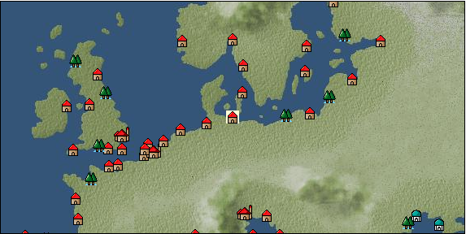

# Port: リューベック

import Tabs from '@theme/Tabs';
import TabItem from '@theme/TabItem';

## General Information

| Attribute | Details |
| :--- | :--- |
| **Port Name** | lübeck |
| **Port Type** | port of alliance |
| **Region** | northern europe |
| **Sea Area** | Off the coast of Jutland |
| **Required Language** | german |
| **Coordinates** | （484，2333） |
| **Investment Reward** | [Casting method for high-class armor](Items/Recipe Book/item_1147.md) （必要投資額：2,000,000ドゥカード） |

### Available Facilities

| guild | intermediary | exchange | tool shop | workshop craftsman | Painter | sculptor | peddler |
| --- | --- | --- | --- | --- | --- | --- | --- |
|   |   | ○ | ○ | ○ |   | ○ | ○ |
| Shipyard Master | Lumbermaker | Sail-maker | weapon craftsman | master | TavernFemale | archive | salesperson |
| --- | --- | --- | --- | --- | --- | --- | --- |
| ○ |   |   | ○ | ○ |   |   |   |
| Shipwright | 銀行 | street worker | 王宮 | Trading post | church | suburbs | translator |
| --- | --- | --- | --- | --- | --- | --- | --- |
| ○ | ○ | ○ |   |   | ○ | ○ |   |

### Description
The city was once known as the "Hanseatic Queen" as it was the center of the Hanseatic League. It used to be extremely prosperous, but in recent years it has been overwhelmed by countries such as Amsterdam and has lost its former momentum. In addition to being rich in mineral resources, salt is a specialty product. Suburbs: Southeast of Lübeck Cultural area: Northern Europe

<Tabs>
  <TabItem value="trade_goods_sales" label="Trade Goods Sales">

| item | group | purchase price | 同盟時 | remarks |
| --- | --- | --- | --- | --- |
| [zinc ore](Items/Trade Goods/TradeGoods-Minerals/item_626.md) | [Trading Items (Iron Stone)](Categories/category_7.md) | 383 | (336) |  |
| [salt](Items/Trade Goods/TradeGoods-Seasonings/item_42.md) | [交易品（調味料）](Categories/category_4.md) | 237 | 208 |  |
| [wheat](Items/Trade Goods/TradeGoods-Foodstuffs/item_16.md) | [Trading items (food items)](Categories/category_3.md) | 45 | 40 |  |
| [Stone](Items/Trade Goods/TradeGoods-Wares/item_276.md) | [交易品（工業品）](Categories/category_19.md) | 652 | (571) |  |
| [feather](Items/Trade Goods/TradeGoods-Fibers/item_585.md) | [交易品（繊維）](Categories/category_1.md) | 566 | (496) |  |
| [iron ore](Items/Trade Goods/TradeGoods-Minerals/item_146.md) | [Trading Items (Iron Stone)](Categories/category_7.md) | 648 | (567) |  |
| [lead ore](Items/Trade Goods/TradeGoods-Minerals/item_21.md) | [Trading Items (Iron Stone)](Categories/category_7.md) | 447 | (392) |  |
| [silver](Items/Trade Goods/TradeGoods-Metals/item_136.md) | [Trading products (precious metals)](Categories/category_8.md) | 2,860 | 2,510 |  |
| [silversmith](Items/Trade Goods/TradeGoods-Luxuries/item_619.md) | [Trading goods (artificial goods)](Categories/category_13.md) | 2,870 | 2,680 |  |
| 要投資（必要投資額：500,000） |
| [copper ore](Items/Trade Goods/TradeGoods-Minerals/item_65.md) | [Trading Items (Iron Stone)](Categories/category_7.md) | 698 | (611) |  |
| 要投資（必要投資額：180,000） |
  </TabItem>
  <TabItem value="sale_specialty" label="Sale (Specialty)">

| item | group | sale price | 同盟時 | remarks |
| --- | --- | --- | --- | --- |

#### [交易品（繊維）](Categories/category_1.md)

| [Green ramie](Items/Trade Goods/TradeGoods-Fibers/item_3428.md) | [交易品（繊維）](Categories/category_1.md) | (32,995) | 38,500 |  |
| 80%=30800 |

#### [Trading Goods (Dye)](Categories/category_2.md)

| [ward](Items/Trade Goods/TradeGoods-Dye/item_57.md) | [Trading Goods (Dye)](Categories/category_2.md) | (1,332) | 1,554 |  |

#### [Trading items (food items)](Categories/category_3.md)

| [buckwheat](Items/Trade Goods/TradeGoods-Foodstuffs/item_3430.md) | [Trading items (food items)](Categories/category_3.md) | (32,610) | 38,051 |  |
| 118%=44900 |

#### [交易品（調味料）](Categories/category_4.md)

| [apple cider vinegar](Items/Trade Goods/TradeGoods-Seasonings/item_882.md) | [交易品（調味料）](Categories/category_4.md) | [Edit Sale Price](Ports/port_62.md) |  |

#### [交易品（雑貨）](Categories/category_5.md)

| [Japanese books](Items/Trade Goods/TradeGoods-Misc/item_3439.md) | [交易品（雑貨）](Categories/category_5.md) | (34,573) | 40,341 |  |
| 88%=35500 |

#### [Trading products (medical products)](Categories/category_6.md)

| [Borei](Items/Trade Goods/TradeGoods-Medicine/item_3678.md) | [Trading products (medical products)](Categories/category_6.md) | (23,426) | 27,334 |  |
| [calamus](Items/Trade Goods/TradeGoods-Medicine/item_3427.md) | [Trading products (medical products)](Categories/category_6.md) | (33,909) | 39,566 |  |
| 115%=45500 |

#### [Trading products (precious metals)](Categories/category_8.md)

| [佐摩銀](Items/Trade Goods/TradeGoods-Metals/item_3432.md) | [Trading products (precious metals)](Categories/category_8.md) | (37,333) | 43,562 |  |
| 73%=31800 |

#### [交易品（酒類）](Categories/category_9.md)

| [tequila](Items/Trade Goods/TradeGoods-Alcohol/item_108.md) | [交易品（酒類）](Categories/category_9.md) | (1,966) | 2,294 |  |
| [Sake](Items/Trade Goods/TradeGoods-Alcohol/item_3424.md) | [交易品（酒類）](Categories/category_9.md) | (34,742) | 40,538 |  |

#### [Trading goods (hobby goods)](Categories/category_10.md)

| [Aigyoku](Items/Trade Goods/TradeGoods-Sunddries/item_3677.md) | [Trading goods (hobby goods)](Categories/category_10.md) | 30,700 | (34,540) |  |
| [eggplant](Items/Trade Goods/TradeGoods-Sunddries/item_3426.md) | [Trading goods (hobby goods)](Categories/category_10.md) | (32,853) | 38,334 |  |
| 90%=34500 |
| [black tea](Items/Trade Goods/TradeGoods-Sunddries/item_675.md) | [Trading goods (hobby goods)](Categories/category_10.md) | 2,780 | 2,891 |  |

#### [Trading Goods (Spices)](Categories/category_11.md)

| [jasmine](Items/Trade Goods/TradeGoods-Perfume/item_772.md) | [Trading Goods (Spices)](Categories/category_11.md) | (5,851) | 6,827 |  |
| [geranium](Items/Trade Goods/TradeGoods-Perfume/item_145.md) | [Trading Goods (Spices)](Categories/category_11.md) | 1,300 | 1,346 |  |
| [mastic](Items/Trade Goods/TradeGoods-Perfume/item_680.md) | [Trading Goods (Spices)](Categories/category_11.md) | 3,092 | (3,478) |  |
| [sandalwood](Items/Trade Goods/TradeGoods-Perfume/item_771.md) | [Trading Goods (Spices)](Categories/category_11.md) | 4,820 | 5,237 |  |

#### [Trading Goods (Spices)](Categories/category_12.md)

| [nutmeg](Items/Trade Goods/TradeGoods-Spices/item_1969.md) | [Trading Goods (Spices)](Categories/category_12.md) | (11,673) | 13,620 |  |
| [mace](Items/Trade Goods/TradeGoods-Spices/item_2100.md) | [Trading Goods (Spices)](Categories/category_12.md) | (12,313) | 14,367 |  |
| [Grapefruit](Items/Trade Goods/TradeGoods-Spices/item_3422.md) | [Trading Goods (Spices)](Categories/category_12.md) | (35,424) | 41,334 |  |
| 105%=43400 |

#### [Trading goods (artificial goods)](Categories/category_13.md)

| [glasswork](Items/Trade Goods/TradeGoods-Luxuries/item_60.md) | [Trading goods (artificial goods)](Categories/category_13.md) | (1,694) | 1,976 |  |
| [Tumbaga](Items/Trade Goods/TradeGoods-Luxuries/item_3028.md) | [Trading goods (artificial goods)](Categories/category_13.md) | 20,100 | 25,807 |  |

#### [交易品（美術品）](Categories/category_14.md)

| [Japanese painting](Items/Trade Goods/TradeGoods-Art/item_3436.md) | [交易品（美術品）](Categories/category_14.md) | (34,121) | 39,814 |  |
| 107%=42600 |

#### [Trading Items (Gemstones)](Categories/category_15.md)

| [aventurine](Items/Trade Goods/TradeGoods-Gems/item_678.md) | [Trading Items (Gemstones)](Categories/category_15.md) | 6,110 | 6,510 |  |
| [inca rose](Items/Trade Goods/TradeGoods-Gems/item_3014.md) | [Trading Items (Gemstones)](Categories/category_15.md) | 15,919 | (17,910) |  |
| [cat's eye](Items/Trade Goods/TradeGoods-Gems/item_1047.md) | [Trading Items (Gemstones)](Categories/category_15.md) | 10,500 | 11,200 |  |
| [sapphire](Items/Trade Goods/TradeGoods-Gems/item_676.md) | [Trading Items (Gemstones)](Categories/category_15.md) | 12,800 | 13,500 |  |
| [diamond](Items/Trade Goods/TradeGoods-Gems/item_449.md) | [Trading Items (Gemstones)](Categories/category_15.md) | 8,977 | (10,100) |  |
| [pink diamond](Items/Trade Goods/TradeGoods-Gems/item_2874.md) | [Trading Items (Gemstones)](Categories/category_15.md) | 14,500 | (16,314) |  |
| [ruby](Items/Trade Goods/TradeGoods-Gems/item_773.md) | [Trading Items (Gemstones)](Categories/category_15.md) | (11,998) | 14,000 |  |

#### [Trading Items (Arms)](Categories/category_16.md)

| [Japanese sword](Items/Trade Goods/TradeGoods-Weapons/item_3437.md) | [Trading Items (Arms)](Categories/category_16.md) | (24,487) | 28,572 |  |
| 72%=28400 |

#### [Trading Items (Firearms)](Categories/category_17.md)

| [musket gun](Items/Trade Goods/TradeGoods-Firearms/item_584.md) | [Trading Items (Firearms)](Categories/category_17.md) | (2,846) | 3,320 |  |
| [monocular gun](Items/Trade Goods/TradeGoods-Firearms/item_3916.md) | [Trading Items (Firearms)](Categories/category_17.md) | (24,619) | 28,726 |  |
| [tanegashima gun](Items/Trade Goods/TradeGoods-Firearms/item_3423.md) | [Trading Items (Firearms)](Categories/category_17.md) | (32,052) | 37,400 |  |
| [銅手銃](Items/Trade Goods/TradeGoods-Firearms/item_3700.md) | [Trading Items (Firearms)](Categories/category_17.md) | (22,475) | 26,225 |  |

#### [Trading Goods (Livestock)](Categories/category_18.md)

| [boar](Items/Trade Goods/TradeGoods-Livestock/item_3476.md) | [Trading Goods (Livestock)](Categories/category_18.md) | (32,738) | 38,200 |  |

#### [交易品（工業品）](Categories/category_19.md)

| [Japanese paper](Items/Trade Goods/TradeGoods-Wares/item_3438.md) | [交易品（工業品）](Categories/category_19.md) | (24,939) | 29,100 |  |
| [羊皮紙](Items/Trade Goods/TradeGoods-Wares/item_53.md) | [交易品（工業品）](Categories/category_19.md) | 1,620 | 1,721 |  |

#### [交易品（織物）](Categories/category_20.md)

| [Awaiyo](Items/Trade Goods/TradeGoods-Fabrics/item_3002.md) | [交易品（織物）](Categories/category_20.md) | (11,001) | 12,836 |  |
| [indian chintz](Items/Trade Goods/TradeGoods-Fabrics/item_159.md) | [交易品（織物）](Categories/category_20.md) | 2,652 | (2,983) |  |
| [damask](Items/Trade Goods/TradeGoods-Fabrics/item_614.md) | [交易品（織物）](Categories/category_20.md) | 7,684 | (8,645) |  |
| [turkish rug](Items/Trade Goods/TradeGoods-Fabrics/item_686.md) | [交易品（織物）](Categories/category_20.md) | (6,125) | 7,147 |  |
| [velvet](Items/Trade Goods/TradeGoods-Fabrics/item_902.md) | [交易品（織物）](Categories/category_20.md) | 5,039 | 5,256 |  |
| [Nishijin textile](Items/Trade Goods/TradeGoods-Fabrics/item_3431.md) | [交易品（織物）](Categories/category_20.md) | (36,085) | 42,106 |  |
| 76%=32000 |
  </TabItem>
  <TabItem value="sale_no_specialty" label="Sale (No Specialty)">

| item | group | sale price | 同盟時 | remarks |
| --- | --- | --- | --- | --- |

#### [交易品（繊維）](Categories/category_1.md)

| [flax](Items/Trade Goods/TradeGoods-Fibers/item_64.md) | [交易品（繊維）](Categories/category_1.md) | (218) | 254 |  |
| [fur](Items/Trade Goods/TradeGoods-Fibers/item_634.md) | [交易品（繊維）](Categories/category_1.md) | 1,269 | (1,427) |  |
| [raw silk](Items/Trade Goods/TradeGoods-Fibers/item_677.md) | [交易品（繊維）](Categories/category_1.md) | 2,256 | (2,538) |  |
| [leather](Items/Trade Goods/TradeGoods-Fibers/item_44.md) | [交易品（繊維）](Categories/category_1.md) | 464 | (522) |  |
| [wool](Items/Trade Goods/TradeGoods-Fibers/item_5.md) | [交易品（繊維）](Categories/category_1.md) | 503 | (565) |  |

#### [Trading items (food items)](Categories/category_3.md)

| [sausage](Items/Trade Goods/TradeGoods-Foodstuffs/item_27.md) | [Trading items (food items)](Categories/category_3.md) | 394 | (443) |  |
| [cheese](Items/Trade Goods/TradeGoods-Foodstuffs/item_20.md) | [Trading items (food items)](Categories/category_3.md) | 409 | (460) |  |
| [corn](Items/Trade Goods/TradeGoods-Foodstuffs/item_138.md) | [Trading items (food items)](Categories/category_3.md) | (193) | 225 |  |
| [barley](Items/Trade Goods/TradeGoods-Foodstuffs/item_124.md) | [Trading items (food items)](Categories/category_3.md) | 78 | (87) |  |
| [beef](Items/Trade Goods/TradeGoods-Foodstuffs/item_26.md) | [Trading items (food items)](Categories/category_3.md) | 774 | (870) |  |
| [魚肉](Items/Trade Goods/TradeGoods-Foodstuffs/item_10.md) | [Trading items (food items)](Categories/category_3.md) | 170 | (191) |  |

#### [Trading products (medical products)](Categories/category_6.md)

| [dandelion](Items/Trade Goods/TradeGoods-Medicine/item_1089.md) | [Trading products (medical products)](Categories/category_6.md) | (294) | 342 |  |
| [Maca](Items/Trade Goods/TradeGoods-Medicine/item_3000.md) | [Trading products (medical products)](Categories/category_6.md) | (1,912) | 2,231 |  |

#### [Trading products (precious metals)](Categories/category_8.md)

| [gold](Items/Trade Goods/TradeGoods-Metals/item_659.md) | [Trading products (precious metals)](Categories/category_8.md) | (7,762) | 9,057 |  |

#### [交易品（酒類）](Categories/category_9.md)

| [aquavit](Items/Trade Goods/TradeGoods-Alcohol/item_572.md) | [交易品（酒類）](Categories/category_9.md) | 554 | 585 |  |
| [whiskey](Items/Trade Goods/TradeGoods-Alcohol/item_1.md) | [交易品（酒類）](Categories/category_9.md) | 739 | (831) |  |
| [gin](Items/Trade Goods/TradeGoods-Alcohol/item_291.md) | [交易品（酒類）](Categories/category_9.md) | 738 | (830) |  |
| [Beer](Items/Trade Goods/TradeGoods-Alcohol/item_2.md) | [交易品（酒類）](Categories/category_9.md) | 317 | 327 |  |
| [rum](Items/Trade Goods/TradeGoods-Alcohol/item_139.md) | [交易品（酒類）](Categories/category_9.md) | 708 | (796) |  |

#### [Trading goods (artificial goods)](Categories/category_13.md)

| [lapidary work](Items/Trade Goods/TradeGoods-Luxuries/item_153.md) | [Trading goods (artificial goods)](Categories/category_13.md) | 3,991 | (4,490) |  |
| [ceramics](Items/Trade Goods/TradeGoods-Luxuries/item_152.md) | [Trading goods (artificial goods)](Categories/category_13.md) | 1,445 | 1,459 |  |
| [luxury furniture](Items/Trade Goods/TradeGoods-Luxuries/item_1048.md) | [Trading goods (artificial goods)](Categories/category_13.md) | 2,970 | (3,341) |  |

#### [交易品（美術品）](Categories/category_14.md)

| [古美術品](Items/Trade Goods/TradeGoods-Art/item_51.md) | [交易品（美術品）](Categories/category_14.md) | 4,821 | (5,424) |  |
| [marble statue](Items/Trade Goods/TradeGoods-Art/item_50.md) | [交易品（美術品）](Categories/category_14.md) | 3,571 | (4,017) |  |

#### [Trading Items (Gemstones)](Categories/category_15.md)

| [emerald](Items/Trade Goods/TradeGoods-Gems/item_777.md) | [Trading Items (Gemstones)](Categories/category_15.md) | 8,572 | (9,644) |  |
| [coral](Items/Trade Goods/TradeGoods-Gems/item_141.md) | [Trading Items (Gemstones)](Categories/category_15.md) | 4,532 | (5,098) |  |
| [pearl](Items/Trade Goods/TradeGoods-Gems/item_769.md) | [Trading Items (Gemstones)](Categories/category_15.md) | (10,799) | 12,600 |  |
| [ivory](Items/Trade Goods/TradeGoods-Gems/item_699.md) | [Trading Items (Gemstones)](Categories/category_15.md) | 4,120 | 4,330 |  |

#### [交易品（工業品）](Categories/category_19.md)

| [log](Items/Trade Goods/TradeGoods-Wares/item_846.md) | [交易品（工業品）](Categories/category_19.md) | 152 | (171) |  |
| [wood](Items/Trade Goods/TradeGoods-Wares/item_277.md) | [交易品（工業品）](Categories/category_19.md) | 903 | (1,015) |  |
| [iron material](Items/Trade Goods/TradeGoods-Wares/item_268.md) | [交易品（工業品）](Categories/category_19.md) | 964 | (1,084) |  |

#### [交易品（織物）](Categories/category_20.md)

| [flannel](Items/Trade Goods/TradeGoods-Fabrics/item_149.md) | [交易品（織物）](Categories/category_20.md) | 1,320 | (1,485) |  |
  </TabItem>
  <TabItem value="guild_&_others" label="Guild & Others">

| item | group | Sales price | Handling NPC | remarks |
| --- | --- | --- | --- | --- |

#### durer

| [How to make a Germanic language dictionary](Items/Recipe Book/item_2009.md) | [recipe book](Categories/category_22.md) | Fixed recipe | durer |  |
| [Treasure appraisal](Skills/Skill-Adventure/item_439.md) | [Skill (adventure)](Categories/category_39.md) | 3,000 | durer |  |
| durer |

#### others

| [High-lethal blunt casting method](Items/Recipe Book/item_4519.md) | [recipe book](Categories/category_22.md) | Fixed recipe |  |  |
| 16th century 2nd and 3rd period young man |
  </TabItem>
  <TabItem value="toolman" label="Toolman">

| item | group | Sales price | Handling NPC | remarks |
| --- | --- | --- | --- | --- |

#### [recipe book](Categories/category_22.md)

| [Spear training/application](Items/Recipe Book/item_1141.md) | [recipe book](Categories/category_22.md) | 50,000 | tool shop owner |  |
| 要投資（必要投資額：120,000） |
| [metal refining book](Items/Recipe Book/item_627.md) | [recipe book](Categories/category_22.md) | 12,000 | tool shop owner |  |

#### [Equipment (head)](Categories/category_23.md)

| [Hussar's helmet](Items/Equipment/Equipment-Head/item_4596.md) | [Equipment (head)](Categories/category_23.md) |  | tool shop owner |  |
| 16世紀 |

#### [Equipment (body)](Categories/category_24.md)

| [wing hussar armor](Items/Equipment/Equipment-Body/item_4595.md) | [Equipment (body)](Categories/category_24.md) |  | tool shop owner |  |
| 16世紀 |

#### [Equipment (belongings)](Categories/category_27.md)

| [snap lock shooting gun](Items/Equipment/Equipment-Weapon/item_267.md) | [Equipment (belongings)](Categories/category_27.md) | 8,000 | tool shop owner |  |

#### [Consumables (land battle/deck battle)](Categories/category_29.md)

| [poison](Items/Consumables/Consumables-Landbattle/item_269.md) | [Consumables (land battle/deck battle)](Categories/category_29.md) | 250 | tool shop owner |  |
| [antidote](Items/Consumables/Consumables-Landbattle/item_270.md) | [Consumables (land battle/deck battle)](Categories/category_29.md) | 100 | tool shop owner |  |

#### [Consumables (skill activation)](Categories/category_31.md)

| [fishing gear](Items/Consumables/Consumables-Skill/item_79.md) | [Consumables (skill activation)](Categories/category_31.md) | 2,500 | tool shop owner |  |

#### [Consumables (request documents)](Categories/category_45.md)

| [Alcoholic beverage purchase order form](Items/Consumables/Consumables-Documents/item_5117.md) | [Consumables (request documents)](Categories/category_45.md) | 40,000 | tool shop owner |  |
  </TabItem>
  <TabItem value="kobo_craftsmen" label="Craftsman">

| item | group | Sales price | Handling NPC | remarks |
| --- | --- | --- | --- | --- |

#### [Consumables (condition recovery)](Categories/category_21.md)

| [Nostalgic carillon bell](Items/Consumables/Consumables-Recovery/item_245.md) | [Consumables (condition recovery)](Categories/category_21.md) | 200 | workshop craftsman |  |
| [Ship song sheet music](Items/Consumables/Consumables-Recovery/item_247.md) | [Consumables (condition recovery)](Categories/category_21.md) | 200 | workshop craftsman |  |

#### [recipe book](Categories/category_22.md)

| [Furniture Manufacturing - North Sea Volume 2](Items/Recipe Book/item_2003.md) | [recipe book](Categories/category_22.md) | Fixed recipe | workshop craftsman |  |
| [Marine life sculpture](Items/Recipe Book/item_273.md) | [recipe book](Categories/category_22.md) | 10,000 | workshop craftsman |  |

#### [Consumables (skill activation)](Categories/category_31.md)

| [四分儀](Items/Consumables/Consumables-Skill/item_346.md) | [Consumables (skill activation)](Categories/category_31.md) | 500 | workshop craftsman |  |

#### [furniture](Categories/category_48.md)

| [Skill bookshelf 3 tiers](Items/Furniture/item_2855.md) | [furniture](Categories/category_48.md) | Fixed recipe | workshop craftsman |  |
| [bookshelf](Items/Furniture/item_2000.md) | [furniture](Categories/category_48.md) | Fixed recipe | workshop craftsman |  |
| [storage barrel](Items/Furniture/item_2811.md) | [furniture](Categories/category_48.md) | Fixed recipe | workshop craftsman |  |
| [pull-out storage rack](Items/Furniture/item_2809.md) | [furniture](Categories/category_48.md) | Fixed recipe | workshop craftsman |  |
| [costume dance](Items/Furniture/item_1999.md) | [furniture](Categories/category_48.md) | Fixed recipe | workshop craftsman |  |
  </TabItem>
  <TabItem value="sculptor" label="sculptor">

| item | group | Sales price | Handling NPC | remarks |
| --- | --- | --- | --- | --- |

#### [Ship parts (figurehead)](Categories/category_34.md)

| [hawk statue](Items/Ship Parts/Shipparts-Figurehead/item_289.md) | [Ship parts (figurehead)](Categories/category_34.md) | 5,200 | sculptor |  |
| [Tobi statue](Items/Ship Parts/Shipparts-Figurehead/item_287.md) | [Ship parts (figurehead)](Categories/category_34.md) | 500 | sculptor |  |
| [falcon statue](Items/Ship Parts/Shipparts-Figurehead/item_288.md) | [Ship parts (figurehead)](Categories/category_34.md) | 1,800 | sculptor |  |
| [eagle statue](Items/Ship Parts/Shipparts-Figurehead/item_632.md) | [Ship parts (figurehead)](Categories/category_34.md) | 31,000 | sculptor |  |
| [phoenix statue](Items/Ship Parts/Shipparts-Figurehead/item_631.md) | [Ship parts (figurehead)](Categories/category_34.md) | 62,000 | sculptor |  |
| [maiden statue](Items/Ship Parts/Shipparts-Figurehead/item_167.md) | [Ship parts (figurehead)](Categories/category_34.md) | 13,000 | sculptor |  |
| [statue of a great man](Items/Ship Parts/Shipparts-Figurehead/item_717.md) | [Ship parts (figurehead)](Categories/category_34.md) | 60,000 | sculptor |  |
| [statue of the brave](Items/Ship Parts/Shipparts-Figurehead/item_716.md) | [Ship parts (figurehead)](Categories/category_34.md) | 60,000 | sculptor |  |
| [angel statue](Items/Ship Parts/Shipparts-Figurehead/item_168.md) | [Ship parts (figurehead)](Categories/category_34.md) | 13,000 | sculptor |  |
| [statue of tenryu](Items/Ship Parts/Shipparts-Figurehead/item_630.md) | [Ship parts (figurehead)](Categories/category_34.md) | 62,000 | sculptor |  |
| [statue of goddess](Items/Ship Parts/Shipparts-Figurehead/item_721.md) | [Ship parts (figurehead)](Categories/category_34.md) | 60,000 | sculptor |  |
| [sea ​​monster statue](Items/Ship Parts/Shipparts-Figurehead/item_628.md) | [Ship parts (figurehead)](Categories/category_34.md) | 62,000 | sculptor |  |
| [statue of sea god](Items/Ship Parts/Shipparts-Figurehead/item_720.md) | [Ship parts (figurehead)](Categories/category_34.md) | 60,000 | sculptor |  |
| [statue of king](Items/Ship Parts/Shipparts-Figurehead/item_718.md) | [Ship parts (figurehead)](Categories/category_34.md) | 60,000 | sculptor |  |
| [statue of a saint](Items/Ship Parts/Shipparts-Figurehead/item_629.md) | [Ship parts (figurehead)](Categories/category_34.md) | 100,000 | sculptor |  |
| [statue of virgin](Items/Ship Parts/Shipparts-Figurehead/item_719.md) | [Ship parts (figurehead)](Categories/category_34.md) | 60,000 | sculptor |  |
  </TabItem>
  <TabItem value="shipyard" label="Shipyard">

### Shipyard Master

| item | group | Sales price | Handling NPC | remarks |
| --- | --- | --- | --- | --- |

#### [Boat](Categories/category_43.md)

| [2 mast cogs](Items/Ships/item_265.md) | [Boat](Categories/category_43.md) | 96,000 | Shipyard Master |  |
| [warwick cog](Items/Ships/item_336.md) | [Boat](Categories/category_43.md) | 230,000 | Shipyard Master |  |
| [carrack](Items/Ships/item_236.md) | [Boat](Categories/category_43.md) | 720,000 | Shipyard Master |  |
| [Hansa Cog](Items/Ships/item_263.md) | [Boat](Categories/category_43.md) | 24,000 | Shipyard Master |  |
| [Varsha](Items/Ships/item_201.md) | [Boat](Categories/category_43.md) | 2,000 | Shipyard Master |  |
| [pinnace](Items/Ships/item_767.md) | [Boat](Categories/category_43.md) | 950,000 | Shipyard Master |  |
| [flute](Items/Ships/item_569.md) | [Boat](Categories/category_43.md) | 410,000 | Shipyard Master |  |
| [hooker](Items/Ships/item_335.md) | [Boat](Categories/category_43.md) | 220,000 | Shipyard Master |  |
| [commercial carrack](Items/Ships/item_239.md) | [Boat](Categories/category_43.md) | 728,000 | Shipyard Master |  |
| [commercial pinnace](Items/Ships/item_768.md) | [Boat](Categories/category_43.md) | 960,000 | Shipyard Master |  |
| [commercial flute](Items/Ships/item_570.md) | [Boat](Categories/category_43.md) | 420,000 | Shipyard Master |  |
| [commercial large carrack](Items/Ships/item_409.md) | [Boat](Categories/category_43.md) | 1,840,000 | Shipyard Master |  |
| [commercial armed carrack](Items/Ships/item_1502.md) | [Boat](Categories/category_43.md) | 4,000,000 | Shipyard Master |  |
| [large carrack](Items/Ships/item_408.md) | [Boat](Categories/category_43.md) | 1,800,000 | Shipyard Master |  |
| [small carrack](Items/Ships/item_219.md) | [Boat](Categories/category_43.md) | 480,000 | Shipyard Master |  |
| [small caravel](Items/Ships/item_206.md) | [Boat](Categories/category_43.md) | 92,000 | Shipyard Master |  |
| [combat carrack](Items/Ships/item_238.md) | [Boat](Categories/category_43.md) | 720,000 | Shipyard Master |  |
| [combat pinnace](Items/Ships/item_766.md) | [Boat](Categories/category_43.md) | 950,000 | Shipyard Master |  |
| [combat flute](Items/Ships/item_568.md) | [Boat](Categories/category_43.md) | 400,000 | Shipyard Master |  |
| [Large exploration carrack](Items/Ships/item_1503.md) | [Boat](Categories/category_43.md) | 3,360,000 | Shipyard Master |  |
| [armed cog](Items/Ships/item_264.md) | [Boat](Categories/category_43.md) | 25,000 | Shipyard Master |  |
| [light carrack](Items/Ships/item_218.md) | [Boat](Categories/category_43.md) | 478,000 | Shipyard Master |  |
| [light caravelle](Items/Ships/item_207.md) | [Boat](Categories/category_43.md) | 92,000 | Shipyard Master |  |
| [transport carrack](Items/Ships/item_222.md) | [Boat](Categories/category_43.md) | 488,000 | Shipyard Master |  |
  </TabItem>
  <TabItem value="weapon craftsman" label="weapon craftsman">

| item | group | Sales price | Handling NPC | remarks |
| --- | --- | --- | --- | --- |

#### [Ship parts (special weapons)](Categories/category_37.md)

| [small corvus](Items/Ship Parts/Shipparts-Special-Weapons/item_193.md) | [Ship parts (special weapons)](Categories/category_37.md) | 3,000 | weapon craftsman |  |
| [small ram](Items/Ship Parts/Shipparts-Special-Weapons/item_190.md) | [Ship parts (special weapons)](Categories/category_37.md) | 1,000 | weapon craftsman |  |
| [small poop](Items/Ship Parts/Shipparts-Special-Weapons/item_198.md) | [Ship parts (special weapons)](Categories/category_37.md) | 39,000 | weapon craftsman |  |
| [small ship forecastle](Items/Ship Parts/Shipparts-Special-Weapons/item_195.md) | [Ship parts (special weapons)](Categories/category_37.md) | 5,000 | weapon craftsman |  |
| [forecastle](Items/Ship Parts/Shipparts-Special-Weapons/item_241.md) | [Ship parts (special weapons)](Categories/category_37.md) | 16,000 | weapon craftsman |  |
| [additional spanker](Items/Ship Parts/Shipparts-Special-Weapons/item_200.md) | [Ship parts (special weapons)](Categories/category_37.md) | 55,000 | weapon craftsman |  |
| [additional split](Items/Ship Parts/Shipparts-Special-Weapons/item_197.md) | [Ship parts (special weapons)](Categories/category_37.md) | 44,000 | weapon craftsman |  |
| [additional small spanker](Items/Ship Parts/Shipparts-Special-Weapons/item_199.md) | [Ship parts (special weapons)](Categories/category_37.md) | 3,500 | weapon craftsman |  |
| [additional small split](Items/Ship Parts/Shipparts-Special-Weapons/item_196.md) | [Ship parts (special weapons)](Categories/category_37.md) | 2,000 | weapon craftsman |  |

#### [Ship parts (cannon)](Categories/category_38.md)

| [4 amfer guns](Items/Ship Parts/Shipparts-Cannons/item_391.md) | [Ship parts (cannon)](Categories/category_38.md) | 26,600 | weapon craftsman |  |
| [6 Amfer cannons](Items/Ship Parts/Shipparts-Cannons/item_392.md) | [Ship parts (cannon)](Categories/category_38.md) | 81,000 | weapon craftsman |  |
| [4 Caprice guns](Items/Ship Parts/Shipparts-Cannons/item_395.md) | [Ship parts (cannon)](Categories/category_38.md) | 18,200 | weapon craftsman |  |
| [6 Caprice guns](Items/Ship Parts/Shipparts-Cannons/item_396.md) | [Ship parts (cannon)](Categories/category_38.md) | 55,500 | weapon craftsman |  |
| [8 Caprice guns](Items/Ship Parts/Shipparts-Cannons/item_397.md) | [Ship parts (cannon)](Categories/category_38.md) | 103,600 | weapon craftsman |  |
| [10 culverines](Items/Ship Parts/Shipparts-Cannons/item_375.md) | [Ship parts (cannon)](Categories/category_38.md) | 136,300 | weapon craftsman |  |
| [12 culverin guns](Items/Ship Parts/Shipparts-Cannons/item_744.md) | [Ship parts (cannon)](Categories/category_38.md) | 196,300 | weapon craftsman |  |
| [4 culverine guns](Items/Ship Parts/Shipparts-Cannons/item_372.md) | [Ship parts (cannon)](Categories/category_38.md) | 21,800 | weapon craftsman |  |
| [6 culverine guns](Items/Ship Parts/Shipparts-Cannons/item_373.md) | [Ship parts (cannon)](Categories/category_38.md) | 49,100 | weapon craftsman |  |
| [8 culverine guns](Items/Ship Parts/Shipparts-Cannons/item_374.md) | [Ship parts (cannon)](Categories/category_38.md) | 87,300 | weapon craftsman |  |
| [10 Saker cannons](Items/Ship Parts/Shipparts-Cannons/item_187.md) | [Ship parts (cannon)](Categories/category_38.md) | 79,000 | weapon craftsman |  |
| [2 saker cannons](Items/Ship Parts/Shipparts-Cannons/item_183.md) | [Ship parts (cannon)](Categories/category_38.md) | 3,200 | weapon craftsman |  |
| [4 saker cannons](Items/Ship Parts/Shipparts-Cannons/item_184.md) | [Ship parts (cannon)](Categories/category_38.md) | 12,600 | weapon craftsman |  |
| [6 Saker cannons](Items/Ship Parts/Shipparts-Cannons/item_185.md) | [Ship parts (cannon)](Categories/category_38.md) | 28,400 | weapon craftsman |  |
| [8 Saker cannons](Items/Ship Parts/Shipparts-Cannons/item_186.md) | [Ship parts (cannon)](Categories/category_38.md) | 50,500 | weapon craftsman |  |
| [10 demi culverin cannons](Items/Ship Parts/Shipparts-Cannons/item_370.md) | [Ship parts (cannon)](Categories/category_38.md) | 10,100 | weapon craftsman |  |
| [12 demi culverin cannons](Items/Ship Parts/Shipparts-Cannons/item_371.md) | [Ship parts (cannon)](Categories/category_38.md) | 145,400 | weapon craftsman |  |
| [2 demi culverin cannons](Items/Ship Parts/Shipparts-Cannons/item_188.md) | [Ship parts (cannon)](Categories/category_38.md) | 4,000 | weapon craftsman |  |
| [4 demi culverin cannons](Items/Ship Parts/Shipparts-Cannons/item_189.md) | [Ship parts (cannon)](Categories/category_38.md) | 16,200 | weapon craftsman |  |
| [6 demi culverin cannons](Items/Ship Parts/Shipparts-Cannons/item_368.md) | [Ship parts (cannon)](Categories/category_38.md) | 36,400 | weapon craftsman |  |
| [8 demi culverin cannons](Items/Ship Parts/Shipparts-Cannons/item_369.md) | [Ship parts (cannon)](Categories/category_38.md) | 64,600 | weapon craftsman |  |
| [4 Draconis cannons](Items/Ship Parts/Shipparts-Cannons/item_386.md) | [Ship parts (cannon)](Categories/category_38.md) | 18,200 | weapon craftsman |  |
| [6 Draconis cannons](Items/Ship Parts/Shipparts-Cannons/item_387.md) | [Ship parts (cannon)](Categories/category_38.md) | 55,500 | weapon craftsman |  |
| [8 Draconis cannons](Items/Ship Parts/Shipparts-Cannons/item_390.md) | [Ship parts (cannon)](Categories/category_38.md) | 103,600 | weapon craftsman |  |
| [4 pyro cannons](Items/Ship Parts/Shipparts-Cannons/item_384.md) | [Ship parts (cannon)](Categories/category_38.md) | 12,500 | weapon craftsman |  |
| [6 pyro cannons](Items/Ship Parts/Shipparts-Cannons/item_385.md) | [Ship parts (cannon)](Categories/category_38.md) | 38,000 | weapon craftsman |  |
| [2 falcon guns](Items/Ship Parts/Shipparts-Cannons/item_174.md) | [Ship parts (cannon)](Categories/category_38.md) | 500 | weapon craftsman |  |
| [4 falcon guns](Items/Ship Parts/Shipparts-Cannons/item_175.md) | [Ship parts (cannon)](Categories/category_38.md) | 2,000 | weapon craftsman |  |
| [6 falcon guns](Items/Ship Parts/Shipparts-Cannons/item_176.md) | [Ship parts (cannon)](Categories/category_38.md) | 4,600 | weapon craftsman |  |
| [8 falcon guns](Items/Ship Parts/Shipparts-Cannons/item_177.md) | [Ship parts (cannon)](Categories/category_38.md) | 8,100 | weapon craftsman |  |
| [4 frango guns](Items/Ship Parts/Shipparts-Cannons/item_393.md) | [Ship parts (cannon)](Categories/category_38.md) | 12,500 | weapon craftsman |  |
| [6 frango guns](Items/Ship Parts/Shipparts-Cannons/item_394.md) | [Ship parts (cannon)](Categories/category_38.md) | 38,000 | weapon craftsman |  |
| [10 Heitzer guns](Items/Ship Parts/Shipparts-Cannons/item_947.md) | [Ship parts (cannon)](Categories/category_38.md) | 226,800 | weapon craftsman |  |
| [2 Heutzer guns](Items/Ship Parts/Shipparts-Cannons/item_633.md) | [Ship parts (cannon)](Categories/category_38.md) | 9,100 | weapon craftsman |  |
| [4 Heitzer guns](Items/Ship Parts/Shipparts-Cannons/item_1390.md) | [Ship parts (cannon)](Categories/category_38.md) | 36,300 | weapon craftsman |  |
| [6 Heutzer guns](Items/Ship Parts/Shipparts-Cannons/item_945.md) | [Ship parts (cannon)](Categories/category_38.md) | 81,700 | weapon craftsman |  |
| [8 Heutzer guns](Items/Ship Parts/Shipparts-Cannons/item_946.md) | [Ship parts (cannon)](Categories/category_38.md) | 145,200 | weapon craftsman |  |
| [10 minion cannons](Items/Ship Parts/Shipparts-Cannons/item_182.md) | [Ship parts (cannon)](Categories/category_38.md) | 34,800 | weapon craftsman |  |
| [2 minion cannons](Items/Ship Parts/Shipparts-Cannons/item_178.md) | [Ship parts (cannon)](Categories/category_38.md) | 1,400 | weapon craftsman |  |
| [4 minion cannons](Items/Ship Parts/Shipparts-Cannons/item_179.md) | [Ship parts (cannon)](Categories/category_38.md) | 5,600 | weapon craftsman |  |
| [6 minion cannons](Items/Ship Parts/Shipparts-Cannons/item_180.md) | [Ship parts (cannon)](Categories/category_38.md) | 12,400 | weapon craftsman |  |
| [8 minion cannons](Items/Ship Parts/Shipparts-Cannons/item_181.md) | [Ship parts (cannon)](Categories/category_38.md) | 22,400 | weapon craftsman |  |
| [4 Meteora cannons](Items/Ship Parts/Shipparts-Cannons/item_398.md) | [Ship parts (cannon)](Categories/category_38.md) | 26,600 | weapon craftsman |  |
| [6 Meteora cannons](Items/Ship Parts/Shipparts-Cannons/item_399.md) | [Ship parts (cannon)](Categories/category_38.md) | 81,000 | weapon craftsman |  |
  </TabItem>
</Tabs>