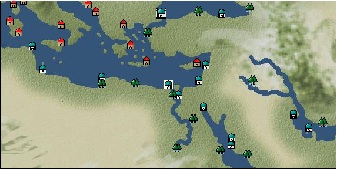

# Port: アレクサンドリア

import Tabs from '@theme/Tabs';
import TabItem from '@theme/TabItem';

## General Information

| Attribute | Details |
| :--- | :--- |
| **Port Name** | alexandria |
| **Port Type** | 領地 |
| **Region** | eastern europe |
| **Sea Area** | eastern mediterranean |
| **Required Language** | arabic |
| **Coordinates** | （1344，3534） |
| **Investment Reward** | [Luxury costume sewing techniques](Items/Recipe Book/item_3231.md) （必要投資額：2,120,000ドゥカード） |

### Available Facilities

| guild | intermediary | exchange | tool shop | workshop craftsman | Painter | sculptor | peddler |
| --- | --- | --- | --- | --- | --- | --- | --- |
| ○ | ○ | ○ | ○ | ○ | ○ |   | ○ |
| Shipyard Master | Lumbermaker | Sail-maker | weapon craftsman | master | TavernFemale | archive | salesperson |
| --- | --- | --- | --- | --- | --- | --- | --- |
| ○ |   |   | ○ | ○ | ○ | ○ | ○ |
| Shipwright | 銀行 | street worker | 王宮 | Trading post | church | suburbs | translator |
| --- | --- | --- | --- | --- | --- | --- | --- |
| ○ | ○ |   | ○ | ○ | ○ |   | ○ |

### Description
One of the "Alexandria" cities built by Alexander the Great. It flourishes as a trade transit point between the Mediterranean and Arabia. The store sells agricultural products grown in the fertile soil of the Nile coast, as well as spices and fragrances imported from Arabia. You cannot invest unless you are an Ottoman Turkish citizen Tavern woman: Yulia *Can also speak Ancient Egyptian Cultural area: North Africa Requires disguise level 20 (if you speak Arabic, disguise level 10 is OK) *Bank NPC is also near the shipyard master.

<Tabs>
  <TabItem value="trade_goods_sales" label="Trade Goods Sales">

| item | group | purchase price | 同盟時 | remarks |
| --- | --- | --- | --- | --- |
| [fava beans](Items/Trade Goods/TradeGoods-Foodstuffs/item_102.md) | [Trading items (food items)](Categories/category_3.md) | 59 | (52) |  |
| [garlic](Items/Trade Goods/TradeGoods-Spices/item_526.md) | [Trading Goods (Spices)](Categories/category_12.md) | 278 | (244) |  |
| [cumin](Items/Trade Goods/TradeGoods-Spices/item_156.md) | [Trading Goods (Spices)](Categories/category_12.md) | (1,402) | 1,227 |  |
| 要投資（必要投資額：不明） |
| [pepper](Items/Trade Goods/TradeGoods-Spices/item_58.md) | [Trading Goods (Spices)](Categories/category_12.md) | 6,419 | (5,616) |  |
| 要投資（必要投資額：不明） |
| [turquoise](Items/Trade Goods/TradeGoods-Gems/item_1006.md) | [Trading Items (Gemstones)](Categories/category_15.md) | (3,693) | 3,231 |  |
| 要投資（必要投資額：不明） |
| [camel hair](Items/Trade Goods/TradeGoods-Fibers/item_577.md) | [交易品（繊維）](Categories/category_1.md) | 392 | (343) |  |
| [wheat](Items/Trade Goods/TradeGoods-Foodstuffs/item_16.md) | [Trading items (food items)](Categories/category_3.md) | 45 | (40) |  |
| [Nothing](Items/Trade Goods/TradeGoods-Medicine/item_1053.md) | [Trading products (medical products)](Categories/category_6.md) | 593 | (519) |  |
| [gunpowder](Items/Trade Goods/TradeGoods-Firearms/item_352.md) | [Trading Items (Firearms)](Categories/category_17.md) | 830 | (727) |  |
| [cotton](Items/Trade Goods/TradeGoods-Fibers/item_610.md) | [交易品（繊維）](Categories/category_1.md) | 305 | (267) |  |
  </TabItem>
  <TabItem value="sale_specialty" label="Sale (Specialty)">

| item | group | sale price | 同盟時 | remarks |
| --- | --- | --- | --- | --- |

#### [交易品（繊維）](Categories/category_1.md)

| [flax](Items/Trade Goods/TradeGoods-Fibers/item_64.md) | 交易品（繊維） | 323 | (363) |  |
| [feather](Items/Trade Goods/TradeGoods-Fibers/item_585.md) | 交易品（繊維） | 868 | (976) |  |

#### [Trading Goods (Dye)](Categories/category_2.md)

| [Indian indigo](Items/Trade Goods/TradeGoods-Dye/item_157.md) | Trading Goods (Dye) | 1,088 | (1,224) |  |
| [ward](Items/Trade Goods/TradeGoods-Dye/item_57.md) | Trading Goods (Dye) | 1,112 | (1,251) |  |
| [mayan blue](Items/Trade Goods/TradeGoods-Dye/item_1096.md) | Trading Goods (Dye) | 1,391 | (1,565) |  |
| [mimosa](Items/Trade Goods/TradeGoods-Dye/item_2281.md) | Trading Goods (Dye) | 1,378 | (1,550) |  |

#### [交易品（調味料）](Categories/category_4.md)

| [tamarind](Items/Trade Goods/TradeGoods-Seasonings/item_1968.md) | 交易品（調味料） | 1,990 | (2,238) |  |

#### [Trading products (medical products)](Categories/category_6.md)

| [tea tree](Items/Trade Goods/TradeGoods-Medicine/item_2283.md) | Trading products (medical products) | 1,440 | (1,620) |  |

#### [Trading products (precious metals)](Categories/category_8.md)

| [platinum](Items/Trade Goods/TradeGoods-Metals/item_2178.md) | Trading products (precious metals) | 7,067 | (7,951) |  |

#### [Trading goods (hobby goods)](Categories/category_10.md)

| [almond](Items/Trade Goods/TradeGoods-Sunddries/item_367.md) | Trading goods (hobby goods) | 203 | (228) |  |
| [durian](Items/Trade Goods/TradeGoods-Sunddries/item_1949.md) | Trading goods (hobby goods) | 1,730 | (1,946) |  |
| Non-alliance 100% |
| [macadamia nuts](Items/Trade Goods/TradeGoods-Sunddries/item_2282.md) | Trading goods (hobby goods) | 1,200 | (1,350) |  |
| [mango](Items/Trade Goods/TradeGoods-Sunddries/item_2095.md) | Trading goods (hobby goods) | 754 | (848) |  |
| [black tea](Items/Trade Goods/TradeGoods-Sunddries/item_675.md) | Trading goods (hobby goods) | 2,288 | (2,574) |  |

#### [Trading Goods (Spices)](Categories/category_11.md)

| [jasmine](Items/Trade Goods/TradeGoods-Perfume/item_772.md) | Trading Goods (Spices) | 5,457 | (6,139) |  |
| [lily of the valley](Items/Trade Goods/TradeGoods-Perfume/item_358.md) | Trading Goods (Spices) | 1,259 | (1,416) |  |
| [eucalyptus](Items/Trade Goods/TradeGoods-Perfume/item_2278.md) | Trading Goods (Spices) | 991 | (1,114) |  |
| [sandalwood](Items/Trade Goods/TradeGoods-Perfume/item_771.md) | Trading Goods (Spices) | 4,330 | (4,871) |  |

#### [Trading Goods (Spices)](Categories/category_12.md)

| [pepper](Items/Trade Goods/TradeGoods-Spices/item_58.md) | Trading Goods (Spices) | 2,010 | (2,261) |  |
| 要投資（必要投資額：不明） |
| [saffron](Items/Trade Goods/TradeGoods-Spices/item_845.md) | Trading Goods (Spices) | 2,983 | (3,356) |  |

#### [Trading goods (artificial goods)](Categories/category_13.md)

| [glasswork](Items/Trade Goods/TradeGoods-Luxuries/item_60.md) | Trading goods (artificial goods) | 1,500 | (1,687) |  |
| [Tumbaga](Items/Trade Goods/TradeGoods-Luxuries/item_3028.md) | Trading goods (artificial goods) | 8,334 | (9,376) |  |

#### [Trading Items (Gemstones)](Categories/category_15.md)

| [alexandrite](Items/Trade Goods/TradeGoods-Gems/item_4429.md) | Trading Items (Gemstones) | 5,825 | (6,553) |  |
| [opal](Items/Trade Goods/TradeGoods-Gems/item_2006.md) | Trading Items (Gemstones) | 6,594 | (7,418) |  |
| [topaz](Items/Trade Goods/TradeGoods-Gems/item_1097.md) | Trading Items (Gemstones) | 4,681 | (5,266) |  |
| [pink diamond](Items/Trade Goods/TradeGoods-Gems/item_2874.md) | Trading Items (Gemstones) | 13,049 | (14,681) |  |
| [amber](Items/Trade Goods/TradeGoods-Gems/item_618.md) | Trading Items (Gemstones) | 4,331 | (4,872) |  |

#### [Trading Items (Firearms)](Categories/category_17.md)

| [銅手銃](Items/Trade Goods/TradeGoods-Firearms/item_3700.md) | Trading Items (Firearms) | 25,556 | (28,753) |  |

#### [交易品（工業品）](Categories/category_19.md)

| [rubber](Items/Trade Goods/TradeGoods-Wares/item_2819.md) | 交易品（工業品） | 1,432 | (1,611) |  |

#### [交易品（織物）](Categories/category_20.md)

| [indian chintz](Items/Trade Goods/TradeGoods-Fabrics/item_159.md) | 交易品（織物） | 2,411 | (2,712) |  |
| [dutch calico](Items/Trade Goods/TradeGoods-Fabrics/item_1435.md) | 交易品（織物） | 1,510 | (1,698) |  |
| [gobelin weave](Items/Trade Goods/TradeGoods-Fabrics/item_1276.md) | 交易品（織物） | 5,242 | (5,897) |  |
| [felt](Items/Trade Goods/TradeGoods-Fabrics/item_4439.md) | 交易品（織物） | 1,125 | (1,265) |  |
| [flannel](Items/Trade Goods/TradeGoods-Fabrics/item_149.md) | 交易品（織物） | 1,580 | (1,777) |  |
| [velvet](Items/Trade Goods/TradeGoods-Fabrics/item_902.md) | 交易品（織物） | 3,685 | (4,146) |  |
  </TabItem>
  <TabItem value="sale_no_specialty" label="Sale (No Specialty)">

| item | group | sale price | 同盟時 | remarks |
| --- | --- | --- | --- | --- |

#### [交易品（繊維）](Categories/category_1.md)

| [raw silk](Items/Trade Goods/TradeGoods-Fibers/item_677.md) | 交易品（繊維） | 2,136 | (2,403) |  |
| [wool](Items/Trade Goods/TradeGoods-Fibers/item_5.md) | 交易品（繊維） | 447 | (502) |  |
| [numb](Items/Trade Goods/TradeGoods-Fibers/item_900.md) | 交易品（繊維） | 12 | (13) |  |

#### [Trading Goods (Dye)](Categories/category_2.md)

| [Safflower](Items/Trade Goods/TradeGoods-Dye/item_1059.md) | Trading Goods (Dye) | 626 | (704) |  |
| [persian berry](Items/Trade Goods/TradeGoods-Dye/item_693.md) | Trading Goods (Dye) | 1,355 | (1,524) |  |
| [貝紫](Items/Trade Goods/TradeGoods-Dye/item_110.md) | Trading Goods (Dye) | (3,513) | 4,099 |  |

#### [Trading items (food items)](Categories/category_3.md)

| [olive](Items/Trade Goods/TradeGoods-Foodstuffs/item_47.md) | Trading items (food items) | 288 | (324) |  |
| [sugar cane](Items/Trade Goods/TradeGoods-Foodstuffs/item_93.md) | Trading items (food items) | 256 | (288) |  |
| [onion](Items/Trade Goods/TradeGoods-Foodstuffs/item_28.md) | Trading items (food items) | 115 | (129) |  |
| [Sugar beet](Items/Trade Goods/TradeGoods-Foodstuffs/item_1846.md) | Trading items (food items) | 293 | (329) |  |
| [pasta](Items/Trade Goods/TradeGoods-Foodstuffs/item_635.md) | Trading items (food items) | 67 | (75) |  |
| [wheat](Items/Trade Goods/TradeGoods-Foodstuffs/item_16.md) | Trading items (food items) | 62 | (69) |  |
| [flour](Items/Trade Goods/TradeGoods-Foodstuffs/item_605.md) | Trading items (food items) | 51 | (57) |  |
| [mutton](Items/Trade Goods/TradeGoods-Foodstuffs/item_33.md) | Trading items (food items) | 390 | (438) |  |
| [魚肉](Items/Trade Goods/TradeGoods-Foodstuffs/item_10.md) | Trading items (food items) | 168 | (189) |  |

#### [交易品（調味料）](Categories/category_4.md)

| [olive oil](Items/Trade Goods/TradeGoods-Seasonings/item_48.md) | 交易品（調味料） | 398 | (447) |  |
| [coconut vinegar](Items/Trade Goods/TradeGoods-Seasonings/item_1988.md) | 交易品（調味料） | 518 | (582) |  |
| [wine vinegar](Items/Trade Goods/TradeGoods-Seasonings/item_429.md) | 交易品（調味料） | 561 | (631) |  |
| [salt](Items/Trade Goods/TradeGoods-Seasonings/item_42.md) | 交易品（調味料） | 276 | (310) |  |
| [Honey](Items/Trade Goods/TradeGoods-Seasonings/item_49.md) | 交易品（調味料） | 1,017 | (1,144) |  |

#### [交易品（雑貨）](Categories/category_5.md)

| [Western books](Items/Trade Goods/TradeGoods-Misc/item_293.md) | 交易品（雑貨） | 610 | (686) |  |

#### [Trading products (medical products)](Categories/category_6.md)

| [belladonna](Items/Trade Goods/TradeGoods-Medicine/item_1056.md) | Trading products (medical products) | 445 | (500) |  |
| [Maca](Items/Trade Goods/TradeGoods-Medicine/item_3000.md) | Trading products (medical products) | 1,964 | (2,209) |  |

#### [Trading Items (Iron Stone)](Categories/category_7.md)

| [iron ore](Items/Trade Goods/TradeGoods-Minerals/item_146.md) | Trading Items (Iron Stone) | 653 | (734) |  |

#### [Trading products (precious metals)](Categories/category_8.md)

| [gold dust](Items/Trade Goods/TradeGoods-Metals/item_111.md) | Trading products (precious metals) | 3,938 | (4,430) |  |

#### [Trading goods (hobby goods)](Categories/category_10.md)

| [papaya](Items/Trade Goods/TradeGoods-Sunddries/item_1948.md) | Trading goods (hobby goods) | 513 | (577) |  |
| [pickles](Items/Trade Goods/TradeGoods-Sunddries/item_535.md) | Trading goods (hobby goods) | 336 | (378) |  |
| [hazelnut](Items/Trade Goods/TradeGoods-Sunddries/item_125.md) | Trading goods (hobby goods) | 495 | (556) |  |
| [dried figs](Items/Trade Goods/TradeGoods-Sunddries/item_611.md) | Trading goods (hobby goods) | 326 | (366) |  |

#### [Trading Goods (Spices)](Categories/category_11.md)

| [oakmoss](Items/Trade Goods/TradeGoods-Perfume/item_819.md) | Trading Goods (Spices) | 830 | (933) |  |
| [cedar wood](Items/Trade Goods/TradeGoods-Perfume/item_905.md) | Trading Goods (Spices) | 464 | (522) |  |
| [daffodil](Items/Trade Goods/TradeGoods-Perfume/item_612.md) | Trading Goods (Spices) | 802 | (902) |  |
| [lemon oil](Items/Trade Goods/TradeGoods-Perfume/item_151.md) | Trading Goods (Spices) | 642 | (722) |  |
| [Ryushu incense](Items/Trade Goods/TradeGoods-Perfume/item_101.md) | Trading Goods (Spices) | 4,025 | (4,528) |  |
| [Musk](Items/Trade Goods/TradeGoods-Perfume/item_158.md) | Trading Goods (Spices) | 3,725 | (4,191) |  |

#### [Trading Goods (Spices)](Categories/category_12.md)

| [Sesame](Items/Trade Goods/TradeGoods-Spices/item_437.md) | Trading Goods (Spices) | 259 | (291) |  |
| [ginger](Items/Trade Goods/TradeGoods-Spices/item_112.md) | Trading Goods (Spices) | 1,429 | (1,607) |  |
| [dill](Items/Trade Goods/TradeGoods-Spices/item_1093.md) | Trading Goods (Spices) | 199 | (223) |  |
| [basil](Items/Trade Goods/TradeGoods-Spices/item_126.md) | Trading Goods (Spices) | 173 | (194) |  |
| [Laurier](Items/Trade Goods/TradeGoods-Spices/item_615.md) | Trading Goods (Spices) | 162 | (182) |  |
| ▲Special products from neighboring cultural areas |

#### [Trading goods (artificial goods)](Categories/category_13.md)

| [lapidary work](Items/Trade Goods/TradeGoods-Luxuries/item_153.md) | Trading goods (artificial goods) | 4,590 | (5,164) |  |
| [goldsmith](Items/Trade Goods/TradeGoods-Luxuries/item_687.md) | Trading goods (artificial goods) | 3,535 | (3,977) |  |
| [silversmith](Items/Trade Goods/TradeGoods-Luxuries/item_619.md) | Trading goods (artificial goods) | 3,760 | (4,230) |  |
| [ceramics](Items/Trade Goods/TradeGoods-Luxuries/item_152.md) | Trading goods (artificial goods) | 1,633 | (1,837) |  |

#### [交易品（美術品）](Categories/category_14.md)

| [古美術品](Items/Trade Goods/TradeGoods-Art/item_51.md) | 交易品（美術品） | 4,020 | (4,522) |  |
| [marble statue](Items/Trade Goods/TradeGoods-Art/item_50.md) | 交易品（美術品） | (2,518) | 2,937 |  |
| [青銅像](Items/Trade Goods/TradeGoods-Art/item_148.md) | 交易品（美術品） | 1,004 | (1,129) |  |

#### [Trading Items (Gemstones)](Categories/category_15.md)

| [coral](Items/Trade Goods/TradeGoods-Gems/item_141.md) | Trading Items (Gemstones) | 2,902 | (3,265) |  |
| [pearl](Items/Trade Goods/TradeGoods-Gems/item_769.md) | Trading Items (Gemstones) | 8,841 | (9,947) |  |

#### [Trading Items (Arms)](Categories/category_16.md)

| [damascus sword](Items/Trade Goods/TradeGoods-Weapons/item_903.md) | Trading Items (Arms) | 4,858 | (5,465) |  |
| [scimitar](Items/Trade Goods/TradeGoods-Weapons/item_142.md) | Trading Items (Arms) | 1,167 | (1,313) |  |

#### [交易品（工業品）](Categories/category_19.md)

| [alabaster](Items/Trade Goods/TradeGoods-Wares/item_1086.md) | 交易品（工業品） | 575 | (646) |  |
| [papyrus](Items/Trade Goods/TradeGoods-Wares/item_616.md) | 交易品（工業品） | 461 | (518) |  |
| [wax](Items/Trade Goods/TradeGoods-Wares/item_54.md) | 交易品（工業品） | 970 | (1,091) |  |
| [marble](Items/Trade Goods/TradeGoods-Wares/item_52.md) | 交易品（工業品） | 1,468 | (1,651) |  |
| [Stone](Items/Trade Goods/TradeGoods-Wares/item_276.md) | 交易品（工業品） | 817 | (919) |  |
| [oil](Items/Trade Goods/TradeGoods-Wares/item_613.md) | 交易品（工業品） | 586 | (659) |  |
| [coal](Items/Trade Goods/TradeGoods-Wares/item_359.md) | 交易品（工業品） | 515 | (579) |  |
| [paper](Items/Trade Goods/TradeGoods-Wares/item_625.md) | 交易品（工業品） | 289 | (325) |  |
| [羊皮紙](Items/Trade Goods/TradeGoods-Wares/item_53.md) | 交易品（工業品） | 1,183 | (1,331) |  |
| [鋼](Items/Trade Goods/TradeGoods-Wares/item_573.md) | 交易品（工業品） | 1,287 | (1,448) |  |

#### [交易品（織物）](Categories/category_20.md)

| [corduroy](Items/Trade Goods/TradeGoods-Fabrics/item_824.md) | 交易品（織物） | 926 | (1,041) |  |
| [satin](Items/Trade Goods/TradeGoods-Fabrics/item_996.md) | 交易品（織物） | 3,330 | (3,746) |  |
| [georgette](Items/Trade Goods/TradeGoods-Fabrics/item_1000.md) | 交易品（織物） | 3,331 | (3,747) |  |
| [damask](Items/Trade Goods/TradeGoods-Fabrics/item_614.md) | 交易品（織物） | 3,648 | (4,104) |  |
| [tweed](Items/Trade Goods/TradeGoods-Fabrics/item_31.md) | 交易品（織物） | 1,500 | (1,687) |  |
| [knit](Items/Trade Goods/TradeGoods-Fabrics/item_164.md) | 交易品（織物） | 596 | (670) |  |
| [muslin](Items/Trade Goods/TradeGoods-Fabrics/item_581.md) | 交易品（織物） | 1,494 | (1,680) |  |
| [woolen fabric](Items/Trade Goods/TradeGoods-Fabrics/item_163.md) | 交易品（織物） | 1,112 | (1,251) |  |
| [cotton fabric](Items/Trade Goods/TradeGoods-Fabrics/item_571.md) | 交易品（織物） | 802 | (902) |  |
| [linen fabric](Items/Trade Goods/TradeGoods-Fabrics/item_135.md) | 交易品（織物） | 452 | (508) |  |
  </TabItem>
  <TabItem value="guild_&_others" label="Guild & Others">

| item | group | Sales price | Handling NPC | remarks |
| --- | --- | --- | --- | --- |

#### adventure guild

| [explore](Skills/Skill-Adventure/item_257.md) | [Skill (adventure)](Categories/category_39.md) | 15,000 | adventure guild |  |
| [towing](Skills/Skill-Adventure/item_2274.md) | [Skill (adventure)](Categories/category_39.md) | 10,000 | adventure guild |  |
| [unlock](Skills/Skill-Adventure/item_460.md) | [Skill (adventure)](Categories/category_39.md) | 30,000 | adventure guild |  |

#### merchant guild

| [sewing](Skills/Skill-Trade/item_474.md) | [Skill (trade)](Categories/category_40.md) | 10,000 | merchant guild |  |
| [textile trading](Skills/Skill-Trade/item_482.md) | [Skill (trade)](Categories/category_40.md) | 10,000 | merchant guild |  |

#### maritime guild

| [ballistics](Skills/Skill-Battle/item_443.md) | [Skill (combat)](Categories/category_41.md) | 25,000 | maritime guild |  |
| [steering](Skills/Skill-Battle/item_507.md) | [Skill (combat)](Categories/category_41.md) | 1,000 | maritime guild |  |
| [fire extinguishing](Skills/Skill-Battle/item_503.md) | [Skill (combat)](Categories/category_41.md) | 2,000 | maritime guild |  |

#### Even

| [Production techniques handed down in the Great Lighthouse](Items/Recipe Book/item_5625.md) | [recipe book](Categories/category_22.md) | Fixed recipe | Even |  |

#### Mehmet Sharuk

| [arms trade](Skills/Skill-Trade/item_337.md) | [Skill (trade)](Categories/category_40.md) | 15,000 | Mehmet Sharuk |  |
| [leadership](Skills/Skill-Battle/item_441.md) | [Skill (combat)](Categories/category_41.md) | 5,000 | Mehmet Sharuk |  |

#### others

| [ancient alchemy](Items/Recipe Book/item_3220.md) | [recipe book](Categories/category_22.md) | Fixed recipe |  |  |
| alchemist's daughter |
  </TabItem>
  <TabItem value="toolman" label="Toolman">

| item | group | Sales price | Handling NPC | remarks |
| --- | --- | --- | --- | --- |

#### [recipe book](Categories/category_22.md)

| [Curved Sword Training/Introduction](Items/Recipe Book/item_863.md) | recipe book | 20,000 | tool shop owner |  |

#### [Equipment (head)](Categories/category_23.md)

| [turban](Items/Equipment/Equipment-Head/item_132.md) | Equipment (head) | 31,500 | tool shop owner |  |
| [peacock turban](Items/Equipment/Equipment-Head/item_691.md) | Equipment (head) | 73,400 | tool shop owner |  |
| [feather turban](Items/Equipment/Equipment-Head/item_690.md) | Equipment (head) | 48,300 | tool shop owner |  |

#### [Equipment (body)](Categories/category_24.md)

| [gilet](Items/Equipment/Equipment-Body/item_78.md) | Equipment (body) | 27,500 | tool shop owner |  |
| [brunjuk](Items/Equipment/Equipment-Body/item_214.md) | Equipment (body) | 66,100 | tool shop owner |  |

#### [Equipment (legs)](Categories/category_26.md)

| [arabian shoes](Items/Equipment/Equipment-Feet/item_220.md) | Equipment (legs) | 28,100 | tool shop owner |  |

#### [Consumables (land battle/deck battle)](Categories/category_29.md)

| [tear gas powder bag](Items/Consumables/Consumables-Landbattle/item_104.md) | Consumables (land battle/deck battle) | 150 | tool shop owner |  |
| [hellfire torch](Items/Consumables/Consumables-Landbattle/item_233.md) | Consumables (land battle/deck battle) | 300 | tool shop owner |  |
| [explosive powder](Items/Consumables/Consumables-Landbattle/item_230.md) | Consumables (land battle/deck battle) | 150 | tool shop owner |  |
| [secret cure](Items/Consumables/Consumables-Landbattle/item_563.md) | Consumables (land battle/deck battle) | 600 | tool shop owner |  |
| [sticky oil](Items/Consumables/Consumables-Landbattle/item_231.md) | Consumables (land battle/deck battle) | 150 | tool shop owner |  |

#### [Consumables (naval/hand-to-hand combat)](Categories/category_30.md)

| [assault flag](Items/Consumables/Consumables-navalhand-to-hand combat/item_228.md) | Consumables (naval/hand-to-hand combat) | 5,000 | tool shop owner |  |

#### [Consumables (skill activation)](Categories/category_31.md)

| [card](Items/Consumables/Consumables-Skill/item_855.md) | Consumables (skill activation) | 500 | tool shop owner |  |
| [Card (RANK2)](Items/Consumables/Consumables-Skill/item_1652.md) | Consumables (skill activation) | 1,000 | tool shop owner |  |
| [tambourine](Items/Consumables/Consumables-Skill/item_861.md) | Consumables (skill activation) | 3,000 | tool shop owner |  |
| [perfume](Items/Consumables/Consumables-Skill/item_226.md) | Consumables (skill activation) | 3,000 | tool shop owner |  |

#### [Consumables (other)](Categories/category_44.md)

| [Special dye 1](Items/Consumables/Consumables-Other/item_862.md) | Consumables (other) | 5,000 | tool shop owner |  |
  </TabItem>
  <TabItem value="kobo_craftsmen" label="Craftsman">

| item | group | Sales price | Handling NPC | remarks |
| --- | --- | --- | --- | --- |

#### [Consumables (condition recovery)](Categories/category_21.md)

| [Nostalgic carillon bell](Items/Consumables/Consumables-Recovery/item_245.md) | Consumables (condition recovery) | 200 | workshop craftsman |  |
| [Ship song sheet music](Items/Consumables/Consumables-Recovery/item_247.md) | Consumables (condition recovery) | 200 | workshop craftsman |  |

#### [recipe book](Categories/category_22.md)

| [Book of land battle props and crafts](Items/Recipe Book/item_521.md) | recipe book | Fixed recipe | workshop craftsman |  |

#### [Consumables (other)](Categories/category_44.md)

| [帆塗料](Items/Consumables/Consumables-Other/item_348.md) | Consumables (other) | 500 | workshop craftsman |  |
| [ship paint](Items/Consumables/Consumables-Other/item_347.md) | Consumables (other) | 500 | workshop craftsman |  |
  </TabItem>
  <TabItem value="Painter" label="Painter">

| item | group | Sales price | Handling NPC | remarks |
| --- | --- | --- | --- | --- |

#### [Ship parts (emblem)](Categories/category_36.md)

| [admiral](Items/Ship Parts/Shipparts-Crests/item_548.md) | Ship parts (emblem) | 5,000 | Painter |  |
| [anchor](Items/Ship Parts/Shipparts-Crests/item_549.md) | Ship parts (emblem) | 5,000 | Painter |  |
| [ape](Items/Ship Parts/Shipparts-Crests/item_793.md) | Ship parts (emblem) | 5,000 | Painter |  |
| [circle cross](Items/Ship Parts/Shipparts-Crests/item_544.md) | Ship parts (emblem) | 5,000 | Painter |  |
| [Delphine](Items/Ship Parts/Shipparts-Crests/item_542.md) | Ship parts (emblem) | 5,000 | Painter |  |
| [butterfly](Items/Ship Parts/Shipparts-Crests/item_547.md) | Ship parts (emblem) | 5,000 | Painter |  |
| [fisherman](Items/Ship Parts/Shipparts-Crests/item_545.md) | Ship parts (emblem) | 5,000 | Painter |  |
| [fox](Items/Ship Parts/Shipparts-Crests/item_1428.md) | Ship parts (emblem) | 5,000 | Painter |  |
  </TabItem>
  <TabItem value="peddler" label="peddler">

| item | group | Sales price | Handling NPC | remarks |
| --- | --- | --- | --- | --- |

#### [Consumables (condition recovery)](Categories/category_21.md)

| [spare sail](Items/Consumables/Consumables-Recovery/item_242.md) | Consumables (condition recovery) |  | peddler |  |
| [reserve rudder](Items/Consumables/Consumables-Recovery/item_243.md) | Consumables (condition recovery) |  | peddler |  |
| [sleep hammock](Items/Consumables/Consumables-Recovery/item_73.md) | Consumables (condition recovery) |  | peddler |  |
| [rope of punishment](Items/Consumables/Consumables-Recovery/item_71.md) | Consumables (condition recovery) |  | peddler |  |
| [cotton earplugs](Items/Consumables/Consumables-Recovery/item_85.md) | Consumables (condition recovery) |  | peddler |  |

#### [Consumables (land battle/deck battle)](Categories/category_29.md)

| [agni firestick](Items/Consumables/Consumables-Landbattle/item_1737.md) | Consumables (land battle/deck battle) |  | peddler |  |
| [煙玉](Items/Consumables/Consumables-Landbattle/item_86.md) | Consumables (land battle/deck battle) |  | peddler |  |

#### [Consumables (skill activation)](Categories/category_31.md)

| [landmark ribbon](Items/Consumables/Consumables-Skill/item_316.md) | Consumables (skill activation) |  | peddler |  |
  </TabItem>
  <TabItem value="salesperson" label="salesperson">

| item | group | Sales price | Handling NPC | remarks |
| --- | --- | --- | --- | --- |

#### [Consumables (cooking)](Categories/category_32.md)

| [fig pie](Items/Consumables/Consumables-Cooking/item_1077.md) | Consumables (cooking) |  | salesperson |  |
| [Couscous](Items/Consumables/Consumables-Cooking/item_852.md) | Consumables (cooking) |  | salesperson |  |
| [watt](Items/Consumables/Consumables-Cooking/item_1101.md) | Consumables (cooking) |  | salesperson |  |
| [Stewed lamb and turnip](Items/Consumables/Consumables-Cooking/item_1083.md) | Consumables (cooking) |  | salesperson |  |
| [roast lamb](Items/Consumables/Consumables-Cooking/item_998.md) | Consumables (cooking) |  | salesperson |  |
| [pancakes with honey](Items/Consumables/Consumables-Cooking/item_1074.md) | Consumables (cooking) |  | salesperson |  |
  </TabItem>
  <TabItem value="translator" label="translator">

| item | group | Sales price | Handling NPC | remarks |
| --- | --- | --- | --- | --- |

#### [Consumables (skill activation)](Categories/category_31.md)

| [Altaic languages ​​translation notes](Items/Consumables/Consumables-Skill/item_2530.md) | Consumables (skill activation) |  | translator |  |
| [Shem-Hamite translation notes](Items/Consumables/Consumables-Skill/item_2529.md) | Consumables (skill activation) |  | translator |  |
  </TabItem>
  <TabItem value="shipyard" label="Shipyard">

### Shipyard Master

| item | group | Sales price | Handling NPC | remarks |
| --- | --- | --- | --- | --- |

#### [Boat](Categories/category_43.md)

| [Galliot](Items/Ships/item_210.md) | Boat | 156,000 | Shipyard Master |  |
| [galley](Items/Ships/item_227.md) | Boat | 645,000 | Shipyard Master |  |
| [Varsha](Items/Ships/item_201.md) | Boat | 2,000 | Shipyard Master |  |
| [barbarian galley](Items/Ships/item_237.md) | Boat | 560,000 | Shipyard Master |  |
| [commercial galley](Items/Ships/item_229.md) | Boat | 650,000 | Shipyard Master |  |
| [commercial varsha](Items/Ships/item_204.md) | Boat | 5,200 | Shipyard Master |  |
| [small caravel](Items/Ships/item_206.md) | Boat | 92,000 | Shipyard Master |  |
| [assault galley](Items/Ships/item_224.md) | Boat | 640,000 | Shipyard Master |  |
| [Battle Barsha](Items/Ships/item_203.md) | Boat | 5,100 | Shipyard Master |  |
| [exploration barsha](Items/Ships/item_202.md) | Boat | 5,000 | Shipyard Master |  |
| [light galley](Items/Ships/item_209.md) | Boat | 150,000 | Shipyard Master |  |
| [light caravelle](Items/Ships/item_207.md) | Boat | 92,000 | Shipyard Master |  |
| [transportation galley](Items/Ships/item_211.md) | Boat | 160,000 | Shipyard Master |  |

#### [shipbuilding materials](Categories/category_47.md)

| [medium sized boat](Items/Shipbuilding FS Material/item_3547.md) | shipbuilding materials | Fixed recipe | Shipyard Master |  |

### Shipwright

| item | group | Sales price | Handling NPC | remarks |
| --- | --- | --- | --- | --- |

#### [recipe book](Categories/category_22.md)

| [造船素材・纏絡網](Items/Recipe Book/item_1741.md) | recipe book | Fixed recipe | Shipwright |  |

#### [shipbuilding materials](Categories/category_47.md)

| [纏絡網](Items/Shipbuilding FS Material/item_1742.md) | shipbuilding materials | Fixed recipe | Shipwright |  |
  </TabItem>
  <TabItem value="weapon craftsman" label="weapon craftsman">

| item | group | Sales price | Handling NPC | remarks |
| --- | --- | --- | --- | --- |

#### [recipe book](Categories/category_22.md)

| [Book of Shipbuilding Materials and Casting Volume 2](Items/Recipe Book/item_1723.md) | recipe book | Fixed recipe | weapon craftsman |  |

#### [Ship parts (special weapons)](Categories/category_37.md)

| [rum](Items/Ship Parts/Shipparts-Special-Weapons/item_191.md) | Ship parts (special weapons) | 4,800 | weapon craftsman |  |
| [small corvus](Items/Ship Parts/Shipparts-Special-Weapons/item_193.md) | Ship parts (special weapons) | 3,000 | weapon craftsman |  |
| [small ram](Items/Ship Parts/Shipparts-Special-Weapons/item_190.md) | Ship parts (special weapons) | 1,000 | weapon craftsman |  |
| [small ship forecastle](Items/Ship Parts/Shipparts-Special-Weapons/item_195.md) | Ship parts (special weapons) | 5,000 | weapon craftsman |  |
| [forecastle](Items/Ship Parts/Shipparts-Special-Weapons/item_241.md) | Ship parts (special weapons) | 16,000 | weapon craftsman |  |
| [additional small spanker](Items/Ship Parts/Shipparts-Special-Weapons/item_199.md) | Ship parts (special weapons) | 3,500 | weapon craftsman |  |
| [additional small split](Items/Ship Parts/Shipparts-Special-Weapons/item_196.md) | Ship parts (special weapons) | 2,000 | weapon craftsman |  |

#### [Ship parts (cannon)](Categories/category_38.md)

| [2 falcon guns](Items/Ship Parts/Shipparts-Cannons/item_174.md) | Ship parts (cannon) | 500 | weapon craftsman |  |
| [4 falcon guns](Items/Ship Parts/Shipparts-Cannons/item_175.md) | Ship parts (cannon) | 2,000 | weapon craftsman |  |
| [6 falcon guns](Items/Ship Parts/Shipparts-Cannons/item_176.md) | Ship parts (cannon) | 4,600 | weapon craftsman |  |
| [2 minion cannons](Items/Ship Parts/Shipparts-Cannons/item_178.md) | Ship parts (cannon) | 1,400 | weapon craftsman |  |
| [4 minion cannons](Items/Ship Parts/Shipparts-Cannons/item_179.md) | Ship parts (cannon) | 5,600 | weapon craftsman |  |
| [6 minion cannons](Items/Ship Parts/Shipparts-Cannons/item_180.md) | Ship parts (cannon) | 12,400 | weapon craftsman |  |
| [8 minion cannons](Items/Ship Parts/Shipparts-Cannons/item_181.md) | Ship parts (cannon) | 22,400 | weapon craftsman |  |

#### [shipbuilding materials](Categories/category_47.md)

| [改良中型砲門](Items/Shipbuilding FS Material/item_1724.md) | shipbuilding materials | Fixed recipe | weapon craftsman |  |
  </TabItem>
  <TabItem value="Tavern Master" label="Tavern Master">

| item | group | Sales price | Handling NPC | remarks |
| --- | --- | --- | --- | --- |

#### [adjutant](Categories/category_46.md)

| [Carla](Items/Aides/item_1603.md) | adjutant | 100,000 | Tavern Master |  |
| [dargill](Items/Aides/item_1602.md) | adjutant | 100,000 | Tavern Master |  |
| [Hasan](Items/Aides/item_1595.md) | adjutant | 100,000 | Tavern Master |  |
  </TabItem>
</Tabs>