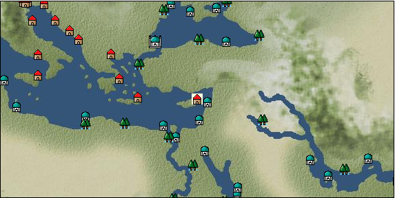

# Port: ファマガスタ

import Tabs from '@theme/Tabs';
import TabItem from '@theme/TabItem';

## General Information

| Attribute | Details |
| :--- | :--- |
| **Port Name** | Famagusta |
| **Port Type** | port of alliance |
| **Region** | eastern europe |
| **Sea Area** | eastern mediterranean |
| **Required Language** | greek |
| **Coordinates** | （1538，3381） |
| **Investment Reward** | [Collection of Eastern Mediterranean specialties](Items/Recipe Book/item_850.md) （必要投資額：1,000,000ドゥカード） |

### Available Facilities

| guild | intermediary | exchange | tool shop | workshop craftsman | Painter | sculptor | peddler |
| --- | --- | --- | --- | --- | --- | --- | --- |
|   |   | ○ | ○ | ○ |   | ○ |   |
| Shipyard Master | Lumbermaker | Sail-maker | weapon craftsman | master | TavernFemale | archive | salesperson |
| --- | --- | --- | --- | --- | --- | --- | --- |
| ○ |   |   | ○ | ○ |   |   |   |
| Shipwright | 銀行 | street worker | 王宮 | Trading post | church | suburbs | translator |
| --- | --- | --- | --- | --- | --- | --- | --- |
| ○ | ○ | ○ |   |   | ○ | ○ |   |

### Description
It is a city located in the eastern Mediterranean, on the east coast of the island of Cyprus. It is said to be the setting for Shakespeare's tragedy ``Othello''. Agriculture is flourishing in the warm Mediterranean climate. There are also copper mines. *Turkish is also spoken Suburbs: Famagusta West Cultural area: Balkans

<Tabs>
  <TabItem value="trade_goods_sales" label="Trade Goods Sales">

| item | group | purchase price | 同盟時 | remarks |
| --- | --- | --- | --- | --- |
| [olive](Items/Trade Goods/TradeGoods-Foodstuffs/item_47.md) | [Trading items (food items)](Categories/category_3.md) | (256) | 224 |  |
| When in alliance: confirmed at 100% |
| [sausage](Items/Trade Goods/TradeGoods-Foodstuffs/item_27.md) | [Trading items (food items)](Categories/category_3.md) | 370 | 324 |  |
| Investment required (Required investment amount: 120,000) At alliance: Confirmed at 100% |
| [Laurier](Items/Trade Goods/TradeGoods-Spices/item_615.md) | [Trading Goods (Spices)](Categories/category_12.md) | (124) | 109 |  |
| [wine](Items/Trade Goods/TradeGoods-Alcohol/item_11.md) | [交易品（酒類）](Categories/category_9.md) | (429) | 376 |  |
| [wheat](Items/Trade Goods/TradeGoods-Foodstuffs/item_16.md) | [Trading items (food items)](Categories/category_3.md) | 45 | 40 |  |
| [pork](Items/Trade Goods/TradeGoods-Foodstuffs/item_41.md) | [Trading items (food items)](Categories/category_3.md) | 347 | 304 |  |
| When in alliance: confirmed at 100% |
| [銅](Items/Trade Goods/TradeGoods-Wares/item_894.md) | [交易品（工業品）](Categories/category_19.md) | (996) | 872 |  |
| 要投資（必要投資額：700,000） EO第4章で追加 |
| [copper ore](Items/Trade Goods/TradeGoods-Minerals/item_65.md) | [Trading Items (Iron Stone)](Categories/category_7.md) | (790) | 692 |  |
| [魚肉](Items/Trade Goods/TradeGoods-Foodstuffs/item_10.md) | [Trading items (food items)](Categories/category_3.md) | 146 | 128 |  |
| When in alliance: confirmed at 100% |
  </TabItem>
  <TabItem value="sale_specialty" label="Sale (Specialty)">

| item | group | sale price | 同盟時 | remarks |
| --- | --- | --- | --- | --- |

#### [交易品（繊維）](Categories/category_1.md)

| [alpaca hair](Items/Trade Goods/TradeGoods-Fibers/item_3009.md) | [交易品（繊維）](Categories/category_1.md) | (2,006) | 2,340 |  |
| When in alliance: confirmed at 100% |
| [Rush](Items/Trade Goods/TradeGoods-Fibers/item_3675.md) | [交易品（繊維）](Categories/category_1.md) | (3,720) | 4,340 |  |
| When in alliance: confirmed at 100% |
| [Basho](Items/Trade Goods/TradeGoods-Fibers/item_3862.md) | [交易品（繊維）](Categories/category_1.md) | (36,423) | 42,500 |  |
| When in alliance: confirmed at 100% |
| [Panya](Items/Trade Goods/TradeGoods-Fibers/item_2097.md) | [交易品（繊維）](Categories/category_1.md) | (706) | 823 |  |
| When in alliance: confirmed at 100% |
| [flax](Items/Trade Goods/TradeGoods-Fibers/item_64.md) | [交易品（繊維）](Categories/category_1.md) | (286) | 333 |  |
| [feather](Items/Trade Goods/TradeGoods-Fibers/item_585.md) | [交易品（繊維）](Categories/category_1.md) | [Edit Sale Price](Ports/port_66.md) |  |
| [tiger skin](Items/Trade Goods/TradeGoods-Fibers/item_3790.md) | [交易品（繊維）](Categories/category_1.md) | (30,938) | 36,100 |  |
| 98％＝35400　104％＝37400 |
| [Green ramie](Items/Trade Goods/TradeGoods-Fibers/item_3428.md) | [交易品（繊維）](Categories/category_1.md) | (32,652) | 38,100 |  |
| 98％＝37400　104％＝39600 |
| [deerskin](Items/Trade Goods/TradeGoods-Fibers/item_3648.md) | [交易品（繊維）](Categories/category_1.md) | (30,767) | 35,900 |  |
| When in alliance: confirmed at 100% |

#### [Trading Goods (Dye)](Categories/category_2.md)

| [cochineal](Items/Trade Goods/TradeGoods-Dye/item_1817.md) | [Trading Goods (Dye)](Categories/category_2.md) | (1,466) | 1,710 |  |
| When in alliance: confirmed at 100% |
| [Shorou](Items/Trade Goods/TradeGoods-Dye/item_3691.md) | [Trading Goods (Dye)](Categories/category_2.md) | (29,824) | 34,800 |  |
| When in alliance: confirmed at 100% |
| [mayan blue](Items/Trade Goods/TradeGoods-Dye/item_1096.md) | [Trading Goods (Dye)](Categories/category_2.md) | (1,406) | 1,640 |  |
| [mangosteen](Items/Trade Goods/TradeGoods-Dye/item_1973.md) | [Trading Goods (Dye)](Categories/category_2.md) | (2,152) | 2,510 |  |
| When in alliance: confirmed at 100% |
| [mimosa](Items/Trade Goods/TradeGoods-Dye/item_2281.md) | [Trading Goods (Dye)](Categories/category_2.md) | (1,380) | 1,610 |  |
| 98％＝1590　102％＝1630 |
| [gallnut](Items/Trade Goods/TradeGoods-Dye/item_3429.md) | [Trading Goods (Dye)](Categories/category_2.md) | (35,052) | 40,900 |  |
| 98％＝40100　104％＝42500 |
| [purple root](Items/Trade Goods/TradeGoods-Dye/item_3752.md) | [Trading Goods (Dye)](Categories/category_2.md) | (30,852) | 36,000 |  |
| 98％＝35300　103％＝37000 |

#### [Trading items (food items)](Categories/category_3.md)

| [buckwheat](Items/Trade Goods/TradeGoods-Foodstuffs/item_3430.md) | [Trading items (food items)](Categories/category_3.md) | (32,652) | 38,100 |  |
| When in alliance: confirmed at 100% |
| [Karasumi](Items/Trade Goods/TradeGoods-Foodstuffs/item_3687.md) | [Trading items (food items)](Categories/category_3.md) | (31,624) | 36,900 |  |
| 98％＝36200　103％＝38000 |
| [kangaroo meat](Items/Trade Goods/TradeGoods-Foodstuffs/item_2285.md) | [Trading items (food items)](Categories/category_3.md) | (816) | 951 |  |
| When in alliance: confirmed at 100% |
| [cactus](Items/Trade Goods/TradeGoods-Foodstuffs/item_2740.md) | [Trading items (food items)](Categories/category_3.md) | (412) | 480 |  |
| When in alliance: confirmed at 100% |
| [taro](Items/Trade Goods/TradeGoods-Foodstuffs/item_1960.md) | [Trading items (food items)](Categories/category_3.md) | (235) | 274 |  |
| When in alliance: confirmed at 100% |
| [Chamtashima](Items/Trade Goods/TradeGoods-Foodstuffs/item_3771.md) | [Trading items (food items)](Categories/category_3.md) | (1,423) | 1,660 |  |
| 98％＝1650　103％＝1680 |
| [楊州栗](Items/Trade Goods/TradeGoods-Foodstuffs/item_3789.md) | [Trading items (food items)](Categories/category_3.md) | (9,256) | 10,800 |  |
| When in alliance: confirmed at 100% |

#### [交易品（調味料）](Categories/category_4.md)

| [oyster sauce](Items/Trade Goods/TradeGoods-Seasonings/item_3505.md) | [交易品（調味料）](Categories/category_4.md) | (2,794) | 3,260 |  |
| When in alliance: confirmed at 100% |
| [Gochujang](Items/Trade Goods/TradeGoods-Seasonings/item_3591.md) | [交易品（調味料）](Categories/category_4.md) | (6,608) | 7,710 |  |
| 98％＝7580　104％＝7980 |
| [tamarind](Items/Trade Goods/TradeGoods-Seasonings/item_1968.md) | [交易品（調味料）](Categories/category_4.md) | (1,894) | 2,210 |  |
| 98％＝2170　104％＝2280 |
| [Choshi](Items/Trade Goods/TradeGoods-Seasonings/item_3793.md) | [交易品（調味料）](Categories/category_4.md) | (30,681) | 35,800 |  |
| 98％＝35100　103％＝36800 |
| [Nampula](Items/Trade Goods/TradeGoods-Seasonings/item_1972.md) | [交易品（調味料）](Categories/category_4.md) | (535) | 624 |  |
| When in alliance: confirmed at 100% |
| [Nyoc mam](Items/Trade Goods/TradeGoods-Seasonings/item_1971.md) | [交易品（調味料）](Categories/category_4.md) | (452) | 527 |  |
| 98％＝521　102％＝532 |
| [apple cider vinegar](Items/Trade Goods/TradeGoods-Seasonings/item_882.md) | [交易品（調味料）](Categories/category_4.md) | (489) | 570 |  |
| 98％＝561　101％＝575 |
| [miso](Items/Trade Goods/TradeGoods-Seasonings/item_3420.md) | [交易品（調味料）](Categories/category_4.md) | (3,643) | 4,250 |  |
| When in alliance: confirmed at 100% |
| [Sha Cha Ji](Items/Trade Goods/TradeGoods-Seasonings/item_3689.md) | [交易品（調味料）](Categories/category_4.md) | (31,195) | 36,400 |  |
| When in alliance: confirmed at 100% |
| [Bean sauce](Items/Trade Goods/TradeGoods-Seasonings/item_3875.md) | [交易品（調味料）](Categories/category_4.md) | (34,023) | 39,700 |  |
| When in alliance: confirmed at 100% |
| [soy sauce](Items/Trade Goods/TradeGoods-Seasonings/item_3425.md) | [交易品（調味料）](Categories/category_4.md) | (35,223) | 41,100 |  |
| 98％＝40300　104％＝42700 |
| [black vinegar](Items/Trade Goods/TradeGoods-Seasonings/item_3475.md) | [交易品（調味料）](Categories/category_4.md) | (4,611) | 5,380 |  |
| 98％＝5290　104％＝5560 |

#### [交易品（雑貨）](Categories/category_5.md)

| [old ink stick](Items/Trade Goods/TradeGoods-Misc/item_3921.md) | [交易品（雑貨）](Categories/category_5.md) | (53,820) | 62,800 |  |
| When in alliance: confirmed at 100% |
| [Japanese books](Items/Trade Goods/TradeGoods-Misc/item_3439.md) | [交易品（雑貨）](Categories/category_5.md) | (34,366) | 40,100 |  |
| When in alliance: confirmed at 100% |
| [lantern](Items/Trade Goods/TradeGoods-Misc/item_3683.md) | [交易品（雑貨）](Categories/category_5.md) | (9,427) | 11,000 |  |
| When in alliance: confirmed at 100% |
| [Korean books](Items/Trade Goods/TradeGoods-Misc/item_3750.md) | [交易品（雑貨）](Categories/category_5.md) | (31,024) | 36,200 |  |
| When in alliance: confirmed at 100% |
| [rattan work](Items/Trade Goods/TradeGoods-Misc/item_3698.md) | [交易品（雑貨）](Categories/category_5.md) | (30,767) | 35,900 |  |
| 98％＝35200　102％＝36600 |

#### [Trading products (medical products)](Categories/category_6.md)

| [Saikaku](Items/Trade Goods/TradeGoods-Medicine/item_1959.md) | [Trading products (medical products)](Categories/category_6.md) | (4,200) | 4,900 |  |
| When in alliance: confirmed at 100% |
| [tea tree](Items/Trade Goods/TradeGoods-Medicine/item_2283.md) | [Trading products (medical products)](Categories/category_6.md) | (1,397) | 1,630 |  |
| When in alliance: confirmed at 100% |
| [Noni](Items/Trade Goods/TradeGoods-Medicine/item_2099.md) | [Trading products (medical products)](Categories/category_6.md) | (1,217) | 1,420 |  |
| When in alliance: confirmed at 100% |
| [heath](Items/Trade Goods/TradeGoods-Medicine/item_63.md) | [Trading products (medical products)](Categories/category_6.md) | (391) | 456 |  |
| 98％＝448　102％＝463 |
| [Borei](Items/Trade Goods/TradeGoods-Medicine/item_3678.md) | [Trading products (medical products)](Categories/category_6.md) | (44,650) | 52,100 |  |
| 98％＝51100　105％＝54700 |
| [Korean ginseng](Items/Trade Goods/TradeGoods-Medicine/item_3738.md) | [Trading products (medical products)](Categories/category_6.md) | (30,681) | 35,800 |  |
| 98％＝35100　106％＝37900 |
| [calamus](Items/Trade Goods/TradeGoods-Medicine/item_3427.md) | [Trading products (medical products)](Categories/category_6.md) | (33,938) | 39,600 |  |
| When in alliance: confirmed at 100% |

#### [Trading Items (Iron Stone)](Categories/category_7.md)

| [Hokutolite](Items/Trade Goods/TradeGoods-Minerals/item_3694.md) | [Trading Items (Iron Stone)](Categories/category_7.md) | (32,224) | 37,600 |  |
| 98％＝36900　103％＝38700 |
| [white porcelain ore](Items/Trade Goods/TradeGoods-Minerals/item_3433.md) | [Trading Items (Iron Stone)](Categories/category_7.md) | (34,880) | 40,700 |  |
| 98％＝39900　103％＝41800 |
| [medical stone](Items/Trade Goods/TradeGoods-Minerals/item_3786.md) | [Trading Items (Iron Stone)](Categories/category_7.md) | (31,110) | 36,300 |  |
| When in alliance: confirmed at 100% |

#### [Trading products (precious metals)](Categories/category_8.md)

| [佐摩銀](Items/Trade Goods/TradeGoods-Metals/item_3432.md) | [Trading products (precious metals)](Categories/category_8.md) | (36,680) | 42,800 |  |
| When in alliance: confirmed at 100% |
| [Korean silver](Items/Trade Goods/TradeGoods-Metals/item_3796.md) | [Trading products (precious metals)](Categories/category_8.md) | (31,281) | 36,500 |  |
| When in alliance: confirmed at 100% |
| [Jinguashijin](Items/Trade Goods/TradeGoods-Metals/item_3693.md) | [Trading products (precious metals)](Categories/category_8.md) | (30,938) | 36,100 |  |
| When in alliance: confirmed at 100% |

#### [交易品（酒類）](Categories/category_9.md)

| [aquavit](Items/Trade Goods/TradeGoods-Alcohol/item_572.md) | [交易品（酒類）](Categories/category_9.md) | (827) | 964 |  |
| [whiskey](Items/Trade Goods/TradeGoods-Alcohol/item_1.md) | [交易品（酒類）](Categories/category_9.md) | 985 | 1,040 |  |
| [sherry](Items/Trade Goods/TradeGoods-Alcohol/item_844.md) | [交易品（酒類）](Categories/category_9.md) | (494) | 576 |  |
| When in alliance: confirmed at 100% |
| [gin](Items/Trade Goods/TradeGoods-Alcohol/item_291.md) | [交易品（酒類）](Categories/category_9.md) | (834) | 973 |  |
| [Taiwan rice wine](Items/Trade Goods/TradeGoods-Alcohol/item_3672.md) | [交易品（酒類）](Categories/category_9.md) | (44,050) | 51,400 |  |
| When in alliance: confirmed at 100% |
| [Andong soju](Items/Trade Goods/TradeGoods-Alcohol/item_3757.md) | [交易品（酒類）](Categories/category_9.md) | (31,024) | 36,200 |  |
| When in alliance: confirmed at 100% |
| [Sake](Items/Trade Goods/TradeGoods-Alcohol/item_3424.md) | [交易品（酒類）](Categories/category_9.md) | (34,623) | 40,400 |  |
| When in alliance: confirmed at 100% |

#### [Trading goods (hobby goods)](Categories/category_10.md)

| [Aigyoku](Items/Trade Goods/TradeGoods-Sunddries/item_3677.md) | [Trading goods (hobby goods)](Categories/category_10.md) | (43,450) | 50,700 |  |
| When in alliance: confirmed at 100% |
| [cacao](Items/Trade Goods/TradeGoods-Sunddries/item_140.md) | [Trading goods (hobby goods)](Categories/category_10.md) | (1,329) | 1,550 |  |
| 98%＝1520 |
| [cashew nuts](Items/Trade Goods/TradeGoods-Sunddries/item_2120.md) | [Trading goods (hobby goods)](Categories/category_10.md) | (892) | 1,040 |  |
| When in alliance: confirmed at 100% |
| [tobacco](Items/Trade Goods/TradeGoods-Sunddries/item_109.md) | [Trading goods (hobby goods)](Categories/category_10.md) | (1,365) | 1,592 |  |
| [durian](Items/Trade Goods/TradeGoods-Sunddries/item_1949.md) | [Trading goods (hobby goods)](Categories/category_10.md) | (1,646) | 1,920 |  |
| When in alliance: confirmed at 100% |
| [eggplant](Items/Trade Goods/TradeGoods-Sunddries/item_3426.md) | [Trading goods (hobby goods)](Categories/category_10.md) | (45,164) | 52,700 |  |
| When in alliance: confirmed at 100% |
| [banana](Items/Trade Goods/TradeGoods-Sunddries/item_1947.md) | [Trading goods (hobby goods)](Categories/category_10.md) | (475) | 554 |  |
| 98％＝546　101％＝558 |
| [pineapple](Items/Trade Goods/TradeGoods-Sunddries/item_867.md) | [Trading goods (hobby goods)](Categories/category_10.md) | (1,903) | 2,220 |  |
| When in alliance: confirmed at 100% |
| [peanuts](Items/Trade Goods/TradeGoods-Sunddries/item_134.md) | [Trading goods (hobby goods)](Categories/category_10.md) | (393) | 458 |  |
| [macadamia nuts](Items/Trade Goods/TradeGoods-Sunddries/item_2282.md) | [Trading goods (hobby goods)](Categories/category_10.md) | (1,029) | 1,200 |  |
| When in alliance: confirmed at 100% |
| [mango](Items/Trade Goods/TradeGoods-Sunddries/item_2095.md) | [Trading goods (hobby goods)](Categories/category_10.md) | (813) | 948 |  |
| When in alliance: confirmed at 100% |
| [lemon myrtle](Items/Trade Goods/TradeGoods-Sunddries/item_2840.md) | [Trading goods (hobby goods)](Categories/category_10.md) | (2,006) | 2,340 |  |
| When in alliance: confirmed at 100% |
| [Chinese tea](Items/Trade Goods/TradeGoods-Sunddries/item_3907.md) | [Trading goods (hobby goods)](Categories/category_10.md) | (33,595) | 39,200 |  |
| When in alliance: confirmed at 100% |
| [dried apple](Items/Trade Goods/TradeGoods-Sunddries/item_19.md) | [Trading goods (hobby goods)](Categories/category_10.md) | (405) | 472 |  |
| When in alliance: confirmed at 100% |
| [Korean tea](Items/Trade Goods/TradeGoods-Sunddries/item_3751.md) | [Trading goods (hobby goods)](Categories/category_10.md) | (30,852) | 36,000 |  |
| When in alliance: confirmed at 100% |
| [black tea](Items/Trade Goods/TradeGoods-Sunddries/item_675.md) | [Trading goods (hobby goods)](Categories/category_10.md) | (2,314) | 2,700 |  |
| When in alliance: confirmed at 100% |
| [金針花](Items/Trade Goods/TradeGoods-Sunddries/item_3739.md) | [Trading goods (hobby goods)](Categories/category_10.md) | (9,342) | 10,900 |  |
| When in alliance: confirmed at 100% |

#### [Trading Goods (Spices)](Categories/category_11.md)

| [ylang ylang](Items/Trade Goods/TradeGoods-Perfume/item_1434.md) | [Trading Goods (Spices)](Categories/category_11.md) | (1,697) | 1,980 |  |
| 98%＝1950　103%＝2030 |
| [gardenia](Items/Trade Goods/TradeGoods-Perfume/item_1091.md) | [Trading Goods (Spices)](Categories/category_11.md) | (31,967) | 37,300 |  |
| 98％＝36600　104％＝38800 |
| [jasmine](Items/Trade Goods/TradeGoods-Perfume/item_772.md) | [Trading Goods (Spices)](Categories/category_11.md) | (5,545) | 6,470 |  |
| 98％＝6400　107％＝6720 |
| [lily of the valley](Items/Trade Goods/TradeGoods-Perfume/item_358.md) | [Trading Goods (Spices)](Categories/category_11.md) | (1,424) | 1,661 |  |
| [geranium](Items/Trade Goods/TradeGoods-Perfume/item_145.md) | [Trading Goods (Spices)](Categories/category_11.md) | (1,072) | 1,250 |  |
| 98%＝1230　102%＝1270 |
| [Chindarle](Items/Trade Goods/TradeGoods-Perfume/item_3795.md) | [Trading Goods (Spices)](Categories/category_11.md) | (30,767) | 35,900 |  |
| 98％＝35200　103％＝36900 |
| [Hamanasu](Items/Trade Goods/TradeGoods-Perfume/item_3692.md) | [Trading Goods (Spices)](Categories/category_11.md) | (30,938) | 36,100 |  |
| When in alliance: confirmed at 100% |
| [patchouli](Items/Trade Goods/TradeGoods-Perfume/item_1963.md) | [Trading Goods (Spices)](Categories/category_11.md) | (2,554) | 2,980 |  |
| 98％＝2950 103％＝3020 |
| [eucalyptus](Items/Trade Goods/TradeGoods-Perfume/item_2278.md) | [Trading Goods (Spices)](Categories/category_11.md) | (986) | 1,150 |  |
| When in alliance: confirmed at 100% |
| [lira](Items/Trade Goods/TradeGoods-Perfume/item_30.md) | [Trading Goods (Spices)](Categories/category_11.md) | (986) | 1,150 |  |
| 98%＝1130　102%＝1360 |
| [mastic](Items/Trade Goods/TradeGoods-Perfume/item_680.md) | [Trading Goods (Spices)](Categories/category_11.md) | (2,160) | 2,520 |  |
| When in alliance: confirmed at 100% |
| [Tang Muxiang](Items/Trade Goods/TradeGoods-Perfume/item_593.md) | [Trading Goods (Spices)](Categories/category_11.md) | (1,526) | 1,780 |  |
| When in alliance: confirmed at 100% |
| [benzoin](Items/Trade Goods/TradeGoods-Perfume/item_1962.md) | [Trading Goods (Spices)](Categories/category_11.md) | (1,740) | 2,030 |  |
| When in alliance: confirmed at 100% |
| [sandalwood](Items/Trade Goods/TradeGoods-Perfume/item_771.md) | [Trading Goods (Spices)](Categories/category_11.md) | (3,600) | 4,200 |  |
| When in alliance: confirmed at 100% |
| [龍脳](Items/Trade Goods/TradeGoods-Perfume/item_1676.md) | [Trading Goods (Spices)](Categories/category_11.md) | (2,717) | 3,170 |  |
| When in alliance: confirmed at 100% |

#### [Trading Goods (Spices)](Categories/category_12.md)

| [allspice](Items/Trade Goods/TradeGoods-Spices/item_1848.md) | [Trading Goods (Spices)](Categories/category_12.md) | (1,595) | 1,860 |  |
| When in alliance: confirmed at 100% |
| [cardamom](Items/Trade Goods/TradeGoods-Spices/item_1431.md) | [Trading Goods (Spices)](Categories/category_12.md) | (4,568) | 5,330 |  |
| When in alliance: confirmed at 100% |
| [garam masala](Items/Trade Goods/TradeGoods-Spices/item_965.md) | [Trading Goods (Spices)](Categories/category_12.md) | (691) | 806 |  |
| When in alliance: confirmed at 100% |
| [Kouzuku](Items/Trade Goods/TradeGoods-Spices/item_3690.md) | [Trading Goods (Spices)](Categories/category_12.md) | (32,138) | 37,500 |  |
| 98％＝36800　103％＝38600 |
| [pepper](Items/Trade Goods/TradeGoods-Spices/item_58.md) | [Trading Goods (Spices)](Categories/category_12.md) | (3,600) | 4,200 |  |
| [Sanshou](Items/Trade Goods/TradeGoods-Spices/item_3794.md) | [Trading Goods (Spices)](Categories/category_12.md) | (43,193) | 50,400 |  |
| 98％＝49400　104％＝52400 |
| [cinnamon](Items/Trade Goods/TradeGoods-Spices/item_1432.md) | [Trading Goods (Spices)](Categories/category_12.md) | (4,740) | 5,530 |  |
| When in alliance: confirmed at 100% |
| [bergamot](Items/Trade Goods/TradeGoods-Spices/item_879.md) | [Trading Goods (Spices)](Categories/category_12.md) | (809) | 943 |  |
| 98％＝928　104％＝974 |
| [lemongrass](Items/Trade Goods/TradeGoods-Spices/item_2096.md) | [Trading Goods (Spices)](Categories/category_12.md) | (2,914) | 3,400 |  |
| 98%＝3340　101%＝3430 |
| [chili pepper](Items/Trade Goods/TradeGoods-Spices/item_1831.md) | [Trading Goods (Spices)](Categories/category_12.md) | (1,466) | 1,710 |  |
| 98%＝1680　102%＝1740 |
| [Grapefruit](Items/Trade Goods/TradeGoods-Spices/item_3422.md) | [Trading Goods (Spices)](Categories/category_12.md) | (34,538) | 40,300 |  |
| 98％＝39500　105％＝42300 |
| [green chili pepper](Items/Trade Goods/TradeGoods-Spices/item_1990.md) | [Trading Goods (Spices)](Categories/category_12.md) | (2,314) | 2,700 |  |
| 98%＝2650　104%＝2790 |

#### [Trading goods (artificial goods)](Categories/category_13.md)

| [Tumbaga](Items/Trade Goods/TradeGoods-Luxuries/item_3028.md) | [Trading goods (artificial goods)](Categories/category_13.md) | (17,226) | 20,100 |  |
| 98%＝19800　107%＝21200 |
| [Kuresute](Items/Trade Goods/TradeGoods-Luxuries/item_3897.md) | [Trading goods (artificial goods)](Categories/category_13.md) | (10,370) | 12,100 |  |
| When in alliance: confirmed at 100% |
| [Song Baici](Items/Trade Goods/TradeGoods-Luxuries/item_3904.md) | [Trading goods (artificial goods)](Categories/category_13.md) | (33,252) | 38,800 |  |
| 98％＝38100　105％＝40700 |
| [湖筆](Items/Trade Goods/TradeGoods-Luxuries/item_3898.md) | [Trading goods (artificial goods)](Categories/category_13.md) | (9,856) | 11,500 |  |
| When in alliance: confirmed at 100% |
| [lacquerware](Items/Trade Goods/TradeGoods-Luxuries/item_3435.md) | [Trading goods (artificial goods)](Categories/category_13.md) | (36,080) | 42,100 |  |
| 98％＝41300　103％＝43300 |
| [Saori](Items/Trade Goods/TradeGoods-Luxuries/item_3676.md) | [Trading goods (artificial goods)](Categories/category_13.md) | (9,685) | 11,300 |  |
| When in alliance: confirmed at 100% |
| [Corner work](Items/Trade Goods/TradeGoods-Luxuries/item_3696.md) | [Trading goods (artificial goods)](Categories/category_13.md) | (29,910) | 34,900 |  |
| 98％＝34200　103％＝35900 |
| [Goryeo celadon](Items/Trade Goods/TradeGoods-Luxuries/item_3758.md) | [Trading goods (artificial goods)](Categories/category_13.md) | (43,279) | 50,500 |  |
| 98％＝49500　105％＝53000 |

#### [交易品（美術品）](Categories/category_14.md)

| [taiwan wood carving](Items/Trade Goods/TradeGoods-Art/item_3697.md) | [交易品（美術品）](Categories/category_14.md) | (30,424) | 35,500 |  |
| 98％＝34800　104％＝36800 |
| [Japanese painting](Items/Trade Goods/TradeGoods-Art/item_3436.md) | [交易品（美術品）](Categories/category_14.md) | (34,195) | 39,900 |  |
| When in alliance: confirmed at 100% |
| [Mother-of-pearl lacquerware](Items/Trade Goods/TradeGoods-Art/item_3785.md) | [交易品（美術品）](Categories/category_14.md) | (31,624) | 36,900 |  |
| When in alliance: confirmed at 100% |

#### [Trading Items (Gemstones)](Categories/category_15.md)

| [jade](Items/Trade Goods/TradeGoods-Gems/item_2015.md) | [Trading Items (Gemstones)](Categories/category_15.md) | (4,860) | 5,670 |  |
| When in alliance: confirmed at 100% |
| [Tortoiseshell](Items/Trade Goods/TradeGoods-Gems/item_1980.md) | [Trading Items (Gemstones)](Categories/category_15.md) | (3,677) | 4,290 |  |
| When in alliance: confirmed at 100% |
| [alexandrite](Items/Trade Goods/TradeGoods-Gems/item_4429.md) | [Trading Items (Gemstones)](Categories/category_15.md) | (6,531) | 7,620 |  |
| [opal](Items/Trade Goods/TradeGoods-Gems/item_2006.md) | [Trading Items (Gemstones)](Categories/category_15.md) | (7,492) | 8,741 |  |
| [topaz](Items/Trade Goods/TradeGoods-Gems/item_1097.md) | [Trading Items (Gemstones)](Categories/category_15.md) | (5,485) | 6,400 |  |
| [pink diamond](Items/Trade Goods/TradeGoods-Gems/item_2874.md) | [Trading Items (Gemstones)](Categories/category_15.md) | 14,091 | (15,853) |  |
| [taiwan sapphire](Items/Trade Goods/TradeGoods-Gems/item_3695.md) | [Trading Items (Gemstones)](Categories/category_15.md) | (29,567) | 34,500 |  |
| When in alliance: confirmed at 100% |
| [amber](Items/Trade Goods/TradeGoods-Gems/item_618.md) | [Trading Items (Gemstones)](Categories/category_15.md) | (4,166) | 4,860 |  |
| [amethyst](Items/Trade Goods/TradeGoods-Gems/item_3434.md) | [Trading Items (Gemstones)](Categories/category_15.md) | (37,023) | 43,200 |  |
| 98％＝42400　103％＝44500 |
| [tiger eye stone](Items/Trade Goods/TradeGoods-Gems/item_3797.md) | [Trading Items (Gemstones)](Categories/category_15.md) | (30,681) | 35,800 |  |
| When in alliance: confirmed at 100% |

#### [Trading Items (Arms)](Categories/category_16.md)

| [Japanese bow](Items/Trade Goods/TradeGoods-Weapons/item_3469.md) | [Trading Items (Arms)](Categories/category_16.md) | (11,141) | 13,000 |  |
| 98％＝12800　101％＝13100 |
| [broadsword](Items/Trade Goods/TradeGoods-Weapons/item_3754.md) | [Trading Items (Arms)](Categories/category_16.md) | (43,450) | 50,700 |  |
| When in alliance: confirmed at 100% |
| [Japanese sword](Items/Trade Goods/TradeGoods-Weapons/item_3437.md) | [Trading Items (Arms)](Categories/category_16.md) | (33,252) | 38,800 |  |
| When in alliance: confirmed at 100% |
| [japanese armor](Items/Trade Goods/TradeGoods-Weapons/item_3590.md) | [Trading Items (Arms)](Categories/category_16.md) | (11,056) | 12,900 |  |
| When in alliance: confirmed at 100% |
| [rattan armor](Items/Trade Goods/TradeGoods-Weapons/item_3699.md) | [Trading Items (Arms)](Categories/category_16.md) | (29,910) | 34,900 |  |
| 98％＝34200　104％＝36200 |

#### [Trading Items (Firearms)](Categories/category_17.md)

| [musket gun](Items/Trade Goods/TradeGoods-Firearms/item_584.md) | [Trading Items (Firearms)](Categories/category_17.md) | (2,846) | 3,320 |  |
| When in alliance: confirmed at 100% |
| [monocular gun](Items/Trade Goods/TradeGoods-Firearms/item_3916.md) | [Trading Items (Firearms)](Categories/category_17.md) | (33,423) | 39,000 |  |
| When in alliance: confirmed at 100% |
| [throwing bomb](Items/Trade Goods/TradeGoods-Firearms/item_3784.md) | [Trading Items (Firearms)](Categories/category_17.md) | (31,024) | 36,200 |  |
| When in alliance: confirmed at 100% |
| [tanegashima gun](Items/Trade Goods/TradeGoods-Firearms/item_3423.md) | [Trading Items (Firearms)](Categories/category_17.md) | (41,479) | 48,400 |  |
| When in alliance: confirmed at 100% |
| [銅手銃](Items/Trade Goods/TradeGoods-Firearms/item_3700.md) | [Trading Items (Firearms)](Categories/category_17.md) | (30,253) | 35,300 |  |
| When in alliance: confirmed at 100% |

#### [Trading Goods (Livestock)](Categories/category_18.md)

| [boar](Items/Trade Goods/TradeGoods-Livestock/item_3476.md) | [Trading Goods (Livestock)](Categories/category_18.md) | (32,309) | 37,700 |  |
| When in alliance: confirmed at 100% |
| [water buffalo](Items/Trade Goods/TradeGoods-Livestock/item_3688.md) | [Trading Goods (Livestock)](Categories/category_18.md) | (1,440) | 1,680 |  |
| When in alliance: confirmed at 100% |
| [韓牛](Items/Trade Goods/TradeGoods-Livestock/item_3792.md) | [Trading Goods (Livestock)](Categories/category_18.md) | (31,452) | 36,700 |  |
| When in alliance: confirmed at 100% |

#### [交易品（工業品）](Categories/category_19.md)

| [rubber](Items/Trade Goods/TradeGoods-Wares/item_2819.md) | [交易品（工業品）](Categories/category_19.md) | (1,483) | 1,730 |  |
| When in alliance: confirmed at 100% |
| [Japanese paper](Items/Trade Goods/TradeGoods-Wares/item_3438.md) | [交易品（工業品）](Categories/category_19.md) | (33,938) | 39,600 |  |
| When in alliance: confirmed at 100% |
| [paint](Items/Trade Goods/TradeGoods-Wares/item_3411.md) | [交易品（工業品）](Categories/category_19.md) | (2,623) | 3,060 |  |
| When in alliance: confirmed at 100% |
| [bamboo](Items/Trade Goods/TradeGoods-Wares/item_3899.md) | [交易品（工業品）](Categories/category_19.md) | (33,595) | 39,200 |  |
| When in alliance: confirmed at 100% |
| [rattan](Items/Trade Goods/TradeGoods-Wares/item_3701.md) | [交易品（工業品）](Categories/category_19.md) | (43,193) | 50,400 |  |
| When in alliance: confirmed at 100% |
| [韓紙](Items/Trade Goods/TradeGoods-Wares/item_3755.md) | [交易品（工業品）](Categories/category_19.md) | (43,707) | 51,000 |  |
| When in alliance: confirmed at 100% |

#### [交易品（織物）](Categories/category_20.md)

| [Awaiyo](Items/Trade Goods/TradeGoods-Fabrics/item_3002.md) | [交易品（織物）](Categories/category_20.md) | (8,228) | 9,600 |  |
| When in alliance: confirmed at 100% |
| [indian chintz](Items/Trade Goods/TradeGoods-Fabrics/item_159.md) | [交易品（織物）](Categories/category_20.md) | 2,489 | (2,800) |  |
| [dutch calico](Items/Trade Goods/TradeGoods-Fabrics/item_1435.md) | [交易品（織物）](Categories/category_20.md) | 1,565 | (1,760) |  |
| [gobelin weave](Items/Trade Goods/TradeGoods-Fabrics/item_1276.md) | [交易品（織物）](Categories/category_20.md) | (4,603) | 5,370 |  |
| When in alliance: confirmed at 100% |
| [java chintz](Items/Trade Goods/TradeGoods-Fabrics/item_1970.md) | [交易品（織物）](Categories/category_20.md) | (3,806) | 4,440 |  |
| 98%＝4360　102%＝4510 |
| [taffeta](Items/Trade Goods/TradeGoods-Fabrics/item_1001.md) | [交易品（織物）](Categories/category_20.md) | (5,168) | 6,030 |  |
| When in alliance: confirmed at 100% |
| [felt](Items/Trade Goods/TradeGoods-Fabrics/item_4439.md) | [交易品（織物）](Categories/category_20.md) | (1,342) | 1,565 |  |
| [flannel](Items/Trade Goods/TradeGoods-Fabrics/item_149.md) | [交易品（織物）](Categories/category_20.md) | (1,483) | 1,730 |  |
| When in alliance: confirmed at 100% |
| [persian rug](Items/Trade Goods/TradeGoods-Fabrics/item_606.md) | [交易品（織物）](Categories/category_20.md) | (8,176) | 9,540 |  |
| 98％＝9420　107％＝9940 |
| [China Duantong](Items/Trade Goods/TradeGoods-Fabrics/item_3478.md) | [交易品（織物）](Categories/category_20.md) | (18,169) | 21,200 |  |
| When in alliance: confirmed at 100% |
| [唐錦](Items/Trade Goods/TradeGoods-Fabrics/item_3896.md) | [交易品（織物）](Categories/category_20.md) | (43,279) | 50,500 |  |
| When in alliance: confirmed at 100% |
| [大和錦](Items/Trade Goods/TradeGoods-Fabrics/item_3482.md) | [交易品（織物）](Categories/category_20.md) | (18,169) | 21,200 |  |
| 98％＝20900　102％＝21500 |
| [明紬](Items/Trade Goods/TradeGoods-Fabrics/item_3753.md) | [交易品（織物）](Categories/category_20.md) | (31,452) | 36,700 |  |
| When in alliance: confirmed at 100% |
| [Bingata](Items/Trade Goods/TradeGoods-Fabrics/item_3479.md) | [交易品（織物）](Categories/category_20.md) | (18,083) | 21,100 |  |
| 98％＝20800　103％＝21600 |
| [Nishijin textile](Items/Trade Goods/TradeGoods-Fabrics/item_3431.md) | [交易品（織物）](Categories/category_20.md) | (35,652) | 41,600 |  |
| 94％＝39100　102％＝42400 |
| [麻織物](Items/Trade Goods/TradeGoods-Fabrics/item_3673.md) | [交易品（織物）](Categories/category_20.md) | (31,624) | 36,900 |  |
| When in alliance: confirmed at 100% |
  </TabItem>
  <TabItem value="sale_no_specialty" label="Sale (No Specialty)">

| item | group | sale price | 同盟時 | remarks |
| --- | --- | --- | --- | --- |

#### [交易品（繊維）](Categories/category_1.md)

| [rabbit hair](Items/Trade Goods/TradeGoods-Fibers/item_1036.md) | [交易品（繊維）](Categories/category_1.md) | (768) | 896 |  |
| When in alliance: confirmed at 100% |
| [peacock feather](Items/Trade Goods/TradeGoods-Fibers/item_901.md) | [交易品（繊維）](Categories/category_1.md) | (446) | 520 |  |
| 98％＝510　107％＝557 |
| [Manila hemp](Items/Trade Goods/TradeGoods-Fibers/item_2098.md) | [交易品（繊維）](Categories/category_1.md) | (196) | 228 |  |
| When in alliance: confirmed at 100% |
| [coconut fiber](Items/Trade Goods/TradeGoods-Fibers/item_444.md) | [交易品（繊維）](Categories/category_1.md) | (182) | 212 |  |
| When in alliance: confirmed at 100% |
| [camel hair](Items/Trade Goods/TradeGoods-Fibers/item_577.md) | [交易品（繊維）](Categories/category_1.md) | 506 | 523 |  |
| [ramy](Items/Trade Goods/TradeGoods-Fibers/item_1961.md) | [交易品（繊維）](Categories/category_1.md) | (222) | 259 |  |
| When in alliance: confirmed at 100% |
| [fur](Items/Trade Goods/TradeGoods-Fibers/item_634.md) | [交易品（繊維）](Categories/category_1.md) | (2,237) | 2,610 |  |
| When in alliance: confirmed at 100% |
| [leather](Items/Trade Goods/TradeGoods-Fibers/item_44.md) | [交易品（繊維）](Categories/category_1.md) | (520) | 606 |  |
| 98％＝593　101％＝612 |
| [cotton](Items/Trade Goods/TradeGoods-Fibers/item_610.md) | [交易品（繊維）](Categories/category_1.md) | 663 | 697 |  |
| [wool](Items/Trade Goods/TradeGoods-Fibers/item_5.md) | [交易品（繊維）](Categories/category_1.md) | 798 | (897) |  |
| [jute](Items/Trade Goods/TradeGoods-Fibers/item_128.md) | [交易品（繊維）](Categories/category_1.md) | (176) | 205 |  |

#### [Trading Goods (Dye)](Categories/category_2.md)

| [ward](Items/Trade Goods/TradeGoods-Dye/item_57.md) | [Trading Goods (Dye)](Categories/category_2.md) | 1,062 | 1,077 |  |
| [Gerep](Items/Trade Goods/TradeGoods-Dye/item_1814.md) | [Trading Goods (Dye)](Categories/category_2.md) | (760) | 886 |  |
| When in alliance: confirmed at 100% |
| [pomegranate](Items/Trade Goods/TradeGoods-Dye/item_907.md) | [Trading Goods (Dye)](Categories/category_2.md) | 498 | 524 |  |
| [Safflower](Items/Trade Goods/TradeGoods-Dye/item_1059.md) | [Trading Goods (Dye)](Categories/category_2.md) | (524) | 611 |  |
| 98％＝599 |
| [persian berry](Items/Trade Goods/TradeGoods-Dye/item_693.md) | [Trading Goods (Dye)](Categories/category_2.md) | (1,226) | 1,430 |  |
| 98％＝1400　103％＝1470 |
| [貝紫](Items/Trade Goods/TradeGoods-Dye/item_110.md) | [Trading Goods (Dye)](Categories/category_2.md) | (3,651) | 4,260 |  |
| When in alliance: confirmed at 100% |

#### [Trading items (food items)](Categories/category_3.md)

| [fava beans](Items/Trade Goods/TradeGoods-Foodstuffs/item_102.md) | [Trading items (food items)](Categories/category_3.md) | 91 | 95 |  |
| When in alliance: confirmed at 100% |
| [pumpkin](Items/Trade Goods/TradeGoods-Foodstuffs/item_137.md) | [Trading items (food items)](Categories/category_3.md) | (239) | 278 |  |
| [Quinoa](Items/Trade Goods/TradeGoods-Foodstuffs/item_2994.md) | [Trading items (food items)](Categories/category_3.md) | (335) | 390 |  |
| When in alliance: confirmed at 100% |
| [Cassava](Items/Trade Goods/TradeGoods-Foodstuffs/item_1805.md) | [Trading items (food items)](Categories/category_3.md) | (138) | 161 |  |
| When in alliance: confirmed at 100% |
| [sweet potato](Items/Trade Goods/TradeGoods-Foodstuffs/item_1931.md) | [Trading items (food items)](Categories/category_3.md) | (216) | 251 |  |
| [sugar cane](Items/Trade Goods/TradeGoods-Foodstuffs/item_93.md) | [Trading items (food items)](Categories/category_3.md) | 256 | 269 |  |
| [potato](Items/Trade Goods/TradeGoods-Foodstuffs/item_106.md) | [Trading items (food items)](Categories/category_3.md) | (359) | 418 |  |
| [Jambu](Items/Trade Goods/TradeGoods-Foodstuffs/item_1827.md) | [Trading items (food items)](Categories/category_3.md) | (200) | 233 |  |
| 98％＝228　103％＝239 |
| [onion](Items/Trade Goods/TradeGoods-Foodstuffs/item_28.md) | [Trading items (food items)](Categories/category_3.md) | 129 | 137 |  |
| [corn](Items/Trade Goods/TradeGoods-Foodstuffs/item_138.md) | [Trading items (food items)](Categories/category_3.md) | (193) | 225 |  |
| When in alliance: confirmed at 100% |
| [tomato](Items/Trade Goods/TradeGoods-Foodstuffs/item_1809.md) | [Trading items (food items)](Categories/category_3.md) | (257) | 299 |  |
| [ham](Items/Trade Goods/TradeGoods-Foodstuffs/item_290.md) | [Trading items (food items)](Categories/category_3.md) | 638 | 677 |  |
| [bacon](Items/Trade Goods/TradeGoods-Foodstuffs/item_566.md) | [Trading items (food items)](Categories/category_3.md) | 493 | 518 |  |
| [sunfish](Items/Trade Goods/TradeGoods-Foodstuffs/item_878.md) | [Trading items (food items)](Categories/category_3.md) | 3,440 | (3,870) |  |
| 非同盟時 |
| [crocodile meat](Items/Trade Goods/TradeGoods-Foodstuffs/item_2284.md) | [Trading items (food items)](Categories/category_3.md) | (656) | 765 |  |
| 98％＝750　105％＝804 |
| [Paddy rice](Items/Trade Goods/TradeGoods-Foodstuffs/item_654.md) | [Trading items (food items)](Categories/category_3.md) | (79) | 92 |  |
| When in alliance: confirmed at 100% |
| [mutton](Items/Trade Goods/TradeGoods-Foodstuffs/item_33.md) | [Trading items (food items)](Categories/category_3.md) | 433 | 448 |  |
| [taro](Items/Trade Goods/TradeGoods-Foodstuffs/item_3421.md) | [Trading items (food items)](Categories/category_3.md) | (292) | 340 |  |
| When in alliance: confirmed at 100% |
| [陸稲](Items/Trade Goods/TradeGoods-Foodstuffs/item_100.md) | [Trading items (food items)](Categories/category_3.md) | (89) | 103 |  |
| When in alliance: confirmed at 100% |
| [chicken meat](Items/Trade Goods/TradeGoods-Foodstuffs/item_29.md) | [Trading items (food items)](Categories/category_3.md) | (306) | 357 |  |
| When in alliance: confirmed at 100% |

#### [交易品（調味料）](Categories/category_4.md)

| [anchovies](Items/Trade Goods/TradeGoods-Seasonings/item_3004.md) | [交易品（調味料）](Categories/category_4.md) | (150) | 174 |  |
| When in alliance: confirmed at 100% |
| [olive oil](Items/Trade Goods/TradeGoods-Seasonings/item_48.md) | [交易品（調味料）](Categories/category_4.md) | 320 | 334 |  |
| [coconut vinegar](Items/Trade Goods/TradeGoods-Seasonings/item_1988.md) | [交易品（調味料）](Categories/category_4.md) | (462) | 538 |  |
| When in alliance: confirmed at 100% |
| [jam](Items/Trade Goods/TradeGoods-Seasonings/item_427.md) | [交易品（調味料）](Categories/category_4.md) | (579) | 675 |  |
| 98％＝661　102％＝688 |
| [herbal salt](Items/Trade Goods/TradeGoods-Seasonings/item_840.md) | [交易品（調味料）](Categories/category_4.md) | (223) | 260 |  |
| When in alliance: confirmed at 100% |
| [herbal vinegar](Items/Trade Goods/TradeGoods-Seasonings/item_908.md) | [交易品（調味料）](Categories/category_4.md) | (155) | 180 |  |
| When in alliance: confirmed at 100% |
| [butter](Items/Trade Goods/TradeGoods-Seasonings/item_3.md) | [交易品（調味料）](Categories/category_4.md) | (341) | 397 |  |
| When in alliance: confirmed at 100% |
| [white vinegar](Items/Trade Goods/TradeGoods-Seasonings/item_56.md) | [交易品（調味料）](Categories/category_4.md) | (156) | 181 |  |
| When in alliance: confirmed at 100% |
| [coconut oil](Items/Trade Goods/TradeGoods-Seasonings/item_446.md) | [交易品（調味料）](Categories/category_4.md) | (273) | 318 |  |
| When in alliance: confirmed at 100% |
| [lard](Items/Trade Goods/TradeGoods-Seasonings/item_43.md) | [交易品（調味料）](Categories/category_4.md) | 316 | 349 |  |
| [wine vinegar](Items/Trade Goods/TradeGoods-Seasonings/item_429.md) | [交易品（調味料）](Categories/category_4.md) | 573 | 600 |  |
| [sugar](Items/Trade Goods/TradeGoods-Seasonings/item_94.md) | [交易品（調味料）](Categories/category_4.md) | (744) | 868 |  |
| 98％＝851　101％＝877 |
| [Honey](Items/Trade Goods/TradeGoods-Seasonings/item_49.md) | [交易品（調味料）](Categories/category_4.md) | 929 | (1,045) |  |

#### [交易品（雑貨）](Categories/category_5.md)

| [Western books](Items/Trade Goods/TradeGoods-Misc/item_293.md) | [交易品（雑貨）](Categories/category_5.md) | (633) | 738 |  |

#### [Trading products (medical products)](Categories/category_6.md)

| [anise](Items/Trade Goods/TradeGoods-Medicine/item_1050.md) | [Trading products (medical products)](Categories/category_6.md) | (264) | 308 |  |
| [dog saffron](Items/Trade Goods/TradeGoods-Medicine/item_1055.md) | [Trading products (medical products)](Categories/category_6.md) | (412) | 480 |  |
| [chamomile](Items/Trade Goods/TradeGoods-Medicine/item_292.md) | [Trading products (medical products)](Categories/category_6.md) | (472) | 550 |  |
| When in alliance: confirmed at 100% |
| [cinchona bark](Items/Trade Goods/TradeGoods-Medicine/item_2121.md) | [Trading products (medical products)](Categories/category_6.md) | (926) | 1,080 |  |
| When in alliance: confirmed at 100% |
| [Kyonin](Items/Trade Goods/TradeGoods-Medicine/item_964.md) | [Trading products (medical products)](Categories/category_6.md) | (446) | 520 |  |
| [peonies](Items/Trade Goods/TradeGoods-Medicine/item_1051.md) | [Trading products (medical products)](Categories/category_6.md) | (385) | 449 |  |
| When in alliance: confirmed at 100% |
| [senna](Items/Trade Goods/TradeGoods-Medicine/item_155.md) | [Trading products (medical products)](Categories/category_6.md) | (372) | 434 |  |
| [dandelion](Items/Trade Goods/TradeGoods-Medicine/item_1089.md) | [Trading products (medical products)](Categories/category_6.md) | (270) | 315 |  |
| When in alliance: confirmed at 100% |
| [belladonna](Items/Trade Goods/TradeGoods-Medicine/item_1056.md) | [Trading products (medical products)](Categories/category_6.md) | (481) | 561 |  |
| When in alliance: confirmed at 100% |
| [Maca](Items/Trade Goods/TradeGoods-Medicine/item_3000.md) | [Trading products (medical products)](Categories/category_6.md) | (1,869) | 2,180 |  |
| 98％＝2140　101％＝2200 |
| [rose hips](Items/Trade Goods/TradeGoods-Medicine/item_904.md) | [Trading products (medical products)](Categories/category_6.md) | (426) | 497 |  |
| 98％＝487　104％＝516 |
| [Nothing](Items/Trade Goods/TradeGoods-Medicine/item_1053.md) | [Trading products (medical products)](Categories/category_6.md) | (611) | 712 |  |

#### [Trading Items (Iron Stone)](Categories/category_7.md)

| [tin ore](Items/Trade Goods/TradeGoods-Minerals/item_23.md) | [Trading Items (Iron Stone)](Categories/category_7.md) | (516) | 602 |  |
| When in alliance: confirmed at 100% |
| [zinc ore](Items/Trade Goods/TradeGoods-Minerals/item_626.md) | [Trading Items (Iron Stone)](Categories/category_7.md) | (432) | 504 |  |
| When in alliance: confirmed at 100% |
| [Saltpeter](Items/Trade Goods/TradeGoods-Minerals/item_884.md) | [Trading Items (Iron Stone)](Categories/category_7.md) | (1,766) | 2,060 |  |
| 98％＝2010　106％＝2180 |
| [lead ore](Items/Trade Goods/TradeGoods-Minerals/item_21.md) | [Trading Items (Iron Stone)](Categories/category_7.md) | 511 | 521 |  |

#### [Trading products (precious metals)](Categories/category_8.md)

| [gold dust](Items/Trade Goods/TradeGoods-Metals/item_111.md) | [Trading products (precious metals)](Categories/category_8.md) | (3,917) | 4,570 |  |
| When in alliance: confirmed at 100% |
| [gold](Items/Trade Goods/TradeGoods-Metals/item_659.md) | [Trading products (precious metals)](Categories/category_8.md) | (7,756) | 9,050 |  |
| 98％＝8870　107％＝9690 |
| [silver](Items/Trade Goods/TradeGoods-Metals/item_136.md) | [Trading products (precious metals)](Categories/category_8.md) | (2,649) | 3,090 |  |
| When in alliance: confirmed at 100% |

#### [交易品（酒類）](Categories/category_9.md)

| [Beer](Items/Trade Goods/TradeGoods-Alcohol/item_2.md) | [交易品（酒類）](Categories/category_9.md) | (366) | 427 |  |
| [brandy](Items/Trade Goods/TradeGoods-Alcohol/item_9.md) | [交易品（酒類）](Categories/category_9.md) | (732) | 853 |  |
| When in alliance: confirmed at 100% |
| [palm wine](Items/Trade Goods/TradeGoods-Alcohol/item_436.md) | [交易品（酒類）](Categories/category_9.md) | (414) | 483 |  |
| 96％＝463 |
| [rum](Items/Trade Goods/TradeGoods-Alcohol/item_139.md) | [交易品（酒類）](Categories/category_9.md) | (649) | 757 |  |
| [liqueur](Items/Trade Goods/TradeGoods-Alcohol/item_18.md) | [交易品（酒類）](Categories/category_9.md) | (584) | 681 |  |
| 98％＝667　102％＝694 |
| [Shochu](Items/Trade Goods/TradeGoods-Alcohol/item_3449.md) | [交易品（酒類）](Categories/category_9.md) | (6,068) | 7,080 |  |
| When in alliance: confirmed at 100% |

#### [Trading goods (hobby goods)](Categories/category_10.md)

| [caviar](Items/Trade Goods/TradeGoods-Sunddries/item_2122.md) | [Trading goods (hobby goods)](Categories/category_10.md) | (866) | 1,010 |  |
| When in alliance: confirmed at 100% |
| [coconut](Items/Trade Goods/TradeGoods-Sunddries/item_96.md) | [Trading goods (hobby goods)](Categories/category_10.md) | (378) | 440 |  |
| When in alliance: confirmed at 100% |
| [coffee](Items/Trade Goods/TradeGoods-Sunddries/item_445.md) | [Trading goods (hobby goods)](Categories/category_10.md) | (493) | 575 |  |
| [papaya](Items/Trade Goods/TradeGoods-Sunddries/item_1948.md) | [Trading goods (hobby goods)](Categories/category_10.md) | (469) | 547 |  |
| 98％＝536　103％＝563 |
| [prune](Items/Trade Goods/TradeGoods-Sunddries/item_523.md) | [Trading goods (hobby goods)](Categories/category_10.md) | (346) | 403 |  |
| When in alliance: confirmed at 100% |
| [hazelnut](Items/Trade Goods/TradeGoods-Sunddries/item_125.md) | [Trading goods (hobby goods)](Categories/category_10.md) | (418) | 487 |  |
| [Yerba mate tea](Items/Trade Goods/TradeGoods-Sunddries/item_1808.md) | [Trading goods (hobby goods)](Categories/category_10.md) | (371) | 432 |  |
| When in alliance: confirmed at 100% |
| [dried apricots](Items/Trade Goods/TradeGoods-Sunddries/item_8.md) | [Trading goods (hobby goods)](Categories/category_10.md) | 437 | (491) |  |
| [dried figs](Items/Trade Goods/TradeGoods-Sunddries/item_611.md) | [Trading goods (hobby goods)](Categories/category_10.md) | (296) | 345 |  |
| When in alliance: confirmed at 100% |
| [dried mango](Items/Trade Goods/TradeGoods-Sunddries/item_883.md) | [Trading goods (hobby goods)](Categories/category_10.md) | (475) | 554 |  |
| 98％＝543　103％＝571 |

#### [Trading Goods (Spices)](Categories/category_11.md)

| [oakmoss](Items/Trade Goods/TradeGoods-Perfume/item_819.md) | [交易品（香料）](Categories/category_11.md) | 792 | 792 |  |
| ▲Special products from the same cultural area |
| [cedar wood](Items/Trade Goods/TradeGoods-Perfume/item_905.md) | [Trading Goods (Spices)](Categories/category_11.md) | (436) | 508 |  |
| When in alliance: confirmed at 100% |
| [civet](Items/Trade Goods/TradeGoods-Perfume/item_808.md) | [Trading Goods (Spices)](Categories/category_11.md) | 3,797 | (4,272) |  |
| [daffodil](Items/Trade Goods/TradeGoods-Perfume/item_612.md) | [Trading Goods (Spices)](Categories/category_11.md) | 844 | 855 |  |
| When in alliance: confirmed at 100% |
| [rose](Items/Trade Goods/TradeGoods-Perfume/item_536.md) | [Trading Goods (Spices)](Categories/category_11.md) | (2,734) | 3,190 |  |
| 98%＝3130　107％＝3420 |
| [agarwood](Items/Trade Goods/TradeGoods-Perfume/item_1058.md) | [Trading Goods (Spices)](Categories/category_11.md) | (2,117) | 2,470 |  |
| When in alliance: confirmed at 100% |
| [Ryushu incense](Items/Trade Goods/TradeGoods-Perfume/item_101.md) | [Trading Goods (Spices)](Categories/category_11.md) | (3,617) | 4,220 |  |
| 98％＝4140　107％＝4520 |
| [Musk](Items/Trade Goods/TradeGoods-Perfume/item_158.md) | [Trading Goods (Spices)](Categories/category_11.md) | (3,512) | 4,097 |  |

#### [Trading Goods (Spices)](Categories/category_12.md)

| [oregano](Items/Trade Goods/TradeGoods-Spices/item_430.md) | [Trading Goods (Spices)](Categories/category_12.md) | (454) | 529 |  |
| When in alliance: confirmed at 100% |
| [garlic](Items/Trade Goods/TradeGoods-Spices/item_526.md) | [Trading Goods (Spices)](Categories/category_12.md) | 325 | 333 |  |
| [cumin](Items/Trade Goods/TradeGoods-Spices/item_156.md) | [Trading Goods (Spices)](Categories/category_12.md) | (1,012) | 1,180 |  |
| 98%＝1150 |
| [coriander](Items/Trade Goods/TradeGoods-Spices/item_1044.md) | [Trading Goods (Spices)](Categories/category_12.md) | (432) | 503 |  |
| 98％＝492　102％＝513 |
| [ginger](Items/Trade Goods/TradeGoods-Spices/item_112.md) | [Trading Goods (Spices)](Categories/category_12.md) | (1,800) | 2,100 |  |
| [dill](Items/Trade Goods/TradeGoods-Spices/item_1093.md) | [Trading Goods (Spices)](Categories/category_12.md) | (209) | 243 |  |
| When in alliance: confirmed at 100% |
| [basil](Items/Trade Goods/TradeGoods-Spices/item_126.md) | [Trading Goods (Spices)](Categories/category_12.md) | (161) | 187 |  |
| 98％＝183　101％＝188 |
| [vanilla](Items/Trade Goods/TradeGoods-Spices/item_1810.md) | [Trading Goods (Spices)](Categories/category_12.md) | (618) | 720 |  |
| [parsley](Items/Trade Goods/TradeGoods-Spices/item_46.md) | [Trading Goods (Spices)](Categories/category_12.md) | (132) | 154 |  |
| When in alliance: confirmed at 100% |
| [fennel](Items/Trade Goods/TradeGoods-Spices/item_1045.md) | [Trading Goods (Spices)](Categories/category_12.md) | (321) | 374 |  |
| 98％＝366　103％＝385 |
| [mustard](Items/Trade Goods/TradeGoods-Spices/item_575.md) | [Trading Goods (Spices)](Categories/category_12.md) | (261) | 304 |  |
| When in alliance: confirmed at 100% |
| [mint](Items/Trade Goods/TradeGoods-Spices/item_816.md) | [Trading Goods (Spices)](Categories/category_12.md) | (145) | 169 |  |
| 98％＝166　101％＝171 |

#### [Trading goods (artificial goods)](Categories/category_13.md)

| [glasswork](Items/Trade Goods/TradeGoods-Luxuries/item_60.md) | [Trading goods (artificial goods)](Categories/category_13.md) | (1,157) | 1,350 |  |
| When in alliance: confirmed at 100% |
| [coral work](Items/Trade Goods/TradeGoods-Luxuries/item_595.md) | [Trading goods (artificial goods)](Categories/category_13.md) | (2,631) | 3,070 |  |
| 98％＝3010　105％＝3220 |
| [lapidary work](Items/Trade Goods/TradeGoods-Luxuries/item_153.md) | [Trading goods (artificial goods)](Categories/category_13.md) | 4,290 | (4,826) |  |
| [皮革製品](Items/Trade Goods/TradeGoods-Luxuries/item_12.md) | [Trading goods (artificial goods)](Categories/category_13.md) | (1,166) | 1,360 |  |
| When in alliance: confirmed at 100% |
| [Ivory work](Items/Trade Goods/TradeGoods-Luxuries/item_1090.md) | [Trading goods (artificial goods)](Categories/category_13.md) | (2,863) | 3,340 |  |
| When in alliance: confirmed at 100% |
| [goldsmith](Items/Trade Goods/TradeGoods-Luxuries/item_687.md) | [Trading goods (artificial goods)](Categories/category_13.md) | (2,811) | 3,280 |  |
| When in alliance: confirmed at 100% |
| [silversmith](Items/Trade Goods/TradeGoods-Luxuries/item_619.md) | [Trading goods (artificial goods)](Categories/category_13.md) | 3,119 | (3,509) |  |
| [ceramics](Items/Trade Goods/TradeGoods-Luxuries/item_152.md) | [Trading goods (artificial goods)](Categories/category_13.md) | 1,496 | 1,520 |  |
| [luxury furniture](Items/Trade Goods/TradeGoods-Luxuries/item_1048.md) | [Trading goods (artificial goods)](Categories/category_13.md) | (2,700) | 3,150 |  |
| 98％＝3090　105％＝3310 |

#### [交易品（美術品）](Categories/category_14.md)

| [marble statue](Items/Trade Goods/TradeGoods-Art/item_50.md) | [交易品（美術品）](Categories/category_14.md) | 3,051 | 3,070 |  |
| [wooden statue](Items/Trade Goods/TradeGoods-Art/item_95.md) | [交易品（美術品）](Categories/category_14.md) | (1,140) | 1,330 |  |
| 98％＝1300　102％＝1350 |
| [oil painting](Items/Trade Goods/TradeGoods-Art/item_1088.md) | [交易品（美術品）](Categories/category_14.md) | (2,006) | 2,340 |  |
| When in alliance: confirmed at 100% |
| [stone statue](Items/Trade Goods/TradeGoods-Art/item_899.md) | [交易品（美術品）](Categories/category_14.md) | (1,509) | 1,760 |  |
| 98％＝1720　103％＝1810 |
| [青銅像](Items/Trade Goods/TradeGoods-Art/item_148.md) | [交易品（美術品）](Categories/category_14.md) | 1,082 | (1,217) |  |

#### [Trading Items (Gemstones)](Categories/category_15.md)

| [Agate](Items/Trade Goods/TradeGoods-Gems/item_107.md) | [Trading Items (Gemstones)](Categories/category_15.md) | (4,637) | 5,410 |  |
| When in alliance: confirmed at 100% |
| [emerald](Items/Trade Goods/TradeGoods-Gems/item_777.md) | [Trading Items (Gemstones)](Categories/category_15.md) | (7,516) | 8,769 |  |
| [garnet](Items/Trade Goods/TradeGoods-Gems/item_1005.md) | [Trading Items (Gemstones)](Categories/category_15.md) | (4,577) | 5,340 |  |
| When in alliance: confirmed at 100% |
| [coral](Items/Trade Goods/TradeGoods-Gems/item_141.md) | [Trading Items (Gemstones)](Categories/category_15.md) | 2,948 | 3,100 |  |
| When in alliance: confirmed at 100% |
| [nephrite](Items/Trade Goods/TradeGoods-Gems/item_2314.md) | [Trading Items (Gemstones)](Categories/category_15.md) | (2,512) | 2,930 |  |
| When in alliance: confirmed at 100% |
| [peridot](Items/Trade Goods/TradeGoods-Gems/item_1098.md) | [Trading Items (Gemstones)](Categories/category_15.md) | (2,880) | 3,360 |  |
| 98％＝3290　104％＝3500 |
| [crystal](Items/Trade Goods/TradeGoods-Gems/item_893.md) | [Trading Items (Gemstones)](Categories/category_15.md) | (1,886) | 2,200 |  |
| 98％＝2160　103％＝2270 |
| [pearl](Items/Trade Goods/TradeGoods-Gems/item_769.md) | [Trading Items (Gemstones)](Categories/category_15.md) | (10,542) | 12,300 |  |
| When in alliance: confirmed at 100% |
| [ivory](Items/Trade Goods/TradeGoods-Gems/item_699.md) | [Trading Items (Gemstones)](Categories/category_15.md) | (3,746) | 4,370 |  |
| When in alliance: confirmed at 100% |

#### [Trading Items (Arms)](Categories/category_16.md)

| [damascus sword](Items/Trade Goods/TradeGoods-Weapons/item_903.md) | [Trading Items (Arms)](Categories/category_16.md) | (3,986) | 4,650 |  |
| When in alliance: confirmed at 100% |
| [scimitar](Items/Trade Goods/TradeGoods-Weapons/item_142.md) | [Trading Items (Arms)](Categories/category_16.md) | (986) | 1,150 |  |
| [one handed sword](Items/Trade Goods/TradeGoods-Weapons/item_433.md) | [Trading Items (Arms)](Categories/category_16.md) | (986) | 1,150 |  |
| When in alliance: confirmed at 100% |
| [western armor](Items/Trade Goods/TradeGoods-Weapons/item_6.md) | [Trading Items (Arms)](Categories/category_16.md) | (2,460) | 2,870 |  |
| When in alliance: confirmed at 100% |
| [長弓](Items/Trade Goods/TradeGoods-Weapons/item_1049.md) | [Trading Items (Arms)](Categories/category_16.md) | (708) | 825 |  |
| When in alliance: confirmed at 100% |

#### [Trading Items (Firearms)](Categories/category_17.md)

| [arquebus gun](Items/Trade Goods/TradeGoods-Firearms/item_14.md) | [Trading Items (Firearms)](Categories/category_17.md) | (1,723) | 2,010 |  |
| When in alliance: confirmed at 100% |
| [大砲](Items/Trade Goods/TradeGoods-Firearms/item_4.md) | [Trading Items (Firearms)](Categories/category_17.md) | (3,171) | 3,700 |  |
| When in alliance: confirmed at 100% |
| [bullet](Items/Trade Goods/TradeGoods-Firearms/item_13.md) | [Trading Items (Firearms)](Categories/category_17.md) | (789) | 920 |  |
| When in alliance: confirmed at 100% |
| [gunpowder](Items/Trade Goods/TradeGoods-Firearms/item_352.md) | [Trading Items (Firearms)](Categories/category_17.md) | (972) | 1,134 |  |
| [cannonball](Items/Trade Goods/TradeGoods-Firearms/item_144.md) | [Trading Items (Firearms)](Categories/category_17.md) | (1,483) | 1,730 |  |
| When in alliance: confirmed at 100% |

#### [Trading Goods (Livestock)](Categories/category_18.md)

| [alpaca](Items/Trade Goods/TradeGoods-Livestock/item_2995.md) | [Trading Goods (Livestock)](Categories/category_18.md) | (1,217) | 1,420 |  |
| When in alliance: confirmed at 100% |
| [cow](Items/Trade Goods/TradeGoods-Livestock/item_17.md) | [Trading Goods (Livestock)](Categories/category_18.md) | (298) | 347 |  |
| [peacock](Items/Trade Goods/TradeGoods-Livestock/item_2922.md) | [Trading Goods (Livestock)](Categories/category_18.md) | (391) | 456 |  |
| 98％＝446 |

#### [交易品（工業品）](Categories/category_19.md)

| [papyrus](Items/Trade Goods/TradeGoods-Wares/item_616.md) | [交易品（工業品）](Categories/category_19.md) | 484 | 493 |  |
| [wax](Items/Trade Goods/TradeGoods-Wares/item_54.md) | [交易品（工業品）](Categories/category_19.md) | (761) | 887 |  |
| When in alliance: confirmed at 100% |
| [marble](Items/Trade Goods/TradeGoods-Wares/item_52.md) | [交易品（工業品）](Categories/category_19.md) | 1,260 | 1,312 |  |
| [wood](Items/Trade Goods/TradeGoods-Wares/item_277.md) | [交易品（工業品）](Categories/category_19.md) | 743 | 864 |  |
| When in alliance: confirmed at 100% |
| [水銀](Items/Trade Goods/TradeGoods-Wares/item_15.md) | [交易品（工業品）](Categories/category_19.md) | (1,157) | 1,350 |  |
| When in alliance: confirmed at 100% |
| [brass](Items/Trade Goods/TradeGoods-Wares/item_624.md) | [交易品（工業品）](Categories/category_19.md) | (780) | 909 |  |
| When in alliance: confirmed at 100% |
| [graphite](Items/Trade Goods/TradeGoods-Wares/item_25.md) | [交易品（工業品）](Categories/category_19.md) | (1,029) | 1,200 |  |
| When in alliance: confirmed at 100% |
| [Stone](Items/Trade Goods/TradeGoods-Wares/item_276.md) | [交易品（工業品）](Categories/category_19.md) | 836 | (940) |  |
| [oil](Items/Trade Goods/TradeGoods-Wares/item_613.md) | [交易品（工業品）](Categories/category_19.md) | (535) | 624 |  |
| [sulfur](Items/Trade Goods/TradeGoods-Wares/item_66.md) | [交易品（工業品）](Categories/category_19.md) | (496) | 578 |  |
| When in alliance: confirmed at 100% |
| [paper](Items/Trade Goods/TradeGoods-Wares/item_625.md) | [交易品（工業品）](Categories/category_19.md) | 289 | 336 |  |
| [羊皮紙](Items/Trade Goods/TradeGoods-Wares/item_53.md) | [交易品（工業品）](Categories/category_19.md) | 1,060 | 1,120 |  |
| When in alliance: confirmed at 100% |
| [iron material](Items/Trade Goods/TradeGoods-Wares/item_268.md) | [交易品（工業品）](Categories/category_19.md) | (850) | 991 |  |
| [鉛](Items/Trade Goods/TradeGoods-Wares/item_895.md) | [交易品（工業品）](Categories/category_19.md) | (633) | 738 |  |
| 98％＝723　101％＝745 |
| [銅](Items/Trade Goods/TradeGoods-Wares/item_894.md) | [交易品（工業品）](Categories/category_19.md) | (943) | 1,100 |  |
| 要投資（必要投資額：700,000） EO第4章で追加 |
| [鋼](Items/Trade Goods/TradeGoods-Wares/item_573.md) | [交易品（工業品）](Categories/category_19.md) | (1,050) | 1,225 |  |
| [青銅](Items/Trade Goods/TradeGoods-Wares/item_7.md) | [交易品（工業品）](Categories/category_19.md) | (960) | 1,120 |  |
| 98％＝1100　102％＝1140 |
| [ebony](Items/Trade Goods/TradeGoods-Wares/item_2094.md) | [交易品（工業品）](Categories/category_19.md) | (1,989) | 2,320 |  |
| When in alliance: confirmed at 100% |

#### [交易品（織物）](Categories/category_20.md)

| [satin](Items/Trade Goods/TradeGoods-Fabrics/item_996.md) | [交易品（織物）](Categories/category_20.md) | (2,563) | 2,990 |  |
| [georgette](Items/Trade Goods/TradeGoods-Fabrics/item_1000.md) | [交易品（織物）](Categories/category_20.md) | (2,708) | 3,159 |  |
| [damask](Items/Trade Goods/TradeGoods-Fabrics/item_614.md) | [交易品（織物）](Categories/category_20.md) | (2,983) | 3,480 |  |
| [turkish rug](Items/Trade Goods/TradeGoods-Fabrics/item_686.md) | [交易品（織物）](Categories/category_20.md) | (3,343) | 3,900 |  |
| 98%＝3820　107％＝4180 |
| [velvet](Items/Trade Goods/TradeGoods-Fabrics/item_902.md) | [交易品（織物）](Categories/category_20.md) | (2,841) | 3,314 |  |
| [muslin](Items/Trade Goods/TradeGoods-Fabrics/item_581.md) | [交易品（織物）](Categories/category_20.md) | (1,337) | 1,560 |  |
| When in alliance: confirmed at 100% |
| [race](Items/Trade Goods/TradeGoods-Fabrics/item_59.md) | [交易品（織物）](Categories/category_20.md) | (2,040) | 2,380 |  |
| 98％＝2330　104％＝2470 |
| [cotton fabric](Items/Trade Goods/TradeGoods-Fabrics/item_571.md) | [交易品（織物）](Categories/category_20.md) | (943) | 1,100 |  |
  </TabItem>
  <TabItem value="guild_&_others" label="Guild & Others">

| item | group | Sales price | Handling NPC | remarks |
| --- | --- | --- | --- | --- |

#### others

| [How to make a dictionary of Semitic and Hamitic languages](Items/Recipe Book/item_1946.md) | [recipe book](Categories/category_22.md) | Fixed recipe |  |  |
| I've searched all over town but can't find it. Please verify. |
| [Folklore alchemy part 6](Items/Recipe Book/item_2156.md) | [recipe book](Categories/category_22.md) | Fixed recipe |  |  |
| Possessed by literature research student |
| [ancient egyptian](Skills/Skills-Language/item_1464.md) | [Skills (language)](Categories/category_42.md) |  |  |  |
| I've searched all over town but can't find it. Please verify. |
  </TabItem>
  <TabItem value="toolman" label="Toolman">

| item | group | Sales price | Handling NPC | remarks |
| --- | --- | --- | --- | --- |

#### [Consumables (land battle/deck battle)](Categories/category_29.md)

| [tear gas powder bag](Items/Consumables/Consumables-Landbattle/item_104.md) | [Consumables (land battle/deck battle)](Categories/category_29.md) | 150 | tool shop owner |  |
| [hellfire torch](Items/Consumables/Consumables-Landbattle/item_233.md) | [Consumables (land battle/deck battle)](Categories/category_29.md) | 300 | tool shop owner |  |
| [explosive powder](Items/Consumables/Consumables-Landbattle/item_230.md) | [Consumables (land battle/deck battle)](Categories/category_29.md) | 150 | tool shop owner |  |
| [sticky oil](Items/Consumables/Consumables-Landbattle/item_231.md) | [Consumables (land battle/deck battle)](Categories/category_29.md) | 150 | tool shop owner |  |

#### [Consumables (naval/hand-to-hand combat)](Categories/category_30.md)

| [assault flag](Items/Consumables/Consumables-navalhand-to-hand combat/item_228.md) | [Consumables (naval/hand-to-hand combat)](Categories/category_30.md) | 5,000 | tool shop owner |  |

#### [Consumables (skill activation)](Categories/category_31.md)

| [perfume](Items/Consumables/Consumables-Skill/item_226.md) | [Consumables (skill activation)](Categories/category_31.md) | 3,000 | tool shop owner |  |

#### [Consumables (request documents)](Categories/category_45.md)

| [jewelry purchase order](Items/Consumables/Consumables-Documents/item_4861.md) | [Consumables (request documents)](Categories/category_45.md) | 60,000 | tool shop owner |  |
  </TabItem>
  <TabItem value="kobo_craftsmen" label="Craftsman">

| item | group | Sales price | Handling NPC | remarks |
| --- | --- | --- | --- | --- |

#### [Consumables (condition recovery)](Categories/category_21.md)

| [Nostalgic carillon bell](Items/Consumables/Consumables-Recovery/item_245.md) | [Consumables (condition recovery)](Categories/category_21.md) | 200 | workshop craftsman |  |
| [Ship song sheet music](Items/Consumables/Consumables-Recovery/item_247.md) | [Consumables (condition recovery)](Categories/category_21.md) | 200 | workshop craftsman |  |
  </TabItem>
  <TabItem value="sculptor" label="sculptor">

| item | group | Sales price | Handling NPC | remarks |
| --- | --- | --- | --- | --- |

#### [Ship parts (figurehead)](Categories/category_34.md)

| [dolphin statue](Items/Ship Parts/Shipparts-Figurehead/item_169.md) | [Ship parts (figurehead)](Categories/category_34.md) | 500 | sculptor |  |
| [whale statue](Items/Ship Parts/Shipparts-Figurehead/item_172.md) | [Ship parts (figurehead)](Categories/category_34.md) | 12,000 | sculptor |  |
| [shark statue](Items/Ship Parts/Shipparts-Figurehead/item_171.md) | [Ship parts (figurehead)](Categories/category_34.md) | 8,600 | sculptor |  |
| [killer whale statue](Items/Ship Parts/Shipparts-Figurehead/item_170.md) | [Ship parts (figurehead)](Categories/category_34.md) | 8,600 | sculptor |  |
| [phoenix statue](Items/Ship Parts/Shipparts-Figurehead/item_631.md) | [Ship parts (figurehead)](Categories/category_34.md) | 62,000 | sculptor |  |
| [maiden statue](Items/Ship Parts/Shipparts-Figurehead/item_167.md) | [Ship parts (figurehead)](Categories/category_34.md) | 13,000 | sculptor |  |
| [statue of a great man](Items/Ship Parts/Shipparts-Figurehead/item_717.md) | [Ship parts (figurehead)](Categories/category_34.md) | 60,000 | sculptor |  |
| [statue of the brave](Items/Ship Parts/Shipparts-Figurehead/item_716.md) | [Ship parts (figurehead)](Categories/category_34.md) | 60,000 | sculptor |  |
| [angel statue](Items/Ship Parts/Shipparts-Figurehead/item_168.md) | [Ship parts (figurehead)](Categories/category_34.md) | 13,000 | sculptor |  |
| [statue of tenryu](Items/Ship Parts/Shipparts-Figurehead/item_630.md) | [Ship parts (figurehead)](Categories/category_34.md) | 62,000 | sculptor |  |
| [statue of goddess](Items/Ship Parts/Shipparts-Figurehead/item_721.md) | [Ship parts (figurehead)](Categories/category_34.md) | 60,000 | sculptor |  |
| [sea ​​turtle statue](Items/Ship Parts/Shipparts-Figurehead/item_173.md) | [Ship parts (figurehead)](Categories/category_34.md) | 1,800 | sculptor |  |
| [sea ​​monster statue](Items/Ship Parts/Shipparts-Figurehead/item_628.md) | [Ship parts (figurehead)](Categories/category_34.md) | 62,000 | sculptor |  |
| [statue of sea god](Items/Ship Parts/Shipparts-Figurehead/item_720.md) | [Ship parts (figurehead)](Categories/category_34.md) | 60,000 | sculptor |  |
| [statue of king](Items/Ship Parts/Shipparts-Figurehead/item_718.md) | [Ship parts (figurehead)](Categories/category_34.md) | 60,000 | sculptor |  |
| [statue of a saint](Items/Ship Parts/Shipparts-Figurehead/item_629.md) | [Ship parts (figurehead)](Categories/category_34.md) | 100,000 | sculptor |  |
| [statue of virgin](Items/Ship Parts/Shipparts-Figurehead/item_719.md) | [Ship parts (figurehead)](Categories/category_34.md) | 60,000 | sculptor |  |
  </TabItem>
  <TabItem value="shipyard" label="Shipyard">

### Shipyard Master

| item | group | Sales price | Handling NPC | remarks |
| --- | --- | --- | --- | --- |

#### [Boat](Categories/category_43.md)

| [bus](Items/Ships/item_244.md) | [Boat](Categories/category_43.md) | 880,000 | Shipyard Master |  |

### Shipwright

| item | group | Sales price | Handling NPC | remarks |
| --- | --- | --- | --- | --- |

#### [recipe book](Categories/category_22.md)

| [Iron cladding manufacturing method](Items/Recipe Book/item_3570.md) | [recipe book](Categories/category_22.md) | Fixed recipe | Shipwright |  |

#### [shipbuilding materials](Categories/category_47.md)

| [iron cladding](Items/Shipbuilding FS Material/item_3502.md) | [shipbuilding materials](Categories/category_47.md) | Fixed recipe | Shipwright |  |
| [copper cladding](Items/Shipbuilding FS Material/item_3545.md) | [shipbuilding materials](Categories/category_47.md) | Fixed recipe | Shipwright |  |
  </TabItem>
  <TabItem value="weapon craftsman" label="weapon craftsman">

| item | group | Sales price | Handling NPC | remarks |
| --- | --- | --- | --- | --- |

#### [Ship parts (special weapons)](Categories/category_37.md)

| [Corvus](Items/Ship Parts/Shipparts-Special-Weapons/item_194.md) | [Ship parts (special weapons)](Categories/category_37.md) | 24,000 | weapon craftsman |  |
| [rum](Items/Ship Parts/Shipparts-Special-Weapons/item_191.md) | [Ship parts (special weapons)](Categories/category_37.md) | 4,800 | weapon craftsman |  |
| [medium sized ram](Items/Ship Parts/Shipparts-Special-Weapons/item_192.md) | [Ship parts (special weapons)](Categories/category_37.md) | 31,000 | weapon craftsman |  |
| [small corvus](Items/Ship Parts/Shipparts-Special-Weapons/item_193.md) | [Ship parts (special weapons)](Categories/category_37.md) | 3,000 | weapon craftsman |  |
| [small ram](Items/Ship Parts/Shipparts-Special-Weapons/item_190.md) | [Ship parts (special weapons)](Categories/category_37.md) | 1,000 | weapon craftsman |  |
| [small poop](Items/Ship Parts/Shipparts-Special-Weapons/item_198.md) | [Ship parts (special weapons)](Categories/category_37.md) | 39,000 | weapon craftsman |  |
| [small ship forecastle](Items/Ship Parts/Shipparts-Special-Weapons/item_195.md) | [Ship parts (special weapons)](Categories/category_37.md) | 5,000 | weapon craftsman |  |
| [additional spanker](Items/Ship Parts/Shipparts-Special-Weapons/item_200.md) | [Ship parts (special weapons)](Categories/category_37.md) | 55,000 | weapon craftsman |  |
| [additional split](Items/Ship Parts/Shipparts-Special-Weapons/item_197.md) | [Ship parts (special weapons)](Categories/category_37.md) | 44,000 | weapon craftsman |  |
| [additional small spanker](Items/Ship Parts/Shipparts-Special-Weapons/item_199.md) | [Ship parts (special weapons)](Categories/category_37.md) | 3,500 | weapon craftsman |  |
| [additional small split](Items/Ship Parts/Shipparts-Special-Weapons/item_196.md) | [Ship parts (special weapons)](Categories/category_37.md) | 2,000 | weapon craftsman |  |

#### [Ship parts (cannon)](Categories/category_38.md)

| [4 amfer guns](Items/Ship Parts/Shipparts-Cannons/item_391.md) | [Ship parts (cannon)](Categories/category_38.md) | 26,600 | weapon craftsman |  |
| [6 Amfer cannons](Items/Ship Parts/Shipparts-Cannons/item_392.md) | [Ship parts (cannon)](Categories/category_38.md) | 81,000 | weapon craftsman |  |
| [6 Exploder guns](Items/Ship Parts/Shipparts-Cannons/item_1163.md) | [Ship parts (cannon)](Categories/category_38.md) | 64,000 | weapon craftsman |  |
| [4 Caprice guns](Items/Ship Parts/Shipparts-Cannons/item_395.md) | [Ship parts (cannon)](Categories/category_38.md) | 18,200 | weapon craftsman |  |
| [6 Caprice guns](Items/Ship Parts/Shipparts-Cannons/item_396.md) | [Ship parts (cannon)](Categories/category_38.md) | 55,500 | weapon craftsman |  |
| [8 Caprice guns](Items/Ship Parts/Shipparts-Cannons/item_397.md) | [Ship parts (cannon)](Categories/category_38.md) | 103,600 | weapon craftsman |  |
| [10 culverines](Items/Ship Parts/Shipparts-Cannons/item_375.md) | [Ship parts (cannon)](Categories/category_38.md) | 136,300 | weapon craftsman |  |
| [4 culverine guns](Items/Ship Parts/Shipparts-Cannons/item_372.md) | [Ship parts (cannon)](Categories/category_38.md) | 21,800 | weapon craftsman |  |
| [6 culverine guns](Items/Ship Parts/Shipparts-Cannons/item_373.md) | [Ship parts (cannon)](Categories/category_38.md) | 49,100 | weapon craftsman |  |
| [8 culverine guns](Items/Ship Parts/Shipparts-Cannons/item_374.md) | [Ship parts (cannon)](Categories/category_38.md) | 87,300 | weapon craftsman |  |
| [4 Cannon Pedro guns](Items/Ship Parts/Shipparts-Cannons/item_376.md) | [Ship parts (cannon)](Categories/category_38.md) | 30,500 | weapon craftsman |  |
| [6 Cannon Pedro guns](Items/Ship Parts/Shipparts-Cannons/item_377.md) | [Ship parts (cannon)](Categories/category_38.md) | 68,700 | weapon craftsman |  |
| [10 Saker cannons](Items/Ship Parts/Shipparts-Cannons/item_187.md) | [Ship parts (cannon)](Categories/category_38.md) | 79,000 | weapon craftsman |  |
| [2 saker cannons](Items/Ship Parts/Shipparts-Cannons/item_183.md) | [Ship parts (cannon)](Categories/category_38.md) | 3,200 | weapon craftsman |  |
| [4 saker cannons](Items/Ship Parts/Shipparts-Cannons/item_184.md) | [Ship parts (cannon)](Categories/category_38.md) | 12,600 | weapon craftsman |  |
| [6 Saker cannons](Items/Ship Parts/Shipparts-Cannons/item_185.md) | [Ship parts (cannon)](Categories/category_38.md) | 28,400 | weapon craftsman |  |
| [8 Saker cannons](Items/Ship Parts/Shipparts-Cannons/item_186.md) | [Ship parts (cannon)](Categories/category_38.md) | 50,500 | weapon craftsman |  |
| [10 demi culverin cannons](Items/Ship Parts/Shipparts-Cannons/item_370.md) | [Ship parts (cannon)](Categories/category_38.md) | 10,100 | weapon craftsman |  |
| [12 demi culverin cannons](Items/Ship Parts/Shipparts-Cannons/item_371.md) | [Ship parts (cannon)](Categories/category_38.md) | 145,400 | weapon craftsman |  |
| [2 demi culverin cannons](Items/Ship Parts/Shipparts-Cannons/item_188.md) | [Ship parts (cannon)](Categories/category_38.md) | 4,000 | weapon craftsman |  |
| [4 demi culverin cannons](Items/Ship Parts/Shipparts-Cannons/item_189.md) | [Ship parts (cannon)](Categories/category_38.md) | 16,200 | weapon craftsman |  |
| [6 demi culverin cannons](Items/Ship Parts/Shipparts-Cannons/item_368.md) | [Ship parts (cannon)](Categories/category_38.md) | 36,400 | weapon craftsman |  |
| [8 demi culverin cannons](Items/Ship Parts/Shipparts-Cannons/item_369.md) | [Ship parts (cannon)](Categories/category_38.md) | 64,600 | weapon craftsman |  |
| [4 Draconis cannons](Items/Ship Parts/Shipparts-Cannons/item_386.md) | [Ship parts (cannon)](Categories/category_38.md) | 18,200 | weapon craftsman |  |
| [6 Draconis cannons](Items/Ship Parts/Shipparts-Cannons/item_387.md) | [Ship parts (cannon)](Categories/category_38.md) | 55,500 | weapon craftsman |  |
| [8 Draconis cannons](Items/Ship Parts/Shipparts-Cannons/item_390.md) | [Ship parts (cannon)](Categories/category_38.md) | 103,600 | weapon craftsman |  |
| [4 pyro cannons](Items/Ship Parts/Shipparts-Cannons/item_384.md) | [Ship parts (cannon)](Categories/category_38.md) | 12,500 | weapon craftsman |  |
| [6 pyro cannons](Items/Ship Parts/Shipparts-Cannons/item_385.md) | [Ship parts (cannon)](Categories/category_38.md) | 38,000 | weapon craftsman |  |
| [2 falcon guns](Items/Ship Parts/Shipparts-Cannons/item_174.md) | [Ship parts (cannon)](Categories/category_38.md) | 500 | weapon craftsman |  |
| [4 falcon guns](Items/Ship Parts/Shipparts-Cannons/item_175.md) | [Ship parts (cannon)](Categories/category_38.md) | 2,000 | weapon craftsman |  |
| [6 falcon guns](Items/Ship Parts/Shipparts-Cannons/item_176.md) | [Ship parts (cannon)](Categories/category_38.md) | 4,600 | weapon craftsman |  |
| [8 falcon guns](Items/Ship Parts/Shipparts-Cannons/item_177.md) | [Ship parts (cannon)](Categories/category_38.md) | 8,100 | weapon craftsman |  |
| [4 frango guns](Items/Ship Parts/Shipparts-Cannons/item_393.md) | [Ship parts (cannon)](Categories/category_38.md) | 12,500 | weapon craftsman |  |
| [6 frango guns](Items/Ship Parts/Shipparts-Cannons/item_394.md) | [Ship parts (cannon)](Categories/category_38.md) | 38,000 | weapon craftsman |  |
| [10 minion cannons](Items/Ship Parts/Shipparts-Cannons/item_182.md) | [Ship parts (cannon)](Categories/category_38.md) | 34,800 | weapon craftsman |  |
| [2 minion cannons](Items/Ship Parts/Shipparts-Cannons/item_178.md) | [Ship parts (cannon)](Categories/category_38.md) | 1,400 | weapon craftsman |  |
| [4 minion cannons](Items/Ship Parts/Shipparts-Cannons/item_179.md) | [Ship parts (cannon)](Categories/category_38.md) | 5,600 | weapon craftsman |  |
| [6 minion cannons](Items/Ship Parts/Shipparts-Cannons/item_180.md) | [Ship parts (cannon)](Categories/category_38.md) | 12,400 | weapon craftsman |  |
| [8 minion cannons](Items/Ship Parts/Shipparts-Cannons/item_181.md) | [Ship parts (cannon)](Categories/category_38.md) | 22,400 | weapon craftsman |  |
| [4 Meteora cannons](Items/Ship Parts/Shipparts-Cannons/item_398.md) | [Ship parts (cannon)](Categories/category_38.md) | 26,600 | weapon craftsman |  |
| [6 Meteora cannons](Items/Ship Parts/Shipparts-Cannons/item_399.md) | [Ship parts (cannon)](Categories/category_38.md) | 81,000 | weapon craftsman |  |
  </TabItem>
</Tabs>