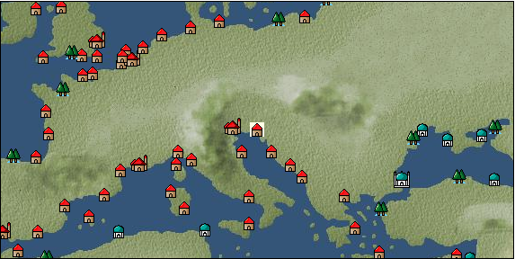

# Port: トリエステ

import Tabs from '@theme/Tabs';
import TabItem from '@theme/TabItem';

## General Information

| Attribute | Details |
| :--- | :--- |
| **Port Name** | trieste |
| **Port Type** | 領地 |
| **Region** | eastern europe |
| **Sea Area** | adriatic sea |
| **Required Language** | italian |
| **Coordinates** | （650，2822） |
| **Investment Reward** |  |

### Available Facilities

| guild | intermediary | exchange | tool shop | workshop craftsman | Painter | sculptor | peddler |
| --- | --- | --- | --- | --- | --- | --- | --- |
|   |   | ○ | ○ |   |   |   |   |
| Shipyard Master | Lumbermaker | Sail-maker | weapon craftsman | master | TavernFemale | archive | salesperson |
| --- | --- | --- | --- | --- | --- | --- | --- |
|   |   |   | ○ |   |   |   |   |
| Shipwright | 銀行 | street worker | 王宮 | Trading post | church | suburbs | translator |
| --- | --- | --- | --- | --- | --- | --- | --- |
| ○ | ○ | ○ |   |   |   |   |   |

### Description
A city near Venice. Located at the far end of the Adriatic Sea, it has prospered as a port town since the ancient Roman era. In the winter, extremely strong winds called boras blow. Cultural area: Italy/Southern France

<Tabs>
  <TabItem value="trade_goods_sales" label="Trade Goods Sales">

| item | group | purchase price | 同盟時 | remarks |
| --- | --- | --- | --- | --- |
| [arquebus gun](Items/Trade Goods/TradeGoods-Firearms/item_14.md) | [Trading Items (Firearms)](Categories/category_17.md) | 1,673 | (1,464) |  |
| Period-limited (1st period of 16th century, 2nd period of 16th century, 3rd period of 16th century) During alliance: Confirmed at 100% |
| [coral](Items/Trade Goods/TradeGoods-Gems/item_141.md) | [Trading Items (Gemstones)](Categories/category_15.md) | 2,990 | 2,990 |  |
| Investment required (Required investment amount: 720,000) Added in EO Chapter 4 At alliance: Confirmed at 100% |
| [wine](Items/Trade Goods/TradeGoods-Alcohol/item_11.md) | [交易品（酒類）](Categories/category_9.md) | 429 | 376 |  |
| When in alliance: confirmed at 100% |
| [egg](Items/Trade Goods/TradeGoods-Foodstuffs/item_40.md) | [Trading items (food items)](Categories/category_3.md) | 28 | 24 |  |
| When in alliance: confirmed at 100% |
| [one handed sword](Items/Trade Goods/TradeGoods-Weapons/item_433.md) | [Trading Items (Arms)](Categories/category_16.md) | 885 | (775) |  |
| Period-limited (15th century 1st period, 16th century 2nd period, 16th century 3rd period, 16th century 4th period) Alliance time: 100% confirmed |
| [ivory](Items/Trade Goods/TradeGoods-Gems/item_699.md) | [Trading Items (Gemstones)](Categories/category_15.md) | 2,855 | (2,498) |  |
| 時代限定（15世紀第1期、15世紀第2期、15世紀第3期、15世紀第4期） |
| [魚肉](Items/Trade Goods/TradeGoods-Foodstuffs/item_10.md) | [Trading items (food items)](Categories/category_3.md) | 146 | 128 |  |
| When in alliance: confirmed at 100% |
  </TabItem>
  <TabItem value="sale_specialty" label="Sale (Specialty)">

| item | group | sale price | 同盟時 | remarks |
| --- | --- | --- | --- | --- |

#### [交易品（繊維）](Categories/category_1.md)

| [alpaca hair](Items/Trade Goods/TradeGoods-Fibers/item_3009.md) | [交易品（繊維）](Categories/category_1.md) | (2,349) | 2,740 |  |
| When in alliance: confirmed at 100% |
| [Rush](Items/Trade Goods/TradeGoods-Fibers/item_3675.md) | [交易品（繊維）](Categories/category_1.md) | (3,720) | 4,340 |  |
| When in alliance: confirmed at 100% |
| [sisal hemp](Items/Trade Goods/TradeGoods-Fibers/item_1766.md) | [交易品（繊維）](Categories/category_1.md) | (329) | 383 |  |
| When in alliance: confirmed at 100% |
| [Basho](Items/Trade Goods/TradeGoods-Fibers/item_3862.md) | [交易品（繊維）](Categories/category_1.md) | (26,681) | 31,132 |  |
| When in alliance: confirmed at 100% |
| [Panya](Items/Trade Goods/TradeGoods-Fibers/item_2097.md) | [交易品（繊維）](Categories/category_1.md) | (706) | 823 |  |
| When in alliance: confirmed at 100% |
| [flax](Items/Trade Goods/TradeGoods-Fibers/item_64.md) | [交易品（繊維）](Categories/category_1.md) | (275) | 320 |  |
| [feather](Items/Trade Goods/TradeGoods-Fibers/item_585.md) | [交易品（繊維）](Categories/category_1.md) | (784) | 914 |  |
| When in alliance: confirmed at 100% |
| [tiger skin](Items/Trade Goods/TradeGoods-Fibers/item_3790.md) | [交易品（繊維）](Categories/category_1.md) | (30,938) | 36,100 |  |
| 98％＝35400　104％＝37400 |
| [Green ramie](Items/Trade Goods/TradeGoods-Fibers/item_3428.md) | [交易品（繊維）](Categories/category_1.md) | (32,652) | 38,100 |  |
| 98％＝37400　104％＝39600 |
| [deerskin](Items/Trade Goods/TradeGoods-Fibers/item_3648.md) | [交易品（繊維）](Categories/category_1.md) | (30,767) | 35,900 |  |
| When in alliance: confirmed at 100% |

#### [Trading Goods (Dye)](Categories/category_2.md)

| [Indian Akane](Items/Trade Goods/TradeGoods-Dye/item_1037.md) | [Trading Goods (Dye)](Categories/category_2.md) | (1,089) | 1,270 |  |
| When in alliance: confirmed at 100% |
| [Indian indigo](Items/Trade Goods/TradeGoods-Dye/item_157.md) | [Trading Goods (Dye)](Categories/category_2.md) | (1,115) | 1,300 |  |
| When in alliance: confirmed at 100% |
| [cochineal](Items/Trade Goods/TradeGoods-Dye/item_1817.md) | [Trading Goods (Dye)](Categories/category_2.md) | (1,466) | 1,710 |  |
| When in alliance: confirmed at 100% |
| [Shorou](Items/Trade Goods/TradeGoods-Dye/item_3691.md) | [Trading Goods (Dye)](Categories/category_2.md) | (29,824) | 34,800 |  |
| When in alliance: confirmed at 100% |
| [turmeric](Items/Trade Goods/TradeGoods-Dye/item_1433.md) | [Trading Goods (Dye)](Categories/category_2.md) | (662) | 772 |  |
| When in alliance: confirmed at 100% |
| [mayan blue](Items/Trade Goods/TradeGoods-Dye/item_1096.md) | [Trading Goods (Dye)](Categories/category_2.md) | (1,406) | 1,640 |  |
| When in alliance: confirmed at 100% |
| [mimosa](Items/Trade Goods/TradeGoods-Dye/item_2281.md) | [Trading Goods (Dye)](Categories/category_2.md) | (1,320) | 1,540 |  |
| 98％＝1520　102％＝1560 |
| [gallnut](Items/Trade Goods/TradeGoods-Dye/item_3429.md) | [Trading Goods (Dye)](Categories/category_2.md) | (44,993) | 52,500 |  |
| 98％＝51500　104％＝54600 |
| [purple root](Items/Trade Goods/TradeGoods-Dye/item_3752.md) | [Trading Goods (Dye)](Categories/category_2.md) | (30,852) | 36,000 |  |
| 98％＝35300　103％＝37000 |

#### [Trading items (food items)](Categories/category_3.md)

| [buckwheat](Items/Trade Goods/TradeGoods-Foodstuffs/item_3430.md) | [Trading items (food items)](Categories/category_3.md) | (45,164) | 52,700 |  |
| When in alliance: confirmed at 100% |
| [Karasumi](Items/Trade Goods/TradeGoods-Foodstuffs/item_3687.md) | [Trading items (food items)](Categories/category_3.md) | (31,624) | 36,900 |  |
| 98％＝36200　103％＝38000 |
| [kangaroo meat](Items/Trade Goods/TradeGoods-Foodstuffs/item_2285.md) | [Trading items (food items)](Categories/category_3.md) | (803) | 936 |  |
| When in alliance: confirmed at 100% |
| [cactus](Items/Trade Goods/TradeGoods-Foodstuffs/item_2740.md) | [Trading items (food items)](Categories/category_3.md) | (391) | 456 |  |
| When in alliance: confirmed at 100% |
| [taro](Items/Trade Goods/TradeGoods-Foodstuffs/item_1960.md) | [Trading items (food items)](Categories/category_3.md) | (235) | 274 |  |
| When in alliance: confirmed at 100% |
| [Chamtashima](Items/Trade Goods/TradeGoods-Foodstuffs/item_3771.md) | [Trading items (food items)](Categories/category_3.md) | (1,423) | 1,660 |  |
| 98％＝1650　103％＝1680 |
| [楊州栗](Items/Trade Goods/TradeGoods-Foodstuffs/item_3789.md) | [Trading items (food items)](Categories/category_3.md) | (9,256) | 10,800 |  |
| 98％＝49500　105％＝53000 |

#### [交易品（調味料）](Categories/category_4.md)

| [oyster sauce](Items/Trade Goods/TradeGoods-Seasonings/item_3505.md) | [交易品（調味料）](Categories/category_4.md) | (2,794) | 3,260 |  |
| When in alliance: confirmed at 100% |
| [Gochujang](Items/Trade Goods/TradeGoods-Seasonings/item_3591.md) | [交易品（調味料）](Categories/category_4.md) | (6,608) | 7,710 |  |
| 98％＝7580　104％＝7980 |
| [tamarind](Items/Trade Goods/TradeGoods-Seasonings/item_1968.md) | [交易品（調味料）](Categories/category_4.md) | (1,869) | 2,180 |  |
| 98％＝2140　104％＝2250 |
| [Choshi](Items/Trade Goods/TradeGoods-Seasonings/item_3793.md) | [交易品（調味料）](Categories/category_4.md) | (30,681) | 35,800 |  |
| 98％＝35100　103％＝36800 |
| [Nampula](Items/Trade Goods/TradeGoods-Seasonings/item_1972.md) | [交易品（調味料）](Categories/category_4.md) | (525) | 612 |  |
| When in alliance: confirmed at 100% |
| [apple cider vinegar](Items/Trade Goods/TradeGoods-Seasonings/item_882.md) | [交易品（調味料）](Categories/category_4.md) | (428) | 499 |  |
| 98％＝490　101％＝503 |
| [miso](Items/Trade Goods/TradeGoods-Seasonings/item_3420.md) | [交易品（調味料）](Categories/category_4.md) | (3,643) | 4,250 |  |
| When in alliance: confirmed at 100% |
| [Sha Cha Ji](Items/Trade Goods/TradeGoods-Seasonings/item_3689.md) | [交易品（調味料）](Categories/category_4.md) | (43,965) | 51,300 |  |
| When in alliance: confirmed at 100% |
| [Bean sauce](Items/Trade Goods/TradeGoods-Seasonings/item_3875.md) | [交易品（調味料）](Categories/category_4.md) | (34,023) | 39,700 |  |
| When in alliance: confirmed at 100% |
| [soy sauce](Items/Trade Goods/TradeGoods-Seasonings/item_3425.md) | [交易品（調味料）](Categories/category_4.md) | (45,250) | 52,800 |  |
| 98％＝51800　104％＝54900 |
| [black vinegar](Items/Trade Goods/TradeGoods-Seasonings/item_3475.md) | [交易品（調味料）](Categories/category_4.md) | (4,611) | 5,380 |  |
| 98％＝5290　104％＝5560 |

#### [交易品（雑貨）](Categories/category_5.md)

| [old ink stick](Items/Trade Goods/TradeGoods-Misc/item_3921.md) | [交易品（雑貨）](Categories/category_5.md) | (9,513) | 11,100 |  |
| When in alliance: confirmed at 100% |
| [Japanese books](Items/Trade Goods/TradeGoods-Misc/item_3439.md) | [交易品（雑貨）](Categories/category_5.md) | (34,366) | 40,100 |  |
| When in alliance: confirmed at 100% |
| [lantern](Items/Trade Goods/TradeGoods-Misc/item_3683.md) | [交易品（雑貨）](Categories/category_5.md) | (53,134) | 62,000 |  |
| When in alliance: confirmed at 100% |
| [Korean books](Items/Trade Goods/TradeGoods-Misc/item_3750.md) | [交易品（雑貨）](Categories/category_5.md) | (31,024) | 36,200 |  |
| When in alliance: confirmed at 100% |
| [rattan work](Items/Trade Goods/TradeGoods-Misc/item_3698.md) | [交易品（雑貨）](Categories/category_5.md) | (30,767) | 35,900 |  |
| When in alliance: confirmed at 100% |

#### [Trading products (medical products)](Categories/category_6.md)

| [dog saffron](Items/Trade Goods/TradeGoods-Medicine/item_1055.md) | [Trading products (medical products)](Categories/category_6.md) | (478) | 557 |  |
| 98%＝547　104%＝578 |
| [Saikaku](Items/Trade Goods/TradeGoods-Medicine/item_1959.md) | [Trading products (medical products)](Categories/category_6.md) | (4,114) | 4,800 |  |
| When in alliance: confirmed at 100% |
| [tea tree](Items/Trade Goods/TradeGoods-Medicine/item_2283.md) | [Trading products (medical products)](Categories/category_6.md) | (1,277) | 1,490 |  |
| When in alliance: confirmed at 100% |
| [Noni](Items/Trade Goods/TradeGoods-Medicine/item_2099.md) | [Trading products (medical products)](Categories/category_6.md) | (1,200) | 1,400 |  |
| When in alliance: confirmed at 100% |
| [heath](Items/Trade Goods/TradeGoods-Medicine/item_63.md) | [Trading products (medical products)](Categories/category_6.md) | (366) | 426 |  |
| 98％＝418　102％＝433 |
| [Borei](Items/Trade Goods/TradeGoods-Medicine/item_3678.md) | [Trading products (medical products)](Categories/category_6.md) | (44,650) | 52,100 |  |
| 98％＝51100　105％＝54700 |
| [Korean ginseng](Items/Trade Goods/TradeGoods-Medicine/item_3738.md) | [Trading products (medical products)](Categories/category_6.md) | (30,681) | 35,800 |  |
| 98％＝35100　106％＝37900 |
| [calamus](Items/Trade Goods/TradeGoods-Medicine/item_3427.md) | [Trading products (medical products)](Categories/category_6.md) | (33,938) | 39,600 |  |
| When in alliance: confirmed at 100% |

#### [Trading Items (Iron Stone)](Categories/category_7.md)

| [Hokutolite](Items/Trade Goods/TradeGoods-Minerals/item_3694.md) | [Trading Items (Iron Stone)](Categories/category_7.md) | (32,224) | 37,600 |  |
| 98％＝36900　103％＝38700 |
| [white porcelain ore](Items/Trade Goods/TradeGoods-Minerals/item_3433.md) | [Trading Items (Iron Stone)](Categories/category_7.md) | (34,880) | 40,700 |  |
| 98％＝39900　103％＝41800 |
| [medical stone](Items/Trade Goods/TradeGoods-Minerals/item_3786.md) | [Trading Items (Iron Stone)](Categories/category_7.md) | (31,110) | 36,300 |  |
| When in alliance: confirmed at 100% |

#### [Trading products (precious metals)](Categories/category_8.md)

| [platinum](Items/Trade Goods/TradeGoods-Metals/item_2178.md) | [Trading products (precious metals)](Categories/category_8.md) | (6,514) | 7,600 |  |
| [佐摩銀](Items/Trade Goods/TradeGoods-Metals/item_3432.md) | [Trading products (precious metals)](Categories/category_8.md) | (36,680) | 42,800 |  |
| When in alliance: confirmed at 100% |
| [Korean silver](Items/Trade Goods/TradeGoods-Metals/item_3796.md) | [Trading products (precious metals)](Categories/category_8.md) | (31,281) | 36,500 |  |
| When in alliance: confirmed at 100% |
| [Jinguashijin](Items/Trade Goods/TradeGoods-Metals/item_3693.md) | [Trading products (precious metals)](Categories/category_8.md) | (30,938) | 36,100 |  |
| When in alliance: confirmed at 100% |

#### [交易品（酒類）](Categories/category_9.md)

| [aquavit](Items/Trade Goods/TradeGoods-Alcohol/item_572.md) | [交易品（酒類）](Categories/category_9.md) | (774) | 902 |  |
| [whiskey](Items/Trade Goods/TradeGoods-Alcohol/item_1.md) | [交易品（酒類）](Categories/category_9.md) | (823) | 960 |  |
| [tequila](Items/Trade Goods/TradeGoods-Alcohol/item_108.md) | [交易品（酒類）](Categories/category_9.md) | (1,972) | 2,300 |  |
| 98%＝2270 |
| [fruit brandy](Items/Trade Goods/TradeGoods-Alcohol/item_1440.md) | [交易品（酒類）](Categories/category_9.md) | (667) | 778 |  |
| When in alliance: confirmed at 100% |
| [Taiwan rice wine](Items/Trade Goods/TradeGoods-Alcohol/item_3672.md) | [交易品（酒類）](Categories/category_9.md) | (31,024) | 36,200 |  |
| When in alliance: confirmed at 100% |
| [Andong soju](Items/Trade Goods/TradeGoods-Alcohol/item_3757.md) | [交易品（酒類）](Categories/category_9.md) | (31,024) | 36,200 |  |
| When in alliance: confirmed at 100% |
| [Sake](Items/Trade Goods/TradeGoods-Alcohol/item_3424.md) | [交易品（酒類）](Categories/category_9.md) | (34,623) | 40,400 |  |
| When in alliance: confirmed at 100% |

#### [Trading goods (hobby goods)](Categories/category_10.md)

| [Aigyoku](Items/Trade Goods/TradeGoods-Sunddries/item_3677.md) | [Trading goods (hobby goods)](Categories/category_10.md) | (30,510) | 35,600 |  |
| When in alliance: confirmed at 100% |
| [cacao](Items/Trade Goods/TradeGoods-Sunddries/item_140.md) | [Trading goods (hobby goods)](Categories/category_10.md) | (1,286) | 1,500 |  |
| When in alliance: confirmed at 100% |
| [cashew nuts](Items/Trade Goods/TradeGoods-Sunddries/item_2120.md) | [Trading goods (hobby goods)](Categories/category_10.md) | (866) | 1,010 |  |
| When in alliance: confirmed at 100% |
| [caviar](Items/Trade Goods/TradeGoods-Sunddries/item_2122.md) | [Trading goods (hobby goods)](Categories/category_10.md) | (1,149) | 1,340 |  |
| When in alliance: confirmed at 100% |
| [durian](Items/Trade Goods/TradeGoods-Sunddries/item_1949.md) | [Trading goods (hobby goods)](Categories/category_10.md) | (1,560) | 1,820 |  |
| When in alliance: confirmed at 100% |
| [eggplant](Items/Trade Goods/TradeGoods-Sunddries/item_3426.md) | [Trading goods (hobby goods)](Categories/category_10.md) | (32,652) | 38,100 |  |
| When in alliance: confirmed at 100% |
| [banana](Items/Trade Goods/TradeGoods-Sunddries/item_1947.md) | [Trading goods (hobby goods)](Categories/category_10.md) | (454) | 529 |  |
| 98％＝521　101％＝532 |
| [pineapple](Items/Trade Goods/TradeGoods-Sunddries/item_867.md) | [Trading goods (hobby goods)](Categories/category_10.md) | (1,834) | 2,140 |  |
| When in alliance: confirmed at 100% |
| [pistachio](Items/Trade Goods/TradeGoods-Sunddries/item_2353.md) | [Trading goods (hobby goods)](Categories/category_10.md) | (801) | 934 |  |
| When in alliance: confirmed at 100% |
| [peanuts](Items/Trade Goods/TradeGoods-Sunddries/item_134.md) | [Trading goods (hobby goods)](Categories/category_10.md) | (395) | 460 |  |
| When in alliance: confirmed at 100% |
| [macadamia nuts](Items/Trade Goods/TradeGoods-Sunddries/item_2282.md) | [Trading goods (hobby goods)](Categories/category_10.md) | (1,029) | 1,200 |  |
| When in alliance: confirmed at 100% |
| [mango](Items/Trade Goods/TradeGoods-Sunddries/item_2095.md) | [Trading goods (hobby goods)](Categories/category_10.md) | (786) | 916 |  |
| When in alliance: confirmed at 100% |
| [lemon myrtle](Items/Trade Goods/TradeGoods-Sunddries/item_2840.md) | [Trading goods (hobby goods)](Categories/category_10.md) | (1,963) | 2,290 |  |
| When in alliance: confirmed at 100% |
| [Chinese tea](Items/Trade Goods/TradeGoods-Sunddries/item_3907.md) | [Trading goods (hobby goods)](Categories/category_10.md) | (33,595) | 39,200 |  |
| When in alliance: confirmed at 100% |
| [dried apple](Items/Trade Goods/TradeGoods-Sunddries/item_19.md) | [Trading goods (hobby goods)](Categories/category_10.md) | (369) | 430 |  |
| When in alliance: confirmed at 100% |
| [Korean tea](Items/Trade Goods/TradeGoods-Sunddries/item_3751.md) | [Trading goods (hobby goods)](Categories/category_10.md) | (30,852) | 36,000 |  |
| When in alliance: confirmed at 100% |
| [black tea](Items/Trade Goods/TradeGoods-Sunddries/item_675.md) | [Trading goods (hobby goods)](Categories/category_10.md) | (2,212) | 2,580 |  |
| When in alliance: confirmed at 100% |
| [金針花](Items/Trade Goods/TradeGoods-Sunddries/item_3739.md) | [Trading goods (hobby goods)](Categories/category_10.md) | (9,342) | 10,900 |  |
| When in alliance: confirmed at 100% |

#### [Trading Goods (Spices)](Categories/category_11.md)

| [ylang ylang](Items/Trade Goods/TradeGoods-Perfume/item_1434.md) | [Trading Goods (Spices)](Categories/category_11.md) | (1,680) | 1,960 |  |
| 98%＝1930　103%＝2010 |
| [orange oil](Items/Trade Goods/TradeGoods-Perfume/item_778.md) | [Trading Goods (Spices)](Categories/category_11.md) | (1,123) | 1,310 |  |
| When in alliance: confirmed at 100% |
| [gardenia](Items/Trade Goods/TradeGoods-Perfume/item_1091.md) | [Trading Goods (Spices)](Categories/category_11.md) | (31,967) | 37,300 |  |
| 98％＝36600　104％＝38800 |
| [jasmine](Items/Trade Goods/TradeGoods-Perfume/item_772.md) | [Trading Goods (Spices)](Categories/category_11.md) | (4,825) | 5,630 |  |
| 98%＝6460　107%＝6790 |
| [daffodil](Items/Trade Goods/TradeGoods-Perfume/item_612.md) | [Trading Goods (Spices)](Categories/category_11.md) | (808) | 942 |  |
| [lily of the valley](Items/Trade Goods/TradeGoods-Perfume/item_358.md) | [Trading Goods (Spices)](Categories/category_11.md) | (1,348) | 1,572 |  |
| 98%＝1540 |
| [geranium](Items/Trade Goods/TradeGoods-Perfume/item_145.md) | [Trading Goods (Spices)](Categories/category_11.md) | (1,089) | 1,270 |  |
| 98%＝1240　102%＝1290 |
| [Chindarle](Items/Trade Goods/TradeGoods-Perfume/item_3795.md) | [Trading Goods (Spices)](Categories/category_11.md) | (30,767) | 35,900 |  |
| 98％＝35200　103％＝36900 |
| [Hamanasu](Items/Trade Goods/TradeGoods-Perfume/item_3692.md) | [Trading Goods (Spices)](Categories/category_11.md) | (30,938) | 36,100 |  |
| When in alliance: confirmed at 100% |
| [patchouli](Items/Trade Goods/TradeGoods-Perfume/item_1963.md) | [Trading Goods (Spices)](Categories/category_11.md) | (2,554) | 2,980 |  |
| 98％＝2950 103％＝3020 |
| [eucalyptus](Items/Trade Goods/TradeGoods-Perfume/item_2278.md) | [Trading Goods (Spices)](Categories/category_11.md) | (952) | 1,110 |  |
| When in alliance: confirmed at 100% |
| [mastic](Items/Trade Goods/TradeGoods-Perfume/item_680.md) | [Trading Goods (Spices)](Categories/category_11.md) | (2,314) | 2,700 |  |
| When in alliance: confirmed at 100% |
| [Tang Muxiang](Items/Trade Goods/TradeGoods-Perfume/item_593.md) | [Trading Goods (Spices)](Categories/category_11.md) | (1,560) | 1,820 |  |
| When in alliance: confirmed at 100% |
| [benzoin](Items/Trade Goods/TradeGoods-Perfume/item_1962.md) | [Trading Goods (Spices)](Categories/category_11.md) | (1,740) | 2,030 |  |
| When in alliance: confirmed at 100% |
| [sandalwood](Items/Trade Goods/TradeGoods-Perfume/item_771.md) | [Trading Goods (Spices)](Categories/category_11.md) | (3,634) | 4,240 |  |
| When in alliance: confirmed at 100% |
| [龍脳](Items/Trade Goods/TradeGoods-Perfume/item_1676.md) | [Trading Goods (Spices)](Categories/category_11.md) | (2,640) | 3,080 |  |
| When in alliance: confirmed at 100% |

#### [Trading Goods (Spices)](Categories/category_12.md)

| [allspice](Items/Trade Goods/TradeGoods-Spices/item_1848.md) | [Trading Goods (Spices)](Categories/category_12.md) | (1,586) | 1,850 |  |
| When in alliance: confirmed at 100% |
| [cardamom](Items/Trade Goods/TradeGoods-Spices/item_1431.md) | [Trading Goods (Spices)](Categories/category_12.md) | (4,568) | 5,330 |  |
| When in alliance: confirmed at 100% |
| [garam masala](Items/Trade Goods/TradeGoods-Spices/item_965.md) | [Trading Goods (Spices)](Categories/category_12.md) | (691) | 806 |  |
| When in alliance: confirmed at 100% |
| [Kouzuku](Items/Trade Goods/TradeGoods-Spices/item_3690.md) | [Trading Goods (Spices)](Categories/category_12.md) | (32,138) | 37,500 |  |
| 98％＝36800　103％＝38600 |
| [pepper](Items/Trade Goods/TradeGoods-Spices/item_58.md) | [Trading Goods (Spices)](Categories/category_12.md) | 9,311 | (10,475) |  |
| [Sanshou](Items/Trade Goods/TradeGoods-Spices/item_3794.md) | [Trading Goods (Spices)](Categories/category_12.md) | (30,938) | 36,100 |  |
| 98％＝35400　104％＝37500 |
| [cinnamon](Items/Trade Goods/TradeGoods-Spices/item_1432.md) | [Trading Goods (Spices)](Categories/category_12.md) | (4,740) | 5,530 |  |
| When in alliance: confirmed at 100% |
| [lemongrass](Items/Trade Goods/TradeGoods-Spices/item_2096.md) | [Trading Goods (Spices)](Categories/category_12.md) | (2,914) | 3,400 |  |
| When in alliance: confirmed at 100% |
| [chili pepper](Items/Trade Goods/TradeGoods-Spices/item_1831.md) | [Trading Goods (Spices)](Categories/category_12.md) | (1,457) | 1,700 |  |
| 98%＝1670　102%＝1730 |
| [Grapefruit](Items/Trade Goods/TradeGoods-Spices/item_3422.md) | [Trading Goods (Spices)](Categories/category_12.md) | (34,538) | 40,300 |  |
| 98％＝39500　105％＝42300 |
| [green chili pepper](Items/Trade Goods/TradeGoods-Spices/item_1990.md) | [Trading Goods (Spices)](Categories/category_12.md) | (2,297) | 2,680 |  |
| When in alliance: confirmed at 100% |

#### [Trading goods (artificial goods)](Categories/category_13.md)

| [Tumbaga](Items/Trade Goods/TradeGoods-Luxuries/item_3028.md) | [Trading goods (artificial goods)](Categories/category_13.md) | (16,969) | 19,800 |  |
| 98%＝19500　107%＝20900 |
| [Kuresute](Items/Trade Goods/TradeGoods-Luxuries/item_3897.md) | [Trading goods (artificial goods)](Categories/category_13.md) | (10,370) | 12,100 |  |
| When in alliance: confirmed at 100% |
| [Song Baici](Items/Trade Goods/TradeGoods-Luxuries/item_3904.md) | [Trading goods (artificial goods)](Categories/category_13.md) | (45,079) | 52,600 |  |
| 98％＝51600　105％＝55100 |
| [湖筆](Items/Trade Goods/TradeGoods-Luxuries/item_3898.md) | [Trading goods (artificial goods)](Categories/category_13.md) | (9,856) | 11,500 |  |
| When in alliance: confirmed at 100% |
| [lacquerware](Items/Trade Goods/TradeGoods-Luxuries/item_3435.md) | [Trading goods (artificial goods)](Categories/category_13.md) | (36,080) | 42,100 |  |
| 98％＝41300　103％＝43300 |
| [Saori](Items/Trade Goods/TradeGoods-Luxuries/item_3676.md) | [Trading goods (artificial goods)](Categories/category_13.md) | (9,685) | 11,300 |  |
| When in alliance: confirmed at 100% |
| [Corner work](Items/Trade Goods/TradeGoods-Luxuries/item_3696.md) | [Trading goods (artificial goods)](Categories/category_13.md) | (43,108) | 50,300 |  |
| 98％＝49300　103％＝51800 |
| [Goryeo celadon](Items/Trade Goods/TradeGoods-Luxuries/item_3758.md) | [Trading goods (artificial goods)](Categories/category_13.md) | (43,279) | 50,500 |  |
| 98％＝49500　105％＝53000 |

#### [交易品（美術品）](Categories/category_14.md)

| [taiwan wood carving](Items/Trade Goods/TradeGoods-Art/item_3697.md) | [交易品（美術品）](Categories/category_14.md) | (30,424) | 35,500 |  |
| 98％＝34800　104％＝36800 |
| [Japanese painting](Items/Trade Goods/TradeGoods-Art/item_3436.md) | [交易品（美術品）](Categories/category_14.md) | (42,251) | 49,300 |  |
| When in alliance: confirmed at 100% |
| [Mother-of-pearl lacquerware](Items/Trade Goods/TradeGoods-Art/item_3785.md) | [交易品（美術品）](Categories/category_14.md) | (44,479) | 51,900 |  |
| When in alliance: confirmed at 100% |

#### [Trading Items (Gemstones)](Categories/category_15.md)

| [jade](Items/Trade Goods/TradeGoods-Gems/item_2015.md) | [Trading Items (Gemstones)](Categories/category_15.md) | (4,705) | 5,490 |  |
| When in alliance: confirmed at 100% |
| [Tortoiseshell](Items/Trade Goods/TradeGoods-Gems/item_1980.md) | [Trading Items (Gemstones)](Categories/category_15.md) | (3,617) | 4,220 |  |
| When in alliance: confirmed at 100% |
| [sapphire](Items/Trade Goods/TradeGoods-Gems/item_676.md) | [Trading Items (Gemstones)](Categories/category_15.md) | (10,584) | 12,350 |  |
| When in alliance: confirmed at 100% |
| [turquoise](Items/Trade Goods/TradeGoods-Gems/item_1006.md) | [Trading Items (Gemstones)](Categories/category_15.md) | (3,411) | 3,980 |  |
| When in alliance: confirmed at 100% |
| [topaz](Items/Trade Goods/TradeGoods-Gems/item_1097.md) | [Trading Items (Gemstones)](Categories/category_15.md) | 5,330 | (5,996) |  |
| [pink diamond](Items/Trade Goods/TradeGoods-Gems/item_2874.md) | [Trading Items (Gemstones)](Categories/category_15.md) | (12,941) | 15,100 |  |
| [lapis lazuli](Items/Trade Goods/TradeGoods-Gems/item_995.md) | [Trading Items (Gemstones)](Categories/category_15.md) | (5,485) | 6,400 |  |
| [ruby](Items/Trade Goods/TradeGoods-Gems/item_773.md) | [Trading Items (Gemstones)](Categories/category_15.md) | (10,835) | 12,642 |  |
| [taiwan sapphire](Items/Trade Goods/TradeGoods-Gems/item_3695.md) | [Trading Items (Gemstones)](Categories/category_15.md) | (45,079) | 52,600 |  |
| When in alliance: confirmed at 100% |
| [amber](Items/Trade Goods/TradeGoods-Gems/item_618.md) | [Trading Items (Gemstones)](Categories/category_15.md) | (3,951) | 4,610 |  |
| [amethyst](Items/Trade Goods/TradeGoods-Gems/item_3434.md) | [Trading Items (Gemstones)](Categories/category_15.md) | (37,023) | 43,200 |  |
| When in alliance: confirmed at 100% |
| [tiger eye stone](Items/Trade Goods/TradeGoods-Gems/item_3797.md) | [Trading Items (Gemstones)](Categories/category_15.md) | (30,681) | 35,800 |  |
| When in alliance: confirmed at 100% |

#### [Trading Items (Arms)](Categories/category_16.md)

| [Japanese bow](Items/Trade Goods/TradeGoods-Weapons/item_3469.md) | [Trading Items (Arms)](Categories/category_16.md) | (11,141) | 13,000 |  |
| 98％＝12800　101％＝13100 |
| [broadsword](Items/Trade Goods/TradeGoods-Weapons/item_3754.md) | [Trading Items (Arms)](Categories/category_16.md) | (43,450) | 50,700 |  |
| When in alliance: confirmed at 100% |
| [Japanese sword](Items/Trade Goods/TradeGoods-Weapons/item_3437.md) | [Trading Items (Arms)](Categories/category_16.md) | (33,252) | 38,800 |  |
| When in alliance: confirmed at 100% |
| [japanese armor](Items/Trade Goods/TradeGoods-Weapons/item_3590.md) | [Trading Items (Arms)](Categories/category_16.md) | (11,056) | 12,900 |  |
| When in alliance: confirmed at 100% |
| [rattan armor](Items/Trade Goods/TradeGoods-Weapons/item_3699.md) | [Trading Items (Arms)](Categories/category_16.md) | (29,910) | 34,900 |  |
| 98％＝34200　104％＝36200 |

#### [Trading Items (Firearms)](Categories/category_17.md)

| [monocular gun](Items/Trade Goods/TradeGoods-Firearms/item_3916.md) | [Trading Items (Firearms)](Categories/category_17.md) | (33,423) | 39,000 |  |
| When in alliance: confirmed at 100% |
| [throwing bomb](Items/Trade Goods/TradeGoods-Firearms/item_3784.md) | [Trading Items (Firearms)](Categories/category_17.md) | (31,024) | 36,200 |  |
| When in alliance: confirmed at 100% |
| [tanegashima gun](Items/Trade Goods/TradeGoods-Firearms/item_3423.md) | [Trading Items (Firearms)](Categories/category_17.md) | (31,967) | 37,300 |  |
| When in alliance: confirmed at 100% |
| [銅手銃](Items/Trade Goods/TradeGoods-Firearms/item_3700.md) | [Trading Items (Firearms)](Categories/category_17.md) | (30,253) | 35,300 |  |
| When in alliance: confirmed at 100% |

#### [Trading Goods (Livestock)](Categories/category_18.md)

| [boar](Items/Trade Goods/TradeGoods-Livestock/item_3476.md) | [Trading Goods (Livestock)](Categories/category_18.md) | (32,309) | 37,700 |  |
| When in alliance: confirmed at 100% |
| [water buffalo](Items/Trade Goods/TradeGoods-Livestock/item_3688.md) | [Trading Goods (Livestock)](Categories/category_18.md) | (1,440) | 1,680 |  |
| When in alliance: confirmed at 100% |
| [韓牛](Items/Trade Goods/TradeGoods-Livestock/item_3792.md) | [Trading Goods (Livestock)](Categories/category_18.md) | (37,451) | 43,700 |  |
| When in alliance: confirmed at 100% |

#### [交易品（工業品）](Categories/category_19.md)

| [papyrus](Items/Trade Goods/TradeGoods-Wares/item_616.md) | [交易品（工業品）](Categories/category_19.md) | 537 | (604) |  |
| [Japanese paper](Items/Trade Goods/TradeGoods-Wares/item_3438.md) | [交易品（工業品）](Categories/category_19.md) | (33,938) | 39,600 |  |
| When in alliance: confirmed at 100% |
| [paint](Items/Trade Goods/TradeGoods-Wares/item_3411.md) | [交易品（工業品）](Categories/category_19.md) | (2,623) | 3,060 |  |
| When in alliance: confirmed at 100% |
| [bamboo](Items/Trade Goods/TradeGoods-Wares/item_3899.md) | [交易品（工業品）](Categories/category_19.md) | (33,595) | 39,200 |  |
| When in alliance: confirmed at 100% |
| [rattan](Items/Trade Goods/TradeGoods-Wares/item_3701.md) | [交易品（工業品）](Categories/category_19.md) | (30,424) | 35,500 |  |
| When in alliance: confirmed at 100% |
| [韓紙](Items/Trade Goods/TradeGoods-Wares/item_3755.md) | [交易品（工業品）](Categories/category_19.md) | (31,367) | 36,600 |  |
| When in alliance: confirmed at 100% |

#### [交易品（織物）](Categories/category_20.md)

| [Awaiyo](Items/Trade Goods/TradeGoods-Fabrics/item_3002.md) | [交易品（織物）](Categories/category_20.md) | (8,091) | 9,440 |  |
| When in alliance: confirmed at 100% |
| [indian chintz](Items/Trade Goods/TradeGoods-Fabrics/item_159.md) | [交易品（織物）](Categories/category_20.md) | (2,229) | 2,600 |  |
| When in alliance: confirmed at 100% |
| [gobelin weave](Items/Trade Goods/TradeGoods-Fabrics/item_1276.md) | [交易品（織物）](Categories/category_20.md) | (3,634) | 4,240 |  |
| When in alliance: confirmed at 100% |
| [taffeta](Items/Trade Goods/TradeGoods-Fabrics/item_1001.md) | [交易品（織物）](Categories/category_20.md) | (5,194) | 6,060 |  |
| When in alliance: confirmed at 100% |
| [damask](Items/Trade Goods/TradeGoods-Fabrics/item_614.md) | [交易品（織物）](Categories/category_20.md) | (3,454) | 4,030 |  |
| [turkish rug](Items/Trade Goods/TradeGoods-Fabrics/item_686.md) | [交易品（織物）](Categories/category_20.md) | (4,037) | 4,710 |  |
| 98%＝4620　107％＝5010 |
| [persian rug](Items/Trade Goods/TradeGoods-Fabrics/item_606.md) | [交易品（織物）](Categories/category_20.md) | (8,176) | 9,540 |  |
| 98％＝9420　107％＝9940 |
| [China Duantong](Items/Trade Goods/TradeGoods-Fabrics/item_3478.md) | [交易品（織物）](Categories/category_20.md) | (18,169) | 21,200 |  |
| When in alliance: confirmed at 100% |
| [唐錦](Items/Trade Goods/TradeGoods-Fabrics/item_3896.md) | [交易品（織物）](Categories/category_20.md) | (35,052) | 40,900 |  |
| When in alliance: confirmed at 100% |
| [大和錦](Items/Trade Goods/TradeGoods-Fabrics/item_3482.md) | [交易品（織物）](Categories/category_20.md) | (18,169) | 21,200 |  |
| 98％＝20900　102％＝21500 |
| [明紬](Items/Trade Goods/TradeGoods-Fabrics/item_3753.md) | [交易品（織物）](Categories/category_20.md) | (31,452) | 36,700 |  |
| When in alliance: confirmed at 100% |
| [Bingata](Items/Trade Goods/TradeGoods-Fabrics/item_3479.md) | [交易品（織物）](Categories/category_20.md) | (18,083) | 21,100 |  |
| 98％＝20800　103％＝21600 |
| [Nishijin textile](Items/Trade Goods/TradeGoods-Fabrics/item_3431.md) | [交易品（織物）](Categories/category_20.md) | (35,652) | 41,600 |  |
| When in alliance: confirmed at 100% |
| [麻織物](Items/Trade Goods/TradeGoods-Fabrics/item_3673.md) | [交易品（織物）](Categories/category_20.md) | (31,624) | 36,900 |  |
| When in alliance: confirmed at 100% |
  </TabItem>
  <TabItem value="sale_no_specialty" label="Sale (No Specialty)">

| item | group | sale price | 同盟時 | remarks |
| --- | --- | --- | --- | --- |

#### [交易品（繊維）](Categories/category_1.md)

| [rabbit hair](Items/Trade Goods/TradeGoods-Fibers/item_1036.md) | [交易品（繊維）](Categories/category_1.md) | (836) | 975 |  |
| When in alliance: confirmed at 100% |
| [peacock feather](Items/Trade Goods/TradeGoods-Fibers/item_901.md) | [交易品（繊維）](Categories/category_1.md) | (446) | 520 |  |
| 98％＝510　107％＝557 |
| [coconut fiber](Items/Trade Goods/TradeGoods-Fibers/item_444.md) | [交易品（繊維）](Categories/category_1.md) | (182) | 212 |  |
| When in alliance: confirmed at 100% |
| [goat hair](Items/Trade Goods/TradeGoods-Fibers/item_770.md) | [交易品（繊維）](Categories/category_1.md) | (1,164) | 1,358 |  |
| [fur](Items/Trade Goods/TradeGoods-Fibers/item_634.md) | [交易品（繊維）](Categories/category_1.md) | (2,152) | 2,510 |  |
| When in alliance: confirmed at 100% |
| [cotton](Items/Trade Goods/TradeGoods-Fibers/item_610.md) | [交易品（繊維）](Categories/category_1.md) | (558) | 651 |  |
| [wool](Items/Trade Goods/TradeGoods-Fibers/item_5.md) | [交易品（繊維）](Categories/category_1.md) | (431) | 502 |  |

#### [Trading Goods (Dye)](Categories/category_2.md)

| [ward](Items/Trade Goods/TradeGoods-Dye/item_57.md) | [Trading Goods (Dye)](Categories/category_2.md) | (778) | 907 |  |
| [Gerep](Items/Trade Goods/TradeGoods-Dye/item_1814.md) | [Trading Goods (Dye)](Categories/category_2.md) | (760) | 886 |  |
| When in alliance: confirmed at 100% |
| [persian berry](Items/Trade Goods/TradeGoods-Dye/item_693.md) | [Trading Goods (Dye)](Categories/category_2.md) | (1,223) | 1,426 |  |
| [貝紫](Items/Trade Goods/TradeGoods-Dye/item_110.md) | [Trading Goods (Dye)](Categories/category_2.md) | (3,943) | 4,600 |  |

#### [Trading items (food items)](Categories/category_3.md)

| [mushroom](Items/Trade Goods/TradeGoods-Foodstuffs/item_160.md) | [Trading items (food items)](Categories/category_3.md) | 32 | 32 |  |
| [duck meat](Items/Trade Goods/TradeGoods-Foodstuffs/item_32.md) | [Trading items (food items)](Categories/category_3.md) | (391) | 456 |  |
| [olive](Items/Trade Goods/TradeGoods-Foodstuffs/item_47.md) | [Trading items (food items)](Categories/category_3.md) | (262) | 305 |  |
| When in alliance: confirmed at 100% |
| [turnip](Items/Trade Goods/TradeGoods-Foodstuffs/item_55.md) | [Trading items (food items)](Categories/category_3.md) | (72) | 84 |  |
| [pumpkin](Items/Trade Goods/TradeGoods-Foodstuffs/item_137.md) | [Trading items (food items)](Categories/category_3.md) | (243) | 283 |  |
| [Flatfish](Items/Trade Goods/TradeGoods-Foodstuffs/item_255.md) | [Trading items (food items)](Categories/category_3.md) | 27 | (30) |  |
| [Quinoa](Items/Trade Goods/TradeGoods-Foodstuffs/item_2994.md) | [Trading items (food items)](Categories/category_3.md) | (330) | 385 |  |
| When in alliance: confirmed at 100% |
| [sweet potato](Items/Trade Goods/TradeGoods-Foodstuffs/item_1931.md) | [Trading items (food items)](Categories/category_3.md) | (203) | 236 |  |
| When in alliance: confirmed at 100% |
| [potato](Items/Trade Goods/TradeGoods-Foodstuffs/item_106.md) | [Trading items (food items)](Categories/category_3.md) | (350) | 408 |  |
| [Jambu](Items/Trade Goods/TradeGoods-Foodstuffs/item_1827.md) | [Trading items (food items)](Categories/category_3.md) | (192) | 224 |  |
| 98％＝219　103％＝230 |
| [cheese](Items/Trade Goods/TradeGoods-Foodstuffs/item_20.md) | [Trading items (food items)](Categories/category_3.md) | (349) | 407 |  |
| [corn](Items/Trade Goods/TradeGoods-Foodstuffs/item_138.md) | [Trading items (food items)](Categories/category_3.md) | (193) | 225 |  |
| [crocodile meat](Items/Trade Goods/TradeGoods-Foodstuffs/item_2284.md) | [Trading items (food items)](Categories/category_3.md) | (628) | 732 |  |
| 98％＝717　102％＝746 |
| [wheat](Items/Trade Goods/TradeGoods-Foodstuffs/item_16.md) | [Trading items (food items)](Categories/category_3.md) | (56) | 65 |  |
| [Paddy rice](Items/Trade Goods/TradeGoods-Foodstuffs/item_654.md) | [Trading items (food items)](Categories/category_3.md) | (93) | 108 |  |
| When in alliance: confirmed at 100% |
| [taro](Items/Trade Goods/TradeGoods-Foodstuffs/item_3421.md) | [Trading items (food items)](Categories/category_3.md) | (292) | 340 |  |
| When in alliance: confirmed at 100% |
| [陸稲](Items/Trade Goods/TradeGoods-Foodstuffs/item_100.md) | [Trading items (food items)](Categories/category_3.md) | (96) | 112 |  |
| When in alliance: confirmed at 100% |
| [chicken meat](Items/Trade Goods/TradeGoods-Foodstuffs/item_29.md) | [Trading items (food items)](Categories/category_3.md) | (284) | 331 |  |
| When in alliance: confirmed at 100% |

#### [交易品（調味料）](Categories/category_4.md)

| [anchovies](Items/Trade Goods/TradeGoods-Seasonings/item_3004.md) | [交易品（調味料）](Categories/category_4.md) | (247) | 288 |  |
| When in alliance: confirmed at 100% |
| [olive oil](Items/Trade Goods/TradeGoods-Seasonings/item_48.md) | [交易品（調味料）](Categories/category_4.md) | (291) | 339 |  |
| [coconut vinegar](Items/Trade Goods/TradeGoods-Seasonings/item_1988.md) | [交易品（調味料）](Categories/category_4.md) | (444) | 518 |  |
| When in alliance: confirmed at 100% |
| [jam](Items/Trade Goods/TradeGoods-Seasonings/item_427.md) | [交易品（調味料）](Categories/category_4.md) | (540) | 629 |  |
| 98％＝616　102％＝641 |
| [herbal salt](Items/Trade Goods/TradeGoods-Seasonings/item_840.md) | [交易品（調味料）](Categories/category_4.md) | (223) | 260 |  |
| When in alliance: confirmed at 100% |
| [herbal vinegar](Items/Trade Goods/TradeGoods-Seasonings/item_908.md) | [交易品（調味料）](Categories/category_4.md) | (155) | 180 |  |
| When in alliance: confirmed at 100% |
| [butter](Items/Trade Goods/TradeGoods-Seasonings/item_3.md) | [交易品（調味料）](Categories/category_4.md) | (350) | 408 |  |
| When in alliance: confirmed at 100% |
| [peanut oil](Items/Trade Goods/TradeGoods-Seasonings/item_596.md) | [交易品（調味料）](Categories/category_4.md) | (415) | 484 |  |
| When in alliance: confirmed at 100% |
| [white vinegar](Items/Trade Goods/TradeGoods-Seasonings/item_56.md) | [交易品（調味料）](Categories/category_4.md) | (155) | 180 |  |
| [wine vinegar](Items/Trade Goods/TradeGoods-Seasonings/item_429.md) | [交易品（調味料）](Categories/category_4.md) | 561 | (631) |  |
| [sugar](Items/Trade Goods/TradeGoods-Seasonings/item_94.md) | [交易品（調味料）](Categories/category_4.md) | (833) | 971 |  |
| 98％＝952　101％＝981 |
| [Honey](Items/Trade Goods/TradeGoods-Seasonings/item_49.md) | [交易品（調味料）](Categories/category_4.md) | 945 | 945 |  |

#### [Trading products (medical products)](Categories/category_6.md)

| [anise](Items/Trade Goods/TradeGoods-Medicine/item_1050.md) | [Trading products (medical products)](Categories/category_6.md) | (281) | 327 |  |
| [cinchona bark](Items/Trade Goods/TradeGoods-Medicine/item_2121.md) | [Trading products (medical products)](Categories/category_6.md) | (926) | 1,080 |  |
| When in alliance: confirmed at 100% |
| [Kyonin](Items/Trade Goods/TradeGoods-Medicine/item_964.md) | [Trading products (medical products)](Categories/category_6.md) | (458) | 534 |  |
| [peonies](Items/Trade Goods/TradeGoods-Medicine/item_1051.md) | [Trading products (medical products)](Categories/category_6.md) | (370) | 431 |  |
| When in alliance: confirmed at 100% |
| [digitalis](Items/Trade Goods/TradeGoods-Medicine/item_2148.md) | [Trading products (medical products)](Categories/category_6.md) | (336) | 392 |  |
| [senna](Items/Trade Goods/TradeGoods-Medicine/item_155.md) | [Trading products (medical products)](Categories/category_6.md) | (414) | 483 |  |
| 98%＝473 |
| [dandelion](Items/Trade Goods/TradeGoods-Medicine/item_1089.md) | [Trading products (medical products)](Categories/category_6.md) | 276 | 294 |  |
| [belladonna](Items/Trade Goods/TradeGoods-Medicine/item_1056.md) | [Trading products (medical products)](Categories/category_6.md) | (471) | 549 |  |
| When in alliance: confirmed at 100% |
| [Maca](Items/Trade Goods/TradeGoods-Medicine/item_3000.md) | [Trading products (medical products)](Categories/category_6.md) | (1,852) | 2,160 |  |
| 98％＝2120　101％＝2190 |
| [rose hips](Items/Trade Goods/TradeGoods-Medicine/item_904.md) | [Trading products (medical products)](Categories/category_6.md) | (412) | 480 |  |
| 98％＝470　104％＝499 |

#### [Trading Items (Iron Stone)](Categories/category_7.md)

| [tin ore](Items/Trade Goods/TradeGoods-Minerals/item_23.md) | [Trading Items (Iron Stone)](Categories/category_7.md) | (504) | 587 |  |
| When in alliance: confirmed at 100% |
| [zinc ore](Items/Trade Goods/TradeGoods-Minerals/item_626.md) | [Trading Items (Iron Stone)](Categories/category_7.md) | (424) | 494 |  |
| When in alliance: confirmed at 100% |
| [Saltpeter](Items/Trade Goods/TradeGoods-Minerals/item_884.md) | [Trading Items (Shishi)](Categories/category_7.md) | 2,000 | 2,080 |  |
| [iron ore](Items/Trade Goods/TradeGoods-Minerals/item_146.md) | [Trading Items (Iron Stone)](Categories/category_7.md) | (672) | 784 |  |
| [lead ore](Items/Trade Goods/TradeGoods-Minerals/item_21.md) | [Trading Items (Iron Stone)](Categories/category_7.md) | (444) | 517 |  |
| When in alliance: confirmed at 100% |

#### [Trading products (precious metals)](Categories/category_8.md)

| [gold dust](Items/Trade Goods/TradeGoods-Metals/item_111.md) | [Trading products (precious metals)](Categories/category_8.md) | (3,922) | 4,576 |  |
| [gold](Items/Trade Goods/TradeGoods-Metals/item_659.md) | [Trading products (precious metals)](Categories/category_8.md) | (8,936) | 10,427 |  |
| 98％＝8680　107％＝9480 |
| [silver](Items/Trade Goods/TradeGoods-Metals/item_136.md) | [Trading products (precious metals)](Categories/category_8.md) | (2,469) | 2,880 |  |
| When in alliance: confirmed at 100% |

#### [交易品（酒類）](Categories/category_9.md)

| [sherry](Items/Trade Goods/TradeGoods-Alcohol/item_844.md) | [交易品（酒類）](Categories/category_9.md) | (444) | 518 |  |
| When in alliance: confirmed at 100% |
| [Beer](Items/Trade Goods/TradeGoods-Alcohol/item_2.md) | [交易品（酒類）](Categories/category_9.md) | (366) | 427 |  |
| [brandy](Items/Trade Goods/TradeGoods-Alcohol/item_9.md) | [交易品（酒類）](Categories/category_9.md) | 762 | 794 |  |
| [palm wine](Items/Trade Goods/TradeGoods-Alcohol/item_436.md) | [交易品（酒類）](Categories/category_9.md) | (417) | 486 |  |
| When in alliance: confirmed at 100% |
| [rum](Items/Trade Goods/TradeGoods-Alcohol/item_139.md) | [交易品（酒類）](Categories/category_9.md) | (646) | 753 |  |
| [liqueur](Items/Trade Goods/TradeGoods-Alcohol/item_18.md) | [交易品（酒類）](Categories/category_9.md) | 610 | 647 |  |
| [Shochu](Items/Trade Goods/TradeGoods-Alcohol/item_3449.md) | [交易品（酒類）](Categories/category_9.md) | (6,068) | 7,080 |  |
| When in alliance: confirmed at 100% |

#### [Trading goods (hobby goods)](Categories/category_10.md)

| [almond](Items/Trade Goods/TradeGoods-Sunddries/item_367.md) | [Trading goods (hobby goods)](Categories/category_10.md) | (179) | 208 |  |
| When in alliance: confirmed at 100% |
| [coconut](Items/Trade Goods/TradeGoods-Sunddries/item_96.md) | [Trading goods (hobby goods)](Categories/category_10.md) | (352) | 410 |  |
| When in alliance: confirmed at 100% |
| [coffee](Items/Trade Goods/TradeGoods-Sunddries/item_445.md) | [Trading goods (hobby goods)](Categories/category_10.md) | (471) | 549 |  |
| [prune](Items/Trade Goods/TradeGoods-Sunddries/item_523.md) | [Trading goods (hobby goods)](Categories/category_10.md) | 369 | 374 |  |
| [Yerba mate tea](Items/Trade Goods/TradeGoods-Sunddries/item_1808.md) | [Trading goods (hobby goods)](Categories/category_10.md) | (354) | 413 |  |
| When in alliance: confirmed at 100% |
| [raisins](Items/Trade Goods/TradeGoods-Sunddries/item_35.md) | [Trading goods (hobby goods)](Categories/category_10.md) | (304) | 354 |  |
| [dried mango](Items/Trade Goods/TradeGoods-Sunddries/item_883.md) | [Trading goods (hobby goods)](Categories/category_10.md) | (487) | 568 |  |
| 98％＝556　103％＝585 |

#### [Trading Goods (Spices)](Categories/category_11.md)

| [lavender](Items/Trade Goods/TradeGoods-Perfume/item_150.md) | [Trading Goods (Spices)](Categories/category_11.md) | (772) | 900 |  |
| [rose](Items/Trade Goods/TradeGoods-Perfume/item_536.md) | [Trading Goods (Spices)](Categories/category_11.md) | 2,847 | 2,950 |  |
| [agarwood](Items/Trade Goods/TradeGoods-Perfume/item_1058.md) | [Trading Goods (Spices)](Categories/category_11.md) | (2,160) | 2,520 |  |
| When in alliance: confirmed at 100% |
| [Ryushu incense](Items/Trade Goods/TradeGoods-Perfume/item_101.md) | [Trading Goods (Spices)](Categories/category_11.md) | (3,454) | 4,030 |  |
| 98％＝3950　107％＝4310 |
| [Musk](Items/Trade Goods/TradeGoods-Perfume/item_158.md) | [Trading Goods (Spices)](Categories/category_11.md) | (3,891) | 4,540 |  |
| When in alliance: confirmed at 100% |

#### [Trading Goods (Spices)](Categories/category_12.md)

| [oregano](Items/Trade Goods/TradeGoods-Spices/item_430.md) | [Trading Goods (Spices)](Categories/category_12.md) | (457) | 533 |  |
| When in alliance: confirmed at 100% |
| [garlic](Items/Trade Goods/TradeGoods-Spices/item_526.md) | [Trading Goods (Spices)](Categories/category_12.md) | (290) | 338 |  |
| [cumin](Items/Trade Goods/TradeGoods-Spices/item_156.md) | [Trading Goods (Spices)](Categories/category_12.md) | (975) | 1,137 |  |
| [coriander](Items/Trade Goods/TradeGoods-Spices/item_1044.md) | [Trading Goods (Spices)](Categories/category_12.md) | (415) | 484 |  |
| When in alliance: confirmed at 100% |
| [dill](Items/Trade Goods/TradeGoods-Spices/item_1093.md) | [Trading Goods (Spices)](Categories/category_12.md) | (176) | 205 |  |
| When in alliance: confirmed at 100% |
| [nutmeg](Items/Trade Goods/TradeGoods-Spices/item_1969.md) | [Trading Goods (Spices)](Categories/category_12.md) | (20,814) | 24,286 |  |
| [basil](Items/Trade Goods/TradeGoods-Spices/item_126.md) | [Trading Goods (Spices)](Categories/category_12.md) | (152) | 177 |  |
| 99％＝175　102％＝180 |
| [vanilla](Items/Trade Goods/TradeGoods-Spices/item_1810.md) | [Trading Goods (Spices)](Categories/category_12.md) | (593) | 691 |  |
| [parsley](Items/Trade Goods/TradeGoods-Spices/item_46.md) | [Trading Goods (Spices)](Categories/category_12.md) | (127) | 148 |  |
| When in alliance: confirmed at 100% |
| [fennel](Items/Trade Goods/TradeGoods-Spices/item_1045.md) | [Trading Goods (Spices)](Categories/category_12.md) | (317) | 369 |  |
| 98％＝361　103％＝380 |
| [mustard](Items/Trade Goods/TradeGoods-Spices/item_575.md) | [Trading Goods (Spices)](Categories/category_12.md) | (254) | 296 |  |
| When in alliance: confirmed at 100% |
| [mint](Items/Trade Goods/TradeGoods-Spices/item_816.md) | [Trading Goods (Spices)](Categories/category_12.md) | (175) | 204 |  |
| 99％＝199　102％＝206 |
| [mace](Items/Trade Goods/TradeGoods-Spices/item_2100.md) | [Trading Goods (Spices)](Categories/category_12.md) | (19,741) | 23,034 |  |
| [rosemary](Items/Trade Goods/TradeGoods-Spices/item_428.md) | [Trading Goods (Spices)](Categories/category_12.md) | (359) | 418 |  |
| When in alliance: confirmed at 100% |

#### [Trading goods (artificial goods)](Categories/category_13.md)

| [glasswork](Items/Trade Goods/TradeGoods-Luxuries/item_60.md) | [Trading goods (artificial goods)](Categories/category_13.md) | (1,037) | 1,210 |  |
| [coral work](Items/Trade Goods/TradeGoods-Luxuries/item_595.md) | [Trading goods (artificial goods)](Categories/category_13.md) | (2,589) | 3,020 |  |
| 98％＝2960　105％＝3170 |
| [lapidary work](Items/Trade Goods/TradeGoods-Luxuries/item_153.md) | [Trading goods (artificial goods)](Categories/category_13.md) | (3,514) | 4,100 |  |
| [皮革製品](Items/Trade Goods/TradeGoods-Luxuries/item_12.md) | [Trading goods (artificial goods)](Categories/category_13.md) | (1,132) | 1,320 |  |
| When in alliance: confirmed at 100% |
| [Ivory work](Items/Trade Goods/TradeGoods-Luxuries/item_1090.md) | [Trading goods (artificial goods)](Categories/category_13.md) | (2,820) | 3,290 |  |
| When in alliance: confirmed at 100% |
| [goldsmith](Items/Trade Goods/TradeGoods-Luxuries/item_687.md) | [Trading goods (artificial goods)](Categories/category_13.md) | (2,597) | 3,030 |  |
| [ceramics](Items/Trade Goods/TradeGoods-Luxuries/item_152.md) | [Trading goods (artificial goods)](Categories/category_13.md) | (1,295) | 1,510 |  |
| [luxury furniture](Items/Trade Goods/TradeGoods-Luxuries/item_1048.md) | [Trading goods (artificial goods)](Categories/category_13.md) | (2,383) | 2,780 |  |
| 98％＝2720　105％＝2920 |

#### [交易品（美術品）](Categories/category_14.md)

| [古美術品](Items/Trade Goods/TradeGoods-Art/item_51.md) | [交易品（美術品）](Categories/category_14.md) | 3,528 | 3,580 |  |
| [wooden statue](Items/Trade Goods/TradeGoods-Art/item_95.md) | [交易品（美術品）](Categories/category_14.md) | (1,123) | 1,310 |  |
| 98％＝1280　102％＝1330 |
| [oil painting](Items/Trade Goods/TradeGoods-Art/item_1088.md) | [交易品（美術品）](Categories/category_14.md) | (1,869) | 2,180 |  |
| When in alliance: confirmed at 100% |
| [stone statue](Items/Trade Goods/TradeGoods-Art/item_899.md) | [交易品（美術品）](Categories/category_14.md) | (1,560) | 1,820 |  |
| 98％＝1780　103％＝1870 |
| [青銅像](Items/Trade Goods/TradeGoods-Art/item_148.md) | [交易品（美術品）](Categories/category_14.md) | (926) | 1,080 |  |

#### [Trading Items (Gemstones)](Categories/category_15.md)

| [Agate](Items/Trade Goods/TradeGoods-Gems/item_107.md) | [Trading Items (Gemstones)](Categories/category_15.md) | (4,637) | 5,410 |  |
| When in alliance: confirmed at 100% |
| [emerald](Items/Trade Goods/TradeGoods-Gems/item_777.md) | [Trading Items (Gemstones)](Categories/category_15.md) | 7,860 | 8,170 |  |
| When in alliance: confirmed at 100% |
| [garnet](Items/Trade Goods/TradeGoods-Gems/item_1005.md) | [Trading Items (Gemstones)](Categories/category_15.md) | (4,260) | 4,970 |  |
| When in alliance: Confirmed at 100% |
| [coral](Items/Trade Goods/TradeGoods-Gems/item_141.md) | [Trading Items (Gemstones)](Categories/category_15.md) | (2,589) | 3,020 |  |
| Investment required (Required investment amount: 720,000) Added in EO Chapter 4 At alliance: Confirmed at 100% |
| [nephrite](Items/Trade Goods/TradeGoods-Gems/item_2314.md) | [Trading Items (Gemstones)](Categories/category_15.md) | (2,383) | 2,780 |  |
| When in alliance: confirmed at 100% |
| [peridot](Items/Trade Goods/TradeGoods-Gems/item_1098.md) | [Trading Items (Gemstones)](Categories/category_15.md) | (3,763) | 4,390 |  |
| When in alliance: confirmed at 100% |
| [crystal](Items/Trade Goods/TradeGoods-Gems/item_893.md) | [Trading Items (Gemstones)](Categories/category_15.md) | (1,843) | 2,150 |  |
| 97％＝2090　102％＝2190 |
| [pearl](Items/Trade Goods/TradeGoods-Gems/item_769.md) | [Trading Items (Gemstones)](Categories/category_15.md) | (8,373) | 9,770 |  |
| When in alliance: confirmed at 100% |

#### [Trading Items (Arms)](Categories/category_16.md)

| [crossbow](Items/Trade Goods/TradeGoods-Weapons/item_537.md) | [Trading Items (Arms)](Categories/category_16.md) | 991 | (1,114) |  |
| [one handed sword](Items/Trade Goods/TradeGoods-Weapons/item_433.md) | [Trading Items (Arms)](Categories/category_16.md) | (969) | 1,130 |  |
| Period-limited (15th century 1st period, 16th century 2nd period, 16th century 3rd period, 16th century 4th period) Alliance time: 100% confirmed |
| [western armor](Items/Trade Goods/TradeGoods-Weapons/item_6.md) | [Trading Items (Arms)](Categories/category_16.md) | (2,409) | 2,810 |  |
| When in alliance: confirmed at 100% |
| [長弓](Items/Trade Goods/TradeGoods-Weapons/item_1049.md) | [Trading Items (Arms)](Categories/category_16.md) | (712) | 830 |  |
| When in alliance: confirmed at 100% |

#### [Trading Items (Firearms)](Categories/category_17.md)

| [arquebus gun](Items/Trade Goods/TradeGoods-Firearms/item_14.md) | [Trading Items (Firearms)](Categories/category_17.md) | (1,637) | 1,910 |  |
| Period-limited (1st period of 16th century, 2nd period of 16th century, 3rd period of 16th century) During alliance: Confirmed at 100% |
| [musket gun](Items/Trade Goods/TradeGoods-Firearms/item_584.md) | [Trading Items (Firearms)](Categories/category_17.md) | (2,374) | 2,770 |  |
| When in alliance: confirmed at 100% |
| [大砲](Items/Trade Goods/TradeGoods-Firearms/item_4.md) | [Trading Items (Firearms)](Categories/category_17.md) | (3,009) | 3,510 |  |
| When in alliance: confirmed at 100% |
| [bullet](Items/Trade Goods/TradeGoods-Firearms/item_13.md) | [Trading Items (Firearms)](Categories/category_17.md) | (783) | 913 |  |
| When in alliance: confirmed at 100% |
| [cannonball](Items/Trade Goods/TradeGoods-Firearms/item_144.md) | [Trading Items (Firearms)](Categories/category_17.md) | (1,509) | 1,760 |  |
| When in alliance: confirmed at 100% |

#### [Trading Goods (Livestock)](Categories/category_18.md)

| [duck](Items/Trade Goods/TradeGoods-Livestock/item_38.md) | [Trading Goods (Livestock)](Categories/category_18.md) | (60) | 69 |  |
| [chicken](Items/Trade Goods/TradeGoods-Livestock/item_252.md) | [Trading Goods (Livestock)](Categories/category_18.md) | (48) | 55 |  |
| When in alliance: confirmed at 100% |
| [sheep](Items/Trade Goods/TradeGoods-Livestock/item_253.md) | [Trading Goods (Livestock)](Categories/category_18.md) | (115) | 134 |  |
| [goat](Items/Trade Goods/TradeGoods-Livestock/item_534.md) | [Trading Goods (Livestock)](Categories/category_18.md) | 198 | 203 |  |

#### [交易品（工業品）](Categories/category_19.md)

| [alabaster](Items/Trade Goods/TradeGoods-Wares/item_1086.md) | [交易品（工業品）](Categories/category_19.md) | 628 | 661 |  |
| [wax](Items/Trade Goods/TradeGoods-Wares/item_54.md) | [交易品（工業品）](Categories/category_19.md) | (807) | 941 |  |
| [marble](Items/Trade Goods/TradeGoods-Wares/item_52.md) | [交易品（工業品）](Categories/category_19.md) | (1,183) | 1,380 |  |
| When in alliance: confirmed at 100% |
| [wood](Items/Trade Goods/TradeGoods-Wares/item_277.md) | [交易品（工業品）](Categories/category_19.md) | (755) | 880 |  |
| When in alliance: confirmed at 100% |
| [水銀](Items/Trade Goods/TradeGoods-Wares/item_15.md) | [交易品（工業品）](Categories/category_19.md) | (1,072) | 1,250 |  |
| When in alliance: confirmed at 100% |
| [brass](Items/Trade Goods/TradeGoods-Wares/item_624.md) | [交易品（工業品）](Categories/category_19.md) | (753) | 878 |  |
| When in alliance: confirmed at 100% |
| [graphite](Items/Trade Goods/TradeGoods-Wares/item_25.md) | [交易品（工業品）](Categories/category_19.md) | (1,012) | 1,180 |  |
| When in alliance: confirmed at 100% |
| [sulfur](Items/Trade Goods/TradeGoods-Wares/item_66.md) | [交易品（工業品）](Categories/category_19.md) | (502) | 585 |  |
| When in alliance: confirmed at 100% |
| [羊皮紙](Items/Trade Goods/TradeGoods-Wares/item_53.md) | [交易品（工業品）](Categories/category_19.md) | (1,106) | 1,290 |  |
| When in alliance: confirmed at 100% |
| [鉛](Items/Trade Goods/TradeGoods-Wares/item_895.md) | [交易品（工業品）](Categories/category_19.md) | (650) | 758 |  |
| 98％＝743　101％＝766 |
| [銅](Items/Trade Goods/TradeGoods-Wares/item_894.md) | [交易品（工業品）](Categories/category_19.md) | (977) | 1,140 |  |
| 98％＝1120　101％＝1150 |
| [青銅](Items/Trade Goods/TradeGoods-Wares/item_7.md) | [交易品（工業品）](Categories/category_19.md) | (969) | 1,130 |  |
| 98％＝1110　102％＝1150 |

#### [交易品（織物）](Categories/category_20.md)

| [corduroy](Items/Trade Goods/TradeGoods-Fabrics/item_824.md) | [交易品（織物）](Categories/category_20.md) | (840) | 979 |  |
| [satin](Items/Trade Goods/TradeGoods-Fabrics/item_996.md) | [交易品（織物）](Categories/category_20.md) | (2,417) | 2,820 |  |
| [georgette](Items/Trade Goods/TradeGoods-Fabrics/item_1000.md) | [交易品（織物）](Categories/category_20.md) | (2,529) | 2,950 |  |
| When in alliance: confirmed at 100% |
| [knit](Items/Trade Goods/TradeGoods-Fabrics/item_164.md) | [交易品（織物）](Categories/category_20.md) | (516) | 602 |  |
| [flannel](Items/Trade Goods/TradeGoods-Fabrics/item_149.md) | [交易品（織物）](Categories/category_20.md) | (1,423) | 1,660 |  |
| When in alliance: confirmed at 100% |
| [velvet](Items/Trade Goods/TradeGoods-Fabrics/item_902.md) | [交易品（織物）](Categories/category_20.md) | (2,589) | 3,021 |  |
| [race](Items/Trade Goods/TradeGoods-Fabrics/item_59.md) | [交易品（織物）](Categories/category_20.md) | 1,913 | 1,906 |  |
| [silk fabric](Items/Trade Goods/TradeGoods-Fabrics/item_823.md) | [交易品（織物）](Categories/category_20.md) | (2,109) | 2,460 |  |
| 98％＝2410 105％＝2580 |
| [cotton fabric](Items/Trade Goods/TradeGoods-Fabrics/item_571.md) | [交易品（織物）](Categories/category_20.md) | (917) | 1,070 |  |
  </TabItem>
  <TabItem value="guild_&_others" label="Guild & Others">

| item | group | Sales price | Handling NPC | remarks |
| --- | --- | --- | --- | --- |
| There is no sales information for the item |
| --- |
  </TabItem>
  <TabItem value="toolman" label="Toolman">

| item | group | Sales price | Handling NPC | remarks |
| --- | --- | --- | --- | --- |

#### [recipe book](Categories/category_22.md)

| [Mode Design Collection Volume 1](Items/Recipe Book/item_92.md) | [recipe book](Categories/category_22.md) | 10,000 | tool shop owner |  |
| [Textile secrets/fabric book](Items/Recipe Book/item_91.md) | [recipe book](Categories/category_22.md) | 10,000 | tool shop owner |  |

#### [Consumables (land battle/deck battle)](Categories/category_29.md)

| [black kite feather](Items/Consumables/Consumables-Landbattle/item_88.md) | [Consumables (land battle/deck battle)](Categories/category_29.md) | 100 | tool shop owner |  |
| [Assortment of wound medicine](Items/Consumables/Consumables-Landbattle/item_90.md) | [Consumables (land battle/deck battle)](Categories/category_29.md) | 500 | tool shop owner |  |
| [therapeutic drug](Items/Consumables/Consumables-Landbattle/item_89.md) | [Consumables (land battle/deck battle)](Categories/category_29.md) | 300 | tool shop owner |  |
| [antidote](Items/Consumables/Consumables-Landbattle/item_270.md) | [Consumables (land battle/deck battle)](Categories/category_29.md) | 100 | tool shop owner |  |
  </TabItem>
  <TabItem value="shipyard" label="Shipyard">

### Shipwright

| item | group | Sales price | Handling NPC | remarks |
| --- | --- | --- | --- | --- |

#### [recipe book](Categories/category_22.md)

| [Shipbuilding materials/processed iron materials](Items/Recipe Book/item_1735.md) | [recipe book](Categories/category_22.md) | Fixed recipe | Shipwright |  |

#### [shipbuilding materials](Categories/category_47.md)

| [Processing iron materials](Items/Shipbuilding FS Material/item_1722.md) | [shipbuilding materials](Categories/category_47.md) | Fixed recipe | Shipwright |  |
  </TabItem>
</Tabs>