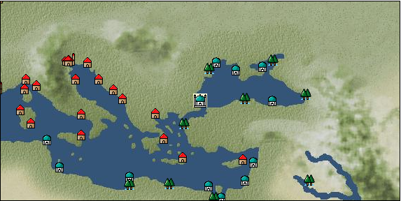

# Port: イスタンブール

import Tabs from '@theme/Tabs';
import TabItem from '@theme/TabItem';

## General Information

| Attribute | Details |
| :--- | :--- |
| **Port Name** | istanbul |
| **Port Type** | Headquarters |
| **Region** | eastern europe |
| **Sea Area** | Black Sea |
| **Required Language** | turkish |
| **Coordinates** | （1294，3042） |
| **Investment Reward** | [Luxury costume sewing techniques](Items/Recipe Book/item_3231.md) （必要投資額：2,120,000ドゥカード） |

### Available Facilities

| guild | intermediary | exchange | tool shop | workshop craftsman | Painter | sculptor | peddler |
| --- | --- | --- | --- | --- | --- | --- | --- |
| ○ | ○ | ○ | ○ | ○ | ○ |   | ○ |
| Shipyard Master | Lumbermaker | Sail-maker | weapon craftsman | master | TavernFemale | archive | salesperson |
| --- | --- | --- | --- | --- | --- | --- | --- |
| ○ |   |   | ○ | ○ | ○ | ○ | ○ |
| Shipwright | 銀行 | street worker | 王宮 | Trading post | church | suburbs | translator |
| --- | --- | --- | --- | --- | --- | --- | --- |
| ○ | ○ |   | ○ | ○ | ○ |   | ○ |

### Description
The city once flourished as Constantinople, the capital of the Byzantine Empire. In 1453, it was occupied by the Ottoman Turks and became their capital, Istanbul. It is the largest city in the world. In addition to selling luxury goods, fruit tree cultivation is also popular. Tavern woman: Radia *Can also speak Arabic Cultural area: Turkey Requires disguise level 60 (if you speak Turkish, disguise level 50 is OK) *There is a bank-related NPC near the Rest Area.

<Tabs>
  <TabItem value="trade_goods_sales" label="Trade Goods Sales">

| item | group | purchase price | 同盟時 | remarks |
| --- | --- | --- | --- | --- |
| [olive oil](Items/Trade Goods/TradeGoods-Seasonings/item_48.md) | [交易品（調味料）](Categories/category_4.md) | 315 | (276) |  |
| [Kyonin](Items/Trade Goods/TradeGoods-Medicine/item_964.md) | [Trading products (medical products)](Categories/category_6.md) | 406 | (356) |  |
| [turkish rug](Items/Trade Goods/TradeGoods-Fabrics/item_686.md) | [交易品（織物）](Categories/category_20.md) | 4,158 | (3,638) |  |
| [butter](Items/Trade Goods/TradeGoods-Seasonings/item_3.md) | [交易品（調味料）](Categories/category_4.md) | 310 | (272) |  |
| [persian berry](Items/Trade Goods/TradeGoods-Dye/item_693.md) | [Trading Goods (Dye)](Categories/category_2.md) | (1,129) | 988 |  |
| 要投資（必要投資額：不明） |
| [dried apricots](Items/Trade Goods/TradeGoods-Sunddries/item_8.md) | [Trading goods (hobby goods)](Categories/category_10.md) | 392 | (343) |  |
| [woolen fabric](Items/Trade Goods/TradeGoods-Fabrics/item_163.md) | [交易品（織物）](Categories/category_20.md) | 925 | (810) |  |
| [Western books](Items/Trade Goods/TradeGoods-Misc/item_293.md) | [交易品（雑貨）](Categories/category_5.md) | (653) | 572 |  |
| 要投資（必要投資額：不明） |
| [mutton](Items/Trade Goods/TradeGoods-Foodstuffs/item_33.md) | [Trading items (food items)](Categories/category_3.md) | 360 | (315) |  |
| [goldsmith](Items/Trade Goods/TradeGoods-Luxuries/item_687.md) | [Trading goods (artificial goods)](Categories/category_13.md) | 3,257 | (2,850) |  |
  </TabItem>
  <TabItem value="sale_specialty" label="Sale (Specialty)">

| item | group | sale price | 同盟時 | remarks |
| --- | --- | --- | --- | --- |

#### [Trading Goods (Dye)](Categories/category_2.md)

| [ward](Items/Trade Goods/TradeGoods-Dye/item_57.md) | Trading Goods (Dye) | 1,314 | (1,478) |  |
| [mayan blue](Items/Trade Goods/TradeGoods-Dye/item_1096.md) | Trading Goods (Dye) | 1,591 | (1,790) |  |
| [mimosa](Items/Trade Goods/TradeGoods-Dye/item_2281.md) | Trading Goods (Dye) | 1,559 | (1,754) |  |

#### [交易品（調味料）](Categories/category_4.md)

| [tamarind](Items/Trade Goods/TradeGoods-Seasonings/item_1968.md) | 交易品（調味料） | 2,061 | (2,318) |  |

#### [Trading products (medical products)](Categories/category_6.md)

| [tea tree](Items/Trade Goods/TradeGoods-Medicine/item_2283.md) | Trading products (medical products) | 1,586 | (1,784) |  |

#### [Trading goods (hobby goods)](Categories/category_10.md)

| [walnut](Items/Trade Goods/TradeGoods-Sunddries/item_522.md) | Trading goods (hobby goods) | 665 | (748) |  |
| ●Special products from Italy and southern France |
| [durian](Items/Trade Goods/TradeGoods-Sunddries/item_1949.md) | Trading goods (hobby goods) | 1,820 | (2,047) |  |
| [prune](Items/Trade Goods/TradeGoods-Sunddries/item_523.md) | Trading goods (hobby goods) | 438 | (492) |  |
| ●Special products from Italy and southern France |
| [macadamia nuts](Items/Trade Goods/TradeGoods-Sunddries/item_2282.md) | Trading goods (hobby goods) | 1,134 | (1,275) |  |
| [black tea](Items/Trade Goods/TradeGoods-Sunddries/item_675.md) | Trading goods (hobby goods) | 2,135 | (2,402) |  |

#### [Trading Goods (Spices)](Categories/category_11.md)

| [jasmine](Items/Trade Goods/TradeGoods-Perfume/item_772.md) | Trading Goods (Spices) | 7,015 | (7,892) |  |
| [eucalyptus](Items/Trade Goods/TradeGoods-Perfume/item_2278.md) | Trading Goods (Spices) | 1,073 | (1,207) |  |
| [Tang Muxiang](Items/Trade Goods/TradeGoods-Perfume/item_593.md) | Trading Goods (Spices) | 1,864 | (2,097) |  |
| [sandalwood](Items/Trade Goods/TradeGoods-Perfume/item_771.md) | Trading Goods (Spices) | 4,140 | (4,657) |  |

#### [Trading Goods (Spices)](Categories/category_12.md)

| [cardamom](Items/Trade Goods/TradeGoods-Spices/item_1431.md) | Trading Goods (Spices) | 3,370 | (3,791) |  |
| [cloves](Items/Trade Goods/TradeGoods-Spices/item_1092.md) | Trading Goods (Spices) | (7,408) | 8,643 |  |
| [saffron](Items/Trade Goods/TradeGoods-Spices/item_845.md) | Trading Goods (Spices) | 3,262 | (3,670) |  |
| [nutmeg](Items/Trade Goods/TradeGoods-Spices/item_1969.md) | Trading Goods (Spices) | (7,690) | 8,972 |  |
| [mace](Items/Trade Goods/TradeGoods-Spices/item_2100.md) | Trading Goods (Spices) | (8,076) | 9,423 |  |

#### [Trading goods (artificial goods)](Categories/category_13.md)

| [glasswork](Items/Trade Goods/TradeGoods-Luxuries/item_60.md) | Trading goods (artificial goods) | 1,880 | (2,115) |  |
| [Darla Hest](Items/Trade Goods/TradeGoods-Luxuries/item_6190.md) | Trading goods (artificial goods) | 5,360 | (6,030) |  |

#### [交易品（美術品）](Categories/category_14.md)

| [oil painting](Items/Trade Goods/TradeGoods-Art/item_1088.md) | 交易品（美術品） | 2,600 | (2,925) |  |

#### [Trading Items (Gemstones)](Categories/category_15.md)

| [Tortoiseshell](Items/Trade Goods/TradeGoods-Gems/item_1980.md) | Trading Items (Gemstones) | 4,164 | (4,684) |  |
| [opal](Items/Trade Goods/TradeGoods-Gems/item_2006.md) | Trading Items (Gemstones) | 8,870 | (9,979) |  |
| [topaz](Items/Trade Goods/TradeGoods-Gems/item_1097.md) | Trading Items (Gemstones) | 6,380 | (7,178) |  |
| [pink diamond](Items/Trade Goods/TradeGoods-Gems/item_2874.md) | Trading Items (Gemstones) | 13,900 | (15,639) |  |
| 非同盟時100% |
| [amber](Items/Trade Goods/TradeGoods-Gems/item_618.md) | Trading Items (Gemstones) | 5,054 | (5,686) |  |

#### [Trading Items (Arms)](Categories/category_16.md)

| [crossbow](Items/Trade Goods/TradeGoods-Weapons/item_537.md) | Trading Items (Arms) | 1,048 | (1,179) |  |
| ●Special products from Italy and southern France |

#### [Trading Items (Firearms)](Categories/category_17.md)

| [musket gun](Items/Trade Goods/TradeGoods-Firearms/item_584.md) | Trading Items (Firearms) | 3,712 | (4,176) |  |
| ●Iberian specialties |

#### [交易品（工業品）](Categories/category_19.md)

| [rubber](Items/Trade Goods/TradeGoods-Wares/item_2819.md) | 交易品（工業品） | 672 | (756) |  |

#### [交易品（織物）](Categories/category_20.md)

| [indian chintz](Items/Trade Goods/TradeGoods-Fabrics/item_159.md) | 交易品（織物） | 2,362 | (2,657) |  |
| [dutch calico](Items/Trade Goods/TradeGoods-Fabrics/item_1435.md) | 交易品（織物） | 1,585 | (1,783) |  |
| [flannel](Items/Trade Goods/TradeGoods-Fabrics/item_149.md) | 交易品（織物） | 1,584 | (1,782) |  |
| [velvet](Items/Trade Goods/TradeGoods-Fabrics/item_902.md) | 交易品（織物） | 3,845 | (4,326) |  |
| [race](Items/Trade Goods/TradeGoods-Fabrics/item_59.md) | 交易品（織物） | 1,000 | (1,125) |  |
  </TabItem>
  <TabItem value="sale_no_specialty" label="Sale (No Specialty)">

| item | group | sale price | 同盟時 | remarks |
| --- | --- | --- | --- | --- |

#### [Trading Goods (Dye)](Categories/category_2.md)

| [Safflower](Items/Trade Goods/TradeGoods-Dye/item_1059.md) | Trading Goods (Dye) | 612 | (688) |  |
| [貝紫](Items/Trade Goods/TradeGoods-Dye/item_110.md) | Trading Goods (Dye) | 4,329 | (4,870) |  |

#### [Trading items (food items)](Categories/category_3.md)

| [mushroom](Items/Trade Goods/TradeGoods-Foodstuffs/item_160.md) | Trading items (food items) | 32 | (36) |  |
| [fava beans](Items/Trade Goods/TradeGoods-Foodstuffs/item_102.md) | Trading items (food items) | 81 | (91) |  |
| [olive](Items/Trade Goods/TradeGoods-Foodstuffs/item_47.md) | Trading items (food items) | 377 | (424) |  |
| [sweet potato](Items/Trade Goods/TradeGoods-Foodstuffs/item_1931.md) | Trading items (food items) | 247 | (277) |  |
| [Sugar beet](Items/Trade Goods/TradeGoods-Foodstuffs/item_1846.md) | Trading items (food items) | 295 | (331) |  |
| [tomato](Items/Trade Goods/TradeGoods-Foodstuffs/item_1809.md) | Trading items (food items) | 302 | (339) |  |
| [european crayfish](Items/Trade Goods/TradeGoods-Foodstuffs/item_6188.md) | Trading items (food items) | 6,400 | (7,200) |  |
| [barley](Items/Trade Goods/TradeGoods-Foodstuffs/item_124.md) | Trading items (food items) | 75 | (84) |  |
| [wheat](Items/Trade Goods/TradeGoods-Foodstuffs/item_16.md) | Trading items (food items) | (54) | 63 |  |
| [beef](Items/Trade Goods/TradeGoods-Foodstuffs/item_26.md) | Trading items (food items) | 760 | (855) |  |

#### [交易品（調味料）](Categories/category_4.md)

| [coconut vinegar](Items/Trade Goods/TradeGoods-Seasonings/item_1988.md) | 交易品（調味料） | 557 | (626) |  |
| [salt](Items/Trade Goods/TradeGoods-Seasonings/item_42.md) | 交易品（調味料） | 293 | (329) |  |
| [Honey](Items/Trade Goods/TradeGoods-Seasonings/item_49.md) | 交易品（調味料） | 985 | (1,108) |  |

#### [Trading products (medical products)](Categories/category_6.md)

| [anise](Items/Trade Goods/TradeGoods-Medicine/item_1050.md) | Trading products (medical products) | 257 | (289) |  |
| [nettle](Items/Trade Goods/TradeGoods-Medicine/item_6189.md) | Trading products (medical products) | 775 | (871) |  |
| [dandelion](Items/Trade Goods/TradeGoods-Medicine/item_1089.md) | Trading products (medical products) | 313 | (352) |  |
| [Maca](Items/Trade Goods/TradeGoods-Medicine/item_3000.md) | Trading products (medical products) | 1,964 | (2,209) |  |
| [rose hips](Items/Trade Goods/TradeGoods-Medicine/item_904.md) | Trading products (medical products) | 706 | (794) |  |
| [Nothing](Items/Trade Goods/TradeGoods-Medicine/item_1053.md) | Trading products (medical products) | 725 | (815) |  |

#### [Trading Items (Iron Stone)](Categories/category_7.md)

| [Saltpeter](Items/Trade Goods/TradeGoods-Minerals/item_884.md) | [Trading Items (Shishi)](Categories/category_7.md) | 2,031 | (2,285) |  |

#### [Trading products (precious metals)](Categories/category_8.md)

| [gold](Items/Trade Goods/TradeGoods-Metals/item_659.md) | Trading products (precious metals) | 10,518 | (11,833) |  |

#### [Trading goods (hobby goods)](Categories/category_10.md)

| [caviar](Items/Trade Goods/TradeGoods-Sunddries/item_2122.md) | Trading goods (hobby goods) | 714 | (803) |  |
| [papaya](Items/Trade Goods/TradeGoods-Sunddries/item_1948.md) | Trading goods (hobby goods) | 565 | (635) |  |
| [pickles](Items/Trade Goods/TradeGoods-Sunddries/item_535.md) | Trading goods (hobby goods) | 327 | (367) |  |

#### [Trading Goods (Spices)](Categories/category_11.md)

| [oakmoss](Items/Trade Goods/TradeGoods-Perfume/item_819.md) | Trading Goods (Spices) | 809 | (910) |  |
| [lemon oil](Items/Trade Goods/TradeGoods-Perfume/item_151.md) | Trading Goods (Spices) | 717 | (806) |  |
| [rose](Items/Trade Goods/TradeGoods-Perfume/item_536.md) | Trading Goods (Spices) | 2,831 | (3,185) |  |
| [Musk](Items/Trade Goods/TradeGoods-Perfume/item_158.md) | Trading Goods (Spices) | 4,065 | (4,573) |  |

#### [Trading Goods (Spices)](Categories/category_12.md)

| [oregano](Items/Trade Goods/TradeGoods-Spices/item_430.md) | Trading Goods (Spices) | 556 | (625) |  |
| [garlic](Items/Trade Goods/TradeGoods-Spices/item_526.md) | Trading Goods (Spices) | 325 | (365) |  |
| [ginger](Items/Trade Goods/TradeGoods-Spices/item_112.md) | Trading Goods (Spices) | 1,667 | (1,875) |  |
| [Laurier](Items/Trade Goods/TradeGoods-Spices/item_615.md) | Trading Goods (Spices) | 145 | (163) |  |
| ▲Special products from neighboring cultural areas |

#### [Trading goods (artificial goods)](Categories/category_13.md)

| [lapidary work](Items/Trade Goods/TradeGoods-Luxuries/item_153.md) | Trading goods (artificial goods) | 5,188 | (5,837) |  |

#### [交易品（美術品）](Categories/category_14.md)

| [古美術品](Items/Trade Goods/TradeGoods-Art/item_51.md) | 交易品（美術品） | 4,240 | (4,770) |  |
| [marble statue](Items/Trade Goods/TradeGoods-Art/item_50.md) | 交易品（美術品） | 2,683 | (3,018) |  |
| [青銅像](Items/Trade Goods/TradeGoods-Art/item_148.md) | 交易品（美術品） | 1,025 | (1,153) |  |

#### [Trading Items (Gemstones)](Categories/category_15.md)

| [emerald](Items/Trade Goods/TradeGoods-Gems/item_777.md) | Trading Items (Gemstones) | 8,693 | (9,780) |  |
| [ivory](Items/Trade Goods/TradeGoods-Gems/item_699.md) | Trading Items (Gemstones) | 3,874 | (4,358) |  |

#### [Trading Items (Arms)](Categories/category_16.md)

| [damascus sword](Items/Trade Goods/TradeGoods-Weapons/item_903.md) | Trading Items (Arms) | 4,909 | (5,523) |  |
| [scimitar](Items/Trade Goods/TradeGoods-Weapons/item_142.md) | Trading Items (Arms) | 1,120 | (1,260) |  |

#### [交易品（工業品）](Categories/category_19.md)

| [papyrus](Items/Trade Goods/TradeGoods-Wares/item_616.md) | 交易品（工業品） | 484 | (544) |  |
| [wax](Items/Trade Goods/TradeGoods-Wares/item_54.md) | 交易品（工業品） | 917 | (1,031) |  |
| [marble](Items/Trade Goods/TradeGoods-Wares/item_52.md) | 交易品（工業品） | 1,470 | (1,653) |  |
| [coal](Items/Trade Goods/TradeGoods-Wares/item_359.md) | 交易品（工業品） | 516 | (580) |  |
| [羊皮紙](Items/Trade Goods/TradeGoods-Wares/item_53.md) | 交易品（工業品） | 1,193 | (1,342) |  |

#### [交易品（織物）](Categories/category_20.md)

| [damask](Items/Trade Goods/TradeGoods-Fabrics/item_614.md) | 交易品（織物） | 3,492 | (3,928) |  |
| [woolen fabric](Items/Trade Goods/TradeGoods-Fabrics/item_163.md) | 交易品（織物） | 406 | (456) |  |
  </TabItem>
  <TabItem value="guild_&_others" label="Guild & Others">

| item | group | Sales price | Handling NPC | remarks |
| --- | --- | --- | --- | --- |

#### adventure guild

| [religious studies](Skills/Skill-Adventure/item_340.md) | [Skill (adventure)](Categories/category_39.md) | 8,000 | adventure guild |  |
| [採集](Skills/Skill-Adventure/item_423.md) | [Skill (adventure)](Categories/category_39.md) | 4,000 | adventure guild |  |

#### merchant guild

| [sewing](Skills/Skill-Trade/item_474.md) | [Skill (trade)](Categories/category_40.md) | 10,000 | merchant guild |  |
| [textile trade](Skills/Skill-Trade/item_483.md) | [Skill (trade)](Categories/category_40.md) | 35,000 | merchant guild |  |
| [escape](Skills/Skill-Trade/item_471.md) | [Skill (trade)](Categories/category_40.md) | 10,000 | merchant guild |  |

#### maritime guild

| [swordplay](Skills/Skill-Battle/item_495.md) | [Skill (combat)](Categories/category_41.md) | 8,000 | maritime guild |  |
| [steering](Skills/Skill-Battle/item_507.md) | [Skill (combat)](Categories/category_41.md) | 1,000 | maritime guild |  |
| [shipbuilding](Skills/Skill-Battle/item_511.md) | [Skill (combat)](Categories/category_41.md) | 25,000 | maritime guild |  |

#### Kara Mehmet

| [How to make a dictionary of Altaic languages](Items/Recipe Book/item_2013.md) | [recipe book](Categories/category_22.md) | Fixed recipe | Kara Mehmet |  |
| [biology](Skills/Skill-Adventure/item_434.md) | [Skill (adventure)](Categories/category_39.md) | 5,000 | Kara Mehmet |  |

#### Rossana

| [wooing](Skills/Skill-Adventure/item_464.md) | [Skill (adventure)](Categories/category_39.md) | 30,000 | Rossana |  |

#### others

| [超文明服飾縫製法](Items/Recipe Book/item_5018.md) | [recipe book](Categories/category_22.md) | Fixed recipe |  |  |
| 書記官 |
  </TabItem>
  <TabItem value="toolman" label="Toolman">

| item | group | Sales price | Handling NPC | remarks |
| --- | --- | --- | --- | --- |

#### [recipe book](Categories/category_22.md)

| [Curved sword training/application](Items/Recipe Book/item_991.md) | recipe book | 50,000 | tool shop owner |  |
| 時代限定（16世紀第1期） |

#### [Equipment (head)](Categories/category_23.md)

| [Agar](Items/Equipment/Equipment-Head/item_216.md) | Equipment (head) | 25,400 | tool shop owner |  |
| [peacock turban](Items/Equipment/Equipment-Head/item_691.md) | Equipment (head) | 73,400 | tool shop owner |  |
| [feather turban](Items/Equipment/Equipment-Head/item_690.md) | Equipment (head) | 48,300 | tool shop owner |  |

#### [Equipment (body)](Categories/category_24.md)

| [dolman](Items/Equipment/Equipment-Body/item_688.md) | Equipment (body) | 153,900 | tool shop owner |  |
| [brunjuk](Items/Equipment/Equipment-Body/item_214.md) | Equipment (body) | 66,100 | tool shop owner |  |

#### [Equipment (legs)](Categories/category_26.md)

| [arabian shoes](Items/Equipment/Equipment-Feet/item_220.md) | Equipment (legs) | 28,100 | tool shop owner |  |

#### [Equipment (belongings)](Categories/category_27.md)

| [qatar](Items/Equipment/Equipment-Weapon/item_1124.md) | Equipment (belongings) | 38,900 | tool shop owner |  |
| 要投資（必要投資額：不明） |
| [scimitar](Items/Equipment/Equipment-Weapon/item_225.md) | Equipment (belongings) | 29,000 | tool shop owner |  |
| [Shamshir](Items/Equipment/Equipment-Weapon/item_5054.md) | Equipment (belongings) |  | tool shop owner |  |
| 要投資（必要投資額：不明） |

#### [Consumables (land battle/deck battle)](Categories/category_29.md)

| [tear gas powder bag](Items/Consumables/Consumables-Landbattle/item_104.md) | Consumables (land battle/deck battle) | 150 | tool shop owner |  |
| [hellfire torch](Items/Consumables/Consumables-Landbattle/item_233.md) | Consumables (land battle/deck battle) | 300 | tool shop owner |  |
| [explosive powder](Items/Consumables/Consumables-Landbattle/item_230.md) | Consumables (land battle/deck battle) | 150 | tool shop owner |  |
| [sticky oil](Items/Consumables/Consumables-Landbattle/item_231.md) | Consumables (land battle/deck battle) | 150 | tool shop owner |  |

#### [Consumables (naval/hand-to-hand combat)](Categories/category_30.md)

| [assault flag](Items/Consumables/Consumables-navalhand-to-hand combat/item_228.md) | Consumables (naval/hand-to-hand combat) | 5,000 | tool shop owner |  |

#### [Consumables (skill activation)](Categories/category_31.md)

| [card](Items/Consumables/Consumables-Skill/item_855.md) | Consumables (skill activation) | 500 | tool shop owner |  |
| [Card (RANK2)](Items/Consumables/Consumables-Skill/item_1652.md) | Consumables (skill activation) | 1,000 | tool shop owner |  |
| [perfume](Items/Consumables/Consumables-Skill/item_226.md) | Consumables (skill activation) | 3,000 | tool shop owner |  |

#### [Consumables (other)](Categories/category_44.md)

| [sail paint part 20](Items/Consumables/Consumables-Other/item_6233.md) | Consumables (other) | 500,000 | tool shop owner |  |
| [Special dye part 2](Items/Consumables/Consumables-Other/item_689.md) | Consumables (other) | 5,000 | tool shop owner |  |
  </TabItem>
  <TabItem value="kobo_craftsmen" label="Craftsman">

| item | group | Sales price | Handling NPC | remarks |
| --- | --- | --- | --- | --- |

#### [Consumables (condition recovery)](Categories/category_21.md)

| [Nostalgic carillon bell](Items/Consumables/Consumables-Recovery/item_245.md) | Consumables (condition recovery) | 200 | workshop craftsman |  |
| [Ship song sheet music](Items/Consumables/Consumables-Recovery/item_247.md) | Consumables (condition recovery) | 200 | workshop craftsman |  |

#### [recipe book](Categories/category_22.md)

| [Land battle props/casting book](Items/Recipe Book/item_234.md) | recipe book | Fixed recipe | workshop craftsman |  |

#### [shipbuilding materials](Categories/category_47.md)

| [General-purpose large oar](Items/Shipbuilding FS Material/item_3536.md) | shipbuilding materials | 2,500,000 | workshop craftsman |  |
| [General-purpose large armor plate](Items/Shipbuilding FS Material/item_3463.md) | shipbuilding materials | 2,500,000 | workshop craftsman |  |
  </TabItem>
  <TabItem value="Painter" label="Painter">

| item | group | Sales price | Handling NPC | remarks |
| --- | --- | --- | --- | --- |

#### [Ship parts (emblem)](Categories/category_36.md)

| [admiral](Items/Ship Parts/Shipparts-Crests/item_548.md) | Ship parts (emblem) | 5,000 | Painter |  |
| [animal](Items/Ship Parts/Shipparts-Crests/item_692.md) | Ship parts (emblem) | 5,000 | Painter |  |
| [anchor](Items/Ship Parts/Shipparts-Crests/item_549.md) | Ship parts (emblem) | 5,000 | Painter |  |
| [circle cross](Items/Ship Parts/Shipparts-Crests/item_544.md) | Ship parts (emblem) | 5,000 | Painter |  |
| [shellfish](Items/Ship Parts/Shipparts-Crests/item_546.md) | Ship parts (emblem) | 5,000 | Painter |  |
| [Delphine](Items/Ship Parts/Shipparts-Crests/item_542.md) | Ship parts (emblem) | 5,000 | Painter |  |
| [butterfly](Items/Ship Parts/Shipparts-Crests/item_547.md) | Ship parts (emblem) | 5,000 | Painter |  |
| [fisherman](Items/Ship Parts/Shipparts-Crests/item_545.md) | Ship parts (emblem) | 5,000 | Painter |  |
  </TabItem>
  <TabItem value="peddler" label="peddler">

| item | group | Sales price | Handling NPC | remarks |
| --- | --- | --- | --- | --- |

#### [Consumables (condition recovery)](Categories/category_21.md)

| [spare sail](Items/Consumables/Consumables-Recovery/item_242.md) | Consumables (condition recovery) |  | peddler |  |
| [fire extinguishing sand](Items/Consumables/Consumables-Recovery/item_68.md) | Consumables (condition recovery) |  | peddler |  |

#### [Consumables (land battle/deck battle)](Categories/category_29.md)

| [煙玉](Items/Consumables/Consumables-Landbattle/item_86.md) | Consumables (land battle/deck battle) | 1,740 | peddler |  |
| [explosive drug](Items/Consumables/Consumables-Landbattle/item_2493.md) | Consumables (land battle/deck battle) |  | peddler |  |

#### [Consumables (naval/hand-to-hand combat)](Categories/category_30.md)

| [手術道具](Items/Consumables/Consumables-navalhand-to-hand combat/item_80.md) | Consumables (naval/hand-to-hand combat) |  | peddler |  |

#### [Consumables (skill activation)](Categories/category_31.md)

| [landmark ribbon](Items/Consumables/Consumables-Skill/item_316.md) | Consumables (skill activation) |  | peddler |  |
  </TabItem>
  <TabItem value="trading merchant" label="trading merchant">

| item | group | Sales price | Handling NPC | remarks |
| --- | --- | --- | --- | --- |

#### [Consumables (condition recovery)](Categories/category_21.md)

| [reserve rudder](Items/Consumables/Consumables-Recovery/item_243.md) | Consumables (condition recovery) | 3,000 | trading merchant |  |
| [recreational sake barrel](Items/Consumables/Consumables-Recovery/item_83.md) | Consumables (condition recovery) | 1,440 | trading merchant |  |
| The Istanbul Trader is located near the workshop. |
| [Special drug for epidemics](Items/Consumables/Consumables-Recovery/item_308.md) | Consumables (condition recovery) | 2,250 | trading merchant |  |

#### [Consumables (naval/hand-to-hand combat)](Categories/category_30.md)

| [ceasefire agreement](Items/Consumables/Consumables-navalhand-to-hand combat/item_129.md) | Consumables (naval/hand-to-hand combat) | 2,100 | trading merchant |  |
| [evacuation bell](Items/Consumables/Consumables-navalhand-to-hand combat/item_919.md) | Consumables (naval/hand-to-hand combat) | 3,750 | trading merchant |  |
| [flag of calm](Items/Consumables/Consumables-navalhand-to-hand combat/item_84.md) | Consumables (naval/hand-to-hand combat) | 1,340 | trading merchant |  |
  </TabItem>
  <TabItem value="salesperson" label="salesperson">

| item | group | Sales price | Handling NPC | remarks |
| --- | --- | --- | --- | --- |

#### [Consumables (cooking)](Categories/category_32.md)

| [fig pie](Items/Consumables/Consumables-Cooking/item_1077.md) | Consumables (cooking) |  | salesperson |  |
| [Couscous](Items/Consumables/Consumables-Cooking/item_852.md) | Consumables (cooking) |  | salesperson |  |
| [watt](Items/Consumables/Consumables-Cooking/item_1101.md) | Consumables (cooking) |  | salesperson |  |
| [Stewed lamb and turnip](Items/Consumables/Consumables-Cooking/item_1083.md) | Consumables (cooking) |  | salesperson |  |
| [roast lamb](Items/Consumables/Consumables-Cooking/item_998.md) | Consumables (cooking) |  | salesperson |  |
| [pancakes with honey](Items/Consumables/Consumables-Cooking/item_1074.md) | Consumables (cooking) |  | salesperson |  |
  </TabItem>
  <TabItem value="translator" label="translator">

| item | group | Sales price | Handling NPC | remarks |
| --- | --- | --- | --- | --- |

#### [Consumables (skill activation)](Categories/category_31.md)

| [Altaic languages ​​translation notes](Items/Consumables/Consumables-Skill/item_2530.md) | Consumables (skill activation) |  | translator |  |
| [Shem-Hamite translation notes](Items/Consumables/Consumables-Skill/item_2529.md) | Consumables (skill activation) |  | translator |  |
  </TabItem>
  <TabItem value="shipyard" label="Shipyard">

### Shipyard Master

| item | group | Sales price | Handling NPC | remarks |
| --- | --- | --- | --- | --- |

#### [Boat](Categories/category_43.md)

| [Galliot](Items/Ships/item_210.md) | Boat | 156,000 | Shipyard Master |  |
| [galley](Items/Ships/item_227.md) | Boat | 645,000 | Shipyard Master |  |
| [Dow](Items/Ships/item_780.md) | Boat | 360,000 | Shipyard Master |  |
| [Varsha](Items/Ships/item_201.md) | Boat | 2,000 | Shipyard Master |  |
| [barbarian galley](Items/Ships/item_237.md) | Boat | 560,000 | Shipyard Master |  |
| [commercial galley](Items/Ships/item_229.md) | Boat | 650,000 | Shipyard Master |  |
| [commercial dow](Items/Ships/item_782.md) | Boat | 372,000 | Shipyard Master |  |
| [commercial varsha](Items/Ships/item_204.md) | Boat | 5,200 | Shipyard Master |  |
| [large galley](Items/Ships/item_250.md) | Boat | 2,250,000 | Shipyard Master |  |
| [assault galley](Items/Ships/item_224.md) | Boat | 640,000 | Shipyard Master |  |
| [Battle Barsha](Items/Ships/item_203.md) | Boat | 5,100 | Shipyard Master |  |
| [exploration barsha](Items/Ships/item_202.md) | Boat | 5,000 | Shipyard Master |  |
| [assault dhow](Items/Ships/item_781.md) | Boat | 365,000 | Shipyard Master |  |
| [light galley](Items/Ships/item_209.md) | Boat | 150,000 | Shipyard Master |  |
| [transportation galley](Items/Ships/item_211.md) | Boat | 160,000 | Shipyard Master |  |
| [Large galley for transportation](Items/Ships/item_251.md) | Boat | 2,280,000 | Shipyard Master |  |
| [heavy galley](Items/Ships/item_550.md) | Boat | 2,650,000 | Shipyard Master |  |
  </TabItem>
  <TabItem value="weapon craftsman" label="weapon craftsman">

| item | group | Sales price | Handling NPC | remarks |
| --- | --- | --- | --- | --- |

#### [recipe book](Categories/category_22.md)

| [Shipbuilding materials/examination room](Items/Recipe Book/item_1754.md) | recipe book | Fixed recipe | weapon craftsman |  |

#### [Ship parts (special weapons)](Categories/category_37.md)

| [Corvus](Items/Ship Parts/Shipparts-Special-Weapons/item_194.md) | Ship parts (special weapons) | 24,000 | weapon craftsman |  |
| [rum](Items/Ship Parts/Shipparts-Special-Weapons/item_191.md) | Ship parts (special weapons) | 4,800 | weapon craftsman |  |
| [medium sized ram](Items/Ship Parts/Shipparts-Special-Weapons/item_192.md) | Ship parts (special weapons) | 31,000 | weapon craftsman |  |
| [large ram](Items/Ship Parts/Shipparts-Special-Weapons/item_788.md) | Ship parts (special weapons) | 100,000 | weapon craftsman |  |
| [small corvus](Items/Ship Parts/Shipparts-Special-Weapons/item_193.md) | Ship parts (special weapons) | 3,000 | weapon craftsman |  |
| [small ram](Items/Ship Parts/Shipparts-Special-Weapons/item_190.md) | Ship parts (special weapons) | 1,000 | weapon craftsman |  |
| [small poop](Items/Ship Parts/Shipparts-Special-Weapons/item_198.md) | Ship parts (special weapons) | 39,000 | weapon craftsman |  |
| [small ship forecastle](Items/Ship Parts/Shipparts-Special-Weapons/item_195.md) | Ship parts (special weapons) | 5,000 | weapon craftsman |  |
| [additional spanker](Items/Ship Parts/Shipparts-Special-Weapons/item_200.md) | Ship parts (special weapons) | 55,000 | weapon craftsman |  |
| [additional split](Items/Ship Parts/Shipparts-Special-Weapons/item_197.md) | Ship parts (special weapons) | 44,000 | weapon craftsman |  |
| [additional small spanker](Items/Ship Parts/Shipparts-Special-Weapons/item_199.md) | Ship parts (special weapons) | 3,500 | weapon craftsman |  |
| [additional small split](Items/Ship Parts/Shipparts-Special-Weapons/item_196.md) | Ship parts (special weapons) | 2,000 | weapon craftsman |  |

#### [Ship parts (cannon)](Categories/category_38.md)

| [4 culverine guns](Items/Ship Parts/Shipparts-Cannons/item_372.md) | Ship parts (cannon) | 21,800 | weapon craftsman |  |
| [10 Saker cannons](Items/Ship Parts/Shipparts-Cannons/item_187.md) | Ship parts (cannon) | 79,000 | weapon craftsman |  |
| [2 saker cannons](Items/Ship Parts/Shipparts-Cannons/item_183.md) | Ship parts (cannon) | 3,200 | weapon craftsman |  |
| [4 saker cannons](Items/Ship Parts/Shipparts-Cannons/item_184.md) | Ship parts (cannon) | 12,600 | weapon craftsman |  |
| [6 Saker cannons](Items/Ship Parts/Shipparts-Cannons/item_185.md) | Ship parts (cannon) | 28,400 | weapon craftsman |  |
| [8 Saker cannons](Items/Ship Parts/Shipparts-Cannons/item_186.md) | Ship parts (cannon) | 50,500 | weapon craftsman |  |
| [2 demi culverin cannons](Items/Ship Parts/Shipparts-Cannons/item_188.md) | Ship parts (cannon) | 4,000 | weapon craftsman |  |
| [4 demi culverin cannons](Items/Ship Parts/Shipparts-Cannons/item_189.md) | Ship parts (cannon) | 16,200 | weapon craftsman |  |
| [6 demi culverin cannons](Items/Ship Parts/Shipparts-Cannons/item_368.md) | Ship parts (cannon) | 36,400 | weapon craftsman |  |
| [8 demi culverin cannons](Items/Ship Parts/Shipparts-Cannons/item_369.md) | Ship parts (cannon) | 64,600 | weapon craftsman |  |
| [2 trench guns](Items/Ship Parts/Shipparts-Cannons/item_378.md) | Ship parts (cannon) | 6,500 | weapon craftsman |  |
| [4 pyro cannons](Items/Ship Parts/Shipparts-Cannons/item_384.md) | Ship parts (cannon) | 12,500 | weapon craftsman |  |
| [6 pyro cannons](Items/Ship Parts/Shipparts-Cannons/item_385.md) | Ship parts (cannon) | 38,000 | weapon craftsman |  |
| [2 falcon guns](Items/Ship Parts/Shipparts-Cannons/item_174.md) | Ship parts (cannon) | 500 | weapon craftsman |  |
| [4 falcon guns](Items/Ship Parts/Shipparts-Cannons/item_175.md) | Ship parts (cannon) | 2,000 | weapon craftsman |  |
| [6 falcon guns](Items/Ship Parts/Shipparts-Cannons/item_176.md) | Ship parts (cannon) | 4,600 | weapon craftsman |  |
| [8 falcon guns](Items/Ship Parts/Shipparts-Cannons/item_177.md) | Ship parts (cannon) | 8,100 | weapon craftsman |  |
| [4 frango guns](Items/Ship Parts/Shipparts-Cannons/item_393.md) | Ship parts (cannon) | 12,500 | weapon craftsman |  |
| [6 frango guns](Items/Ship Parts/Shipparts-Cannons/item_394.md) | Ship parts (cannon) | 38,000 | weapon craftsman |  |
| [10 minion cannons](Items/Ship Parts/Shipparts-Cannons/item_182.md) | Ship parts (cannon) | 34,800 | weapon craftsman |  |
| [2 minion cannons](Items/Ship Parts/Shipparts-Cannons/item_178.md) | Ship parts (cannon) | 1,400 | weapon craftsman |  |
| [4 minion cannons](Items/Ship Parts/Shipparts-Cannons/item_179.md) | Ship parts (cannon) | 5,600 | weapon craftsman |  |
| [6 minion cannons](Items/Ship Parts/Shipparts-Cannons/item_180.md) | Ship parts (cannon) | 12,400 | weapon craftsman |  |
| [8 minion cannons](Items/Ship Parts/Shipparts-Cannons/item_181.md) | Ship parts (cannon) | 22,400 | weapon craftsman |  |

#### [shipbuilding materials](Categories/category_47.md)

| [診察室](Items/Shipbuilding FS Material/item_1746.md) | shipbuilding materials | Fixed recipe | weapon craftsman |  |
  </TabItem>
  <TabItem value="dock manager" label="dock manager">

| item | group | Sales price | Handling NPC | remarks |
| --- | --- | --- | --- | --- |

#### [recipe book](Categories/category_22.md)

| [造船技術研究成果](Items/Recipe Book/item_2850.md) | recipe book | Fixed recipe | dock manager |  |
| I'm at the shipyard. |

#### [shipbuilding materials](Categories/category_47.md)

| [lifeboat](Items/Shipbuilding FS Material/item_2846.md) | shipbuilding materials | Fixed recipe | dock manager |  |
| [Sewing tools set](Items/Shipbuilding FS Material/item_2879.md) | shipbuilding materials | Fixed recipe | dock manager |  |
| [shipwright's room](Items/Shipbuilding FS Material/item_2880.md) | shipbuilding materials | Fixed recipe | dock manager |  |
  </TabItem>
  <TabItem value="Tavern Master" label="Tavern Master">

| item | group | Sales price | Handling NPC | remarks |
| --- | --- | --- | --- | --- |

#### [adjutant](Categories/category_46.md)

| [Iqbal](Items/Aides/item_1594.md) | adjutant | 100,000 | Tavern Master |  |
| [Carla](Items/Aides/item_1603.md) | adjutant | 100,000 | Tavern Master |  |
| [rashid](Items/Aides/item_1605.md) | adjutant | 100,000 | Tavern Master |  |
  </TabItem>
  <TabItem value="scholar" label="scholar">

| item | group | Sales price | Handling NPC | remarks |
| --- | --- | --- | --- | --- |

#### [recipe book](Categories/category_22.md)

| [How to make Islamic translations](Items/Recipe Book/item_2014.md) | recipe book | Fixed recipe | scholar |  |
  </TabItem>
</Tabs>