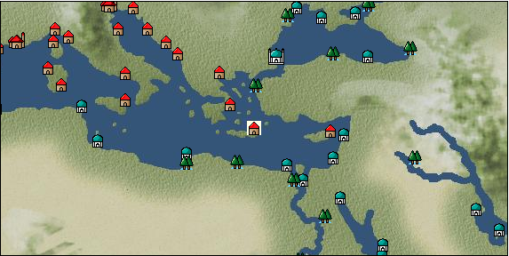

# Port: カンディア

import Tabs from '@theme/Tabs';
import TabItem from '@theme/TabItem';

## General Information

| Attribute | Details |
| :--- | :--- |
| **Port Name** | candia |
| **Port Type** | port of alliance |
| **Region** | eastern europe |
| **Sea Area** | eastern mediterranean |
| **Required Language** | greek |
| **Coordinates** | （1195，3370） |
| **Investment Reward** | [Craftsman's training book](Items/Recipe Book/item_918.md) （必要投資額：300,000ドゥカード） |

### Available Facilities

| guild | intermediary | exchange | tool shop | workshop craftsman | Painter | sculptor | peddler |
| --- | --- | --- | --- | --- | --- | --- | --- |
|   |   | ○ | ○ | ○ |   |   | ○ |
| Shipyard Master | Lumbermaker | Sail-maker | weapon craftsman | master | TavernFemale | archive | salesperson |
| --- | --- | --- | --- | --- | --- | --- | --- |
| ○ | ○ |   |   | ○ |   |   |   |
| Shipwright | 銀行 | street worker | 王宮 | Trading post | church | suburbs | translator |
| --- | --- | --- | --- | --- | --- | --- | --- |
| ○ | ○ | ○ |   |   | ○ | ○ |   |

### Description
A town on the island of Crete. Because the latitude is quite low, the temperature is high. It is said to be home to Labyrinthos, the palace of King Minos in Greek mythology. In addition to thriving olive cultivation and fishing, the region also produces high-quality dyes. *Italian is also spoken Suburbs: West Candia → Inner Crete → Labyrintos Cultural area: Balkan West Candia: Grass, coriander, sage, red flowers, etc. are mainly harvested.

<Tabs>
  <TabItem value="trade_goods_sales" label="Trade Goods Sales">

| item | group | purchase price | 同盟時 | remarks |
| --- | --- | --- | --- | --- |
| [olive](Items/Trade Goods/TradeGoods-Foodstuffs/item_47.md) | [Trading items (food items)](Categories/category_3.md) | 256 | 224 |  |
| When in alliance: confirmed at 100% |
| [olive oil](Items/Trade Goods/TradeGoods-Seasonings/item_48.md) | [交易品（調味料）](Categories/category_4.md) | 315 | 276 |  |
| When in alliance: confirmed at 100% |
| [persian berry](Items/Trade Goods/TradeGoods-Dye/item_693.md) | [Trading Goods (Dye)](Categories/category_2.md) | 1,124 | 984 |  |
| When in alliance: confirmed at 100% |
| [wine](Items/Trade Goods/TradeGoods-Alcohol/item_11.md) | [交易品（酒類）](Categories/category_9.md) | 429 | 376 |  |
| Investment required (Required investment amount: 500,000) Added in EO Chapter 4 Confirmed appearance at 500,000 |
| [wax](Items/Trade Goods/TradeGoods-Wares/item_54.md) | [交易品（工業品）](Categories/category_19.md) | (768) | 672 |  |
| Investment required (Required investment amount: 210,000) At alliance: Confirmed at 100% |
| [marble statue](Items/Trade Goods/TradeGoods-Art/item_50.md) | [交易品（美術品）](Categories/category_14.md) | (2,903) | 2,540 |  |
| Investment required (Required investment amount: 180,000) At alliance: Confirmed at 100% |
| [pork](Items/Trade Goods/TradeGoods-Foodstuffs/item_41.md) | [Trading items (food items)](Categories/category_3.md) | 347 | 304 |  |
| When in alliance: confirmed at 100% |
| [貝紫](Items/Trade Goods/TradeGoods-Dye/item_110.md) | [Trading Goods (Dye)](Categories/category_2.md) | 4,070 | 3,800 |  |
| Investment required (Required investment amount: 180,000) At alliance: Confirmed at 100% |
| [魚肉](Items/Trade Goods/TradeGoods-Foodstuffs/item_10.md) | [Trading items (food items)](Categories/category_3.md) | 146 | 128 |  |
| When in alliance: confirmed at 100% |
  </TabItem>
  <TabItem value="sale_specialty" label="Sale (Specialty)">

| item | group | sale price | 同盟時 | remarks |
| --- | --- | --- | --- | --- |

#### [交易品（繊維）](Categories/category_1.md)

| [alpaca hair](Items/Trade Goods/TradeGoods-Fibers/item_3009.md) | 交易品（繊維） | (2,006) | 2,340 |  |
| When in alliance: Confirmed at 100% |
| [Rush](Items/Trade Goods/TradeGoods-Fibers/item_3675.md) | 交易品（繊維） | (3,720) | 4,340 |  |
| When in alliance: confirmed at 100% |
| [sisal hemp](Items/Trade Goods/TradeGoods-Fibers/item_1766.md) | 交易品（繊維） | (329) | 383 |  |
| When in alliance: confirmed at 100% |
| [Basho](Items/Trade Goods/TradeGoods-Fibers/item_3862.md) | 交易品（繊維） | (36,423) | 42,500 |  |
| When in alliance: confirmed at 100% |
| [Panya](Items/Trade Goods/TradeGoods-Fibers/item_2097.md) | 交易品（繊維） | (706) | 823 |  |
| When in alliance: confirmed at 100% |
| [feather](Items/Trade Goods/TradeGoods-Fibers/item_585.md) | 交易品（繊維） | (803) | 936 |  |
| 98%＝923 102%＝950 |
| [tiger skin](Items/Trade Goods/TradeGoods-Fibers/item_3790.md) | 交易品（繊維） | (30,938) | 36,100 |  |
| 98％＝35400　104％＝37400 |
| [Green ramie](Items/Trade Goods/TradeGoods-Fibers/item_3428.md) | 交易品（繊維） | (32,652) | 38,100 |  |
| 98％＝37400　104％＝39600 |
| [deerskin](Items/Trade Goods/TradeGoods-Fibers/item_3648.md) | 交易品（繊維） | (30,767) | 35,900 |  |
| When in alliance: confirmed at 100% |

#### [Trading Goods (Dye)](Categories/category_2.md)

| [Indian Akane](Items/Trade Goods/TradeGoods-Dye/item_1037.md) | Trading Goods (Dye) | (1,063) | 1,240 |  |
| When in alliance: confirmed at 100% |
| [Indian indigo](Items/Trade Goods/TradeGoods-Dye/item_157.md) | Trading Goods (Dye) | (1,080) | 1,260 |  |
| When in alliance: confirmed at 100% |
| [cochineal](Items/Trade Goods/TradeGoods-Dye/item_1817.md) | Trading Goods (Dye) | (1,466) | 1,710 |  |
| When in alliance: confirmed at 100% |
| [Shorou](Items/Trade Goods/TradeGoods-Dye/item_3691.md) | Trading Goods (Dye) | (29,824) | 34,800 |  |
| When in alliance: confirmed at 100% |
| [mayan blue](Items/Trade Goods/TradeGoods-Dye/item_1096.md) | Trading Goods (Dye) | (1,406) | 1,640 |  |
| [mangosteen](Items/Trade Goods/TradeGoods-Dye/item_1973.md) | Trading Goods (Dye) | (2,152) | 2,510 |  |
| When in alliance: confirmed at 100% |
| [mimosa](Items/Trade Goods/TradeGoods-Dye/item_2281.md) | Trading Goods (Dye) | (1,380) | 1,610 |  |
| 98％＝1590　102％＝1630 |
| [gallnut](Items/Trade Goods/TradeGoods-Dye/item_3429.md) | Trading Goods (Dye) | (35,052) | 40,900 |  |
| 98％＝40100　104％＝42500 |
| [purple root](Items/Trade Goods/TradeGoods-Dye/item_3752.md) | Trading Goods (Dye) | (30,852) | 36,000 |  |
| 98％＝35300　103％＝37000 |

#### [Trading items (food items)](Categories/category_3.md)

| [buckwheat](Items/Trade Goods/TradeGoods-Foodstuffs/item_3430.md) | Trading items (food items) | (32,652) | 38,100 |  |
| When in alliance: confirmed at 100% |
| [Karasumi](Items/Trade Goods/TradeGoods-Foodstuffs/item_3687.md) | Trading items (food items) | (31,624) | 36,900 |  |
| 96％＝35500　101％＝37200 |
| [kangaroo meat](Items/Trade Goods/TradeGoods-Foodstuffs/item_2285.md) | Trading items (food items) | (816) | 951 |  |
| When in alliance: confirmed at 100% |
| [cactus](Items/Trade Goods/TradeGoods-Foodstuffs/item_2740.md) | Trading items (food items) | (412) | 480 |  |
| When in alliance: confirmed at 100% |
| [taro](Items/Trade Goods/TradeGoods-Foodstuffs/item_1960.md) | Trading items (food items) | (235) | 274 |  |
| When in alliance: confirmed at 100% |
| [Chamtashima](Items/Trade Goods/TradeGoods-Foodstuffs/item_3771.md) | Trading items (food items) | (1,423) | 1,660 |  |
| 98％＝1650　103％＝1680 |
| [楊州栗](Items/Trade Goods/TradeGoods-Foodstuffs/item_3789.md) | Trading items (food items) | (9,256) | 10,800 |  |
| When in alliance: confirmed at 100% |

#### [交易品（調味料）](Categories/category_4.md)

| [oyster sauce](Items/Trade Goods/TradeGoods-Seasonings/item_3505.md) | 交易品（調味料） | (2,794) | 3,260 |  |
| When in alliance: confirmed at 100% |
| [Gochujang](Items/Trade Goods/TradeGoods-Seasonings/item_3591.md) | 交易品（調味料） | (6,608) | 7,710 |  |
| 98％＝7580　104％＝7980 |
| [tamarind](Items/Trade Goods/TradeGoods-Seasonings/item_1968.md) | 交易品（調味料） | (1,894) | 2,210 |  |
| 98％＝2170　104％＝2280 |
| [Choshi](Items/Trade Goods/TradeGoods-Seasonings/item_3793.md) | 交易品（調味料） | (30,681) | 35,800 |  |
| 98％＝35100　103％＝36800 |
| [Nampula](Items/Trade Goods/TradeGoods-Seasonings/item_1972.md) | 交易品（調味料） | (535) | 624 |  |
| When in alliance: confirmed at 100% |
| [Nyoc mam](Items/Trade Goods/TradeGoods-Seasonings/item_1971.md) | 交易品（調味料） | (452) | 527 |  |
| 98％＝521　102％＝532 |
| [apple cider vinegar](Items/Trade Goods/TradeGoods-Seasonings/item_882.md) | 交易品（調味料） | (489) | 570 |  |
| 98％＝561　101％＝575 |
| [miso](Items/Trade Goods/TradeGoods-Seasonings/item_3420.md) | 交易品（調味料） | (3,643) | 4,250 |  |
| When in alliance: confirmed at 100% |
| [Sha Cha Ji](Items/Trade Goods/TradeGoods-Seasonings/item_3689.md) | 交易品（調味料） | (31,195) | 36,400 |  |
| When in alliance: confirmed at 100% |
| [Bean sauce](Items/Trade Goods/TradeGoods-Seasonings/item_3875.md) | 交易品（調味料） | (34,023) | 39,700 |  |
| When in alliance: confirmed at 100% |
| [black vinegar](Items/Trade Goods/TradeGoods-Seasonings/item_3475.md) | 交易品（調味料） | (4,611) | 5,380 |  |
| 98％＝5290　104％＝5560 |

#### [交易品（雑貨）](Categories/category_5.md)

| [old ink stick](Items/Trade Goods/TradeGoods-Misc/item_3921.md) | 交易品（雑貨） | (53,820) | 62,800 |  |
| When in alliance: confirmed at 100% |
| [Japanese books](Items/Trade Goods/TradeGoods-Misc/item_3439.md) | 交易品（雑貨） | (34,366) | 40,100 |  |
| When in alliance: confirmed at 100% |
| [lantern](Items/Trade Goods/TradeGoods-Misc/item_3683.md) | 交易品（雑貨） | (9,813) | 11,450 |  |
| When in alliance: confirmed at 100% |
| [Korean books](Items/Trade Goods/TradeGoods-Misc/item_3750.md) | 交易品（雑貨） | (31,024) | 36,200 |  |
| 98％＝49500　105％＝53000 |
| [rattan work](Items/Trade Goods/TradeGoods-Misc/item_3698.md) | 交易品（雑貨） | (30,767) | 35,900 |  |
| 98％＝35200　102％＝36600 |

#### [Trading products (medical products)](Categories/category_6.md)

| [Saikaku](Items/Trade Goods/TradeGoods-Medicine/item_1959.md) | Trading products (medical products) | (4,200) | 4,900 |  |
| When in alliance: confirmed at 100% |
| [tea tree](Items/Trade Goods/TradeGoods-Medicine/item_2283.md) | Trading products (medical products) | (1,397) | 1,630 |  |
| When in alliance: confirmed at 100% |
| [Noni](Items/Trade Goods/TradeGoods-Medicine/item_2099.md) | Trading products (medical products) | (1,217) | 1,420 |  |
| When in alliance: confirmed at 100% |
| [heath](Items/Trade Goods/TradeGoods-Medicine/item_63.md) | Trading products (medical products) | (391) | 456 |  |
| 98％＝448　102％＝463 |
| [Borei](Items/Trade Goods/TradeGoods-Medicine/item_3678.md) | Trading products (medical products) | (44,650) | 52,100 |  |
| 98％＝51100　105％＝54700 |
| [Korean ginseng](Items/Trade Goods/TradeGoods-Medicine/item_3738.md) | Trading products (medical products) | (30,681) | 35,800 |  |
| 98％＝35100　106％＝37900 |
| [calamus](Items/Trade Goods/TradeGoods-Medicine/item_3427.md) | Trading products (medical products) | (33,938) | 39,600 |  |
| When in alliance: confirmed at 100% |

#### [Trading Items (Iron Stone)](Categories/category_7.md)

| [Hokutolite](Items/Trade Goods/TradeGoods-Minerals/item_3694.md) | [Trading Items (Shishi)](Categories/category_7.md) | (32,224) | 37,600 |  |
| 98％＝36900　103％＝38700 |
| [white porcelain ore](Items/Trade Goods/TradeGoods-Minerals/item_3433.md) | Trading Items (Iron Stone) | (34,880) | 40,700 |  |
| 98％＝39900　103％＝41800 |
| [medical stone](Items/Trade Goods/TradeGoods-Minerals/item_3786.md) | Trading Items (Iron Stone) | (31,110) | 36,300 |  |
| When in alliance: confirmed at 100% |

#### [Trading products (precious metals)](Categories/category_8.md)

| [platinum](Items/Trade Goods/TradeGoods-Metals/item_2178.md) | Trading products (precious metals) | (6,705) | 7,823 |  |
| [佐摩銀](Items/Trade Goods/TradeGoods-Metals/item_3432.md) | Trading products (precious metals) | (36,680) | 42,800 |  |
| When in alliance: confirmed at 100% |
| [Korean silver](Items/Trade Goods/TradeGoods-Metals/item_3796.md) | Trading products (precious metals) | (31,281) | 36,500 |  |
| When in alliance: confirmed at 100% |
| [Jinguashijin](Items/Trade Goods/TradeGoods-Metals/item_3693.md) | Trading products (precious metals) | (30,938) | 36,100 |  |
| When in alliance: confirmed at 100% |

#### [交易品（酒類）](Categories/category_9.md)

| [aquavit](Items/Trade Goods/TradeGoods-Alcohol/item_572.md) | 交易品（酒類） | (827) | 964 |  |
| [whiskey](Items/Trade Goods/TradeGoods-Alcohol/item_1.md) | 交易品（酒類） | 917 | 1,010 |  |
| [sherry](Items/Trade Goods/TradeGoods-Alcohol/item_844.md) | 交易品（酒類） | (494) | 576 |  |
| When in alliance: confirmed at 100% |
| [gin](Items/Trade Goods/TradeGoods-Alcohol/item_291.md) | 交易品（酒類） | (804) | 937 |  |
| [fruit brandy](Items/Trade Goods/TradeGoods-Alcohol/item_1440.md) | 交易品（酒類） | [Edit Sale Price](Ports/port_79.md) |  |
| [Taiwan rice wine](Items/Trade Goods/TradeGoods-Alcohol/item_3672.md) | 交易品（酒類） | (32,101) | 37,457 |  |
| When in alliance: confirmed at 100% |
| [Andong soju](Items/Trade Goods/TradeGoods-Alcohol/item_3757.md) | 交易品（酒類） | (31,024) | 36,200 |  |
| When in alliance: confirmed at 100% |
| [Sake](Items/Trade Goods/TradeGoods-Alcohol/item_3424.md) | 交易品（酒類） | (34,623) | 40,400 |  |
| When in alliance: confirmed at 100% |

#### [Trading goods (hobby goods)](Categories/category_10.md)

| [Aigyoku](Items/Trade Goods/TradeGoods-Sunddries/item_3677.md) | Trading goods (hobby goods) | (31,709) | 37,000 |  |
| When in alliance: confirmed at 100% |
| [cashew nuts](Items/Trade Goods/TradeGoods-Sunddries/item_2120.md) | Trading goods (hobby goods) | (892) | 1,040 |  |
| When in alliance: confirmed at 100% |
| [tobacco](Items/Trade Goods/TradeGoods-Sunddries/item_109.md) | Trading goods (hobby goods) | (1,346) | 1,570 |  |
| When in alliance: confirmed at 100% |
| [durian](Items/Trade Goods/TradeGoods-Sunddries/item_1949.md) | Trading goods (hobby goods) | (1,646) | 1,920 |  |
| When in alliance: confirmed at 100% |
| [eggplant](Items/Trade Goods/TradeGoods-Sunddries/item_3426.md) | Trading goods (hobby goods) | (33,071) | 38,589 |  |
| When in alliance: confirmed at 100% |
| [banana](Items/Trade Goods/TradeGoods-Sunddries/item_1947.md) | Trading goods (hobby goods) | (475) | 554 |  |
| 98%＝546　101％＝558 |
| [pineapple](Items/Trade Goods/TradeGoods-Sunddries/item_867.md) | Trading goods (hobby goods) | (1,903) | 2,220 |  |
| When in alliance: confirmed at 100% |
| [pistachio](Items/Trade Goods/TradeGoods-Sunddries/item_2353.md) | Trading goods (hobby goods) | (801) | 934 |  |
| When in alliance: confirmed at 100% |
| [peanuts](Items/Trade Goods/TradeGoods-Sunddries/item_134.md) | Trading goods (hobby goods) | (395) | 460 |  |
| When in alliance: confirmed at 100% |
| [macadamia nuts](Items/Trade Goods/TradeGoods-Sunddries/item_2282.md) | Trading goods (hobby goods) | (1,029) | 1,200 |  |
| When in alliance: confirmed at 100% |
| [mango](Items/Trade Goods/TradeGoods-Sunddries/item_2095.md) | Trading goods (hobby goods) | (813) | 948 |  |
| When in alliance: confirmed at 100% |
| [lemon myrtle](Items/Trade Goods/TradeGoods-Sunddries/item_2840.md) | Trading goods (hobby goods) | (2,006) | 2,340 |  |
| When in alliance: confirmed at 100% |
| [Chinese tea](Items/Trade Goods/TradeGoods-Sunddries/item_3907.md) | Trading goods (hobby goods) | (33,595) | 39,200 |  |
| When in alliance: confirmed at 100% |
| [dried apple](Items/Trade Goods/TradeGoods-Sunddries/item_19.md) | Trading goods (hobby goods) | (405) | 472 |  |
| When in alliance: confirmed at 100% |
| [Korean tea](Items/Trade Goods/TradeGoods-Sunddries/item_3751.md) | Trading goods (hobby goods) | (30,852) | 36,000 |  |
| When in alliance: confirmed at 100% |
| [black tea](Items/Trade Goods/TradeGoods-Sunddries/item_675.md) | Trading goods (hobby goods) | (2,314) | 2,700 |  |
| When in alliance: confirmed at 100% |
| [金針花](Items/Trade Goods/TradeGoods-Sunddries/item_3739.md) | Trading goods (hobby goods) | (9,342) | 10,900 |  |
| When in alliance: confirmed at 100% |

#### [Trading Goods (Spices)](Categories/category_11.md)

| [ylang ylang](Items/Trade Goods/TradeGoods-Perfume/item_1434.md) | Trading Goods (Spices) | (1,697) | 1,980 |  |
| 98%＝1950　103%＝2030 |
| [orange oil](Items/Trade Goods/TradeGoods-Perfume/item_778.md) | Trading Goods (Spices) | (1,115) | 1,300 |  |
| When in alliance: confirmed at 100% |
| [gardenia](Items/Trade Goods/TradeGoods-Perfume/item_1091.md) | Trading Goods (Spices) | (31,967) | 37,300 |  |
| 98％＝36600　104％＝38800 |
| [jasmine](Items/Trade Goods/TradeGoods-Perfume/item_772.md) | Trading Goods (Spices) | (5,545) | 6,470 |  |
| 98％＝6400　107％＝6720 |
| [lily of the valley](Items/Trade Goods/TradeGoods-Perfume/item_358.md) | Trading Goods (Spices) | (1,414) | 1,649 |  |
| [geranium](Items/Trade Goods/TradeGoods-Perfume/item_145.md) | Trading Goods (Spices) | (1,072) | 1,250 |  |
| 98%＝1230　102%＝1270 |
| [Chindarle](Items/Trade Goods/TradeGoods-Perfume/item_3795.md) | Trading Goods (Spices) | (30,767) | 35,900 |  |
| 98％＝35200　103％＝36900 |
| [Hamanasu](Items/Trade Goods/TradeGoods-Perfume/item_3692.md) | Trading Goods (Spices) | (30,938) | 36,100 |  |
| When in alliance: confirmed at 100% |
| [patchouli](Items/Trade Goods/TradeGoods-Perfume/item_1963.md) | Trading Goods (Spices) | (2,554) | 2,980 |  |
| 98％＝2950 103％＝3020 |
| [eucalyptus](Items/Trade Goods/TradeGoods-Perfume/item_2278.md) | Trading Goods (Spices) | (986) | 1,150 |  |
| When in alliance: confirmed at 100% |
| [lira](Items/Trade Goods/TradeGoods-Perfume/item_30.md) | Trading Goods (Spices) | (986) | 1,150 |  |
| 98%＝1130　102%＝1360 |
| [mastic](Items/Trade Goods/TradeGoods-Perfume/item_680.md) | Trading Goods (Spices) | (2,160) | 2,520 |  |
| When in alliance: confirmed at 100% |
| [Tang Muxiang](Items/Trade Goods/TradeGoods-Perfume/item_593.md) | Trading Goods (Spices) | (1,526) | 1,780 |  |
| When in alliance: confirmed at 100% |
| [benzoin](Items/Trade Goods/TradeGoods-Perfume/item_1962.md) | Trading Goods (Spices) | (1,740) | 2,030 |  |
| When in alliance: confirmed at 100% |
| [sandalwood](Items/Trade Goods/TradeGoods-Perfume/item_771.md) | Trading Goods (Spices) | (3,600) | 4,200 |  |
| When in alliance: confirmed at 100% |
| [貝甲香](Items/Trade Goods/TradeGoods-Perfume/item_776.md) | Trading Goods (Spices) | (2,092) | 2,440 |  |
| When in alliance: confirmed at 100% |
| [龍脳](Items/Trade Goods/TradeGoods-Perfume/item_1676.md) | Trading Goods (Spices) | (2,717) | 3,170 |  |
| When in alliance: confirmed at 100% |

#### [Trading Goods (Spices)](Categories/category_12.md)

| [allspice](Items/Trade Goods/TradeGoods-Spices/item_1848.md) | Trading Goods (Spices) | (1,586) | 1,850 |  |
| When in alliance: confirmed at 100% |
| [cardamom](Items/Trade Goods/TradeGoods-Spices/item_1431.md) | Trading Goods (Spices) | (4,568) | 5,330 |  |
| When in alliance: confirmed at 100% |
| [garam masala](Items/Trade Goods/TradeGoods-Spices/item_965.md) | Trading Goods (Spices) | (691) | 806 |  |
| When in alliance: confirmed at 100% |
| [Kouzuku](Items/Trade Goods/TradeGoods-Spices/item_3690.md) | Trading Goods (Spices) | (32,138) | 37,500 |  |
| 98％＝36800　103％＝38600 |
| [pepper](Items/Trade Goods/TradeGoods-Spices/item_58.md) | Trading Goods (Spices) | 12,746 | (14,340) |  |
| [saffron](Items/Trade Goods/TradeGoods-Spices/item_845.md) | Trading Goods (Spices) | (2,616) | 3,052 |  |
| [Sanshou](Items/Trade Goods/TradeGoods-Spices/item_3794.md) | Trading Goods (Spices) | (43,193) | 50,400 |  |
| 98％＝49400　104％＝52400 |
| [cinnamon](Items/Trade Goods/TradeGoods-Spices/item_1432.md) | Trading Goods (Spices) | (4,740) | 5,530 |  |
| When in alliance: confirmed at 100% |
| [nutmeg](Items/Trade Goods/TradeGoods-Spices/item_1969.md) | Trading Goods (Spices) | (20,691) | 24,143 |  |
| 98%＝13700 |
| [bergamot](Items/Trade Goods/TradeGoods-Spices/item_879.md) | Trading Goods (Spices) | (809) | 943 |  |
| 98％＝928　104％＝974 |
| [mace](Items/Trade Goods/TradeGoods-Spices/item_2100.md) | Trading Goods (Spices) | (19,741) | 23,034 |  |
| 98%＝14300 |
| [lemongrass](Items/Trade Goods/TradeGoods-Spices/item_2096.md) | Trading Goods (Spices) | (2,914) | 3,400 |  |
| 98%＝3340　101%＝3430 |
| [chili pepper](Items/Trade Goods/TradeGoods-Spices/item_1831.md) | Trading Goods (Spices) | (1,466) | 1,710 |  |
| 98%＝1680　102%＝1740 |
| [Grapefruit](Items/Trade Goods/TradeGoods-Spices/item_3422.md) | Trading Goods (Spices) | (34,538) | 40,300 |  |
| 98％＝39500　105％＝42300 |
| [green chili pepper](Items/Trade Goods/TradeGoods-Spices/item_1990.md) | Trading Goods (Spices) | (2,314) | 2,700 |  |
| 98%＝2650　104%＝2790 |

#### [Trading goods (artificial goods)](Categories/category_13.md)

| [african wood carving](Items/Trade Goods/TradeGoods-Luxuries/item_5558.md) | Trading goods (artificial goods) | (3,842) | 4,483 |  |
| [Tumbaga](Items/Trade Goods/TradeGoods-Luxuries/item_3028.md) | Trading goods (artificial goods) | (17,226) | 20,100 |  |
| 98%＝19800　107%＝21200 |
| [Kuresute](Items/Trade Goods/TradeGoods-Luxuries/item_3897.md) | Trading goods (artificial goods) | (10,370) | 12,100 |  |
| When in alliance: confirmed at 100% |
| [Song Baici](Items/Trade Goods/TradeGoods-Luxuries/item_3904.md) | Trading goods (artificial goods) | (33,252) | 38,800 |  |
| 98％＝38100　105％＝40700 |
| [湖筆](Items/Trade Goods/TradeGoods-Luxuries/item_3898.md) | Trading goods (artificial goods) | (9,856) | 11,500 |  |
| When in alliance: confirmed at 100% |
| [lacquerware](Items/Trade Goods/TradeGoods-Luxuries/item_3435.md) | Trading goods (artificial goods) | (36,080) | 42,100 |  |
| 98％＝41300　103％＝43300 |
| [Saori](Items/Trade Goods/TradeGoods-Luxuries/item_3676.md) | Trading goods (artificial goods) | (9,685) | 11,300 |  |
| When in alliance: confirmed at 100% |
| [Cornerwork](Items/Trade Goods/TradeGoods-Luxuries/item_3696.md) | Trading goods (artificial goods) | (29,910) | 34,900 |  |
| 98％＝34200　103％＝35900 |
| [Goryeo celadon](Items/Trade Goods/TradeGoods-Luxuries/item_3758.md) | Trading goods (artificial goods) | (43,279) | 50,500 |  |
| 98％＝49500　105％＝53000 |

#### [交易品（美術品）](Categories/category_14.md)

| [taiwan wood carving](Items/Trade Goods/TradeGoods-Art/item_3697.md) | 交易品（美術品） | (30,424) | 35,500 |  |
| 98％＝34800　104％＝36800 |
| [Japanese painting](Items/Trade Goods/TradeGoods-Art/item_3436.md) | 交易品（美術品） | (34,195) | 39,900 |  |
| When in alliance: confirmed at 100% |
| [Mother-of-pearl lacquerware](Items/Trade Goods/TradeGoods-Art/item_3785.md) | 交易品（美術品） | (31,624) | 36,900 |  |
| When in alliance: confirmed at 100% |

#### [Trading Items (Gemstones)](Categories/category_15.md)

| [jade](Items/Trade Goods/TradeGoods-Gems/item_2015.md) | Trading Items (Gemstones) | (4,860) | 5,670 |  |
| When in alliance: confirmed at 100% |
| [Tortoiseshell](Items/Trade Goods/TradeGoods-Gems/item_1980.md) | Trading Items (Gemstones) | (3,677) | 4,290 |  |
| 98％＝4240　102％＝4340 |
| [aventurine](Items/Trade Goods/TradeGoods-Gems/item_678.md) | Trading Items (Gemstones) | (5,365) | 6,260 |  |
| When in alliance: confirmed at 100% |
| [inca rose](Items/Trade Goods/TradeGoods-Gems/item_3014.md) | Trading Items (Gemstones) | 16,837 | (18,943) |  |
| [opal](Items/Trade Goods/TradeGoods-Gems/item_2006.md) | Trading Items (Gemstones) | (7,559) | 8,820 |  |
| 98%＝8690 |
| [cat's eye](Items/Trade Goods/TradeGoods-Gems/item_1047.md) | Trading Items (Gemstones) | (9,256) | 10,800 |  |
| When in alliance: confirmed at 100% |
| [sapphire](Items/Trade Goods/TradeGoods-Gems/item_676.md) | Trading Items (Gemstones) | (11,141) | 13,000 |  |
| When in alliance: confirmed at 100% |
| [turquoise](Items/Trade Goods/TradeGoods-Gems/item_1006.md) | Trading Items (Gemstones) | (3,686) | 4,300 |  |
| When in alliance: confirmed at 100% |
| [diamond](Items/Trade Goods/TradeGoods-Gems/item_449.md) | Trading Items (Gemstones) | (7,379) | 8,610 |  |
| When in alliance: confirmed at 100% |
| [topaz](Items/Trade Goods/TradeGoods-Gems/item_1097.md) | Trading Items (Gemstones) | (5,485) | 6,400 |  |
| 106%＝6690 |
| [lapis lazuli](Items/Trade Goods/TradeGoods-Gems/item_995.md) | Trading Items (Gemstones) | (5,657) | 6,600 |  |
| When in alliance: confirmed at 100% |
| [ruby](Items/Trade Goods/TradeGoods-Gems/item_773.md) | Trading Items (Gemstones) | (11,570) | 13,500 |  |
| When in alliance: confirmed at 100% |
| [taiwan sapphire](Items/Trade Goods/TradeGoods-Gems/item_3695.md) | Trading Items (Gemstones) | (29,567) | 34,500 |  |
| When in alliance: confirmed at 100% |
| [amber](Items/Trade Goods/TradeGoods-Gems/item_618.md) | Trading Items (Gemstones) | (4,166) | 4,860 |  |
| [amethyst](Items/Trade Goods/TradeGoods-Gems/item_3434.md) | Trading Items (Gemstones) | (37,023) | 43,200 |  |
| 98％＝42400　103％＝44500 |
| [tiger eye stone](Items/Trade Goods/TradeGoods-Gems/item_3797.md) | Trading Items (Gemstones) | (30,681) | 35,800 |  |
| When in alliance: confirmed at 100% |

#### [Trading Items (Arms)](Categories/category_16.md)

| [Japanese bow](Items/Trade Goods/TradeGoods-Weapons/item_3469.md) | Trading Items (Arms) | (11,141) | 13,000 |  |
| 98％＝12800　101％＝13100 |
| [broadsword](Items/Trade Goods/TradeGoods-Weapons/item_3754.md) | Trading Items (Arms) | (43,450) | 50,700 |  |
| When in alliance: confirmed at 100% |
| [Japanese sword](Items/Trade Goods/TradeGoods-Weapons/item_3437.md) | Trading Items (Arms) | (33,252) | 38,800 |  |
| When in alliance: confirmed at 100% |
| [japanese armor](Items/Trade Goods/TradeGoods-Weapons/item_3590.md) | Trading Items (Arms) | (11,056) | 12,900 |  |
| When in alliance: confirmed at 100% |
| [rattan armor](Items/Trade Goods/TradeGoods-Weapons/item_3699.md) | Trading Items (Arms) | (29,910) | 34,900 |  |
| 98％＝34200　104％＝36200 |

#### [Trading Items (Firearms)](Categories/category_17.md)

| [musket gun](Items/Trade Goods/TradeGoods-Firearms/item_584.md) | Trading Items (Firearms) | (2,846) | 3,320 |  |
| When in alliance: confirmed at 100% |
| [monocular gun](Items/Trade Goods/TradeGoods-Firearms/item_3916.md) | Trading Items (Firearms) | (33,423) | 39,000 |  |
| When in alliance: confirmed at 100% |
| [throwing bomb](Items/Trade Goods/TradeGoods-Firearms/item_3784.md) | Trading Items (Firearms) | (31,024) | 36,200 |  |
| When in alliance: confirmed at 100% |
| [tanegashima gun](Items/Trade Goods/TradeGoods-Firearms/item_3423.md) | Trading Items (Firearms) | (41,479) | 48,400 |  |
| When in alliance: confirmed at 100% |
| [銅手銃](Items/Trade Goods/TradeGoods-Firearms/item_3700.md) | Trading Items (Firearms) | (30,253) | 35,300 |  |
| When in alliance: confirmed at 100% |

#### [Trading Goods (Livestock)](Categories/category_18.md)

| [boar](Items/Trade Goods/TradeGoods-Livestock/item_3476.md) | Trading Goods (Livestock) | (32,309) | 37,700 |  |
| When in alliance: confirmed at 100% |
| [water buffalo](Items/Trade Goods/TradeGoods-Livestock/item_3688.md) | Trading Goods (Livestock) | (1,440) | 1,680 |  |
| When in alliance: confirmed at 100% |
| [韓牛](Items/Trade Goods/TradeGoods-Livestock/item_3792.md) | Trading Goods (Livestock) | (31,452) | 36,700 |  |
| When in alliance: confirmed at 100% |

#### [交易品（工業品）](Categories/category_19.md)

| [Japanese paper](Items/Trade Goods/TradeGoods-Wares/item_3438.md) | 交易品（工業品） | (33,938) | 39,600 |  |
| When in alliance: confirmed at 100% |
| [paint](Items/Trade Goods/TradeGoods-Wares/item_3411.md) | 交易品（工業品） | (2,623) | 3,060 |  |
| When in alliance: confirmed at 100% |
| [bamboo](Items/Trade Goods/TradeGoods-Wares/item_3899.md) | 交易品（工業品） | (33,595) | 39,200 |  |
| When in alliance: confirmed at 100% |
| [rattan](Items/Trade Goods/TradeGoods-Wares/item_3701.md) | 交易品（工業品） | (43,193) | 50,400 |  |
| When in alliance: confirmed at 100% |
| [韓紙](Items/Trade Goods/TradeGoods-Wares/item_3755.md) | 交易品（工業品） | (43,707) | 51,000 |  |
| When in alliance: confirmed at 100% |

#### [交易品（織物）](Categories/category_20.md)

| [Awaiyo](Items/Trade Goods/TradeGoods-Fabrics/item_3002.md) | 交易品（織物） | (8,228) | 9,600 |  |
| When in alliance: confirmed at 100% |
| [indian chintz](Items/Trade Goods/TradeGoods-Fabrics/item_159.md) | 交易品（織物） | (2,237) | 2,610 |  |
| When in alliance: confirmed at 100% |
| [gobelin weave](Items/Trade Goods/TradeGoods-Fabrics/item_1276.md) | 交易品（織物） | (4,603) | 5,370 |  |
| When in alliance: confirmed at 100% |
| [java chintz](Items/Trade Goods/TradeGoods-Fabrics/item_1970.md) | 交易品（織物） | (3,806) | 4,440 |  |
| 98%＝4360　102%＝4510 |
| [taffeta](Items/Trade Goods/TradeGoods-Fabrics/item_1001.md) | 交易品（織物） | (5,168) | 6,030 |  |
| When in alliance: confirmed at 100% |
| [flannel](Items/Trade Goods/TradeGoods-Fabrics/item_149.md) | 交易品（織物） | (1,483) | 1,730 |  |
| When in alliance: confirmed at 100% |
| [persian rug](Items/Trade Goods/TradeGoods-Fabrics/item_606.md) | 交易品（織物） | (8,176) | 9,540 |  |
| 98％＝9420　107％＝9940 |
| [China Duantong](Items/Trade Goods/TradeGoods-Fabrics/item_3478.md) | 交易品（織物） | (18,169) | 21,200 |  |
| When in alliance: confirmed at 100% |
| [唐錦](Items/Trade Goods/TradeGoods-Fabrics/item_3896.md) | 交易品（織物） | (43,279) | 50,500 |  |
| When in alliance: confirmed at 100% |
| [大和錦](Items/Trade Goods/TradeGoods-Fabrics/item_3482.md) | 交易品（織物） | (18,169) | 21,200 |  |
| 98％＝20900　102％＝21500 |
| [明紬](Items/Trade Goods/TradeGoods-Fabrics/item_3753.md) | 交易品（織物） | (31,452) | 36,700 |  |
| When in alliance: confirmed at 100% |
| [Bingata](Items/Trade Goods/TradeGoods-Fabrics/item_3479.md) | 交易品（織物） | (18,083) | 21,100 |  |
| 98％＝20800　103％＝21600 |
| [Nishijin textile](Items/Trade Goods/TradeGoods-Fabrics/item_3431.md) | 交易品（織物） | (35,652) | 41,600 |  |
| When in alliance: confirmed at 100% |
| [麻織物](Items/Trade Goods/TradeGoods-Fabrics/item_3673.md) | 交易品（織物） | (31,624) | 36,900 |  |
| When in alliance: confirmed at 100% |
  </TabItem>
  <TabItem value="sale_no_specialty" label="Sale (No Specialty)">

| item | group | sale price | 同盟時 | remarks |
| --- | --- | --- | --- | --- |

#### [交易品（繊維）](Categories/category_1.md)

| [rabbit hair](Items/Trade Goods/TradeGoods-Fibers/item_1036.md) | 交易品（繊維） | (768) | 896 |  |
| When in alliance: confirmed at 100% |
| [peacock feather](Items/Trade Goods/TradeGoods-Fibers/item_901.md) | 交易品（繊維） | (446) | 520 |  |
| 98％＝510　107％＝557 |
| [Manila hemp](Items/Trade Goods/TradeGoods-Fibers/item_2098.md) | 交易品（繊維） | (196) | 228 |  |
| When in alliance: confirmed at 100% |
| [coconut fiber](Items/Trade Goods/TradeGoods-Fibers/item_444.md) | 交易品（繊維） | (182) | 212 |  |
| When in alliance: confirmed at 100% |
| [camel hair](Items/Trade Goods/TradeGoods-Fibers/item_577.md) | 交易品（繊維） | (449) | 523 |  |
| [ramy](Items/Trade Goods/TradeGoods-Fibers/item_1961.md) | 交易品（繊維） | (222) | 259 |  |
| When in alliance: confirmed at 100% |
| [goat hair](Items/Trade Goods/TradeGoods-Fibers/item_770.md) | 交易品（繊維） | (1,116) | 1,302 |  |
| [fur](Items/Trade Goods/TradeGoods-Fibers/item_634.md) | 交易品（繊維） | (2,237) | 2,610 |  |
| 98％＝2560　106％＝2770 |
| [raw silk](Items/Trade Goods/TradeGoods-Fibers/item_677.md) | 交易品（繊維） | 2,255 | (2,537) |  |
| [leather](Items/Trade Goods/TradeGoods-Fibers/item_44.md) | 交易品（繊維） | (520) | 606 |  |
| 98％＝593　101％＝612 |
| [cotton](Items/Trade Goods/TradeGoods-Fibers/item_610.md) | 交易品（繊維） | (598) | 697 |  |
| When in alliance: confirmed at 100% |
| [wool](Items/Trade Goods/TradeGoods-Fibers/item_5.md) | 交易品（繊維） | (444) | 518 |  |
| When in alliance: confirmed at 100% |

#### [Trading Goods (Dye)](Categories/category_2.md)

| [ward](Items/Trade Goods/TradeGoods-Dye/item_57.md) | Trading Goods (Dye) | (917) | 1,070 |  |
| 98%＝1050　103%＝1110 |
| [Gerep](Items/Trade Goods/TradeGoods-Dye/item_1814.md) | Trading Goods (Dye) | (760) | 886 |  |
| When in alliance: confirmed at 100% |
| [pomegranate](Items/Trade Goods/TradeGoods-Dye/item_907.md) | Trading Goods (Dye) | (450) | 524 |  |
| [Safflower](Items/Trade Goods/TradeGoods-Dye/item_1059.md) | Trading Goods (Dye) | (525) | 612 |  |

#### [Trading items (food items)](Categories/category_3.md)

| [fava beans](Items/Trade Goods/TradeGoods-Foodstuffs/item_102.md) | Trading items (food items) | 90 | 95 |  |
| [duck meat](Items/Trade Goods/TradeGoods-Foodstuffs/item_32.md) | Trading items (food items) | (405) | 472 |  |
| When in alliance: confirmed at 100% |
| [crab](Items/Trade Goods/TradeGoods-Foodstuffs/item_873.md) | Trading items (food items) | (48) | 55 |  |
| [turnip](Items/Trade Goods/TradeGoods-Foodstuffs/item_55.md) | Trading items (food items) | 82 | (92) |  |
| [pumpkin](Items/Trade Goods/TradeGoods-Foodstuffs/item_137.md) | Trading items (food items) | (239) | 278 |  |
| [Quinoa](Items/Trade Goods/TradeGoods-Foodstuffs/item_2994.md) | Trading items (food items) | (335) | 390 |  |
| When in alliance: confirmed at 100% |
| [Cassava](Items/Trade Goods/TradeGoods-Foodstuffs/item_1805.md) | Trading items (food items) | (138) | 161 |  |
| When in alliance: confirmed at 100% |
| [sweet potato](Items/Trade Goods/TradeGoods-Foodstuffs/item_1931.md) | Trading items (food items) | (219) | 255 |  |
| [sugar cane](Items/Trade Goods/TradeGoods-Foodstuffs/item_93.md) | Trading items (food items) | (231) | 269 |  |
| [potato](Items/Trade Goods/TradeGoods-Foodstuffs/item_106.md) | Trading items (food items) | (359) | 418 |  |
| [Jambu](Items/Trade Goods/TradeGoods-Foodstuffs/item_1827.md) | Trading items (food items) | (200) | 233 |  |
| 98％＝228　103％＝239 |
| [sausage](Items/Trade Goods/TradeGoods-Foodstuffs/item_27.md) | Trading items (food items) | 364 | 389 |  |
| [onion](Items/Trade Goods/TradeGoods-Foodstuffs/item_28.md) | Trading items (food items) | (118) | 137 |  |
| When in alliance: Confirmed at 100% |
| [cheese](Items/Trade Goods/TradeGoods-Foodstuffs/item_20.md) | Trading items (food items) | (396) | 462 |  |
| [corn](Items/Trade Goods/TradeGoods-Foodstuffs/item_138.md) | Trading items (food items) | (193) | 225 |  |
| [tomato](Items/Trade Goods/TradeGoods-Foodstuffs/item_1809.md) | Trading items (food items) | (254) | 296 |  |
| [ham](Items/Trade Goods/TradeGoods-Foodstuffs/item_290.md) | Trading items (food items) | 610 | 677 |  |
| [bacon](Items/Trade Goods/TradeGoods-Foodstuffs/item_566.md) | Trading items (food items) | 492 | 518 |  |
| [crocodile meat](Items/Trade Goods/TradeGoods-Foodstuffs/item_2284.md) | Trading items (food items) | (656) | 765 |  |
| 98％＝750　105％＝804 |
| [Red bean](Items/Trade Goods/TradeGoods-Foodstuffs/item_3419.md) | Trading items (food items) | (264) | 308 |  |
| When in alliance: confirmed at 100% |
| [Paddy rice](Items/Trade Goods/TradeGoods-Foodstuffs/item_654.md) | Trading items (food items) | (79) | 92 |  |
| When in alliance: confirmed at 100% |
| [beef](Items/Trade Goods/TradeGoods-Foodstuffs/item_26.md) | Trading items (food items) | (638) | 744 |  |
| [mutton](Items/Trade Goods/TradeGoods-Foodstuffs/item_33.md) | Trading items (food items) | 354 | 373 |  |
| [taro](Items/Trade Goods/TradeGoods-Foodstuffs/item_3421.md) | Trading items (food items) | (292) | 340 |  |
| When in alliance: confirmed at 100% |
| [陸稲](Items/Trade Goods/TradeGoods-Foodstuffs/item_100.md) | Trading items (food items) | (89) | 103 |  |
| When in alliance: confirmed at 100% |
| [餡](Items/Trade Goods/TradeGoods-Foodstuffs/item_3474.md) | Trading items (food items) | (1,286) | 1,500 |  |
| When in alliance: confirmed at 100% |
| [chicken meat](Items/Trade Goods/TradeGoods-Foodstuffs/item_29.md) | Trading items (food items) | (306) | 357 |  |
| When in alliance: confirmed at 100% |

#### [交易品（調味料）](Categories/category_4.md)

| [anchovies](Items/Trade Goods/TradeGoods-Seasonings/item_3004.md) | 交易品（調味料） | (150) | 174 |  |
| When in alliance: confirmed at 100% |
| [coconut vinegar](Items/Trade Goods/TradeGoods-Seasonings/item_1988.md) | 交易品（調味料） | (462) | 538 |  |
| When in alliance: confirmed at 100% |
| [jam](Items/Trade Goods/TradeGoods-Seasonings/item_427.md) | 交易品（調味料） | (579) | 675 |  |
| 98％＝661　102％＝688 |
| [herbal salt](Items/Trade Goods/TradeGoods-Seasonings/item_840.md) | 交易品（調味料） | (223) | 260 |  |
| When in alliance: confirmed at 100% |
| [herbal vinegar](Items/Trade Goods/TradeGoods-Seasonings/item_908.md) | 交易品（調味料） | (155) | 180 |  |
| When in alliance: confirmed at 100% |
| [butter](Items/Trade Goods/TradeGoods-Seasonings/item_3.md) | 交易品（調味料） | (341) | 397 |  |
| When in alliance: confirmed at 100% |
| [peanut oil](Items/Trade Goods/TradeGoods-Seasonings/item_596.md) | 交易品（調味料） | (415) | 484 |  |
| [white vinegar](Items/Trade Goods/TradeGoods-Seasonings/item_56.md) | 交易品（調味料） | (156) | 181 |  |
| When in alliance: confirmed at 100% |
| [coconut oil](Items/Trade Goods/TradeGoods-Seasonings/item_446.md) | 交易品（調味料） | (273) | 318 |  |
| When in alliance: confirmed at 100% |
| [lard](Items/Trade Goods/TradeGoods-Seasonings/item_43.md) | 交易品（調味料） | 349 | 349 |  |
| [wine vinegar](Items/Trade Goods/TradeGoods-Seasonings/item_429.md) | 交易品（調味料） | (515) | 600 |  |
| [salt](Items/Trade Goods/TradeGoods-Seasonings/item_42.md) | 交易品（調味料） | (241) | 281 |  |
| When in alliance: confirmed at 100% |
| [sugar](Items/Trade Goods/TradeGoods-Seasonings/item_94.md) | 交易品（調味料） | (744) | 868 |  |
| 98％＝851　101％＝877 |
| [Honey](Items/Trade Goods/TradeGoods-Seasonings/item_49.md) | 交易品（調味料） | (796) | 928 |  |
| 98％＝910　103％＝956 |

#### [Trading products (medical products)](Categories/category_6.md)

| [anise](Items/Trade Goods/TradeGoods-Medicine/item_1050.md) | Trading products (medical products) | (264) | 308 |  |
| When in alliance: confirmed at 100% |
| [Elder](Items/Trade Goods/TradeGoods-Medicine/item_34.md) | Trading products (medical products) | (252) | 294 |  |
| [cinchona bark](Items/Trade Goods/TradeGoods-Medicine/item_2121.md) | Trading products (medical products) | (926) | 1,080 |  |
| When in alliance: confirmed at 100% |
| [Kyonin](Items/Trade Goods/TradeGoods-Medicine/item_964.md) | Trading products (medical products) | (446) | 520 |  |
| [peonies](Items/Trade Goods/TradeGoods-Medicine/item_1051.md) | Trading products (medical products) | (385) | 449 |  |
| When in alliance: confirmed at 100% |
| [digitalis](Items/Trade Goods/TradeGoods-Medicine/item_2148.md) | Trading products (medical products) | (376) | 438 |  |
| [senna](Items/Trade Goods/TradeGoods-Medicine/item_155.md) | Trading products (medical products) | 434 | (488) |  |
| [dandelion](Items/Trade Goods/TradeGoods-Medicine/item_1089.md) | Trading products (medical products) | (270) | 315 |  |
| When in alliance: confirmed at 100% |
| [belladonna](Items/Trade Goods/TradeGoods-Medicine/item_1056.md) | Trading products (medical products) | (481) | 561 |  |
| When in alliance: confirmed at 100% |
| [Maca](Items/Trade Goods/TradeGoods-Medicine/item_3000.md) | Trading products (medical products) | (1,869) | 2,180 |  |
| 98％＝2140　101％＝2200 |
| [rose hips](Items/Trade Goods/TradeGoods-Medicine/item_904.md) | Trading products (medical products) | (426) | 497 |  |
| 98％＝487　104％＝516 |
| [Nothing](Items/Trade Goods/TradeGoods-Medicine/item_1053.md) | Trading products (medical products) | 471 | 712 |  |

#### [Trading Items (Shishi)](Categories/category_7.md)

| [tin ore](Items/Trade Goods/TradeGoods-Minerals/item_23.md) | Trading Items (Shishi) | (516) | 602 |  |
| When in alliance: confirmed at 100% |
| [zinc ore](Items/Trade Goods/TradeGoods-Minerals/item_626.md) | [Trading Items (Iron Stone)](Categories/category_7.md) | (432) | 504 |  |
| When in alliance: confirmed at 100% |
| [Saltpeter](Items/Trade Goods/TradeGoods-Minerals/item_884.md) | [Trading Items (Iron Stone)](Categories/category_7.md) | (1,766) | 2,060 |  |
| 98％＝2010　106％＝2180 |
| [lead ore](Items/Trade Goods/TradeGoods-Minerals/item_21.md) | [Trading Items (Iron Stone)](Categories/category_7.md) | (447) | 521 |  |
| When in alliance: confirmed at 100% |
| [copper ore](Items/Trade Goods/TradeGoods-Minerals/item_65.md) | Trading Items (Shishi) | (813) | 948 |  |

#### [Trading products (precious metals)](Categories/category_8.md)

| [gold dust](Items/Trade Goods/TradeGoods-Metals/item_111.md) | Trading products (precious metals) | (3,917) | 4,570 |  |
| When in alliance: confirmed at 100% |
| [gold](Items/Trade Goods/TradeGoods-Metals/item_659.md) | Trading products (precious metals) | (7,756) | 9,050 |  |
| 98％＝8870　107％＝9690 |
| [silver](Items/Trade Goods/TradeGoods-Metals/item_136.md) | Trading products (precious metals) | (2,649) | 3,090 |  |
| When in alliance: confirmed at 100% |

#### [交易品（酒類）](Categories/category_9.md)

| [brandy](Items/Trade Goods/TradeGoods-Alcohol/item_9.md) | 交易品（酒類） | (732) | 853 |  |
| When in alliance: confirmed at 100% |
| [palm wine](Items/Trade Goods/TradeGoods-Alcohol/item_436.md) | 交易品（酒類） | (414) | 483 |  |
| When in alliance: confirmed at 100% |
| [rum](Items/Trade Goods/TradeGoods-Alcohol/item_139.md) | 交易品（酒類） | (649) | 757 |  |
| [liqueur](Items/Trade Goods/TradeGoods-Alcohol/item_18.md) | 交易品（酒類） | (584) | 681 |  |
| 98％＝667　102％＝694 |
| [wine](Items/Trade Goods/TradeGoods-Alcohol/item_11.md) | 交易品（酒類） | (445) | 519 |  |
| Investment required (Required investment amount: 500,000) Added in EO Chapter 4 Confirmed appearance at 500,000 |
| [Shochu](Items/Trade Goods/TradeGoods-Alcohol/item_3449.md) | 交易品（酒類） | (6,068) | 7,080 |  |
| When in alliance: confirmed at 100% |

#### [Trading goods (hobby goods)](Categories/category_10.md)

| [caviar](Items/Trade Goods/TradeGoods-Sunddries/item_2122.md) | Trading goods (hobby goods) | (866) | 1,010 |  |
| When in alliance: confirmed at 100% |
| [walnut](Items/Trade Goods/TradeGoods-Sunddries/item_522.md) | Trading goods (hobby goods) | (429) | 500 |  |
| [coconut](Items/Trade Goods/TradeGoods-Sunddries/item_96.md) | Trading goods (hobby goods) | (378) | 440 |  |
| When in alliance: confirmed at 100% |
| [coffee](Items/Trade Goods/TradeGoods-Sunddries/item_445.md) | Trading goods (hobby goods) | (493) | 575 |  |
| [papaya](Items/Trade Goods/TradeGoods-Sunddries/item_1948.md) | Trading goods (hobby goods) | (469) | 547 |  |
| 98％＝536　103％＝563 |
| [pickles](Items/Trade Goods/TradeGoods-Sunddries/item_535.md) | Trading goods (hobby goods) | 296 | 296 |  |
| [prune](Items/Trade Goods/TradeGoods-Sunddries/item_523.md) | Trading goods (hobby goods) | (346) | 403 |  |
| When in alliance: confirmed at 100% |
| [hazelnut](Items/Trade Goods/TradeGoods-Sunddries/item_125.md) | Trading goods (hobby goods) | (418) | 487 |  |
| [Yerba mate tea](Items/Trade Goods/TradeGoods-Sunddries/item_1808.md) | Trading goods (hobby goods) | (371) | 432 |  |
| When in alliance: confirmed at 100% |
| [dried figs](Items/Trade Goods/TradeGoods-Sunddries/item_611.md) | Trading goods (hobby goods) | (296) | 345 |  |
| [dried mango](Items/Trade Goods/TradeGoods-Sunddries/item_883.md) | Trading goods (hobby goods) | (475) | 554 |  |
| 98％＝543　103％＝571 |

#### [Trading Goods (Spices)](Categories/category_11.md)

| [oakmoss](Items/Trade Goods/TradeGoods-Perfume/item_819.md) | Trading Goods (Spices) | 776 | 792 |  |
| [cedar wood](Items/Trade Goods/TradeGoods-Perfume/item_905.md) | Trading Goods (Spices) | (436) | 508 |  |
| [daffodil](Items/Trade Goods/TradeGoods-Perfume/item_612.md) | Trading Goods (Spices) | (733) | 855 |  |
| [lavender](Items/Trade Goods/TradeGoods-Perfume/item_150.md) | Trading Goods (Spices) | (811) | 946 |  |
| When in alliance: confirmed at 100% |
| [lemon oil](Items/Trade Goods/TradeGoods-Perfume/item_151.md) | Trading Goods (Spices) | (539) | 628 |  |
| [rose](Items/Trade Goods/TradeGoods-Perfume/item_536.md) | Trading Goods (Spices) | (2,734) | 3,190 |  |
| 98%＝3130　107％＝3420 |
| [agarwood](Items/Trade Goods/TradeGoods-Perfume/item_1058.md) | Trading Goods (Spices) | (2,117) | 2,470 |  |
| When in alliance: confirmed at 100% |
| [Ryushu incense](Items/Trade Goods/TradeGoods-Perfume/item_101.md) | Trading Goods (Spices) | (3,617) | 4,220 |  |
| 98％＝4140　107％＝4520 |
| [Musk](Items/Trade Goods/TradeGoods-Perfume/item_158.md) | Trading Goods (Spices) | (3,506) | 4,090 |  |
| 98%＝4010 |

#### [Trading Goods (Spices)](Categories/category_12.md)

| [oregano](Items/Trade Goods/TradeGoods-Spices/item_430.md) | Trading Goods (Spices) | (454) | 529 |  |
| When in alliance: confirmed at 100% |
| [garlic](Items/Trade Goods/TradeGoods-Spices/item_526.md) | Trading Goods (Spices) | 317 | 333 |  |
| [cumin](Items/Trade Goods/TradeGoods-Spices/item_156.md) | Trading Goods (Spices) | (1,012) | 1,180 |  |
| 98%＝1150 |
| [coriander](Items/Trade Goods/TradeGoods-Spices/item_1044.md) | Trading Goods (Spices) | (432) | 503 |  |
| 98％＝492　102％＝513 |
| [Sesame](Items/Trade Goods/TradeGoods-Spices/item_437.md) | Trading Goods (Spices) | (303) | 353 |  |
| [ginger](Items/Trade Goods/TradeGoods-Spices/item_112.md) | Trading Goods (Spices) | (1,802) | 2,102 |  |
| [celery](Items/Trade Goods/TradeGoods-Spices/item_431.md) | Trading Goods (Spices) | (130) | 151 |  |
| [dill](Items/Trade Goods/TradeGoods-Spices/item_1093.md) | Trading Goods (Spices) | (209) | 243 |  |
| When in alliance: confirmed at 100% |
| [basil](Items/Trade Goods/TradeGoods-Spices/item_126.md) | Trading Goods (Spices) | (161) | 187 |  |
| 98％＝183　101％＝188 |
| [vanilla](Items/Trade Goods/TradeGoods-Spices/item_1810.md) | Trading Goods (Spices) | (618) | 720 |  |
| [parsley](Items/Trade Goods/TradeGoods-Spices/item_46.md) | Trading Goods (Spices) | (132) | 154 |  |
| When in alliance: confirmed at 100% |
| [fennel](Items/Trade Goods/TradeGoods-Spices/item_1045.md) | Trading Goods (Spices) | (321) | 374 |  |
| 98％＝366　103％＝385 |
| [mustard](Items/Trade Goods/TradeGoods-Spices/item_575.md) | Trading Goods (Spices) | (261) | 304 |  |
| When in alliance: confirmed at 100% |
| [mint](Items/Trade Goods/TradeGoods-Spices/item_816.md) | Trading Goods (Spices) | (145) | 169 |  |
| 98％＝166　101％＝171 |
| [Laurier](Items/Trade Goods/TradeGoods-Spices/item_615.md) | Trading Goods (Spices) | (136) | 158 |  |

#### [Trading goods (artificial goods)](Categories/category_13.md)

| [glasswork](Items/Trade Goods/TradeGoods-Luxuries/item_60.md) | Trading goods (artificial goods) | (1,157) | 1,350 |  |
| When in alliance: confirmed at 100% |
| [coral work](Items/Trade Goods/TradeGoods-Luxuries/item_595.md) | Trading goods (artificial goods) | (2,631) | 3,070 |  |
| 98％＝3010　105％＝3220 |
| [lapidary work](Items/Trade Goods/TradeGoods-Luxuries/item_153.md) | Trading goods (artificial goods) | (3,678) | 4,291 |  |
| [皮革製品](Items/Trade Goods/TradeGoods-Luxuries/item_12.md) | Trading goods (artificial goods) | (1,166) | 1,360 |  |
| When in alliance: confirmed at 100% |
| [Ivory work](Items/Trade Goods/TradeGoods-Luxuries/item_1090.md) | Trading goods (artificial goods) | (2,863) | 3,340 |  |
| When in alliance: confirmed at 100% |
| [goldsmith](Items/Trade Goods/TradeGoods-Luxuries/item_687.md) | Trading goods (artificial goods) | 3,055 | 3,280 |  |
| When in alliance: confirmed at 100% |
| [silversmith](Items/Trade Goods/TradeGoods-Luxuries/item_619.md) | Trading goods (artificial goods) | (2,666) | 3,110 |  |
| When in alliance: confirmed at 100% |
| [ceramics](Items/Trade Goods/TradeGoods-Luxuries/item_152.md) | Trading goods (artificial goods) | (1,303) | 1,520 |  |
| When in alliance: confirmed at 100% |
| [luxury furniture](Items/Trade Goods/TradeGoods-Luxuries/item_1048.md) | Trading goods (artificial goods) | (2,700) | 3,150 |  |
| 98％＝3090　105％＝3310 |
| [luxury clothing](Items/Trade Goods/TradeGoods-Luxuries/item_165.md) | Trading goods (artificial goods) | (3,814) | 4,450 |  |
| When in alliance: confirmed at 100% |

#### [交易品（美術品）](Categories/category_14.md)

| [古美術品](Items/Trade Goods/TradeGoods-Art/item_51.md) | 交易品（美術品） | 3,610 | 3,610 |  |
| [wooden statue](Items/Trade Goods/TradeGoods-Art/item_95.md) | 交易品（美術品） | (1,140) | 1,330 |  |
| 98％＝1300　102％＝1350 |
| [oil painting](Items/Trade Goods/TradeGoods-Art/item_1088.md) | 交易品（美術品） | (2,006) | 2,340 |  |
| When in alliance: confirmed at 100% |
| [stone statue](Items/Trade Goods/TradeGoods-Art/item_899.md) | 交易品（美術品） | (1,483) | 1,730 |  |
| 98％＝1720　103％＝1810 |
| [copperplate print](Items/Trade Goods/TradeGoods-Art/item_1087.md) | 交易品（美術品） | (716) | 835 |  |
| [青銅像](Items/Trade Goods/TradeGoods-Art/item_148.md) | 交易品（美術品） | (931) | 1,086 |  |

#### [Trading Items (Gemstones)](Categories/category_15.md)

| [Agate](Items/Trade Goods/TradeGoods-Gems/item_107.md) | Trading Items (Gemstones) | (4,637) | 5,410 |  |
| When in alliance: confirmed at 100% |
| [emerald](Items/Trade Goods/TradeGoods-Gems/item_777.md) | Trading Items (Gemstones) | (7,516) | 8,770 |  |
| 98%＝8590 |
| [garnet](Items/Trade Goods/TradeGoods-Gems/item_1005.md) | Trading Items (Gemstones) | (4,577) | 5,340 |  |
| 98％＝5230　104％＝5550 |
| [coral](Items/Trade Goods/TradeGoods-Gems/item_141.md) | Trading Items (Gemstones) | (2,657) | 3,100 |  |
| When in alliance: confirmed at 100% |
| [nephrite](Items/Trade Goods/TradeGoods-Gems/item_2314.md) | Trading Items (Gemstones) | (2,512) | 2,930 |  |
| When in alliance: confirmed at 100% |
| [peridot](Items/Trade Goods/TradeGoods-Gems/item_1098.md) | Trading Items (Gemstones) | (2,880) | 3,360 |  |
| When in alliance: confirmed at 100% |
| [crystal](Items/Trade Goods/TradeGoods-Gems/item_893.md) | Trading Items (Gemstones) | (1,886) | 2,200 |  |
| 98％＝2160　103％＝2270 |
| [pearl](Items/Trade Goods/TradeGoods-Gems/item_769.md) | Trading Items (Gemstones) | (10,542) | 12,300 |  |
| When in alliance: confirmed at 100% |
| [ivory](Items/Trade Goods/TradeGoods-Gems/item_699.md) | Trading Items (Gemstones) | 4,065 | (4,573) |  |

#### [Trading Items (Arms)](Categories/category_16.md)

| [crossbow](Items/Trade Goods/TradeGoods-Weapons/item_537.md) | Trading Items (Arms) | 967 | 921 |  |
| [damascus sword](Items/Trade Goods/TradeGoods-Weapons/item_903.md) | Trading Items (Arms) | (3,986) | 4,650 |  |
| When in alliance: confirmed at 100% |
| [two-handed sword](Items/Trade Goods/TradeGoods-Weapons/item_24.md) | Trading Items (Arms) | (1,277) | 1,490 |  |
| When in alliance: confirmed at 100% |
| [scimitar](Items/Trade Goods/TradeGoods-Weapons/item_142.md) | Trading Items (Arms) | (986) | 1,150 |  |
| When in alliance: confirmed at 100% |
| [one handed sword](Items/Trade Goods/TradeGoods-Weapons/item_433.md) | Trading Items (Arms) | (986) | 1,150 |  |
| When in alliance: confirmed at 100% |
| [western armor](Items/Trade Goods/TradeGoods-Weapons/item_6.md) | Trading Items (Arms) | (2,460) | 2,870 |  |
| When in alliance: confirmed at 100% |
| [長弓](Items/Trade Goods/TradeGoods-Weapons/item_1049.md) | Trading Items (Arms) | (708) | 825 |  |
| When in alliance: confirmed at 100% |

#### [Trading Items (Firearms)](Categories/category_17.md)

| [arquebus gun](Items/Trade Goods/TradeGoods-Firearms/item_14.md) | Trading Items (Firearms) | (1,723) | 2,010 |  |
| When in alliance: confirmed at 100% |
| [大砲](Items/Trade Goods/TradeGoods-Firearms/item_4.md) | Trading Items (Firearms) | (3,171) | 3,700 |  |
| When in alliance: confirmed at 100% |
| [bullet](Items/Trade Goods/TradeGoods-Firearms/item_13.md) | Trading Items (Firearms) | (789) | 920 |  |
| When in alliance: confirmed at 100% |
| [gunpowder](Items/Trade Goods/TradeGoods-Firearms/item_352.md) | Trading Items (Firearms) | (979) | 1,142 |  |
| [cannonball](Items/Trade Goods/TradeGoods-Firearms/item_144.md) | Trading Items (Firearms) | (1,483) | 1,730 |  |
| When in alliance: confirmed at 100% |

#### [Trading Goods (Livestock)](Categories/category_18.md)

| [alpaca](Items/Trade Goods/TradeGoods-Livestock/item_2995.md) | Trading Goods (Livestock) | (1,217) | 1,420 |  |
| When in alliance: confirmed at 100% |
| [peacock](Items/Trade Goods/TradeGoods-Livestock/item_2922.md) | Trading Goods (Livestock) | (391) | 456 |  |
| [sheep](Items/Trade Goods/TradeGoods-Livestock/item_253.md) | Trading Goods (Livestock) | 131 | 134 |  |

#### [交易品（工業品）](Categories/category_19.md)

| [alabaster](Items/Trade Goods/TradeGoods-Wares/item_1086.md) | 交易品（工業品） | (575) | 670 |  |
| When in alliance: confirmed at 100% |
| [papyrus](Items/Trade Goods/TradeGoods-Wares/item_616.md) | 交易品（工業品） | 471 | 493 |  |
| [marble](Items/Trade Goods/TradeGoods-Wares/item_52.md) | 交易品（工業品） | (1,346) | 1,570 |  |
| When in alliance: confirmed at 100% |
| [wood](Items/Trade Goods/TradeGoods-Wares/item_277.md) | 交易品（工業品） | (741) | 864 |  |
| When in alliance: confirmed at 100% |
| [水銀](Items/Trade Goods/TradeGoods-Wares/item_15.md) | 交易品（工業品） | (1,157) | 1,350 |  |
| When in alliance: confirmed at 100% |
| [brass](Items/Trade Goods/TradeGoods-Wares/item_624.md) | 交易品（工業品） | (780) | 909 |  |
| When in alliance: confirmed at 100% |
| [graphite](Items/Trade Goods/TradeGoods-Wares/item_25.md) | 交易品（工業品） | (1,029) | 1,200 |  |
| When in alliance: confirmed at 100% |
| [Stone](Items/Trade Goods/TradeGoods-Wares/item_276.md) | 交易品（工業品） | 834 | (938) |  |
| [oil](Items/Trade Goods/TradeGoods-Wares/item_613.md) | 交易品（工業品） | (535) | 624 |  |
| [sulfur](Items/Trade Goods/TradeGoods-Wares/item_66.md) | 交易品（工業品） | (496) | 578 |  |
| When in alliance: confirmed at 100% |
| [羊皮紙](Items/Trade Goods/TradeGoods-Wares/item_53.md) | 交易品（工業品） | (960) | 1,120 |  |
| [iron material](Items/Trade Goods/TradeGoods-Wares/item_268.md) | 交易品（工業品） | (843) | 983 |  |
| [鉛](Items/Trade Goods/TradeGoods-Wares/item_895.md) | 交易品（工業品） | (633) | 738 |  |
| 98％＝723　101％＝745 |
| [銅](Items/Trade Goods/TradeGoods-Wares/item_894.md) | 交易品（工業品） | (943) | 1,100 |  |
| 98％＝1080　103％＝1140 |
| [鋼](Items/Trade Goods/TradeGoods-Wares/item_573.md) | 交易品（工業品） | (1,055) | 1,230 |  |
| When in alliance: confirmed at 100% |
| [青銅](Items/Trade Goods/TradeGoods-Wares/item_7.md) | 交易品（工業品） | (960) | 1,120 |  |
| 98％＝1100　102％＝1140 |
| [ebony](Items/Trade Goods/TradeGoods-Wares/item_2094.md) | 交易品（工業品） | (1,989) | 2,320 |  |
| When in alliance: confirmed at 100% |

#### [交易品（織物）](Categories/category_20.md)

| [corduroy](Items/Trade Goods/TradeGoods-Fabrics/item_824.md) | 交易品（織物） | (827) | 964 |  |
| [satin](Items/Trade Goods/TradeGoods-Fabrics/item_996.md) | 交易品（織物） | (2,563) | 2,990 |  |
| When in alliance: confirmed at 100% |
| [georgette](Items/Trade Goods/TradeGoods-Fabrics/item_1000.md) | 交易品（織物） | (2,703) | 3,154 |  |
| [damask](Items/Trade Goods/TradeGoods-Fabrics/item_614.md) | 交易品（織物） | (2,983) | 3,480 |  |
| When in alliance: confirmed at 100% |
| [tweed](Items/Trade Goods/TradeGoods-Fabrics/item_31.md) | 交易品（織物） | (1,334) | 1,556 |  |
| [turkish rug](Items/Trade Goods/TradeGoods-Fabrics/item_686.md) | 交易品（織物） | (3,343) | 3,900 |  |
| 98%＝3820　107％＝4180 |
| [knit](Items/Trade Goods/TradeGoods-Fabrics/item_164.md) | 交易品（織物） | (564) | 658 |  |
| [velvet](Items/Trade Goods/TradeGoods-Fabrics/item_902.md) | 交易品（織物） | (2,835) | 3,308 |  |
| [muslin](Items/Trade Goods/TradeGoods-Fabrics/item_581.md) | 交易品（織物） | (1,337) | 1,560 |  |
| When in alliance: confirmed at 100% |
| [race](Items/Trade Goods/TradeGoods-Fabrics/item_59.md) | 交易品（織物） | (2,040) | 2,380 |  |
| 98%＝2330　104％＝2470 |
| [woolen fabric](Items/Trade Goods/TradeGoods-Fabrics/item_163.md) | 交易品（織物） | (947) | 1,105 |  |
| [cotton fabric](Items/Trade Goods/TradeGoods-Fabrics/item_571.md) | 交易品（織物） | (943) | 1,100 |  |
| When in alliance: confirmed at 100% |
  </TabItem>
  <TabItem value="guild_&_others" label="Guild & Others">

| item | group | Sales price | Handling NPC | remarks |
| --- | --- | --- | --- | --- |

#### murshid

| [Production techniques handed down on the fortress island](Items/Recipe Book/item_5691.md) | [recipe book](Categories/category_22.md) | Fixed recipe | murshid |  |

#### others

| [How to make small items in ancient Crete](Items/Recipe Book/item_4815.md) | [recipe book](Categories/category_22.md) | Fixed recipe |  |  |
| Era-limited (mythical era) The girl near the plaza Harbor Office |
  </TabItem>
  <TabItem value="toolman" label="Toolman">

| item | group | Sales price | Handling NPC | remarks |
| --- | --- | --- | --- | --- |

#### [recipe book](Categories/category_22.md)

| [Mode Design Collection Volume 2](Items/Recipe Book/item_709.md) | recipe book | 30,000 | tool shop owner |  |
| 要投資（必要投資額：120,000） |
| [Wand forging/application](Items/Recipe Book/item_710.md) | recipe book | 50,000 | tool shop owner |  |
| 要投資（必要投資額：120,000） |
| [Book of land battle props and crafts](Items/Recipe Book/item_521.md) | recipe book | 10,000 | tool shop owner |  |

#### [Equipment (head)](Categories/category_23.md)

| [cretan headdress](Items/Equipment/Equipment-Head/item_4812.md) | Equipment (head) | 20,000 | tool shop owner |  |
| 時代限定（神話時代） |
| [cretan hair ornament](Items/Equipment/Equipment-Head/item_4813.md) | Equipment (head) | 20,000 | tool shop owner |  |
| 時代限定（神話時代） |

#### [Equipment (body)](Categories/category_24.md)

| [Cretan loin cloth](Items/Equipment/Equipment-Body/item_4811.md) | Equipment (body) | 30,000 | tool shop owner |  |
| 時代限定（神話時代） |
| [corselet dress](Items/Equipment/Equipment-Body/item_4810.md) | Equipment (body) | 60,000 | tool shop owner |  |
| 時代限定（神話時代） |

#### [Equipment (belongings)](Categories/category_27.md)

| [matchlock shooting gun](Items/Equipment/Equipment-Weapon/item_103.md) | Equipment (belongings) | 3,000 | tool shop owner |  |
| [roundel dagger](Items/Equipment/Equipment-Weapon/item_1670.md) | Equipment (belongings) | 24,500 | tool shop owner |  |
| 要投資（必要投資額：180,000） |

#### [装備品（服飾品）](Categories/category_28.md)

| [Utilization guidebook volume 1](Items/Equipment/Equipment-Accessory/item_2209.md) | 装備品（服飾品） | 10,000 | tool shop owner |  |
| 要投資（必要投資額：120,000） |
| [Consecutive Attack Guide Volume 1](Items/Equipment/Equipment-Accessory/item_2208.md) | 装備品（服飾品） | 10,000 | tool shop owner |  |
| 要投資（必要投資額：120,000） |

#### [Consumables (land battle/deck battle)](Categories/category_29.md)

| [hawk feather](Items/Consumables/Consumables-Landbattle/item_562.md) | Consumables (land battle/deck battle) | 200 | tool shop owner |  |
| [throwing knife](Items/Consumables/Consumables-Landbattle/item_560.md) | Consumables (land battle/deck battle) | 150 | tool shop owner |  |
| [Assortment of therapeutic drugs](Items/Consumables/Consumables-Landbattle/item_564.md) | Consumables (land battle/deck battle) | 900 | tool shop owner |  |
| [secret cure](Items/Consumables/Consumables-Landbattle/item_563.md) | Consumables (land battle/deck battle) | 600 | tool shop owner |  |

#### [Consumables (naval/hand-to-hand combat)](Categories/category_30.md)

| [forged correspondence](Items/Consumables/Consumables-navalhand-to-hand combat/item_559.md) | Consumables (naval/hand-to-hand combat) | 3,000 | tool shop owner |  |

#### [Consumables (skill activation)](Categories/category_31.md)

| [fishing gear](Items/Consumables/Consumables-Skill/item_79.md) | Consumables (skill activation) | 2,500 | tool shop owner |  |

#### [Consumables (request documents)](Categories/category_45.md)

| [Textile purchase order](Items/Consumables/Consumables-Documents/item_2977.md) | Consumables (request documents) | 50,000 | tool shop owner |  |

#### [Consumables (lots, treasure chests)](Categories/category_50.md)

| [Fun box (NO.3)](Items/Consumables/Consumables-Treasure-Chests/item_4756.md) | Consumables (lots, treasure chests) | 50,000,000 | tool shop owner |  |
  </TabItem>
  <TabItem value="kobo_craftsmen" label="Craftsman">

| item | group | Sales price | Handling NPC | remarks |
| --- | --- | --- | --- | --- |

#### [Consumables (condition recovery)](Categories/category_21.md)

| [Nostalgic carillon bell](Items/Consumables/Consumables-Recovery/item_245.md) | Consumables (condition recovery) | 200 | workshop craftsman |  |
| [Ship song sheet music](Items/Consumables/Consumables-Recovery/item_247.md) | Consumables (condition recovery) | 200 | workshop craftsman |  |

#### [recipe book](Categories/category_22.md)

| [Ancient Cretan costume sewing method](Items/Recipe Book/item_4814.md) | recipe book | Fixed recipe | workshop craftsman |  |
| 時代限定（神話時代） |
| [Special weapons manufacturing method](Items/Recipe Book/item_747.md) | recipe book | 100,000 | workshop craftsman |  |
| 要投資（必要投資額：120,000） |

#### [Consumables (skill activation)](Categories/category_31.md)

| [四分儀](Items/Consumables/Consumables-Skill/item_346.md) | Consumables (skill activation) | 500 | workshop craftsman |  |

#### [shipbuilding materials](Categories/category_47.md)

| [General purpose medium square sail](Items/Shipbuilding FS Material/item_3453.md) | shipbuilding materials | 300,000 | workshop craftsman |  |
| 要投資（必要投資額：不明） |
| [General purpose medium latin sail](Items/Shipbuilding FS Material/item_3452.md) | shipbuilding materials | 300,000 | workshop craftsman |  |
| 要投資（必要投資額：不明） |
| [General-purpose medium-sized reinforcement board](Items/Shipbuilding FS Material/item_3456.md) | shipbuilding materials | 500,000 | workshop craftsman |  |
| 要投資（必要投資額：不明） |
| [General-purpose medium-sized paddle boat](Items/Shipbuilding FS Material/item_3451.md) | shipbuilding materials | 1,000,000 | workshop craftsman |  |
| 要投資（必要投資額：不明） |
| [General purpose medium gun port](Items/Shipbuilding FS Material/item_3455.md) | shipbuilding materials | 300,000 | workshop craftsman |  |
| 要投資（必要投資額：500,000） |
| [General-purpose medium-sized hull](Items/Shipbuilding FS Material/item_3450.md) | shipbuilding materials | 1,000,000 | workshop craftsman |  |
| 要投資（必要投資額：不明） |
  </TabItem>
  <TabItem value="peddler" label="peddler">

| item | group | Sales price | Handling NPC | remarks |
| --- | --- | --- | --- | --- |

#### [Consumables (condition recovery)](Categories/category_21.md)

| [Nekoirazu](Items/Consumables/Consumables-Recovery/item_70.md) | Consumables (condition recovery) |  | peddler |  |
| [spare sail](Items/Consumables/Consumables-Recovery/item_242.md) | Consumables (condition recovery) |  | peddler |  |
| [fire extinguishing sand](Items/Consumables/Consumables-Recovery/item_68.md) | Consumables (condition recovery) |  | peddler |  |
| [clean deck brush](Items/Consumables/Consumables-Recovery/item_72.md) | Consumables (condition recovery) |  | peddler |  |
| [cotton earplugs](Items/Consumables/Consumables-Recovery/item_85.md) | Consumables (condition recovery) |  | peddler |  |

#### [Consumables (land battle/deck battle)](Categories/category_29.md)

| [javelin](Items/Consumables/Consumables-Landbattle/item_1515.md) | Consumables (land battle/deck battle) |  | peddler |  |
| [煙玉](Items/Consumables/Consumables-Landbattle/item_86.md) | Consumables (land battle/deck battle) |  | peddler |  |

#### [Consumables (skill activation)](Categories/category_31.md)

| [landmark ribbon](Items/Consumables/Consumables-Skill/item_316.md) | Consumables (skill activation) |  | peddler |  |
  </TabItem>
  <TabItem value="shipyard" label="Shipyard">

### Shipyard Master

| item | group | Sales price | Handling NPC | remarks |
| --- | --- | --- | --- | --- |

#### [recipe book](Categories/category_22.md)

| [Shipbuilding materials/Oarboat calligraphy](Items/Recipe Book/item_1765.md) | recipe book | Fixed recipe | Shipyard Master |  |

#### [Boat](Categories/category_43.md)

| [Galliot](Items/Ships/item_210.md) | Boat | 156,000 | Shipyard Master |  |
| [galeas](Items/Ships/item_1447.md) | Boat | 7,500,000 | Shipyard Master |  |
| [galley](Items/Ships/item_227.md) | Boat | 645,000 | Shipyard Master |  |
| [caravelle](Items/Ships/item_213.md) | Boat | 285,000 | Shipyard Master |  |
| [Talette](Items/Ships/item_205.md) | Boat | 11,500 | Shipyard Master |  |
| [bus](Items/Ships/item_244.md) | Boat | 880,000 | Shipyard Master |  |
| [Varsha](Items/Ships/item_201.md) | Boat | 2,000 | Shipyard Master |  |
| [commercial galley](Items/Ships/item_229.md) | Boat | 650,000 | Shipyard Master |  |
| [commercial caravel](Items/Ships/item_215.md) | Boat | 290,000 | Shipyard Master |  |
| [commercial varsha](Items/Ships/item_204.md) | Boat | 5,200 | Shipyard Master |  |
| [large galley](Items/Ships/item_250.md) | Boat | 2,250,000 | Shipyard Master |  |
| [small galleon](Items/Ships/item_406.md) | Boat | 830,000 | Shipyard Master |  |
| [small caravel](Items/Ships/item_206.md) | Boat | 92,000 | Shipyard Master |  |
| [assault galley](Items/Ships/item_224.md) | Boat | 640,000 | Shipyard Master |  |
| [combat caravel](Items/Ships/item_212.md) | Boat | 280,000 | Shipyard Master |  |
| [Battle Barsha](Items/Ships/item_203.md) | Boat | 5,100 | Shipyard Master |  |
| [exploration barsha](Items/Ships/item_202.md) | Boat | 5,000 | Shipyard Master |  |
| [light galleon](Items/Ships/item_240.md) | Boat | 810,000 | Shipyard Master |  |
| [light galley](Items/Ships/item_209.md) | Boat | 150,000 | Shipyard Master |  |
| [light caravelle](Items/Ships/item_207.md) | Boat | 92,000 | Shipyard Master |  |
| [transport galleon](Items/Ships/item_407.md) | Boat | 840,000 | Shipyard Master |  |
| [transportation galley](Items/Ships/item_211.md) | Boat | 160,000 | Shipyard Master |  |
| [Large galley for transportation](Items/Ships/item_251.md) | Boat | 2,280,000 | Shipyard Master |  |

#### [shipbuilding materials](Categories/category_47.md)

| [大型2層櫂船](Items/Shipbuilding FS Material/item_1763.md) | shipbuilding materials | Fixed recipe | Shipyard Master |  |
| [大型3層櫂船](Items/Shipbuilding FS Material/item_1764.md) | shipbuilding materials | Fixed recipe | Shipyard Master |  |
| [large boat](Items/Shipbuilding FS Material/item_3254.md) | shipbuilding materials | Fixed recipe | Shipyard Master |  |

### Lumbermaker

| item | group | Sales price | Handling NPC | remarks |
| --- | --- | --- | --- | --- |

#### [Ship parts (additional armor)](Categories/category_35.md)

| [cedar board](Items/Ship Parts/Shipparts-Plates/item_353.md) | Ship parts (additional armor) | 800 | Lumbermaker |  |
| [beach board](Items/Ship Parts/Shipparts-Plates/item_327.md) | Ship parts (additional armor) | 6,400 | Lumbermaker |  |
| [red pine board](Items/Ship Parts/Shipparts-Plates/item_326.md) | Ship parts (additional armor) | 2,700 | Lumbermaker |  |
| [Simple elm board](Items/Ship Parts/Shipparts-Plates/item_1429.md) | Ship parts (additional armor) | 5,000 | Lumbermaker |  |
| [simple oak board](Items/Ship Parts/Shipparts-Plates/item_1465.md) | Ship parts (additional armor) | 17,000 | Lumbermaker |  |
| [Simple teak board](Items/Ship Parts/Shipparts-Plates/item_1463.md) | Ship parts (additional armor) | 10,000 | Lumbermaker |  |
| [simple mahogany board](Items/Ship Parts/Shipparts-Plates/item_1466.md) | Ship parts (additional armor) | 27,000 | Lumbermaker |  |
| [iron plate](Items/Ship Parts/Shipparts-Plates/item_921.md) | Ship parts (additional armor) | 130,000 | Lumbermaker |  |
| [銅板](Items/Ship Parts/Shipparts-Plates/item_405.md) | Ship parts (additional armor) | 73,000 | Lumbermaker |  |

### Shipwright

| item | group | Sales price | Handling NPC | remarks |
| --- | --- | --- | --- | --- |

#### [recipe book](Categories/category_22.md)

| [木製装材製造法](Items/Recipe Book/item_3567.md) | recipe book | Fixed recipe | Shipwright |  |
| 要投資（必要投資額：720,000） |

#### [shipbuilding materials](Categories/category_47.md)

| [Elm material](Items/Shipbuilding FS Material/item_3542.md) | shipbuilding materials | Fixed recipe | Shipwright |  |
| 要投資（必要投資額：720,000） |
| [oak upholstery](Items/Shipbuilding FS Material/item_3569.md) | shipbuilding materials | Fixed recipe | Shipwright |  |
| 要投資（必要投資額：720,000） |
| [Cedar upholstery](Items/Shipbuilding FS Material/item_3539.md) | shipbuilding materials | Fixed recipe | Shipwright |  |
| 要投資（必要投資額：720,000） |
| [beach coverings](Items/Shipbuilding FS Material/item_3541.md) | shipbuilding materials | Fixed recipe | Shipwright |  |
| 要投資（必要投資額：720,000） |
| [red pine material](Items/Shipbuilding FS Material/item_3540.md) | shipbuilding materials | Fixed recipe | Shipwright |  |
| 要投資（必要投資額：720,000） |
  </TabItem>
</Tabs>