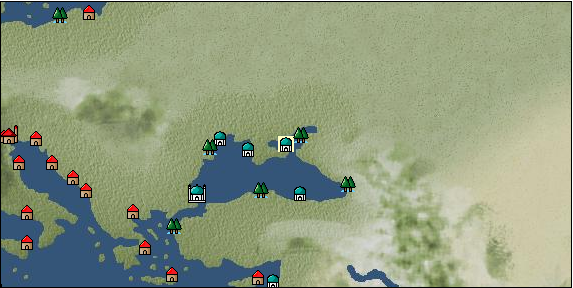

# Port: カッファ

import Tabs from '@theme/Tabs';
import TabItem from '@theme/TabItem';

## General Information

| Attribute | Details |
| :--- | :--- |
| **Port Name** | Kaffa |
| **Port Type** | 領地 |
| **Region** | eastern europe |
| **Sea Area** | Black Sea |
| **Required Language** | Slavic languages |
| **Coordinates** | （1651，2845） |
| **Investment Reward** |  |

### Available Facilities

| guild | intermediary | exchange | tool shop | workshop craftsman | Painter | sculptor | peddler |
| --- | --- | --- | --- | --- | --- | --- | --- |
|   |   | ○ | ○ |   |   |   |   |
| Shipyard Master | Lumbermaker | Sail-maker | weapon craftsman | master | TavernFemale | archive | salesperson |
| --- | --- | --- | --- | --- | --- | --- | --- |
| ○ |   |   |   | ○ |   |   |   |
| Shipwright | 銀行 | street worker | 王宮 | Trading post | church | suburbs | translator |
| --- | --- | --- | --- | --- | --- | --- | --- |
| ○ | ○ | ○ |   |   | ○ |   |   |

### Description
A city on the northern coast of the Black Sea. It has flourished as a trading city since ancient times, and in the 13th century Genoa ruled it as a base on the Black Sea coast. It was recently occupied by the Ottoman Turks. Turkish rugs are also available. *Turkish is also spoken Cultural area: Türkiye Investment reward: National contribution medal (1 medal for every 200k)

<Tabs>
  <TabItem value="trade_goods_sales" label="Trade Goods Sales">

| item | group | purchase price | 同盟時 | remarks |
| --- | --- | --- | --- | --- |
| [cheese](Items/Trade Goods/TradeGoods-Foodstuffs/item_20.md) | [Trading items (food items)](Categories/category_3.md) | 347 | (304) |  |
| [turkish rug](Items/Trade Goods/TradeGoods-Fabrics/item_686.md) | [交易品（織物）](Categories/category_20.md) | 4,159 | (3,639) |  |
| [wheat](Items/Trade Goods/TradeGoods-Foodstuffs/item_16.md) | [Trading items (food items)](Categories/category_3.md) | 45 | (40) |  |
| [wood](Items/Trade Goods/TradeGoods-Wares/item_277.md) | [交易品（工業品）](Categories/category_19.md) | 675 | (591) |  |
| [cotton fabric](Items/Trade Goods/TradeGoods-Fabrics/item_571.md) | [交易品（織物）](Categories/category_20.md) | 761 | (666) |  |
| [cotton](Items/Trade Goods/TradeGoods-Fibers/item_610.md) | [交易品（繊維）](Categories/category_1.md) | 306 | (268) |  |
| [iron ore](Items/Trade Goods/TradeGoods-Minerals/item_146.md) | [Trading Items (Iron Stone)](Categories/category_7.md) | (649) | 568 |  |
| 要投資（必要投資額：600,000） |
  </TabItem>
  <TabItem value="sale_specialty" label="Sale (Specialty)">

| item | group | sale price | 同盟時 | remarks |
| --- | --- | --- | --- | --- |

#### [Trading Goods (Dye)](Categories/category_2.md)

| [ward](Items/Trade Goods/TradeGoods-Dye/item_57.md) | [Trading Goods (Dye)](Categories/category_2.md) | 1,358 | (1,527) |  |

#### [Trading goods (hobby goods)](Categories/category_10.md)

| [tobacco](Items/Trade Goods/TradeGoods-Sunddries/item_109.md) | [Trading goods (hobby goods)](Categories/category_10.md) | 6,810 | (7,661) |  |

#### [Trading Goods (Spices)](Categories/category_12.md)

| [saffron](Items/Trade Goods/TradeGoods-Spices/item_845.md) | [Trading Goods (Spices)](Categories/category_12.md) | 3,141 | (3,533) |  |

#### [交易品（工業品）](Categories/category_19.md)

| [marble](Items/Trade Goods/TradeGoods-Wares/item_52.md) | [交易品（工業品）](Categories/category_19.md) | 1,450 | (1,631) |  |
  </TabItem>
  <TabItem value="sale_no_specialty" label="Sale (No Specialty)">

| item | group | sale price | 同盟時 | remarks |
| --- | --- | --- | --- | --- |

#### [Trading goods (artificial goods)](Categories/category_13.md)

| [goldsmith](Items/Trade Goods/TradeGoods-Luxuries/item_687.md) | [Trading goods (artificial goods)](Categories/category_13.md) | 3,410 | (3,836) |  |
| [silversmith](Items/Trade Goods/TradeGoods-Luxuries/item_619.md) | [Trading goods (artificial goods)](Categories/category_13.md) | 5,420 | (6,098) |  |

#### [交易品（美術品）](Categories/category_14.md)

| [marble statue](Items/Trade Goods/TradeGoods-Art/item_50.md) | [交易品（美術品）](Categories/category_14.md) | 2,884 | (3,244) |  |
| [wooden statue](Items/Trade Goods/TradeGoods-Art/item_95.md) | [交易品（美術品）](Categories/category_14.md) | 1,099 | (1,236) |  |

#### [Trading Items (Gemstones)](Categories/category_15.md)

| [coral](Items/Trade Goods/TradeGoods-Gems/item_141.md) | [Trading Items (Gemstones)](Categories/category_15.md) | 3,551 | (3,995) |  |
  </TabItem>
  <TabItem value="guild_&_others" label="Guild & Others">

| item | group | Sales price | Handling NPC | remarks |
| --- | --- | --- | --- | --- |
| There is no sales information for the item |
| --- |
  </TabItem>
  <TabItem value="toolman" label="Toolman">

| item | group | Sales price | Handling NPC | remarks |
| --- | --- | --- | --- | --- |

#### [recipe book](Categories/category_22.md)

| [Techniques for making weapons](Items/Recipe Book/item_1118.md) | [recipe book](Categories/category_22.md) | 50,000 | tool shop owner |  |
| 時代限定（15世紀第3期、15世紀第4期、15世紀第5期、16世紀第1期、16世紀第2期） 【時代固定】15世紀第3期～16世紀2期 |
| [Prairie costume sewing method](Items/Recipe Book/item_5437.md) | [recipe book](Categories/category_22.md) | Fixed recipe | tool shop owner |  |

#### [Equipment (legs)](Categories/category_26.md)

| [gold embroidered boots](Items/Equipment/Equipment-Feet/item_3229.md) | [Equipment (legs)](Categories/category_26.md) | 20,000 | tool shop owner |  |
| 投資要否 |

#### [Consumables (land battle/deck battle)](Categories/category_29.md)

| [tear gas powder bag](Items/Consumables/Consumables-Landbattle/item_104.md) | [Consumables (land battle/deck battle)](Categories/category_29.md) | 150 | tool shop owner |  |
| [hellfire torch](Items/Consumables/Consumables-Landbattle/item_233.md) | [Consumables (land battle/deck battle)](Categories/category_29.md) | 300 | tool shop owner |  |
| [explosive powder](Items/Consumables/Consumables-Landbattle/item_230.md) | [Consumables (land battle/deck battle)](Categories/category_29.md) | 150 | tool shop owner |  |
| [sticky oil](Items/Consumables/Consumables-Landbattle/item_231.md) | [Consumables (land battle/deck battle)](Categories/category_29.md) | 150 | tool shop owner |  |

#### [Consumables (naval/hand-to-hand combat)](Categories/category_30.md)

| [assault flag](Items/Consumables/Consumables-navalhand-to-hand combat/item_228.md) | [Consumables (naval/hand-to-hand combat)](Categories/category_30.md) | 5,000 | tool shop owner |  |

#### [Consumables (skill activation)](Categories/category_31.md)

| [perfume](Items/Consumables/Consumables-Skill/item_226.md) | [Consumables (skill activation)](Categories/category_31.md) | 3,000 | tool shop owner |  |
  </TabItem>
  <TabItem value="shipyard" label="Shipyard">

### Shipyard Master

| item | group | Sales price | Handling NPC | remarks |
| --- | --- | --- | --- | --- |

#### [Boat](Categories/category_43.md)

| [Galliot](Items/Ships/item_210.md) | [Boat](Categories/category_43.md) | 156,000 | Shipyard Master |  |
| [galeas](Items/Ships/item_1447.md) | [Boat](Categories/category_43.md) | 7,500,000 | Shipyard Master |  |
| [galley](Items/Ships/item_227.md) | [Boat](Categories/category_43.md) | 645,000 | Shipyard Master |  |
| [turkish galley](Items/Ships/item_3218.md) | [Boat](Categories/category_43.md) | 11,920,000 | Shipyard Master |  |
| [Dow](Items/Ships/item_780.md) | [Boat](Categories/category_43.md) | 360,000 | Shipyard Master |  |
| [Varsha](Items/Ships/item_201.md) | [Boat](Categories/category_43.md) | 2,000 | Shipyard Master |  |
| [barbarian galley](Items/Ships/item_237.md) | [Boat](Categories/category_43.md) | 560,000 | Shipyard Master |  |
| [commercial galley](Items/Ships/item_229.md) | [Boat](Categories/category_43.md) | 650,000 | Shipyard Master |  |
| [commercial dow](Items/Ships/item_782.md) | [Boat](Categories/category_43.md) | 372,000 | Shipyard Master |  |
| [commercial varsha](Items/Ships/item_204.md) | [Boat](Categories/category_43.md) | 5,200 | Shipyard Master |  |
| [large galley](Items/Ships/item_250.md) | [Boat](Categories/category_43.md) | 2,250,000 | Shipyard Master |  |
| [assault galley](Items/Ships/item_224.md) | [Boat](Categories/category_43.md) | 640,000 | Shipyard Master |  |
| [Battle Barsha](Items/Ships/item_203.md) | [Boat](Categories/category_43.md) | 5,100 | Shipyard Master |  |
| [exploration barsha](Items/Ships/item_202.md) | [Boat](Categories/category_43.md) | 5,000 | Shipyard Master |  |
| [assault dhow](Items/Ships/item_781.md) | [Boat](Categories/category_43.md) | 365,000 | Shipyard Master |  |
| [light galley](Items/Ships/item_209.md) | [Boat](Categories/category_43.md) | 150,000 | Shipyard Master |  |
| [transportation galley](Items/Ships/item_211.md) | [Boat](Categories/category_43.md) | 160,000 | Shipyard Master |  |
| [Large galley for transportation](Items/Ships/item_251.md) | [Boat](Categories/category_43.md) | 2,280,000 | Shipyard Master |  |
| [heavy galley](Items/Ships/item_550.md) | [Boat](Categories/category_43.md) | 2,650,000 | Shipyard Master |  |

### Shipwright

| item | group | Sales price | Handling NPC | remarks |
| --- | --- | --- | --- | --- |

#### [recipe book](Categories/category_22.md)

| [Shipbuilding materials/processed iron materials](Items/Recipe Book/item_1735.md) | [recipe book](Categories/category_22.md) | Fixed recipe | Shipwright |  |

#### [shipbuilding materials](Categories/category_47.md)

| [Processing iron materials](Items/Shipbuilding FS Material/item_1722.md) | [shipbuilding materials](Categories/category_47.md) | Fixed recipe | Shipwright |  |
  </TabItem>
</Tabs>