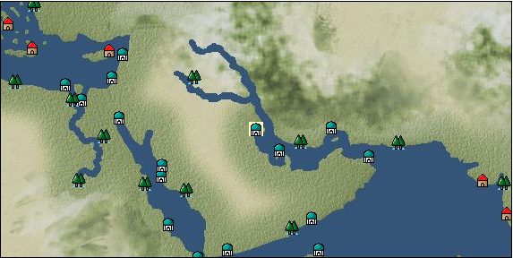

# Port: Basra

import Tabs from '@theme/Tabs';
import TabItem from '@theme/TabItem';

## General Information

| Attribute | Details |
| :--- | :--- |
| **Port Name** | Basra |
| **Port Type** | port of alliance |
| **Region** | Eastern Africa/India |
| **Sea Area** | persian gulf |
| **Required Language** | persian |
| **Coordinates** | （2195，3736） |
| **Investment Reward** | [Collection of famous dishes from the Indian Ocean](docs/Items/RecipeBooks/item_735.md) （必要投資額：400,000ドゥカード） |

### Available Facilities

| guild | intermediary | exchange | tool shop | workshop craftsman | Painter | sculptor | peddler |
| --- | --- | --- | --- | --- | --- | --- | --- |
|   |   | ○ | ○ | ○ |   |   |   |
| Shipyard Master | Lumbermaker | Sail-maker | weapon craftsman | master | TavernFemale | archive | salesperson |
| --- | --- | --- | --- | --- | --- | --- | --- |
|   |   |   |   | ○ |   |   |   |
| Shipwright | 銀行 | street worker | 王宮 | Trading post | church | suburbs | translator |
| --- | --- | --- | --- | --- | --- | --- | --- |
| ○ | ○ | ○ |   |   | ○ | ○ |   |

### Description
A city located in the depths of the Persian Gulf. It was founded in the 7th century and was a center of trade and culture in the 8th century. However, as the Abbasids declined, they lost importance. Still, important products such as Persian rugs are still in circulation. Suburb: Northwest of Basra Cultural area: Persia *Arabic is also spoken There is an overland route from Suez to Basra only for Ottoman Turkish citizens (with an update, there is also an overland route from Suez to Basra for non-Turkish countries)

<Tabs>
  <TabItem value="trade_goods_sales" label="Trade Goods Sales">

| Item | Group | Purchase Price | Allied Price | Remarks |
| --- | --- | --- | --- | --- |
| [senna](docs/Items/TradeGoods/TradeGoods-Medicine/item_155.md) | [Trading products (medical products)](docs/Categories/category_6.md) | 278 | (244) |  |
| [cheese](docs/Items/TradeGoods/TradeGoods-Foodstuffs/item_20.md) | [Trading items (food items)](docs/Categories/category_3.md) | 347 | (304) |  |
| [persian berry](docs/Items/TradeGoods/TradeGoods-Dye/item_693.md) | [Trading Goods (Dye)](docs/Categories/category_2.md) | 1,124 | 984 |  |
| 要投資（必要投資額：180,000） |
| [persian rug](docs/Items/TradeGoods/TradeGoods-Fabrics/item_606.md) | [交易品（織物）](docs/Categories/category_20.md) | 4,750 | (4,156) |  |
| [lemon oil](docs/Items/TradeGoods/TradeGoods-Perfume/item_151.md) | [Trading Goods (Spices)](docs/Categories/category_11.md) | 539 | (472) |  |
| [scimitar](docs/Items/TradeGoods/TradeGoods-Weapons/item_142.md) | [Trading Items (Arms)](docs/Categories/category_16.md) | 989 | (866) |  |
| 要投資（必要投資額：120,000） |
| [leather](docs/Items/TradeGoods/TradeGoods-Fibers/item_44.md) | [交易品（繊維）](docs/Categories/category_1.md) | 424 | (371) |  |
| [oil](docs/Items/TradeGoods/TradeGoods-Wares/item_613.md) | [交易品（工業品）](docs/Categories/category_19.md) | 579 | 508 |  |
| [sulfur](docs/Items/TradeGoods/TradeGoods-Wares/item_66.md) | [交易品（工業品）](docs/Categories/category_19.md) | 383 | (336) |  |
| [wool](docs/Items/TradeGoods/TradeGoods-Fibers/item_5.md) | [交易品（繊維）](docs/Categories/category_1.md) | 369 | (323) |  |
  </TabItem>
  <TabItem value="sale_specialty" label="Sale (Specialty)">

| Item | Group | sale price | Allied Price | Remarks |
| --- | --- | --- | --- | --- |

#### [Trading Goods (Dye)](docs/Categories/category_2.md)

| [ward](docs/Items/TradeGoods/TradeGoods-Dye/item_57.md) | Trading Goods (Dye) | 1,990 | (2,238) |  |
| [Safflower](docs/Items/TradeGoods/TradeGoods-Dye/item_1059.md) | Trading Goods (Dye) | 939 | (1,056) |  |

#### [交易品（調味料）](docs/Categories/category_4.md)

| [tamarind](docs/Items/TradeGoods/TradeGoods-Seasonings/item_1968.md) | 交易品（調味料） | 1,133 | (1,274) |  |
| [apple cider vinegar](docs/Items/TradeGoods/TradeGoods-Seasonings/item_882.md) | 交易品（調味料） | 822 | (924) |  |

#### [Trading products (medical products)](docs/Categories/category_6.md)

| [Nothing](docs/Items/TradeGoods/TradeGoods-Medicine/item_1053.md) | Trading products (medical products) | 1,143 | (1,286) |  |

#### [Trading goods (hobby goods)](docs/Categories/category_10.md)

| [tobacco](docs/Items/TradeGoods/TradeGoods-Sunddries/item_109.md) | Trading goods (hobby goods) | 1,545 | (1,738) |  |
| [prune](docs/Items/TradeGoods/TradeGoods-Sunddries/item_523.md) | Trading goods (hobby goods) | 763 | (858) |  |
| [dried figs](docs/Items/TradeGoods/TradeGoods-Sunddries/item_611.md) | Trading goods (hobby goods) | 702 | (789) |  |
| [dried apple](docs/Items/TradeGoods/TradeGoods-Sunddries/item_19.md) | Trading goods (hobby goods) | 596 | (670) |  |
| [raspberry](docs/Items/TradeGoods/TradeGoods-Sunddries/item_5419.md) | Trading goods (hobby goods) | (14,951) | 17,445 |  |

#### [Trading Goods (Spices)](docs/Categories/category_11.md)

| [orange oil](docs/Items/TradeGoods/TradeGoods-Perfume/item_778.md) | Trading Goods (Spices) | 592 | (666) |  |
| [oakmoss](docs/Items/TradeGoods/TradeGoods-Perfume/item_819.md) | Trading Goods (Spices) | 1,219 | (1,371) |  |
| [daffodil](docs/Items/TradeGoods/TradeGoods-Perfume/item_612.md) | Trading Goods (Spices) | 1,353 | (1,522) |  |
| [lily of the valley](docs/Items/TradeGoods/TradeGoods-Perfume/item_358.md) | Trading Goods (Spices) | 1,777 | (1,999) |  |
| [geranium](docs/Items/TradeGoods/TradeGoods-Perfume/item_145.md) | Trading Goods (Spices) | 1,134 | (1,275) |  |
| [lira](docs/Items/TradeGoods/TradeGoods-Perfume/item_30.md) | Trading Goods (Spices) | 1,697 | (1,909) |  |
| [貝甲香](docs/Items/TradeGoods/TradeGoods-Perfume/item_776.md) | Trading Goods (Spices) | 1,169 | (1,315) |  |

#### [Trading goods (artificial goods)](docs/Categories/category_13.md)

| [glasswork](docs/Items/TradeGoods/TradeGoods-Luxuries/item_60.md) | Trading goods (artificial goods) | 2,284 | (2,569) |  |
| [Tumbaga](docs/Items/TradeGoods/TradeGoods-Luxuries/item_3028.md) | Trading goods (artificial goods) | 9,963 | (11,209) |  |

#### [Trading Items (Gemstones)](docs/Categories/category_15.md)

| [diamond](docs/Items/TradeGoods/TradeGoods-Gems/item_449.md) | Trading Items (Gemstones) | 4,610 | (5,186) |  |

#### [Trading Items (Arms)](docs/Categories/category_16.md)

| [crossbow](docs/Items/TradeGoods/TradeGoods-Weapons/item_537.md) | Trading Items (Arms) | 1,660 | (1,867) |  |
| [damascus sword](docs/Items/TradeGoods/TradeGoods-Weapons/item_903.md) | Trading Items (Arms) | (8,341) | 9,732 |  |

#### [Trading Items (Firearms)](docs/Categories/category_17.md)

| [musket gun](docs/Items/TradeGoods/TradeGoods-Firearms/item_584.md) | Trading Items (Firearms) | 5,080 | (5,715) |  |

#### [交易品（工業品）](docs/Categories/category_19.md)

| [羊皮紙](docs/Items/TradeGoods/TradeGoods-Wares/item_53.md) | 交易品（工業品） | (2,051) | 2,393 |  |

#### [交易品（織物）](docs/Categories/category_20.md)

| [Awaiyo](docs/Items/TradeGoods/TradeGoods-Fabrics/item_3002.md) | 交易品（織物） | 4,014 | (4,516) |  |
| [dutch calico](docs/Items/TradeGoods/TradeGoods-Fabrics/item_1435.md) | 交易品（織物） | 2,370 | (2,666) |  |
| [turkish rug](docs/Items/TradeGoods/TradeGoods-Fabrics/item_686.md) | 交易品（織物） | [Edit Sale Price](docs/Ports/port_83.md) |  |
| [flannel](docs/Items/TradeGoods/TradeGoods-Fabrics/item_149.md) | 交易品（織物） | 1,920 | (2,160) |  |
  </TabItem>
  <TabItem value="sale_no_specialty" label="Sale (No Specialty)">

| Item | Group | sale price | Allied Price | Remarks |
| --- | --- | --- | --- | --- |

#### [交易品（繊維）](docs/Categories/category_1.md)

| [raw silk](docs/Items/TradeGoods/TradeGoods-Fibers/item_677.md) | 交易品（繊維） | 2,651 | (2,982) |  |

#### [Trading Goods (Dye)](docs/Categories/category_2.md)

| [Indian Akane](docs/Items/TradeGoods/TradeGoods-Dye/item_1037.md) | Trading Goods (Dye) | 562 | (632) |  |
| [Indian indigo](docs/Items/TradeGoods/TradeGoods-Dye/item_157.md) | Trading Goods (Dye) | 577 | (649) |  |
| [pomegranate](docs/Items/TradeGoods/TradeGoods-Dye/item_907.md) | Trading Goods (Dye) | 443 | (498) |  |

#### [Trading items (food items)](docs/Categories/category_3.md)

| [mutton](docs/Items/TradeGoods/TradeGoods-Foodstuffs/item_33.md) | Trading items (food items) | 382 | (429) |  |

#### [交易品（調味料）](docs/Categories/category_4.md)

| [sugar](docs/Items/TradeGoods/TradeGoods-Seasonings/item_94.md) | 交易品（調味料） | 850 | (956) |  |

#### [Trading products (medical products)](docs/Categories/category_6.md)

| [chamomile](docs/Items/TradeGoods/TradeGoods-Medicine/item_292.md) | Trading products (medical products) | 740 | (832) |  |
| [belladonna](docs/Items/TradeGoods/TradeGoods-Medicine/item_1056.md) | Trading products (medical products) | (576) | 672 |  |
| [Maca](docs/Items/TradeGoods/TradeGoods-Medicine/item_3000.md) | Trading products (medical products) | 1,687 | (1,898) |  |

#### [Trading products (precious metals)](docs/Categories/category_8.md)

| [gold](docs/Items/TradeGoods/TradeGoods-Metals/item_659.md) | Trading products (precious metals) | 5,621 | (6,324) |  |

#### [Trading goods (hobby goods)](docs/Categories/category_10.md)

| [black tea](docs/Items/TradeGoods/TradeGoods-Sunddries/item_675.md) | Trading goods (hobby goods) | 758 | (852) |  |

#### [Trading Goods (Spices)](docs/Categories/category_11.md)

| [ylang ylang](docs/Items/TradeGoods/TradeGoods-Perfume/item_1434.md) | Trading Goods (Spices) | 947 | (1,065) |  |
| [civet](docs/Items/TradeGoods/TradeGoods-Perfume/item_808.md) | Trading Goods (Spices) | 2,944 | (3,312) |  |
| [jasmine](docs/Items/TradeGoods/TradeGoods-Perfume/item_772.md) | Trading Goods (Spices) | 3,528 | (3,969) |  |
| [mastic](docs/Items/TradeGoods/TradeGoods-Perfume/item_680.md) | Trading Goods (Spices) | 1,938 | (2,180) |  |
| [sandalwood](docs/Items/TradeGoods/TradeGoods-Perfume/item_771.md) | Trading Goods (Spices) | 2,330 | (2,621) |  |
| [Ryushu incense](docs/Items/TradeGoods/TradeGoods-Perfume/item_101.md) | Trading Goods (Spices) | 3,012 | (3,388) |  |
| [Musk](docs/Items/TradeGoods/TradeGoods-Perfume/item_158.md) | Trading Goods (Spices) | 3,664 | (4,122) |  |

#### [Trading Goods (Spices)](docs/Categories/category_12.md)

| [pepper](docs/Items/TradeGoods/TradeGoods-Spices/item_58.md) | Trading Goods (Spices) | 404 | (454) |  |
| [cinnamon](docs/Items/TradeGoods/TradeGoods-Spices/item_1432.md) | Trading Goods (Spices) | 611 | (687) |  |
| [ginger](docs/Items/TradeGoods/TradeGoods-Spices/item_112.md) | Trading Goods (Spices) | 328 | (369) |  |
| [mint](docs/Items/TradeGoods/TradeGoods-Spices/item_816.md) | Trading Goods (Spices) | 113 | (127) |  |

#### [Trading goods (artificial goods)](docs/Categories/category_13.md)

| [Ivory work](docs/Items/TradeGoods/TradeGoods-Luxuries/item_1090.md) | Trading goods (artificial goods) | 2,613 | (2,939) |  |
| [goldsmith](docs/Items/TradeGoods/TradeGoods-Luxuries/item_687.md) | Trading goods (artificial goods) | 5,423 | (6,101) |  |
| [silversmith](docs/Items/TradeGoods/TradeGoods-Luxuries/item_619.md) | Trading goods (artificial goods) | 5,290 | (5,951) |  |
| [ceramics](docs/Items/TradeGoods/TradeGoods-Luxuries/item_152.md) | Trading goods (artificial goods) | 1,647 | (1,853) |  |

#### [交易品（美術品）](docs/Categories/category_14.md)

| [古美術品](docs/Items/TradeGoods/TradeGoods-Art/item_51.md) | 交易品（美術品） | 4,120 | (4,635) |  |

#### [Trading Items (Gemstones)](docs/Categories/category_15.md)

| [aventurine](docs/Items/TradeGoods/TradeGoods-Gems/item_678.md) | Trading Items (Gemstones) | 1,980 | (2,227) |  |
| [emerald](docs/Items/TradeGoods/TradeGoods-Gems/item_777.md) | Trading Items (Gemstones) | 3,878 | (4,363) |  |
| [cat's eye](docs/Items/TradeGoods/TradeGoods-Gems/item_1047.md) | Trading Items (Gemstones) | 3,178 | (3,575) |  |
| [sapphire](docs/Items/TradeGoods/TradeGoods-Gems/item_676.md) | Trading Items (Gemstones) | 4,090 | (4,601) |  |
| [turquoise](docs/Items/TradeGoods/TradeGoods-Gems/item_1006.md) | Trading Items (Gemstones) | 1,330 | (1,496) |  |
| [lapis lazuli](docs/Items/TradeGoods/TradeGoods-Gems/item_995.md) | Trading Items (Gemstones) | 2,429 | (2,732) |  |
| [ruby](docs/Items/TradeGoods/TradeGoods-Gems/item_773.md) | Trading Items (Gemstones) | 4,330 | (4,871) |  |
| [ivory](docs/Items/TradeGoods/TradeGoods-Gems/item_699.md) | Trading Items (Gemstones) | 2,130 | (2,396) |  |

#### [Trading Items (Firearms)](docs/Categories/category_17.md)

| [大砲](docs/Items/TradeGoods/TradeGoods-Firearms/item_4.md) | Trading Items (Firearms) | 4,826 | (5,429) |  |
| [bullet](docs/Items/TradeGoods/TradeGoods-Firearms/item_13.md) | Trading Items (Firearms) | 1,320 | (1,485) |  |

#### [交易品（工業品）](docs/Categories/category_19.md)

| [wood](docs/Items/TradeGoods/TradeGoods-Wares/item_277.md) | 交易品（工業品） | 867 | (975) |  |
| [iron material](docs/Items/TradeGoods/TradeGoods-Wares/item_268.md) | 交易品（工業品） | 1,226 | (1,379) |  |

#### [交易品（織物）](docs/Categories/category_20.md)

| [indian chintz](docs/Items/TradeGoods/TradeGoods-Fabrics/item_159.md) | 交易品（織物） | 1,025 | (1,153) |  |
  </TabItem>
  <TabItem value="guild_&_others" label="Guild & Others">

| Item | Group | Sales price | Handling NPC | Remarks |
| --- | --- | --- | --- | --- |

#### others

| [Babylonian costume sewing method](docs/Items/RecipeBooks/item_4775.md) | [recipe book](docs/Categories/category_22.md) | Fixed recipe |  |  |
| 時代限定（紀元前） 【時代固定】紀元前　住人 |
  </TabItem>
  <TabItem value="toolman" label="Toolman">

| Item | Group | Sales price | Handling NPC | Remarks |
| --- | --- | --- | --- | --- |

#### [Equipment (head)](docs/Categories/category_23.md)

| [chador](docs/Items/Equipment/Equipment-Head/item_696.md) | Equipment (head) | 37,300 | tool shop owner |  |
| [babylonian headband](docs/Items/Equipment/Equipment-Head/item_4772.md) | Equipment (head) | 20,000 | tool shop owner |  |
| 【時代固定】紀元前 |

#### [Equipment (body)](docs/Categories/category_24.md)

| [Chepkan](docs/Items/Equipment/Equipment-Body/item_856.md) | Equipment (body) | 133,700 | tool shop owner |  |
| 要投資（必要投資額：120,000） |
| [Chadli](docs/Items/Equipment/Equipment-Body/item_694.md) | Equipment (body) | 84,700 | tool shop owner |  |
| [babylonian tunic](docs/Items/Equipment/Equipment-Body/item_4770.md) | Equipment (body) | 25,000 | tool shop owner |  |
| 【時代固定】紀元前 |
| [babylonian dress](docs/Items/Equipment/Equipment-Body/item_4771.md) | Equipment (body) | 60,000 | tool shop owner |  |
| 【時代固定】紀元前 |

#### [Equipment (legs)](docs/Categories/category_26.md)

| [babylonian sandals](docs/Items/Equipment/Equipment-Feet/item_4773.md) | Equipment (legs) | 5,000 | tool shop owner |  |
| 【時代固定】紀元前 |

#### [Equipment (belongings)](docs/Categories/category_27.md)

| [Jiraha Bock](docs/Items/Equipment/Equipment-Weapon/item_2007.md) | Equipment (belongings) | 60,200 | tool shop owner |  |
| 要投資（必要投資額：320,000） |

#### [装備品（服飾品）](docs/Categories/category_28.md)

| [sandalwood fan](docs/Items/Equipment/Equipment-Accessory/item_857.md) | 装備品（服飾品） | 25,000 | tool shop owner |  |
| 要投資（必要投資額：180,000） |

#### [Consumables (land battle/deck battle)](docs/Categories/category_29.md)

| [numbness medicine](docs/Items/Consumables/Consumables-Landbattle/item_452.md) | Consumables (land battle/deck battle) | 500 | tool shop owner |  |
| [strong adhesive oil](docs/Items/Consumables/Consumables-Landbattle/item_662.md) | Consumables (land battle/deck battle) | 200 | tool shop owner |  |
| [hellfire torch](docs/Items/Consumables/Consumables-Landbattle/item_233.md) | Consumables (land battle/deck battle) | 300 | tool shop owner |  |
| [Assortment of secret medicines](docs/Items/Consumables/Consumables-Landbattle/item_665.md) | Consumables (land battle/deck battle) | 10,000 | tool shop owner |  |

#### [Consumables (naval/hand-to-hand combat)](docs/Categories/category_30.md)

| [strange smell](docs/Items/Consumables/Consumables-navalhand-to-hand combat/item_809.md) | Consumables (naval/hand-to-hand combat) | 3,000 | tool shop owner |  |

#### [Consumables (request documents)](docs/Categories/category_45.md)

| [Precious metal purchase order](docs/Items/Consumables/Consumables-Documents/item_4916.md) | Consumables (request documents) | 60,000 | tool shop owner |  |
  </TabItem>
  <TabItem value="kobo_craftsmen" label="Craftsman">

| Item | Group | Sales price | Handling NPC | Remarks |
| --- | --- | --- | --- | --- |

#### [Consumables (condition recovery)](docs/Categories/category_21.md)

| [cat figurine](docs/Items/Consumables/Consumables-Recovery/item_588.md) | Consumables (condition recovery) | 14,500 | workshop craftsman |  |
| [Nostalgic carillon bell](docs/Items/Consumables/Consumables-Recovery/item_245.md) | Consumables (condition recovery) | 200 | workshop craftsman |  |
| [Ship song sheet music](docs/Items/Consumables/Consumables-Recovery/item_247.md) | Consumables (condition recovery) | 200 | workshop craftsman |  |

#### [recipe book](docs/Categories/category_22.md)

| [Babylonian accessory manufacturing method](docs/Items/RecipeBooks/item_4774.md) | recipe book | Fixed recipe | workshop craftsman |  |
| 【時代固定】紀元前 |
  </TabItem>
</Tabs>