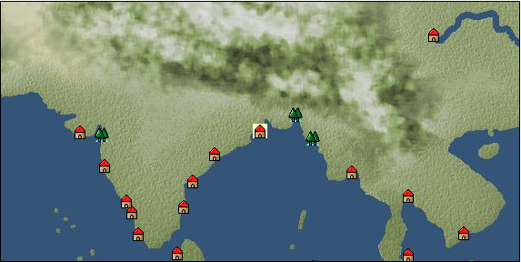

# Port: カルカッタ

import Tabs from '@theme/Tabs';
import TabItem from '@theme/TabItem';

## General Information

| Attribute | Details |
| :--- | :--- |
| **Port Name** | calcutta |
| **Port Type** | port of alliance |
| **Region** | Eastern Africa/India |
| **Sea Area** | bay of bengal |
| **Required Language** | Indian languages |
| **Coordinates** | （4000，3960） |
| **Investment Reward** | [Craftsman's Boot Strengthening Method](Items/Recipe Book/item_1509.md) （必要投資額：1,280,000ドゥカード） |

### Available Facilities

| guild | intermediary | exchange | tool shop | workshop craftsman | Painter | sculptor | peddler |
| --- | --- | --- | --- | --- | --- | --- | --- |
|   |   | ○ | ○ | ○ |   |   |   |
| Shipyard Master | Lumbermaker | Sail-maker | weapon craftsman | master | TavernFemale | archive | salesperson |
| --- | --- | --- | --- | --- | --- | --- | --- |
|   |   |   |   | ○ |   |   |   |
| Shipwright | 銀行 | street worker | 王宮 | Trading post | church | suburbs | translator |
| --- | --- | --- | --- | --- | --- | --- | --- |
| ○ | ○ | ○ |   |   | ○ | ○ |   |

### Description
An estuary town facing the Bay of Bengal. It is an important base for traveling to Southeast Asia, and also handles products from China. High-quality textiles and jewelry are distributed here. Suburbs: Southwest Calcutta Cultural area: India

<Tabs>
  <TabItem value="trade_goods_sales" label="Trade Goods Sales">

| item | group | purchase price | 同盟時 | remarks |
| --- | --- | --- | --- | --- |
| [indian chintz](Items/Trade Goods/TradeGoods-Fabrics/item_159.md) | [交易品（織物）](Categories/category_20.md) | 877 | (768) |  |
| [ruby](Items/Trade Goods/TradeGoods-Gems/item_773.md) | [Trading Items (Gemstones)](Categories/category_15.md) | 3,852 | (3,371) |  |
| 要投資（必要投資額：150,000） |
| [Paddy rice](Items/Trade Goods/TradeGoods-Foodstuffs/item_654.md) | [Trading items (food items)](Categories/category_3.md) | 50 | (44) |  |
| [raw silk](Items/Trade Goods/TradeGoods-Fibers/item_677.md) | [交易品（繊維）](Categories/category_1.md) | 1,904 | (1,666) |  |
| [silk fabric](Items/Trade Goods/TradeGoods-Fabrics/item_823.md) | [交易品（織物）](Categories/category_20.md) | 2,506 | (2,193) |  |
| [iron ore](Items/Trade Goods/TradeGoods-Minerals/item_146.md) | [Trading Items (Iron Stone)](Categories/category_7.md) | 648 | (567) |  |
| [jute](Items/Trade Goods/TradeGoods-Fibers/item_128.md) | [交易品（繊維）](Categories/category_1.md) | 141 | (124) |  |
  </TabItem>
  <TabItem value="sale_specialty" label="Sale (Specialty)">

| item | group | sale price | 同盟時 | remarks |
| --- | --- | --- | --- | --- |

#### [交易品（繊維）](Categories/category_1.md)

| [Basho](Items/Trade Goods/TradeGoods-Fibers/item_3862.md) | [交易品（繊維）](Categories/category_1.md) | (10,388) | 12,121 |  |
| [feather](Items/Trade Goods/TradeGoods-Fibers/item_585.md) | [交易品（繊維）](Categories/category_1.md) | 930 | (1,046) |  |

#### [Trading Goods (Dye)](Categories/category_2.md)

| [ward](Items/Trade Goods/TradeGoods-Dye/item_57.md) | [Trading Goods (Dye)](Categories/category_2.md) | 2,378 | (2,675) |  |
| [Safflower](Items/Trade Goods/TradeGoods-Dye/item_1059.md) | [Trading Goods (Dye)](Categories/category_2.md) | 995 | (1,119) |  |
| [Locao](Items/Trade Goods/TradeGoods-Dye/item_3909.md) | [Trading Goods (Dye)](Categories/category_2.md) | (10,153) | 11,847 |  |

#### [Trading items (food items)](Categories/category_3.md)

| [Chinese noodles](Items/Trade Goods/TradeGoods-Foodstuffs/item_3906.md) | [Trading items (food items)](Categories/category_3.md) | (8,900) | 10,384 |  |

#### [交易品（調味料）](Categories/category_4.md)

| [tamarind](Items/Trade Goods/TradeGoods-Seasonings/item_1968.md) | [交易品（調味料）](Categories/category_4.md) | 1,230 | (1,383) |  |
| [apple cider vinegar](Items/Trade Goods/TradeGoods-Seasonings/item_882.md) | [交易品（調味料）](Categories/category_4.md) | 885 | (995) |  |
| [羅漢果](Items/Trade Goods/TradeGoods-Seasonings/item_4004.md) | [交易品（調味料）](Categories/category_4.md) | (13,957) | 16,285 |  |
| [Bean sauce](Items/Trade Goods/TradeGoods-Seasonings/item_3875.md) | [交易品（調味料）](Categories/category_4.md) | (10,029) | 11,702 |  |
| [black vinegar](Items/Trade Goods/TradeGoods-Seasonings/item_3475.md) | [交易品（調味料）](Categories/category_4.md) | 2,250 | 2,250 |  |

#### [交易品（雑貨）](Categories/category_5.md)

| [chinese books](Items/Trade Goods/TradeGoods-Misc/item_3927.md) | [交易品（雑貨）](Categories/category_5.md) | (12,019) | 14,024 |  |
| [old ink stick](Items/Trade Goods/TradeGoods-Misc/item_3921.md) | [交易品（雑貨）](Categories/category_5.md) | (13,813) | 16,117 |  |

#### [Trading products (medical products)](Categories/category_6.md)

| [Saikaku](Items/Trade Goods/TradeGoods-Medicine/item_1959.md) | [Trading products (medical products)](Categories/category_6.md) | 3,111 | (3,500) |  |
| [Cordyceps sinensis](Items/Trade Goods/TradeGoods-Medicine/item_3839.md) | [Trading products (medical products)](Categories/category_6.md) | (10,806) | 12,608 |  |
| [Nothing](Items/Trade Goods/TradeGoods-Medicine/item_1053.md) | [Trading products (medical products)](Categories/category_6.md) | 1,184 | (1,332) |  |

#### [Trading Items (Iron Stone)](Categories/category_7.md)

| [red copper ore](Items/Trade Goods/TradeGoods-Minerals/item_3863.md) | [Trading Items (Iron Stone)](Categories/category_7.md) | (10,581) | 12,346 |  |

#### [Trading products (precious metals)](Categories/category_8.md)

| [雲南銀](Items/Trade Goods/TradeGoods-Metals/item_3905.md) | [Trading products (precious metals)](Categories/category_8.md) | (9,020) | 10,525 |  |

#### [Trading goods (hobby goods)](Categories/category_10.md)

| [prune](Items/Trade Goods/TradeGoods-Sunddries/item_523.md) | [Trading goods (hobby goods)](Categories/category_10.md) | 805 | (905) |  |
| [Chinese tea](Items/Trade Goods/TradeGoods-Sunddries/item_3907.md) | [Trading goods (hobby goods)](Categories/category_10.md) | (9,399) | 10,967 |  |
| [dried figs](Items/Trade Goods/TradeGoods-Sunddries/item_611.md) | [Trading goods (hobby goods)](Categories/category_10.md) | 559 | (628) |  |
| [dried apple](Items/Trade Goods/TradeGoods-Sunddries/item_19.md) | [Trading goods (hobby goods)](Categories/category_10.md) | 638 | (717) |  |

#### [Trading Goods (Spices)](Categories/category_11.md)

| [ylang ylang](Items/Trade Goods/TradeGoods-Perfume/item_1434.md) | [Trading Goods (Spices)](Categories/category_11.md) | 1,010 | (1,136) |  |
| [oakmoss](Items/Trade Goods/TradeGoods-Perfume/item_819.md) | [Trading Goods (Spices)](Categories/category_11.md) | 1,449 | (1,630) |  |
| [Osmanthus](Items/Trade Goods/TradeGoods-Perfume/item_3925.md) | [Trading Goods (Spices)](Categories/category_11.md) | (10,177) | 11,875 |  |
| [gardenia](Items/Trade Goods/TradeGoods-Perfume/item_1091.md) | [Trading Goods (Spices)](Categories/category_11.md) | 12,960 | (14,581) |  |
| [daffodil](Items/Trade Goods/TradeGoods-Perfume/item_612.md) | [Trading Goods (Spices)](Categories/category_11.md) | 1,470 | 1,634 |  |
| Items collected and processed outside the gate |
| [lily of the valley](Items/Trade Goods/TradeGoods-Perfume/item_358.md) | [Trading Goods (Spices)](Categories/category_11.md) | 1,830 | 1,832 |  |
| Items collected and processed outside the gate |
| [geranium](Items/Trade Goods/TradeGoods-Perfume/item_145.md) | [Trading Goods (Spices)](Categories/category_11.md) | 887 | (997) |  |
| [lira](Items/Trade Goods/TradeGoods-Perfume/item_30.md) | [Trading Goods (Spices)](Categories/category_11.md) | 1,820 | 2,000 |  |
| Items collected and processed outside the gate |

#### [Trading Goods (Spices)](Categories/category_12.md)

| [Kouzuku](Items/Trade Goods/TradeGoods-Spices/item_3690.md) | [Trading Goods (Spices)](Categories/category_12.md) | (9,185) | 10,717 |  |
| [saffron](Items/Trade Goods/TradeGoods-Spices/item_845.md) | [Trading Goods (Spices)](Categories/category_12.md) | (4,137) | 4,827 |  |
| [star anise](Items/Trade Goods/TradeGoods-Spices/item_3908.md) | [Trading Goods (Spices)](Categories/category_12.md) | (9,207) | 10,743 |  |

#### [Trading goods (artificial goods)](Categories/category_13.md)

| [glasswork](Items/Trade Goods/TradeGoods-Luxuries/item_60.md) | [Trading goods (artificial goods)](Categories/category_13.md) | 3,380 | (3,802) |  |
| [Kuresute](Items/Trade Goods/TradeGoods-Luxuries/item_3897.md) | [Trading goods (artificial goods)](Categories/category_13.md) | (3,147) | 3,672 |  |
| [Song Baici](Items/Trade Goods/TradeGoods-Luxuries/item_3904.md) | [Trading goods (artificial goods)](Categories/category_13.md) | (10,951) | 12,778 |  |
| [湖筆](Items/Trade Goods/TradeGoods-Luxuries/item_3898.md) | [Trading goods (artificial goods)](Categories/category_13.md) | (3,236) | 3,775 |  |
| [Corner work](Items/Trade Goods/TradeGoods-Luxuries/item_3696.md) | [Trading goods (artificial goods)](Categories/category_13.md) | (8,238) | 9,612 |  |

#### [交易品（美術品）](Categories/category_14.md)

| [Chinese calligraphy and painting](Items/Trade Goods/TradeGoods-Art/item_3926.md) | [交易品（美術品）](Categories/category_14.md) | (12,348) | 14,408 |  |
| [taiwan wood carving](Items/Trade Goods/TradeGoods-Art/item_3697.md) | [交易品（美術品）](Categories/category_14.md) | (8,559) | 9,987 |  |
| [Mother-of-pearl lacquerware](Items/Trade Goods/TradeGoods-Art/item_3785.md) | [交易品（美術品）](Categories/category_14.md) | (10,915) | 12,736 |  |

#### [Trading Items (Gemstones)](Categories/category_15.md)

| [diamond](Items/Trade Goods/TradeGoods-Gems/item_449.md) | [Trading Items (Gemstones)](Categories/category_15.md) | 4,740 | (5,333) |  |
| [pink diamond](Items/Trade Goods/TradeGoods-Gems/item_2874.md) | [Trading Items (Gemstones)](Categories/category_15.md) | 5,410 | (6,086) |  |
| [amber](Items/Trade Goods/TradeGoods-Gems/item_618.md) | [Trading Items (Gemstones)](Categories/category_15.md) | 5,566 | (6,262) |  |
| Items collected and processed outside the gate |
| [mutton fat white jade](Items/Trade Goods/TradeGoods-Gems/item_3903.md) | [Trading Items (Gemstones)](Categories/category_15.md) | (9,250) | 10,793 |  |

#### [Trading Items (Arms)](Categories/category_16.md)

| [crossbow](Items/Trade Goods/TradeGoods-Weapons/item_537.md) | [Trading Items (Arms)](Categories/category_16.md) | 1,850 | (2,081) |  |
| [broadsword](Items/Trade Goods/TradeGoods-Weapons/item_3754.md) | [Trading Items (Arms)](Categories/category_16.md) | (10,713) | 12,500 |  |
| [Japanese sword](Items/Trade Goods/TradeGoods-Weapons/item_3437.md) | [Trading Items (Arms)](Categories/category_16.md) | (8,402) | 9,803 |  |
| [藤製鎧](Items/Trade Goods/TradeGoods-Weapons/item_4276.md) | [Trading Items (Arms)](Categories/category_16.md) | (8,367) | 9,763 |  |
| [Blue dragon sword](Items/Trade Goods/TradeGoods-Weapons/item_3923.md) | [Trading Items (Arms)](Categories/category_16.md) | (10,667) | 12,446 |  |

#### [Trading Items (Firearms)](Categories/category_17.md)

| [musket gun](Items/Trade Goods/TradeGoods-Firearms/item_584.md) | [Trading Items (Firearms)](Categories/category_17.md) | 5,860 | (6,593) |  |
| [monocular gun](Items/Trade Goods/TradeGoods-Firearms/item_3916.md) | [Trading Items (Firearms)](Categories/category_17.md) | (10,758) | 12,552 |  |
| [銅手銃](Items/Trade Goods/TradeGoods-Firearms/item_3700.md) | [Trading Items (Firearms)](Categories/category_17.md) | (8,381) | 9,779 |  |

#### [Trading Goods (Livestock)](Categories/category_18.md)

| [donkey](Items/Trade Goods/TradeGoods-Livestock/item_3924.md) | [Trading Goods (Livestock)](Categories/category_18.md) | (3,737) | 4,360 |  |

#### [交易品（工業品）](Categories/category_19.md)

| [bamboo](Items/Trade Goods/TradeGoods-Wares/item_3899.md) | [交易品（工業品）](Categories/category_19.md) | (9,476) | 11,057 |  |
| [Wisteria](Items/Trade Goods/TradeGoods-Wares/item_4278.md) | [交易品（工業品）](Categories/category_19.md) | (9,427) | 11,000 |  |

#### [交易品（織物）](Categories/category_20.md)

| [Awaiyo](Items/Trade Goods/TradeGoods-Fabrics/item_3002.md) | [交易品（織物）](Categories/category_20.md) | 3,970 | (4,466) |  |
| [dutch calico](Items/Trade Goods/TradeGoods-Fabrics/item_1435.md) | [交易品（織物）](Categories/category_20.md) | 2,590 | (2,914) |  |
| [gobelin weave](Items/Trade Goods/TradeGoods-Fabrics/item_1276.md) | [交易品（織物）](Categories/category_20.md) | (8,041) | 9,382 |  |
| [taffeta](Items/Trade Goods/TradeGoods-Fabrics/item_1001.md) | [交易品（織物）](Categories/category_20.md) | (3,206) | 3,740 |  |
| [turkish rug](Items/Trade Goods/TradeGoods-Fabrics/item_686.md) | [交易品（織物）](Categories/category_20.md) | (6,507) | 7,592 |  |
| [velvet](Items/Trade Goods/TradeGoods-Fabrics/item_902.md) | [交易品（織物）](Categories/category_20.md) | (5,912) | 6,898 |  |
| [唐錦](Items/Trade Goods/TradeGoods-Fabrics/item_3896.md) | [交易品（織物）](Categories/category_20.md) | (8,839) | 10,313 |  |
| [大和錦](Items/Trade Goods/TradeGoods-Fabrics/item_3482.md) | [交易品（織物）](Categories/category_20.md) | (8,746) | 10,205 |  |
  </TabItem>
  <TabItem value="sale_no_specialty" label="Sale (No Specialty)">

| item | group | sale price | 同盟時 | remarks |
| --- | --- | --- | --- | --- |

#### [交易品（繊維）](Categories/category_1.md)

| [Panya](Items/Trade Goods/TradeGoods-Fibers/item_2097.md) | [交易品（繊維）](Categories/category_1.md) | 445 | (500) |  |
| [raw silk](Items/Trade Goods/TradeGoods-Fibers/item_677.md) | [交易品（繊維）](Categories/category_1.md) | 837 | (941) |  |
| [cotton](Items/Trade Goods/TradeGoods-Fibers/item_610.md) | [交易品（繊維）](Categories/category_1.md) | 299 | (336) |  |
| [Green ramie](Items/Trade Goods/TradeGoods-Fibers/item_3428.md) | [交易品（繊維）](Categories/category_1.md) | (13,738) | 16,030 |  |
| [deerskin](Items/Trade Goods/TradeGoods-Fibers/item_3648.md) | [交易品（繊維）](Categories/category_1.md) | (10,322) | 12,044 |  |
| [jute](Items/Trade Goods/TradeGoods-Fibers/item_128.md) | [交易品（繊維）](Categories/category_1.md) | 62 | (69) |  |

#### [Trading Goods (Dye)](Categories/category_2.md)

| [purple root](Items/Trade Goods/TradeGoods-Dye/item_3752.md) | [Trading Goods (Dye)](Categories/category_2.md) | (13,252) | 15,463 |  |

#### [Trading items (food items)](Categories/category_3.md)

| [soybeans](Items/Trade Goods/TradeGoods-Foodstuffs/item_1958.md) | [Trading items (food items)](Categories/category_3.md) | 119 | (133) |  |
| [Paddy rice](Items/Trade Goods/TradeGoods-Foodstuffs/item_654.md) | [Trading items (food items)](Categories/category_3.md) | 22 | (24) |  |

#### [交易品（雑貨）](Categories/category_5.md)

| [Korean books](Items/Trade Goods/TradeGoods-Misc/item_3750.md) | [交易品（雑貨）](Categories/category_5.md) | (10,370) | 12,100 |  |
| [Rattan work](Items/Trade Goods/TradeGoods-Misc/item_4277.md) | [交易品（雑貨）](Categories/category_5.md) | (10,284) | 12,000 |  |

#### [Trading products (medical products)](Categories/category_6.md)

| [chamomile](Items/Trade Goods/TradeGoods-Medicine/item_292.md) | [Trading products (medical products)](Categories/category_6.md) | 570 | (641) |  |
| [Noni](Items/Trade Goods/TradeGoods-Medicine/item_2099.md) | [Trading products (medical products)](Categories/category_6.md) | 741 | (833) |  |
| [Borei](Items/Trade Goods/TradeGoods-Medicine/item_3678.md) | [Trading products (medical products)](Categories/category_6.md) | (12,244) | 14,286 |  |

#### [Trading Items (Shishi)](Categories/category_7.md)

| [Saltpeter](Items/Trade Goods/TradeGoods-Minerals/item_884.md) | [Trading Items (Shishi)](Categories/category_7.md) | 2,042 | (2,297) |  |
| [iron ore](Items/Trade Goods/TradeGoods-Minerals/item_146.md) | [Trading Items (Iron Stone)](Categories/category_7.md) | 284 | (319) |  |
| [medical stone](Items/Trade Goods/TradeGoods-Minerals/item_3786.md) | [Trading Items (Iron Stone)](Categories/category_7.md) | (10,662) | 12,440 |  |

#### [Trading products (precious metals)](Categories/category_8.md)

| [gold](Items/Trade Goods/TradeGoods-Metals/item_659.md) | [Trading products (precious metals)](Categories/category_8.md) | 6,190 | (6,964) |  |

#### [Trading goods (hobby goods)](Categories/category_10.md)

| [durian](Items/Trade Goods/TradeGoods-Sunddries/item_1949.md) | [Trading goods (hobby goods)](Categories/category_10.md) | 992 | (1,116) |  |
| [banana](Items/Trade Goods/TradeGoods-Sunddries/item_1947.md) | [Trading goods (hobby goods)](Categories/category_10.md) | 287 | (322) |  |
| [mango](Items/Trade Goods/TradeGoods-Sunddries/item_2095.md) | [Trading goods (hobby goods)](Categories/category_10.md) | 447 | (502) |  |
| [black tea](Items/Trade Goods/TradeGoods-Sunddries/item_675.md) | [Trading goods (hobby goods)](Categories/category_10.md) | 767 | (862) |  |

#### [Trading Goods (Spices)](Categories/category_11.md)

| [benzoin](Items/Trade Goods/TradeGoods-Perfume/item_1962.md) | [Trading Goods (Spices)](Categories/category_11.md) | 1,020 | (1,147) |  |
| [龍脳](Items/Trade Goods/TradeGoods-Perfume/item_1676.md) | [Trading Goods (Spices)](Categories/category_11.md) | 1,397 | (1,571) |  |

#### [Trading Goods (Spices)](Categories/category_12.md)

| [pepper](Items/Trade Goods/TradeGoods-Spices/item_58.md) | [Trading Goods (Spices)](Categories/category_12.md) | 368 | (414) |  |
| [Sesame](Items/Trade Goods/TradeGoods-Spices/item_437.md) | [Trading Goods (Spices)](Categories/category_12.md) | 268 | (301) |  |
| [cinnamon](Items/Trade Goods/TradeGoods-Spices/item_1432.md) | [Trading Goods (Spices)](Categories/category_12.md) | 553 | (622) |  |
| [lemongrass](Items/Trade Goods/TradeGoods-Spices/item_2096.md) | [Trading Goods (Spices)](Categories/category_12.md) | 581 | (653) |  |

#### [Trading goods (artificial goods)](Categories/category_13.md)

| [embroidery thread](Items/Trade Goods/TradeGoods-Luxuries/item_898.md) | [Trading goods (artificial goods)](Categories/category_13.md) | 2,286 | (2,572) |  |
| [gold thread](Items/Trade Goods/TradeGoods-Luxuries/item_897.md) | [Trading goods (artificial goods)](Categories/category_13.md) | 3,072 | (3,456) |  |
| [goldsmith](Items/Trade Goods/TradeGoods-Luxuries/item_687.md) | [Trading goods (artificial goods)](Categories/category_13.md) | 6,190 | 6,653 |  |
| [silversmith](Items/Trade Goods/TradeGoods-Luxuries/item_619.md) | [Trading goods (artificial goods)](Categories/category_13.md) | 5,960 | (6,705) |  |

#### [交易品（美術品）](Categories/category_14.md)

| [古美術品](Items/Trade Goods/TradeGoods-Art/item_51.md) | [交易品（美術品）](Categories/category_14.md) | 3,390 | (3,814) |  |

#### [Trading Items (Gemstones)](Categories/category_15.md)

| [jade](Items/Trade Goods/TradeGoods-Gems/item_2015.md) | [Trading Items (Gemstones)](Categories/category_15.md) | 2,215 | (2,492) |  |
| [Tortoiseshell](Items/Trade Goods/TradeGoods-Gems/item_1980.md) | [Trading Items (Gemstones)](Categories/category_15.md) | 2,188 | (2,461) |  |
| [aventurine](Items/Trade Goods/TradeGoods-Gems/item_678.md) | [Trading Items (Gemstones)](Categories/category_15.md) | 1,850 | (2,081) |  |
| [emerald](Items/Trade Goods/TradeGoods-Gems/item_777.md) | [Trading Items (Gemstones)](Categories/category_15.md) | 3,465 | (3,898) |  |
| [cat's eye](Items/Trade Goods/TradeGoods-Gems/item_1047.md) | [Trading Items (Gemstones)](Categories/category_15.md) | 3,240 | (3,645) |  |
| [sapphire](Items/Trade Goods/TradeGoods-Gems/item_676.md) | [Trading Items (Gemstones)](Categories/category_15.md) | 4,290 | (4,826) |  |
| [ruby](Items/Trade Goods/TradeGoods-Gems/item_773.md) | [Trading Items (Gemstones)](Categories/category_15.md) | 1,690 | (1,901) |  |
| 要投資（必要投資額：150,000） |
| [pearl](Items/Trade Goods/TradeGoods-Gems/item_769.md) | [Trading Items (Gemstones)](Categories/category_15.md) | 5,782 | (6,505) |  |
| [ivory](Items/Trade Goods/TradeGoods-Gems/item_699.md) | [Trading Items (Gemstones)](Categories/category_15.md) | 2,150 | (2,418) |  |

#### [Trading Items (Firearms)](Categories/category_17.md)

| [arquebus gun](Items/Trade Goods/TradeGoods-Firearms/item_14.md) | [Trading Items (Firearms)](Categories/category_17.md) | (2,320) | 2,706 |  |
| [大砲](Items/Trade Goods/TradeGoods-Firearms/item_4.md) | [Trading Items (Firearms)](Categories/category_17.md) | 5,041 | (5,671) |  |

#### [交易品（工業品）](Categories/category_19.md)

| [wood](Items/Trade Goods/TradeGoods-Wares/item_277.md) | [交易品（工業品）](Categories/category_19.md) | 789 | (887) |  |

#### [交易品（織物）](Categories/category_20.md)

| [indian chintz](Items/Trade Goods/TradeGoods-Fabrics/item_159.md) | [交易品（織物）](Categories/category_20.md) | 384 | (432) |  |
| [satin](Items/Trade Goods/TradeGoods-Fabrics/item_996.md) | [交易品（織物）](Categories/category_20.md) | (3,818) | 4,455 |  |
| [java chintz](Items/Trade Goods/TradeGoods-Fabrics/item_1970.md) | [交易品（織物）](Categories/category_20.md) | 928 | (1,044) |  |
| [tweed](Items/Trade Goods/TradeGoods-Fabrics/item_31.md) | [交易品（織物）](Categories/category_20.md) | 1,450 | (1,631) |  |
| [silk fabric](Items/Trade Goods/TradeGoods-Fabrics/item_823.md) | [交易品（織物）](Categories/category_20.md) | 1,099 | (1,236) |  |
| [麻織物](Items/Trade Goods/TradeGoods-Fabrics/item_3673.md) | [交易品（織物）](Categories/category_20.md) | (8,815) | 10,285 |  |
  </TabItem>
  <TabItem value="guild_&_others" label="Guild & Others">

| item | group | Sales price | Handling NPC | remarks |
| --- | --- | --- | --- | --- |
| There is no sales information for the item |
| --- |
  </TabItem>
  <TabItem value="toolman" label="Toolman">

| item | group | Sales price | Handling NPC | remarks |
| --- | --- | --- | --- | --- |

#### [recipe book](Categories/category_22.md)

| [Alpine costume sewing method](Items/Recipe Book/item_5451.md) | [recipe book](Categories/category_22.md) | Fixed recipe | tool shop owner |  |

#### [Equipment (belongings)](Categories/category_27.md)

| [Narnari](Items/Equipment/Equipment-Weapon/item_1842.md) | [Equipment (belongings)](Categories/category_27.md) | 42,000 | tool shop owner |  |
| 要投資（必要投資額：240,000） |

#### [Consumables (land battle/deck battle)](Categories/category_29.md)

| [strong adhesive oil](Items/Consumables/Consumables-Landbattle/item_662.md) | [Consumables (land battle/deck battle)](Categories/category_29.md) | 200 | tool shop owner |  |
| [hellfire torch](Items/Consumables/Consumables-Landbattle/item_233.md) | [Consumables (land battle/deck battle)](Categories/category_29.md) | 300 | tool shop owner |  |
| [Arsenite poison](Items/Consumables/Consumables-Landbattle/item_663.md) | [Consumables (land battle/deck battle)](Categories/category_29.md) | 400 | tool shop owner |  |

#### [Consumables (skill activation)](Categories/category_31.md)

| [enchanting incense](Items/Consumables/Consumables-Skill/item_664.md) | [Consumables (skill activation)](Categories/category_31.md) | 1,000 | tool shop owner |  |

#### [Consumables (request documents)](Categories/category_45.md)

| [Arms purchase order form](Items/Consumables/Consumables-Documents/item_2978.md) | [Consumables (request documents)](Categories/category_45.md) | 30,000 | tool shop owner |  |
  </TabItem>
  <TabItem value="kobo_craftsmen" label="Craftsman">

| item | group | Sales price | Handling NPC | remarks |
| --- | --- | --- | --- | --- |

#### [Consumables (condition recovery)](Categories/category_21.md)

| [Nostalgic carillon bell](Items/Consumables/Consumables-Recovery/item_245.md) | [Consumables (condition recovery)](Categories/category_21.md) | 200 | workshop craftsman |  |
| [Ship song sheet music](Items/Consumables/Consumables-Recovery/item_247.md) | [Consumables (condition recovery)](Categories/category_21.md) | 200 | workshop craftsman |  |

#### [recipe book](Categories/category_22.md)

| [Indian weapon manufacturing method](Items/Recipe Book/item_5453.md) | [recipe book](Categories/category_22.md) | Fixed recipe | workshop craftsman |  |

#### [Consumables (other)](Categories/category_44.md)

| [帆塗料](Items/Consumables/Consumables-Other/item_348.md) | [Consumables (other)](Categories/category_44.md) | 500 | workshop craftsman |  |
| [ship paint](Items/Consumables/Consumables-Other/item_347.md) | [Consumables (other)](Categories/category_44.md) | 500 | workshop craftsman |  |
  </TabItem>
  <TabItem value="shipyard" label="Shipyard">

### Shipwright

| item | group | Sales price | Handling NPC | remarks |
| --- | --- | --- | --- | --- |

#### [recipe book](Categories/category_22.md)

| [Shipbuilding materials/ropes](Items/Recipe Book/item_1704.md) | [recipe book](Categories/category_22.md) | Fixed recipe | Shipwright |  |

#### [shipbuilding materials](Categories/category_47.md)

| [rope](Items/Shipbuilding FS Material/item_1684.md) | [shipbuilding materials](Categories/category_47.md) | Fixed recipe | Shipwright |  |
  </TabItem>
</Tabs>