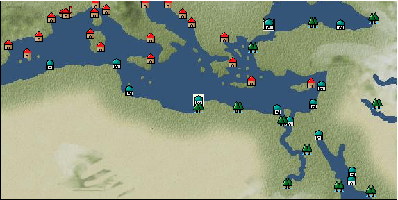

# Port: ベンガジ

import Tabs from '@theme/Tabs';
import TabItem from '@theme/TabItem';

## General Information

| Attribute | Details |
| :--- | :--- |
| **Port Name** | Benghazi |
| **Port Type** | port of alliance |
| **Region** | eastern europe |
| **Sea Area** | ionian sea |
| **Required Language** | arabic |
| **Coordinates** | （891，3480） |
| **Investment Reward** | [Traveler's food procurement techniques](Items/Recipe Book/item_725.md) （必要投資額：240,000ドゥカード） |

### Available Facilities

| guild | intermediary | exchange | tool shop | workshop craftsman | Painter | sculptor | peddler |
| --- | --- | --- | --- | --- | --- | --- | --- |
|   |   | ○ | ○ |   |   |   |   |
| Shipyard Master | Lumbermaker | Sail-maker | weapon craftsman | master | TavernFemale | archive | salesperson |
| --- | --- | --- | --- | --- | --- | --- | --- |
|   |   |   | ○ |   |   |   |   |
| Shipwright | 銀行 | street worker | 王宮 | Trading post | church | suburbs | translator |
| --- | --- | --- | --- | --- | --- | --- | --- |
| ○ | ○ | ○ |   |   |   |   |   |

### Description
It originates from a city built during the ancient Greek era. The city's name comes from a person who contributed to the city's prosperity. Cultural area: North Africa

<Tabs>
  <TabItem value="trade_goods_sales" label="Trade Goods Sales">

| item | group | purchase price | 同盟時 | remarks |
| --- | --- | --- | --- | --- |
| [olive](Items/Trade Goods/TradeGoods-Foodstuffs/item_47.md) | [Trading items (food items)](Categories/category_3.md) | 255 | 224 |  |
| When in alliance: confirmed at 100% |
| [nuts](Items/Trade Goods/TradeGoods-Foodstuffs/item_851.md) | [Trading items (food items)](Categories/category_3.md) | 136 | 120 |  |
| Investment required (Required investment amount: 720,000) Added in EO Chapter 4 At alliance: Confirmed at 100% |
| [Nothing](Items/Trade Goods/TradeGoods-Medicine/item_1053.md) | [Trading products (medical products)](Categories/category_6.md) | 593 | 520 |  |
| 要投資（必要投資額：180,000） |
| [oil](Items/Trade Goods/TradeGoods-Wares/item_613.md) | [交易品（工業品）](Categories/category_19.md) | 579 | 508 |  |
| When in alliance: confirmed at 100% |
| [wool](Items/Trade Goods/TradeGoods-Fibers/item_5.md) | [交易品（繊維）](Categories/category_1.md) | 370 | 324 |  |
| When in alliance: confirmed at 100% |
  </TabItem>
  <TabItem value="sale_specialty" label="Sale (Specialty)">

| item | group | sale price | 同盟時 | remarks |
| --- | --- | --- | --- | --- |

#### [交易品（繊維）](Categories/category_1.md)

| [Rush](Items/Trade Goods/TradeGoods-Fibers/item_3675.md) | 交易品（繊維） | (3,720) | 4,340 |  |
| When in alliance: confirmed at 100% |
| [Basho](Items/Trade Goods/TradeGoods-Fibers/item_3862.md) | 交易品（繊維） | (26,053) | 30,400 |  |
| When in alliance: confirmed at 100% |
| [Panya](Items/Trade Goods/TradeGoods-Fibers/item_2097.md) | 交易品（繊維） | (706) | 823 |  |
| When in alliance: confirmed at 100% |
| [flax](Items/Trade Goods/TradeGoods-Fibers/item_64.md) | 交易品（繊維） | 314 | (353) |  |
| 非同盟時320=102% |
| [feather](Items/Trade Goods/TradeGoods-Fibers/item_585.md) | 交易品（繊維） | 873 | (982) |  |
| [tiger skin](Items/Trade Goods/TradeGoods-Fibers/item_3790.md) | 交易品（繊維） | (37,194) | 43,400 |  |
| 96％＝41700　102％＝44200 |
| [Green ramie](Items/Trade Goods/TradeGoods-Fibers/item_3428.md) | 交易品（繊維） | (26,482) | 30,900 |  |
| 98％＝30300　104％＝32100 |
| [deerskin](Items/Trade Goods/TradeGoods-Fibers/item_3648.md) | 交易品（繊維） | (25,882) | 30,200 |  |
| When in alliance: confirmed at 100% |

#### [Trading Goods (Dye)](Categories/category_2.md)

| [Indian Akane](Items/Trade Goods/TradeGoods-Dye/item_1037.md) | Trading Goods (Dye) | (1,029) | 1,200 |  |
| When in alliance: confirmed at 100% |
| [Indian indigo](Items/Trade Goods/TradeGoods-Dye/item_157.md) | Trading Goods (Dye) | (1,037) | 1,210 |  |
| When in alliance: confirmed at 100% |
| [ward](Items/Trade Goods/TradeGoods-Dye/item_57.md) | Trading Goods (Dye) | (1,003) | 1,170 |  |
| 98%＝1150　103%＝1210 |
| [cochineal](Items/Trade Goods/TradeGoods-Dye/item_1817.md) | Trading Goods (Dye) | (1,466) | 1,710 |  |
| When in alliance: confirmed at 100% |
| [Shorou](Items/Trade Goods/TradeGoods-Dye/item_3691.md) | Trading Goods (Dye) | (25,111) | 29,300 |  |
| When in alliance: confirmed at 100% |
| [turmeric](Items/Trade Goods/TradeGoods-Dye/item_1433.md) | Trading Goods (Dye) | (612) | 713 |  |
| 98%＝703 |
| [Safflower](Items/Trade Goods/TradeGoods-Dye/item_1059.md) | Trading Goods (Dye) | (554) | 646 |  |
| [mayan blue](Items/Trade Goods/TradeGoods-Dye/item_1096.md) | Trading Goods (Dye) | 1,500 | (1,687) |  |
| [mangosteen](Items/Trade Goods/TradeGoods-Dye/item_1973.md) | Trading Goods (Dye) | (1,980) | 2,310 |  |
| When in alliance: confirmed at 100% |
| [mimosa](Items/Trade Goods/TradeGoods-Dye/item_2281.md) | Trading Goods (Dye) | (1,286) | 1,500 |  |
| 98％＝1480　102％＝1520 |
| [log wood](Items/Trade Goods/TradeGoods-Dye/item_1813.md) | Trading Goods (Dye) | 1,350 | (1,518) |  |
| [gallnut](Items/Trade Goods/TradeGoods-Dye/item_3429.md) | Trading Goods (Dye) | (26,310) | 30,700 |  |
| 98％＝30100　104％＝31900 |
| [purple root](Items/Trade Goods/TradeGoods-Dye/item_3752.md) | Trading Goods (Dye) | (26,053) | 30,400 |  |
| 98％＝29800　103％＝31300 |

#### [Trading items (food items)](Categories/category_3.md)

| [buckwheat](Items/Trade Goods/TradeGoods-Foodstuffs/item_3430.md) | Trading items (food items) | (26,482) | 30,900 |  |
| When in alliance: confirmed at 100% |
| [Karasumi](Items/Trade Goods/TradeGoods-Foodstuffs/item_3687.md) | Trading items (food items) | (25,625) | 29,900 |  |
| 98％＝29300　103％＝30700 |
| [kangaroo meat](Items/Trade Goods/TradeGoods-Foodstuffs/item_2285.md) | Trading items (food items) | (775) | 904 |  |
| When in alliance: confirmed at 100% |
| [cactus](Items/Trade Goods/TradeGoods-Foodstuffs/item_2740.md) | Trading items (food items) | 368 | (414) |  |
| [taro](Items/Trade Goods/TradeGoods-Foodstuffs/item_1960.md) | Trading items (food items) | (216) | 251 |  |
| When in alliance: confirmed at 100% |
| [Chamtashima](Items/Trade Goods/TradeGoods-Foodstuffs/item_3771.md) | Trading items (food items) | (1,423) | 1,660 |  |
| 98％＝1650　103％＝1680 |
| [楊州栗](Items/Trade Goods/TradeGoods-Foodstuffs/item_3789.md) | Trading items (food items) | (27,922) | 32,580 |  |
| When in alliance: confirmed at 100% |

#### [交易品（調味料）](Categories/category_4.md)

| [oyster sauce](Items/Trade Goods/TradeGoods-Seasonings/item_3505.md) | 交易品（調味料） | (2,691) | 3,140 |  |
| When in alliance: confirmed at 100% |
| [Gochujang](Items/Trade Goods/TradeGoods-Seasonings/item_3591.md) | 交易品（調味料） | (6,557) | 7,650 |  |
| 98％＝7510　104％＝7920 |
| [tamarind](Items/Trade Goods/TradeGoods-Seasonings/item_1968.md) | 交易品（調味料） | (1,834) | 2,140 |  |
| 98％＝2100　104％＝2210 |
| [Choshi](Items/Trade Goods/TradeGoods-Seasonings/item_3793.md) | 交易品（調味料） | (25,968) | 30,300 |  |
| 98％＝29700　103％＝31100 |
| [Nyoc mam](Items/Trade Goods/TradeGoods-Seasonings/item_1971.md) | 交易品（調味料） | (452) | 527 |  |
| When in alliance: confirmed at 100% |
| [apple cider vinegar](Items/Trade Goods/TradeGoods-Seasonings/item_882.md) | 交易品（調味料） | (503) | 586 |  |
| 98％＝577　101％＝591 |
| [miso](Items/Trade Goods/TradeGoods-Seasonings/item_3420.md) | 交易品（調味料） | (3,103) | 3,620 |  |
| When in alliance: confirmed at 100% |
| [Sha Cha Ji](Items/Trade Goods/TradeGoods-Seasonings/item_3689.md) | 交易品（調味料） | (25,111) | 29,300 |  |
| When in alliance: confirmed at 100% |
| [Bean sauce](Items/Trade Goods/TradeGoods-Seasonings/item_3875.md) | 交易品（調味料） | (25,282) | 29,500 |  |
| When in alliance: confirmed at 100% |
| [soy sauce](Items/Trade Goods/TradeGoods-Seasonings/item_3425.md) | 交易品（調味料） | (25,196) | 29,400 |  |
| 98％＝28800　104％＝30500 |
| [black vinegar](Items/Trade Goods/TradeGoods-Seasonings/item_3475.md) | 交易品（調味料） | (4,328) | 5,050 |  |
| 98％＝4970　104％＝5220 |

#### [交易品（雑貨）](Categories/category_5.md)

| [old ink stick](Items/Trade Goods/TradeGoods-Misc/item_3921.md) | 交易品（雑貨） | (3,857) | 4,500 |  |
| When in alliance: confirmed at 100% |
| [Japanese books](Items/Trade Goods/TradeGoods-Misc/item_3439.md) | 交易品（雑貨） | (26,053) | 30,400 |  |
| When in alliance: confirmed at 100% |
| [lantern](Items/Trade Goods/TradeGoods-Misc/item_3683.md) | 交易品（雑貨） | (3,814) | 4,450 |  |
| When in alliance: confirmed at 100% |
| [Korean books](Items/Trade Goods/TradeGoods-Misc/item_3750.md) | 交易品（雑貨） | (26,825) | 31,300 |  |
| When in alliance: confirmed at 100% |
| [rattan work](Items/Trade Goods/TradeGoods-Misc/item_3698.md) | 交易品（雑貨） | (36,337) | 42,400 |  |
| 98％＝41500　102％＝43200 |

#### [Trading products (medical products)](Categories/category_6.md)

| [Saikaku](Items/Trade Goods/TradeGoods-Medicine/item_1959.md) | Trading products (medical products) | (4,114) | 4,800 |  |
| When in alliance: confirmed at 100% |
| [tea tree](Items/Trade Goods/TradeGoods-Medicine/item_2283.md) | Trading products (medical products) | (1,243) | 1,450 |  |
| When in alliance: confirmed at 100% |
| [Noni](Items/Trade Goods/TradeGoods-Medicine/item_2099.md) | Trading products (medical products) | (1,200) | 1,400 |  |
| When in alliance: confirmed at 100% |
| [heath](Items/Trade Goods/TradeGoods-Medicine/item_63.md) | Trading products (medical products) | (482) | 562 |  |
| 98％＝552　102％＝571 |
| [Borei](Items/Trade Goods/TradeGoods-Medicine/item_3678.md) | Trading products (medical products) | (26,825) | 31,300 |  |
| 98％＝30700　105％＝32800 |
| [Korean ginseng](Items/Trade Goods/TradeGoods-Medicine/item_3738.md) | Trading products (medical products) | (26,310) | 30,700 |  |
| 98％＝30100　106％＝32500 |
| [calamus](Items/Trade Goods/TradeGoods-Medicine/item_3427.md) | Trading products (medical products) | (26,825) | 31,300 |  |
| When in alliance: confirmed at 100% |

#### [Trading Items (Iron Stone)](Categories/category_7.md)

| [Hokutolite](Items/Trade Goods/TradeGoods-Minerals/item_3694.md) | Trading Items (Iron Stone) | (27,167) | 31,700 |  |
| 98％＝31100　103％＝32600 |
| [white porcelain ore](Items/Trade Goods/TradeGoods-Minerals/item_3433.md) | Trading Items (Iron Stone) | (26,225) | 30,600 |  |
| 98％＝30000　103％＝31500 |
| [medical stone](Items/Trade Goods/TradeGoods-Minerals/item_3786.md) | Trading Items (Iron Stone) | (27,510) | 32,100 |  |
| When in alliance: confirmed at 100% |

#### [Trading products (precious metals)](Categories/category_8.md)

| [platinum](Items/Trade Goods/TradeGoods-Metals/item_2178.md) | Trading products (precious metals) | (6,359) | 7,419 |  |
| [佐摩銀](Items/Trade Goods/TradeGoods-Metals/item_3432.md) | Trading products (precious metals) | (26,739) | 31,200 |  |
| When in alliance: confirmed at 100% |
| [Korean silver](Items/Trade Goods/TradeGoods-Metals/item_3796.md) | Trading products (precious metals) | (26,739) | 31,200 |  |
| When in alliance: confirmed at 100% |
| [Jinguashijin](Items/Trade Goods/TradeGoods-Metals/item_3693.md) | Trading products (precious metals) | (27,339) | 31,900 |  |
| When in alliance: confirmed at 100% |

#### [Trading goods (hobby goods)](Categories/category_10.md)

| [Aigyoku](Items/Trade Goods/TradeGoods-Sunddries/item_3677.md) | Trading goods (hobby goods) | (27,339) | 31,900 |  |
| When in alliance: confirmed at 100% |
| [tobacco](Items/Trade Goods/TradeGoods-Sunddries/item_109.md) | Trading goods (hobby goods) | (1,312) | 1,530 |  |
| When in alliance: confirmed at 100% |
| [eggplant](Items/Trade Goods/TradeGoods-Sunddries/item_3426.md) | Trading goods (hobby goods) | (26,482) | 30,900 |  |
| When in alliance: confirmed at 100% |
| [pineapple](Items/Trade Goods/TradeGoods-Sunddries/item_867.md) | Trading goods (hobby goods) | (1,903) | 2,220 |  |
| When in alliance: confirmed at 100% |
| [pistachio](Items/Trade Goods/TradeGoods-Sunddries/item_2353.md) | Trading goods (hobby goods) | (748) | 872 |  |
| When in alliance: confirmed at 100% |
| [peanuts](Items/Trade Goods/TradeGoods-Sunddries/item_134.md) | Trading goods (hobby goods) | (395) | 460 |  |
| When in alliance: confirmed at 100% |
| [prune](Items/Trade Goods/TradeGoods-Sunddries/item_523.md) | Trading goods (hobby goods) | (395) | 460 |  |
| When in alliance: confirmed at 100% |
| [macadamia nuts](Items/Trade Goods/TradeGoods-Sunddries/item_2282.md) | Trading goods (hobby goods) | (1,012) | 1,180 |  |
| When in alliance: confirmed at 100% |
| [lemon myrtle](Items/Trade Goods/TradeGoods-Sunddries/item_2840.md) | Trading goods (hobby goods) | (1,912) | 2,230 |  |
| When in alliance: confirmed at 100% |
| [Chinese tea](Items/Trade Goods/TradeGoods-Sunddries/item_3907.md) | Trading goods (hobby goods) | (23,996) | 28,000 |  |
| When in alliance: confirmed at 100% |
| [dried apple](Items/Trade Goods/TradeGoods-Sunddries/item_19.md) | Trading goods (hobby goods) | (433) | 505 |  |
| When in alliance: confirmed at 100% |
| [Korean tea](Items/Trade Goods/TradeGoods-Sunddries/item_3751.md) | Trading goods (hobby goods) | (25,796) | 30,100 |  |
| When in alliance: confirmed at 100% |
| [金針花](Items/Trade Goods/TradeGoods-Sunddries/item_3739.md) | Trading goods (hobby goods) | (3,788) | 4,420 |  |
| When in alliance: confirmed at 100% |

#### [Trading Goods (Spices)](Categories/category_11.md)

| [orange oil](Items/Trade Goods/TradeGoods-Perfume/item_778.md) | Trading Goods (Spices) | (1,106) | 1,290 |  |
| When in alliance: confirmed at 100% |
| [gardenia](Items/Trade Goods/TradeGoods-Perfume/item_1091.md) | Trading Goods (Spices) | (25,882) | 30,200 |  |
| 98％＝29600　104％＝31400 |
| [jasmine](Items/Trade Goods/TradeGoods-Perfume/item_772.md) | Trading Goods (Spices) | (5,468) | 6,380 |  |
| 98％＝6310　107％＝6620 |
| [lily of the valley](Items/Trade Goods/TradeGoods-Perfume/item_358.md) | Trading Goods (Spices) | 1,232 | (1,386) |  |
| 非同盟時1330=108% |
| [Chindarle](Items/Trade Goods/TradeGoods-Perfume/item_3795.md) | Trading Goods (Spices) | (26,567) | 31,000 |  |
| 98％＝30400　103％＝31900 |
| [Hamanasu](Items/Trade Goods/TradeGoods-Perfume/item_3692.md) | Trading Goods (Spices) | (26,053) | 30,400 |  |
| When in alliance: confirmed at 100% |
| [patchouli](Items/Trade Goods/TradeGoods-Perfume/item_1963.md) | Trading Goods (Spices) | (2,554) | 2,980 |  |
| 98％＝2950 103％＝3020 |
| [eucalyptus](Items/Trade Goods/TradeGoods-Perfume/item_2278.md) | Trading Goods (Spices) | (952) | 1,110 |  |
| When in alliance: confirmed at 100% |
| [lira](Items/Trade Goods/TradeGoods-Perfume/item_30.md) | Trading Goods (Spices) | (1,068) | 1,246 |  |
| [mastic](Items/Trade Goods/TradeGoods-Perfume/item_680.md) | Trading Goods (Spices) | (2,357) | 2,750 |  |
| When in alliance: confirmed at 100% |
| [benzoin](Items/Trade Goods/TradeGoods-Perfume/item_1962.md) | Trading Goods (Spices) | (1,740) | 2,030 |  |
| When in alliance: confirmed at 100% |
| [貝甲香](Items/Trade Goods/TradeGoods-Perfume/item_776.md) | Trading Goods (Spices) | (2,203) | 2,570 |  |
| When in alliance: confirmed at 100% |
| [龍脳](Items/Trade Goods/TradeGoods-Perfume/item_1676.md) | Trading Goods (Spices) | (2,640) | 3,080 |  |
| When in alliance: confirmed at 100% |

#### [Trading Goods (Spices)](Categories/category_12.md)

| [cardamom](Items/Trade Goods/TradeGoods-Spices/item_1431.md) | Trading Goods (Spices) | (3,069) | 3,580 |  |
| When in alliance: confirmed at 100% |
| [cloves](Items/Trade Goods/TradeGoods-Spices/item_1092.md) | Trading Goods (Spices) | (7,114) | 8,300 |  |
| When in alliance: confirmed at 100% |
| [Kouzuku](Items/Trade Goods/TradeGoods-Spices/item_3690.md) | Trading Goods (Spices) | (26,053) | 30,400 |  |
| 98％＝29800　103％＝31200 |
| [pepper](Items/Trade Goods/TradeGoods-Spices/item_58.md) | Trading Goods (Spices) | (1,869) | 2,180 |  |
| When in alliance: confirmed at 100% |
| [saffron](Items/Trade Goods/TradeGoods-Spices/item_845.md) | Trading Goods (Spices) | (2,601) | 3,034 |  |
| [Sanshou](Items/Trade Goods/TradeGoods-Spices/item_3794.md) | Trading Goods (Spices) | (26,053) | 30,400 |  |
| 98％＝29800　104％＝31500 |
| [cinnamon](Items/Trade Goods/TradeGoods-Spices/item_1432.md) | Trading Goods (Spices) | (1,637) | 1,910 |  |
| When in alliance: confirmed at 100% |
| [nutmeg](Items/Trade Goods/TradeGoods-Spices/item_1969.md) | Trading Goods (Spices) | (7,234) | 8,440 |  |
| When in alliance: confirmed at 100% |
| [lemongrass](Items/Trade Goods/TradeGoods-Spices/item_2096.md) | Trading Goods (Spices) | (2,914) | 3,400 |  |
| 99%＝3370　102%＝3470 |
| [chili pepper](Items/Trade Goods/TradeGoods-Spices/item_1831.md) | Trading Goods (Spices) | 1,480 | (1,665) |  |
| [Grapefruit](Items/Trade Goods/TradeGoods-Spices/item_3422.md) | Trading Goods (Spices) | (25,625) | 29,900 |  |
| 98％＝29300　105％＝31400 |

#### [Trading goods (artificial goods)](Categories/category_13.md)

| [glasswork](Items/Trade Goods/TradeGoods-Luxuries/item_60.md) | Trading goods (artificial goods) | 1,500 | 1,740 |  |
| When in alliance: confirmed at 100% |
| [Darla Hest](Items/Trade Goods/TradeGoods-Luxuries/item_6190.md) | Trading goods (artificial goods) | (4,285) | 5,000 |  |
| [Kuresute](Items/Trade Goods/TradeGoods-Luxuries/item_3897.md) | Trading goods (artificial goods) | (4,208) | 4,910 |  |
| When in alliance: confirmed at 100% |
| [Song Baici](Items/Trade Goods/TradeGoods-Luxuries/item_3904.md) | Trading goods (artificial goods) | (25,453) | 29,700 |  |
| 98％＝29100　105％＝31100 |
| [湖筆](Items/Trade Goods/TradeGoods-Luxuries/item_3898.md) | Trading goods (artificial goods) | (3,994) | 4,660 |  |
| When in alliance: confirmed at 100% |
| [lacquerware](Items/Trade Goods/TradeGoods-Luxuries/item_3435.md) | Trading goods (artificial goods) | (26,225) | 30,600 |  |
| 98％＝30000　103％＝31400 |
| [Saori](Items/Trade Goods/TradeGoods-Luxuries/item_3676.md) | Trading goods (artificial goods) | (3,908) | 4,560 |  |
| When in alliance: confirmed at 100% |
| [Corner work](Items/Trade Goods/TradeGoods-Luxuries/item_3696.md) | Trading goods (artificial goods) | (25,282) | 29,500 |  |
| 98％＝28900　103％＝30300 |
| [Goryeo celadon](Items/Trade Goods/TradeGoods-Luxuries/item_3758.md) | Trading goods (artificial goods) | (25,368) | 29,600 |  |
| 98％＝29000　105％＝31000 |

#### [交易品（美術品）](Categories/category_14.md)

| [taiwan wood carving](Items/Trade Goods/TradeGoods-Art/item_3697.md) | 交易品（美術品） | (25,710) | 30,000 |  |
| 98％＝29400　104％＝31100 |
| [Japanese painting](Items/Trade Goods/TradeGoods-Art/item_3436.md) | 交易品（美術品） | (26,139) | 30,500 |  |
| When in alliance: confirmed at 100% |
| [Mother-of-pearl lacquerware](Items/Trade Goods/TradeGoods-Art/item_3785.md) | 交易品（美術品） | (25,968) | 30,300 |  |
| When in alliance: confirmed at 100% |

#### [Trading Items (Gemstones)](Categories/category_15.md)

| [jade](Items/Trade Goods/TradeGoods-Gems/item_2015.md) | Trading Items (Gemstones) | (4,320) | 5,040 |  |
| When in alliance: confirmed at 100% |
| [Tortoiseshell](Items/Trade Goods/TradeGoods-Gems/item_1980.md) | Trading Items (Gemstones) | (3,617) | 4,220 |  |
| 98％＝4170　104％＝4330 |
| [aventurine](Items/Trade Goods/TradeGoods-Gems/item_678.md) | Trading Items (Gemstones) | (4,723) | 5,510 |  |
| When in alliance: confirmed at 100% |
| [cat's eye](Items/Trade Goods/TradeGoods-Gems/item_1047.md) | Trading Items (Gemstones) | (8,176) | 9,540 |  |
| When in alliance: confirmed at 100% |
| [sapphire](Items/Trade Goods/TradeGoods-Gems/item_676.md) | Trading Items (Gemstones) | (9,770) | 11,400 |  |
| When in alliance: confirmed at 100% |
| [turquoise](Items/Trade Goods/TradeGoods-Gems/item_1006.md) | Trading Items (Gemstones) | (2,786) | 3,250 |  |
| When in alliance: confirmed at 100% |
| [diamond](Items/Trade Goods/TradeGoods-Gems/item_449.md) | Trading Items (Gemstones) | (5,999) | 7,000 |  |
| When in alliance: confirmed at 100% |
| [topaz](Items/Trade Goods/TradeGoods-Gems/item_1097.md) | Trading Items (Gemstones) | 4,613 | (5,190) |  |
| [lapis lazuli](Items/Trade Goods/TradeGoods-Gems/item_995.md) | Trading Items (Gemstones) | (5,125) | 5,980 |  |
| When in alliance: confirmed at 100% |
| [ruby](Items/Trade Goods/TradeGoods-Gems/item_773.md) | Trading Items (Gemstones) | (10,199) | 11,900 |  |
| When in alliance: confirmed at 100% |
| [taiwan sapphire](Items/Trade Goods/TradeGoods-Gems/item_3695.md) | Trading Items (Gemstones) | (26,139) | 30,500 |  |
| When in alliance: confirmed at 100% |
| [amethyst](Items/Trade Goods/TradeGoods-Gems/item_3434.md) | Trading Items (Gemstones) | (26,567) | 31,000 |  |
| 98％＝30400　103％＝31900 |
| [tiger eye stone](Items/Trade Goods/TradeGoods-Gems/item_3797.md) | Trading Items (Gemstones) | (25,539) | 29,800 |  |
| When in alliance: confirmed at 100% |

#### [Trading Items (Arms)](Categories/category_16.md)

| [crossbow](Items/Trade Goods/TradeGoods-Weapons/item_537.md) | Trading Items (Arms) | 1,040 | (1,170) |  |
| [Japanese bow](Items/Trade Goods/TradeGoods-Weapons/item_3469.md) | Trading Items (Arms) | (10,456) | 12,200 |  |
| 98％＝11900　101％＝12300 |
| [broadsword](Items/Trade Goods/TradeGoods-Weapons/item_3754.md) | Trading Items (Arms) | (25,453) | 29,700 |  |
| When in alliance: confirmed at 100% |
| [Japanese sword](Items/Trade Goods/TradeGoods-Weapons/item_3437.md) | Trading Items (Arms) | (25,453) | 29,700 |  |
| When in alliance: confirmed at 100% |
| [japanese armor](Items/Trade Goods/TradeGoods-Weapons/item_3590.md) | Trading Items (Arms) | (10,284) | 12,000 |  |
| When in alliance: confirmed at 100% |
| [rattan armor](Items/Trade Goods/TradeGoods-Weapons/item_3699.md) | Trading Items (Arms) | (25,196) | 29,400 |  |
| 98％＝28900　104％＝30500 |

#### [Trading Items (Firearms)](Categories/category_17.md)

| [musket gun](Items/Trade Goods/TradeGoods-Firearms/item_584.md) | Trading Items (Firearms) | (2,846) | 3,320 |  |
| When in alliance: confirmed at 100% |
| [monocular gun](Items/Trade Goods/TradeGoods-Firearms/item_3916.md) | Trading Items (Firearms) | (25,539) | 29,800 |  |
| When in alliance: confirmed at 100% |
| [throwing bomb](Items/Trade Goods/TradeGoods-Firearms/item_3784.md) | Trading Items (Firearms) | (25,539) | 29,800 |  |
| When in alliance: confirmed at 100% |
| [tanegashima gun](Items/Trade Goods/TradeGoods-Firearms/item_3423.md) | Trading Items (Firearms) | (25,625) | 29,900 |  |
| When in alliance: confirmed at 100% |
| [銅手銃](Items/Trade Goods/TradeGoods-Firearms/item_3700.md) | Trading Items (Firearms) | (25,539) | 29,800 |  |
| When in alliance: confirmed at 100% |

#### [Trading Goods (Livestock)](Categories/category_18.md)

| [water buffalo](Items/Trade Goods/TradeGoods-Livestock/item_3688.md) | Trading Goods (Livestock) | (1,440) | 1,680 |  |
| When in alliance: confirmed at 100% |
| [韓牛](Items/Trade Goods/TradeGoods-Livestock/item_3792.md) | Trading Goods (Livestock) | (37,451) | 43,700 |  |
| When in alliance: confirmed at 100% |

#### [交易品（工業品）](Categories/category_19.md)

| [rubber](Items/Trade Goods/TradeGoods-Wares/item_2819.md) | 交易品（工業品） | 1,378 | (1,550) |  |
| [Japanese paper](Items/Trade Goods/TradeGoods-Wares/item_3438.md) | 交易品（工業品） | (37,194) | 43,400 |  |
| When in alliance: confirmed at 100% |
| [paint](Items/Trade Goods/TradeGoods-Wares/item_3411.md) | 交易品（工業品） | (2,323) | 2,710 |  |
| When in alliance: confirmed at 100% |
| [bamboo](Items/Trade Goods/TradeGoods-Wares/item_3899.md) | 交易品（工業品） | (36,766) | 42,900 |  |
| When in alliance: confirmed at 100% |
| [rattan](Items/Trade Goods/TradeGoods-Wares/item_3701.md) | 交易品（工業品） | (38,051) | 44,400 |  |
| When in alliance: confirmed at 100% |
| [韓紙](Items/Trade Goods/TradeGoods-Wares/item_3755.md) | 交易品（工業品） | (24,853) | 29,000 |  |
| When in alliance: confirmed at 100% |

#### [交易品（織物）](Categories/category_20.md)

| [Awaiyo](Items/Trade Goods/TradeGoods-Fabrics/item_3002.md) | 交易品（織物） | (4,011) | 4,680 |  |
| When in alliance: confirmed at 100% |
| [indian chintz](Items/Trade Goods/TradeGoods-Fabrics/item_159.md) | 交易品（織物） | (2,083) | 2,430 |  |
| When in alliance: confirmed at 100% |
| [dutch calico](Items/Trade Goods/TradeGoods-Fabrics/item_1435.md) | 交易品（織物） | 1,500 | (1,687) |  |
| [gobelin weave](Items/Trade Goods/TradeGoods-Fabrics/item_1276.md) | 交易品（織物） | 5,390 | 5,620 |  |
| When in alliance: confirmed at 100% |
| [java chintz](Items/Trade Goods/TradeGoods-Fabrics/item_1970.md) | 交易品（織物） | (3,411) | 3,980 |  |
| 98%＝3910　102%＝4040 |
| [taffeta](Items/Trade Goods/TradeGoods-Fabrics/item_1001.md) | 交易品（織物） | (5,142) | 6,000 |  |
| When in alliance: confirmed at 100% |
| [flannel](Items/Trade Goods/TradeGoods-Fabrics/item_149.md) | 交易品（織物） | (1,466) | 1,710 |  |
| When in alliance: confirmed at 100% |
| [velvet](Items/Trade Goods/TradeGoods-Fabrics/item_902.md) | 交易品（織物） | 3,757 | (4,227) |  |
| [persian rug](Items/Trade Goods/TradeGoods-Fabrics/item_606.md) | 交易品（織物） | (7,705) | 8,990 |  |
| 98％＝8890　107％＝9360 |
| [China Duantong](Items/Trade Goods/TradeGoods-Fabrics/item_3478.md) | 交易品（織物） | (17,483) | 20,400 |  |
| 99％＝20300　104％＝21000 |
| [唐錦](Items/Trade Goods/TradeGoods-Fabrics/item_3896.md) | 交易品（織物） | (26,739) | 31,200 |  |
| When in alliance: confirmed at 100% |
| [大和錦](Items/Trade Goods/TradeGoods-Fabrics/item_3482.md) | 交易品（織物） | (17,483) | 20,400 |  |
| 98％＝20100　102％＝20700 |
| [明紬](Items/Trade Goods/TradeGoods-Fabrics/item_3753.md) | 交易品（織物） | (32,224) | 37,600 |  |
| When in alliance: confirmed at 100% |
| [Bingata](Items/Trade Goods/TradeGoods-Fabrics/item_3479.md) | 交易品（織物） | (17,398) | 20,300 |  |
| 98％＝20000　103％＝20800 |
| [Nishijin textile](Items/Trade Goods/TradeGoods-Fabrics/item_3431.md) | 交易品（織物） | (26,396) | 30,800 |  |
| When in alliance: confirmed at 100% |
| [麻織物](Items/Trade Goods/TradeGoods-Fabrics/item_3673.md) | 交易品（織物） | (26,653) | 31,100 |  |
| When in alliance: confirmed at 100% |
  </TabItem>
  <TabItem value="sale_no_specialty" label="Sale (No Specialty)">

| item | group | sale price | 同盟時 | remarks |
| --- | --- | --- | --- | --- |

#### [交易品（繊維）](Categories/category_1.md)

| [rabbit hair](Items/Trade Goods/TradeGoods-Fibers/item_1036.md) | 交易品（繊維） | (819) | 955 |  |
| When in alliance: confirmed at 100% |
| [peacock feather](Items/Trade Goods/TradeGoods-Fibers/item_901.md) | 交易品（繊維） | (446) | 520 |  |
| 98％＝510　107％＝557 |
| [Manila hemp](Items/Trade Goods/TradeGoods-Fibers/item_2098.md) | 交易品（繊維） | (196) | 228 |  |
| When in alliance: confirmed at 100% |
| [camel hair](Items/Trade Goods/TradeGoods-Fibers/item_577.md) | 交易品（繊維） | (397) | 463 |  |
| 101％＝468 |
| [ramy](Items/Trade Goods/TradeGoods-Fibers/item_1961.md) | 交易品（繊維） | (222) | 259 |  |
| When in alliance: confirmed at 100% |
| [goat hair](Items/Trade Goods/TradeGoods-Fibers/item_770.md) | 交易品（繊維） | 955 | 982 |  |
| [fur](Items/Trade Goods/TradeGoods-Fibers/item_634.md) | 交易品（繊維） | (2,152) | 2,510 |  |
| 98％＝2460　106％＝2660 |
| [raw silk](Items/Trade Goods/TradeGoods-Fibers/item_677.md) | 交易品（繊維） | 2,136 | (2,403) |  |
| [leather](Items/Trade Goods/TradeGoods-Fibers/item_44.md) | 交易品（繊維） | (431) | 502 |  |
| 98％＝491　101％＝507 |
| [cotton](Items/Trade Goods/TradeGoods-Fibers/item_610.md) | 交易品（繊維） | (299) | 348 |  |
| When in alliance: confirmed at 100% |

#### [Trading Goods (Dye)](Categories/category_2.md)

| [persian berry](Items/Trade Goods/TradeGoods-Dye/item_693.md) | Trading Goods (Dye) | (1,155) | 1,347 |  |
| 98％＝1320 |
| [貝紫](Items/Trade Goods/TradeGoods-Dye/item_110.md) | Trading Goods (Dye) | (3,515) | 4,101 |  |

#### [Trading items (food items)](Categories/category_3.md)

| [fava beans](Items/Trade Goods/TradeGoods-Foodstuffs/item_102.md) | Trading items (food items) | 81 | 86 |  |
| [pumpkin](Items/Trade Goods/TradeGoods-Foodstuffs/item_137.md) | Trading items (food items) | (239) | 278 |  |
| [Quinoa](Items/Trade Goods/TradeGoods-Foodstuffs/item_2994.md) | Trading items (food items) | (328) | 382 |  |
| When in alliance: confirmed at 100% |
| [Cassava](Items/Trade Goods/TradeGoods-Foodstuffs/item_1805.md) | Trading items (food items) | (134) | 156 |  |
| When in alliance: confirmed at 100% |
| [potato](Items/Trade Goods/TradeGoods-Foodstuffs/item_106.md) | Trading items (food items) | (350) | 408 |  |
| [cheese](Items/Trade Goods/TradeGoods-Foodstuffs/item_20.md) | Trading items (food items) | (417) | 486 |  |
| [corn](Items/Trade Goods/TradeGoods-Foodstuffs/item_138.md) | Trading items (food items) | (193) | 225 |  |
| [european crayfish](Items/Trade Goods/TradeGoods-Foodstuffs/item_6188.md) | Trading items (food items) | (4,851) | 5,660 |  |
| [crocodile meat](Items/Trade Goods/TradeGoods-Foodstuffs/item_2284.md) | Trading items (food items) | (628) | 732 |  |
| 98％＝717　105％＝768 |
| [wheat](Items/Trade Goods/TradeGoods-Foodstuffs/item_16.md) | Trading items (food items) | (56) | 65 |  |
| [Paddy rice](Items/Trade Goods/TradeGoods-Foodstuffs/item_654.md) | Trading items (food items) | (87) | 101 |  |
| When in alliance: confirmed at 100% |
| [mutton](Items/Trade Goods/TradeGoods-Foodstuffs/item_33.md) | Trading items (food items) | 368 | (414) |  |
| [taro](Items/Trade Goods/TradeGoods-Foodstuffs/item_3421.md) | Trading items (food items) | (292) | 340 |  |
| When in alliance: confirmed at 100% |
| [陸稲](Items/Trade Goods/TradeGoods-Foodstuffs/item_100.md) | Trading items (food items) | (84) | 97 |  |
| When in alliance: confirmed at 100% |
| [魚肉](Items/Trade Goods/TradeGoods-Foodstuffs/item_10.md) | Trading items (food items) | (160) | 186 |  |
| When in alliance: confirmed at 100% |
| [chicken meat](Items/Trade Goods/TradeGoods-Foodstuffs/item_29.md) | Trading items (food items) | (366) | 426 |  |
| When in alliance: confirmed at 100% |

#### [交易品（調味料）](Categories/category_4.md)

| [anchovies](Items/Trade Goods/TradeGoods-Seasonings/item_3004.md) | 交易品（調味料） | (144) | 167 |  |
| When in alliance: confirmed at 100% |
| [olive oil](Items/Trade Goods/TradeGoods-Seasonings/item_48.md) | 交易品（調味料） | 385 | 403 |  |
| [jam](Items/Trade Goods/TradeGoods-Seasonings/item_427.md) | 交易品（調味料） | (571) | 666 |  |
| 98％＝652　102％＝679 |
| [herbal salt](Items/Trade Goods/TradeGoods-Seasonings/item_840.md) | 交易品（調味料） | (223) | 260 |  |
| When in alliance: confirmed at 100% |
| [herbal vinegar](Items/Trade Goods/TradeGoods-Seasonings/item_908.md) | 交易品（調味料） | (155) | 180 |  |
| When in alliance: confirmed at 100% |
| [butter](Items/Trade Goods/TradeGoods-Seasonings/item_3.md) | 交易品（調味料） | (341) | 397 |  |
| When in alliance: confirmed at 100% |
| [peanut oil](Items/Trade Goods/TradeGoods-Seasonings/item_596.md) | 交易品（調味料） | (415) | 484 |  |
| When in alliance: confirmed at 100% |
| [white vinegar](Items/Trade Goods/TradeGoods-Seasonings/item_56.md) | 交易品（調味料） | (174) | 202 |  |
| [coconut oil](Items/Trade Goods/TradeGoods-Seasonings/item_446.md) | 交易品（調味料） | (292) | 340 |  |
| When in alliance: confirmed at 100% |
| [wine vinegar](Items/Trade Goods/TradeGoods-Seasonings/item_429.md) | 交易品（調味料） | 578 | (650) |  |
| [salt](Items/Trade Goods/TradeGoods-Seasonings/item_42.md) | 交易品（調味料） | 283 | 297 |  |
| [sugar](Items/Trade Goods/TradeGoods-Seasonings/item_94.md) | 交易品（調味料） | (702) | 818 |  |
| 98％＝801　101％＝826 |
| [Honey](Items/Trade Goods/TradeGoods-Seasonings/item_49.md) | 交易品（調味料） | (875) | 1,020 |  |
| 98％＝996　103％＝1050 |

#### [Trading products (medical products)](Categories/category_6.md)

| [anise](Items/Trade Goods/TradeGoods-Medicine/item_1050.md) | Trading products (medical products) | (287) | 334 |  |
| When in alliance: confirmed at 100% |
| [nettle](Items/Trade Goods/TradeGoods-Medicine/item_6189.md) | Trading products (medical products) | (582) | 679 |  |
| [cinchona bark](Items/Trade Goods/TradeGoods-Medicine/item_2121.md) | Trading products (medical products) | (943) | 1,100 |  |
| When in alliance: confirmed at 100% |
| [Kyonin](Items/Trade Goods/TradeGoods-Medicine/item_964.md) | Trading products (medical products) | (468) | 545 |  |
| [peonies](Items/Trade Goods/TradeGoods-Medicine/item_1051.md) | Trading products (medical products) | (409) | 477 |  |
| When in alliance: confirmed at 100% |
| [senna](Items/Trade Goods/TradeGoods-Medicine/item_155.md) | Trading products (medical products) | (331) | 386 |  |
| 103%＝397 |
| [dandelion](Items/Trade Goods/TradeGoods-Medicine/item_1089.md) | Trading products (medical products) | (270) | 315 |  |
| When in alliance: confirmed at 100% |
| [Wormwood](Items/Trade Goods/TradeGoods-Medicine/item_62.md) | Trading products (medical products) | 476 | (535) |  |
| 非同盟時476=100% |
| [belladonna](Items/Trade Goods/TradeGoods-Medicine/item_1056.md) | Trading products (medical products) | (444) | 518 |  |
| When in alliance: confirmed at 100% |
| [Mandragora](Items/Trade Goods/TradeGoods-Medicine/item_1054.md) | Trading products (medical products) | 916 | (1,030) |  |
| [rose hips](Items/Trade Goods/TradeGoods-Medicine/item_904.md) | Trading products (medical products) | (409) | 477 |  |
| 98％＝467　104％＝496 |
| [Nothing](Items/Trade Goods/TradeGoods-Medicine/item_1053.md) | Trading products (medical products) | 260 | (292) |  |
| 要投資（必要投資額：180,000） |

#### [Trading Items (Iron Stone)](Categories/category_7.md)

| [tin ore](Items/Trade Goods/TradeGoods-Minerals/item_23.md) | Trading Items (Iron Stone) | (510) | 594 |  |
| When in alliance: confirmed at 100% |
| [zinc ore](Items/Trade Goods/TradeGoods-Minerals/item_626.md) | Trading Items (Iron Stone) | (421) | 491 |  |
| 99％＝486　101％＝495 |
| [Saltpeter](Items/Trade Goods/TradeGoods-Minerals/item_884.md) | Trading Items (Iron Stone) | 1,705 | 1,980 |  |
| 98％＝1940　106％＝2100 |
| [lead ore](Items/Trade Goods/TradeGoods-Minerals/item_21.md) | Trading Items (Iron Stone) | (464) | 541 |  |
| When in alliance: confirmed at 100% |

#### [Trading products (precious metals)](Categories/category_8.md)

| [gold dust](Items/Trade Goods/TradeGoods-Metals/item_111.md) | Trading products (precious metals) | (3,927) | 4,582 |  |
| [gold](Items/Trade Goods/TradeGoods-Metals/item_659.md) | Trading products (precious metals) | (5,400) | 6,300 |  |
| 98％＝6170　107％＝6740 |
| [silver](Items/Trade Goods/TradeGoods-Metals/item_136.md) | Trading products (precious metals) | (2,906) | 3,390 |  |
| When in alliance: confirmed at 100% |

#### [Trading goods (hobby goods)](Categories/category_10.md)

| [caviar](Items/Trade Goods/TradeGoods-Sunddries/item_2122.md) | Trading goods (hobby goods) | (726) | 846 |  |
| When in alliance: confirmed at 100% |
| [coffee](Items/Trade Goods/TradeGoods-Sunddries/item_445.md) | Trading goods (hobby goods) | (464) | 541 |  |
| [papaya](Items/Trade Goods/TradeGoods-Sunddries/item_1948.md) | Trading goods (hobby goods) | (443) | 516 |  |
| 98％＝506　103％＝532 |
| [pickles](Items/Trade Goods/TradeGoods-Sunddries/item_535.md) | Trading goods (hobby goods) | (289) | 337 |  |
| [hazelnut](Items/Trade Goods/TradeGoods-Sunddries/item_125.md) | Trading goods (hobby goods) | 489 | (550) |  |
| [dried figs](Items/Trade Goods/TradeGoods-Sunddries/item_611.md) | Trading goods (hobby goods) | (291) | 339 |  |
| When in alliance: confirmed at 100% |
| [dried mango](Items/Trade Goods/TradeGoods-Sunddries/item_883.md) | Trading goods (hobby goods) | (481) | 561 |  |
| 98％＝550　103％＝578 |

#### [Trading Goods (Spices)](Categories/category_11.md)

| [daffodil](Items/Trade Goods/TradeGoods-Perfume/item_612.md) | Trading Goods (Spices) | (690) | 804 |  |
| [lavender](Items/Trade Goods/TradeGoods-Perfume/item_150.md) | Trading Goods (Spices) | 887 | (997) |  |
| [lemon oil](Items/Trade Goods/TradeGoods-Perfume/item_151.md) | Trading Goods (Spices) | 611 | 648 |  |
| [rose](Items/Trade Goods/TradeGoods-Perfume/item_536.md) | Trading Goods (Spices) | (2,734) | 3,190 |  |
| 98%＝3130　107％＝3420 |
| [agarwood](Items/Trade Goods/TradeGoods-Perfume/item_1058.md) | Trading Goods (Spices) | (2,040) | 2,380 |  |
| When in alliance: Confirmed at 100% |
| [Ryushu incense](Items/Trade Goods/TradeGoods-Perfume/item_101.md) | Trading Goods (Spices) | (3,454) | 4,030 |  |
| 98％＝3950　107％＝4310 |
| [Musk](Items/Trade Goods/TradeGoods-Perfume/item_158.md) | Trading Goods (Spices) | (3,197) | 3,730 |  |
| 98%＝3660 |

#### [Trading Goods (Spices)](Categories/category_12.md)

| [oregano](Items/Trade Goods/TradeGoods-Spices/item_430.md) | Trading Goods (Spices) | (468) | 546 |  |
| When in alliance: confirmed at 100% |
| [garlic](Items/Trade Goods/TradeGoods-Spices/item_526.md) | Trading Goods (Spices) | 295 | 305 |  |
| [cumin](Items/Trade Goods/TradeGoods-Spices/item_156.md) | Trading Goods (Spices) | (593) | 691 |  |
| [coriander](Items/Trade Goods/TradeGoods-Spices/item_1044.md) | Trading Goods (Spices) | (357) | 416 |  |
| 98％＝407　102％＝424 |
| [Sesame](Items/Trade Goods/TradeGoods-Spices/item_437.md) | Trading Goods (Spices) | (234) | 272 |  |
| [ginger](Items/Trade Goods/TradeGoods-Spices/item_112.md) | Trading Goods (Spices) | 1,429 | 1,664 |  |
| [celery](Items/Trade Goods/TradeGoods-Spices/item_431.md) | Trading Goods (Spices) | 147 | (165) |  |
| [time](Items/Trade Goods/TradeGoods-Spices/item_432.md) | Trading Goods (Spices) | 427 | (480) |  |
| [dill](Items/Trade Goods/TradeGoods-Spices/item_1093.md) | Trading Goods (Spices) | (198) | 230 |  |
| When in alliance: confirmed at 100% |
| [parsley](Items/Trade Goods/TradeGoods-Spices/item_46.md) | Trading Goods (Spices) | (158) | 184 |  |
| When in alliance: confirmed at 100% |
| [fennel](Items/Trade Goods/TradeGoods-Spices/item_1045.md) | Trading Goods (Spices) | (312) | 364 |  |
| 98％＝357　103％＝375 |
| [mustard](Items/Trade Goods/TradeGoods-Spices/item_575.md) | Trading Goods (Spices) | (217) | 253 |  |
| When in alliance: confirmed at 100% |
| [mint](Items/Trade Goods/TradeGoods-Spices/item_816.md) | Trading Goods (Spices) | (155) | 180 |  |
| 98％＝177　101％＝182 |
| [Laurier](Items/Trade Goods/TradeGoods-Spices/item_615.md) | Trading Goods (Spices) | (150) | 175 |  |

#### [Trading goods (artificial goods)](Categories/category_13.md)

| [coral work](Items/Trade Goods/TradeGoods-Luxuries/item_595.md) | Trading goods (artificial goods) | (2,393) | 2,792 |  |
| [lapidary work](Items/Trade Goods/TradeGoods-Luxuries/item_153.md) | Trading goods (artificial goods) | 4,556 | (5,125) |  |
| [皮革製品](Items/Trade Goods/TradeGoods-Luxuries/item_12.md) | Trading goods (artificial goods) | (1,149) | 1,340 |  |
| When in alliance: confirmed at 100% |
| [Ivory work](Items/Trade Goods/TradeGoods-Luxuries/item_1090.md) | Trading goods (artificial goods) | (2,597) | 3,030 |  |
| When in alliance: confirmed at 100% |
| [goldsmith](Items/Trade Goods/TradeGoods-Luxuries/item_687.md) | Trading goods (artificial goods) | 3,539 | 3,539 |  |
| [ceramics](Items/Trade Goods/TradeGoods-Luxuries/item_152.md) | Trading goods (artificial goods) | 1,553 | 1,689 |  |
| [luxury furniture](Items/Trade Goods/TradeGoods-Luxuries/item_1048.md) | Trading goods (artificial goods) | (2,631) | 3,070 |  |
| 98％＝3010　105％＝3230 |
| [luxury clothing](Items/Trade Goods/TradeGoods-Luxuries/item_165.md) | Trading goods (artificial goods) | (3,711) | 4,330 |  |

#### [交易品（美術品）](Categories/category_14.md)

| [古美術品](Items/Trade Goods/TradeGoods-Art/item_51.md) | 交易品（美術品） | (3,591) | 4,190 |  |
| [marble statue](Items/Trade Goods/TradeGoods-Art/item_50.md) | 交易品（美術品） | (2,512) | 2,930 |  |
| When in alliance: confirmed at 100% |
| [wooden statue](Items/Trade Goods/TradeGoods-Art/item_95.md) | 交易品（美術品） | (943) | 1,100 |  |
| 98％＝1080　102％＝1120 |
| [oil painting](Items/Trade Goods/TradeGoods-Art/item_1088.md) | 交易品（美術品） | (2,076) | 2,422 |  |
| [stone statue](Items/Trade Goods/TradeGoods-Art/item_899.md) | 交易品（美術品） | (1,389) | 1,620 |  |
| 98％＝1590　103％＝1670 |
| [青銅像](Items/Trade Goods/TradeGoods-Art/item_148.md) | 交易品（美術品） | 975 | (1,096) |  |

#### [Trading Items (Gemstones)](Categories/category_15.md)

| [Agate](Items/Trade Goods/TradeGoods-Gems/item_107.md) | Trading Items (Gemstones) | (4,934) | 5,757 |  |
| [emerald](Items/Trade Goods/TradeGoods-Gems/item_777.md) | Trading Items (Gemstones) | (6,274) | 7,320 |  |
| 98%＝7170 |
| [garnet](Items/Trade Goods/TradeGoods-Gems/item_1005.md) | Trading Items (Gemstones) | (3,848) | 4,490 |  |
| When in alliance: confirmed at 100% |
| [nephrite](Items/Trade Goods/TradeGoods-Gems/item_2314.md) | Trading Items (Gemstones) | (2,066) | 2,410 |  |
| When in alliance: confirmed at 100% |
| [peridot](Items/Trade Goods/TradeGoods-Gems/item_1098.md) | Trading Items (Gemstones) | (3,471) | 4,050 |  |
| When in alliance: confirmed at 100% |
| [crystal](Items/Trade Goods/TradeGoods-Gems/item_893.md) | Trading Items (Gemstones) | (1,629) | 1,900 |  |
| When in alliance: confirmed at 100% |
| [pearl](Items/Trade Goods/TradeGoods-Gems/item_769.md) | Trading Items (Gemstones) | (8,828) | 10,300 |  |
| When in alliance: confirmed at 100% |

#### [Trading Items (Arms)](Categories/category_16.md)

| [damascus sword](Items/Trade Goods/TradeGoods-Weapons/item_903.md) | Trading Items (Arms) | (4,085) | 4,766 |  |
| [one handed sword](Items/Trade Goods/TradeGoods-Weapons/item_433.md) | Trading Items (Arms) | (900) | 1,050 |  |
| When in alliance: confirmed at 100% |
| [western armor](Items/Trade Goods/TradeGoods-Weapons/item_6.md) | Trading Items (Arms) | (2,280) | 2,660 |  |
| When in alliance: confirmed at 100% |
| [長弓](Items/Trade Goods/TradeGoods-Weapons/item_1049.md) | Trading Items (Arms) | (719) | 838 |  |
| When in alliance: confirmed at 100% |

#### [Trading Items (Firearms)](Categories/category_17.md)

| [arquebus gun](Items/Trade Goods/TradeGoods-Firearms/item_14.md) | Trading Items (Firearms) | (1,894) | 2,210 |  |
| When in alliance: confirmed at 100% |
| [大砲](Items/Trade Goods/TradeGoods-Firearms/item_4.md) | Trading Items (Firearms) | (3,677) | 4,290 |  |
| When in alliance: confirmed at 100% |
| [bullet](Items/Trade Goods/TradeGoods-Firearms/item_13.md) | Trading Items (Firearms) | (1,072) | 1,250 |  |
| When in alliance: confirmed at 100% |
| [gunpowder](Items/Trade Goods/TradeGoods-Firearms/item_352.md) | Trading Items (Firearms) | (1,188) | 1,386 |  |
| [cannonball](Items/Trade Goods/TradeGoods-Firearms/item_144.md) | Trading Items (Firearms) | (1,492) | 1,740 |  |
| When in alliance: confirmed at 100% |

#### [Trading Goods (Livestock)](Categories/category_18.md)

| [chicken](Items/Trade Goods/TradeGoods-Livestock/item_252.md) | Trading Goods (Livestock) | (48) | 55 |  |
| [goat](Items/Trade Goods/TradeGoods-Livestock/item_534.md) | Trading Goods (Livestock) | (174) | 203 |  |

#### [交易品（工業品）](Categories/category_19.md)

| [alabaster](Items/Trade Goods/TradeGoods-Wares/item_1086.md) | 交易品（工業品） | (493) | 575 |  |
| [papyrus](Items/Trade Goods/TradeGoods-Wares/item_616.md) | 交易品（工業品） | (396) | 461 |  |
| [wax](Items/Trade Goods/TradeGoods-Wares/item_54.md) | 交易品（工業品） | (832) | 970 |  |
| When in alliance: Confirm at 100% |
| [wood](Items/Trade Goods/TradeGoods-Wares/item_277.md) | 交易品（工業品） | (741) | 864 |  |
| When in alliance: confirmed at 100% |
| [水銀](Items/Trade Goods/TradeGoods-Wares/item_15.md) | 交易品（工業品） | (1,132) | 1,320 |  |
| When in alliance: confirmed at 100% |
| [graphite](Items/Trade Goods/TradeGoods-Wares/item_25.md) | 交易品（工業品） | (986) | 1,150 |  |
| When in alliance: confirmed at 100% |
| [Stone](Items/Trade Goods/TradeGoods-Wares/item_276.md) | 交易品（工業品） | 817 | (919) |  |
| [sulfur](Items/Trade Goods/TradeGoods-Wares/item_66.md) | 交易品（工業品） | (432) | 504 |  |
| When in alliance: confirmed at 100% |
| [羊皮紙](Items/Trade Goods/TradeGoods-Wares/item_53.md) | 交易品（工業品） | 1,220 | 1,225 |  |
| ▲Special products from neighboring cultural areas |
| [iron material](Items/Trade Goods/TradeGoods-Wares/item_268.md) | 交易品（工業品） | (689) | 803 |  |
| [鉛](Items/Trade Goods/TradeGoods-Wares/item_895.md) | 交易品（工業品） | (624) | 728 |  |
| 98％＝713　101％＝735 |
| [銅](Items/Trade Goods/TradeGoods-Wares/item_894.md) | 交易品（工業品） | (943) | 1,100 |  |
| 98％＝1080　103％＝1140 |
| [青銅](Items/Trade Goods/TradeGoods-Wares/item_7.md) | 交易品（工業品） | (952) | 1,110 |  |
| 98％＝1090　102％＝1130 |
| [ebony](Items/Trade Goods/TradeGoods-Wares/item_2094.md) | 交易品（工業品） | (1,809) | 2,110 |  |
| When in alliance: confirmed at 100% |

#### [交易品（織物）](Categories/category_20.md)

| [corduroy](Items/Trade Goods/TradeGoods-Fabrics/item_824.md) | 交易品（織物） | (828) | 966 |  |
| [satin](Items/Trade Goods/TradeGoods-Fabrics/item_996.md) | 交易品（織物） | (2,918) | 3,404 |  |
| [georgette](Items/Trade Goods/TradeGoods-Fabrics/item_1000.md) | 交易品（織物） | (2,957) | 3,450 |  |
| When in alliance: confirmed at 100% |
| [damask](Items/Trade Goods/TradeGoods-Fabrics/item_614.md) | 交易品（織物） | 3,580 | 3,580 |  |
| [tweed](Items/Trade Goods/TradeGoods-Fabrics/item_31.md) | 交易品（織物） | (1,329) | 1,550 |  |
| [turkish rug](Items/Trade Goods/TradeGoods-Fabrics/item_686.md) | 交易品（織物） | (3,591) | 4,190 |  |
| 98％＝4110　107％＝4490 |
| [knit](Items/Trade Goods/TradeGoods-Fabrics/item_164.md) | 交易品（織物） | (528) | 616 |  |
| [woolen fabric](Items/Trade Goods/TradeGoods-Fabrics/item_163.md) | 交易品（織物） | (989) | 1,154 |  |
| [cotton fabric](Items/Trade Goods/TradeGoods-Fabrics/item_571.md) | 交易品（織物） | (688) | 802 |  |
| [linen fabric](Items/Trade Goods/TradeGoods-Fabrics/item_135.md) | 交易品（織物） | 450 | (506) |  |
  </TabItem>
  <TabItem value="guild_&_others" label="Guild & Others">

| item | group | Sales price | Handling NPC | remarks |
| --- | --- | --- | --- | --- |

#### others

| [jewelry purchase order](Items/Consumables/Consumables-Documents/item_4861.md) | [Consumables (request documents)](Categories/category_45.md) |  |  |  |
  </TabItem>
  <TabItem value="toolman" label="Toolman">

| item | group | Sales price | Handling NPC | remarks |
| --- | --- | --- | --- | --- |

#### [Consumables (land battle/deck battle)](Categories/category_29.md)

| [tear gas powder bag](Items/Consumables/Consumables-Landbattle/item_104.md) | Consumables (land battle/deck battle) | 150 | tool shop owner |  |
| [hellfire torch](Items/Consumables/Consumables-Landbattle/item_233.md) | Consumables (land battle/deck battle) | 300 | tool shop owner |  |
| [explosive powder](Items/Consumables/Consumables-Landbattle/item_230.md) | Consumables (land battle/deck battle) | 150 | tool shop owner |  |
| [sticky oil](Items/Consumables/Consumables-Landbattle/item_231.md) | Consumables (land battle/deck battle) | 150 | tool shop owner |  |

#### [Consumables (naval/hand-to-hand combat)](Categories/category_30.md)

| [assault flag](Items/Consumables/Consumables-navalhand-to-hand combat/item_228.md) | Consumables (naval/hand-to-hand combat) | 5,000 | tool shop owner |  |

#### [Consumables (skill activation)](Categories/category_31.md)

| [perfume](Items/Consumables/Consumables-Skill/item_226.md) | Consumables (skill activation) | 3,000 | tool shop owner |  |
  </TabItem>
</Tabs>